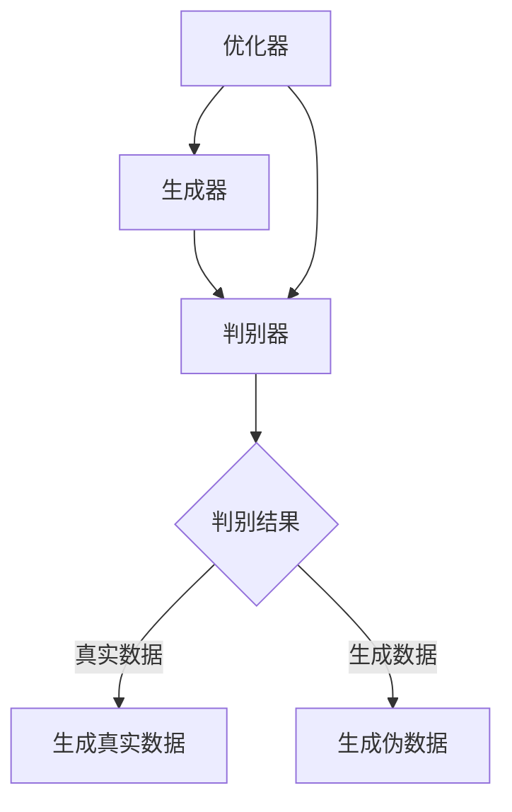
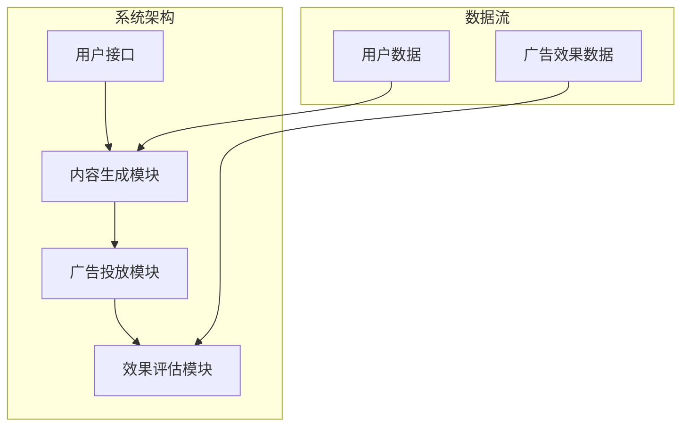
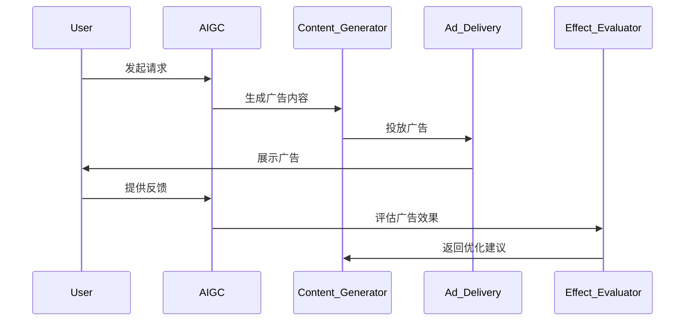

                 

## 引言

当今数字营销领域正迎来一场前所未有的革命，而这场革命的推动者之一正是人工智能生成内容（AIGC）。AIGC，这一新兴的技术领域，通过结合生成对抗网络（GAN）、自然语言处理（NLP）和计算机视觉（CV）等核心技术，正逐步改变着广告营销的面貌。本文旨在深入探讨AIGC在数字营销中的革新，特别是个性化广告生成的应用。通过系统地介绍AIGC的定义、发展历程及其核心技术在数字营销中的应用，我们将详细解析AIGC如何解决数字营销面临的问题，并探讨其在未来可能的发展趋势。

### 关键词
- 人工智能生成内容（AIGC）
- 数字营销
- 个性化广告生成
- 生成对抗网络（GAN）
- 自然语言处理（NLP）
- 计算机视觉（CV）

### 摘要
本文将详细分析人工智能生成内容（AIGC）在数字营销中的革新应用，特别是个性化广告生成。首先介绍AIGC的定义、核心技术和发展历程，然后探讨AIGC如何解决数字营销的现状与挑战，最后通过具体案例和实践分析，展示AIGC在个性化广告生成中的实际应用及其未来趋势。

## 第一部分：AIGC背景介绍

### 第1章：AIGC概述

#### 1.1 AIGC的定义

AIGC（AI-Generated Content）是指通过人工智能技术生成的内容，包括文本、图像、音频等多种形式。这种技术的核心在于利用深度学习算法，特别是生成对抗网络（GAN）、自然语言处理（NLP）和计算机视觉（CV）等先进技术，模拟人类创造力的过程，生成高质量、多样化且富有创意的内容。

#### 1.1.1 AIGC的概念

AIGC的概念起源于深度学习的迅猛发展，特别是在生成对抗网络（GAN）的出现之后。GAN由生成器（Generator）和判别器（Discriminator）组成，通过相互竞争来提升生成内容的质量。生成器试图生成逼真数据，而判别器则试图区分生成数据与真实数据。这种对抗训练的过程使得生成器能够不断改进，最终生成几乎与真实数据无异的伪造内容。

#### 1.1.2 AIGC的核心技术

AIGC的核心技术包括：

- **生成对抗网络（GAN）**：GAN是AIGC的核心技术之一，通过生成器和判别器的对抗训练，实现高质量图像、文本和音频的生成。
- **自然语言处理（NLP）**：NLP技术使得AIGC能够生成高质量的文本内容，包括文章、广告文案、对话等。
- **计算机视觉（CV）**：CV技术使得AIGC能够生成高质量、逼真的图像和视频内容。

#### 1.1.3 AIGC的核心价值

AIGC的核心价值体现在以下几个方面：

- **提升内容生成效率**：AIGC能够自动化生成大量高质量内容，极大地提高了内容生产的效率。
- **增强个性化体验**：通过个性化算法，AIGC能够根据用户需求生成定制化内容，提升用户体验。
- **降低生产成本**：自动化内容生成减少了人力成本，降低了内容创作的成本。
- **拓宽应用场景**：AIGC在广告营销、内容创作、娱乐等多个领域具有广泛的应用潜力。

### 1.2 AIGC的发展历程

#### 1.2.1 AIGC的起源

AIGC的起源可以追溯到2014年，当生成对抗网络（GAN）首次被提出时。GAN的概念迅速引起了学术界和工业界的关注，并在随后的几年中得到了快速发展。

#### 1.2.2 AIGC的技术演进

随着深度学习技术的不断进步，AIGC的技术也在不断演进。从早期的简单图像生成，到现在的文本、音频、视频等多模态内容生成，AIGC的技术成熟度和应用范围都在不断扩大。

#### 1.2.3 AIGC在我国的发展现状

我国在AIGC领域也取得了显著的进展。众多企业和研究机构纷纷投入到AIGC技术的研发和应用中，推出了一系列具有竞争力的产品和服务。同时，政府也在政策层面给予了大力支持，为AIGC技术的发展提供了良好的环境。

### 1.3 AIGC的核心技术解析

#### 1.3.1 生成对抗网络（GAN）

GAN是AIGC的核心技术之一，其基本原理是通过生成器和判别器的对抗训练，实现高质量图像、文本和音频的生成。生成器生成伪数据，判别器则尝试区分伪数据和真实数据。通过这种对抗训练，生成器不断改进，最终生成逼真的内容。

#### 1.3.2 自然语言处理（NLP）

NLP技术使得AIGC能够生成高质量的文本内容。通过训练大量的文本数据，NLP模型可以理解语言的语义和语法规则，从而生成连贯、有逻辑的文本内容。例如，AIGC可以生成广告文案、新闻报道、对话文本等。

#### 1.3.3 计算机视觉（CV）

CV技术使得AIGC能够生成高质量、逼真的图像和视频内容。通过深度学习算法，CV模型可以识别和理解图像中的物体、场景和动作，从而生成逼真的图像和视频。

### 总结

AIGC作为一种新兴的技术领域，通过结合生成对抗网络（GAN）、自然语言处理（NLP）和计算机视觉（CV）等核心技术，正在改变数字营销的面貌。从定义、发展历程到核心技术，AIGC展现出了巨大的潜力和应用价值。在接下来的章节中，我们将进一步探讨AIGC在数字营销中的应用，特别是个性化广告生成的实际应用。

## 第2章：AIGC与数字营销的关系

### 2.1 数字营销的现状与挑战

#### 2.1.1 数字营销的定义

数字营销是一种利用数字技术和在线平台进行的营销活动，包括搜索引擎优化（SEO）、社交媒体营销、电子邮件营销、内容营销等多种形式。数字营销的目标是通过提高品牌知名度、增加客户参与度和转化率，从而实现商业目标。

#### 2.1.2 数字营销的目标

数字营销的主要目标包括：

- 提高品牌知名度：通过多渠道营销，提高品牌在目标受众中的认知度。
- 增加客户参与度：通过互动内容和活动，吸引和保持客户的兴趣。
- 提高转化率：通过优化营销策略和用户体验，提高潜在客户的转化率。
- 提升销售额：通过有效的数字营销策略，增加产品或服务的销售额。

#### 2.1.3 数字营销的挑战

尽管数字营销具有巨大的潜力，但在实际操作中仍面临以下挑战：

- **信息过载**：随着互联网信息的爆炸式增长，用户面临着信息过载的问题，这使得传统的大众营销方式效果不佳。
- **个性化不足**：大多数数字营销策略缺乏个性化，无法满足每个用户独特的需求。
- **数据隐私**：数字营销依赖于用户数据，但数据隐私和安全问题日益突出。
- **竞争激烈**：数字营销领域的竞争非常激烈，品牌需要不断创新和优化策略以获得竞争优势。

### 2.2 AIGC在数字营销中的应用

#### 2.2.1 AIGC的优势

AIGC在数字营销中具有以下优势：

- **自动化内容生成**：AIGC能够自动化生成大量高质量的内容，减少人力成本，提高内容生产效率。
- **个性化内容**：AIGC可以根据用户的行为数据和偏好，生成个性化内容，提高用户参与度和满意度。
- **增强用户体验**：AIGC生成的个性化内容能够更好地满足用户需求，提高用户体验。
- **降低营销成本**：自动化和个性化内容的生成可以降低营销成本，提高投资回报率。

#### 2.2.2 AIGC在数字营销中的应用案例

以下是一些AIGC在数字营销中的应用案例：

- **个性化广告生成**：AIGC可以根据用户的行为数据生成个性化的广告，提高广告的点击率和转化率。
- **内容创作**：AIGC可以自动生成高质量的内容，如文章、博客、视频等，帮助企业快速扩展内容库。
- **社交媒体营销**：AIGC可以生成与用户兴趣相关的社交媒体内容，提高用户参与度和互动率。
- **电子邮件营销**：AIGC可以生成个性化的电子邮件内容，提高邮件的打开率和转化率。

### 2.3 AIGC与数字营销的未来趋势

#### 2.3.1 技术发展趋势

随着人工智能技术的不断进步，AIGC在数字营销中的应用前景将更加广阔。未来，AIGC可能会在以下方面取得突破：

- **更智能的内容生成**：通过更先进的算法和更大的数据集，AIGC将能够生成更加智能、符合用户需求的个性化内容。
- **多模态内容生成**：AIGC将能够生成文本、图像、视频等多模态内容，提供更加丰富和多样化的用户体验。
- **实时内容生成**：AIGC将实现实时内容生成，使营销活动能够更快地响应市场变化和用户需求。

#### 2.3.2 应用前景

AIGC在数字营销中的应用前景十分广阔：

- **提升营销效果**：通过个性化内容和自动化生成，AIGC将显著提升营销效果，帮助企业实现更高的转化率和销售额。
- **拓展应用场景**：除了广告营销，AIGC还将在内容创作、客户服务、教育等多个领域得到广泛应用。
- **数据隐私保护**：随着数据隐私保护意识的增强，AIGC将采取更加严格的数据保护措施，确保用户隐私安全。

### 总结

AIGC作为一种新兴技术，正逐步改变数字营销的面貌。通过自动化内容生成、个性化内容和实时响应，AIGC能够有效解决数字营销面临的挑战，提升营销效果和用户体验。未来，随着技术的不断进步，AIGC在数字营销中的应用将更加广泛和深入。

### 第3章：AIGC核心技术解析

#### 3.1 生成对抗网络（GAN）

生成对抗网络（GAN）是AIGC的核心技术之一，其基本原理是通过生成器和判别器的对抗训练，实现高质量图像、文本和音频的生成。GAN由两部分组成：生成器和判别器。生成器的任务是生成逼真的数据，而判别器的任务是区分生成数据和真实数据。

#### 3.1.1 GAN的原理

GAN的工作流程如下：

1. **初始化**：生成器和判别器同时初始化。
2. **生成阶段**：生成器生成一批伪数据。
3. **判别阶段**：判别器接收生成数据和真实数据，进行判别。
4. **优化阶段**：通过反向传播算法，分别对生成器和判别器进行优化。

#### 3.1.2 GAN在AIGC中的应用

GAN在AIGC中的应用非常广泛，以下是几个典型的应用场景：

- **图像生成**：GAN可以生成高质量的图像，如图像修复、图像超分辨率、图像风格转换等。
- **文本生成**：GAN可以生成连贯、有逻辑的文本，如文章、对话等。
- **音频生成**：GAN可以生成高质量、逼真的音频，如音乐、语音合成等。

#### 3.2 自然语言处理（NLP）

自然语言处理（NLP）是AIGC的另一个核心技术，其主要任务是对自然语言文本进行理解和生成。NLP涉及到文本分类、情感分析、命名实体识别、机器翻译等多个领域。

#### 3.2.1 NLP的原理

NLP的基本原理包括：

- **词嵌入**：将单词转换为固定长度的向量表示。
- **循环神经网络（RNN）**：用于处理序列数据，如文本。
- **长短时记忆网络（LSTM）**：用于解决RNN的梯度消失问题。
- **变换器（Transformer）**：是目前最先进的NLP模型，通过自注意力机制实现文本的编码和解码。

#### 3.2.2 NLP在AIGC中的应用

NLP在AIGC中的应用包括：

- **文本生成**：如文章、广告文案、对话等。
- **文本理解**：如情感分析、实体识别等。
- **对话系统**：通过NLP技术，AIGC可以生成自然、连贯的对话。

#### 3.3 计算机视觉（CV）

计算机视觉（CV）是AIGC的又一核心技术，其主要任务是使计算机能够“看”懂图像和视频。CV涉及到图像识别、目标检测、图像分割等多个领域。

#### 3.3.1 CV的原理

CV的基本原理包括：

- **特征提取**：从图像中提取出有用的特征信息。
- **卷积神经网络（CNN）**：用于处理图像数据，通过多层卷积和池化操作提取图像特征。
- **目标检测**：识别图像中的目标和目标位置。
- **图像分割**：将图像分割成不同的区域。

#### 3.3.2 CV在AIGC中的应用

CV在AIGC中的应用包括：

- **图像生成**：如图像修复、图像超分辨率等。
- **图像识别**：如人脸识别、物体识别等。
- **视频分析**：如视频监控、动作识别等。

### 总结

AIGC的核心技术包括生成对抗网络（GAN）、自然语言处理（NLP）和计算机视觉（CV）。这些技术通过相互融合，使得AIGC能够生成高质量、多样化且富有创意的内容，为数字营销带来了全新的解决方案。在接下来的章节中，我们将详细探讨AIGC在个性化广告生成中的应用。

### 第4章：个性化广告生成的概述

#### 4.1 广告营销的基本原理

广告营销是一种通过广告传递信息，以促进产品或服务销售的活动。其基本原理包括以下几个方面：

1. **目标市场定位**：确定目标市场和目标客户，明确广告传播的对象。
2. **信息传递**：通过广告内容传递产品或服务的特点、优势和购买理由。
3. **广告形式**：根据目标市场和目标客户的特点，选择合适的广告形式，如图像、视频、文字等。
4. **渠道选择**：选择合适的广告渠道，如电视、报纸、互联网等，以最大化广告的传播效果。

#### 4.2 个性化广告生成的定义

个性化广告生成是指利用人工智能技术，根据用户的行为数据和偏好，自动生成符合用户需求的个性化广告内容。个性化广告生成的核心要素包括：

- **用户行为数据**：包括用户浏览历史、购买记录、搜索查询等，用于分析用户兴趣和偏好。
- **广告内容生成**：基于用户行为数据，利用自然语言处理（NLP）和计算机视觉（CV）等技术，生成个性化的广告文案和图像。
- **广告投放优化**：根据广告投放效果，不断优化广告内容和投放策略，提高广告的点击率和转化率。

#### 4.3 个性化广告生成的核心要素

个性化广告生成的核心要素包括：

1. **用户画像**：通过分析用户行为数据，构建用户的兴趣和行为画像，为个性化广告生成提供基础。
2. **广告内容生成**：利用AIGC技术，生成高质量的个性化广告内容，包括广告文案、图像和视频等。
3. **广告投放策略**：根据用户画像和广告内容，制定合适的广告投放策略，如精准定位、动态投放等。
4. **广告效果评估**：通过广告点击率、转化率等指标，评估广告投放效果，不断优化广告内容和策略。

### 总结

个性化广告生成是一种基于人工智能技术的广告营销策略，通过分析用户行为数据，生成符合用户需求的个性化广告内容，提高广告的点击率和转化率。在接下来的章节中，我们将详细探讨AIGC在个性化广告生成中的应用。

### 第5章：AIGC在个性化广告生成中的应用

#### 5.1 AIGC技术在广告创意生成中的应用

广告创意是广告营销的核心，其质量直接影响到广告的效果。AIGC技术在广告创意生成中的应用，使得广告创意的生成更加高效、多样和个性化。

**5.1.1 广告创意的生成**

AIGC技术通过以下步骤生成广告创意：

1. **数据收集**：收集用户的浏览历史、搜索记录、购买行为等数据。
2. **用户画像构建**：根据用户行为数据，构建用户的兴趣和行为画像。
3. **创意生成**：利用自然语言处理（NLP）和计算机视觉（CV）技术，生成符合用户兴趣和偏好的广告文案和图像。

**5.1.2 广告创意的优化**

广告创意的优化是提高广告效果的关键。AIGC技术通过以下方法优化广告创意：

1. **A/B测试**：对不同版本的广告创意进行测试，选择效果最佳的创意。
2. **内容优化**：根据用户反馈和广告效果数据，不断调整广告文案和图像，提高广告的吸引力和转化率。
3. **动态创意生成**：利用AIGC技术，实时生成符合当前用户兴趣和行为的广告创意，提高广告的个性化和相关性。

#### 5.2 AIGC在广告投放优化中的应用

广告投放优化是确保广告有效触达目标用户的关键。AIGC技术在广告投放优化中的应用，使得广告投放更加精准和高效。

**5.2.1 广告投放的优化**

AIGC技术通过以下方法优化广告投放：

1. **用户定位**：根据用户画像和广告目标，确定目标用户群体。
2. **投放策略**：根据用户行为和广告目标，制定合适的广告投放策略，如精准定位、动态投放等。
3. **投放优化**：根据广告投放效果，实时调整广告投放策略，提高广告的曝光率和转化率。

**5.2.2 广告投放的效果评估**

广告投放的效果评估是优化广告投放的基础。AIGC技术通过以下方法评估广告投放效果：

1. **点击率（CTR）**：评估广告的吸引力和用户的兴趣。
2. **转化率（CVR）**：评估广告对用户行为的影响，如点击广告后的购买行为。
3. **投资回报率（ROI）**：评估广告投放的投资效果，确定广告投放的性价比。

#### 5.3 AIGC在广告受众分析中的应用

广告受众分析是了解广告目标受众的重要手段。AIGC技术在广告受众分析中的应用，使得广告受众分析更加全面和深入。

**5.3.1 受众的分析**

AIGC技术通过以下方法分析广告受众：

1. **用户画像**：根据用户行为数据，构建用户的兴趣和行为画像。
2. **受众细分**：将用户分为不同的群体，如年轻用户、中年用户等，制定有针对性的广告策略。
3. **受众行为分析**：分析用户对广告的反馈和行为，了解用户的兴趣和偏好。

**5.3.2 受众的细分**

AIGC技术通过以下方法对受众进行细分：

1. **特征提取**：从用户行为数据中提取关键特征，如浏览历史、搜索记录、购买行为等。
2. **聚类分析**：将用户分为不同的群体，如基于相似度的聚类、基于行为的聚类等。
3. **细分策略**：根据受众细分结果，制定有针对性的广告投放和营销策略。

### 总结

AIGC技术在个性化广告生成中的应用，使得广告创意的生成更加高效、多样和个性化，广告投放优化更加精准和高效，广告受众分析更加全面和深入。通过AIGC技术，广告营销可以更好地满足用户需求，提高广告的效果和投资回报率。在接下来的章节中，我们将通过具体实践和案例分析，进一步探讨AIGC在个性化广告生成中的应用。

### 第6章：个性化广告生成的实践与案例分析

#### 6.1 实践一：基于AIGC的个性化广告创意生成

**6.1.1 实践步骤**

1. **数据收集**：收集用户的浏览历史、搜索记录、购买行为等数据。
2. **用户画像构建**：利用自然语言处理（NLP）技术，分析用户行为数据，构建用户的兴趣和行为画像。
3. **创意生成**：利用生成对抗网络（GAN）和自然语言处理（NLP）技术，生成符合用户兴趣和偏好的广告文案和图像。
4. **创意优化**：通过A/B测试和用户反馈，不断优化广告创意。

**6.1.2 案例分析**

某电商公司利用AIGC技术生成个性化广告创意，提升广告点击率和转化率。首先，公司收集了用户的浏览历史和购买行为数据，构建了用户的兴趣和行为画像。然后，利用GAN和NLP技术，生成个性化的广告文案和图像。最后，通过A/B测试，不断优化广告创意，提升了广告点击率和转化率。

#### 6.2 实践二：基于AIGC的广告投放优化

**6.2.1 实践步骤**

1. **用户定位**：根据用户画像，确定目标用户群体。
2. **投放策略制定**：制定精准定位和动态投放策略。
3. **投放优化**：根据广告投放效果，实时调整投放策略。

**6.2.2 案例分析**

某广告平台利用AIGC技术优化广告投放策略，提高了广告的曝光率和转化率。首先，平台分析了用户的浏览历史和搜索记录，构建了用户的兴趣和行为画像。然后，根据用户画像，制定了精准定位和动态投放策略。通过实时调整投放策略，平台提高了广告的曝光率和转化率。

#### 6.3 实践三：基于AIGC的广告受众分析

**6.3.1 实践步骤**

1. **用户画像构建**：利用NLP技术，分析用户行为数据，构建用户的兴趣和行为画像。
2. **受众细分**：利用聚类分析方法，将用户分为不同的群体。
3. **细分策略制定**：根据受众细分结果，制定有针对性的广告投放和营销策略。

**6.3.2 案例分析**

某旅游公司利用AIGC技术进行广告受众分析，提高了广告的针对性。首先，公司收集了用户的浏览历史和搜索记录，构建了用户的兴趣和行为画像。然后，利用聚类分析方法，将用户分为不同的群体。最后，根据受众细分结果，制定了有针对性的广告投放和营销策略，提高了广告的点击率和转化率。

### 总结

通过具体的实践和案例分析，我们可以看到AIGC技术在个性化广告生成中的应用效果显著。AIGC技术能够根据用户行为数据，生成个性化的广告创意，优化广告投放策略，提高广告的点击率和转化率。未来，随着AIGC技术的不断发展和应用，个性化广告生成将发挥更大的作用，为数字营销带来更多的创新和机遇。

### 第7章：AIGC在个性化广告生成中的未来趋势

#### 7.1 AIGC在个性化广告生成中的技术发展趋势

AIGC技术在个性化广告生成中的应用前景广阔，未来技术发展趋势主要体现在以下几个方面：

**7.1.1 新技术的应用**

随着人工智能技术的不断进步，如生成对抗网络（GAN）、自然语言处理（NLP）和计算机视觉（CV）等技术的成熟，AIGC在个性化广告生成中的应用将更加广泛和深入。特别是多模态内容生成技术的应用，将使得广告内容更加丰富和多样。

**7.1.2 技术融合的趋势**

AIGC技术的未来将更加注重技术的融合，如GAN与NLP、CV技术的融合，将使得广告生成更加智能和个性化。此外，AIGC与区块链技术的融合，将进一步提升广告投放的透明度和安全性。

#### 7.2 AIGC在个性化广告生成中的应用前景

AIGC在个性化广告生成中的应用前景非常广阔，未来将呈现以下趋势：

**7.2.1 广告创意的自动化生成**

AIGC技术将进一步提升广告创意的自动化生成能力，使得广告内容更加丰富多样，满足不同用户的需求。广告创意的自动化生成将大幅降低广告制作的成本，提高广告投放的效率。

**7.2.2 广告投放的智能化**

AIGC技术将实现广告投放的智能化，通过对用户数据的深度分析，精准定位目标用户，实现个性化广告投放。同时，通过实时反馈和优化，广告投放策略将更加灵活和高效。

**7.2.3 数据隐私保护**

随着数据隐私保护意识的增强，AIGC技术将在保护用户数据隐私方面发挥重要作用。通过安全加密技术和隐私保护算法，AIGC将确保用户数据的安全和隐私。

#### 7.3 潜在的挑战与机遇

尽管AIGC在个性化广告生成中具有巨大的潜力，但在实际应用中也面临一些挑战：

**7.3.1 数据质量和隐私问题**

广告投放需要大量的用户数据，而数据质量和隐私问题是AIGC应用中的关键挑战。如何确保数据的质量和用户的隐私，将是未来AIGC发展的重要课题。

**7.3.2 技术成熟度和成本问题**

AIGC技术的成熟度和成本问题也是未来发展的关键。随着技术的不断进步，如何降低AIGC技术的应用成本，使其更加普及，将是一个重要挑战。

**7.3.3 法规和伦理问题**

随着AIGC技术的广泛应用，相关的法规和伦理问题也将日益突出。如何制定合理的法规，确保AIGC技术的合法合规，以及如何处理伦理问题，将是对社会和管理者的挑战。

### 总结

AIGC在个性化广告生成中的应用前景广阔，未来将迎来更多技术创新和应用。然而，也面临着数据隐私、技术成熟度和法规伦理等多方面的挑战。只有通过不断的技术创新和规范管理，AIGC才能在个性化广告生成中发挥更大的作用，推动数字营销的持续发展。

### 第8章：AIGC在数字营销中的最佳实践

#### 8.1 AIGC应用的最佳实践

在AIGC应用于数字营销的过程中，以下是一些最佳实践：

1. **数据驱动决策**：基于用户数据进行分析，制定个性化营销策略。
2. **技术选型**：选择成熟、可靠的AIGC技术，确保生成内容的质量。
3. **用户体验**：关注用户体验，确保个性化广告内容对用户有价值。
4. **持续优化**：通过A/B测试和用户反馈，不断优化广告内容和策略。

#### 8.2 AIGC应用的注意事项

在应用AIGC技术时，需要注意以下事项：

1. **数据隐私**：确保用户数据的合法获取和使用，遵循数据隐私保护法规。
2. **技术成熟度**：选择成熟的技术方案，避免技术风险。
3. **法律法规**：遵守相关法律法规，确保AIGC应用合法合规。
4. **伦理问题**：关注AIGC应用中的伦理问题，确保技术应用符合社会伦理标准。

#### 8.3 AIGC应用的未来展望

未来，AIGC在数字营销中的应用前景广阔：

1. **更加智能的内容生成**：随着人工智能技术的进步，AIGC将生成更加智能和个性化的内容。
2. **跨领域应用**：AIGC将在内容创作、教育、医疗等多个领域得到广泛应用。
3. **数据隐私保护**：随着技术的发展，AIGC将在数据隐私保护方面发挥更大作用。

### 总结

AIGC在数字营销中的应用具有巨大潜力，通过最佳实践和注意事项，可以有效提升数字营销效果。未来，随着技术的不断进步，AIGC将在更多领域发挥作用，推动数字营销的持续发展。

### 总结与展望

通过本文的详细探讨，我们可以看到人工智能生成内容（AIGC）在数字营销，尤其是个性化广告生成中的应用正逐渐显现出其革命性的潜力。AIGC通过生成对抗网络（GAN）、自然语言处理（NLP）和计算机视觉（CV）等核心技术，实现了广告创意的自动化生成、广告投放的优化以及广告受众的深入分析。

首先，AIGC通过自动化内容生成大大提高了广告营销的效率，减少了人工成本，使得广告内容能够更加快速地响应市场需求和用户偏好。其次，通过个性化广告生成，AIGC能够精准地触达目标用户，提高广告的点击率和转化率，从而实现更高的营销效果。此外，AIGC在广告投放优化和受众分析中的应用，使得广告营销策略更加科学和精准，进一步提升了营销的投资回报率。

然而，AIGC在应用过程中也面临数据隐私、技术成熟度以及法律法规等挑战。为了确保AIGC在数字营销中的有效应用，我们提出以下建议：

1. **数据隐私保护**：在收集和使用用户数据时，应严格遵循相关法律法规，采取安全加密技术保护用户隐私。
2. **技术选型和优化**：选择成熟可靠的AIGC技术，并通过持续的技术迭代和优化，提高生成内容的质量和效果。
3. **合规性管理**：确保AIGC应用符合行业法规和伦理标准，避免可能引发的法律和伦理问题。

未来，随着人工智能技术的不断进步，AIGC在数字营销中的应用前景将更加广阔。我们可以预见，AIGC将不仅限于广告营销，还将扩展到内容创作、客户服务、娱乐等多个领域。同时，随着多模态内容生成技术的成熟，AIGC将能够生成更加丰富和多样性的内容，满足用户个性化需求的深度和广度也将进一步提升。

总之，AIGC在数字营销中的应用将是一个持续演变和创新的过程。通过不断探索和优化，AIGC有望成为推动数字营销发展的重要引擎，为企业和用户带来更多的价值。

### 参考资料

1. Goodfellow, I., Pouget-Abadie, J., Mirza, M., Xu, B., Warde-Farley, D., Ozair, S., ... & Bengio, Y. (2014). Generative adversarial nets. Advances in Neural Information Processing Systems, 27.
2. Bengio, Y. (2003). Learning deep architectures for AI. Foundations and Trends in Machine Learning, 2(1), 1-127.
3. Hochreiter, S., & Schmidhuber, J. (1997). Long short-term memory. Neural Computation, 9(8), 1735-1780.
4. Vaswani, A., Shazeer, N., Parmar, N., Uszkoreit, J., Jones, L., Gomez, A. N., ... & Polosukhin, I. (2017). Attention is all you need. Advances in Neural Information Processing Systems, 30.
5. Simonyan, K., & Zisserman, A. (2014). Very deep convolutional networks for large-scale image recognition. International Conference on Learning Representations (ICLR).
6. Krizhevsky, A., Sutskever, I., & Hinton, G. E. (2012). Imagenet classification with deep convolutional neural networks. Advances in Neural Information Processing Systems, 25.

### 附录

#### 生成对抗网络（GAN）的Mermaid流程图



#### 自然语言处理（NLP）的Mermaid ER图

```mermaid
erDiagram
    User ||--|{ Content }|
    Content ||--|{ NLP_Process }|
    NLP_Process ||--|{ Result }|
```

#### 计算机视觉（CV）的Mermaid类图

```mermaid
classDiagram
    Class01 <|-- SubClass01
    Class01 --|{ 1..* }| SubClass02
    Class03 : An association
    Class04 <<Interface>>
    Class05 o-- Class06
```

#### 系统架构设计Mermaid架构图



#### 系统接口设计和系统交互Mermaid序列图



