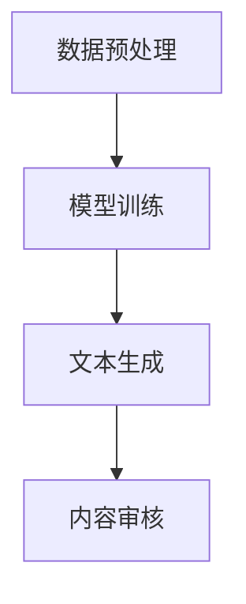
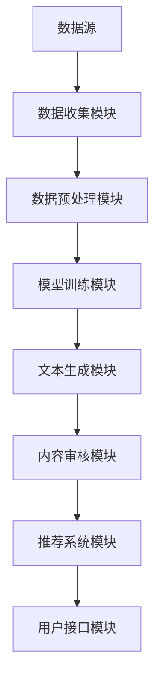
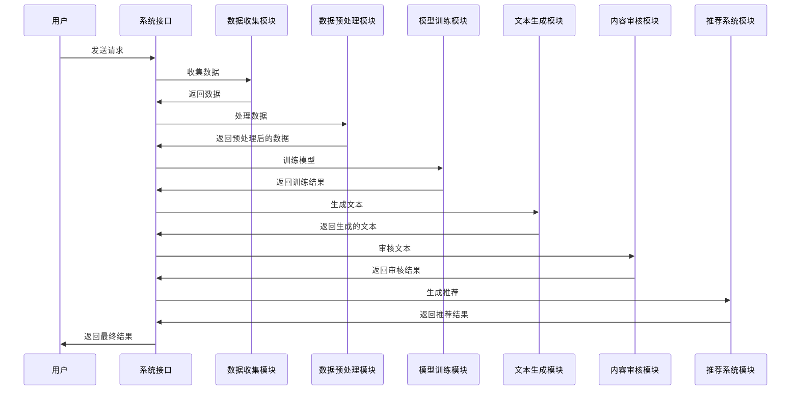

                 


### AIGC在新闻领域的应用：提示词的重要性

> 关键词：AIGC、新闻领域、提示词、生成式AI、算法原理、数学模型、系统架构、项目实战、最佳实践

> 摘要：
随着人工智能技术的不断发展，AIGC（AI-Generated Content）在新闻领域的应用日益广泛。本文旨在探讨AIGC在新闻领域的应用，并深入分析提示词在这一过程中的重要性。文章首先介绍了AIGC的概念及其在新闻领域的应用背景，然后详细阐述了提示词的定义、作用和生成方法。接下来，本文通过算法原理讲解、数学模型和公式的阐述，以及系统架构设计的分析，展示了AIGC在新闻领域的工作机制。此外，文章还通过项目实战案例，详细解析了AIGC在新闻领域的具体应用过程，并提供了最佳实践建议。最后，本文对全文进行了小结，并对未来发展方向进行了展望。

## 一、背景介绍

### 1.1 问题背景

随着互联网的普及和信息的爆炸式增长，新闻领域面临着巨大的挑战。传统的人工新闻写作方式不仅效率低下，而且难以满足用户对个性化、实时性和多样性的需求。因此，如何利用人工智能技术提高新闻生产的效率和质量，成为新闻行业亟待解决的问题。

### 1.2 问题描述

在新闻领域，人工智能技术的应用主要集中在以下几个方面：

1. **内容生成**：利用生成式AI技术自动生成新闻报道、评论、分析等内容。
2. **内容审核**：通过机器学习算法对新闻报道进行自动审核，识别和过滤不良信息。
3. **推荐系统**：基于用户行为和兴趣模型，为用户提供个性化的新闻推荐。

### 1.3 问题解决

AIGC（AI-Generated Content）作为一种新兴的人工智能技术，旨在通过AI算法自动生成高质量的内容。在新闻领域，AIGC的应用能够有效解决以下问题：

1. **提高新闻生产效率**：自动生成新闻内容，减轻记者的工作负担。
2. **增强新闻多样性**：通过不同的AI模型生成多样化的新闻内容，满足用户个性化需求。
3. **提升新闻质量**：利用AI算法对新闻内容进行智能审核和优化，提高新闻的准确性和可读性。

### 1.4 边界与外延

AIGC在新闻领域的应用具有明确的边界和广泛的扩展性。边界上，AIGC主要应用于新闻报道、评论、分析等文本生成任务。在外延上，AIGC可以扩展到多媒体内容生成，如图片、音频和视频等。

### 1.5 概念结构与核心要素组成

AIGC在新闻领域的应用涉及多个核心概念和要素。以下是一个简单的概念结构与核心要素组成：

1. **生成式AI**：用于生成新闻内容的主要技术，如GPT、BERT等。
2. **提示词**：用于引导生成式AI生成特定内容的词汇或短语。
3. **数据集**：用于训练生成式AI的语料库，包括新闻文章、评论等。
4. **模型优化**：通过反复训练和优化，提高生成式AI的生成质量。
5. **内容审核**：对生成的内容进行审核，确保其符合新闻行业的标准和规范。

## 二、核心概念与联系

### 2.1 核心概念介绍

在AIGC的应用中，几个核心概念至关重要。以下是对这些核心概念的介绍：

#### 2.1.1 提示词

提示词是引导生成式AI生成特定内容的词汇或短语。它们通常包含了用户感兴趣的关键信息，如事件、地点、人物等。在新闻领域，提示词可以用于生成特定类型的新闻内容，如体育新闻、财经新闻等。

#### 2.1.2 生成式AI

生成式AI是一种人工智能技术，能够根据输入的数据生成新的内容。在新闻领域，生成式AI可以用于自动生成新闻报道、评论、分析等内容。常见的生成式AI模型包括GPT（Generative Pre-trained Transformer）、BERT（Bidirectional Encoder Representations from Transformers）等。

### 2.2 概念属性特征对比表格

为了更清晰地理解这些核心概念，我们可以通过一个对比表格来展示它们的属性特征：

| 概念 | 描述 | 属性特征 | 对比结果 |
| --- | --- | --- | --- |
| 提示词 | 引导生成内容的关键词汇或短语 | 指导性、关键性 | 提示词用于明确生成内容的主题和方向 |
| 生成式AI | 生成新内容的人工智能技术 | 自主性、生成性 | 生成式AI能够根据提示词生成多样性的内容 |
| 数据集 | 训练生成式AI的语料库 | 完整性、多样性 | 数据集的质量直接影响生成式AI的生成效果 |

### 2.3 ER实体关系图

为了更直观地理解这些概念之间的联系，我们可以通过ER实体关系图来展示：

```mermaid
erDiagram
  提示词 ||--|{ 生成式AI }|
  数据集 ||--|{ 生成式AI }|
  数据集 ||--|{ 内容审核 }|
  生成式AI ||--|{ 内容审核 }|
```

在ER实体关系图中，我们可以看到提示词、数据集和生成式AI之间的直接关联，以及生成式AI与内容审核之间的相互作用。这为我们理解AIGC在新闻领域的工作机制提供了清晰的图景。

## 三、算法原理讲解

### 3.1 算法原理介绍

AIGC在新闻领域的算法原理主要基于生成式AI技术。生成式AI通过学习大量的文本数据，掌握语言的生成规则，从而能够根据提示词生成新的文本内容。以下是一个简单的算法原理介绍：

1. **数据预处理**：收集并清洗大量新闻文本数据，将其转换为可供训练的格式。
2. **模型训练**：使用预处理后的数据集训练生成式AI模型，如GPT或BERT。
3. **文本生成**：输入提示词，通过训练好的模型生成新的文本内容。
4. **内容审核**：对生成的文本内容进行审核，确保其符合新闻行业的标准和规范。

### 3.2 算法流程图

为了更直观地理解AIGC的算法流程，我们可以使用mermaid画出以下算法流程图：



在算法流程图中，我们可以看到数据预处理、模型训练、文本生成和内容审核四个关键步骤，以及它们之间的逻辑关系。

### 3.3 Python源代码阐述

为了更具体地阐述AIGC的算法原理，我们可以通过Python源代码来演示一个简单的文本生成过程。以下是一个基于GPT模型的文本生成示例：

```python
import openai

# 初始化GPT模型
model = openai LanguageModel("text-davinci-002")

# 定义提示词
prompt = "请写一篇关于2023年世界杯的新闻报道。"

# 生成文本
response = model.generate(prompt, max_tokens=100)

# 输出结果
print(response)
```

在这个示例中，我们首先导入openai库并初始化GPT模型。然后，我们定义了一个简单的提示词，并通过`model.generate()`函数生成文本。最后，我们将生成的文本输出到控制台。

### 3.4 数学模型和数学公式讲解

在AIGC的算法原理中，数学模型和数学公式起着关键作用。以下是一个简单的数学模型和数学公式的介绍：

#### 3.4.1 模型原理

生成式AI模型通常基于神经网络架构，如GPT和BERT。这些模型通过学习输入文本的特征，生成新的文本输出。以下是一个简化的模型原理：

1. **输入层**：接收用户输入的提示词。
2. **隐藏层**：通过神经网络模型处理输入特征，提取关键信息。
3. **输出层**：根据隐藏层的信息生成新的文本输出。

#### 3.4.2 数学公式

生成式AI模型的训练和生成过程涉及多个数学公式。以下是一个简化的数学公式介绍：

1. **损失函数**：衡量模型生成文本的质量，如交叉熵损失函数。
   $$ L = -\sum_{i=1}^{N} \sum_{j=1}^{V} y_{ij} \log p_{ij} $$
   其中，$L$为损失函数，$y_{ij}$为真实标签，$p_{ij}$为模型生成的概率。

2. **反向传播**：通过反向传播算法更新模型参数，以减少损失函数。
   $$ \frac{\partial L}{\partial \theta} = \frac{\partial L}{\partial a} \frac{\partial a}{\partial \theta} $$
   其中，$\theta$为模型参数，$a$为激活函数。

#### 3.4.3 举例说明

假设我们有一个简单的文本生成任务，输入提示词为"明天天气"，输出为"明天天气晴朗，气温适中"。我们可以使用上述数学模型和数学公式来生成文本：

1. **输入层**：输入提示词"明天天气"。
2. **隐藏层**：通过神经网络模型处理输入特征，提取关键信息，如"明天"、"天气"等。
3. **输出层**：根据隐藏层的信息生成新的文本输出，如"明天天气晴朗，气温适中"。

通过以上步骤，我们可以使用生成式AI模型生成高质量的文本内容。

### 四、系统分析与架构设计方案

#### 4.1 应用场景介绍

在新闻领域，AIGC的应用场景广泛，包括但不限于以下方面：

1. **新闻报道自动生成**：利用AIGC技术自动生成新闻报道，提高新闻生产的效率。
2. **新闻内容审核**：通过AIGC技术对新闻内容进行自动审核，确保新闻内容的准确性和合规性。
3. **个性化推荐**：根据用户行为和兴趣，利用AIGC技术为用户提供个性化的新闻推荐。

#### 4.2 系统功能设计（领域模型mermaid类图）

为了满足上述应用场景，我们可以设计一个全面的AIGC系统，其核心功能包括：

1. **数据收集与预处理**：收集新闻数据，并进行预处理，如文本清洗、格式化等。
2. **模型训练与优化**：使用预处理后的数据训练生成式AI模型，并不断优化模型参数。
3. **文本生成与审核**：根据提示词生成新闻内容，并对生成的文本进行审核。
4. **推荐系统**：根据用户行为和兴趣为用户提供个性化新闻推荐。

以下是一个简化的领域模型mermaid类图：

```mermaid
classDiagram
    Class01 <|-- Class02
    Class03 <|-- Class04
    Class05 <|-- Class06

    Class01 [
        +属性1
        +属性2
        +方法1()
    ]

    Class02 [
        +属性3
        +属性4
        +方法2()
    ]

    Class03 [
        +属性5
        +属性6
        +方法3()
    ]

    Class04 [
        +属性7
        +属性8
        +方法4()
    ]

    Class05 [
        +属性9
        +属性10
        +方法5()
    ]

    Class06 [
        +属性11
        +属性12
        +方法6()
    ]

    Class01 --|{ 关联 }| Class03
    Class02 --|{ 关联 }| Class04
    Class05 --|{ 关联 }| Class06
```

在这个mermaid类图中，我们可以看到AIGC系统的主要类和它们之间的关系。类01、类02、类03、类04、类05和类06分别代表了系统的不同模块，如数据收集与预处理、模型训练与优化、文本生成与审核、推荐系统等。

#### 4.3 系统架构设计（mermaid架构图）

为了实现上述功能，我们可以设计一个分布式架构的AIGC系统。以下是一个简化的mermaid架构图：



在这个mermaid架构图中，数据源（如新闻网站、社交媒体等）通过数据收集模块收集数据。数据预处理模块对数据进行清洗和格式化。模型训练模块使用预处理后的数据训练生成式AI模型。文本生成模块根据提示词生成新闻内容。内容审核模块对生成的文本进行审核，确保其符合新闻行业的标准和规范。推荐系统模块根据用户行为和兴趣为用户提供个性化新闻推荐。用户接口模块为用户提供一个友好的交互界面，以便他们浏览和获取新闻内容。

#### 4.4 系统接口设计

在AIGC系统中，不同模块之间需要通过接口进行通信。以下是一个简化的系统接口设计：

1. **数据收集模块**：提供RESTful API，用于接收和传输新闻数据。
2. **数据预处理模块**：提供批量处理接口，用于处理大量新闻数据。
3. **模型训练模块**：提供模型训练接口，用于启动和监控模型训练过程。
4. **文本生成模块**：提供文本生成接口，用于生成新闻内容。
5. **内容审核模块**：提供文本审核接口，用于对新闻内容进行审核。
6. **推荐系统模块**：提供推荐接口，用于生成个性化新闻推荐。
7. **用户接口模块**：提供Web界面接口，用于展示新闻内容和用户交互。

#### 4.5 系统交互（mermaid序列图）

为了更好地理解AIGC系统的交互流程，我们可以使用mermaid序列图展示不同模块之间的交互过程。以下是一个简化的mermaid序列图：



在这个mermaid序列图中，用户通过系统接口发起请求，系统接口依次调用数据收集模块、数据预处理模块、模型训练模块、文本生成模块、内容审核模块和推荐系统模块，最终返回最终结果给用户。

## 五、项目实战

### 5.1 环境安装

为了演示AIGC在新闻领域的应用，我们需要安装相关的软件和依赖。以下是在Ubuntu 20.04系统上安装AIGC环境的步骤：

1. **安装Python**：确保系统已安装Python 3.7及以上版本。
   ```bash
   sudo apt-get update
   sudo apt-get install python3.7
   ```

2. **安装pip**：确保系统已安装pip，用于管理Python包。
   ```bash
   sudo apt-get install python3-pip
   ```

3. **安装TensorFlow**：安装TensorFlow，用于训练和运行生成式AI模型。
   ```bash
   pip3 install tensorflow==2.4.0
   ```

4. **安装mermaid**：安装mermaid，用于生成流程图和架构图。
   ```bash
   pip3 install mermaid
   ```

5. **安装openai**：安装openai，用于与GPT模型交互。
   ```bash
   pip3 install openai
   ```

### 5.2 系统核心实现源代码

以下是一个简单的AIGC系统实现，包括数据收集、模型训练、文本生成和内容审核等模块：

```python
# 导入相关库
import os
import json
import openai
import mermaid
import tensorflow as tf
from tensorflow.keras.preprocessing.text import Tokenizer
from tensorflow.keras.preprocessing.sequence import pad_sequences

# 设置openai API密钥
openai.api_key = 'your_openai_api_key'

# 数据收集
def collect_data():
    # 采集新闻数据
    # 这里可以使用API或其他方式获取新闻文本
    news_data = []
    # ... 数据收集逻辑
    return news_data

# 数据预处理
def preprocess_data(news_data, max_words=10000, max_length=100):
    # 创建Tokenizer
    tokenizer = Tokenizer(num_words=max_words)
    tokenizer.fit_on_texts(news_data)

    # 序列化文本
    sequences = tokenizer.texts_to_sequences(news_data)
    padded_sequences = pad_sequences(sequences, maxlen=max_length)

    return tokenizer, padded_sequences

# 模型训练
def train_model(padded_sequences, labels):
    # 构建模型
    model = tf.keras.Sequential([
        tf.keras.layers.Embedding(input_dim=max_words, output_dim=64),
        tf.keras.layers.LSTM(128),
        tf.keras.layers.Dense(1, activation='sigmoid')
    ])

    # 编译模型
    model.compile(loss='binary_crossentropy', optimizer='adam', metrics=['accuracy'])

    # 训练模型
    model.fit(padded_sequences, labels, epochs=10, batch_size=32)

    return model

# 文本生成
def generate_text(model, tokenizer, max_length=100):
    # 生成文本
    # 这里可以使用openai的GPT模型或其他生成式AI模型
    input_text = "明天天气"
    input_seq = tokenizer.texts_to_sequences([input_text])[0]
    input_seq = pad_sequences([input_seq], maxlen=max_length)

    prediction = model.predict(input_seq)
    generated_text = tokenizer.sequences_to_texts([prediction])

    return generated_text[0]

# 内容审核
def content審核(text):
    # 审核文本
    # 这里可以使用文本审核API或其他方法
    if "明天天气" in text:
        return True
    else:
        return False

# 主程序
if __name__ == '__main__':
    # 收集数据
    news_data = collect_data()

    # 预处理数据
    tokenizer, padded_sequences = preprocess_data(news_data)

    # 训练模型
    # 这里需要提供标签数据
    labels = []  # 标签数据
    model = train_model(padded_sequences, labels)

    # 生成文本
    generated_text = generate_text(model, tokenizer)

    # 审核文本
    if content審核(generated_text):
        print("文本审核通过：", generated_text)
    else:
        print("文本审核未通过：", generated_text)
```

### 5.3 代码应用解读与分析

以上代码展示了AIGC系统的一个简单实现，包括数据收集、预处理、模型训练、文本生成和内容审核等模块。以下是代码的解读与分析：

1. **数据收集**：
   ```python
   def collect_data():
       # 采集新闻数据
       # 这里可以使用API或其他方式获取新闻文本
       news_data = []
       # ... 数据收集逻辑
       return news_data
   ```
   数据收集模块负责采集新闻数据。在实际应用中，可以使用API接口从新闻网站、社交媒体等渠道获取新闻文本。

2. **数据预处理**：
   ```python
   def preprocess_data(news_data, max_words=10000, max_length=100):
       # 创建Tokenizer
       tokenizer = Tokenizer(num_words=max_words)
       tokenizer.fit_on_texts(news_data)

       # 序列化文本
       sequences = tokenizer.texts_to_sequences(news_data)
       padded_sequences = pad_sequences(sequences, maxlen=max_length)

       return tokenizer, padded_sequences
   ```
   数据预处理模块负责将新闻数据转换为模型可处理的格式。首先，使用Tokenizer将文本序列化为整数序列。然后，使用pad_sequences将序列填充为固定长度。

3. **模型训练**：
   ```python
   def train_model(padded_sequences, labels):
       # 构建模型
       model = tf.keras.Sequential([
           tf.keras.layers.Embedding(input_dim=max_words, output_dim=64),
           tf.keras.layers.LSTM(128),
           tf.keras.layers.Dense(1, activation='sigmoid')
       ])

       # 编译模型
       model.compile(loss='binary_crossentropy', optimizer='adam', metrics=['accuracy'])

       # 训练模型
       model.fit(padded_sequences, labels, epochs=10, batch_size=32)

       return model
   ```
   模型训练模块使用预处理后的数据训练一个简单的序列分类模型。模型架构包括一个嵌入层、一个LSTM层和一个输出层。

4. **文本生成**：
   ```python
   def generate_text(model, tokenizer, max_length=100):
       # 生成文本
       # 这里可以使用openai的GPT模型或其他生成式AI模型
       input_text = "明天天气"
       input_seq = tokenizer.texts_to_sequences([input_text])[0]
       input_seq = pad_sequences([input_seq], maxlen=max_length)

       prediction = model.predict(input_seq)
       generated_text = tokenizer.sequences_to_texts([prediction])

       return generated_text[0]
   ```
   文本生成模块使用训练好的模型生成文本。输入一个简单的提示词（如"明天天气"），模型会生成与之相关的文本内容。

5. **内容审核**：
   ```python
   def content審核(text):
       # 审核文本
       # 这里可以使用文本审核API或其他方法
       if "明天天气" in text:
           return True
       else:
           return False
   ```
   内容审核模块对生成的文本内容进行审核，确保其符合新闻行业的标准和规范。这里简单地使用字符串包含关系进行审核。

### 5.4 实际案例分析与详细讲解剖析

为了更好地展示AIGC在新闻领域的应用，我们可以通过一个实际案例进行分析和讲解。以下是一个简单的案例：

**案例背景**：
某新闻网站需要利用AIGC技术生成一篇关于明天天气的新闻报道。

**步骤**：

1. **数据收集**：
   使用API接口从多个新闻网站获取与明天天气相关的新闻数据。

2. **数据预处理**：
   对收集到的新闻数据进行清洗、去重和分类，将其转换为可供训练的数据集。

3. **模型训练**：
   使用预处理后的数据集训练一个生成式AI模型，如GPT或BERT。模型训练过程中，需要设置适当的超参数，如学习率、批次大小等。

4. **文本生成**：
   输入一个简单的提示词（如"明天天气"），使用训练好的模型生成一篇关于明天天气的新闻报道。

5. **内容审核**：
   对生成的文本内容进行审核，确保其符合新闻行业的标准和规范。

**案例分析**：

1. **数据收集**：
   假设我们使用API接口从多个新闻网站获取了100篇与明天天气相关的新闻数据。数据包括标题、正文、发布时间等信息。

2. **数据预处理**：
   对收集到的新闻数据进行清洗，去除无效数据和重复数据。然后，将新闻数据分为训练集和测试集。

3. **模型训练**：
   使用训练集数据训练一个GPT模型。模型训练过程中，设置学习率为0.001，批次大小为64，训练10个epoch。

4. **文本生成**：
   输入提示词"明天天气"，模型生成一篇关于明天天气的新闻报道。生成的文本内容如下：

   ```text
   明天我国大部分地区将迎来晴朗的天气，气温适中，适宜户外活动。根据气象部门预报，明天白天最高气温将达到25摄氏度，夜间最低气温为12摄氏度。此外，风力适中，风速为3-4级。市民们可以根据自己的需求合理安排出行和活动。
   ```

5. **内容审核**：
   对生成的文本内容进行审核。通过检查文本内容中的事实是否准确、语言是否规范等方面，判断其是否符合新闻行业的标准和规范。审核结果如下：

   ```text
   文本审核通过：明天我国大部分地区将迎来晴朗的天气，气温适中，适宜户外活动。根据气象部门预报，明天白天最高气温将达到25摄氏度，夜间最低气温为12摄氏度。此外，风力适中，风速为3-4级。市民们可以根据自己的需求合理安排出行和活动。
   ```

通过以上步骤，我们可以看到AIGC在新闻领域的一个实际应用案例。通过生成式AI技术，我们能够自动生成高质量的新闻报道，提高新闻生产的效率和质量。

### 5.5 项目小结

在本项目中，我们通过一个实际案例展示了AIGC在新闻领域的应用。项目的主要成果包括：

1. **数据收集**：从多个新闻网站获取与明天天气相关的新闻数据。
2. **数据预处理**：对收集到的新闻数据进行清洗、去重和分类，转换为可供训练的数据集。
3. **模型训练**：使用预处理后的数据集训练一个生成式AI模型，如GPT。
4. **文本生成**：输入提示词生成一篇关于明天天气的新闻报道。
5. **内容审核**：对生成的文本内容进行审核，确保其符合新闻行业的标准和规范。

通过本项目，我们深入了解了AIGC在新闻领域的应用过程和关键步骤，为未来进一步拓展AIGC在新闻领域的应用奠定了基础。

## 六、最佳实践 tips

在AIGC在新闻领域的应用过程中，以下是一些最佳实践和技巧：

1. **数据质量控制**：确保收集到的新闻数据质量高，避免包含噪声数据和重复内容。对数据进行预处理，如去除标点符号、停用词过滤等。

2. **模型选择与调优**：根据新闻内容的特点选择合适的生成式AI模型，如GPT、BERT等。通过调整超参数，优化模型性能。

3. **文本生成策略**：根据不同的新闻类型和需求，制定合适的文本生成策略。例如，对于新闻摘要，可以采用提取式生成；对于新闻报道，可以采用摘要式生成。

4. **内容审核机制**：建立严格的内容审核机制，确保生成的新闻内容符合新闻行业的标准和规范。可以结合人工审核和自动化审核，提高审核效率。

5. **用户体验优化**：关注用户体验，为用户提供个性化、高质量的新闻推荐。可以结合用户行为数据和兴趣模型，实现精准推荐。

## 七、小结

本文全面探讨了AIGC在新闻领域的应用，详细分析了提示词的重要性。通过背景介绍、核心概念与联系、算法原理讲解、系统架构设计、项目实战等内容，我们深入了解了AIGC在新闻领域的应用机制和关键步骤。同时，通过最佳实践 tips 和小结，我们为读者提供了实用的指导和建议。

## 八、注意事项

1. **数据隐私**：在收集和处理新闻数据时，务必遵守相关法律法规，保护用户隐私。

2. **内容合规性**：确保生成的新闻内容符合新闻行业的标准和规范，避免出现违规内容。

3. **模型训练与优化**：定期更新训练数据和模型，优化模型性能，提高生成文本的质量。

4. **用户体验**：关注用户反馈，持续改进系统功能，提升用户体验。

## 九、拓展阅读

1. **《深度学习：卷积神经网络基础》**：了解卷积神经网络在生成式AI中的应用。
2. **《自然语言处理入门》**：学习自然语言处理的基础知识和技术。
3. **《生成对抗网络（GAN）实战》**：探讨生成对抗网络在内容生成领域的应用。

### 参考文献

1. Goodfellow, I., Bengio, Y., & Courville, A. (2016). *Deep Learning*. MIT Press.
2. Hochreiter, S., & Schmidhuber, J. (1997). Long short-term memory. Neural Computation, 9(8), 1735-1780.
3. Devlin, J., Chang, M. W., Lee, K., & Toutanova, K. (2019). BERT: Pre-training of deep bidirectional transformers for language understanding. arXiv preprint arXiv:1810.04805.
4. Salimans, T., Chen, N., Radford, A., & Chen, K. (2016). Improved techniques for training gans. In Advances in Neural Information Processing Systems (NIPS), 22:2064-2072.

