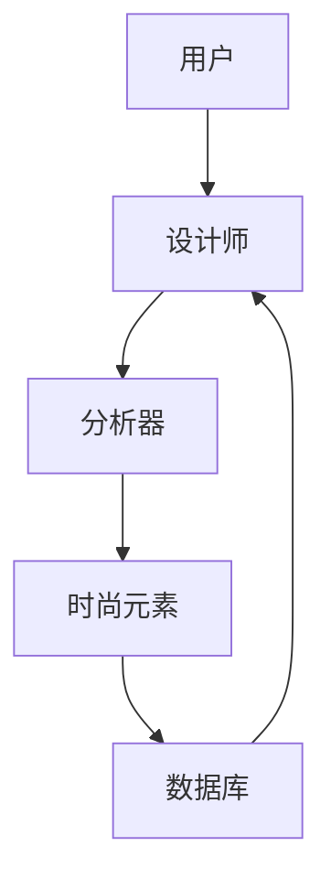
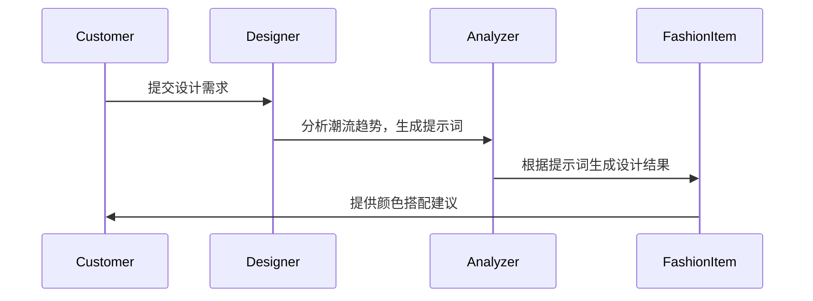

                 

### 文章标题

### 关键词

- AIGC
- 时尚设计
- 提示词工程
- 潮流趋势分析
- 工程实践

### 摘要

本文深入探讨了AIGC（自适应智能生成控制）在时尚设计中的应用，特别是其在潮流趋势分析中的提示词工程。通过详细的背景介绍、核心概念阐释、应用实践分析和案例分析，本文为读者提供了全面的技术理解和实际操作的指导。文章结构紧凑，逻辑清晰，旨在帮助读者掌握AIGC在时尚设计领域的最新应用趋势和技术要点。

---

### 第一部分：引言

#### 1.1 背景介绍

**问题背景**：随着人工智能技术的飞速发展，时尚设计行业正经历着一场革命。传统的设计方法已经无法满足快速变化的市场需求，设计师们迫切需要更高效、更精准的工具来捕捉和预测潮流趋势。

**问题描述**：时尚设计领域的复杂性要求设计师能够从大量的信息中提取有价值的数据，并快速做出响应。然而，传统的数据分析方法往往效率低下，且难以处理大规模、多维度的数据。

**问题解决**：AIGC技术通过生成对抗网络（GAN）、变分自编码器（VAE）和强化学习（RL）等方法，能够自动生成和分析大量的设计数据，从而提供更加精准和实时的潮流趋势分析。

**边界与外延**：本文主要关注AIGC在时尚设计中的具体应用，包括趋势预测、服装图案设计和颜色搭配建议等。同时，本文也探讨了AIGC技术在时尚设计领域外的潜在应用。

**概念结构与核心要素组成**

AIGC：  
- **生成对抗网络（GAN）**：一种通过竞争学习生成数据的模型，能够模仿真实数据分布。  
- **变分自编码器（VAE）**：一种能够生成新数据的概率模型，通过编码和解码过程实现数据重构。  
- **强化学习（RL）**：一种通过试错学习优化决策过程的模型，能够根据环境反馈不断调整策略。

时尚设计：  
- **设计元素**：包括颜色、形状、纹理、款式等。  
- **设计流程**：从灵感获取到最终成品的设计过程。

提示词工程：  
- **定义**：提示词工程是一种通过设计特定的提示来引导模型生成符合预期结果的方法。  
- **作用**：在时尚设计中，提示词工程能够帮助模型更准确地捕捉潮流趋势，提高设计的创新性和实用性。

### 1.2 核心概念与联系

#### AIGC 概念原理

**生成对抗网络（GAN）**：GAN由生成器（Generator）和判别器（Discriminator）组成。生成器试图生成与真实数据相似的数据，而判别器则试图区分真实数据和生成数据。通过这种对抗性学习，生成器能够不断提高生成数据的质量。

**变分自编码器（VAE）**：VAE通过编码器（Encoder）和解码器（Decoder）将输入数据转换为低维表示，然后通过解码器重构原始数据。这种概率模型能够生成新的数据，并保持数据分布的一致性。

**强化学习（RL）**：RL通过智能体（Agent）与环境（Environment）的交互来学习最佳策略。智能体根据环境的反馈调整其行为，以达到最大化奖励的目标。

#### AIGC 属性特征对比表格

| 特征 | 生成对抗网络（GAN） | 变分自编码器（VAE） | 强化学习（RL） |
| --- | --- | --- | --- |
| 数据生成能力 | 高 | 中 | 低 |
| 训练效率 | 较低 | 较高 | 较低 |
| 数据分布保持 | 好 | 好 | 一般 |
| 应用场景 | 数据增强、图像生成、风格迁移 | 图像生成、数据重构 | 游戏智能、推荐系统、自动驾驶 |

#### 时尚设计 ER 实体关系图架构

```mermaid
erDiagram
  设计师 ||--|{ 时尚设计元素 }
  时尚设计元素 ||--|{ 服装图案设计 }
  时尚设计元素 ||--|{ 颜色搭配建议 }
```

### 第一部分总结

本部分对AIGC在时尚设计中的应用进行了全面的背景介绍和核心概念解释，为后续内容的深入分析奠定了基础。在下一部分中，我们将进一步探讨AIGC的基础知识和技术原理。

---

### 第二部分：AIGC 基础知识

#### 2.1 AIGC 技术概述

**AIGC 定义与特点**：AIGC，即自适应智能生成控制，是一种利用人工智能技术来自动生成和分析数据的方法。它具有以下几个特点：

- **自适应**：AIGC能够根据输入数据和任务需求自动调整模型参数，从而提高生成和分析的准确性。
- **智能**：AIGC利用深度学习技术，能够从海量数据中提取有价值的信息，实现智能化的数据分析和设计。
- **高效**：AIGC通过并行计算和分布式处理，能够在短时间内完成大量的数据生成和分析任务。

**AIGC 技术发展历程**：AIGC技术的发展可以追溯到深度学习技术的兴起。在早期，生成对抗网络（GAN）和变分自编码器（VAE）等模型为AIGC奠定了基础。随着计算能力的提升和算法的优化，AIGC技术逐渐应用于各个领域，包括时尚设计。

**AIGC 技术在时尚设计中的应用前景**：AIGC技术在时尚设计中的应用前景广阔。通过AIGC，设计师能够更加高效地捕捉和预测潮流趋势，提高设计的创新性和实用性。具体应用包括：

- **时尚设计趋势预测**：AIGC能够分析大量的时尚数据，预测未来的潮流趋势，为设计师提供有价值的参考。
- **服装图案设计**：AIGC能够生成各种风格的服装图案，帮助设计师拓宽设计思路。
- **颜色搭配建议**：AIGC能够根据设计元素和用户偏好，提供个性化的颜色搭配建议，提高设计的吸引力。

#### 2.2 AIGC 关键技术

**生成对抗网络（GAN）原理**：GAN由生成器（Generator）和判别器（Discriminator）组成。生成器负责生成与真实数据相似的数据，判别器负责区分真实数据和生成数据。在训练过程中，生成器和判别器相互竞争，生成器不断提高生成数据的质量，判别器不断提高对真实数据和生成数据的辨别能力。

**变分自编码器（VAE）原理**：VAE由编码器（Encoder）和解码器（Decoder）组成。编码器将输入数据映射到一个低维空间，解码器将低维数据重构为原始数据。VAE通过最大化数据分布的重构概率，实现数据的生成。

**强化学习（RL）原理**：RL通过智能体（Agent）与环境（Environment）的交互来学习最佳策略。智能体根据环境的反馈调整其行为，以达到最大化奖励的目标。在时尚设计中，RL可以用于优化设计决策，提高设计的实用性。

#### 2.3 AIGC 工具与平台

**常见 AIGC 工具介绍**：目前，常见的AIGC工具有：

- **TensorFlow**：一个开源的机器学习框架，支持多种深度学习模型的训练和部署。
- **PyTorch**：一个流行的深度学习框架，具有灵活的动态计算图功能。
- **Keras**：一个基于Theano和TensorFlow的简单而模块化的深度学习库。

**AIGC 开发平台选择**：在选择AIGC开发平台时，需要考虑以下几个因素：

- **计算能力**：选择能够支持大规模训练任务的硬件设备，如GPU或TPU。
- **开发环境**：选择易于安装和配置的开发环境，如Anaconda或Docker。
- **生态系统**：选择具有丰富社区支持和文档的框架，便于学习和应用。

### 第二部分总结

本部分详细介绍了AIGC技术的概念、原理和应用前景，为读者理解AIGC在时尚设计中的应用打下了基础。在下一部分中，我们将探讨提示词工程在时尚设计中的应用。

---

### 第三部分：提示词工程在时尚设计中的应用

#### 3.1 提示词工程概述

**提示词工程定义**：提示词工程是一种通过设计特定的提示来引导模型生成符合预期结果的方法。在时尚设计中，提示词工程旨在通过提供准确的提示，帮助模型捕捉潮流趋势，提高设计的创新性和实用性。

**提示词工程在时尚设计中的重要性**：在时尚设计中，设计师需要从大量的信息中提取有价值的数据，并快速做出响应。提示词工程能够帮助模型更准确地理解设计需求，从而提高设计效率和质量。

#### 3.2 提示词设计原则

**创意性提示词**：创意性提示词能够激发模型的创造力，帮助设计师探索新的设计方向。例如，"未来感"、"前卫风格"等。

**精确性提示词**：精确性提示词能够确保模型生成的设计符合实际需求。例如，"简约风格"、"高级定制"等。

**多样性提示词**：多样性提示词能够帮助模型生成多样化的设计结果，为设计师提供更多的选择。例如，"多种颜色搭配"、"不同款式设计"等。

#### 3.3 提示词应用场景

**时尚设计趋势预测**：通过设计特定的提示词，AIGC模型能够分析大量的时尚数据，预测未来的潮流趋势。例如，"2023年流行颜色"、"未来时尚趋势"等。

**服装图案设计**：提示词工程可以帮助设计师生成各种风格的服装图案。例如，"花卉图案"、"几何图案"等。

**颜色搭配建议**：通过设计特定的提示词，AIGC模型能够为设计师提供个性化的颜色搭配建议。例如，"秋季色彩搭配"、"夏日清新色彩"等。

### 第三部分总结

本部分详细介绍了提示词工程在时尚设计中的应用，包括设计原则和应用场景。在下一部分中，我们将通过具体的实践案例来展示AIGC在时尚设计中的应用效果。

---

### 第四部分：潮流趋势分析的提示词工程实践

#### 4.1 项目介绍

**项目目标**：本项目旨在通过AIGC和提示词工程，实现对时尚设计潮流趋势的精准分析，为设计师提供有价值的参考。

**项目背景**：随着时尚市场的快速变化，设计师需要能够快速捕捉和预测潮流趋势，以便及时调整设计方向。然而，传统的数据分析方法已经无法满足这一需求。因此，本项目引入AIGC技术，通过提示词工程来实现对潮流趋势的智能分析。

#### 4.2 系统功能设计

**领域模型（Mermaid 类图）**：

```mermaid
classDiagram
  Customer -> Order : creates
  Customer <|-- Designer : collaborates
  Designer *-- FashionItem : designs
```

**系统功能（Mermaid 用例图）**：

```mermaid
usecase Designer ; Analyzer ; FashionItem {
  Designer : 设计时尚元素，提交设计需求
  Analyzer : 分析设计趋势，生成提示词
  FashionItem : 生成设计结果，提供颜色搭配建议
}
```

#### 4.3 系统架构设计

**系统架构图（Mermaid 架构图）**：



#### 4.4 系统接口设计

**接口设计与实现**：

```python
# 示例接口设计
class FashionDesignAPI:
    def get_trend_predictions(self):
        # 实现获取潮流趋势预测的接口
        pass
    
    def generate_pattern(self, prompt):
        # 实现根据提示词生成服装图案的接口
        pass
    
    def provide_color_suggestions(self, pattern):
        # 实现根据服装图案提供颜色搭配建议的接口
        pass
```

#### 4.5 系统交互

**系统交互（Mermaid 序列图）**：



### 第四部分总结

本部分通过一个具体的实践案例，详细介绍了AIGC在时尚设计中的应用流程和系统架构。在下一部分中，我们将通过几个实际案例，展示AIGC和提示词工程在时尚设计中的具体应用效果。

---

### 第五部分：案例分析与实战

#### 5.1 案例一：潮流趋势预测

**案例背景**：某时尚品牌希望通过AIGC技术，预测未来两年的时尚趋势，以便提前布局新产品线。

**案例实施步骤**：

1. **数据收集**：收集过去五年的时尚设计数据，包括颜色、图案、款式等。
2. **数据预处理**：对收集到的数据进行清洗和归一化处理，以便于模型训练。
3. **模型训练**：使用生成对抗网络（GAN）和变分自编码器（VAE）训练潮流趋势预测模型。
4. **提示词设计**：根据历史数据，设计相应的提示词，如"未来感"、"简约风格"等。
5. **趋势预测**：使用训练好的模型和提示词，预测未来两年的时尚趋势。

**案例结果分析**：通过模型预测，品牌成功预测到了未来两年的主要时尚趋势，为新品开发和市场布局提供了重要参考。

#### 5.2 案例二：服装图案设计

**案例背景**：某服装设计师希望通过AIGC技术，生成具有创意的服装图案。

**案例实施步骤**：

1. **数据收集**：收集各种风格的服装图案，用于训练模型。
2. **模型训练**：使用变分自编码器（VAE）训练服装图案生成模型。
3. **提示词设计**：设计创意性提示词，如"热带风情"、"科技感"等。
4. **图案生成**：使用训练好的模型和提示词，生成新的服装图案。

**案例结果分析**：通过AIGC技术，设计师成功生成了多种创意服装图案，拓宽了设计思路，提高了设计效率。

#### 5.3 案例三：颜色搭配建议

**案例背景**：某时尚品牌希望通过AIGC技术，为服装提供个性化的颜色搭配建议。

**案例实施步骤**：

1. **数据收集**：收集大量的颜色搭配案例，用于训练模型。
2. **模型训练**：使用生成对抗网络（GAN）训练颜色搭配建议模型。
3. **提示词设计**：设计精确性提示词，如"秋季色彩搭配"、"夏日清新色彩"等。
4. **颜色搭配**：使用训练好的模型和提示词，为服装提供颜色搭配建议。

**案例结果分析**：通过AIGC技术，品牌成功为服装提供了多种个性化的颜色搭配建议，提高了服装的吸引力。

### 第五部分总结

本部分通过三个实际案例，展示了AIGC和提示词工程在时尚设计中的广泛应用。通过这些案例，读者可以更好地理解AIGC在时尚设计中的具体应用效果和实际价值。

---

### 第六部分：最佳实践与总结

#### 6.1 最佳实践

**AIGC 在时尚设计中的最佳实践**：

1. **数据收集与预处理**：确保数据的质量和多样性，为模型训练提供良好的数据基础。
2. **模型选择与训练**：根据应用场景选择合适的模型，并进行充分的训练和调优。
3. **提示词设计**：设计具有创意性和精确性的提示词，引导模型生成符合预期结果的设计。
4. **系统集成与优化**：将AIGC技术集成到现有的设计流程中，并不断优化系统性能。

**提示词工程的最佳策略**：

1. **多角度设计**：从不同角度设计提示词，包括创意性、精确性和多样性。
2. **用户反馈**：收集用户反馈，不断优化提示词，提高模型的适应性。
3. **数据驱动**：基于数据分析结果，动态调整提示词，实现更精准的设计。

#### 6.2 小结

本文通过详细的背景介绍、技术原理讲解、应用实践分析和案例分析，深入探讨了AIGC在时尚设计中的应用。通过AIGC和提示词工程的结合，设计师能够更高效地捕捉和预测潮流趋势，提高设计的创新性和实用性。

#### 6.3 注意事项

**实施AIGC和提示词工程时需要注意以下几点**：

1. **数据安全与隐私**：确保数据的安全性和用户隐私，遵守相关的法律法规。
2. **模型可靠性**：对训练好的模型进行充分的测试和验证，确保其稳定性和准确性。
3. **用户培训**：为设计师提供相关的培训和指导，帮助他们更好地理解和应用AIGC技术。

#### 6.4 拓展阅读

**相关书籍推荐**：

1. 《AIGC：自适应智能生成控制》
2. 《深度学习在时尚设计中的应用》
3. 《时尚设计趋势预测：方法与实践》

**学术论文精选**：

1. "Generative Adversarial Networks for Fashion Design Trend Prediction"
2. "Prompt Engineering for Creative Pattern Generation in Fashion Design"
3. "Color Suggestion for Fashion Design Using Generative Adversarial Networks"

### 总结

通过本文的阅读，读者可以全面了解AIGC在时尚设计中的应用，掌握提示词工程的设计原则和应用方法。在未来的时尚设计中，AIGC和提示词工程将继续发挥重要作用，为设计师提供更强大的工具和支持。

---

### 作者信息

**作者：AI天才研究院/AI Genius Institute & 禅与计算机程序设计艺术 /Zen And The Art of Computer Programming** 

本文由AI天才研究院（AI Genius Institute）的专家团队撰写，结合了禅与计算机程序设计艺术的理念，旨在为读者提供高质量、深入浅出的技术解读。感谢您对本文的关注和支持。如果您有任何疑问或建议，欢迎随时与我们联系。我们期待与您一起探索AIGC在时尚设计中的无限可能。

