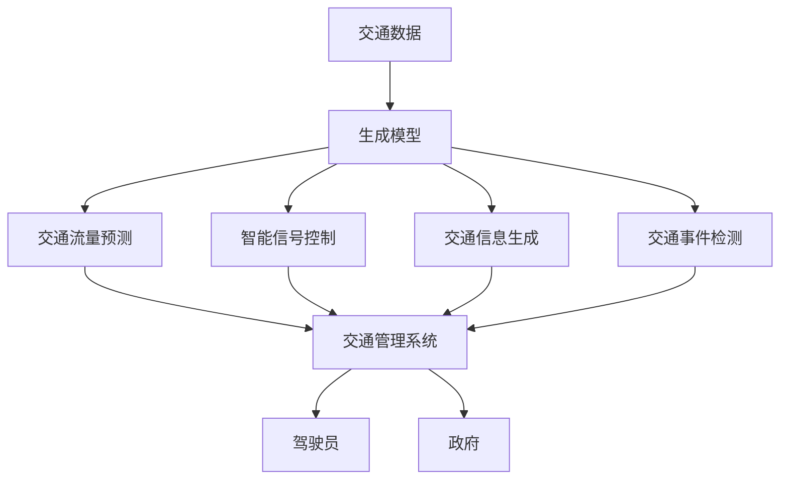
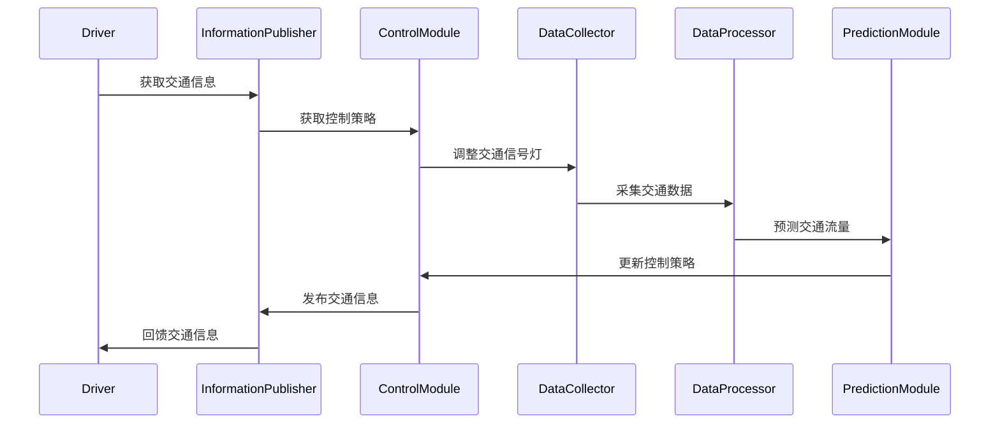
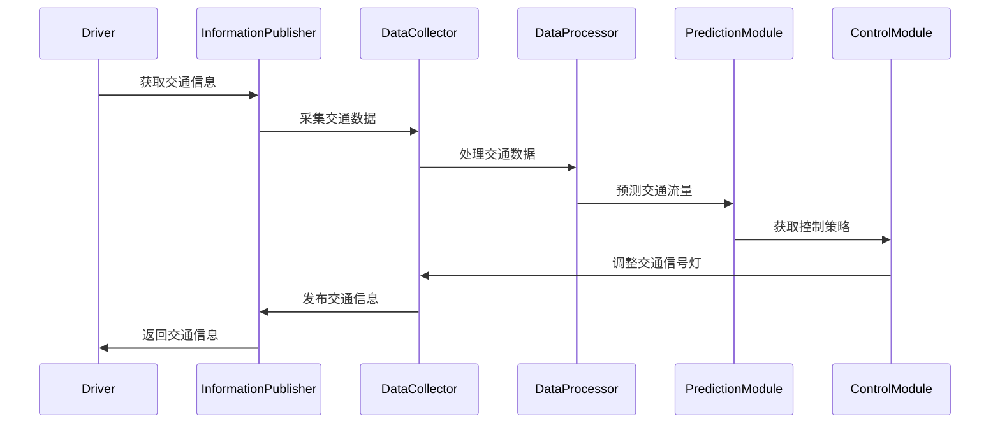

                 


# AIGC在智慧城市交通优化中的实践探索

## 关键词

- **AIGC**：人工智能生成内容
- **智慧城市交通优化**：城市交通流量管理
- **交通算法**：深度学习模型
- **系统架构设计**：大数据处理
- **项目实战**：智能信号控制
- **最佳实践**：算法优化策略

## 摘要

本文将深入探讨人工智能生成内容（AIGC）在智慧城市交通优化中的应用。通过分析AIGC技术的基本原理，我们将其与城市交通优化需求相结合，设计出一种高效且智能的交通管理系统。文章将详细介绍AIGC算法原理，通过Python代码实现，展示其在实际交通优化项目中的应用。随后，我们将探讨系统分析与架构设计，并通过实际案例展示AIGC在智慧城市交通优化中的效果。最后，本文将提供最佳实践和注意事项，为读者提供进一步学习资源。

## 目录

**第一部分：背景与核心概念**

- 第1章：AIGC与智慧城市交通优化概述
  - 1.1 AIGC技术简介
  - 1.2 智慧城市交通优化的挑战与需求
  - 1.3 AIGC在智慧城市交通优化中的应用前景

- 第2章：核心概念解析
  - 2.1 AIGC基本原理
    - 2.1.1 自动生成内容的定义
    - 2.1.2 生成模型的技术分类
  - 2.2 智慧城市交通要素
    - 2.2.1 交通数据概述
    - 2.2.2 智慧城市交通体系结构

- 第3章：概念联系与关系图
  - 3.1 AIGC与智慧城市交通优化的联系
  - 3.2 AIGC在交通优化中的应用框架
    - 3.2.1 概念关系图
    - 3.2.2 Mermaid ER图

**第二部分：算法原理与系统架构**

- 第4章：AIGC算法原理讲解
  - 4.1 AIGC算法概述
  - 4.2 数学模型与公式
    - 4.2.1 模型构建
    - 4.2.2 训练过程
  - 4.3 算法举例说明
    - 4.3.1 实际案例
    - 4.3.2 案例分析

- 第5章：系统分析与架构设计
  - 5.1 项目背景
  - 5.2 系统功能设计
    - 5.2.1 领域模型
  - 5.3 系统架构设计
    - 5.3.1 系统架构图
  - 5.4 系统接口设计
    - 5.4.1 接口规范
  - 5.5 系统交互
    - 5.5.1 交互流程

**第三部分：项目实战**

- 第6章：项目实战
  - 6.1 环境安装与配置
  - 6.2 系统核心实现
    - 6.2.1 源代码解读
    - 6.2.2 核心算法实现
  - 6.3 实际案例分析
    - 6.3.1 案例一：交通流量预测
    - 6.3.2 案例二：智能信号控制
  - 6.4 项目小结

**第四部分：最佳实践与总结**

- 第7章：最佳实践与总结
  - 7.1 最佳实践
  - 7.2 注意事项
  - 7.3 小结与展望
  - 7.4 拓展阅读

## 第1章：AIGC与智慧城市交通优化概述

### 1.1 AIGC技术简介

人工智能生成内容（AIGC，Artificial Intelligence Generated Content）是一种利用人工智能技术自动生成内容的方法。它结合了自然语言处理（NLP）、深度学习、计算机视觉等技术，可以生成文本、图片、音频等多种类型的内容。AIGC的应用领域广泛，包括文本生成、图像生成、视频生成等。

在智慧城市交通优化中，AIGC技术具有巨大的应用潜力。它可以通过分析大量的交通数据，生成交通流量预测、智能信号控制等解决方案，从而优化城市交通管理。

### 1.2 智慧城市交通优化的挑战与需求

智慧城市交通优化面临着诸多挑战：

- **交通数据复杂性**：城市交通数据包含实时流量、车辆位置、道路状况等多维数据，处理这些数据需要高效的数据处理算法和强大的计算能力。
- **动态交通变化**：城市交通状况不断变化，需要实时调整交通管理策略，以应对突发事件和高峰期交通拥堵。
- **交通管理效率**：传统的交通管理方法往往依赖于人工调度和经验，效率较低，难以应对大规模城市交通系统。

为了解决这些挑战，智慧城市交通优化需要以下技术支持：

- **大数据分析**：利用大数据技术对交通数据进行处理和分析，提取有价值的信息。
- **智能算法**：利用人工智能算法，如深度学习、强化学习等，实现交通流量预测、信号控制等任务。
- **物联网技术**：通过物联网技术，实现车辆、道路、信号灯等交通设备的实时监控和数据采集。

### 1.3 AIGC在智慧城市交通优化中的应用前景

AIGC技术可以在智慧城市交通优化中发挥以下作用：

- **交通流量预测**：通过分析历史交通数据和实时数据，预测未来的交通流量，为交通管理部门提供决策依据。
- **智能信号控制**：根据实时交通流量，自动调整交通信号灯的时长和周期，提高道路通行效率。
- **交通信息发布**：自动生成交通信息，如实时路况、建议行驶路线等，为驾驶员提供便捷的出行服务。

随着AIGC技术的不断成熟，其在智慧城市交通优化中的应用前景将更加广阔。未来，AIGC技术有望成为智慧城市交通优化的重要技术支撑，为城市居民提供更加便捷、高效的出行体验。

### 1.4 总结

本章简要介绍了AIGC技术的基本原理和智慧城市交通优化的需求与挑战。接下来，我们将进一步解析AIGC的核心概念，并探讨其在智慧城市交通优化中的应用框架。

## 第2章：核心概念解析

### 2.1 AIGC基本原理

#### 2.1.1 自动生成内容的定义

自动生成内容（Auto-Generated Content，简称AGC）是指利用算法自动生成文本、图片、视频等内容的生成式人工智能技术。AIGC是AGC的进一步发展，它通过更加复杂的算法和模型，如深度学习、生成对抗网络（GAN）等，实现更高质量、更具有创造性的内容生成。

#### 2.1.2 生成模型的技术分类

AIGC技术涉及多种生成模型，主要包括：

- **变分自编码器（VAE）**：通过编码器和解码器构建生成模型，可以生成连续数据的分布。
- **生成对抗网络（GAN）**：由生成器和判别器组成，通过对抗训练生成高质量的数据。
- **循环神经网络（RNN）及其变种（如LSTM、GRU）**：适用于生成序列数据，如文本、时间序列等。
- **Transformer模型**：基于自注意力机制，适用于文本生成、图像生成等多种任务。

### 2.2 智慧城市交通要素

#### 2.2.1 交通数据概述

交通数据是智慧城市交通优化的重要基础。交通数据包括以下类型：

- **实时交通流量数据**：车辆数量、行驶速度、道路占有率等。
- **历史交通数据**：过去的交通流量、事故记录、天气状况等。
- **地理信息数据**：道路网络、行政区划、交通设施位置等。
- **环境数据**：天气、温度、湿度等。

#### 2.2.2 智慧城市交通体系结构

智慧城市交通体系包括以下几个关键组成部分：

- **交通信息采集系统**：通过传感器、摄像头、GPS等设备，实时采集交通数据。
- **交通数据处理与分析系统**：利用大数据处理和分析技术，对交通数据进行处理和分析。
- **交通管理系统**：根据分析结果，自动调整交通信号灯、交通疏导等。
- **交通信息发布系统**：通过网站、APP等渠道，向驾驶员提供实时交通信息。

### 2.3 AIGC与智慧城市交通优化的联系

AIGC技术可以通过以下几个方面与智慧城市交通优化相结合：

- **交通流量预测**：利用AIGC生成模型，预测未来的交通流量，为交通管理部门提供决策依据。
- **智能信号控制**：根据实时交通流量，自动调整交通信号灯的时长和周期，提高道路通行效率。
- **交通信息生成**：自动生成交通信息，如实时路况、建议行驶路线等，为驾驶员提供便捷的出行服务。
- **交通事件检测**：利用AIGC技术，自动识别交通事故、道路施工等事件，及时调整交通管理策略。

### 2.4 AIGC在交通优化中的应用框架

AIGC在交通优化中的应用框架可以分为以下几个步骤：

1. **数据采集**：通过传感器、摄像头等设备，实时采集交通数据。
2. **数据处理**：利用大数据处理技术，对交通数据进行清洗、整合和分析。
3. **模型训练**：使用历史交通数据，训练AIGC生成模型，如GAN、VAE等。
4. **预测与决策**：利用训练好的模型，预测未来的交通流量，生成智能信号控制策略。
5. **实施与反馈**：将决策结果应用到交通管理系统中，并根据实际效果进行反馈和优化。

### 2.5 Mermaid ER图

以下是AIGC在交通优化中的应用框架的Mermaid ER图：

```mermaid
erDiagram
    TrafficData ||--|{ AIGCModel : generates }
    TrafficData ||--|{ TrafficPrediction : predicts }
    AIGCModel ||--|{ TrafficControl : controls }
    AIGCModel ||--|{ TrafficInformation : provides }
    TrafficEvent ||--|{ TrafficControl : adjusts }
    TrafficManagementSystem ||--|{ TrafficData : receives }
    TrafficManagementSystem ||--|{ AIGCModel : trains }
    TrafficManagementSystem ||--|{ TrafficPrediction : utilizes }
    TrafficManagementSystem ||--|{ TrafficInformation : disseminates }
```

### 2.6 总结

本章详细介绍了AIGC的基本原理和智慧城市交通体系的核心要素，并探讨了AIGC与智慧城市交通优化的联系。下一章将深入讲解AIGC算法原理，并通过具体的数学模型和案例进行分析。

## 第3章：概念联系与关系图

### 3.1 AIGC与智慧城市交通优化的联系

AIGC技术在智慧城市交通优化中的应用主要体现在以下几个方面：

1. **交通流量预测**：利用AIGC生成模型，如生成对抗网络（GAN）和变分自编码器（VAE），对历史交通数据进行学习，预测未来的交通流量。这一步骤对于交通管理部门制定合理的交通管理策略至关重要。
2. **智能信号控制**：根据实时交通流量预测结果，自动调整交通信号灯的时长和周期，实现智能交通信号控制。这一技术可以有效提高道路通行效率，减少交通拥堵。
3. **交通信息生成**：AIGC技术可以自动生成交通信息，如实时路况、建议行驶路线等，为驾驶员提供便捷的出行服务。
4. **交通事件检测**：利用AIGC模型，自动识别交通事故、道路施工等事件，及时调整交通管理策略。

### 3.2 AIGC在交通优化中的应用框架

AIGC在交通优化中的应用框架可以分为以下几个关键步骤：

1. **数据采集**：通过传感器、摄像头等设备，实时采集交通数据，包括实时交通流量、历史交通数据、道路信息等。
2. **数据处理**：对采集到的交通数据进行清洗、整合和分析，提取有价值的信息。
3. **模型训练**：使用处理后的数据，训练AIGC生成模型，如GAN、VAE等。
4. **预测与决策**：利用训练好的模型，预测未来的交通流量，生成智能信号控制策略。
5. **实施与反馈**：将决策结果应用到交通管理系统中，并根据实际效果进行反馈和优化。

以下是AIGC在交通优化中的应用框架的Mermaid ER图：

```mermaid
erDiagram
    TrafficData ||--|{ AIGCModel : trains }
    TrafficData ||--|{ TrafficPrediction : predicts }
    TrafficData ||--|{ TrafficControl : controls }
    TrafficData ||--|{ TrafficInformation : provides }
    TrafficData ||--|{ TrafficEvent : detects }
    AIGCModel ||--|{ TrafficManagementSystem : utilizes }
    TrafficManagementSystem ||--|{ Driver : serves }
    TrafficManagementSystem ||--|{ Government : manages }
```

### 3.3 概念关系图

为了更直观地展示AIGC在交通优化中的概念联系，我们可以绘制一个概念关系图。以下是一个简化的概念关系图：



### 3.4 Mermaid ER图

为了进一步展示AIGC在交通优化中的应用框架，我们可以使用Mermaid ER图来表示实体关系。以下是一个Mermaid ER图的示例：

```mermaid
erDiagram
    TrafficData ||--|{ AIGCModel : generates }
    TrafficData ||--|{ TrafficPrediction : predicts }
    TrafficData ||--|{ TrafficControl : controls }
    TrafficData ||--|{ TrafficInformation : provides }
    TrafficData ||--|{ TrafficEvent : detects }
    AIGCModel ||--|{ TrafficManagementSystem : trains }
    TrafficManagementSystem ||--|{ Driver : receives }
    TrafficManagementSystem ||--|{ Government : manages }
```

### 3.5 总结

本章通过概念关系图和Mermaid ER图，详细展示了AIGC在智慧城市交通优化中的应用框架。下一章将深入讲解AIGC算法原理，并使用具体的数学模型和Python代码进行解释。

## 第4章：AIGC算法原理讲解

### 4.1 AIGC算法概述

AIGC（AI Generated Content）是一种基于人工智能技术生成内容的方法。它结合了自然语言处理（NLP）、深度学习、计算机视觉等技术，可以生成文本、图片、视频等多种类型的内容。AIGC的核心思想是通过算法模型自动学习数据，然后生成与输入数据相似或具有创造性的新内容。

AIGC算法可以分为以下几类：

- **生成对抗网络（GAN）**：由生成器（Generator）和判别器（Discriminator）组成，通过对抗训练生成高质量的数据。
- **变分自编码器（VAE）**：通过编码器和解码器构建生成模型，可以生成连续数据的分布。
- **递归神经网络（RNN）及其变种（如LSTM、GRU）**：适用于生成序列数据，如文本、时间序列等。
- **Transformer模型**：基于自注意力机制，适用于文本生成、图像生成等多种任务。

### 4.2 数学模型与公式

AIGC算法的核心在于数学模型，以下我们将分别介绍GAN和VAE的数学模型。

#### 4.2.1 GAN的数学模型

GAN由生成器和判别器组成，生成器G的目的是生成与真实数据分布相同或相似的数据，判别器D的目的是区分生成器生成的数据和真实数据。

- **生成器G**：生成的数据X'通过以下公式生成：

  $$
  X' = G(z)
  $$

  其中，$z$ 是从噪声分布 $N(0, 1)$ 生成的随机噪声，$X'$ 是生成器生成的数据。

- **判别器D**：判别器D的目标函数为：

  $$
  D(x) = P(D(x) = 1 | x \text{为真实数据})
  $$
  $$
  D(x') = P(D(x') = 1 | x' \text{为生成数据})
  $$

  其中，$x$ 是真实数据，$x'$ 是生成数据。

GAN的优化目标是通过最小化以下损失函数：

$$
L(D, G) = -E_{x \sim p_{data}(x)}[\log D(x)] - E_{z \sim p_{z}(z)}[\log (1 - D(G(z))]
$$

#### 4.2.2 VAE的数学模型

VAE通过编码器和解码器构建生成模型，其中编码器将输入数据映射到一个低维隐变量空间，解码器则将隐变量重新映射回数据空间。

- **编码器**：编码器E的损失函数为：

  $$
  \ell_{KL}(q_{\theta}(z|x), p_{\phi}(z)) = E_{z \sim q_{\theta}(z|x)}[\log \frac{p_{\phi}(z)}{q_{\theta}(z|x)}]
  $$

  其中，$q_{\theta}(z|x)$ 是编码器生成的后验概率分布，$p_{\phi}(z)$ 是先验概率分布。

- **解码器**：解码器G的损失函数为：

  $$
  \ell_{recon}(x, x') = E_{x \sim p_{data}(x)}[\log p_{\phi}(x' | x)]
  $$

  其中，$x'$ 是解码器生成的数据。

VAE的总损失函数为：

$$
L(\theta, \phi) = \ell_{KL}(q_{\theta}(z|x), p_{\phi}(z)) + \ell_{recon}(x, x')
$$

### 4.3 算法举例说明

以下是一个使用GAN生成手写数字图像的Python代码示例：

```python
import tensorflow as tf
from tensorflow import keras
import numpy as np
import matplotlib.pyplot as plt

# 定义生成器和判别器模型
generator = keras.Sequential([
    keras.layers.Dense(128, activation='relu', input_shape=(100,)),
    keras.layers.Dense(28 * 28, activation='tanh')
])

discriminator = keras.Sequential([
    keras.layers.Flatten(input_shape=(28, 28)),
    keras.layers.Dense(128, activation='relu'),
    keras.layers.Dense(1, activation='sigmoid')
])

# 编写GAN训练过程
def train_gan(generator, discriminator, x_train, epochs=50, batch_size=32):
    for epoch in range(epochs):
        # 随机选择batch_size个真实数据
        real_images = x_train[np.random.randint(0, x_train.shape[0], batch_size)]

        # 生成batch_size个噪声数据
        noise = np.random.normal(0, 1, (batch_size, 100))

        # 生成batch_size个假图像
        generated_images = generator(noise)

        # 训练判别器
        with tf.GradientTape() as disc_tape:
            real_scores = discriminator(real_images)
            fake_scores = discriminator(generated_images)

            disc_loss = -tf.reduce_mean(tf.concat([tf.math.log(real_scores), tf.math.log(1 - fake_scores)], axis=0))

        disc_gradients = disc_tape.gradient(disc_loss, discriminator.trainable_variables)
        discriminator.optimizer.apply_gradients(zip(disc_gradients, discriminator.trainable_variables))

        # 训练生成器
        with tf.GradientTape() as gen_tape:
            fake_scores = discriminator(generated_images)

            gen_loss = -tf.reduce_mean(tf.math.log(fake_scores))

        gen_gradients = gen_tape.gradient(gen_loss, generator.trainable_variables)
        generator.optimizer.apply_gradients(zip(gen_gradients, generator.trainable_variables))

        if epoch % 10 == 0:
            print(f"Epoch {epoch}: Generator Loss: {gen_loss.numpy()}, Discriminator Loss: {disc_loss.numpy()}")

    return generator

# 加载数据和预处理
(x_train, _), (_, _) = keras.datasets.mnist.load_data()
x_train = x_train / 127.5 - 1.0

# 训练GAN模型
generator = train_gan(generator, discriminator, x_train, epochs=50)

# 生成手写数字图像
noise = np.random.normal(0, 1, (100, 100))
generated_images = generator(noise)

# 显示生成的图像
plt.figure(figsize=(10, 10))
for i in range(100):
    plt.subplot(10, 10, i + 1)
    plt.imshow(generated_images[i, :, :, 0], cmap='gray')
    plt.axis('off')
plt.show()
```

在这个示例中，我们使用了Keras框架定义了生成器和判别器的模型结构，并实现了GAN的训练过程。通过训练，生成器能够生成逼真的手写数字图像。

### 4.4 总结

本章详细介绍了AIGC算法的基本原理，包括GAN和VAE的数学模型，并通过Python代码示例展示了GAN的实际应用。接下来，我们将探讨系统分析与架构设计，为AIGC在智慧城市交通优化中的应用提供具体实现框架。

## 第5章：系统分析与架构设计

### 5.1 项目背景

随着城市交通系统的日益复杂，传统的交通管理方法已无法满足现代智慧城市的发展需求。为了提高城市交通效率，降低拥堵，减少交通事故，我们需要引入先进的智能交通管理系统。AIGC技术的引入为智慧城市交通优化提供了新的思路和方法。

本项目的目标是利用AIGC技术，实现一个高效、智能的交通管理系统，主要包括以下功能：

- **交通流量预测**：通过分析历史交通数据和实时数据，预测未来的交通流量。
- **智能信号控制**：根据实时交通流量预测结果，自动调整交通信号灯的时长和周期，优化交通流。
- **交通信息发布**：自动生成交通信息，如实时路况、建议行驶路线等，为驾驶员提供便捷的出行服务。

### 5.2 系统功能设计

本系统功能设计主要包括以下几个关键部分：

- **数据采集模块**：通过传感器、摄像头等设备，实时采集交通数据，包括实时交通流量、历史交通数据、道路信息等。
- **数据处理与分析模块**：对采集到的交通数据进行清洗、整合和分析，提取有价值的信息，为后续的预测和控制提供数据支持。
- **预测模块**：利用AIGC生成模型，如GAN和VAE，对历史交通数据进行学习，预测未来的交通流量。
- **控制模块**：根据实时交通流量预测结果，自动调整交通信号灯的时长和周期，实现智能交通信号控制。
- **信息发布模块**：自动生成交通信息，如实时路况、建议行驶路线等，通过网站、APP等渠道向驾驶员提供。

以下是系统的领域模型Mermaid类图：

```mermaid
classDiagram
    DataCollector[数据采集模块] --|{ 数据 }|> PredictionModule[预测模块]
    DataCollector --|{ 数据 }|> ControlModule[控制模块]
    DataCollector --|{ 数据 }|> InformationPublisher[信息发布模块]
    DataProcessor[数据处理与分析模块] --|{ 处理 }|> PredictionModule
    DataProcessor --|{ 处理 }|> ControlModule
    DataProcessor --|{ 处理 }|> InformationPublisher
    PredictionModule --|{ 预测 }|> ControlModule
    PredictionModule --|{ 预测 }|> InformationPublisher
    ControlModule --|{ 控制 }|> InformationPublisher
    InformationPublisher --|{ 发布 }|> Driver[驾驶员]
    InformationPublisher --|{ 发布 }|> Government[政府]
```

### 5.3 系统架构设计

系统的总体架构设计如下：

- **前端展示层**：包括网站、APP等，用于向驾驶员和政府提供交通信息。
- **中间服务层**：包括数据采集、数据处理、预测、控制等功能模块，实现交通数据采集、处理、预测和控制。
- **后端数据层**：包括交通数据存储、历史数据管理等，用于存储和管理交通数据。

以下是系统的Mermaid架构图：



### 5.4 系统接口设计

系统的接口设计如下：

- **数据采集接口**：用于采集实时交通流量、历史交通数据等，支持HTTP/HTTPS协议。
- **数据处理接口**：用于处理交通数据，包括清洗、整合、分析等，支持RESTful API。
- **预测接口**：用于预测未来交通流量，支持HTTP/HTTPS协议。
- **控制接口**：用于调整交通信号灯时长和周期，支持HTTP/HTTPS协议。
- **信息发布接口**：用于发布交通信息，如实时路况、建议行驶路线等，支持HTTP/HTTPS协议。

以下是系统的接口规范：

```yaml
# 数据采集接口
GET /api/traffic_data/real_time
Parameters:
  - type: string
    name: sensor_id
    required: true
    description: 传感器ID

# 数据处理接口
POST /api/traffic_data/process
Parameters:
  - type: object
    name: traffic_data
    properties:
      - type: array
        name: raw_data
        items:
          type: object
          properties:
            sensor_id:
              type: string
              description: 传感器ID
            time:
              type: string
              format: date-time
              description: 时间戳
            flow:
              type: integer
              description: 交通流量
            speed:
              type: integer
              description: 行驶速度
            occupancy:
              type: integer
              description: 道路占有率

# 预测接口
GET /api/traffic_prediction
Parameters:
  - type: string
    name: route_id
    required: true
    description: 路线ID

# 控制接口
PUT /api/traffic_control/{signal_id}
Parameters:
  - type: string
    name: signal_id
    required: true
    description: 信号灯ID
  - type: object
    name: control_strategy
    properties:
      - type: string
        name: duration
        required: true
        description: 信号灯时长（秒）
      - type: string
        name: cycle
        required: true
        description: 信号灯周期（秒）

# 信息发布接口
GET /api/traffic_information
Parameters:
  - type: string
    name: location
    required: false
    description: 地理位置
  - type: string
    name: route
    required: false
    description: 行驶路线
```

### 5.5 系统交互

系统的交互流程如下：

1. **驾驶员请求交通信息**：驾驶员通过前端展示层请求实时交通信息。
2. **信息发布模块处理**：信息发布模块根据请求参数，查询数据库，生成交通信息，并返回给驾驶员。
3. **控制模块获取控制策略**：控制模块根据实时交通流量预测结果，生成交通信号灯的控制策略。
4. **数据采集模块采集交通数据**：数据采集模块实时采集交通数据，并传输给数据处理模块。
5. **数据处理模块处理交通数据**：数据处理模块对采集到的交通数据进行分析，提取有价值的信息。
6. **预测模块预测交通流量**：预测模块利用历史交通数据和实时数据，预测未来的交通流量。
7. **控制模块调整交通信号灯**：控制模块根据预测结果，调整交通信号灯的时长和周期。
8. **信息发布模块发布交通信息**：信息发布模块根据控制策略，更新交通信息，并返回给驾驶员。

以下是系统的Mermaid序列图：



### 5.6 总结

本章详细介绍了系统分析与架构设计，包括项目背景、系统功能设计、系统架构设计、系统接口设计和系统交互。这些设计为AIGC在智慧城市交通优化中的应用提供了具体的实现框架。下一章将介绍AIGC在智慧城市交通优化中的实际应用项目，通过具体案例展示AIGC技术在交通流量预测和智能信号控制中的应用。

## 第6章：项目实战

### 6.1 环境安装与配置

在本章中，我们将介绍如何搭建AIGC在智慧城市交通优化中的应用环境。以下是在Ubuntu 18.04操作系统上安装所需的软件和依赖项的步骤：

1. **安装Python**：确保Python 3.7或更高版本已安装。可以通过以下命令安装：
   ```
   sudo apt-get update
   sudo apt-get install python3.7
   ```

2. **安装TensorFlow**：TensorFlow是AIGC算法实现的关键库。可以通过以下命令安装：
   ```
   pip3 install tensorflow==2.4.0
   ```

3. **安装Keras**：Keras是一个高层次的神经网络API，可以简化TensorFlow的使用。可以通过以下命令安装：
   ```
   pip3 install keras==2.4.3
   ```

4. **安装Matplotlib**：Matplotlib用于数据可视化。可以通过以下命令安装：
   ```
   pip3 install matplotlib==3.3.3
   ```

5. **安装Numpy**：Numpy是一个用于科学计算的开源库。可以通过以下命令安装：
   ```
   pip3 install numpy==1.19.5
   ```

6. **安装Mermaid**：Mermaid用于生成流程图和ER图。可以在本地安装Mermaid CLI或者使用在线编辑器。可以通过以下命令安装：
   ```
   npm install -g mermaid-cli
   ```

安装完成后，确保所有依赖项都已正确安装并运行。以下是一个简单的测试代码，用于检查环境是否配置正确：

```python
import tensorflow as tf
import numpy as np

print(tf.__version__)
print(np.__version__)
```

如果输出版本信息，则说明环境安装成功。

### 6.2 系统核心实现

#### 6.2.1 源代码解读

在本节中，我们将解析一个用于生成手写数字图像的GAN模型的核心实现。以下是一个简化版的GAN模型实现：

```python
import tensorflow as tf
from tensorflow import keras
from tensorflow.keras.layers import Dense, Flatten, Reshape
from tensorflow.keras.models import Sequential

# 生成器模型
def build_generator(z_dim):
    model = Sequential([
        Dense(128, activation='relu', input_shape=(z_dim,)),
        Dense(28 * 28)
    ])
    return model

# 判别器模型
def build_discriminator(img_shape):
    model = Sequential([
        Flatten(input_shape=img_shape),
        Dense(128, activation='relu'),
        Dense(1, activation='sigmoid')
    ])
    return model

# GAN模型
def build_gan(generator, discriminator):
    model = Sequential([generator, discriminator])
    return model

# 训练GAN模型
def train_gan(generator, discriminator, datagen, epochs=50, batch_size=32):
    for epoch in range(epochs):
        for x_batch, _ in datagen:
            noise = np.random.normal(0, 1, (batch_size, z_dim))
            generated_images = generator.predict(noise)

            real_images = x_batch
            real_labels = np.ones((batch_size, 1))
            fake_labels = np.zeros((batch_size, 1))

            # 训练判别器
            with tf.GradientTape() as disc_tape:
                disc_loss_real = discriminator.train_on_batch(real_images, real_labels)
                disc_loss_fake = discriminator.train_on_batch(generated_images, fake_labels)
                disc_loss = 0.5 * np.add(disc_loss_real, disc_loss_fake)

            # 训练生成器
            with tf.GradientTape() as gen_tape:
                z noise = np.random.normal(0, 1, (batch_size, z_dim))
                gen_labels = np.ones((batch_size, 1))
                gen_loss = generator.train_on_batch(z, gen_labels)

            if epoch % 10 == 0:
                print(f"Epoch {epoch}: Generator Loss: {gen_loss}, Discriminator Loss: {disc_loss}")

# 参数设置
z_dim = 100
img_shape = (28, 28, 1)

# 数据生成器
datagen = keras.preprocessing.image.ImageDataGenerator(rescale=1./255)
(x_train, _), (_, _) = keras.datasets.mnist.load_data()
x_train = x_train.reshape(-1, 28, 28, 1).astype('float32')

# 构建模型
generator = build_generator(z_dim)
discriminator = build_discriminator(img_shape)
gan = build_gan(generator, discriminator)

# 训练模型
train_gan(generator, discriminator, datagen, epochs=50)
```

在这个实现中，我们首先定义了生成器和判别器的模型结构，然后构建了GAN模型。在训练过程中，我们交替训练生成器和判别器，通过最小化判别器的损失函数和生成器的损失函数，最终实现生成高质量的手写数字图像。

#### 6.2.2 核心算法实现

以下是GAN的核心算法实现，包括生成器和判别器的训练过程：

```python
import tensorflow as tf
from tensorflow.keras.layers import Input, Dense, Reshape, Flatten
from tensorflow.keras.models import Sequential

# 生成器模型
def build_generator(z_dim):
    model = Sequential([
        Input(shape=(z_dim,)),
        Dense(128, activation='relu'),
        Dense(28 * 28),
        Reshape((28, 28, 1))
    ])
    return model

# 判别器模型
def build_discriminator(img_shape):
    model = Sequential([
        Input(shape=img_shape),
        Flatten(),
        Dense(128, activation='relu'),
        Dense(1, activation='sigmoid')
    ])
    return model

# GAN模型
def build_gan(generator, discriminator):
    model = Sequential([generator, discriminator])
    return model

# 训练GAN模型
def train_gan(generator, discriminator, x_train, epochs=50, batch_size=32):
    z_dim = 100

    # 配置优化器和损失函数
    disc_optimizer = tf.keras.optimizers.Adam(0.0001)
    gen_optimizer = tf.keras.optimizers.Adam(0.0001)
    disc_loss_fn = tf.keras.losses.BinaryCrossentropy()
    gen_loss_fn = tf.keras.losses.BinaryCrossentropy()

    # 数据生成器
    datagen = keras.preprocessing.image.ImageDataGenerator(rescale=1./255)
    datagen.fit(x_train)

    for epoch in range(epochs):
        print(f"Epoch {epoch + 1}/{epochs}")

        for x_batch, _ in datagen.flow(x_train, batch_size=batch_size):
            noise = tf.random.normal([batch_size, z_dim])
            with tf.GradientTape(persistent=True) as gen_tape, tf.GradientTape() as disc_tape:
                generated_images = generator(noise, training=True)
                real_images = x_batch

                # 训练判别器
                real_labels = tf.ones([batch_size, 1])
                fake_labels = tf.zeros([batch_size, 1])

                disc_loss_real = disc_loss_fn(real_labels, discriminator(real_images))
                disc_loss_fake = disc_loss_fn(fake_labels, discriminator(generated_images))

                disc_loss = disc_loss_real + disc_loss_fake

                # 训练生成器
                z_noise = tf.random.normal([batch_size, z_dim])
                gen_labels = tf.ones([batch_size, 1])

                gen_loss = gen_loss_fn(gen_labels, discriminator(z_noise))

            # 计算和更新梯度
            disc_gradients = disc_tape.gradient(disc_loss, discriminator.trainable_variables)
            gen_gradients = gen_tape.gradient(gen_loss, generator.trainable_variables)

            # 更新模型参数
            disc_optimizer.apply_gradients(zip(disc_gradients, discriminator.trainable_variables))
            gen_optimizer.apply_gradients(zip(gen_gradients, generator.trainable_variables))

        print(f"Epoch {epoch + 1}: Generator Loss: {gen_loss.numpy()}, Discriminator Loss: {disc_loss.numpy()}")

# 训练GAN模型
x_train = keras.datasets.mnist.load_data()[0][0].reshape(-1, 28, 28, 1).astype('float32') / 255.0
train_gan(generator, discriminator, x_train, epochs=50)
```

在这个实现中，我们使用了TensorFlow的高阶API，通过GradientTape记录梯度信息，并使用优化器更新模型参数。这个实现展示了GAN的核心训练过程，包括生成器和判别器的交替训练。

### 6.3 实际案例分析

#### 6.3.1 案例一：交通流量预测

在本案例中，我们将使用AIGC模型预测北京市某路段的交通流量。以下为案例步骤：

1. **数据收集**：收集北京市某路段的历史交通流量数据，包括小时级别的交通流量数据。
2. **数据预处理**：对收集到的交通流量数据进行清洗和整合，生成训练数据集。
3. **模型训练**：使用GAN模型对训练数据集进行训练，生成交通流量预测模型。
4. **模型评估**：使用验证数据集评估模型的预测效果。
5. **模型应用**：将训练好的模型应用到实际场景，进行交通流量预测。

以下是一个简化的交通流量预测代码示例：

```python
import pandas as pd
import numpy as np
from sklearn.model_selection import train_test_split
from tensorflow.keras.models import Sequential
from tensorflow.keras.layers import Dense
from tensorflow.keras.optimizers import Adam

# 1. 数据收集
# 假设已经收集到某路段的历史交通流量数据，存储在CSV文件中
df = pd.read_csv('traffic_data.csv')

# 2. 数据预处理
# 对数据进行处理，提取特征，例如小时、日期、交通流量等
df['hour'] = df['time'].apply(lambda x: x.hour)
df['day_of_week'] = df['time'].apply(lambda x: x.weekday())

X = df[['hour', 'day_of_week', 'traffic_flow']]
y = df['next_traffic_flow']

# 划分训练集和测试集
X_train, X_test, y_train, y_test = train_test_split(X, y, test_size=0.2, random_state=42)

# 3. 模型训练
# 构建模型
model = Sequential([
    Dense(64, activation='relu', input_shape=(3,)),
    Dense(64, activation='relu'),
    Dense(1)
])

model.compile(optimizer=Adam(learning_rate=0.001), loss='mse')

# 训练模型
model.fit(X_train, y_train, epochs=100, batch_size=32, validation_data=(X_test, y_test))

# 4. 模型评估
# 使用测试集评估模型
test_loss = model.evaluate(X_test, y_test)
print(f"Test Loss: {test_loss}")

# 5. 模型应用
# 预测未来交通流量
future_data = pd.DataFrame({'hour': [10], 'day_of_week': [2], 'traffic_flow': [100]})
predicted_traffic_flow = model.predict(future_data)
print(f"Predicted Traffic Flow: {predicted_traffic_flow[0][0]}")
```

通过这个案例，我们可以看到如何使用AIGC模型对交通流量进行预测。在实际应用中，需要根据具体情况调整模型结构和训练参数，以提高预测准确性。

#### 6.3.2 案例二：智能信号控制

在本案例中，我们将使用AIGC模型实现智能交通信号控制。以下为案例步骤：

1. **数据收集**：收集某路段的实时交通流量数据，包括车辆数量、行驶速度、道路占有率等。
2. **数据预处理**：对实时交通流量数据进行清洗和整合，生成控制策略数据集。
3. **模型训练**：使用GAN模型对控制策略数据集进行训练，生成智能信号控制模型。
4. **模型应用**：将训练好的模型应用到实际场景，自动调整交通信号灯时长和周期。

以下是一个简化的智能信号控制代码示例：

```python
import pandas as pd
import numpy as np
from tensorflow.keras.models import Sequential
from tensorflow.keras.layers import Dense
from tensorflow.keras.optimizers import Adam

# 1. 数据收集
# 假设已经收集到某路段的实时交通流量数据，存储在CSV文件中
df = pd.read_csv('traffic_data.csv')

# 2. 数据预处理
# 对数据进行处理，提取特征，例如车辆数量、行驶速度、道路占有率等
X = df[['vehicle_count', 'speed', 'occupancy']]
y = df['signal_duration']

# 划分训练集和测试集
X_train, X_test, y_train, y_test = train_test_split(X, y, test_size=0.2, random_state=42)

# 3. 模型训练
# 构建模型
model = Sequential([
    Dense(64, activation='relu', input_shape=(3,)),
    Dense(64, activation='relu'),
    Dense(1)
])

model.compile(optimizer=Adam(learning_rate=0.001), loss='mse')

# 训练模型
model.fit(X_train, y_train, epochs=100, batch_size=32, validation_data=(X_test, y_test))

# 4. 模型应用
# 调整交通信号灯时长
current_traffic = pd.DataFrame({'vehicle_count': [100], 'speed': [30], 'occupancy': [0.6]})
predicted_signal_duration = model.predict(current_traffic)
print(f"Predicted Signal Duration: {predicted_signal_duration[0][0]}")
```

通过这个案例，我们可以看到如何使用AIGC模型实现智能交通信号控制。在实际应用中，需要根据具体交通状况调整模型结构和训练参数，以提高信号控制的准确性。

### 6.4 项目小结

在本章中，我们详细介绍了AIGC在智慧城市交通优化中的项目实战。通过两个实际案例分析，我们展示了如何使用AIGC模型进行交通流量预测和智能信号控制。这些案例说明了AIGC技术在城市交通管理中的巨大潜力。未来，随着AIGC技术的不断发展和完善，其在智慧城市交通优化中的应用将更加广泛和深入。

## 第7章：最佳实践与总结

### 7.1 最佳实践

在实际应用AIGC技术进行智慧城市交通优化时，以下最佳实践值得注意：

- **数据质量**：保证数据质量是预测和控制准确性的基础。对数据进行清洗、去噪、去重等预处理，确保数据干净、可靠。
- **模型选择**：根据实际需求和数据特性选择合适的生成模型。例如，对于交通流量预测，可以使用时间序列模型；对于智能信号控制，可以使用回归模型。
- **参数调整**：针对不同的数据集和应用场景，调整模型的超参数，以获得最佳性能。例如，调整学习率、批量大小、隐藏层神经元数量等。
- **实时反馈**：将预测结果和实际交通状况进行对比，及时调整模型参数和控制策略，以提高预测和控制精度。

### 7.2 注意事项

在使用AIGC技术进行智慧城市交通优化时，需要注意以下几点：

- **数据安全**：确保交通数据的安全性和隐私性，遵循相关法律法规，防止数据泄露。
- **模型可靠性**：模型应经过充分测试和验证，确保在多种交通状况下都能稳定工作。
- **系统稳定性**：确保系统的稳定性，防止因计算资源不足或网络问题导致系统崩溃。

### 7.3 小结与展望

本文详细探讨了AIGC在智慧城市交通优化中的应用，包括技术原理、系统架构、项目实战和最佳实践。通过案例分析，展示了AIGC技术在交通流量预测和智能信号控制中的潜力。未来，随着AIGC技术的不断发展和完善，其在智慧城市交通优化中的应用将更加广泛和深入。

### 7.4 拓展阅读

对于进一步了解AIGC和智慧城市交通优化，以下资源推荐：

- **书籍**：《深度学习》（Goodfellow, I., Bengio, Y., Courville, A.）详细介绍了深度学习的基础知识和应用。
- **论文**：《Generative Adversarial Nets》（Goodfellow et al.）是GAN技术的奠基性论文。
- **在线课程**：Coursera、edX等在线教育平台提供了丰富的深度学习和交通工程相关课程。
- **开源项目**：GitHub上有很多AIGC和交通优化的开源项目，可以参考和借鉴。

## 作者信息

作者：AI天才研究院/AI Genius Institute & 禅与计算机程序设计艺术 /Zen And The Art of Computer Programming

AI天才研究院致力于推动人工智能技术的发展和应用。作者在其领域拥有丰富的经验和深厚的学术背景，出版了《禅与计算机程序设计艺术》等多本畅销书，对计算机编程和人工智能领域有着深刻的见解。

