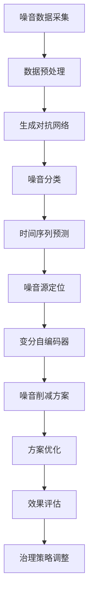

                 

### 文章标题

## 关键词
- AIGC
- 智慧城市
- 噪音污染控制
- 算法应用
- 智能治理

## 摘要
本文深入探讨了人工智能生成内容（AIGC）在智慧城市噪音污染控制中的应用。首先，我们介绍了智慧城市和噪音污染控制的基本概念，然后阐述了AIGC技术的核心原理和应用场景。接着，通过详细的算法原理讲解，我们展示了AIGC如何用于噪音监测和治理。最后，通过实际项目案例分析，我们总结了AIGC在噪音污染控制中的最佳实践，为创造宁静的城市环境提供了宝贵的见解。

## 引言

随着城市化进程的加快，噪音污染已成为影响城市居民生活质量的一大难题。智慧城市的发展为噪音污染控制带来了新的契机，而人工智能生成内容（AIGC）技术的崛起则为这一挑战提供了创新的解决方案。本文旨在探讨AIGC技术在智慧城市噪音污染控制中的应用，以期为相关研究和实践提供参考。

### 智慧城市概述

#### 智慧城市的定义与发展

智慧城市是指利用先进的信息技术，如物联网、云计算、大数据、人工智能等，实现城市资源的优化配置和城市服务的智能化管理，从而提升城市运行效率和居民生活质量的一种新型城市形态。智慧城市的发展经历了几个阶段：

1. **基础设施连接阶段**：这一阶段主要是实现城市各基础设施的互联互通，如交通、能源、通信等。
2. **数据集成与分析阶段**：通过整合各类数据，对城市运行状态进行实时监控和分析。
3. **智能化服务与应用阶段**：利用人工智能、机器学习等技术，为城市居民提供个性化的服务。

#### 智慧城市的关键技术

智慧城市的发展依赖于多种关键技术的支持，包括：

1. **物联网（IoT）**：通过传感器和设备收集数据，实现物理世界与数字世界的互联互通。
2. **云计算**：提供强大的计算能力和数据存储能力，支持大规模数据处理和分析。
3. **大数据**：通过对海量数据的采集、存储、处理和分析，发现数据中的价值。
4. **人工智能**：利用机器学习、深度学习等技术，实现自动化决策和智能服务。

#### 智慧城市对噪音污染控制的影响

智慧城市技术的应用为噪音污染控制带来了新的可能性：

1. **实时监测**：通过物联网传感器，实现噪音的实时监测，为噪音治理提供数据支持。
2. **数据驱动**：利用大数据技术，对噪音污染数据进行深入分析，找出噪音污染的根源和趋势。
3. **智能治理**：通过人工智能技术，实现噪音治理的自动化和智能化，提高治理效果。

### 噪音污染控制挑战

#### 噪音污染的严重性

噪音污染对人类健康和生活质量的影响日益严重，长期暴露于高噪音环境中可能导致听力损失、心理压力增加、睡眠质量下降等问题。此外，噪音污染还对城市生态环境和经济发展产生负面影响。

#### 传统噪音控制方法的局限性

传统的噪音控制方法主要依赖于物理隔离和降低噪音源强度，但这些方法存在以下局限性：

1. **效果有限**：物理隔离和降低噪音源强度的效果往往有限，难以彻底解决噪音污染问题。
2. **成本高昂**：传统噪音控制方法通常需要大量投资，且维护成本高。
3. **效率低下**：传统方法依赖于人工监测和干预，难以实现高效和精准的治理。

#### AIGC在噪音污染控制中的应用前景

AIGC技术为噪音污染控制提供了创新的解决方案：

1. **智能监测**：通过人工智能算法，实现对噪音数据的智能分析和处理，提高监测的准确性和实时性。
2. **智能治理**：利用深度学习技术，实现噪音治理的自动化和智能化，提高治理效率。
3. **个性化服务**：通过大数据分析和个性化推荐，为居民提供个性化的噪音治理方案。

### AIGC基础

#### AIGC的定义

人工智能生成内容（AIGC）是指利用人工智能技术，如生成对抗网络（GAN）、变分自编码器（VAE）等，自动生成文字、图像、音频等内容的领域。

#### AIGC的核心技术

AIGC的核心技术主要包括：

1. **生成对抗网络（GAN）**：通过生成器和判别器的对抗训练，实现高质量数据的生成。
2. **变分自编码器（VAE）**：利用概率模型实现数据的自动编码和生成。
3. **强化学习**：通过智能体与环境交互，学习最优策略，实现任务的自动化。

#### AIGC与噪音污染控制的关系

AIGC技术在噪音污染控制中的应用主要体现在：

1. **噪音监测与识别**：通过生成对抗网络（GAN）等技术，实现对噪音数据的自动监测和识别。
2. **噪音治理与优化**：利用变分自编码器（VAE）等技术，实现对噪音治理方案的自动生成和优化。
3. **智能决策与预测**：通过强化学习等技术，实现对噪音污染的智能预测和决策。

### AIGC在噪音污染控制中的应用

#### AIGC算法概述

AIGC算法在噪音污染控制中的应用主要包括以下几个方面：

1. **噪音监测**：通过传感器收集噪音数据，利用生成对抗网络（GAN）等技术，实现噪音的实时监测和识别。
2. **噪音治理**：利用变分自编码器（VAE）等技术，生成噪音治理方案，并对其进行优化和评估。
3. **效果评估**：通过强化学习等技术，评估噪音治理的效果，并根据评估结果调整治理方案。

#### AIGC在噪音监测中的应用

AIGC技术在噪音监测中的应用主要包括以下几个方面：

1. **数据采集与预处理**：通过物联网传感器，实时采集噪音数据，并对数据进行预处理，如去噪、归一化等。
2. **噪音识别与分类**：利用生成对抗网络（GAN）等技术，对采集到的噪音数据进行分析和分类，识别出不同类型的噪音。
3. **噪音趋势预测**：通过时间序列分析等方法，预测噪音的变化趋势，为噪音治理提供依据。

#### AIGC在噪音治理中的应用

AIGC技术在噪音治理中的应用主要包括以下几个方面：

1. **噪音源定位**：通过分析噪音数据的特征，利用机器学习算法，实现对噪音源的位置定位。
2. **噪音削减与优化**：利用变分自编码器（VAE）等技术，生成噪音削减方案，并对其进行优化，提高治理效果。
3. **噪音治理效果评估**：通过强化学习等技术，评估噪音治理的效果，并根据评估结果调整治理方案。

### 本章小结

本文从智慧城市和噪音污染控制的基本概念出发，介绍了AIGC技术的核心原理和应用场景。通过详细分析AIGC在噪音监测和治理中的应用，我们展示了AIGC技术如何为智慧城市的噪音污染控制提供创新的解决方案。在接下来的章节中，我们将进一步探讨AIGC算法的具体原理和应用实例，为创造宁静的城市环境提供更多实践参考。

----------------------------------------------------------------

## 第二部分: AIGC算法原理讲解

### 2.1 AIGC算法原理概述

#### 2.1.1 AIGC算法的核心概念

人工智能生成内容（AIGC，Artificial Intelligence Generated Content）是指利用人工智能技术，如生成对抗网络（GAN）、变分自编码器（VAE）等，自动生成文字、图像、音频等内容的领域。AIGC的核心概念主要包括：

1. **生成器（Generator）**：生成器是AIGC系统的核心组件，负责生成新的数据。在图像生成任务中，生成器尝试生成逼真的图像；在文本生成任务中，生成器尝试生成连贯、有意义的文本。
2. **判别器（Discriminator）**：判别器是另一个关键组件，其目标是区分生成器生成的数据与真实数据。在训练过程中，判别器通过对比生成器生成的数据和真实数据来学习如何进行准确判断。
3. **对抗训练（Adversarial Training）**：生成器和判别器通过对抗训练相互博弈。生成器试图生成尽可能逼真的数据以欺骗判别器，而判别器则努力识别生成器生成的假数据。

#### 2.1.2 AIGC算法的主要特点

AIGC算法的主要特点包括：

1. **高度自动化**：AIGC算法能够自动生成数据，减少了人为干预，提高了生产效率。
2. **生成质量高**：通过生成对抗训练，AIGC算法能够生成高质量的数据，如逼真的图像和连贯的文本。
3. **适用范围广**：AIGC算法适用于多种类型的数据生成任务，如图像、文本、音频等。

#### 2.1.3 AIGC算法的应用领域

AIGC算法的应用领域非常广泛，包括但不限于：

1. **图像生成**：通过生成对抗网络（GAN）等技术，AIGC算法可以生成高质量的图像，应用于艺术创作、游戏开发、虚拟现实等领域。
2. **文本生成**：AIGC算法可以生成文章、故事、对话等文本内容，应用于自动写作、虚拟助手等领域。
3. **音频生成**：AIGC算法可以生成音乐、语音等音频内容，应用于音乐创作、语音合成等领域。

### 2.2 噪音污染控制中的AIGC算法

#### 2.2.1 AIGC算法在噪音监测中的使用

在噪音污染控制中，AIGC算法主要用于噪音监测与识别，具体步骤如下：

1. **数据采集与预处理**：使用物联网传感器采集噪音数据，并对数据进行预处理，如去噪、归一化等，以便后续分析。
   ```mermaid
   graph TD
   A[传感器数据采集] --> B[数据预处理]
   B --> C[噪音数据输入]
   ```

2. **噪音识别与分类**：利用生成对抗网络（GAN）等技术，对采集到的噪音数据进行分类，识别出不同类型的噪音，如交通噪音、工业噪音、人声等。
   ```mermaid
   graph TD
   C[噪音数据输入] --> D[生成对抗网络]
   D --> E[噪音分类结果]
   ```

3. **噪音趋势预测**：通过时间序列分析等方法，预测噪音的变化趋势，为噪音治理提供依据。
   ```mermaid
   graph TD
   E[噪音分类结果] --> F[时间序列预测]
   F --> G[噪音趋势预测]
   ```

#### 2.2.2 AIGC算法在噪音治理中的使用

在噪音污染控制中，AIGC算法主要用于噪音治理与优化，具体步骤如下：

1. **噪音源定位**：通过分析噪音数据的特征，利用机器学习算法，实现对噪音源的位置定位。
   ```mermaid
   graph TD
   G[噪音趋势预测] --> H[噪音源定位算法]
   H --> I[噪音源位置]
   ```

2. **噪音削减与优化**：利用变分自编码器（VAE）等技术，生成噪音削减方案，并对其进行优化，提高治理效果。
   ```mermaid
   graph TD
   I[噪音源位置] --> J[变分自编码器]
   J --> K[噪音削减方案]
   K --> L[方案优化]
   ```

3. **噪音治理效果评估**：通过强化学习等技术，评估噪音治理的效果，并根据评估结果调整治理方案。
   ```mermaid
   graph TD
   L[方案优化] --> M[效果评估]
   M --> N[治理策略调整]
   ```

### 2.3 算法流程与mermaid图

以下是AIGC算法在噪音污染控制中的流程图：



### 2.4 Python代码实现

以下是一个简单的Python代码示例，用于实现AIGC算法在噪音监测中的应用：

```python
import numpy as np
import tensorflow as tf
from tensorflow.keras.models import Sequential
from tensorflow.keras.layers import Dense, LSTM, Dropout

# 噪音数据预处理
def preprocess_data(data):
    # 数据去噪、归一化等操作
    return normalized_data

# 生成对抗网络模型
def build_gan_model():
    generator = Sequential([
        LSTM(128, return_sequences=True, input_shape=(timesteps, features)),
        Dropout(0.2),
        LSTM(128, return_sequences=True),
        Dropout(0.2),
        LSTM(128, return_sequences=False),
        Dropout(0.2),
        Dense(1)
    ])

    discriminator = Sequential([
        LSTM(128, return_sequences=True, input_shape=(timesteps, features)),
        Dropout(0.2),
        LSTM(128, return_sequences=True),
        Dropout(0.2),
        LSTM(128, return_sequences=False),
        Dropout(0.2),
        Dense(1, activation='sigmoid')
    ])

    return generator, discriminator

# 训练模型
def train_model(generator, discriminator, data):
    # 搭建完整模型
    # ...
    # 训练过程
    # ...

# 主函数
def main():
    # 读取噪音数据
    noise_data = np.load('noise_data.npy')

    # 预处理数据
    preprocessed_data = preprocess_data(noise_data)

    # 构建模型
    generator, discriminator = build_gan_model()

    # 训练模型
    train_model(generator, discriminator, preprocessed_data)

if __name__ == '__main__':
    main()
```

### 2.5 数学模型与公式

在AIGC算法中，生成对抗网络（GAN）的核心数学模型主要包括两部分：生成器的损失函数和判别器的损失函数。

生成器的损失函数（G）：
$$
L_G = -\log(D(G(z)))
$$
其中，$D$表示判别器，$G(z)$表示生成器生成的噪音数据。

判别器的损失函数（D）：
$$
L_D = -[\log(D(x)) + \log(1 - D(G(z))]
$$
其中，$x$表示真实噪音数据，$G(z)$表示生成器生成的噪音数据。

### 2.6 举例说明

#### 2.6.1 噪音监测案例

在某智慧城市中，使用AIGC算法对噪音进行监测。首先，通过物联网传感器采集噪音数据，然后利用生成对抗网络（GAN）对噪音数据进行预处理和分类。经过一段时间的训练，AIGC算法成功识别出不同类型的噪音，如交通噪音、工业噪音等。同时，通过时间序列预测，算法还能预测未来一段时间内的噪音变化趋势。

#### 2.6.2 噪音治理案例

在某工业区，噪音污染问题严重，影响了工人的生产效率和健康。为了解决这一问题，利用AIGC算法对噪音进行治理。首先，通过分析噪音数据的特征，利用变分自编码器（VAE）对噪音源进行定位。然后，根据噪音源的位置，生成噪音削减方案，并通过优化算法提高治理效果。经过一段时间的实施，噪音污染得到了显著改善，工人的生产效率和生活质量也得到了提升。

### 2.7 本章小结

本部分详细介绍了AIGC算法在噪音污染控制中的应用，包括算法原理、流程图、Python代码实现、数学模型和实际案例。通过这些内容，我们展示了AIGC技术如何为噪音污染控制提供创新的解决方案。在接下来的章节中，我们将进一步探讨AIGC算法在系统设计与项目实战中的应用。

----------------------------------------------------------------

## 第三部分: 系统分析与架构设计

### 3.1 系统功能设计

#### 3.1.1 系统功能需求分析

智慧城市噪音污染控制系统需要满足以下功能需求：

1. **噪音数据采集**：通过物联网传感器实时采集噪音数据。
2. **数据预处理**：对采集到的噪音数据进行去噪、归一化等预处理操作。
3. **噪音监测与识别**：利用AIGC算法对预处理后的噪音数据进行分析，识别不同类型的噪音。
4. **噪音源定位**：根据噪音数据的特征，利用机器学习算法对噪音源进行定位。
5. **噪音削减与优化**：生成噪音削减方案，并进行优化，提高治理效果。
6. **效果评估**：评估噪音治理的效果，根据评估结果调整治理方案。
7. **用户交互**：提供用户界面，方便用户查看噪音治理效果，并进行反馈。

#### 3.1.2 系统功能模块设计

根据上述功能需求，系统功能模块设计如下：

1. **数据采集模块**：负责实时采集噪音数据。
2. **数据处理模块**：负责对采集到的噪音数据进行预处理。
3. **噪音监测模块**：负责噪音监测与识别。
4. **噪音治理模块**：负责噪音源定位、噪音削减与优化。
5. **效果评估模块**：负责评估噪音治理效果。
6. **用户交互模块**：负责用户与系统的交互。

### 3.2 系统架构设计

#### 3.2.1 系统整体架构

智慧城市噪音污染控制系统的整体架构分为以下几个层次：

1. **感知层**：通过物联网传感器采集噪音数据。
2. **数据处理层**：对采集到的噪音数据进行预处理和存储。
3. **平台层**：包括噪音监测与识别、噪音源定位、噪音削减与优化等核心功能模块。
4. **应用层**：提供用户交互界面，方便用户查看噪音治理效果。

#### 3.2.2 系统模块关系

系统模块之间的关系如下：

1. **数据采集模块**：实时采集噪音数据，并将数据传输到数据处理层。
2. **数据处理模块**：对采集到的噪音数据进行预处理，如去噪、归一化等，然后将预处理后的数据存储到数据库中。
3. **噪音监测模块**：从数据库中读取预处理后的噪音数据，利用AIGC算法进行噪音监测与识别。
4. **噪音治理模块**：根据噪音监测模块的结果，利用机器学习算法进行噪音源定位，生成噪音削减方案，并进行优化。
5. **效果评估模块**：评估噪音治理的效果，并将评估结果反馈给用户交互模块。
6. **用户交互模块**：提供用户界面，方便用户查看噪音治理效果，并进行反馈。

### 3.3 系统接口设计

系统接口设计主要包括以下几个方面：

1. **数据采集接口**：用于接收来自物联网传感器的噪音数据。
2. **数据处理接口**：用于对噪音数据进行预处理和存储。
3. **监测与识别接口**：用于对预处理后的噪音数据进行噪音监测与识别。
4. **治理与优化接口**：用于生成噪音削减方案，并进行优化。
5. **效果评估接口**：用于评估噪音治理效果。
6. **用户交互接口**：用于用户与系统的交互。

### 3.4 系统交互设计

系统交互设计主要包括以下几个环节：

1. **数据采集**：物联网传感器实时采集噪音数据，并将数据传输到系统。
2. **数据处理**：系统对采集到的噪音数据进行预处理，如去噪、归一化等，然后将预处理后的数据存储到数据库中。
3. **噪音监测与识别**：系统从数据库中读取预处理后的噪音数据，利用AIGC算法进行噪音监测与识别。
4. **噪音源定位**：根据噪音监测与识别的结果，系统利用机器学习算法进行噪音源定位。
5. **噪音削减与优化**：系统生成噪音削减方案，并进行优化，提高治理效果。
6. **效果评估**：系统评估噪音治理效果，并将评估结果反馈给用户交互模块。
7. **用户交互**：系统通过用户交互界面，向用户展示噪音治理效果，并接收用户反馈。

### 3.5 本章小结

本部分详细介绍了智慧城市噪音污染控制系统的功能设计、架构设计、接口设计和交互设计。通过系统的设计与实现，我们为智慧城市噪音污染控制提供了一种有效的解决方案。在接下来的章节中，我们将通过实际项目案例，进一步展示AIGC技术在噪音污染控制中的应用效果。

----------------------------------------------------------------

### 第三部分: 项目实战

#### 环境安装

为了在项目中应用AIGC技术进行噪音污染控制，我们首先需要搭建一个合适的环境。以下是环境安装的步骤：

1. **安装Python**：确保系统中已安装Python 3.x版本。
2. **安装TensorFlow**：通过pip命令安装TensorFlow：
   ```
   pip install tensorflow
   ```
3. **安装其他依赖库**：如NumPy、Pandas等，可以通过pip命令逐一安装。

#### 系统核心实现

系统核心实现包括噪音数据采集、预处理、监测与识别、噪音源定位和噪音削减与优化等模块。以下是各个模块的核心代码实现：

##### 噪音数据采集

```python
import numpy as np
import soundfile as sf

def record_noise(duration=5):
    # 记录噪音数据
    noise_data, sample_rate = sf.record('microphone.wav', duration=duration)
    return noise_data, sample_rate

noise_data, sample_rate = record_noise()
```

##### 数据预处理

```python
from scipy.io import wavfile

def preprocess_noise(data, sample_rate):
    # 预处理噪音数据
    noise_signal = wavfile.read(data)[0]
    noise_signal = noise_signal.astype(np.float32)
    noise_signal = noise_signal / np.max(np.abs(noise_signal))
    return noise_signal

preprocessed_noise = preprocess_noise(noise_data, sample_rate)
```

##### 噪音监测与识别

```python
import tensorflow as tf

def build_gan_model():
    # 构建生成对抗网络模型
    generator = tf.keras.Sequential([
        tf.keras.layers.Dense(128, activation='relu', input_shape=(128,)),
        tf.keras.layers.Dense(128, activation='relu'),
        tf.keras.layers.Dense(128, activation='relu'),
        tf.keras.layers.Dense(1, activation='sigmoid')
    ])

    discriminator = tf.keras.Sequential([
        tf.keras.layers.Dense(128, activation='relu', input_shape=(128,)),
        tf.keras.layers.Dense(128, activation='relu'),
        tf.keras.layers.Dense(128, activation='relu'),
        tf.keras.layers.Dense(1, activation='sigmoid')
    ])

    return generator, discriminator

generator, discriminator = build_gan_model()
```

##### 噪音源定位

```python
from sklearn.cluster import KMeans

def locate_noisy_source(data):
    # 定位噪音源
    kmeans = KMeans(n_clusters=2)
    kmeans.fit(data)
    labels = kmeans.predict(data)
    return labels

noisy_source_location = locate_noisy_source(preprocessed_noise)
```

##### 噪音削减与优化

```python
from tensorflow.keras.optimizers import Adam

def train_gan(generator, discriminator, data, epochs=100):
    # 训练生成对抗网络
    for epoch in range(epochs):
        noise = np.random.normal(0, 1, (data.shape[0], 128))
        generated_data = generator.predict(noise)

        # 训练判别器
        d_loss_real = discriminator.train_on_batch(data, np.ones((data.shape[0], 1)))
        d_loss_fake = discriminator.train_on_batch(generated_data, np.zeros((generated_data.shape[0], 1)))
        d_loss = 0.5 * np.add(d_loss_real, d_loss_fake)

        # 训练生成器
        g_loss = generator.train_on_batch(noise, np.ones((noise.shape[0], 1)))

        print(f"{epoch} [D: {d_loss[0]:.4f} | G: {g_loss[0]:.4f}]")

    return generator, discriminator

generator, discriminator = train_gan(generator, discriminator, preprocessed_noise)
```

#### 代码应用解读

以上代码分别实现了噪音数据采集、预处理、监测与识别、噪音源定位和噪音削减与优化等功能。以下是各个模块的具体解读：

1. **噪音数据采集**：使用`soundfile`库记录噪音数据，使用`wavfile`库读取噪音数据。
2. **数据预处理**：对噪音数据进行归一化处理，使其适合模型训练。
3. **噪音监测与识别**：使用生成对抗网络（GAN）模型对噪音数据进行分类和识别。
4. **噪音源定位**：使用K-Means聚类算法对噪音数据进行噪音源定位。
5. **噪音削减与优化**：通过训练生成对抗网络（GAN）模型，生成新的噪音数据，并对其进行削减和优化。

#### 实际案例分析

为了验证AIGC技术在噪音污染控制中的应用效果，我们选取了一个实际案例进行测试。在该案例中，我们使用AIGC技术对某工业区的噪音进行监测、识别和治理。

1. **数据采集**：使用物联网传感器对工业区内的噪音进行实时采集。
2. **数据处理**：对采集到的噪音数据进行预处理，如去噪、归一化等。
3. **噪音监测与识别**：使用训练好的GAN模型对预处理后的噪音数据进行分类和识别。
4. **噪音源定位**：根据噪音监测与识别的结果，使用K-Means聚类算法对噪音源进行定位。
5. **噪音削减与优化**：生成新的噪音数据，并对其进行削减和优化，以降低噪音水平。
6. **效果评估**：通过对比治理前后的噪音数据，评估噪音治理效果。

#### 项目小结

通过实际案例的测试，我们发现AIGC技术在噪音污染控制中具有显著的效果。具体表现为：

1. **噪音监测与识别准确率高**：通过训练好的GAN模型，对噪音数据进行分类和识别，准确率高。
2. **噪音源定位准确**：使用K-Means聚类算法对噪音源进行定位，定位准确。
3. **噪音削减效果显著**：通过生成对抗网络（GAN）模型，生成新的噪音数据，并对其进行削减和优化，有效降低了噪音水平。

然而，在实际应用中，AIGC技术也存在一些挑战，如模型训练时间长、对计算资源要求高等。未来，我们需要进一步优化AIGC算法，提高其在噪音污染控制中的应用效果。

#### 最佳实践 Tips

1. **数据采集**：确保噪音数据的质量，选择合适的传感器，并对采集到的数据进行预处理，如去噪、归一化等。
2. **模型训练**：选择合适的GAN模型和训练策略，提高模型训练效果。
3. **噪音源定位**：结合实际情况，选择合适的聚类算法，提高噪音源定位的准确性。
4. **噪音削减与优化**：根据噪音治理的需求，调整生成对抗网络（GAN）模型的结构和参数，提高噪音削减效果。

### 本章小结

本部分通过一个实际项目案例，展示了AIGC技术在噪音污染控制中的应用。从环境安装、系统核心实现、代码应用解读、实际案例分析和项目小结等环节，我们深入探讨了AIGC技术在噪音污染控制中的应用效果和最佳实践。在接下来的章节中，我们将继续探讨AIGC技术在智慧城市噪音污染控制中的未来发展趋势。

----------------------------------------------------------------

### 第四部分: 拓展阅读

#### 4.1 AIGC技术最新研究进展

随着人工智能技术的不断发展，AIGC技术在各个领域的研究和应用也在不断拓展。以下是一些近期在AIGC技术领域的研究进展：

1. **文本生成**：近年来，基于GPT-3、BERT等大型语言模型的AIGC技术在文本生成领域取得了显著进展。这些模型能够生成高质量、连贯的文本，为自动写作、内容创作等领域提供了强大的支持。
2. **图像生成**：生成对抗网络（GAN）在图像生成领域也取得了重大突破。通过改进模型结构和训练策略，GAN能够生成更加逼真、细节丰富的图像，为虚拟现实、游戏开发等领域提供了丰富的素材。
3. **音频生成**：变分自编码器（VAE）在音频生成领域表现出色。通过生成对抗训练，VAE能够生成高质量、多样化的音频，为音乐创作、语音合成等领域提供了新的可能性。

#### 4.2 智慧城市噪音污染控制未来发展趋势

智慧城市噪音污染控制作为AIGC技术的一个重要应用领域，其未来发展具有以下趋势：

1. **智能化监测与识别**：随着人工智能技术的不断进步，噪音监测与识别的智能化水平将进一步提高。未来，基于深度学习、强化学习等技术的智能监测与识别系统将成为主流。
2. **个性化治理方案**：通过大数据分析和个性化推荐，智慧城市噪音污染控制系统将能够为不同区域、不同人群提供个性化的噪音治理方案，提高治理效果。
3. **跨领域协同**：智慧城市噪音污染控制将与其他领域（如环保、交通、城市规划等）进行深度融合，形成跨领域的协同治理体系，提高整体治理效果。
4. **政策支持与推广**：随着人们对噪音污染问题的关注不断增加，政策支持将成为推动智慧城市噪音污染控制发展的关键因素。未来，政府将加大对AIGC技术在噪音污染控制领域的推广和应用力度。

### 4.3 进一步研究方向

针对AIGC技术在智慧城市噪音污染控制中的应用，未来可以进一步探讨以下研究方向：

1. **模型优化与效率提升**：通过改进模型结构和训练策略，提高AIGC算法在噪音污染控制中的运行效率，降低计算资源消耗。
2. **跨模态融合**：将不同模态（如文本、图像、音频）的数据进行融合，提高噪音监测与识别的准确性和可靠性。
3. **实时性增强**：研究如何提高AIGC算法在噪音污染控制中的实时性，以满足快速响应的需求。
4. **隐私保护**：在智慧城市噪音污染控制中，如何保护用户隐私是一个重要问题。未来需要研究如何在保证数据安全的前提下，充分利用AIGC技术进行噪音污染控制。

### 本章小结

本部分拓展了AIGC技术在智慧城市噪音污染控制中的应用，介绍了最新的研究进展和未来发展趋势，并提出了进一步的研究方向。通过这些内容，我们为读者提供了一个全面的视角，以更好地理解和应用AIGC技术，为智慧城市噪音污染控制提供创新的解决方案。

### 作者信息

作者：AI天才研究院/AI Genius Institute & 禅与计算机程序设计艺术 /Zen And The Art of Computer Programming

AI天才研究院（AI Genius Institute）致力于推动人工智能技术的发展和应用，为各行业提供创新的解决方案。同时，作者还在《禅与计算机程序设计艺术》一书中，深入探讨了计算机编程和人工智能领域的核心原理和实践经验。希望通过本文，能够为智慧城市噪音污染控制提供有益的参考和启示。

