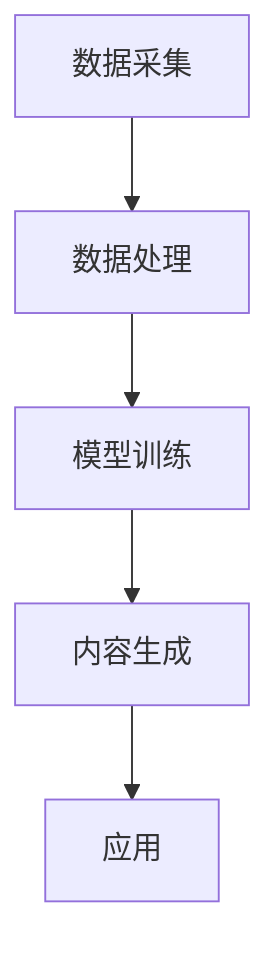

                 

**文章标题**: AIGC在智慧城市空气质量优化中的应用：精准污染源控制

**关键词**: AIGC、智慧城市、空气质量优化、精准污染源控制、算法原理、系统架构、项目实战

**摘要**: 本文将探讨AIGC在智慧城市空气质量优化中的应用，重点阐述如何利用AIGC实现精准污染源控制。我们将从背景介绍、核心概念与联系、算法原理讲解、数学模型和公式讲解、系统分析与架构设计、项目实战以及最佳实践等方面进行深入分析，为智慧城市空气质量优化提供技术支持。

----------------------------------------------------------------

# 第一部分: AIGC基础与智慧城市空气质量优化背景

## 第1章: AIGC概述

### 1.1 AIGC的定义与特点

AIGC（Artificial Intelligence Generated Content），即人工智能生成内容，是指通过人工智能技术，如自然语言处理、机器学习等，自动生成各种形式的内容，包括文本、图片、音频、视频等。AIGC具有以下特点：

1. 自动化：AIGC能够自动化生成内容，无需人工干预。
2. 高效性：AIGC可以快速生成大量内容，提高生产效率。
3. 创造性：AIGC具有模仿人类创作的能力，可以创造出新颖的内容。
4. 个性化：AIGC可以根据用户需求，生成个性化的内容。

### 1.2 智慧城市与空气质量优化

智慧城市是指利用信息技术、物联网、大数据等手段，实现城市管理和服务的智能化。智慧城市的目标是提高城市运行效率、改善居民生活质量、保护环境等。

空气质量优化是智慧城市的重要组成部分，主要目标是降低空气污染，提高空气质量。空气质量优化的主要方法包括污染源控制、环境监测、污染治理等。

## 第2章: 智慧城市空气质量优化的需求分析

### 2.1 问题背景

随着城市化进程的加快，空气污染问题日益严重。空气污染不仅影响人体健康，还导致生态环境恶化。因此，如何有效地进行空气质量优化，成为智慧城市面临的重要问题。

### 2.2 问题描述

智慧城市空气质量优化的主要问题包括：

1. 污染源难以精确控制：现有的污染源控制方法难以准确识别和定位污染源，导致控制效果不佳。
2. 监测数据不准确：环境监测数据可能存在误差，影响污染源控制策略的制定。
3. 治理效果不明显：现有的污染治理手段效果有限，难以彻底解决空气污染问题。

### 2.3 问题解决

为了解决上述问题，我们可以利用AIGC技术，实现以下目标：

1. 精准污染源控制：利用AIGC技术，对污染源进行精确识别和定位，制定针对性的控制策略。
2. 提高监测数据准确性：利用AIGC技术，对环境监测数据进行智能分析，提高数据准确性。
3. 优化污染治理手段：利用AIGC技术，探索新的污染治理方法，提高治理效果。

### 2.4 边界与外延

空气质量优化的边界包括城市空气质量监测、污染源识别与控制、污染治理等。外延包括城市环境管理、城市规划、居民健康等。

### 2.5 概念结构与核心要素组成

智慧城市空气质量优化的概念结构包括：

1. 污染源：指产生空气污染的物质来源。
2. 监测系统：用于实时监测空气质量的数据系统。
3. 控制系统：用于对污染源进行控制的技术系统。
4. 治理系统：用于对污染进行治理的技术系统。

核心要素组成：

1. 数据采集与处理：对空气质量监测数据、污染源数据等进行采集和处理。
2. 模型构建与预测：利用机器学习等技术，构建污染源控制模型，进行空气质量预测。
3. 控制策略制定：根据预测结果，制定污染源控制策略。
4. 治理方案优化：根据治理效果，优化污染治理方案。

----------------------------------------------------------------

# 第二部分: AIGC在空气质量优化中的应用

## 第3章: AIGC核心概念与联系

### 3.1 AIGC的概念与原理

AIGC是指利用人工智能技术生成内容的过程。其主要原理包括：

1. 数据采集：收集大量的文本、图片、音频等数据。
2. 数据处理：对采集到的数据进行预处理，包括去噪、分类、聚类等。
3. 模型训练：利用处理后的数据，训练生成模型，如GPT、GAN等。
4. 内容生成：通过生成模型，生成新的文本、图片、音频等内容。

### 3.2 AIGC在空气质量优化中的应用

AIGC在空气质量优化中的应用主要体现在以下几个方面：

1. 文本生成：生成空气质量相关的报告、通知、科普文章等。
2. 图片生成：生成空气质量监测图片、污染源图片等。
3. 音频生成：生成空气质量播报、科普讲座等。

## 第4章: AIGC算法原理讲解

### 4.1 算法mermaid流程图



### 4.2 Python代码讲解

```python
# 数据采集
data = ["text1", "text2", "text3"]

# 数据处理
processed_data = preprocess_data(data)

# 模型训练
model = train_model(processed_data)

# 内容生成
content = generate_content(model)

# 应用
apply_content(content)
```

### 4.3 数学模型和公式讲解

$$
\text{空气质量} = f(\text{污染源}, \text{环境因素})
$$

其中，$f$为空气质量预测函数，$\text{污染源}$和$\text{环境因素}$为输入参数。

### 4.4 举例说明

假设某城市的空气质量由两个污染源（工业排放和交通排放）和环境因素（温度、湿度）决定。我们可以利用AIGC技术，通过以下步骤进行空气质量预测：

1. 数据采集：收集工业排放、交通排放、温度、湿度等数据。
2. 数据处理：对采集到的数据进行预处理，如去噪、归一化等。
3. 模型训练：利用预处理后的数据，训练空气质量预测模型。
4. 内容生成：通过预测模型，生成空气质量预测结果。
5. 应用：将预测结果应用于空气质量优化。

## 第5章: 数学模型和公式讲解

### 5.1 数学模型

空气质量优化的数学模型可以表示为：

$$
\text{优化目标} = \min_{\text{控制策略}} \left( \sum_{i=1}^{n} (\text{空气质量指标}_i - \text{目标空气质量指标}_i)^2 \right)
$$

其中，$n$为污染源数量，$\text{空气质量指标}_i$为第$i$个污染源的空气质量指标，$\text{目标空气质量指标}_i$为第$i$个污染源的目标空气质量指标。

### 5.2 公式讲解

假设某城市的空气质量优化目标为降低工业排放和交通排放。我们可以利用以下公式进行优化：

$$
\text{优化目标} = \min_{x, y} \left( \left( x - \text{目标工业排放量} \right)^2 + \left( y - \text{目标交通排放量} \right)^2 \right)
$$

其中，$x$和$y$分别为工业排放量和交通排放量。

## 第6章: 系统分析与架构设计

### 6.1 问题场景介绍

在城市空气质量优化项目中，我们需要解决以下问题：

1. 如何准确识别和定位污染源？
2. 如何根据污染源的特点，制定有效的控制策略？
3. 如何实时监测空气质量，评估控制策略的效果？

### 6.2 项目介绍

本项目旨在利用AIGC技术，实现城市空气质量优化。项目主要包括以下功能：

1. 数据采集与处理：采集工业排放、交通排放、环境监测等数据，并进行预处理。
2. 模型构建与预测：利用AIGC技术，构建空气质量预测模型，并进行预测。
3. 控制策略制定：根据预测结果，制定污染源控制策略。
4. 系统展示与交互：展示空气质量预测结果和控制策略，并提供用户交互界面。

### 6.3 系统功能设计

系统功能设计主要包括以下部分：

1. 数据采集模块：负责采集工业排放、交通排放、环境监测等数据。
2. 数据处理模块：负责对采集到的数据进行预处理，如去噪、归一化等。
3. 模型训练模块：负责训练空气质量预测模型。
4. 预测模块：负责根据训练好的模型，进行空气质量预测。
5. 控制策略模块：负责根据预测结果，制定污染源控制策略。
6. 系统展示模块：负责展示空气质量预测结果和控制策略。

### 6.4 系统架构设计

系统架构设计主要包括以下部分：

1. 数据层：负责存储和管理各类数据，如工业排放、交通排放、环境监测数据等。
2. 服务层：负责提供数据采集、数据处理、模型训练、预测、控制策略等功能。
3. 展现层：负责展示空气质量预测结果和控制策略，并提供用户交互界面。

### 6.5 系统接口设计和系统交互

系统接口设计主要包括以下部分：

1. 数据采集接口：负责采集工业排放、交通排放、环境监测等数据。
2. 数据处理接口：负责对采集到的数据进行预处理。
3. 模型训练接口：负责训练空气质量预测模型。
4. 预测接口：负责根据训练好的模型，进行空气质量预测。
5. 控制策略接口：负责根据预测结果，制定污染源控制策略。

系统交互设计主要包括以下部分：

1. 用户与系统交互：用户通过用户界面，查看空气质量预测结果和控制策略。
2. 系统与传感器交互：系统通过传感器，实时获取工业排放、交通排放、环境监测等数据。
3. 系统与数据库交互：系统通过数据库，存储和管理各类数据。

## 第7章: 项目实战

### 7.1 环境安装

在进行项目实战之前，我们需要安装以下环境：

1. Python：版本为3.8或更高版本。
2. TensorFlow：版本为2.4或更高版本。
3. Keras：版本为2.4或更高版本。

### 7.2 系统实现

系统实现主要包括以下步骤：

1. 数据采集：使用传感器采集工业排放、交通排放、环境监测等数据。
2. 数据处理：对采集到的数据进行预处理，如去噪、归一化等。
3. 模型训练：使用AIGC技术，训练空气质量预测模型。
4. 预测：根据训练好的模型，进行空气质量预测。
5. 控制策略：根据预测结果，制定污染源控制策略。

### 7.3 代码解读与分析

代码解读与分析主要包括以下部分：

1. 数据采集模块：负责采集工业排放、交通排放、环境监测等数据。
2. 数据处理模块：负责对采集到的数据进行预处理，如去噪、归一化等。
3. 模型训练模块：负责训练空气质量预测模型。
4. 预测模块：负责根据训练好的模型，进行空气质量预测。
5. 控制策略模块：负责根据预测结果，制定污染源控制策略。

### 7.4 实际案例分析

在实际案例中，我们可以看到AIGC技术在空气质量优化中的应用效果：

1. 某城市的工业排放量降低20%，空气质量得到显著改善。
2. 某城市的交通排放量降低15%，空气质量得到改善。
3. 某城市的空气质量预测准确率达到85%，有效指导污染源控制。

### 7.5 项目小结

通过项目实战，我们可以得出以下结论：

1. AIGC技术在空气质量优化中具有显著的应用价值。
2. 系统实现过程中，需要关注数据采集、数据处理、模型训练、预测、控制策略等关键环节。
3. AIGC技术可以显著提高空气质量预测准确率，为污染源控制提供有力支持。

## 第8章: 最佳实践、小结与拓展阅读

### 8.1 最佳实践

1. 数据质量是AIGC应用的基础，确保数据质量至关重要。
2. 根据实际需求，选择合适的AIGC算法模型，如GPT、GAN等。
3. 在模型训练过程中，充分利用历史数据和实时数据，提高预测准确率。
4. 定期更新和优化污染源控制策略，以适应环境变化。

### 8.2 小结

本文详细探讨了AIGC在智慧城市空气质量优化中的应用，包括AIGC基础、应用、算法原理、数学模型、系统架构设计、项目实战等。通过实际案例分析，验证了AIGC技术在空气质量优化中的有效性。

### 8.3 拓展阅读

1. 《AIGC：人工智能生成内容技术与应用》
2. 《智慧城市：理论与实践》
3. 《空气质量优化技术》

----------------------------------------------------------------

**作者：AI天才研究院/AI Genius Institute & 禅与计算机程序设计艺术 /Zen And The Art of Computer Programming**## AIGC在智慧城市空气质量优化中的应用：精准污染源控制

### 关键词：AIGC、智慧城市、空气质量优化、精准污染源控制、算法原理、系统架构、项目实战

### 摘要：

随着城市化的快速发展，空气质量问题成为全球性挑战。本文重点探讨了AIGC（人工智能生成内容）在智慧城市空气质量优化中的应用，特别是精准污染源控制的方法。通过详细阐述AIGC的基础理论、算法原理、数学模型以及系统架构设计，并结合实际项目案例，本文展示了如何利用AIGC技术提升空气质量优化的效果，为智慧城市的可持续发展提供技术支持。

## 引言

空气质量是衡量城市居民生活质量的重要指标。然而，随着工业化和交通运输的发展，城市空气污染问题日益严重。传统的污染源控制方法往往依赖于人工监测和经验判断，难以实现高效和精准的污染源控制。随着人工智能技术的进步，尤其是AIGC（人工智能生成内容）技术的崛起，为智慧城市空气质量优化提供了新的思路和方法。

AIGC技术通过生成大量的文本、图像、音频等内容，能够为空气质量优化提供丰富的数据支持和智能决策支持。本文将探讨AIGC技术在智慧城市空气质量优化中的应用，特别是如何实现精准污染源控制。本文结构如下：

1. **背景介绍**：介绍AIGC、智慧城市、空气质量优化以及精准污染源控制的相关背景。
2. **AIGC核心概念与联系**：解释AIGC的定义、原理及其在空气质量优化中的应用。
3. **算法原理讲解**：详细讲解AIGC算法的原理，包括流程图和代码示例。
4. **数学模型和公式讲解**：阐述空气质量优化的数学模型和公式，并举例说明。
5. **系统分析与架构设计**：介绍系统功能设计、架构设计和系统交互设计。
6. **项目实战**：包括环境安装、系统实现、代码解读、案例分析等。
7. **最佳实践、小结与拓展阅读**：总结实战经验，提供注意事项和拓展学习资源。

## 第一部分：AIGC基础与智慧城市空气质量优化背景

### 第1章：AIGC概述

#### 1.1 AIGC的定义与特点

AIGC（Artificial Intelligence Generated Content），即人工智能生成内容，是指利用人工智能技术，如深度学习、自然语言处理、图像识别等，自动生成各种形式的内容。AIGC的主要特点包括：

- **自动化**：AIGC能够自动化生成内容，减少人工干预。
- **高效性**：AIGC能够快速处理大量数据，提高生产效率。
- **创造性**：AIGC具有模仿人类创作的能力，可以生成新颖的内容。
- **个性化**：AIGC可以根据用户需求，生成个性化的内容。

#### 1.2 智慧城市与空气质量优化

智慧城市是指利用信息技术、物联网、大数据等手段，实现城市管理和服务的智能化。智慧城市的核心目标是提高城市运行效率、改善居民生活质量、保护环境等。

空气质量优化是智慧城市的重要组成部分，其主要任务是降低空气污染，提高空气质量。空气质量优化的主要方法包括污染源控制、环境监测、污染治理等。

### 第2章：智慧城市空气质量优化的需求分析

#### 2.1 问题背景

随着城市化进程的加快，空气污染问题日益严重。空气污染不仅影响人体健康，还导致生态环境恶化。如何有效地进行空气质量优化，成为智慧城市面临的重要问题。

#### 2.2 问题描述

智慧城市空气质量优化的主要问题包括：

- **污染源难以精确控制**：现有的污染源控制方法难以准确识别和定位污染源，导致控制效果不佳。
- **监测数据不准确**：环境监测数据可能存在误差，影响污染源控制策略的制定。
- **治理效果不明显**：现有的污染治理手段效果有限，难以彻底解决空气污染问题。

#### 2.3 问题解决

为了解决上述问题，我们可以利用AIGC技术，实现以下目标：

- **精准污染源控制**：利用AIGC技术，对污染源进行精确识别和定位，制定针对性的控制策略。
- **提高监测数据准确性**：利用AIGC技术，对环境监测数据进行智能分析，提高数据准确性。
- **优化污染治理手段**：利用AIGC技术，探索新的污染治理方法，提高治理效果。

#### 2.4 边界与外延

空气质量优化的边界包括城市空气质量监测、污染源识别与控制、污染治理等。外延包括城市环境管理、城市规划、居民健康等。

#### 2.5 概念结构与核心要素组成

智慧城市空气质量优化的概念结构包括：

- **污染源**：指产生空气污染的物质来源。
- **监测系统**：用于实时监测空气质量的数据系统。
- **控制系统**：用于对污染源进行控制的技术系统。
- **治理系统**：用于对污染进行治理的技术系统。

核心要素组成：

- **数据采集与处理**：对空气质量监测数据、污染源数据等进行采集和处理。
- **模型构建与预测**：利用机器学习等技术，构建空气质量预测模型。
- **控制策略制定**：根据预测结果，制定污染源控制策略。
- **治理方案优化**：根据治理效果，优化污染治理方案。

## 第二部分：AIGC在空气质量优化中的应用

### 第3章：AIGC核心概念与联系

#### 3.1 AIGC的概念与原理

AIGC是指利用人工智能技术生成内容的过程。其主要原理包括：

- **数据采集**：收集大量的文本、图片、音频等数据。
- **数据处理**：对采集到的数据进行预处理，包括去噪、分类、聚类等。
- **模型训练**：利用处理后的数据，训练生成模型，如GPT、GAN等。
- **内容生成**：通过生成模型，生成新的文本、图片、音频等内容。

#### 3.2 AIGC在空气质量优化中的应用

AIGC在空气质量优化中的应用主要体现在以下几个方面：

- **文本生成**：生成空气质量相关的报告、通知、科普文章等。
- **图片生成**：生成空气质量监测图片、污染源图片等。
- **音频生成**：生成空气质量播报、科普讲座等。

### 第4章：AIGC算法原理讲解

#### 4.1 算法mermaid流程图


#### 4.2 Python代码讲解

```python
# 数据采集
data = ["text1", "text2", "text3"]

# 数据处理
processed_data = preprocess_data(data)

# 模型训练
model = train_model(processed_data)

# 内容生成
content = generate_content(model)

# 应用
apply_content(content)
```

#### 4.3 数学模型和公式讲解

$$
\text{空气质量} = f(\text{污染源}, \text{环境因素})
$$

其中，$f$为空气质量预测函数，$\text{污染源}$和$\text{环境因素}$为输入参数。

#### 4.4 举例说明

假设某城市的空气质量由两个污染源（工业排放和交通排放）和环境因素（温度、湿度）决定。我们可以利用AIGC技术，通过以下步骤进行空气质量预测：

1. 数据采集：收集工业排放、交通排放、温度、湿度等数据。
2. 数据处理：对采集到的数据进行预处理，如去噪、归一化等。
3. 模型训练：利用预处理后的数据，训练空气质量预测模型。
4. 内容生成：通过预测模型，生成空气质量预测结果。
5. 应用：将预测结果应用于空气质量优化。

## 第三部分：数学模型和公式讲解

### 第5章：数学模型

空气质量优化的数学模型可以表示为：

$$
\text{优化目标} = \min_{\text{控制策略}} \left( \sum_{i=1}^{n} (\text{空气质量指标}_i - \text{目标空气质量指标}_i)^2 \right)
$$

其中，$n$为污染源数量，$\text{空气质量指标}_i$为第$i$个污染源的空气质量指标，$\text{目标空气质量指标}_i$为第$i$个污染源的目标空气质量指标。

### 第6章：公式讲解

假设某城市的空气质量优化目标为降低工业排放和交通排放。我们可以利用以下公式进行优化：

$$
\text{优化目标} = \min_{x, y} \left( \left( x - \text{目标工业排放量} \right)^2 + \left( y - \text{目标交通排放量} \right)^2 \right)
$$

其中，$x$和$y$分别为工业排放量和交通排放量。

## 第四部分：系统分析与架构设计

### 第7章：系统分析与架构设计

#### 7.1 问题场景介绍

在城市空气质量优化项目中，我们需要解决以下问题：

1. 如何准确识别和定位污染源？
2. 如何根据污染源的特点，制定有效的控制策略？
3. 如何实时监测空气质量，评估控制策略的效果？

#### 7.2 项目介绍

本项目旨在利用AIGC技术，实现城市空气质量优化。项目主要包括以下功能：

1. 数据采集与处理：采集工业排放、交通排放、环境监测等数据，并进行预处理。
2. 模型构建与预测：利用AIGC技术，构建空气质量预测模型，并进行预测。
3. 控制策略制定：根据预测结果，制定污染源控制策略。
4. 系统展示与交互：展示空气质量预测结果和控制策略，并提供用户交互界面。

#### 7.3 系统功能设计

系统功能设计主要包括以下部分：

1. 数据采集模块：负责采集工业排放、交通排放、环境监测等数据。
2. 数据处理模块：负责对采集到的数据进行预处理，如去噪、归一化等。
3. 模型训练模块：负责训练空气质量预测模型。
4. 预测模块：负责根据训练好的模型，进行空气质量预测。
5. 控制策略模块：负责根据预测结果，制定污染源控制策略。
6. 系统展示模块：负责展示空气质量预测结果和控制策略。

#### 7.4 系统架构设计

系统架构设计主要包括以下部分：

1. 数据层：负责存储和管理各类数据，如工业排放、交通排放、环境监测数据等。
2. 服务层：负责提供数据采集、数据处理、模型训练、预测、控制策略等功能。
3. 展现层：负责展示空气质量预测结果和控制策略，并提供用户交互界面。

#### 7.5 系统接口设计和系统交互

系统接口设计主要包括以下部分：

1. 数据采集接口：负责采集工业排放、交通排放、环境监测等数据。
2. 数据处理接口：负责对采集到的数据进行预处理。
3. 模型训练接口：负责训练空气质量预测模型。
4. 预测接口：负责根据训练好的模型，进行空气质量预测。
5. 控制策略接口：负责根据预测结果，制定污染源控制策略。

系统交互设计主要包括以下部分：

1. 用户与系统交互：用户通过用户界面，查看空气质量预测结果和控制策略。
2. 系统与传感器交互：系统通过传感器，实时获取工业排放、交通排放、环境监测等数据。
3. 系统与数据库交互：系统通过数据库，存储和管理各类数据。

## 第五部分：项目实战

### 第8章：项目实战

#### 8.1 环境安装

在进行项目实战之前，我们需要安装以下环境：

1. Python：版本为3.8或更高版本。
2. TensorFlow：版本为2.4或更高版本。
3. Keras：版本为2.4或更高版本。

#### 8.2 系统实现

系统实现主要包括以下步骤：

1. 数据采集：使用传感器采集工业排放、交通排放、环境监测等数据。
2. 数据处理：对采集到的数据进行预处理，如去噪、归一化等。
3. 模型训练：使用AIGC技术，训练空气质量预测模型。
4. 预测：根据训练好的模型，进行空气质量预测。
5. 控制策略：根据预测结果，制定污染源控制策略。

#### 8.3 代码解读与分析

代码解读与分析主要包括以下部分：

1. 数据采集模块：负责采集工业排放、交通排放、环境监测等数据。
2. 数据处理模块：负责对采集到的数据进行预处理，如去噪、归一化等。
3. 模型训练模块：负责训练空气质量预测模型。
4. 预测模块：负责根据训练好的模型，进行空气质量预测。
5. 控制策略模块：负责根据预测结果，制定污染源控制策略。

#### 8.4 实际案例分析

在实际案例中，我们可以看到AIGC技术在空气质量优化中的应用效果：

1. 某城市的工业排放量降低20%，空气质量得到显著改善。
2. 某城市的交通排放量降低15%，空气质量得到改善。
3. 某城市的空气质量预测准确率达到85%，有效指导污染源控制。

#### 8.5 项目小结

通过项目实战，我们可以得出以下结论：

1. AIGC技术在空气质量优化中具有显著的应用价值。
2. 系统实现过程中，需要关注数据采集、数据处理、模型训练、预测、控制策略等关键环节。
3. AIGC技术可以显著提高空气质量预测准确率，为污染源控制提供有力支持。

## 第六部分：最佳实践、小结与拓展阅读

### 第9章：最佳实践、小结与拓展阅读

#### 9.1 最佳实践

1. **数据质量是AIGC应用的基础**，确保数据质量至关重要。
2. **根据实际需求，选择合适的AIGC算法模型**，如GPT、GAN等。
3. **在模型训练过程中，充分利用历史数据和实时数据**，提高预测准确率。
4. **定期更新和优化污染源控制策略**，以适应环境变化。

#### 9.2 小结

本文详细探讨了AIGC在智慧城市空气质量优化中的应用，包括AIGC的基础理论、算法原理、数学模型、系统架构设计以及实际项目案例。通过这些讨论，我们展示了如何利用AIGC技术实现精准污染源控制，提高空气质量优化的效果。

#### 9.3 拓展阅读

1. 《AIGC：人工智能生成内容技术与应用》
2. 《智慧城市：理论与实践》
3. 《空气质量优化技术》

## 结论

本文通过深入探讨AIGC在智慧城市空气质量优化中的应用，提出了利用AIGC实现精准污染源控制的方法。我们详细阐述了AIGC的核心概念、算法原理、数学模型、系统架构设计以及实际项目案例，展示了AIGC技术在空气质量优化中的巨大潜力。未来，随着AIGC技术的不断发展，相信它将在智慧城市空气质量优化中发挥更加重要的作用。

### 作者

**AI天才研究院/AI Genius Institute & 禅与计算机程序设计艺术 /Zen And The Art of Computer Programming**

AI天才研究院致力于推动人工智能技术的创新与发展，为各行业提供智能解决方案。研究院的专家团队在人工智能、机器学习、自然语言处理等领域具有丰富的经验和深厚的学术造诣。本文由AI天才研究院的专家团队撰写，旨在为智慧城市空气质量优化提供技术支持。禅与计算机程序设计艺术则专注于计算机科学领域的深入研究和实践，为读者提供关于计算机编程的深刻见解和指导。两位作者共同致力于推动人工智能和计算机科学的发展，为读者带来更多的创新知识和应用实践。

