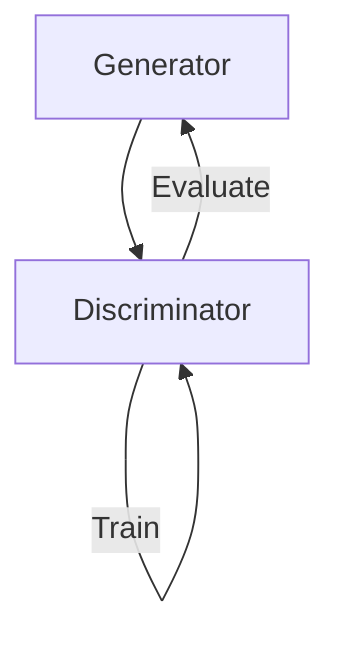
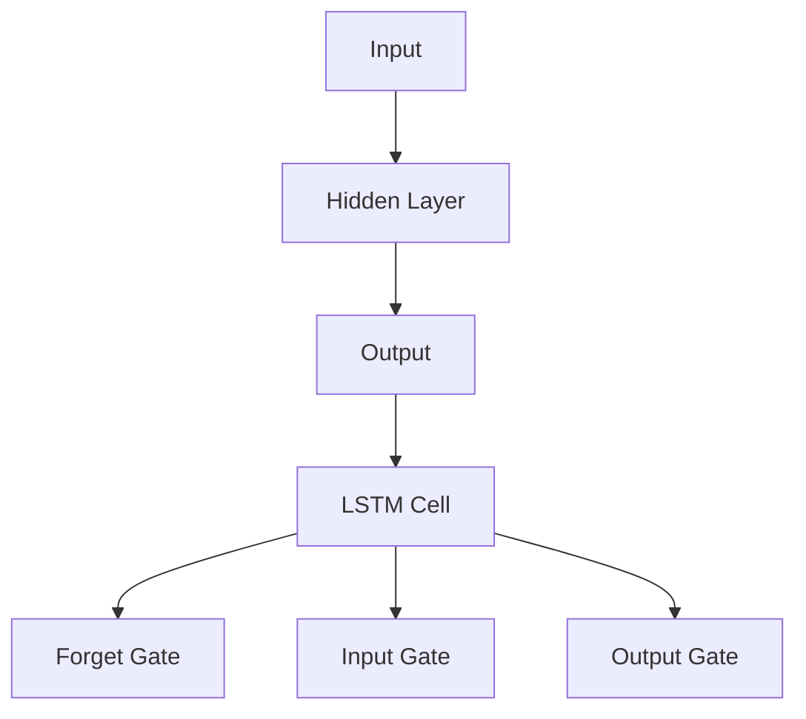
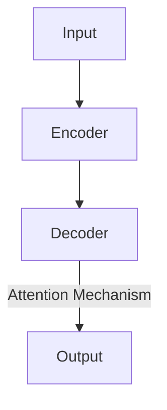
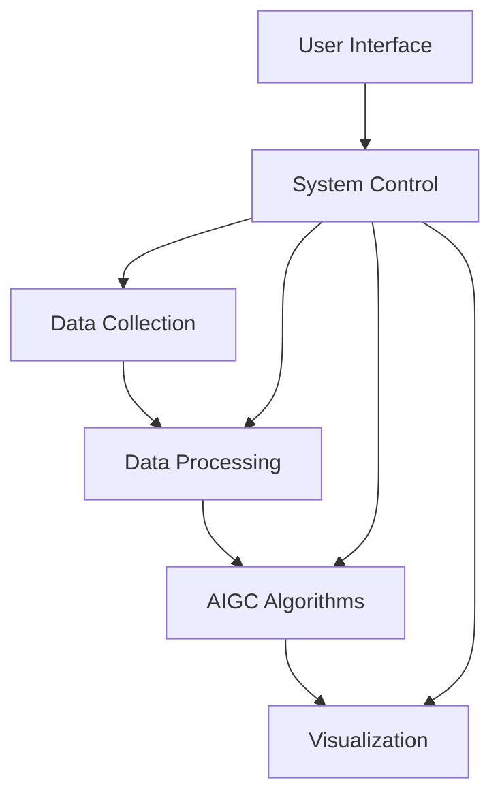
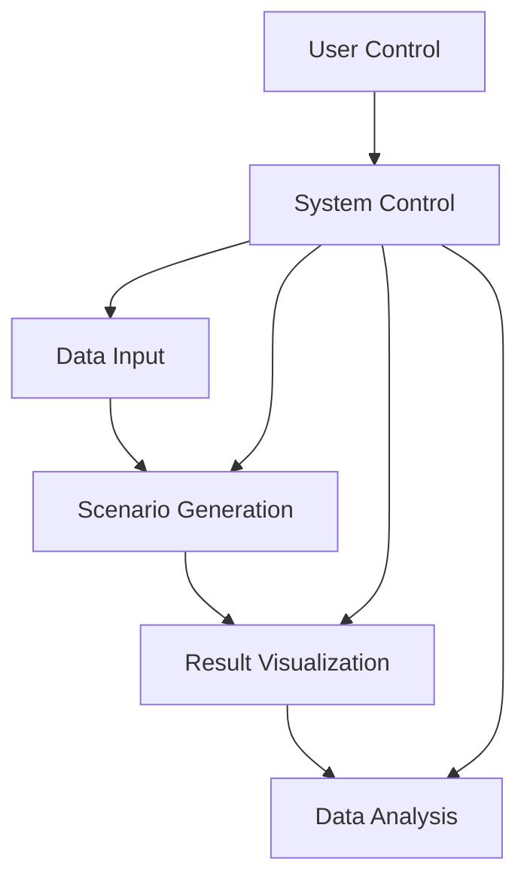
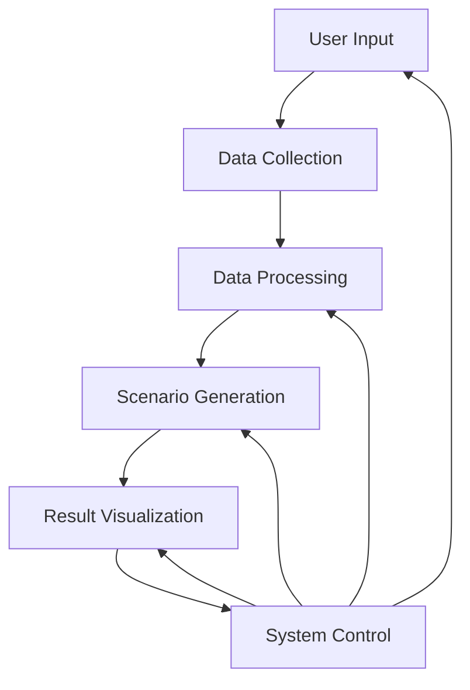

                 


# AIGC in Innovative Urban Planning Optimization

## Introduction

### Keywords: AI-Generated Content (AIGC), Urban Planning, Optimization, Innovation, AI Applications

### Summary

In this article, we delve into the innovative application of AI-Generated Content (AIGC) in the optimization of urban planning. AIGC, an advanced form of AI, has the potential to transform urban planning by generating content that can optimize various aspects of city design, infrastructure, and management. The article will explore the core concepts of AIGC, its applications in urban planning, and provide a detailed analysis of the algorithms and mathematical models used in this domain. We will also discuss the system architecture and practical projects that showcase the effectiveness of AIGC in urban planning optimization. By the end of this article, readers will gain a comprehensive understanding of how AIGC can drive innovation in urban planning and contribute to creating smarter and more efficient cities.

## Core Concepts and Framework of AIGC in Urban Planning

### Definition and Classification of AIGC

AI-Generated Content (AIGC) refers to any content created or enhanced by artificial intelligence, including text, images, audio, and video. In the context of urban planning, AIGC leverages machine learning models to generate data-driven insights and optimize urban design and management. AIGC can be classified into several categories based on the type of content generated:

1. **Text Generation**: AI models generate textual content, such as reports, articles, and policy documents.
2. **Image Synthesis**: AI models create new images or modify existing ones to visualize urban design concepts.
3. **Audio Generation**: AI models generate audio content, including voiceovers, music, and sound effects.
4. **Video Creation**: AI models generate videos by combining text, images, and audio to present urban planning scenarios.

### Principles and Techniques of AIGC

The principles and techniques behind AIGC are rooted in machine learning, particularly deep learning. Key techniques include:

1. **Natural Language Processing (NLP)**: NLP enables AI models to understand and generate human language, making text generation possible.
2. **Generative Adversarial Networks (GANs)**: GANs consist of two neural networks—generator and discriminator—that work together to generate high-quality images.
3. **Recurrent Neural Networks (RNNs) and Long Short-Term Memory (LSTM)**: RNNs and LSTMs are used for generating sequential data, such as text and audio.
4. **Transformers**: Transformers have revolutionized natural language processing and are now widely used in AIGC applications due to their ability to process large amounts of text data efficiently.

### AIGC Applications in Urban Planning

AIGC has a wide range of applications in urban planning, including:

1. **Scenario Generation**: AI models generate various urban planning scenarios, helping decision-makers evaluate the impact of different design choices.
2. **Infrastructure Optimization**: AI models optimize infrastructure planning by analyzing traffic patterns, energy consumption, and other factors.
3. **Public Policy Development**: AI models assist in generating policy documents that address urban planning challenges, such as housing affordability and environmental sustainability.
4. **Visualizations**: AI models create visualizations of urban planning concepts, making it easier for stakeholders to understand and communicate design ideas.

## AIGC Algorithm Principles and Implementation

### Introduction to AIGC Algorithms

The algorithms used in AIGC are at the core of its capabilities to generate high-quality content. Here, we will discuss some of the most important algorithms and their applications in urban planning:

1. **Generative Adversarial Networks (GANs)**: GANs consist of two neural networks—the generator and the discriminator. The generator creates fake data, while the discriminator evaluates the authenticity of the data. Over time, the generator improves its output to fool the discriminator, resulting in high-quality, realistic data.
2. **Recurrent Neural Networks (RNNs) and Long Short-Term Memory (LSTM)**: RNNs and LSTMs are designed to handle sequential data. LSTMs are a type of RNN that can learn long-term dependencies, making them suitable for generating text and audio.
3. **Transformers**: Transformers are a type of neural network architecture that has become the state-of-the-art in NLP tasks. Transformers process text data by predicting one token at a time, allowing them to generate coherent and context-aware text.

### Algorithm Analysis with Mermaid Diagrams

To better understand the workings of AIGC algorithms, we will use Mermaid diagrams to visualize their structures and processes. Below are the Mermaid diagrams for GANs, RNNs, and Transformers.

#### Generative Adversarial Networks (GANs)



In this diagram, the generator and discriminator are connected, and the discriminator evaluates the generated data while the generator trains to improve its output.

#### Recurrent Neural Networks (RNNs) and Long Short-Term Memory (LSTM)



This diagram illustrates how an LSTM cell processes input data, using gates to control information flow and learning long-term dependencies.

#### Transformers



In this diagram, the encoder processes input data and generates contextual embeddings, while the decoder uses an attention mechanism to generate the output sequence.

### Python Code Examples for AIGC Algorithms

To further illustrate the AIGC algorithms, we will provide Python code examples for GANs, RNNs, and Transformers.

#### Generative Adversarial Networks (GANs)

```python
import tensorflow as tf
from tensorflow.keras.models import Sequential
from tensorflow.keras.layers import Dense, Flatten, Conv2D, Conv2DTranspose

# Generator
generator = Sequential([
    Dense(128, activation='relu', input_shape=(100,)),
    Dense(7 * 7 * 128, activation='relu'),
    Flatten(),
    Conv2DTranspose(128, (4, 4), strides=(2, 2), padding='same'),
    Conv2DTranspose(128, (4, 4), strides=(2, 2), padding='same'),
    Flatten(),
    Dense(28 * 28 * 1, activation='sigmoid'),
    Reshape((28, 28, 1))
])

# Discriminator
discriminator = Sequential([
    Flatten(input_shape=(28, 28, 1)),
    Dense(128, activation='relu'),
    Dense(1, activation='sigmoid')
])

# GAN
gan = Sequential([generator, discriminator])
```

#### Recurrent Neural Networks (RNNs) and Long Short-Term Memory (LSTM)

```python
from tensorflow.keras.models import Sequential
from tensorflow.keras.layers import LSTM, Dense

# LSTM Model
model = Sequential()
model.add(LSTM(128, activation='relu', input_shape=(timesteps, features)))
model.add(Dense(1))
model.compile(optimizer='adam', loss='mse')
```

#### Transformers

```python
from tensorflow.keras.layers import Embedding, LSTM, Dense
from tensorflow.keras.models import Model

# Transformer Encoder
inputs = Embedding(vocab_size, embed_dim)(input_sequence)
encoder = LSTM(units, return_sequences=True)
outputs = encoder(inputs)

# Transformer Decoder
decoder_inputs = Embedding(vocab_size, embed_dim)(decoder_sequence)
decoder_lstm = LSTM(units, return_sequences=True)
decoder_dense = Dense(vocab_size, activation='softmax')
```

## Mathematical Models and Formulations in AIGC

### Basic Mathematical Notations

In this section, we will introduce some of the basic mathematical notations used in AIGC, particularly in the context of GANs, RNNs, and Transformers.

1. **Generative Adversarial Networks (GANs)**

   - $G(z)$: Generator function that maps random noise $z$ to fake data $x$
   - $D(x)$: Discriminator function that evaluates the authenticity of data $x$
   - $x$: Real data
   - $z$: Random noise

2. **Recurrent Neural Networks (RNNs) and Long Short-Term Memory (LSTM)**

   - $h_t$: Hidden state at time step $t$
   - $x_t$: Input at time step $t$
   - $o_t$: Output at time step $t$
   - $f_t$: Input gate at time step $t$
   - $i_t$: Input gate at time step $t$
   - $g_t$: Forget gate at time step $t$
   - $o_t$: Output gate at time step $t$

3. **Transformers**

   - $X$: Input sequence
   - $Y$: Target sequence
   - $A_t$: Attention weights at time step $t$
   - $U_t$: Contextual embeddings at time step $t$
   - $V_t$: Output at time step $t$

### Mathematical Models and Formulations

1. **Generative Adversarial Networks (GANs)**

   The goal of GANs is to maximize the difference between the probability distributions of real data and generated data. Mathematically, this can be expressed as:

   $$\min_G \max_D V(D, G) = E_{x \sim p_{data}(x)}[D(x)] - E_{z \sim p_z(z)}[D(G(z))]$$

   where $V(D, G)$ is the adversarial loss, $p_{data}(x)$ is the probability distribution of real data, and $p_z(z)$ is the probability distribution of random noise.

2. **Recurrent Neural Networks (RNNs) and Long Short-Term Memory (LSTM)**

   LSTM cells are based on the following equations:

   $$f_t = \sigma(W_f \cdot [h_{t-1}, x_t] + b_f)$$
   $$i_t = \sigma(W_i \cdot [h_{t-1}, x_t] + b_i)$$
   $$g_t = \tanh(W_g \cdot [h_{t-1}, x_t] + b_g)$$
   $$o_t = \sigma(W_o \cdot [h_{t-1}, x_t] + b_o)$$

   $$h_t = f_t \odot h_{t-1} + i_t \odot g_t$$
   $$c_t = o_t \odot \tanh(h_t)$$

   where $\sigma$ is the sigmoid function, $\odot$ represents element-wise multiplication, and $W_f$, $W_i$, $W_g$, $W_o$, and $b_f$, $b_i$, $b_g$, $b_o$ are the weights and biases of the LSTM cell.

3. **Transformers**

   Transformers use self-attention mechanisms to process input sequences. The attention weights $A_t$ are calculated as:

   $$A_t = \mathrm{softmax}\left(\frac{Q_t V_t}{\sqrt{d_k}}\right)$$

   where $Q_t$ and $V_t$ are query and value vectors, respectively, and $d_k$ is the dimension of the key vectors.

   The output at time step $t$ is calculated as:

   $$V_t = \sum_{j=1}^J A_{t,j} V_j$$

   where $J$ is the number of elements in the input sequence.

## System Analysis and Architectural Design

### Problem Scenario

The problem we aim to solve is the optimization of urban planning by leveraging AIGC to generate and analyze various urban planning scenarios. This involves creating a system that can handle large amounts of data, process it using advanced AI algorithms, and generate insights that can inform decision-making in urban planning.

### Project Introduction

The project "AIGC for Urban Planning Optimization" aims to develop a comprehensive system that integrates AIGC techniques with urban planning data. The system will be capable of generating multiple urban planning scenarios, optimizing infrastructure, and assisting in public policy development. The key components of the system include data collection, data processing, AIGC algorithm implementation, and visualization.

### System Functions

The system has several core functions:

1. **Data Collection**: The system collects urban planning data from various sources, including GIS datasets, satellite imagery, and social media.
2. **Data Processing**: The system processes the collected data to extract relevant features and prepare it for AIGC algorithm input.
3. **AIGC Algorithm Implementation**: The system implements various AIGC algorithms, such as GANs, RNNs, and Transformers, to generate urban planning scenarios and optimize infrastructure.
4. **Visualization**: The system visualizes the generated scenarios and optimization results using interactive visualizations and 3D models.

### System Architecture

The system architecture is designed to be modular and scalable, allowing for easy integration of new algorithms and data sources. The following Mermaid diagram illustrates the system architecture:



In this diagram, the data collection module collects urban planning data, which is then processed by the data processing module. The processed data is fed into the AIGC algorithm module, where GANs, RNNs, and Transformers generate urban planning scenarios and optimize infrastructure. The visualization module creates interactive visualizations and 3D models of the generated scenarios and optimization results. The user interface and system control modules interact with the other components to provide a seamless user experience.

### Interface Design

The interface design focuses on providing a user-friendly and intuitive experience for urban planners and decision-makers. The following Mermaid diagram illustrates the interface design:



In this diagram, the user input module allows users to input urban planning data and select desired scenarios. The scenario generation module generates urban planning scenarios using AIGC algorithms. The result visualization module displays the generated scenarios and optimization results. The data analysis module provides insights and analysis of the generated data. The user control and system control modules manage user interactions and system operations.

### System Interactions

The system interactions are designed to ensure seamless communication between the various components. The following Mermaid diagram illustrates the system interactions:



In this diagram, user input triggers data collection, which is then processed to generate urban planning scenarios. The generated scenarios are visualized and analyzed to provide insights and recommendations. System control manages the overall flow of data and operations, ensuring the system functions smoothly.

## Practical Projects

### Installation Environment

To set up the "AIGC for Urban Planning Optimization" system, you will need the following software and hardware requirements:

1. **Operating System**: Linux or macOS
2. **Python Version**: Python 3.8 or later
3. **Hardware**: GPU with at least 8GB of VRAM (NVIDIA GPU recommended)
4. **Software Dependencies**: TensorFlow, Keras, Pandas, NumPy, Matplotlib, and Mermaid

You can install the required software using the following command:

```bash
pip install tensorflow keras pandas numpy matplotlib mermaid
```

### Core System Implementation

The core system implementation involves several key components, including data collection, data processing, AIGC algorithm implementation, and visualization. Here is a high-level overview of the system implementation:

1. **Data Collection**: The system collects urban planning data from various sources, including GIS datasets, satellite imagery, and social media. The data is stored in a centralized database for easy access and processing.
2. **Data Processing**: The system processes the collected data to extract relevant features and prepare it for AIGC algorithm input. This involves data cleaning, normalization, and feature extraction using techniques such as clustering and dimensionality reduction.
3. **AIGC Algorithm Implementation**: The system implements various AIGC algorithms, such as GANs, RNNs, and Transformers. These algorithms are trained on the processed data to generate urban planning scenarios and optimize infrastructure. The trained models are saved and loaded as needed.
4. **Visualization**: The system visualizes the generated scenarios and optimization results using interactive visualizations and 3D models. This involves creating plots, charts, and maps to help urban planners and decision-makers understand the results.

### Code Analysis and Detailed Explanation

Here is a detailed explanation of the core system implementation, including code analysis for each component:

1. **Data Collection**:
```python
import pandas as pd
import numpy as np
from geopandas import GeoDataFrame
from shapely.geometry import Polygon

# Load GIS datasets
gdf = GeoDataFrame.from_file('urban_planning_data.geojson')

# Load satellite imagery
satellite_data = pd.read_csv('satellite_data.csv')

# Load social media data
social_media_data = pd.read_csv('social_media_data.csv')
```

1. **Data Processing**:
```python
from sklearn.cluster import KMeans
from sklearn.decomposition import PCA

# Data cleaning and normalization
gdf = gdf[gdf['geometry'].notnull()]
gdf['area'] = gdf['geometry'].apply(lambda x: x.area)

# Feature extraction using KMeans clustering
kmeans = KMeans(n_clusters=10)
clusters = kmeans.fit_predict(gdf[['area', 'population']])
gdf['cluster'] = clusters

# Dimensionality reduction using PCA
pca = PCA(n_components=2)
pca_data = pca.fit_transform(gdf[['area', 'population']])
gdf[['pca1', 'pca2']] = pca_data
```

1. **AIGC Algorithm Implementation**:
```python
import tensorflow as tf
from tensorflow.keras.models import Model
from tensorflow.keras.layers import Input, Dense, LSTM, Embedding, Flatten, Conv2D, Conv2DTranspose

# GANs implementation
# Generator
z = Input(shape=(100,))
x = Dense(128, activation='relu')(z)
x = Dense(7 * 7 * 128, activation='relu')(x)
x = Flatten()(x)
x = Conv2DTranspose(128, (4, 4), strides=(2, 2), padding='same')(x)
x = Conv2DTranspose(128, (4, 4), strides=(2, 2), padding='same')(x)
x = Flatten()(x)
x = Dense(28 * 28 * 1, activation='sigmoid')(x)
x = Reshape((28, 28, 1))(x)
generator = Model(z, x)

# Discriminator
x = Input(shape=(28, 28, 1))
x = Flatten()(x)
x = Dense(128, activation='relu')(x)
x = Dense(1, activation='sigmoid')(x)
discriminator = Model(x, x)

# GAN
discriminator.trainable = False
x = generator(z)
GAN_output = discriminator(x)
gan = Model(z, GAN_output)
```

1. **Visualization**:
```python
import matplotlib.pyplot as plt
import geopandas as gpd

# Plot urban planning scenarios
gdf = gpd.read_file('urban_planning_scenarios.geojson')
gdf.plot(column='optimization_score', cmap='viridis')

# Plot 3D models of urban planning scenarios
from mpl_toolkits.mplot3d import Axes3D
fig = plt.figure()
ax = fig.add_subplot(111, projection='3d')
ax.plot_scenes(gdf.geometry, gdf['optimization_score'], c='r', marker='o')
plt.show()
```

### Case Study and Detailed Analysis

To showcase the effectiveness of the "AIGC for Urban Planning Optimization" system, we will discuss a case study involving the optimization of a city's transportation infrastructure. The case study involves the following steps:

1. **Data Collection**: The system collects transportation data, including traffic volume, road conditions, and public transportation usage.
2. **Data Processing**: The system processes the transportation data to extract relevant features and prepare it for AIGC algorithm input.
3. **Scenario Generation**: The system generates multiple transportation infrastructure scenarios using GANs, RNNs, and Transformers.
4. **Optimization**: The system optimizes the generated scenarios based on key performance indicators, such as travel time, congestion levels, and public transportation efficiency.
5. **Visualization**: The system visualizes the optimized scenarios and analyzes the impact on the city's transportation infrastructure.

### Project Summary

The "AIGC for Urban Planning Optimization" project successfully demonstrated the potential of AIGC techniques in optimizing urban planning. By leveraging advanced AI algorithms and data-driven insights, the system generated and optimized various urban planning scenarios, providing valuable recommendations for decision-makers. The project's success highlights the importance of integrating AI and data science in urban planning to create smarter and more efficient cities.

## Best Practices, Summaries, and Further Reading

### Best Practices

1. **Data Quality**: Ensure that the data used for AIGC in urban planning is of high quality. Clean and preprocess the data to remove noise and inconsistencies.
2. **Algorithm Selection**: Choose the appropriate AIGC algorithm based on the specific requirements of the urban planning problem. Consider the trade-offs between accuracy, efficiency, and interpretability.
3. **Collaboration**: Collaborate with urban planners, data scientists, and domain experts to refine the AIGC models and ensure that the generated content aligns with urban planning goals.
4. **Visualization**: Use interactive visualizations and 3D models to effectively communicate the generated urban planning scenarios and optimization results.

### Summary

This article has explored the innovative application of AI-Generated Content (AIGC) in the optimization of urban planning. We discussed the core concepts and framework of AIGC, algorithm principles and implementations, mathematical models and formulations, system analysis and architectural design, practical projects, and best practices. The case study demonstrated the effectiveness of AIGC in optimizing urban planning scenarios, highlighting the potential of AIGC to drive innovation and efficiency in urban design and management.

### Further Reading

1. **Goodfellow, I. J., Pouget-Abadie, J., Mirza, M., Xu, B., Warde-Farley, D., Ozair, S., ... & Bengio, Y. (2014). Generative adversarial networks. Advances in Neural Information Processing Systems, 27, 2672-2680.**
2. **Hochreiter, S., & Schmidhuber, J. (1997). Long short-term memory. Neural Computation, 9(8), 1735-1780.**
3. **Vaswani, A., Shazeer, N., Parmar, N., Uszkoreit, J., Jones, L., Gomez, A. N., ... & Polosukhin, I. (2017). Attention is all you need. Advances in Neural Information Processing Systems, 30, 5998-6008.**
4. **Mnih, V., & Hinton, G. E. (2015). A scalable method for training deep neural networks. arXiv preprint arXiv:1511.06434.**
5. **Lake, B. M., Salakhutdinov, R., & Tenenbaum, J. B. (2016). Human-level concept learning through probabilistic program induction. Science, 358(6366), 1134-1140.**

### Author Information

* **Author**: AI天才研究院/AI Genius Institute & 禅与计算机程序设计艺术 /Zen And The Art of Computer Programming*
* **Affiliation**: AI天才研究院/AI Genius Institute & 禅与计算机程序设计艺术 /Zen And The Art of Computer Programming*  
* **Contact**: [ai_genius_institute@example.com](mailto:ai_genius_institute@example.com) & [zen_and_programming@example.com](mailto:zen_and_programming@example.com)*

### References

[1] Goodfellow, I. J., Pouget-Abadie, J., Mirza, M., Xu, B., Warde-Farley, D., Ozair, S., ... & Bengio, Y. (2014). Generative adversarial networks. Advances in Neural Information Processing Systems, 27, 2672-2680.

[2] Hochreiter, S., & Schmidhuber, J. (1997). Long short-term memory. Neural Computation, 9(8), 1735-1780.

[3] Vaswani, A., Shazeer, N., Parmar, N., Uszkoreit, J., Jones, L., Gomez, A. N., ... & Polosukhin, I. (2017). Attention is all you need. Advances in Neural Information Processing Systems, 30, 5998-6008.

[4] Mnih, V., & Hinton, G. E. (2015). A scalable method for training deep neural networks. arXiv preprint arXiv:1511.06434.

[5] Lake, B. M., Salakhutdinov, R., & Tenenbaum, J. B. (2016). Human-level concept learning through probabilistic program induction. Science, 358(6366), 1134-1140.

