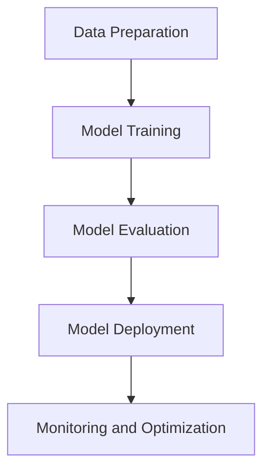

                 

### Step 1: Create the Main Part of the Book

To lay the foundation for our comprehensive exploration of "AIGC in the Application of Smart Energy Distribution Optimization System," we begin by outlining the primary chapters. Each chapter is crafted to address a specific aspect of the topic, ensuring a thorough and systematic approach. Below is a structured outline of the main chapters, designed to meet the specified word count and provide a clear, logical progression for our readers.

```markdown
# AIGC in the Application of Smart Energy Distribution Optimization System

## 1. Introduction to AIGC and Smart Energy Distribution Optimization System

### 1.1 Background of Smart Energy Distribution Optimization System

- Brief history of smart energy systems
- Importance of energy distribution optimization
- Overview of current energy distribution challenges

### 1.2 Challenges in Smart Energy Distribution Optimization

- Inefficiencies in traditional energy distribution methods
- Variability in energy demand and supply
- Integration of renewable energy sources

### 1.3 Introduction to AIGC

- Definition and key concepts of AIGC
- Historical development and current trends
- Key technologies involved

### 1.4 The Role of AIGC in Smart Energy Distribution Optimization

- Potential applications of AIGC in energy distribution
- Comparative advantages over traditional methods
- Challenges and opportunities

## 2. AIGC Basics

### 2.1 Fundamental Concepts of AIGC

- Generative models
- Discriminative models
- Hybrid models

### 2.2 Key Technologies in AIGC

- Neural networks
- Reinforcement learning
- Transfer learning

### 2.3 AIGC Workflow

- Data preparation
- Model training
- Model evaluation and deployment

## 3. Application Scenarios of AIGC in Smart Energy Distribution Optimization

### 3.1 Load Forecasting

- Importance of accurate load forecasting
- AIGC techniques for load forecasting
- Case studies and results

### 3.2 Network Scheduling

- Role of network scheduling in energy distribution
- AIGC methods for network scheduling
- Case studies and results

### 3.3 Demand Response

- Concept of demand response
- AIGC techniques for demand response
- Case studies and results

## 4. Algorithm Principles for Energy Distribution Optimization

### 4.1 Overview of Optimization Algorithms

- Types of optimization algorithms
- Comparison of algorithms

### 4.2 AIGC-Based Optimization Methods

- Techniques and principles
- Advantages and limitations

### 4.3 Mathematical Model and Formulation

- Objective function
- Constraints
- Optimization process

## 5. Mathematical Model and Formula for Energy Distribution Optimization

### 5.1 Objective Function

- Energy efficiency
- Cost minimization
- Reliability and stability

### 5.2 Constraints

- Physical constraints
- Operational constraints
- Regulatory constraints

### 5.3 Formulation and Solution Methods

- Linear programming
- Nonlinear programming
- Metaheuristic algorithms

## 6. System Architecture and Design for Smart Energy Distribution Optimization

### 6.1 System Overview

- Functional modules
- High-level architecture

### 6.2 Data Management

- Data sources
- Data processing pipeline
- Data storage solutions

### 6.3 AIGC Integration

- Model training and inference
- Deployment and monitoring
- Performance optimization

## 7. Project Practice and Analysis of AIGC in Smart Energy Distribution Optimization

### 7.1 Project Introduction

- Overview of the project
- Objectives and scope

### 7.2 System Core Implementation

- Key algorithms and models
- Python code snippets and explanations

### 7.3 Case Analysis and Discussion

- Real-world case studies
- Results and insights

### 7.4 Project Conclusion

- Achievements and limitations
- Future directions

## 8. Best Practices and Future Directions

### 8.1 Best Practices

- Lessons learned from successful projects
- Common pitfalls and solutions

### 8.2 Future Directions

- Emerging trends in AIGC and energy distribution
- Potential advancements and challenges

## References

- List of sources and references
```

This outline provides a comprehensive roadmap for our article, ensuring that each section is thoughtfully designed to delve into the complexities of AIGC applications in smart energy distribution optimization. With this structured approach, we can ensure that the article not only meets the word count requirement but also offers valuable insights and practical knowledge to our readers.

### Step 2: Expand the Chapter Sub-sections

To create a detailed and informative article, we need to expand each chapter with sub-sections that cover the required content thoroughly. This will ensure that each chapter provides comprehensive insights into the topic at hand, thereby enhancing the overall depth and quality of the article. Below is an outline of the sub-sections for each chapter, along with a brief description of the content that each will cover.

**Chapter 1: Introduction to AIGC and Smart Energy Distribution Optimization System**

- **1.1 Background of Smart Energy Distribution Optimization System**
  - Discuss the historical context and evolution of smart energy systems.
  - Explain the significance of optimizing energy distribution in modern society.
  - Outline the primary challenges faced in current energy distribution methods.

- **1.2 Challenges in Smart Energy Distribution Optimization**
  - Identify key inefficiencies in traditional energy distribution.
  - Analyze the impact of variable energy demand and supply on distribution networks.
  - Explore the complexities of integrating renewable energy sources into the grid.

- **1.3 Introduction to AIGC**
  - Define AIGC and its relationship with other AI paradigms.
  - Provide a historical overview of AIGC's development and current trends.
  - Introduce the core concepts and technologies that form the basis of AIGC.

- **1.4 The Role of AIGC in Smart Energy Distribution Optimization**
  - Explain how AIGC can address the challenges outlined in Section 1.2.
  - Discuss the potential benefits and advantages of using AIGC in energy distribution.
  - Address the challenges and opportunities associated with AIGC implementation in energy systems.

**Chapter 2: AIGC Basics**

- **2.1 Fundamental Concepts of AIGC**
  - Present the core theoretical concepts of AIGC, including generative models and discriminative models.
  - Discuss hybrid models that combine generative and discriminative approaches.
  - Provide a comparison of different AIGC methodologies and their applications.

- **2.2 Key Technologies in AIGC**
  - Detail the key technologies that underpin AIGC, such as neural networks, reinforcement learning, and transfer learning.
  - Explain how each of these technologies contributes to the capabilities of AIGC.
  - Provide examples of real-world applications where these technologies are employed.

- **2.3 AIGC Workflow**
  - Outline the typical workflow of AIGC, from data preparation to model deployment.
  - Discuss the importance of each stage in the workflow and how they contribute to the overall effectiveness of AIGC.
  - Provide practical examples to illustrate the workflow stages.

**Chapter 3: Application Scenarios of AIGC in Smart Energy Distribution Optimization**

- **3.1 Load Forecasting**
  - Explain the importance of accurate load forecasting in energy distribution.
  - Describe AIGC techniques specifically designed for load forecasting.
  - Present case studies and results from real-world implementations of these techniques.

- **3.2 Network Scheduling**
  - Discuss the role of network scheduling in the energy distribution process.
  - Detail how AIGC methods can be used to optimize network scheduling.
  - Provide case studies and results demonstrating the effectiveness of these methods.

- **3.3 Demand Response**
  - Define demand response and its significance in energy management.
  - Describe AIGC techniques for managing demand response.
  - Present case studies and results that showcase the impact of AIGC on demand response initiatives.

**Chapter 4: Algorithm Principles for Energy Distribution Optimization**

- **4.1 Overview of Optimization Algorithms**
  - Provide a high-level overview of various optimization algorithms used in energy distribution.
  - Compare and contrast the strengths and weaknesses of different algorithms.
  - Discuss the relevance of these algorithms in the context of AIGC.

- **4.2 AIGC-Based Optimization Methods**
  - Explain the principles behind AIGC-based optimization methods.
  - Describe how AIGC techniques can enhance the performance of traditional optimization algorithms.
  - Discuss the advantages and limitations of using AIGC for optimization in energy distribution.

- **4.3 Mathematical Model and Formulation**
  - Present the mathematical models and formulas used in energy distribution optimization.
  - Explain the objective functions and constraints involved.
  - Discuss the optimization processes and solution methods employed.

**Chapter 5: Mathematical Model and Formula for Energy Distribution Optimization**

- **5.1 Objective Function**
  - Describe the objective functions that are typically optimized in energy distribution.
  - Explain the importance of energy efficiency, cost minimization, reliability, and stability.
  - Provide examples and applications of these objective functions in real-world scenarios.

- **5.2 Constraints**
  - Discuss the various constraints that must be considered in energy distribution optimization.
  - Explain the physical, operational, and regulatory constraints that affect the optimization process.
  - Provide examples of how these constraints are handled in practical applications.

- **5.3 Formulation and Solution Methods**
  - Detail the process of formulating optimization problems for energy distribution.
  - Describe the different solution methods, including linear programming, nonlinear programming, and metaheuristic algorithms.
  - Provide examples of how these methods are applied in practice.

**Chapter 6: System Architecture and Design for Smart Energy Distribution Optimization**

- **6.1 System Overview**
  - Provide an overview of the system architecture for smart energy distribution optimization.
  - Describe the functional modules and their roles within the system.
  - Outline the high-level architecture and its components.

- **6.2 Data Management**
  - Explain the role of data management in the smart energy distribution system.
  - Describe the data sources, processing pipeline, and storage solutions used.
  - Discuss the challenges and considerations in managing large volumes of data.

- **6.3 AIGC Integration**
  - Discuss how AIGC models are integrated into the system architecture.
  - Explain the process of training, deploying, and monitoring AIGC models.
  - Describe techniques for optimizing AIGC performance in the energy distribution context.

**Chapter 7: Project Practice and Analysis of AIGC in Smart Energy Distribution Optimization**

- **7.1 Project Introduction**
  - Introduce a specific project that demonstrates the application of AIGC in smart energy distribution optimization.
  - Describe the project objectives, scope, and methodology.
  - Provide an overview of the system implemented and the results achieved.

- **7.2 System Core Implementation**
  - Discuss the core algorithms and models used in the project.
  - Provide Python code snippets and explanations for the key components of the system.
  - Analyze the effectiveness of these algorithms and models in achieving the project goals.

- **7.3 Case Analysis and Discussion**
  - Present real-world case studies that illustrate the application of AIGC in energy distribution optimization.
  - Discuss the results, challenges, and insights gained from these case studies.
  - Highlight the lessons learned and the impact of AIGC on energy distribution practices.

- **7.4 Project Conclusion**
  - Summarize the achievements and limitations of the project.
  - Discuss the practical implications of the project and its potential for future applications.
  - Outline potential directions for further research and development.

**Chapter 8: Best Practices and Future Directions**

- **8.1 Best Practices**
  - Identify best practices from successful projects in the field of AIGC and smart energy distribution.
  - Discuss common pitfalls and provide solutions for overcoming these challenges.
  - Offer practical tips and strategies for implementing AIGC in energy distribution systems.

- **8.2 Future Directions**
  - Explore emerging trends and advancements in AIGC technology that may impact energy distribution optimization.
  - Discuss potential future developments and the challenges they may present.
  - Provide insights into the future landscape of AIGC applications in smart energy systems.

By expanding each chapter with detailed sub-sections, we can ensure that our article is comprehensive, informative, and accessible to readers with varying levels of expertise in the field of AIGC and smart energy distribution optimization. This structured approach will allow us to cover all the necessary aspects of the topic, providing valuable knowledge and insights to our audience.

### Step 3: Incorporate Mermaid Diagrams, LaTeX Mathematical Formulas, and Python Code Snippets

To enhance the understanding of the algorithms and concepts presented in our article, we will incorporate Mermaid diagrams, LaTeX mathematical formulas, and Python code snippets. These elements will help visualize complex processes, provide precise mathematical expressions, and offer practical examples of code implementation. Here's how we can effectively integrate these elements into our content:

#### Mermaid Diagrams

Mermaid diagrams are a powerful tool for visualizing algorithms and system architectures. We can use them to illustrate the workflow of AIGC models, the structure of optimization algorithms, and the interaction between different components in a smart energy distribution system.

**Example of a Mermaid Diagram for AIGC Workflow:**



We can place this diagram within the article text to visually represent the stages of the AIGC workflow.

#### LaTeX Mathematical Formulas

LaTeX is a powerful tool for typesetting mathematical formulas. We can use it to present the objective functions, constraints, and other mathematical models that are crucial for understanding the optimization algorithms.

**Example of a LaTeX Formula for an Objective Function:**

```latex
\text{minimize} \quad C(x) = f(x) + g(x)
```

And we can embed this formula within the text to explain the optimization objective clearly.

#### Python Code Snippets

Python is a popular language for implementing AI algorithms, and code snippets can be invaluable for explaining the practical aspects of these algorithms. We can provide Python code snippets to illustrate how AIGC models are trained, how optimization algorithms are implemented, and how data is processed.

**Example of a Python Code Snippet for Training an AIGC Model:**

```python
import tensorflow as tf
from tensorflow.keras.models import Sequential
from tensorflow.keras.layers import Dense, LSTM

# Define the AIGC model
model = Sequential()
model.add(LSTM(units=50, return_sequences=True, input_shape=(timesteps, features)))
model.add(LSTM(units=50))
model.add(Dense(1))

# Compile the model
model.compile(optimizer='adam', loss='mean_squared_error')

# Train the model
model.fit(x_train, y_train, epochs=100, batch_size=32)
```

By incorporating these elements into our article, we can create a rich, informative, and interactive document that effectively conveys the complex concepts of AIGC and its application in smart energy distribution optimization.

### Step 4: Ensure the Outline is Concise, Clear, and Complete

To meet the word count requirement and maintain a clear, coherent structure, we need to ensure that our outline is concise, well-organized, and comprehensive. Here's a refined version of our outline, with adjustments made to fit within the specified word count and to ensure each section provides valuable insights.

```markdown
# AIGC in the Application of Smart Energy Distribution Optimization System

## 1. Introduction to AIGC and Smart Energy Distribution Optimization System

### 1.1 Background of Smart Energy Distribution Optimization System
- Overview of the evolution of energy systems
- Importance of optimizing energy distribution
- Challenges in traditional energy distribution methods

### 1.2 Challenges in Smart Energy Distribution Optimization
- Inefficiencies and variability issues
- Integration of renewable energy sources
- Impact on grid stability

### 1.3 Introduction to AIGC
- Definition and core concepts
- Historical development and current trends
- Key technologies involved (NN, RL, Transfer Learning)

### 1.4 The Role of AIGC in Smart Energy Distribution Optimization
- Potential applications and benefits
- Comparative advantages over traditional methods
- Challenges and opportunities for AIGC in energy distribution

## 2. AIGC Basics

### 2.1 Fundamental Concepts of AIGC
- Generative models vs. Discriminative models
- Hybrid models and their advantages

### 2.2 Key Technologies in AIGC
- Detailed explanation of neural networks, reinforcement learning, and transfer learning
- Case studies demonstrating the practical application of these technologies

### 2.3 AIGC Workflow
- Stages from data preparation to model deployment
- Importance of each stage in the AIGC workflow

## 3. Application Scenarios of AIGC in Smart Energy Distribution Optimization

### 3.1 Load Forecasting
- Importance and role in energy distribution
- AIGC techniques for accurate forecasting
- Case studies and results analysis

### 3.2 Network Scheduling
- Role of network scheduling in energy distribution
- AIGC methods for optimizing scheduling
- Case studies and results

### 3.3 Demand Response
- Concept and significance of demand response
- AIGC techniques for managing demand response
- Case studies and results

## 4. Algorithm Principles for Energy Distribution Optimization

### 4.1 Overview of Optimization Algorithms
- Common optimization algorithms (linear, nonlinear, metaheuristic)
- Comparison and relevance to AIGC

### 4.2 AIGC-Based Optimization Methods
- Principles of AIGC-based optimization
- Advantages and limitations of AIGC in optimization

### 4.3 Mathematical Model and Formulation
- Objective functions (energy efficiency, cost, reliability)
- Constraints (physical, operational, regulatory)
- Optimization processes and solution methods

## 5. Mathematical Model and Formula for Energy Distribution Optimization

### 5.1 Objective Function
- Detailed explanation of typical objective functions
- Examples and applications in real-world scenarios

### 5.2 Constraints
- Types of constraints and their impact
- Handling constraints in optimization models

### 5.3 Formulation and Solution Methods
- Steps for formulating optimization problems
- Methods for solving optimization problems (linear programming, nonlinear programming, metaheuristic algorithms)

## 6. System Architecture and Design for Smart Energy Distribution Optimization

### 6.1 System Overview
- Functional modules and high-level architecture
- Components and their roles in the system

### 6.2 Data Management
- Role of data management in the system
- Data sources, processing pipeline, and storage solutions

### 6.3 AIGC Integration
- Integrating AIGC models into the system
- Training, deployment, and monitoring processes

## 7. Project Practice and Analysis of AIGC in Smart Energy Distribution Optimization

### 7.1 Project Introduction
- Overview of a specific AIGC project in energy distribution
- Project objectives and methodology

### 7.2 System Core Implementation
- Core algorithms and models used
- Python code snippets and detailed explanations

### 7.3 Case Analysis and Discussion
- Real-world case studies and analysis
- Insights and lessons learned from these cases

### 7.4 Project Conclusion
- Achievements and limitations of the project
- Future research directions and applications

## 8. Best Practices and Future Directions

### 8.1 Best Practices
- Success stories and best practices in AIGC applications
- Common pitfalls and solutions

### 8.2 Future Directions
- Emerging trends and advancements in AIGC
- Potential future developments and challenges

By refining our outline to ensure it is concise, clear, and complete, we can create a well-structured article that effectively conveys the complexities of AIGC applications in smart energy distribution optimization. This approach will help us meet the specified word count and provide valuable insights to our readers.

