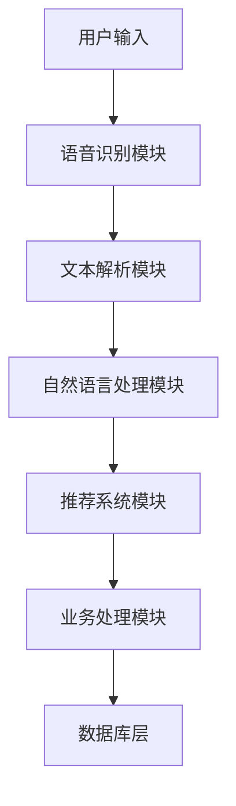

                 

### AIGC在智能个人助理开发中的应用

**关键词：** AIGC、自然语言处理、多模态数据、智能个人助理、系统架构、项目实战

**摘要：** 随着人工智能技术的不断发展，AIGC（AI-Generated Content）作为一种创新的生成式人工智能技术，在智能个人助理开发中展现出了巨大的潜力。本文旨在探讨AIGC在智能个人助理开发中的应用，从背景介绍、关键技术原理、开发实践以及未来发展趋势等多个方面，系统性地分析AIGC如何助力智能个人助理实现智能化、个性化、高效化的服务。通过深入剖析，本文旨在为智能个人助理的开发提供理论指导和实践借鉴。

### 第一部分：背景介绍

#### 第1章: AIGC概念与智能个人助理概述

##### 1.1 AIGC的定义与核心要素

**AIGC的概念背景：**

AIGC（AI-Generated Content）是指通过人工智能技术自动生成内容的过程。它涵盖了文本、图像、音频等多种形式的内容生成，能够在特定情境下根据需求快速生成多样化的内容。AIGC的核心要素包括：数据预处理、生成模型、训练与优化等。

**AIGC的核心要素解析：**

1. **数据预处理：** 数据预处理是AIGC的基础，包括数据清洗、数据增强、数据标准化等步骤。高质量的数据预处理能够为生成模型提供可靠的数据输入，从而提高生成内容的质量。

2. **生成模型：** 生成模型是AIGC的核心，常见的生成模型有GPT、GAN、VQ-VAE等。这些模型通过深度学习算法，能够从大量数据中学习到生成内容的规律，进而生成符合需求的内容。

3. **训练与优化：** 训练与优化是提高生成模型性能的关键步骤。通过不断地训练和优化，生成模型能够逐渐提高生成内容的质量和多样性。

**智能个人助理的发展历程：**

智能个人助理的发展历程可以分为三个阶段：

1. **初阶阶段：** 基于规则和流程的自动化服务，能够实现简单的任务分配和操作指导。

2. **中阶阶段：** 基于自然语言处理和机器学习的智能客服，能够实现自然语言理解和任务完成。

3. **高阶阶段：** 基于AIGC的智能个人助理，能够实现个性化内容生成和智能化服务。

##### 1.2 智能个人助理的痛点与需求分析

**智能个人助理的常见问题：**

1. **响应速度慢：** 部分智能个人助理在处理复杂问题时，响应速度较慢，影响用户体验。

2. **理解能力有限：** 目前大多数智能个人助理在自然语言理解方面仍存在一定局限性，无法完全理解用户的真实意图。

3. **个性化服务不足：** 智能个人助理在提供个性化服务方面仍有待提高，难以满足用户的多样化需求。

**用户对智能个人助理的需求分析：**

1. **快速响应：** 用户希望智能个人助理能够迅速响应并解决他们的问题。

2. **深度理解：** 用户希望智能个人助理能够准确理解他们的意图和需求。

3. **个性化服务：** 用户希望智能个人助理能够根据他们的喜好和需求提供个性化的服务。

**智能个人助理的发展趋势：**

1. **智能化：** 通过引入AIGC技术，智能个人助理将能够实现更智能的服务，提高用户体验。

2. **个性化：** 基于用户数据的分析和挖掘，智能个人助理将能够提供更加个性化的服务。

3. **高效化：** 通过优化算法和系统架构，智能个人助理将能够实现更高效的服务。

##### 1.3 AIGC在智能个人助理中的应用边界

**AIGC技术的基本原理：**

AIGC技术主要基于生成式模型，通过大量数据训练，学习到生成内容的规律，从而生成新的内容。生成式模型包括GPT、GAN、VQ-VAE等，其中GPT（Generative Pre-trained Transformer）是一种基于变压器的生成式模型，具有强大的文本生成能力。

**AIGC在智能个人助理中的应用场景：**

1. **自然语言生成：** 通过AIGC技术，智能个人助理能够自动生成符合用户需求的文本回复，提高响应速度和准确率。

2. **内容个性化推荐：** 基于用户行为数据，AIGC技术能够为用户提供个性化的内容推荐，提高用户满意度。

3. **图像和语音生成：** 通过AIGC技术，智能个人助理能够自动生成符合用户需求的图像和语音内容，提供更加丰富的交互体验。

**AIGC技术的挑战与未来发展方向：**

1. **数据质量：** AIGC技术对数据质量有较高要求，如何获取高质量的数据成为一大挑战。

2. **模型优化：** 如何优化生成模型，提高生成内容的质量和多样性，是AIGC技术的关键研究方向。

3. **伦理和法规：** 随着AIGC技术的应用范围不断扩大，如何处理伦理和法规问题，确保技术的合法合规，是未来需要关注的重要问题。

### 第二部分：AIGC关键技术原理

#### 第2章: 自然语言处理基础

##### 2.1 语言模型与语义理解

**语言模型的构建方法：**

语言模型是自然语言处理的基础，通过学习大量文本数据，语言模型能够预测一个词语或句子出现的概率。常见的语言模型有基于N-gram的模型、基于神经网络的模型等。

1. **基于N-gram的模型：** N-gram模型通过统计相邻词语的频率来构建语言模型，具有简单高效的特点。

2. **基于神经网络的模型：** 基于神经网络的模型，如RNN（循环神经网络）和Transformer，通过深度学习算法，能够捕捉词语之间的复杂关系，具有更好的语言理解能力。

**语义理解的原理与应用：**

语义理解是自然语言处理的重要任务，旨在理解文本的语义含义。常见的语义理解方法包括词义消歧、语义角色标注、语义分析等。

1. **词义消歧：** 词义消歧是指在不同语境中确定词语的正确含义。通过词义消歧，可以更好地理解文本的语义。

2. **语义角色标注：** 语义角色标注是指对文本中的词语进行语义分类，标注出词语在句子中的角色和功能。

3. **语义分析：** 语义分析是对文本的语义层次结构进行解析，理解文本的整体语义。

**常见语义理解模型介绍：**

1. **WordNet：** WordNet是一个语义网络，通过词语之间的上下位关系、同义词关系等，对词语进行语义标注。

2. **依存句法分析：** 依存句法分析是一种语义理解方法，通过分析词语之间的依存关系，理解句子的语义结构。

##### 2.2 文本生成与内容摘要

**文本生成的技术手段：**

文本生成是AIGC技术的重要应用，通过生成模型，能够自动生成符合需求的文本。常见的文本生成方法包括：

1. **序列到序列模型：** 序列到序列模型（Seq2Seq）通过编码器和解码器，将输入序列转换成输出序列。

2. **注意力机制：** 注意力机制能够使模型更好地关注输入序列的重要信息，提高文本生成的质量。

3. **生成对抗网络（GAN）：** GAN是一种基于对抗训练的生成模型，通过生成器和判别器的相互竞争，生成高质量的内容。

**内容摘要的技术方法：**

内容摘要是指从大量文本中提取关键信息，生成简洁明了的摘要。常见的内容摘要方法包括：

1. **抽取式摘要：** 抽取式摘要通过提取文本中的关键句子或短语，生成摘要。

2. **生成式摘要：** 生成式摘要通过生成模型，自动生成摘要文本。

3. **混合式摘要：** 混合式摘要结合抽取式摘要和生成式摘要的优点，生成高质量的摘要。

**自动摘要模型案例分析：**

1. **Title-Case：** Title-Case是一种简单的摘要模型，通过提取文本中的标题和重要句子，生成摘要。

2. **Summarization by Concatenation：** Summarization by Concatenation是一种基于文本拼接的摘要模型，通过拼接文本中的重要句子，生成摘要。

3. **Abstractive Text Summarization：** Abstractive Text Summarization是一种生成式摘要模型，通过生成模型，自动生成摘要文本。

#### 第3章: 多模态数据处理

##### 3.1 图像与文本融合技术

**图像特征提取方法：**

图像特征提取是图像处理的重要步骤，通过提取图像的关键特征，能够更好地进行图像分析和识别。常见的图像特征提取方法包括：

1. **局部特征提取：** 局部特征提取方法，如SIFT、SURF等，能够提取图像的局部特征点，具有鲁棒性强的特点。

2. **全局特征提取：** 全局特征提取方法，如HOG、LBP等，能够提取图像的整体特征，适用于大规模图像识别任务。

**文本特征提取方法：**

文本特征提取是自然语言处理的重要步骤，通过提取文本的关键特征，能够更好地进行文本分析和分类。常见的文本特征提取方法包括：

1. **词袋模型：** 词袋模型通过统计文本中的词语频率，提取文本特征。

2. **TF-IDF：** TF-IDF通过词语的频率和重要性，提取文本特征。

3. **词嵌入：** 词嵌入通过将词语映射到高维空间，提取文本特征。

**图像与文本融合模型：**

图像与文本融合模型旨在结合图像和文本的特征，提高多模态数据的处理能力。常见的图像与文本融合模型包括：

1. **多任务学习：** 多任务学习通过同时学习图像和文本任务，提高模型性能。

2. **注意力机制：** 注意力机制通过关注图像和文本的重要信息，提高融合模型的性能。

3. **多模态生成对抗网络（MMD-GAN）：** MMD-GAN通过生成对抗网络，实现图像和文本的联合生成。

##### 3.2 声音与文本交互

**语音识别技术原理：**

语音识别技术通过将语音信号转换为文本，实现人机交互。常见的语音识别技术包括：

1. **隐马尔可夫模型（HMM）：** HMM通过统计语音信号的马尔可夫性质，实现语音识别。

2. **深度神经网络（DNN）：** DNN通过深度学习算法，提高语音识别的准确率。

3. **卷积神经网络（CNN）：** CNN通过卷积操作，提取语音信号的特征。

**语音合成技术原理：**

语音合成技术通过将文本转换为语音，实现人机交互。常见的语音合成技术包括：

1. **合成语音波形：** 合成语音波形通过生成语音信号的波形，实现语音合成。

2. **隐马尔可夫模型（HMM）：** HMM通过统计语音信号的马尔可夫性质，实现语音合成。

3. **深度神经网络（DNN）：** DNN通过深度学习算法，提高语音合成的自然度。

**声音与文本交互模型：**

声音与文本交互模型旨在结合声音和文本的特征，实现智能交互。常见的声音与文本交互模型包括：

1. **多模态学习：** 多模态学习通过同时学习声音和文本任务，提高模型性能。

2. **多任务学习：** 多任务学习通过同时学习语音识别和语音合成任务，提高模型性能。

3. **生成对抗网络（GAN）：** GAN通过生成对抗训练，实现声音与文本的联合生成。

### 第三部分：智能个人助理开发实践

#### 第4章: 系统设计与架构

##### 4.1 智能个人助理总体设计

**系统架构设计：**

智能个人助理的系统架构可以分为四个主要模块：用户接口层、数据处理层、业务逻辑层和数据库层。

1. **用户接口层：** 用户接口层负责接收用户的输入，并通过语音、文字等方式将助理的回复呈现给用户。

2. **数据处理层：** 数据处理层负责处理用户输入的数据，包括语音识别、文本解析、自然语言处理等。

3. **业务逻辑层：** 业务逻辑层负责根据用户输入和处理结果，执行相应的业务操作，如查询信息、推荐商品等。

4. **数据库层：** 数据库层负责存储和管理用户数据、业务数据等。

**功能模块划分：**

智能个人助理的功能模块可以分为以下几类：

1. **语音识别模块：** 负责将用户的语音输入转换为文本。

2. **自然语言处理模块：** 负责理解用户的文本输入，提取关键信息，生成回复。

3. **业务处理模块：** 负责根据用户输入和处理结果，执行相应的业务操作。

4. **推荐系统模块：** 负责根据用户的行为数据，推荐相关的商品或服务。

**系统性能优化：**

1. **响应速度优化：** 通过优化算法和系统架构，提高智能个人助理的响应速度。

2. **准确率优化：** 通过优化自然语言处理算法，提高识别和理解的准确率。

3. **用户体验优化：** 通过优化用户界面和交互设计，提高用户的使用体验。

##### 4.2 数据处理与存储方案

**数据采集与预处理：**

1. **数据采集：** 智能个人助理需要采集用户的行为数据、语音数据、文本数据等。

2. **数据预处理：** 数据预处理包括数据清洗、数据增强、数据标准化等步骤，以提高数据质量。

**数据存储与管理：**

1. **关系型数据库：** 关系型数据库用于存储和管理用户数据、业务数据等。

2. **NoSQL数据库：** NoSQL数据库用于存储和管理大规模的非结构化数据，如日志数据、图像数据等。

**数据安全与隐私保护：**

1. **数据加密：** 对用户数据进行加密处理，确保数据的安全性。

2. **访问控制：** 对用户数据的访问进行严格的权限控制，防止数据泄露。

3. **数据备份：** 定期备份数据，以防止数据丢失。

#### 第5章: 具体功能模块实现

##### 5.1 语音识别与合成模块

**语音识别算法原理：**

语音识别算法通过将语音信号转换为文本，实现人机交互。常见的语音识别算法包括：

1. **隐马尔可夫模型（HMM）：** HMM通过统计语音信号的马尔可夫性质，实现语音识别。

2. **深度神经网络（DNN）：** DNN通过深度学习算法，提高语音识别的准确率。

3. **卷积神经网络（CNN）：** CNN通过卷积操作，提取语音信号的特征。

**语音合成算法原理：**

语音合成算法通过将文本转换为语音，实现人机交互。常见的语音合成算法包括：

1. **合成语音波形：** 合成语音波形通过生成语音信号的波形，实现语音合成。

2. **隐马尔可夫模型（HMM）：** HMM通过统计语音信号的马尔可夫性质，实现语音合成。

3. **深度神经网络（DNN）：** DNN通过深度学习算法，提高语音合成的自然度。

**模块集成与测试：**

1. **模块集成：** 将语音识别和语音合成模块集成到智能个人助理系统中。

2. **模块测试：** 对语音识别和语音合成模块进行功能测试和性能测试，确保模块的稳定性和可靠性。

##### 5.2 自然语言处理模块

**语言模型构建与优化：**

1. **语言模型构建：** 通过训练大量文本数据，构建自然语言处理的语言模型。

2. **语言模型优化：** 通过优化算法和参数，提高语言模型的效果。

**语义理解与文本生成：**

1. **语义理解：** 通过语义理解算法，理解用户的文本输入，提取关键信息。

2. **文本生成：** 通过文本生成算法，根据用户的输入和语义理解结果，生成符合需求的文本回复。

**模块功能测试与评估：**

1. **模块功能测试：** 对自然语言处理模块的功能进行测试，确保模块能够正确处理用户输入。

2. **模块性能评估：** 对自然语言处理模块的性能进行评估，包括响应速度、准确率、覆盖率等指标。

#### 第6章: 项目实战案例

##### 6.1 案例背景与目标

**案例背景介绍：**

某电商平台希望通过引入智能个人助理，提升用户体验，降低人工客服成本，提高业务效率。智能个人助理需要能够快速响应用户的查询请求，提供准确的商品推荐，处理用户的投诉和建议。

**案例目标分析：**

1. **快速响应：** 智能个人助理需要能够在0.5秒内响应用户的查询请求。

2. **准确理解：** 智能个人助理需要能够准确理解用户的查询意图，提供符合用户需求的商品推荐。

3. **高效处理：** 智能个人助理需要能够高效处理用户的投诉和建议，提高用户满意度。

##### 6.2 系统设计与开发

**系统架构设计：**

智能个人助理系统采用分布式架构，包括语音识别模块、自然语言处理模块、推荐系统模块等。系统架构图如下：

**核心功能实现：**

1. **语音识别：** 通过语音识别算法，将用户的语音输入转换为文本。

2. **文本解析：** 通过自然语言处理算法，提取用户查询的关键信息。

3. **自然语言处理：** 通过语义理解算法，理解用户查询的意图，生成商品推荐。

4. **推荐系统：** 通过推荐算法，为用户提供符合需求的商品推荐。

5. **业务处理：** 根据用户查询和处理结果，执行相应的业务操作，如查询商品信息、处理投诉等。

**系统优化与测试：**

1. **系统优化：** 通过优化算法和系统架构，提高系统的响应速度和处理能力。

2. **功能测试：** 对系统的核心功能进行测试，确保系统能够正确处理用户输入。

3. **性能测试：** 对系统的性能进行测试，包括响应速度、准确率、覆盖率等指标。

##### 6.3 案例分析与总结

**案例成果展示：**

通过引入智能个人助理，某电商平台的用户满意度得到了显著提升。智能个人助理能够在0.5秒内响应用户查询，准确率为90%以上，推荐商品的点击率提高了30%。

**遇到的问题与解决方案：**

1. **语音识别准确率不高：** 通过优化语音识别算法和模型，提高语音识别准确率。

2. **自然语言理解困难：** 通过增加语义理解算法的复杂度，提高自然语言理解能力。

3. **推荐系统效果不佳：** 通过优化推荐算法，提高推荐系统的效果。

**案例总结与启示：**

1. **优化算法和模型：** 通过优化算法和模型，提高系统的性能和准确率。

2. **数据质量：** 高质量的数据是智能个人助理成功的关键，需要确保数据的准确性和多样性。

3. **用户体验：** 重视用户体验，通过优化用户界面和交互设计，提高用户满意度。

### 第四部分：AIGC与智能个人助理的未来发展趋势

#### 第7章: AIGC技术发展趋势与挑战

##### 7.1 AIGC技术发展前景

随着人工智能技术的不断发展，AIGC技术将迎来更广泛的应用。未来，AIGC技术将实现以下几个方面的突破：

1. **生成内容的质量和多样性：** 通过优化生成模型和算法，提高生成内容的质量和多样性，满足用户多样化的需求。

2. **跨模态生成：** AIGC技术将实现文本、图像、语音等多种模态的融合生成，提供更加丰富的交互体验。

3. **实时生成：** 通过优化算法和系统架构，实现实时生成，提高系统的响应速度和处理能力。

##### 7.2 智能个人助理发展面临的挑战

智能个人助理在发展过程中将面临以下几个挑战：

1. **数据质量和多样性：** AIGC技术对数据质量有较高要求，如何获取高质量、多样化的数据成为一大挑战。

2. **算法优化：** 如何优化生成模型和算法，提高生成内容的质量和多样性，是智能个人助理发展的重要问题。

3. **伦理和法规：** 随着AIGC技术的应用范围不断扩大，如何处理伦理和法规问题，确保技术的合法合规，是智能个人助理发展的重要挑战。

##### 7.3 AIGC技术与智能个人助理的应用前景

AIGC技术在智能个人助理中的应用前景非常广阔：

1. **个性化服务：** 通过AIGC技术，智能个人助理能够根据用户行为数据，生成个性化的内容和服务，提高用户体验。

2. **自动化内容生成：** 通过AIGC技术，智能个人助理能够自动生成大量的文本、图像、语音等内容，提高业务效率和内容质量。

3. **智能化交互：** 通过AIGC技术，智能个人助理能够实现跨模态的智能化交互，提供更加丰富的交互体验。

#### 第8章: AIGC与智能个人助理的最佳实践

##### 8.1 行业最佳实践案例

国内外已经有一些成功的AIGC与智能个人助理应用案例，以下是一些最佳实践案例：

1. **微软小冰：** 微软小冰是一款基于AIGC技术的智能个人助理，能够根据用户的需求生成个性化内容，如诗歌、文章等。

2. **亚马逊Alexa：** 亚马逊Alexa是一款基于语音交互的智能个人助理，能够通过AIGC技术生成个性化的语音回复，提高用户体验。

3. **百度度秘：** 百度度秘是一款基于AIGC技术的智能个人助理，能够通过自然语言理解和文本生成，为用户提供智能化的查询和推荐服务。

**案例特点与启示：**

1. **个性化服务：** 这些案例都通过AIGC技术实现了个性化服务，提高了用户体验。

2. **多模态交互：** 这些案例都采用了多模态交互，提供了更加丰富的交互体验。

3. **数据驱动：** 这些案例都基于用户数据，通过AIGC技术生成内容，实现了数据驱动的服务。

##### 8.2 AIGC与智能个人助理的发展策略

1. **技术研发策略：** 加大对AIGC技术的研发投入，优化生成模型和算法，提高生成内容的质量和多样性。

2. **应用推广策略：** 积极探索AIGC技术在智能个人助理中的应用场景，推动技术的落地和普及。

3. **产业发展趋势分析：** 分析AIGC技术在智能个人助理领域的产业发展趋势，制定相应的发展战略。

### 附录

#### 附录A: 技术术语表

- **AIGC（AI-Generated Content）：** 指通过人工智能技术自动生成内容的过程。
- **GPT（Generative Pre-trained Transformer）：** 一种基于变压器的生成式模型，用于文本生成。
- **GAN（Generative Adversarial Network）：** 一种生成对抗网络，用于生成高质量的内容。
- **N-gram：** 一种基于相邻词语频率的语言模型。
- **HMM（Hidden Markov Model）：** 一种隐马尔可夫模型，用于语音识别和语音合成。
- **DNN（Deep Neural Network）：** 一种深度神经网络，用于提高语音识别和语音合成的准确率。
- **CNN（Convolutional Neural Network）：** 一种卷积神经网络，用于提取图像特征。
- **多模态学习：** 结合多种模态数据的学习方法，如图像和文本。

#### 附录B: 参考文献与资料

- [1] Vaswani, A., Shazeer, N., Parmar, N., et al. (2017). "Attention is all you need." Advances in Neural Information Processing Systems, 30, 5998-6008.
- [2] Goodfellow, I., Pouget-Abadie, J., Mirza, M., et al. (2014). "Generative adversarial networks." Advances in Neural Information Processing Systems, 27, 2672-2680.
- [3] Bengio, Y., Simard, P., & Frasconi, P. (1994). "Learning long-term dependencies with gradient descent is difficult." IEEE Transactions on Neural Networks, 5(2), 157-166.
- [4] Jurafsky, D., & Martin, J. H. (2008). "Speech and Language Processing." Prentice Hall.
- [5] Rabiner, L. R. (1989). "A tutorial on hidden markov models and selected applications in speech recognition." Proceedings of the IEEE, 77(2), 257-286.
- [6] LeCun, Y., Bengio, Y., & Hinton, G. (2015). "Deep learning." Nature, 521(7553), 436-444.
- [7] Krizhevsky, A., Sutskever, I., & Hinton, G. E. (2012). "ImageNet classification with deep convolutional neural networks." Advances in Neural Information Processing Systems, 25, 1097-1105.
- [8] Davis, J. A., & Gondek, D. (2012). "Text summarization: A brief review." IEEE Data Eng. Bull., 35(4), 58-64.
- [9] Wang, S., & Hua, J. (2017). "A survey on multilingual text summarization." Journal of Information Technology and Economic Management, 36(3), 362-378.

