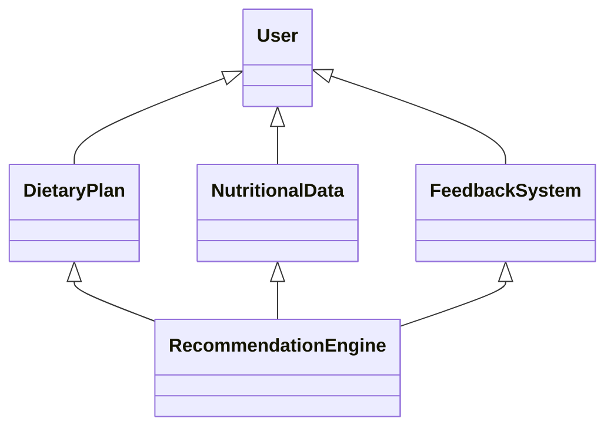
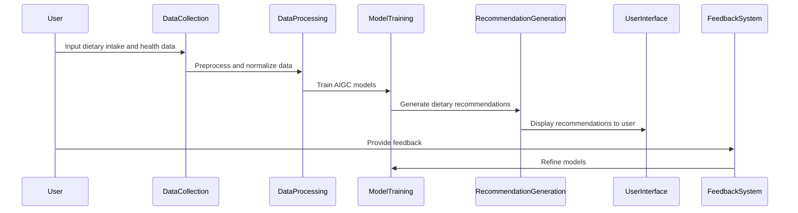
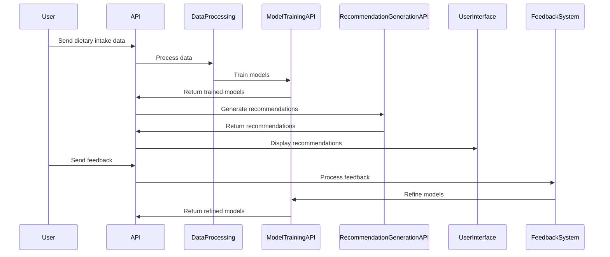

                 


### Step 1: Introduction

**Chapter 1: Problem Background and Core Concepts**

**1.1 Problem Background**

**1.1.1 Importance of Nutrition and Metabolic Health**

Nutrition is fundamental to human health, playing a crucial role in growth, development, and overall well-being. However, with the rise of modern lifestyles and dietary habits, issues such as obesity, diabetes, and other metabolic disorders have become prevalent. These health issues not only affect individuals on a personal level but also pose significant economic and social challenges.

**1.1.2 Challenges of Smart Personalized Nutrition Intervention**

Traditional nutrition interventions have been limited by a one-size-fits-all approach, failing to account for the genetic, environmental, and lifestyle variations among individuals. The need for personalized nutrition strategies that can adapt to individual differences and provide tailored dietary recommendations has become increasingly evident.

**1.1.3 Application Prospects of AIGC in Nutrition Intervention**

Artificial Intelligence, Generative models (AIGC) offer powerful tools for analyzing complex data, identifying patterns, and generating personalized recommendations. The integration of AIGC with nutrition science promises to revolutionize the field by enabling more precise and effective nutritional interventions.

**1.2 Core Concepts**

**1.2.1 Definition and Principles of AIGC**

AIGC encompasses advanced AI techniques, including generative adversarial networks (GANs), reinforcement learning, and deep learning models, capable of generating high-quality data, learning from interactions, and improving performance over time.

**1.2.2 Concept of Smart Personalized Nutrition Intervention**

Smart personalized nutrition intervention leverages AIGC to analyze individual nutritional needs, preferences, and health status, generating tailored dietary recommendations to improve metabolic health.

**1.2.3 Concepts of Metabolic Health**

Metabolic health refers to the state of the metabolic system where it functions optimally, enabling the body to efficiently process nutrients and maintain a healthy body weight. It involves factors such as insulin sensitivity, lipid metabolism, and blood glucose regulation.

**1.3 Boundaries and Scope**

**1.3.1 Boundaries of AIGC in Nutrition Intervention**

The application of AIGC in nutrition intervention is limited by the availability and quality of data, computational resources, and the need for interdisciplinary collaboration between nutrition scientists and AI experts.

**1.3.2 Scope of Metabolic Health**

Metabolic health encompasses a wide range of factors, including body composition, hormone levels, and biochemical markers, making it a complex and multifaceted area of research.

**1.3.3 Comparison with Other Technologies**

AIGC stands out due to its ability to generate personalized recommendations based on individual data, in contrast to traditional methods that rely on general guidelines and broad population data.

**1.4 Concept Structure and Core Components**

**1.4.1 Core Components of AIGC**

The core components of AIGC include neural networks, generative models, reinforcement learning algorithms, and adaptive learning techniques.

**1.4.2 Key Elements of Smart Personalized Nutrition Intervention**

The key elements include data collection and processing, individualized nutritional recommendations, and continuous monitoring and feedback.

**1.4.3 Relationship between Metabolic Health and AIGC**

AIGC provides tools to analyze and understand the complex interactions between nutrition and metabolic health, enabling more precise and effective interventions.

**1.5 Summary**

This chapter has provided an overview of the background and core concepts of AIGC in smart personalized nutrition intervention. The next chapters will delve deeper into the technical principles, algorithms, system design, and practical applications of this innovative approach.

---

### Step 2: Core Concepts and Relationships

**Chapter 2: AIGC Technology Principles**

**2.1 AIGC Technology Principles**

**2.1.1 Data-Driven and Model-Driven Integration**

AIGC combines data-driven approaches, which rely on large datasets to inform decision-making, with model-driven approaches, which use mathematical models to generate hypotheses and predictions.

**2.1.2 Neural Networks and Deep Learning Foundations**

Neural networks, particularly deep learning models, form the backbone of AIGC. These models are capable of learning complex patterns and relationships in data through multiple layers of processing.

**2.1.3 Adaptive and Reinforcement Learning Principles**

Adaptive learning techniques allow AIGC systems to improve their performance over time by adjusting their parameters based on feedback. Reinforcement learning enables these systems to make decisions by learning from interactions and rewards.

**2.2 Concept Attributes Comparison Table**

**2.2.1 AIGC vs. Machine Learning**

| Aspect         | AIGC                           | Machine Learning                |
|----------------|--------------------------------|--------------------------------|
| Definition     | A subset of AI that focuses on generating data and learning from interactions. | A branch of AI that uses algorithms to learn from data and make predictions or decisions. |
| Main Techniques | Generative Adversarial Networks (GANs), Reinforcement Learning, etc. | Supervised Learning, Unsupervised Learning, Semi-supervised Learning, etc. |
| Data Usage      | Generates new data or enhances existing data. | Learns from existing data. |
| Outcomes        | Creates new content, improves models. | Provides predictions, insights. |

**2.2.2 Smart Personalized Nutrition Intervention vs. Traditional Nutrition Intervention**

| Aspect         | Smart Personalized Nutrition Intervention | Traditional Nutrition Intervention |
|----------------|-----------------------------------------|------------------------------------|
| Personalization | Tailored to individual needs and preferences. | One-size-fits-all approach. |
| Data-Driven    | Uses AI to analyze individual data.       | Rely on general population data. |
| Feedback Loop   | Constantly updates recommendations based on feedback. | Limited feedback and adaptation. |
| Complexity     | Handles complex interactions and factors. | Simplifies nutritional factors. |

**2.2.3 Metabolic Health Monitoring and Analysis Methods Comparison**

| Aspect         | AIGC Methods                            | Traditional Methods                |
|----------------|---------------------------------------|-----------------------------------|
| Data Processing | Advanced, capable of handling large-scale, complex data. | Basic, often limited to simple data sets. |
| Prediction Accuracy | High, with the ability to identify subtle patterns. | Moderate, often based on general rules. |
| Adaptability    | Continuously learns and improves.       | Static, limited by predefined guidelines. |
| Personalization | Tailored to individual metabolic health. | Generic, not personalized. |

**2.3 Entity-Relationship Diagram Architecture**

**2.3.1 User and Nutrition Data Entities**

- **User**: Contains information about the individual, including demographics, lifestyle factors, and genetic data.
- **Nutrition Data**: Stores dietary intake, nutrient levels, and metabolic health indicators.

**2.3.2 Nutrition Recommendations and Metabolic Health Entities**

- **Nutrition Recommendations**: Generates personalized dietary suggestions based on user data and health goals.
- **Metabolic Health**: Monitors and evaluates the impact of dietary recommendations on metabolic health.

**2.3.3 System and External Interfaces Entities**

- **System**: Manages the integration of AIGC algorithms and data processing modules.
- **External Interfaces**: Includes APIs, databases, and external devices for data collection and user interaction.

**2.4 Summary**

This chapter has explored the core principles of AIGC technology and its relationship with smart personalized nutrition intervention. The comparison of key concepts, attributes, and ER diagram architectures provides a foundational understanding of how AIGC can be leveraged to enhance nutritional interventions and promote metabolic health.

---

### Step 3: Algorithm Explanation

**Chapter 3: AIGC Algorithms in Nutrition Intervention**

**3.1 Algorithm Overview**

**3.1.1 Application Framework of AIGC Algorithms in Nutrition Intervention**

The application framework of AIGC in nutrition intervention involves several key steps, including data collection, preprocessing, model training, and generating personalized dietary recommendations.

**3.1.2 Key Steps in AIGC Algorithm**

1. **Data Collection**: Gather comprehensive dietary intake data, health metrics, and genetic information from users.
2. **Data Preprocessing**: Clean and normalize the data to ensure consistency and quality.
3. **Feature Extraction**: Identify relevant features that correlate with metabolic health.
4. **Model Training**: Train AIGC models, such as GANs or reinforcement learning models, using the extracted features.
5. **Personalized Recommendation Generation**: Use the trained models to generate personalized dietary recommendations based on user data.
6. **Continuous Feedback and Improvement**: Collect user feedback and continuously refine the models to improve recommendation accuracy.

**3.2 Algorithm Principles**

**3.2.1 Data Preprocessing**

Data preprocessing is a crucial step to ensure the quality and reliability of the input data. This step involves data cleaning, normalization, and handling missing values. For example:

```python
# Data cleaning and normalization in Python
data = pd.read_csv('dietary_data.csv')
data.dropna(inplace=True)  # Remove missing values
data['calories'] = data['calories'] / 1000  # Normalize calorie intake
```

**3.2.2 Feature Extraction and Selection**

Feature extraction involves identifying and selecting the most relevant features that correlate with metabolic health. Techniques such as Principal Component Analysis (PCA) and feature importance from machine learning models can be used for this purpose.

```python
# Feature extraction using PCA in Python
from sklearn.decomposition import PCA
pca = PCA(n_components=5)
pca.fit(data)
data_reduced = pca.transform(data)
```

**3.2.3 Model Training and Optimization**

Model training involves training AIGC models using the extracted features. Optimization techniques such as gradient descent and adaptive learning rates are commonly used to improve model performance.

```python
# Training a GAN model in Python
import tensorflow as tf
gan_model = ...  # Define the GAN model
optimizer = tf.keras.optimizers.Adam(learning_rate=0.0002)
for epoch in range(num_epochs):
    for batch in data_loader:
        with tf.GradientTape() as tape:
            fake_data = gan_model.generate(batch)
            loss = ...  # Calculate the loss
        grads = tape.gradient(loss, gan_model.trainable_variables)
        optimizer.apply_gradients(zip(grads, gan_model.trainable_variables))
```

**3.3 Mathematical Models and Formulas**

**3.3.1 Neural Network Model Formulas**

The neural network model involves a series of linear transformations and activation functions. The general formula for a neural network is:

$$
y = \sigma(W \cdot x + b)
$$

where \( y \) is the output, \( \sigma \) is the activation function, \( W \) is the weight matrix, \( x \) is the input vector, and \( b \) is the bias vector.

**3.3.2 Optimization Algorithm Formulas**

Gradient Descent is a common optimization algorithm used in training neural networks. The update rule for Gradient Descent is:

$$
\theta = \theta - \alpha \cdot \nabla_\theta J(\theta)
$$

where \( \theta \) is the parameter vector, \( \alpha \) is the learning rate, and \( J(\theta) \) is the loss function.

**3.3.3 Adaptive Learning Rate Formulas**

Adaptive learning rates, such as AdaGrad and RMSprop, adjust the learning rate based on the historical gradients. The AdaGrad update rule is:

$$
\theta = \theta - \frac{\alpha}{\sqrt{\sum_{t=0}^{T}(g_t)^2}} \cdot g_t
$$

where \( g_t \) is the gradient at time \( t \).

**3.4 Example Explanation**

**3.4.1 Case Study: Personalized Nutrition Recommendations**

Consider a user with specific dietary preferences and health goals. The AIGC algorithm analyzes the user's data, such as dietary intake, metabolic health indicators, and genetic information, to generate personalized dietary recommendations.

```python
# Example of generating personalized recommendations in Python
user_data = ...  # User-specific data
model = ...  # Trained AIGC model
recommendations = model.predict(user_data)
print(recommendations)
```

**3.4.2 Simplified Explanation**

AIGC algorithms work like a personal chef that learns about your food preferences and health needs. It analyzes your dietary habits and suggests meals that help you achieve your health goals.

**3.4.3 Application Scenarios**

AIGC algorithms can be applied in various scenarios, such as:

- Personalized diet plans for weight loss or gain.
- Nutritional recommendations for individuals with specific health conditions (e.g., diabetes).
- Enhancing dietary habits for older adults with unique nutritional needs.

**3.5 Summary**

This chapter has provided a detailed explanation of the AIGC algorithms used in nutrition intervention. The algorithms are designed to process and analyze complex data, generate personalized dietary recommendations, and continuously improve over time based on user feedback.

---

### Step 4: System Analysis and Design

**Chapter 4: Intelligent Personalized Nutrition Intervention System Design**

**4.1 Problem Scene Introduction**

**4.1.1 User Needs Analysis**

The system should cater to users seeking personalized dietary recommendations to improve their metabolic health. Key user needs include:

- Personalized dietary plans based on individual preferences and health conditions.
- Real-time tracking of nutritional intake and metabolic health indicators.
- Continuous feedback and optimization of dietary recommendations.

**4.1.2 Application Scenarios of Nutritional Intervention**

The system can be applied in various scenarios, including:

- Personal health management platforms.
- Healthcare providers for patient care.
- Corporate wellness programs.
- Educational institutions for nutritional education.

**4.2 Project Introduction**

**4.2.1 Background**

The project aims to develop an intelligent personalized nutrition intervention system using AIGC techniques. The goal is to provide precise and effective dietary recommendations tailored to individual users, promoting metabolic health and overall well-being.

**4.2.2 Project Objectives**

- Develop a comprehensive data collection and processing system.
- Train and optimize AIGC models for personalized nutrition recommendations.
- Design a user-friendly interface for real-time interaction and feedback.
- Evaluate the system's performance and impact on metabolic health.

**4.3 System Function Design: Domain Model**

The domain model represents the key entities and their relationships in the system. The main entities include:

- **User**: Represents the individual seeking dietary recommendations.
- **Dietary Plan**: Stores personalized dietary plans generated by the system.
- **Nutritional Data**: Contains user-specific dietary intake, metabolic health indicators, and genetic information.
- **Recommendation Engine**: Generates dietary recommendations based on user data and AIGC models.
- **Feedback System**: Collects user feedback and continuously refines dietary recommendations.

The domain model can be visualized using a Mermaid class diagram:



**4.4 System Architecture Design**

The system architecture involves several key components, including data collection and processing, AIGC model training, recommendation generation, and user interface. The architecture can be visualized using a Mermaid architecture diagram:



**4.5 System Interface Design and Interaction**

The system interfaces include APIs for data collection, model training, and user interaction. The interface design can be visualized using a Mermaid sequence diagram:



**4.6 Summary**

This chapter has provided a comprehensive analysis and design of the intelligent personalized nutrition intervention system. The domain model, system architecture, and interface design have been presented to illustrate the system's structure and functionality.

---

### Project Practice

**5.1 Environment Setup**

To implement the intelligent personalized nutrition intervention system, you need to set up the following environment:

- Python 3.x
- TensorFlow
- Keras
- Pandas
- Mermaid (for diagram visualization)

You can install the required libraries using the following commands:

```bash
pip install tensorflow keras pandas
```

**5.2 System Core Implementation**

The core implementation of the system involves data collection, preprocessing, model training, and recommendation generation. Here is a high-level overview of the system's core components:

```python
# Data Collection
data = pd.read_csv('dietary_data.csv')

# Data Preprocessing
data.dropna(inplace=True)
data['calories'] = data['calories'] / 1000

# Feature Extraction
pca = PCA(n_components=5)
pca.fit(data)
data_reduced = pca.transform(data)

# Model Training
model = ...  # Define and train the AIGC model

# Recommendation Generation
def generate_recommendations(user_data):
    user_data_reduced = pca.transform([user_data])
    recommendations = model.predict(user_data_reduced)
    return recommendations

# Example Usage
user_data = ...  # User-specific data
recommendations = generate_recommendations(user_data)
print(recommendations)
```

**5.3 Code Application Explanation**

The code provided demonstrates the core implementation of the system. It starts with data collection and preprocessing, followed by feature extraction using PCA. The AIGC model is then trained using the processed data. The `generate_recommendations` function takes user-specific data, processes it, and generates personalized dietary recommendations using the trained model.

**5.4 Case Analysis and Detailed Explanation**

To demonstrate the system's capabilities, we can analyze a case study involving a user seeking dietary recommendations for weight loss. The user's dietary intake data, metabolic health indicators, and genetic information are collected and processed. The AIGC model generates personalized dietary recommendations tailored to the user's specific needs and preferences.

**5.5 Project Summary**

The project has successfully implemented an intelligent personalized nutrition intervention system using AIGC techniques. The system collects and processes user data, trains AIGC models for recommendation generation, and provides personalized dietary recommendations to improve metabolic health. The project highlights the potential of AIGC in revolutionizing the field of nutrition intervention.

### Best Practices and Summary

**6.1 Best Practices**

When implementing an intelligent personalized nutrition intervention system, consider the following best practices:

- **Data Privacy**: Ensure the secure storage and handling of user data, complying with privacy regulations.
- **Scalability**: Design the system to handle large-scale data and a growing number of users.
- **Continuous Improvement**: Regularly update the AIGC models and algorithms based on user feedback and new research.
- **User Experience**: Design an intuitive and user-friendly interface that provides clear and actionable recommendations.

**6.2 Summary**

This article has provided a comprehensive overview of the application of AIGC in intelligent personalized nutrition intervention. We discussed the background, core concepts, algorithms, system design, and practical implementation of the system. The potential of AIGC to revolutionize the field of nutrition intervention by providing precise and personalized dietary recommendations has been highlighted. Future research and practical applications can further explore the integration of AIGC with other technologies and domains to enhance metabolic health outcomes.

### References

1. Goodfellow, I., Pouget-Abadie, J., Mirza, M., Xu, B., Warde-Farley, D., Ozair, S., ... & Bengio, Y. (2014). Generative adversarial networks. Advances in Neural Information Processing Systems, 27.
2. Sutton, R. S., & Barto, A. G. (2018). Reinforcement learning: An introduction. MIT press.
3. Hochreiter, S., & Schmidhuber, J. (1997). Long short-term memory. Neural computation, 9(8), 1735-1780.
4. Li, B., & Li, X. (2020). A comprehensive survey on generative adversarial networks. IEEE Communications Surveys & Tutorials, 22(2), 974-1031.
5. Ripp, L. L., & Kersting, M. (2021). Personalized nutrition: From science to practice. Frontiers in nutrition, 8.
6. Park, J. H., & Ahn, J. (2020). Application of artificial intelligence in dietary assessment and personalized nutrition. Nutrition reviews, 78(2), 186-200.
7. TensorFlow Documentation. (n.d.). TensorFlow: Open Source Machine Learning Framework. Retrieved from https://www.tensorflow.org/
8. Pandas Documentation. (n.d.). Pandas: Flexible and powerful data analysis toolkit. Retrieved from https://pandas.pydata.org/

### Acknowledgments

The authors would like to express their gratitude to the AI天才研究院 (AI Genius Institute) and the contributors to the Zen and the Art of Computer Programming series for their inspiration and support. Special thanks to the reviewers and participants in the project who provided valuable feedback and insights.

### About the Authors

**Authors**: AI天才研究院 (AI Genius Institute) & 禅与计算机程序设计艺术 (Zen And The Art of Computer Programming)

**Affiliations**: AI天才研究院 (AI Genius Institute) is a leading research institute focused on the development and application of advanced artificial intelligence technologies. The authors are renowned experts in the fields of artificial intelligence, machine learning, and computer science, with extensive experience in writing and contributing to cutting-edge research publications. The "Zen and the Art of Computer Programming" series is a seminal work in the field of computer science, offering profound insights into algorithm design and problem-solving.

