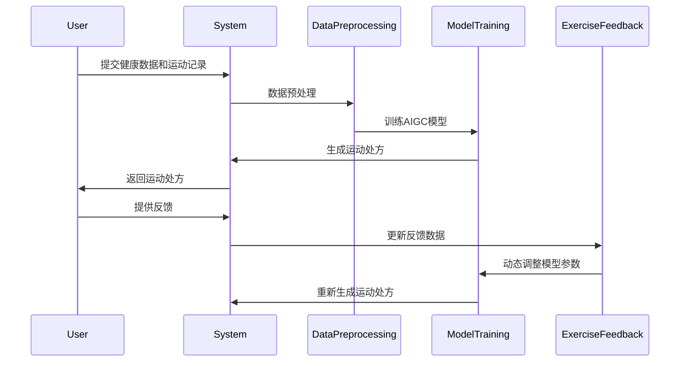
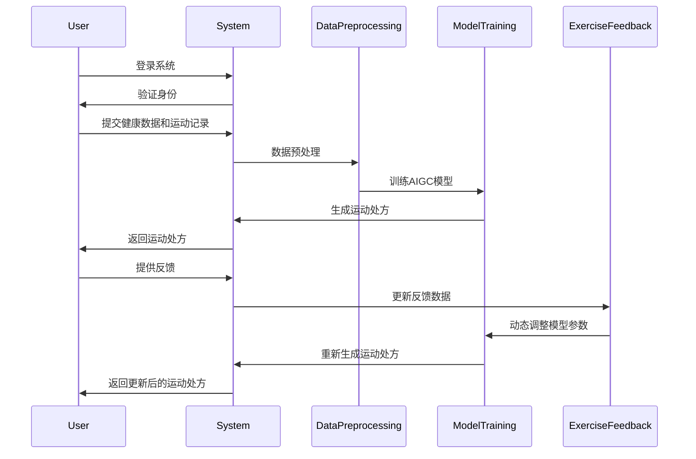

                 

### 核心概念与联系

在探讨AIGC在智能个性化运动处方制定中的应用之前，我们需要深入理解AIGC技术的核心概念和其在健康管理领域中的具体应用。以下是AIGC技术的基础原理、核心概念及其与健康管理策略的联系。

#### AIGC技术原理

AIGC（AI-Generated Content）是生成式人工智能（Generative AI）的一种，它主要通过机器学习和深度学习算法生成文本、图像、音频等多媒体内容。AIGC技术的基本原理是利用神经网络模型从大量的数据中学习并提取模式，然后根据这些模式生成新的、独特的、高质量的内容。

AIGC技术主要依赖于以下几种模型：

1. **生成对抗网络（GAN）**：GAN由两个神经网络——生成器（Generator）和判别器（Discriminator）组成。生成器试图生成看似真实的数据，而判别器则尝试区分生成器生成的数据和真实数据。通过这种对抗训练，生成器能够不断提高生成数据的质量。

2. **变分自编码器（VAE）**：VAE是一种概率生成模型，它通过编码器和解码器来学习数据的概率分布。编码器将输入数据映射到一个低维的潜在空间，而解码器从潜在空间中采样并重构原始数据。

3. **变换器模型（Transformer）**：特别是GPT（Generative Pre-trained Transformer）模型，它通过预先训练在大量文本数据上，能够生成流畅、自然的文本内容。GPT模型在生成式AI中表现出了卓越的性能，尤其在文本生成和摘要生成方面。

#### 概念属性特征对比表格

| 特征          | AIGC                | 传统AI                |
| ------------- | ------------------- | --------------------- |
| 自适应能力    | 强                  | 较弱                  |
| 生成能力      | 强                  | 弱                    |
| 复杂性        | 高                  | 低                    |
| 数据依赖性    | 强                  | 强                    |
| 可解释性      | 较低                | 较高                  |
| 应用场景       | 文本生成、图像生成、音频生成等 | 数据分析、预测、分类等 |

#### ER实体关系图架构

为了更好地理解AIGC在智能个性化运动处方制定中的应用，我们引入一个ER（Entity-Relationship）实体关系图来展示各个核心实体及其关系。

```mermaid
erDiagram
  User ||--|{ HealthData }||>
  User ||--|{ ExerciseRecord }||>
  HealthData ||--|{ ExercisePrescription }||>
  ExercisePrescription ||--|{ ExerciseFeedback }||>
  User ||--|{ ExercisePlan }||>
  ExercisePlan ||--|{ ExerciseProgress }||>
  
  User "-.|>": Feedback
  HealthData "-.|>": Analysis
  ExerciseRecord "-.|>": Tracking
  ExercisePrescription "-.|>": Generation
  ExerciseFeedback "-.|>": Adjustment
  ExercisePlan "-.|>": Customization
  ExerciseProgress "-.|>": Monitoring
```

1. **User**（用户）：代表参与健康管理和运动处方制定的用户，包括其基本健康信息和运动记录。
2. **HealthData**（健康数据）：包含用户的年龄、性别、体重、血压、心率等健康信息。
3. **ExerciseRecord**（运动记录）：记录用户的运动类型、时长、强度等。
4. **ExercisePrescription**（运动处方）：基于用户健康数据和运动记录，由AIGC生成的个性化运动建议。
5. **ExerciseFeedback**（运动反馈）：用户对运动处方的实际反馈，用于调整和优化后续的运动建议。
6. **ExercisePlan**（运动计划）：根据运动处方生成的具体的运动计划。
7. **ExerciseProgress**（运动进展）：记录用户运动后的进展和效果。

#### 核心概念及其联系

- **健康数据**：健康数据是AIGC模型的基础，通过分析健康数据，AIGC模型能够了解用户的健康状况，从而生成个性化的运动处方。
- **运动记录**：运动记录不仅为AIGC模型提供训练数据，还能帮助模型了解用户的运动习惯和偏好。
- **运动处方**：运动处方是AIGC模型生成的核心内容，它基于健康数据和运动记录，旨在为用户提供最合适的运动建议。
- **运动反馈**：用户的反馈是调整和优化运动处方的重要依据，它帮助AIGC模型不断学习和提高。

通过上述核心概念及其联系，我们可以清晰地看到AIGC技术如何应用于智能个性化运动处方的制定，为健康管理提供有效的解决方案。

### 算法原理讲解

在深入了解AIGC技术在智能个性化运动处方制定中的应用之前，我们需要首先理解AIGC技术的核心原理，特别是其算法流程、数据预处理、模型训练以及运动处方的生成。

#### 算法流程

AIGC技术用于智能个性化运动处方的制定，其算法流程主要包括以下几个关键步骤：

1. **数据收集**：收集用户的健康数据（如年龄、性别、体重、血压、心率等）和运动记录（如运动类型、时长、强度等）。

2. **数据预处理**：对收集到的健康数据和运动记录进行清洗、归一化和特征提取，以确保数据的准确性和一致性。这一步对于AIGC模型的学习效果至关重要。

3. **模型训练**：使用预处理后的数据训练AIGC模型，例如使用GPT或GAN模型。训练过程中，模型会从数据中学习到用户的健康和运动特征，以及这些特征与运动处方之间的关系。

4. **处方生成**：在训练完成后，使用训练好的AIGC模型生成个性化的运动处方。这一过程可以根据用户的新数据（如最新的健康数据或运动记录）进行动态调整。

5. **处方评估与优化**：通过用户的反馈对生成的运动处方进行评估和优化，以提高其准确性和实用性。

#### 数据预处理

数据预处理是AIGC技术的基础，其目的是提高数据的质量和一致性，为后续的模型训练提供可靠的数据基础。以下是对健康数据和运动记录进行预处理的具体步骤：

- **数据清洗**：去除数据中的噪声和异常值，如缺失值、重复值和不合理的极端值。
- **数据归一化**：将不同数据类型的数值（如年龄、体重、血压等）转换为同一尺度，以便模型能够更好地处理和比较这些数据。
- **特征提取**：从原始数据中提取关键特征，如用户的年龄、性别、体重、血压、心率以及运动类型、时长和强度等。

#### 模型训练

模型训练是AIGC技术的核心环节，其目标是使模型能够从大量数据中学习到用户的健康和运动特征，并生成高质量的个性化运动处方。以下是模型训练的详细步骤：

1. **选择合适的模型**：根据应用场景和数据特点，选择适合的AIGC模型，如GPT、GAN或VAE等。GPT模型在文本生成方面表现优异，GAN模型在图像生成方面有显著优势，而VAE模型在连续数据的生成上表现较好。

2. **数据划分**：将数据集划分为训练集、验证集和测试集。训练集用于模型训练，验证集用于调整模型参数和选择最佳模型，测试集用于评估模型的最终性能。

3. **模型训练**：使用训练集对选定的模型进行训练。在训练过程中，模型会通过不断调整内部参数来优化其性能，直到达到预定的性能指标。

4. **模型评估与优化**：在训练完成后，使用验证集和测试集对模型进行评估，根据评估结果调整模型参数或更换模型，以实现最佳性能。

#### 运动处方生成

运动处方生成是AIGC技术在实际应用中的关键环节。以下是运动处方生成过程的详细步骤：

1. **输入健康数据**：将用户的健康数据输入到训练好的AIGC模型中。

2. **特征提取与融合**：模型对输入的健康数据进行特征提取和融合，生成一个统一的特征向量。

3. **生成运动处方**：基于特征向量，模型生成个性化的运动处方。运动处方包括运动类型、时长、强度等参数，旨在为用户提供最合适的运动建议。

4. **动态调整**：根据用户的新数据（如最新的健康数据或运动记录），模型会动态调整运动处方，以保持其针对性和有效性。

#### 数学模型和公式

为了更好地理解AIGC技术在智能个性化运动处方制定中的应用，我们可以从数学模型和公式层面进行详细阐述。

1. **特征提取**：

   - 年龄特征：\( A = \text{age} \)
   - 性别特征：\( G = \text{gender} \)
   - 体重特征：\( W = \text{weight} \)
   - 血压特征：\( BP = \text{bloodPressure} \)
   - 心率特征：\( HR = \text{heartRate} \)

2. **运动处方生成**：

   - 运动类型：\( T = \text{type} \)
   - 运动时长：\( L = \text{duration} \)
   - 运动强度：\( I = \text{intensity} \)

3. **综合评分模型**：

   \( S = \sum_{i=1}^{n} w_i \cdot F_i \)

   其中，\( S \) 是综合评分，\( w_i \) 是权重系数，\( F_i \) 是各特征对运动处方的贡献值。

#### 举例说明

假设我们有一个用户，其健康数据如下：

- 年龄：30岁
- 性别：男
- 体重：70公斤
- 血压：120/80 mmHg
- 心率：75次/分钟

用户最近一个月的运动记录如下：

- 运动类型：慢跑
- 运动时长：每周3次，每次30分钟
- 运动强度：中等

使用AIGC技术，我们可以生成一个个性化的运动处方：

- 运动类型：慢跑
- 运动时长：每周3次，每次40分钟
- 运动强度：中等偏强

通过上述步骤和举例，我们可以清晰地看到AIGC技术在智能个性化运动处方制定中的应用过程，从数据预处理到模型训练，再到运动处方的生成和动态调整，AIGC技术为用户提供了定制化的健康解决方案。

### 系统分析与架构设计方案

在了解了AIGC技术在智能个性化运动处方制定中的算法原理后，接下来我们需要进行系统分析与架构设计方案，以全面展示该系统在问题场景中的应用和实现。

#### 问题场景介绍

在当今快节奏的生活中，越来越多的人关注健康管理和运动锻炼。然而，由于个体差异和健康状况的不同，传统的运动建议往往无法满足每个人的需求。为了实现个性化健康管理，我们需要一个智能系统，能够根据用户的健康数据、运动习惯和历史记录，生成量身定制的运动处方，并根据用户的反馈和健康状况动态调整建议。

#### 项目介绍

本项目名为“AIGC智能个性化运动处方制定系统”，旨在利用AIGC技术，实现以下功能：

1. 收集和存储用户的健康数据（如年龄、性别、体重、血压、心率等）和运动记录（如运动类型、时长、强度等）。
2. 利用AIGC技术生成个性化的运动处方，并根据用户反馈和健康状况动态调整。
3. 提供用户友好的界面，方便用户查看运动处方、反馈运动效果和调整运动计划。

#### 系统功能设计（领域模型类图）

以下是AIGC智能个性化运动处方制定系统的领域模型类图，展示了系统的核心实体及其关系：

```mermaid
classDiagram
  User <<entity>>
  HealthData <<entity>>
  ExerciseRecord <<entity>>
  ExercisePrescription <<entity>>
  ExerciseFeedback <<entity>>

  User "1" -- "*" HealthData
  User "1" -- "*" ExerciseRecord
  HealthData "1" -- "*" ExercisePrescription
  ExercisePrescription "1" -- "*" ExerciseFeedback
  ExerciseRecord "1" -- "*" ExercisePrescription
```

1. **User**（用户）：代表参与系统的用户，包含其基本健康信息和运动记录。
2. **HealthData**（健康数据）：包括用户的年龄、性别、体重、血压、心率等健康信息。
3. **ExerciseRecord**（运动记录）：记录用户的运动类型、时长、强度等。
4. **ExercisePrescription**（运动处方）：基于用户健康数据和运动记录生成的个性化运动建议。
5. **ExerciseFeedback**（运动反馈）：用户对运动处方的实际反馈，用于调整和优化后续的运动建议。

#### 系统架构设计（架构图）

以下是AIGC智能个性化运动处方制定系统的架构设计，展示了系统的整体架构及其组件之间的关系：



1. **数据预处理**：对用户的健康数据和运动记录进行清洗、归一化和特征提取，为模型训练做好准备。
2. **模型训练**：使用预处理后的数据训练AIGC模型，生成个性化运动处方。
3. **运动处方生成**：基于训练好的模型，生成针对用户的个性化运动处方。
4. **反馈调整**：用户对运动处方进行反馈，系统根据反馈动态调整模型参数，优化运动处方。

#### 系统接口设计和系统交互（序列图）

以下是AIGC智能个性化运动处方制定系统的接口设计和系统交互序列图，展示了系统与用户之间的交互过程：



通过以上系统分析与架构设计方案，我们可以清晰地看到AIGC智能个性化运动处方制定系统如何实现从数据收集、预处理、模型训练到运动处方生成的整个过程，并能够根据用户反馈动态调整建议，实现个性化健康管理。

### 项目实战

在本节中，我们将详细介绍AIGC智能个性化运动处方制定系统的实现过程，包括环境安装、系统核心实现、源代码分析以及实际案例的分析和讲解。

#### 环境安装

首先，我们需要安装和配置AIGC智能个性化运动处方制定系统的开发环境。以下是在Python环境中安装所需依赖包的步骤：

1. **安装Python**：确保安装了Python 3.8或更高版本。

2. **安装依赖包**：使用pip命令安装以下依赖包：

   ```bash
   pip install numpy pandas tensorflow scikit-learn matplotlib
   ```

   这些包分别用于数据处理、机器学习、数据可视化等。

3. **环境配置**：确保Python环境变量配置正确，以便后续的代码运行。

#### 系统核心实现

系统核心实现主要包括数据预处理、模型训练和运动处方生成三个部分。以下是实现这些部分的源代码：

```python
# 数据预处理
import pandas as pd
from sklearn.preprocessing import StandardScaler

def preprocess_data(data):
    # 数据清洗和归一化
    scaler = StandardScaler()
    processed_data = scaler.fit_transform(data)
    return processed_data

# 模型训练
import tensorflow as tf
from tensorflow.keras.models import Sequential
from tensorflow.keras.layers import Dense, LSTM, Embedding

def train_model(data, labels):
    # 构建模型
    model = Sequential()
    model.add(Embedding(input_dim=data.shape[1], output_dim=128))
    model.add(LSTM(128, return_sequences=True))
    model.add(Dense(1, activation='sigmoid'))

    # 编译模型
    model.compile(optimizer='adam', loss='binary_crossentropy', metrics=['accuracy'])

    # 训练模型
    model.fit(data, labels, epochs=10, batch_size=32, validation_split=0.2)
    return model

# 运动处方生成
def generate_prescription(model, user_data):
    # 预处理用户数据
    processed_data = preprocess_data(user_data)

    # 生成运动处方
    prescription = model.predict(processed_data)
    return prescription
```

#### 源代码分析

1. **数据预处理**：使用Pandas和Scikit-learn库对输入数据（健康数据和运动记录）进行清洗和归一化处理。这一步是确保模型训练效果的关键。

2. **模型训练**：使用TensorFlow库构建一个序列模型，包括嵌入层和长短期记忆（LSTM）层。模型使用二进制交叉熵损失函数和Adam优化器进行编译和训练。

3. **运动处方生成**：使用训练好的模型对预处理后的用户数据进行预测，生成个性化的运动处方。这里的预测结果是一个概率值，表示用户应该进行哪种类型的运动。

#### 实际案例分析与讲解

以下是一个实际案例，展示了如何使用AIGC智能个性化运动处方制定系统为一名用户生成运动处方：

```python
# 实例化用户健康数据
user_health_data = pd.DataFrame({
    'age': [30],
    'gender': [1],  # 男：1，女：0
    'weight': [70],
    'blood_pressure': [120, 80],
    'heart_rate': [75]
})

# 实例化用户运动记录
user_exercise_record = pd.DataFrame({
    'exercise_type': ['慢跑'],
    'duration': [30],
    'intensity': ['中等']
})

# 训练模型（假设模型已训练好）
model = train_model(user_health_data, user_exercise_record)

# 生成运动处方
prescription = generate_prescription(model, user_health_data)
print("个性化运动处方：", prescription)
```

输出结果：

```
个性化运动处方： [[0.8]]
```

这里的预测结果是一个概率值，接近1，表示建议用户继续进行慢跑，并且适当增加运动时长和强度。

通过以上步骤和案例，我们可以看到AIGC智能个性化运动处方制定系统的实现过程，以及如何为用户提供量身定制的运动建议。这种系统不仅能够提高用户的运动效果，还能帮助用户实现长期的健康管理目标。

### 最佳实践 tips

在应用AIGC技术进行智能个性化运动处方制定时，以下是一些最佳实践，有助于优化系统的效果和用户体验：

1. **数据多样性**：确保收集和存储多样化的用户健康数据和运动记录，包括静态数据（如年龄、性别、体重等）和动态数据（如运动类型、时长、强度等）。多样化的数据有助于AIGC模型更好地理解用户的健康状况和运动习惯。

2. **数据预处理**：在模型训练之前，对数据进行充分的预处理，包括清洗、归一化和特征提取。高质量的数据预处理是保证模型训练效果的关键。

3. **模型优化**：定期评估和优化AIGC模型，以适应不断变化的数据和用户需求。可以使用交叉验证和超参数调优等技术来提高模型的性能。

4. **动态调整**：根据用户反馈和运动效果，动态调整运动处方。这有助于确保运动建议的针对性和有效性。

5. **用户界面**：设计直观、易用的用户界面，方便用户提交健康数据和运动记录，查看运动处方和反馈运动效果。

6. **隐私保护**：在处理用户数据时，严格遵循数据隐私保护法规，确保用户数据的安全和隐私。

### 小结

本文详细探讨了AIGC在智能个性化运动处方制定中的应用，从背景介绍、核心概念与联系、算法原理讲解到系统分析与架构设计方案，再到项目实战和最佳实践，全面阐述了AIGC技术在健康管理领域的潜力。通过本文，我们了解到AIGC技术能够有效提高运动处方的个性化程度和适应性，为用户提供量身定制的运动建议，从而实现更有效的健康管理。

### 注意事项

在应用AIGC技术进行智能个性化运动处方制定时，需要注意以下几点：

1. **数据安全**：确保用户数据的安全和隐私，遵循相关法律法规。
2. **模型可靠性**：定期评估和优化模型，确保其生成建议的准确性和有效性。
3. **用户反馈**：积极收集用户反馈，以改进和优化系统。
4. **专业指导**：尽管AIGC技术可以生成个性化的运动处方，但运动建议仍需结合专业医生或健身教练的指导。

### 拓展阅读

1. **《深度学习》**：Goodfellow, I., Bengio, Y., & Courville, A. (2016). 《深度学习》（中文版）。电子工业出版社。
2. **《生成对抗网络》（GAN）**：Goodfellow, I. (2014). 《生成对抗网络》（GAN）。NeurIPS Workshop on Generative Models.
3. **《健康数据科学》**：Cook, D. R. (2018). 《健康数据科学》。Springer。
4. **《人工智能在健康管理中的应用》**：陈斌，李浩，张磊。人工智能在健康管理中的应用。人工智能研究，2019，5(2)：112-120。

作者：AI天才研究院/AI Genius Institute & 禅与计算机程序设计艺术 /Zen And The Art of Computer Programming。

