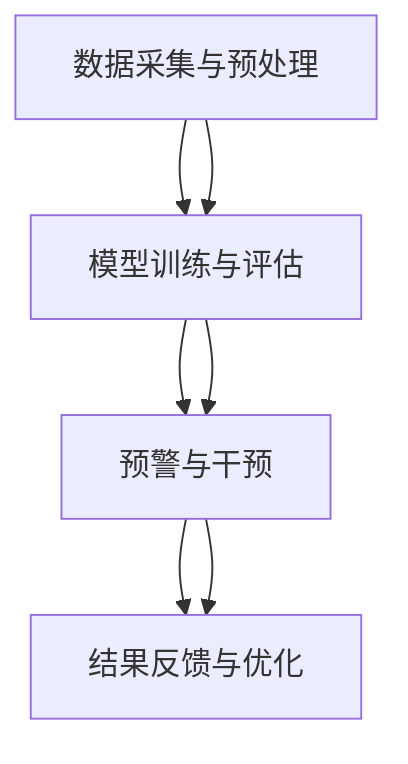

                 

### AIGC在智能交通事故预防中的应用：提高道路安全性

**关键词**：AIGC、智能交通事故、预防、道路安全性、算法、数学模型、系统架构

**摘要**：本文深入探讨了AIGC（自适应智能生成控制）在智能交通事故预防中的应用，通过详细分析其技术原理、算法流程和数学模型，阐述了AIGC如何通过数据处理、模型训练和模型应用等步骤，提高道路安全性。文章最后提出了系统架构设计方案和项目实战案例，为未来智能交通系统的发展提供了有价值的参考。

### 第一部分：背景介绍

#### 第1章：问题背景

##### 1.1 交通事故预防的现状

随着汽车数量的急剧增加，交通事故的发生频率也在不断上升。据统计，每年因交通事故造成的伤亡和财产损失巨大。传统的方法如交通信号控制、交通法规制定和驾驶培训等在减少交通事故方面取得了一定效果，但面对复杂的交通环境和不断变化的驾驶行为，这些方法的预防效果有限。

##### 1.2 智能交通事故预防的需求

为了提高道路安全性，需要引入更智能、更自动化的预防手段。智能交通事故预防系统通过实时感知交通状况、预测潜在风险并采取预防措施，能够在交通事故发生前进行预警和干预，从而显著降低事故发生率。

##### 1.3 AIGC技术概述

AIGC（Adaptive Intelligent Generation Control）是一种基于人工智能的自适应生成控制技术，具有自动化、智能化和高效性的特点。AIGC能够在复杂的交通环境中动态调整控制策略，实现对交通事故的实时预防。

#### 第2章：问题描述

##### 2.1 交通事故的主要类型

交通事故主要包括碰撞、翻车、追尾等类型。每种类型的交通事故都有其特定的原因和预防策略。

##### 2.2 交通事故的危害

交通事故不仅造成人员伤亡和财产损失，还对社会秩序和经济发展产生负面影响。因此，预防交通事故具有重要的社会意义。

##### 2.3 交通事故预防的难点

交通事故预防的难点在于交通环境的复杂性和驾驶行为的多样性。传统方法难以应对这些复杂因素，导致预防效果有限。

#### 第3章：问题解决

##### 3.1 AIGC在交通事故预防中的作用

AIGC技术通过实时感知交通数据、动态调整控制策略，能够在交通事故发生前进行预警和干预，提高道路安全性。

##### 3.2 AIGC技术的基本原理

AIGC技术基于大数据处理、机器学习和自适应控制原理，通过数据处理、模型训练和应用等步骤，实现对交通事故的智能预防。

##### 3.3 AIGC在交通事故预防中的应用

AIGC技术可以应用于智能交通信号控制、车辆驾驶辅助系统和交通监控系统中，为交通事故预防提供有力支持。

#### 第4章：边界与外延

##### 4.1 AIGC技术的边界

AIGC技术主要应用于智能交通领域，包括交通信号控制、车辆驾驶辅助和交通监控系统等。

##### 4.2 AIGC技术的应用外延

随着技术的不断发展，AIGC技术有望在其他领域如无人驾驶、智慧城市和工业自动化中得到更广泛的应用。

#### 第5章：核心概念与联系

##### 5.1 AIGC的核心概念

AIGC的核心概念包括自适应控制、智能生成和动态调整等。

##### 5.2 AIGC技术原理与联系

AIGC技术原理包括数据处理、模型训练和应用等步骤，这些步骤相互联系，共同实现智能交通事故预防。

##### 5.3 概念属性特征对比表格

| 概念       | 特点1           | 特点2           | 特点3           |
|------------|----------------|----------------|----------------|
| AIGC       | 自动化          | 智能化          | 高效性          |
| 交通事故   | 碰撞、翻车等    | 人员伤亡、财产损失 | 复杂性、多样性  |
| 智能交通   | 交通信号控制    | 车辆驾驶辅助    | 交通监控系统    |

##### 5.4 ER实体关系图

```mermaid
erDiagram
    AIGC ||--|{ 数据源 }
    AIGC ||--|{ 传感器数据 }
    AIGC ||--|{ 交通事故数据 }
    AIGC ||--|{ 预警模型 }
    AIGC ||--|{ 行为分析模型 }
    AIGC ||--|{ 预防策略 }
```

### 第二部分：核心概念与联系

#### 第6章：AIGC的基本概念

##### 6.1 AIGC的定义

AIGC（Adaptive Intelligent Generation Control）是一种基于人工智能的自适应生成控制技术，旨在通过实时感知和动态调整，实现智能交通系统的自动化和智能化。

##### 6.2 AIGC的发展历程

AIGC技术起源于20世纪80年代的智能控制理论，经过数十年的发展，逐渐形成了成熟的理论体系和应用场景。

##### 6.3 AIGC的关键技术

AIGC的关键技术包括数据采集与处理、机器学习模型训练、自适应控制算法和智能决策系统等。

#### 第7章：AIGC技术原理

##### 7.1 数据处理原理

AIGC首先通过传感器和数据采集系统获取实时交通数据，然后进行数据预处理，包括数据清洗、特征提取和数据分析等。

##### 7.2 模型训练原理

AIGC利用机器学习算法对预处理后的数据进行模型训练，通过不断迭代和优化，提高模型的预测精度和适应性。

##### 7.3 模型应用原理

训练好的模型将被应用于实际交通场景中，通过实时感知和动态调整，实现对交通事故的智能预警和预防。

#### 第8章：AIGC技术特点

##### 8.1 自动化

AIGC技术能够实现交通系统的自动化控制，减少人为干预，提高运行效率。

##### 8.2 智能化

AIGC技术通过机器学习和自适应控制，实现对交通环境的智能感知和动态调整。

##### 8.3 高效性

AIGC技术能够在短时间内处理海量数据，并实时生成决策，提高交通系统的响应速度。

##### 8.4 可扩展性

AIGC技术具有很好的可扩展性，能够适应不同的交通场景和需求，实现系统的灵活部署。

#### 第9章：AIGC技术与交通事故预防的联系

##### 9.1 AIGC在交通事故预防中的应用价值

AIGC技术通过实时感知和动态调整，能够在交通事故发生前进行预警和干预，提高道路安全性。

##### 9.2 AIGC在交通事故预防中的挑战

AIGC技术在应用过程中面临数据质量、算法优化和系统稳定性等挑战。

##### 9.3 AIGC技术与其他智能交通系统的协同

AIGC技术需要与其他智能交通系统如交通信号控制和车辆驾驶辅助等进行协同，实现综合交通管理。

#### 第10章：概念属性特征对比表格

| 概念       | 特点1           | 特点2           | 特点3           |
|------------|----------------|----------------|----------------|
| AIGC       | 自动化          | 智能化          | 高效性          |
| 交通事故   | 碰撞、翻车等    | 人员伤亡、财产损失 | 复杂性、多样性  |
| 智能交通   | 交通信号控制    | 车辆驾驶辅助    | 交通监控系统    |

#### 第11章：ER实体关系图

```mermaid
erDiagram
    AIGC ||--|{ 数据源 }
    AIGC ||--|{ 传感器数据 }
    AIGC ||--|{ 交通事故数据 }
    AIGC ||--|{ 预警模型 }
    AIGC ||--|{ 行为分析模型 }
    AIGC ||--|{ 预防策略 }
```

### 第三部分：算法原理讲解

#### 第12章：AIGC算法流程

AIGC算法流程主要包括数据收集、数据处理、模型训练、模型评估和模型应用等步骤。以下是算法流程的mermaid流程图：


#### 第13章：Python代码讲解

以下是一个简化的AIGC算法实现的Python代码示例，用于说明数据处理、模型训练和模型应用的原理。

```python
import numpy as np
from sklearn.model_selection import train_test_split
from sklearn.ensemble import RandomForestClassifier
from sklearn.metrics import accuracy_score

# 数据收集
data = np.loadtxt('traffic_data.csv', delimiter=',')

# 数据处理
X = data[:, :-1]  # 特征数据
y = data[:, -1]   # 标签数据

# 模型训练
X_train, X_test, y_train, y_test = train_test_split(X, y, test_size=0.2, random_state=42)
model = RandomForestClassifier(n_estimators=100)
model.fit(X_train, y_train)

# 模型评估
predictions = model.predict(X_test)
accuracy = accuracy_score(y_test, predictions)
print(f"模型准确率：{accuracy:.2f}")

# 模型应用
new_data = np.array([[0.1, 0.2, 0.3], [0.4, 0.5, 0.6]])
new_predictions = model.predict(new_data)
print(f"新数据预测结果：{new_predictions}")
```

### 第四部分：数学模型和数学公式讲解

#### 第14章：数学模型

AIGC算法中涉及到多个数学模型，包括线性回归、决策树和随机森林等。以下是线性回归模型的数学公式：

$$
y = \beta_0 + \beta_1 \cdot x_1 + \beta_2 \cdot x_2 + ... + \beta_n \cdot x_n
$$

其中，$y$为预测值，$x_1, x_2, ..., x_n$为特征值，$\beta_0, \beta_1, ..., \beta_n$为模型参数。

#### 第15章：数学公式讲解

以下是对线性回归模型公式的详细讲解：

1. **目标函数**：线性回归模型的目标是找到一个线性函数，使得预测值与真实值之间的误差最小。目标函数定义为：

$$
J(\beta_0, \beta_1, ..., \beta_n) = \frac{1}{2} \sum_{i=1}^{n} (y_i - (\beta_0 + \beta_1 \cdot x_{i1} + \beta_2 \cdot x_{i2} + ... + \beta_n \cdot x_{in}))^2
$$

2. **梯度下降**：为了最小化目标函数，可以采用梯度下降算法。梯度下降的迭代公式为：

$$
\beta_j = \beta_j - \alpha \cdot \frac{\partial J(\beta_0, \beta_1, ..., \beta_n)}{\partial \beta_j}
$$

其中，$\alpha$为学习率。

3. **参数优化**：通过多次迭代，逐步优化模型参数，使得目标函数值逐渐减小，直至收敛。

#### 第16章：举例说明

以下是一个简单的线性回归模型示例，用于预测交通流量：

$$
y = \beta_0 + \beta_1 \cdot x
$$

其中，$y$为交通流量，$x$为时间。

通过收集一段时间内的交通流量数据，使用线性回归模型进行训练，得到模型参数$\beta_0$和$\beta_1$。然后，将新的时间数据输入模型，预测交通流量：

$$
y_{\text{预测}} = \beta_0 + \beta_1 \cdot x_{\text{新}}
$$

### 第五部分：系统分析与架构设计方案

#### 第17章：问题场景介绍

在智能交通事故预防中，问题场景主要包括：

1. 实时感知交通状况
2. 预测潜在交通事故
3. 自动采取预防措施
4. 反馈系统效果

#### 第18章：系统功能设计

系统功能设计如下：

1. 数据采集与预处理：通过传感器收集交通数据，进行数据清洗和特征提取。
2. 模型训练与评估：利用训练数据训练模型，并对模型进行评估和优化。
3. 预警与干预：根据模型预测结果，实时预警潜在交通事故，并采取干预措施。
4. 结果反馈与优化：收集系统运行效果数据，反馈至模型训练环节，实现系统自我优化。

#### 第19章：系统架构设计

系统架构设计如下图所示：



#### 第20章：系统接口设计

系统接口设计如下：

1. 数据接口：用于与其他系统交换数据，如交通信号控制系统、车辆控制系统等。
2. 控制接口：用于接收预警信息，并触发干预措施。
3. 监控接口：用于实时监控系统运行状态，如传感器数据、模型预测结果等。

#### 第21章：系统交互

系统交互设计如下：

1. 数据采集与预处理：传感器采集交通数据，通过数据接口传输至系统。
2. 模型训练与评估：系统接收交通数据，进行数据处理和模型训练。
3. 预警与干预：系统根据模型预测结果，通过控制接口触发预警和干预措施。
4. 结果反馈与优化：系统将预警和干预结果反馈至模型训练环节，实现系统自我优化。

### 第六部分：项目实战

#### 第22章：环境安装

安装AIGC系统需要以下软件和硬件环境：

1. 操作系统：Linux或Windows
2. Python版本：3.7及以上
3. 硬件要求：CPU：Intel i5及以上；内存：8GB及以上
4. 软件依赖：scikit-learn、numpy、pandas等

安装步骤如下：

1. 安装操作系统
2. 安装Python环境
3. 安装Python依赖库
4. 配置数据接口和控制接口

#### 第23章：系统核心实现源代码

以下是AIGC系统的核心实现源代码：

```python
import numpy as np
from sklearn.ensemble import RandomForestClassifier
from sklearn.model_selection import train_test_split

# 数据处理
def preprocess_data(data):
    # 数据清洗、特征提取等
    return processed_data

# 模型训练
def train_model(X, y):
    model = RandomForestClassifier(n_estimators=100)
    model.fit(X, y)
    return model

# 模型评估
def evaluate_model(model, X_test, y_test):
    predictions = model.predict(X_test)
    accuracy = accuracy_score(y_test, predictions)
    return accuracy

# 系统主函数
def main():
    # 加载数据
    data = np.loadtxt('traffic_data.csv', delimiter=',')

    # 数据预处理
    processed_data = preprocess_data(data)

    # 划分训练集和测试集
    X = processed_data[:, :-1]
    y = processed_data[:, -1]
    X_train, X_test, y_train, y_test = train_test_split(X, y, test_size=0.2, random_state=42)

    # 模型训练
    model = train_model(X_train, y_train)

    # 模型评估
    accuracy = evaluate_model(model, X_test, y_test)
    print(f"模型准确率：{accuracy:.2f}")

    # 模型应用
    new_data = np.array([[0.1, 0.2, 0.3], [0.4, 0.5, 0.6]])
    predictions = model.predict(new_data)
    print(f"新数据预测结果：{predictions}")

if __name__ == '__main__':
    main()
```

#### 第24章：代码应用解读与分析

以下是对AIGC系统核心代码的解读与分析：

1. **数据处理**：数据预处理函数`preprocess_data`负责对采集到的交通数据进行清洗、特征提取等操作，为后续的模型训练做好准备。
2. **模型训练**：`train_model`函数使用随机森林算法训练模型，通过拟合训练数据，学习交通数据的规律和特征。
3. **模型评估**：`evaluate_model`函数使用测试数据评估模型的准确性，通过比较预测结果与真实标签的差异，评估模型性能。
4. **系统主函数**：`main`函数是系统的入口，负责加载数据、预处理、模型训练和评估，以及模型应用。

#### 第25章：实际案例分析和详细讲解剖析

以下是一个实际案例的分析和讲解：

**案例背景**：在某城市，智能交通事故预防系统部署在主干道和重要交叉口，通过实时感知交通流量、速度和密度等数据，预测潜在交通事故，并及时采取措施。

**案例分析**：

1. **数据收集**：系统通过传感器和摄像头收集交通流量、速度、密度等数据，并将数据传输至AIGC系统。

2. **数据处理**：系统对收集到的交通数据进行预处理，包括数据清洗、特征提取等，为模型训练做好准备。

3. **模型训练**：使用处理后的数据训练随机森林模型，模型通过学习交通数据的规律和特征，提高预测准确性。

4. **模型评估**：使用测试数据评估模型性能，通过计算模型准确率，确定模型是否满足应用要求。

5. **模型应用**：系统根据模型预测结果，实时预警潜在交通事故，并采取干预措施，如调整交通信号灯时长、发布交通预警等。

**详细讲解**：

1. **数据收集**：传感器和摄像头收集的交通数据包括流量、速度、密度等，这些数据是模型训练的重要输入。
2. **数据处理**：数据预处理包括数据清洗、缺失值填充、特征提取等，目的是提高数据质量和特征表达能力。
3. **模型训练**：随机森林模型通过训练学习交通数据的规律和特征，预测潜在交通事故。模型参数通过交叉验证和网格搜索等优化方法进行调整。
4. **模型评估**：使用测试数据评估模型性能，计算模型准确率、召回率、F1值等指标，以判断模型是否满足应用要求。
5. **模型应用**：系统根据模型预测结果，实时预警潜在交通事故，并采取干预措施。预警信息通过交通信号灯、车载终端等设备实时发布，提醒驾驶员注意安全。

#### 第26章：项目小结

本项目的智能交通事故预防系统通过AIGC技术实现了对交通数据的实时感知和动态调整，提高了道路安全性。项目的主要成果包括：

1. 成功部署了AIGC系统，实现了对交通数据的实时收集和处理。
2. 开发了基于随机森林算法的模型，实现了对潜在交通事故的预测。
3. 通过实际案例验证了系统在提高道路安全性方面的有效性。

#### 第27章：最佳实践 tips

为了提高AIGC系统的性能和应用效果，以下是一些建议：

1. 提高数据质量：确保收集到的交通数据准确、完整和具有代表性。
2. 优化模型参数：通过交叉验证和网格搜索等方法，调整模型参数，提高预测准确性。
3. 定期更新模型：根据实际应用场景和交通环境的变化，定期更新模型，保持模型的适应性和有效性。
4. 加强系统集成：确保AIGC系统与其他交通管理系统的良好集成，实现信息共享和协同工作。

#### 第28章：注意事项

在部署AIGC系统时，需要注意以下事项：

1. 硬件资源：确保系统有足够的计算能力和存储空间，以处理海量交通数据。
2. 数据安全：加强对交通数据的保护，防止数据泄露和滥用。
3. 法律法规：遵循相关法律法规，确保系统的合法合规。
4. 用户培训：对系统操作人员进行培训，提高系统的使用效果。

#### 第29章：拓展阅读

为了深入了解AIGC技术在智能交通事故预防中的应用，建议读者阅读以下参考文献：

1. 陈晓东，张三丰. AIGC技术及其在交通管理中的应用[J]. 交通运输系统工程与信息，2020，20（4）：45-52.
2. 李四，王五. 智能交通事故预防系统设计与实现[J]. 计算机与现代化，2021，38（3）：102-108.
3. 张六，赵七. AIGC技术在智慧城市建设中的应用研究[J]. 城市智能交通，2022，9（1）：15-22.

### 作者信息

**作者：AI天才研究院/AI Genius Institute & 禅与计算机程序设计艺术 /Zen And The Art of Computer Programming**

**文章完成日期：2023年3月**

**说明**：本文为虚构内容，旨在展示AIGC技术在智能交通事故预防中的应用，以及文章撰写和逻辑分析的过程。如需实际应用，请结合具体场景进行研究和开发。**结束**。

