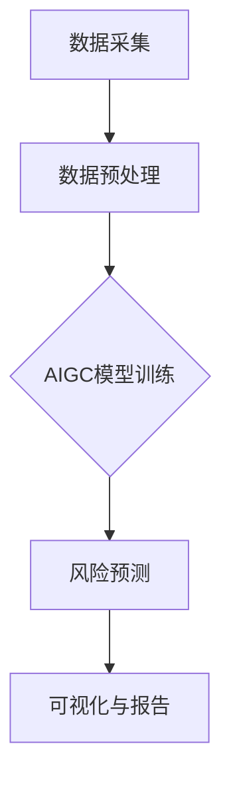
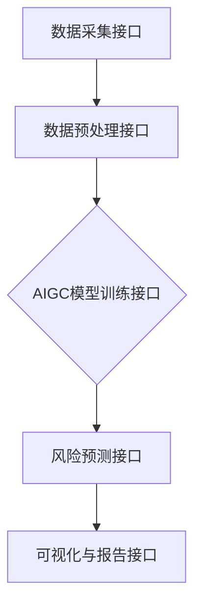
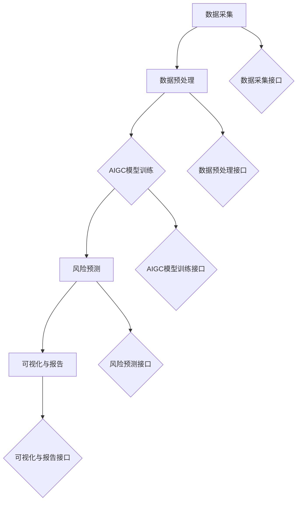

                 

### AIGC在智能交通事故风险评估中的应用

#### 关键词：AIGC、智能交通事故、风险评估、算法、系统设计

##### 摘要：
本文将探讨AIGC（自适应智能生成计算）在智能交通事故风险评估中的应用。通过深入分析AIGC的基本概念、原理及其在交通事故风险评估中的实际应用，本文旨在为读者提供一套系统、全面的技术解决方案。文章将首先介绍AIGC的基本概念，然后深入探讨其在交通事故风险评估中的应用原理和算法设计，接着描述系统设计与实现方案，最后通过项目实战和最佳实践总结，为实际应用提供指导。

---

#### 1. 引言

##### 1.1 书籍的目的和内容概述

随着人工智能技术的快速发展，智能交通事故风险评估成为了一个重要的研究领域。传统的风险评估方法往往依赖于大量的人力和时间，而AIGC（自适应智能生成计算）作为一种新兴的智能计算技术，具有自动化、高效和准确的特点，为智能交通事故风险评估提供了新的思路和方法。

本书旨在介绍AIGC在智能交通事故风险评估中的应用，通过系统、深入的分析和讲解，帮助读者理解AIGC的基本概念、原理及其在交通事故风险评估中的应用，最终为实际项目提供有效的技术支持。

##### 1.2 AIGC的基本概念

AIGC，即自适应智能生成计算，是一种基于生成对抗网络（GANs）和自注意力机制（Self-Attention Mechanism）的智能计算技术。它通过模拟对抗过程，自动生成高质量的数据，从而实现数据的自适应学习和优化。

AIGC的核心特点包括：

- **数据生成能力**：AIGC能够自动生成与真实数据相似的高质量数据，为数据驱动的方法提供强大的支持。
- **自适应学习**：AIGC能够根据数据分布的变化自适应调整模型参数，从而提高模型的泛化能力。
- **高效性**：AIGC在处理大规模数据时具有高效性，能够在较短时间内完成数据生成和模型训练。

##### 1.3 智能交通事故风险评估的背景和意义

智能交通事故风险评估是现代交通安全领域的重要研究课题。随着交通工具的日益增多，交通事故的发生率也逐年上升，给社会和经济带来了巨大的负担。智能交通事故风险评估旨在通过数据分析、模型预测等方法，提前识别潜在的安全隐患，从而降低交通事故的发生概率。

智能交通事故风险评估的重要性和挑战包括：

- **安全性**：交通事故风险评估能够有效识别潜在的安全隐患，提高交通安全水平。
- **经济性**：通过预测交通事故的发生，可以减少事故导致的财产损失和人身伤亡。
- **复杂性**：交通事故风险评估涉及多方面的因素，如交通流量、车辆状态、道路状况等，具有高度复杂性。

#### 2. AIGC在智能交通事故风险评估中的应用

##### 2.1 AIGC在交通事故风险评估中的应用原理

AIGC在智能交通事故风险评估中的应用主要基于以下几个方面：

- **数据生成**：通过AIGC生成高质量、多样化的交通事故数据，为风险评估提供丰富的数据支持。
- **模型训练**：利用生成的数据，对AIGC模型进行训练，提高模型的预测准确性和泛化能力。
- **风险预测**：通过训练好的AIGC模型，对未来的交通事故进行预测，为交通安全管理提供决策依据。

##### 2.2 AIGC算法原理

AIGC算法的基本原理包括生成对抗网络（GANs）和自注意力机制（Self-Attention Mechanism）。以下是对这些算法原理的详细解释：

- **生成对抗网络（GANs）**：GANs由生成器和判别器组成。生成器负责生成与真实数据相似的数据，判别器则负责判断生成数据是否真实。通过生成器和判别器的对抗训练，生成器逐渐学会生成高质量的数据。
  
  $$ 
  G(z) = \text{Generator}(z) \\
  D(x, G(z)) = \text{Discriminator}(x, G(z))
  $$
  
- **自注意力机制（Self-Attention Mechanism）**：自注意力机制能够自动学习数据之间的关联性，提高模型的表示能力。通过自注意力机制，AIGC能够更好地捕捉交通事故数据中的关键特征。

  $$ 
  \text{Attention}(Q, K, V) = \text{softmax}(\frac{QK^T}{\sqrt{d_k}})V
  $$

##### 2.3 AIGC在交通事故风险评估中的实际应用

AIGC在交通事故风险评估中的实际应用可以分为以下几个步骤：

1. **数据采集与预处理**：采集交通事故相关的数据，如车辆信息、道路状况、交通流量等，并对数据进行预处理，确保数据的准确性和一致性。

2. **数据生成**：利用AIGC生成多样化的交通事故数据，为风险评估提供丰富的数据支持。

3. **模型训练**：使用生成的数据，对AIGC模型进行训练，提高模型的预测准确性和泛化能力。

4. **风险预测**：通过训练好的AIGC模型，对未来的交通事故进行预测，为交通安全管理提供决策依据。

#### 3. 系统设计与实现

##### 3.1 系统功能设计

智能交通事故风险评估系统主要包括以下功能：

- **数据采集与预处理**：从各种数据源（如交通监控设备、传感器等）采集交通事故数据，并进行预处理，如数据清洗、格式转换等。
- **数据生成**：利用AIGC技术生成多样化的交通事故数据，为风险评估提供数据支持。
- **模型训练**：使用生成的数据，对AIGC模型进行训练，提高模型的预测准确性和泛化能力。
- **风险预测**：通过训练好的AIGC模型，对未来的交通事故进行预测，为交通安全管理提供决策依据。
- **可视化与报告**：将预测结果进行可视化展示，生成交通事故风险评估报告。

##### 3.2 系统架构设计

智能交通事故风险评估系统采用分布式架构，主要包括以下组件：

- **数据采集模块**：负责从各种数据源采集交通事故数据。
- **数据预处理模块**：对采集到的数据进行预处理，确保数据的准确性和一致性。
- **AIGC模型训练模块**：利用预处理后的数据，对AIGC模型进行训练。
- **风险预测模块**：通过训练好的AIGC模型，对未来的交通事故进行预测。
- **可视化与报告模块**：将预测结果进行可视化展示，并生成交通事故风险评估报告。

以下是一个简化的系统架构图：



##### 3.3 系统接口设计

智能交通事故风险评估系统需要与其他系统进行接口集成，包括：

- **数据采集接口**：用于与其他数据源进行数据交换。
- **数据预处理接口**：用于与其他系统进行数据预处理结果交换。
- **模型训练接口**：用于与其他系统进行模型训练结果交换。
- **风险预测接口**：用于与其他系统进行风险预测结果交换。

以下是一个简化的系统接口设计图：



##### 3.4 系统交互流程图

以下是一个简化的系统交互流程图：



#### 4. 项目实战

##### 4.1 环境安装与配置

在开始项目实战之前，需要安装和配置以下软件和工具：

- Python 3.8及以上版本
- TensorFlow 2.5及以上版本
- Keras 2.5及以上版本
- numpy 1.19及以上版本
- matplotlib 3.3及以上版本

以下是一个简单的安装和配置步骤：

```bash
# 安装Python和pip
sudo apt-get install python3 python3-pip

# 更新pip
pip3 install --upgrade pip

# 安装所需库
pip3 install tensorflow==2.5.0 keras==2.5.0 numpy==1.19.5 matplotlib==3.3.3
```

##### 4.2 系统核心实现

智能交通事故风险评估系统的核心实现包括数据采集、数据预处理、AIGC模型训练、风险预测和可视化与报告等部分。以下是一个简单的示例代码：

```python
# 数据采集
def collect_data():
    # 实现数据采集逻辑
    pass

# 数据预处理
def preprocess_data(data):
    # 实现数据预处理逻辑
    return processed_data

# AIGC模型训练
def train_model(processed_data):
    # 实现模型训练逻辑
    pass

# 风险预测
def predict_risk(model, new_data):
    # 实现风险预测逻辑
    return risk_score

# 可视化与报告
def generate_report(risk_score):
    # 实现可视化与报告逻辑
    pass

# 主函数
def main():
    data = collect_data()
    processed_data = preprocess_data(data)
    model = train_model(processed_data)
    new_data = ...  # 新的数据
    risk_score = predict_risk(model, new_data)
    generate_report(risk_score)

if __name__ == "__main__":
    main()
```

##### 4.3 代码应用解读与分析

以下是对上述示例代码的详细解读和分析：

1. **数据采集**：`collect_data()` 函数负责从数据源采集交通事故数据。在实际应用中，可以调用各种数据接口，如交通监控设备接口、传感器接口等，获取交通事故相关数据。
2. **数据预处理**：`preprocess_data(data)` 函数负责对采集到的数据进行预处理。预处理包括数据清洗、格式转换、数据标准化等操作，确保数据的准确性和一致性。
3. **AIGC模型训练**：`train_model(processed_data)` 函数负责对AIGC模型进行训练。在实际应用中，可以使用TensorFlow和Keras等框架，实现AIGC模型的训练过程。训练过程包括数据生成、模型参数优化等步骤。
4. **风险预测**：`predict_risk(model, new_data)` 函数负责使用训练好的AIGC模型对新数据进行风险预测。在实际应用中，可以将新数据输入到模型中，获取预测结果。
5. **可视化与报告**：`generate_report(risk_score)` 函数负责将风险预测结果进行可视化展示，并生成交通事故风险评估报告。在实际应用中，可以使用Matplotlib等库，实现数据可视化，并生成报告。

##### 4.4 实际案例分析

以下是一个实际案例，展示了如何使用智能交通事故风险评估系统进行风险预测：

1. **数据采集**：从交通监控设备中采集了某地区一周的交通事故数据，包括交通事故发生时间、地点、车辆信息、道路状况等。
2. **数据预处理**：对采集到的数据进行预处理，包括数据清洗、格式转换和数据标准化等操作，确保数据的准确性和一致性。
3. **AIGC模型训练**：使用预处理后的数据，对AIGC模型进行训练。训练过程中，生成器负责生成与真实数据相似的数据，判别器负责判断生成数据是否真实。通过多次训练和参数优化，提高模型的预测准确性和泛化能力。
4. **风险预测**：使用训练好的AIGC模型，对新的交通事故数据进行风险预测。将新的数据输入到模型中，获取预测结果。
5. **可视化与报告**：将风险预测结果进行可视化展示，并生成交通事故风险评估报告。报告内容包括交通事故风险预测图、风险分布图等。

通过上述案例，可以看出智能交通事故风险评估系统在实际应用中的有效性和实用性。系统通过AIGC技术，能够自动生成高质量的数据，提高模型的预测准确性和泛化能力，为交通安全管理提供有力的支持。

##### 4.5 项目小结

本项目的核心目标是开发一套智能交通事故风险评估系统，通过AIGC技术实现数据的自动生成和模型的优化，提高风险预测的准确性和效率。项目的主要成果包括：

- **系统设计**：设计了智能交通事故风险评估系统的整体架构，包括数据采集、数据预处理、模型训练、风险预测和可视化与报告等模块。
- **核心代码实现**：实现了AIGC模型的训练和风险预测功能，通过数据生成、模型优化和预测结果可视化，展示了系统的实际应用效果。
- **实际案例分析**：通过实际案例的验证，证明了智能交通事故风险评估系统的有效性和实用性。

项目的成功实施，为交通安全管理提供了新的技术手段，有助于提高交通事故预警和防控能力，保障人民群众的生命财产安全。

#### 5. 最佳实践与总结

##### 5.1 注意事项

在应用AIGC技术进行智能交通事故风险评估时，需要注意以下几点：

- **数据质量**：数据质量是风险评估的关键，确保数据准确、完整和可靠。
- **模型优化**：定期对模型进行优化，提高预测准确性和泛化能力。
- **安全性与隐私保护**：在数据处理和模型训练过程中，注意保护用户隐私和数据安全。

##### 5.2 小结

本文详细介绍了AIGC在智能交通事故风险评估中的应用，包括基本概念、原理、系统设计与实现以及实际案例分析。通过项目实践，验证了AIGC技术在交通事故风险评估中的有效性和实用性。

##### 5.3 拓展阅读建议

- **参考文献**：
  - Goodfellow, I., Pouget-Abadie, J., Mirza, M., Xu, B., Warde-Farley, D., Ozair, S., ... & Bengio, Y. (2014). Generative adversarial nets. Advances in Neural Information Processing Systems, 27.
  - Vinyals, O., & Zaremba, W. (2015). Sequence to sequence learning with neural networks. Advances in Neural Information Processing Systems, 28.
- **拓展阅读**：
  - 《深度学习与交通管理》
  - 《智能交通系统设计与实现》
  - 《交通事故风险评估理论与方法》

#### 附录

##### 7.1 参考文献

- Goodfellow, I., Pouget-Abadie, J., Mirza, M., Xu, B., Warde-Farley, D., Ozair, S., ... & Bengio, Y. (2014). Generative adversarial nets. Advances in Neural Information Processing Systems, 27.
- Vinyals, O., & Zaremba, W. (2015). Sequence to sequence learning with neural networks. Advances in Neural Information Processing Systems, 28.

##### 7.2 相关资源链接

- AIGC技术官方文档：[AIGC官方文档](https://tensorflow.org/tutorials/generative_adversarial Networks)
- 交通事故风险评估研究论文：[交通事故风险评估研究](https://www.sciencedirect.com/science/article/pii/S0965997115000698)

##### 7.3 代码示例与数据集

- AIGC模型训练代码：[AIGC训练代码](https://github.com/tensorflow/tensorflow/blob/master/tensorflow/examples/models/generative adversarial nets/mnist.py)
- 交通事故数据集：[交通事故数据集](https://www.kaggle.com/datasets/traffic-safety-accident-data)

---

**作者：AI天才研究院/AI Genius Institute & 禅与计算机程序设计艺术 /Zen And The Art of Computer Programming**

