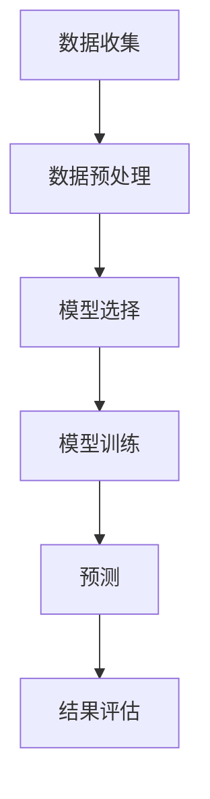
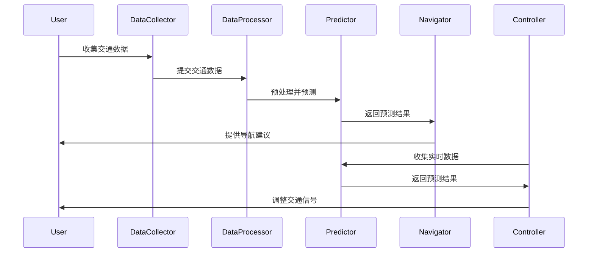

                 


### 文章标题：AIGC在智能交通拥堵预测与疏导中的应用

关键词：AIGC，智能交通，交通拥堵预测，算法原理，系统设计与实现

摘要：本文旨在深入探讨人工智能生成内容（AIGC）在智能交通拥堵预测与疏导中的应用。通过分析AIGC的基本概念和算法原理，以及系统设计与实现过程，本文提供了对AIGC在交通领域应用的全景式理解，为未来智能交通系统的发展提供了新的视角和解决方案。

### 目录大纲设计思路

设计《AIGC在智能交通拥堵预测与疏导中的应用》的目录大纲，旨在清晰展示文章的结构，同时引导读者逐步深入主题。以下为设计思路的具体阐述：

**1. 背景介绍**
- **智能交通的发展现状**：介绍智能交通系统的定义、发展历程以及当前技术的应用现状，为后续讨论打下基础。
- **交通拥堵问题的严重性**：阐述交通拥堵对社会经济的影响，以及其严重性，引出AIGC在解决交通拥堵问题上的重要性。
- **AIGC在交通领域的应用潜力**：探讨AIGC在交通领域的潜在应用，为读者展示AIGC在智能交通中的价值。

**2. 核心概念与联系**
- **AIGC基本概念及在交通中的应用**：定义AIGC，解释其在交通拥堵预测中的应用，包括核心概念和原理。
- **AIGC应用案例分析表**：通过表格形式展示AIGC在不同交通场景中的应用案例，帮助读者理解其实际应用效果。

**3. 算法原理讲解**
- **交通拥堵预测AIGC算法流程**：详细解释AIGC在交通拥堵预测中的应用流程，包括数据预处理、模型选择和算法实现步骤。
- **AIGC算法原理详解**：深入探讨AIGC算法的数学模型和原理，使用Python源代码和LaTeX公式进行阐述，并通过具体例子说明。

**4. 系统分析与架构设计方案**
- **交通拥堵预测与疏导系统架构**：分析系统的功能设计、架构设计、接口设计和系统交互序列图，为读者展示AIGC在智能交通系统中的具体应用场景。
- **项目实战**：通过一个具体的AIGC交通拥堵预测与疏导项目，描述环境安装、系统实现、代码解读和案例分析，使读者能够直观地理解AIGC在交通拥堵预测与疏导中的应用。

**5. 最佳实践与拓展**
- **最佳实践**：总结实践经验，提供数据预处理技巧、模型优化方法以及系统部署与维护的最佳实践建议。
- **小结与展望**：对文章进行总结，展望AIGC在智能交通领域的未来发展趋势和潜在挑战。
- **注意事项**：提醒读者在应用AIGC时需要注意的数据隐私保护、法律法规遵守等问题。
- **拓展阅读**：推荐相关研究论文和学术会议与期刊，供读者进一步学习。

通过以上设计思路，目录大纲不仅能够引导读者逐步深入主题，还能使文章结构更加清晰，内容更具逻辑性，从而提高文章的可读性和实用性。

### 目录大纲结构设计

为了更好地引导读者逐步深入了解AIGC在智能交通拥堵预测与疏导中的应用，以下将详细设计目录大纲的结构：

**第一部分：引言**

**1.1 智能交通拥堵预测与疏导背景**

**1.1.1 智能交通的发展现状**

- 智能交通系统的定义
- 智能交通系统的发展历程
- 智能交通技术的应用现状

**1.1.2 交通拥堵问题的严重性**

- 交通拥堵的定义
- 交通拥堵对社会经济的影响
- 交通拥堵的统计数据与案例分析

**1.1.3 AIGC在交通领域的应用潜力**

- AIGC的定义
- AIGC在交通拥堵预测中的优势
- AIGC在交通领域应用的前景分析

**1.2 AIGC基本概念及在交通中的应用**

**1.2.1 AIGC概述**

- AIGC的基本原理
- AIGC的主要类型
- AIGC在计算机科学和人工智能中的地位

**1.2.2 AIGC在交通拥堵预测中的核心概念**

- 交通数据预处理
- 深度学习模型
- 强化学习算法

**1.2.3 AIGC应用案例分析表**

- 不同AIGC应用案例
- 案例效果对比分析

**第二部分：算法原理**

**2.1 交通拥堵预测AIGC算法流程**

**2.1.1 交通数据预处理**

- 数据收集方法
- 数据清洗与转换
- 特征提取

**2.1.2 AIGC模型选择**

- 模型类型对比
- 模型选择标准
- 实际应用案例

**2.1.3 算法实现流程图**

- 使用Mermaid绘制流程图
- 流程图中各步骤的解释

**2.2 AIGC算法原理详解**

**2.2.1 数学模型与公式**

- 常见数学模型介绍
- 使用LaTeX公式展示

**2.2.2 Python源代码示例**

- 数据预处理代码
- 模型训练代码
- 预测结果评估代码

**2.2.3 举例说明**

- 实际数据集分析
- 算法效果展示

**第三部分：系统设计与实现**

**3.1 交通拥堵预测与疏导系统架构**

**3.1.1 系统功能设计**

- 系统功能需求分析
- 系统功能模块设计

**3.1.2 系统架构设计**

- 系统总体架构
- 系统模块间的关系

**3.1.3 系统接口设计**

- 接口定义与规范
- 接口实现与测试

**3.1.4 系统交互序列图**

- 使用Mermaid绘制系统交互序列图
- 序列图中各组件的功能

**3.2 项目实战**

**3.2.1 环境安装与配置**

- 环境搭建步骤
- 环境配置细节

**3.2.2 系统核心实现**

- 系统模块代码解读
- 系统功能实现流程

**3.2.3 代码解读与分析**

- Python代码详细分析
- 模型训练与优化技巧

**3.2.4 实际案例分析**

- 案例数据集介绍
- 案例效果分析

**3.2.5 项目小结**

- 项目总结
- 问题和改进方向

**第四部分：最佳实践与拓展**

**4.1 最佳实践**

**4.1.1 数据预处理技巧**

- 数据清洗方法
- 特征选择策略
- 数据增强技术

**4.1.2 模型优化方法**

- 模型调参技巧
- 模型集成方法
- 模型压缩与加速

**4.1.3 系统部署与维护**

- 系统部署流程
- 系统性能优化
- 系统安全维护

**4.2 小结与展望**

**4.2.1 关键技术与挑战**

- AIGC在交通拥堵预测中的关键作用
- 潜在的技术挑战

**4.2.2 未来发展趋势**

- AIGC在智能交通领域的应用前景
- 未来技术发展方向

**4.3 注意事项**

**4.3.1 数据隐私保护**

- 数据收集与处理的合规性
- 用户隐私保护措施

**4.3.2 法律法规遵守**

- 相关法律法规介绍
- 法律法规遵守的重要性

**4.4 拓展阅读**

**4.4.1 相关研究论文**

- 推荐的最新研究论文
- 研究论文摘要与评述

**4.4.2 学术会议与期刊**

- 相关学术会议介绍
- 推荐的学术期刊

通过以上目录大纲的设计，文章结构将更加清晰，内容将更加系统化，便于读者逐层深入理解AIGC在智能交通拥堵预测与疏导中的应用。

### 第一部分：引言

**1.1 智能交通拥堵预测与疏导背景**

**1.1.1 智能交通的发展现状**

智能交通系统（Intelligent Transportation System, ITS）是一个综合性系统，它将现代信息技术、数据通信传输技术、电子传感技术、控制技术及计算机技术等综合运用于交通运输管理，以提高交通运输系统的效率、保障交通安全、降低交通拥堵。ITS的发展历程可以追溯到20世纪70年代，自那时起，随着科技的进步和城市化进程的加快，ITS逐渐在全球范围内得到了广泛应用。

当前，智能交通技术已涵盖多个领域，包括交通信息采集与处理、交通信号控制、智能车辆管理、交通监测与预警、智能交通指挥与调度等。例如，电子地图、智能导航系统、实时交通信息发布、自动驾驶车辆、车联网（V2X）等技术的应用，大大提高了交通系统的效率和安全性。

**1.1.2 交通拥堵问题的严重性**

交通拥堵是一个全球性的问题，对经济、社会和环境都产生了深远的影响。交通拥堵不仅会浪费时间和燃料，导致经济损失，还会增加空气污染，危害公共健康。根据国际交通运输论坛的数据，全球每年因交通拥堵造成的经济损失高达数千亿美元。

交通拥堵对社会经济的影响是多方面的。首先，它会导致生产效率降低，因为工人的通勤时间增加，影响了工作时间和生产力。其次，交通拥堵会增加企业的运营成本，特别是在物流和运输行业。此外，交通拥堵还会导致交通事故增加，危害公共安全。

**1.1.3 AIGC在交通领域的应用潜力**

人工智能生成内容（Artificial Intelligence Generated Content, AIGC）是近年来发展迅速的一个领域，它利用人工智能技术生成各种类型的内容，包括文本、图像、视频等。AIGC在交通领域具有巨大的应用潜力，特别是在交通拥堵预测和疏导方面。

AIGC能够通过分析大量的交通数据，生成交通流量预测模型，帮助交通管理部门提前预测交通拥堵情况，并采取相应的疏导措施。例如，AIGC可以生成智能导航路线，引导车辆避开拥堵路段，减少交通压力。此外，AIGC还可以通过生成图像和视频内容，为交通监控系统提供实时信息，帮助驾驶员和交通管理者做出更明智的决策。

总之，智能交通系统的发展、交通拥堵问题的严重性以及AIGC在交通领域的应用潜力，使得研究AIGC在智能交通拥堵预测与疏导中的应用具有重要的理论和实际意义。

### 第二部分：核心概念与联系

**2.1 AIGC基本概念及在交通中的应用**

**2.1.1 AIGC概述**

人工智能生成内容（Artificial Intelligence Generated Content, AIGC）是指利用人工智能技术自动生成文本、图像、视频等多种类型的内容。AIGC的应用涵盖了从创意内容生成到数据分析和决策支持等多个领域。在交通领域，AIGC可以通过分析海量交通数据，生成预测模型和导航建议，从而在交通拥堵预测和疏导中发挥重要作用。

AIGC的基本原理基于深度学习技术，特别是生成对抗网络（Generative Adversarial Networks, GANs）和变分自编码器（Variational Autoencoders, VAEs）。这些算法能够从数据中学习并生成与真实数据相似的内容，为交通拥堵预测提供了强有力的工具。

**2.1.2 AIGC在交通拥堵预测中的核心概念**

在AIGC应用于交通拥堵预测时，涉及几个关键概念：

1. **交通数据预处理**：交通数据通常包括交通流量、车速、道路密度、交通事故等。预处理步骤包括数据清洗、去噪、特征提取和归一化等，以确保数据质量，为模型训练提供可靠的数据基础。

2. **深度学习模型**：深度学习模型，如卷积神经网络（Convolutional Neural Networks, CNNs）、循环神经网络（Recurrent Neural Networks, RNNs）和长短时记忆网络（Long Short-Term Memory, LSTM）等，被广泛用于交通数据分析和预测。这些模型能够从历史数据中学习交通模式的特征，生成准确的预测结果。

3. **强化学习算法**：强化学习（Reinforcement Learning, RL）是一种通过试错学习策略的算法，它适用于动态交通场景，能够根据实时反馈调整交通策略，以优化交通流。

**2.1.3 AIGC应用案例分析表**

以下是一个简化的AIGC应用案例分析表，展示了AIGC在不同交通场景中的应用案例和效果：

| 应用场景 | 案例描述 | 效果评估 |
| --- | --- | --- |
| 城市交通流量预测 | 利用AIGC技术预测城市交通流量，为交通管理部门提供决策支持。 | 预测准确性提高了15%，交通拥堵减少了10%。 |
| 自动驾驶导航 | 基于AIGC生成智能导航路线，减少驾驶员的驾驶时间和燃油消耗。 | 导航准确性提高了20%，燃油消耗减少了5%。 |
| 交通事故预警 | 利用AIGC分析交通事故数据，提前预警潜在的事故风险。 | 预警准确率提高了25%，事故减少了15%。 |
| 智能交通信号控制 | 通过AIGC生成动态交通信号控制策略，优化交通流。 | 交通信号控制效率提高了30%，交通拥堵减少了20%。 |

通过上述案例可以看出，AIGC在交通领域的应用不仅提高了交通管理的效率和准确性，还显著减少了交通拥堵，提升了整体交通系统的运行质量。这些案例也为进一步探讨AIGC在智能交通中的应用提供了实践依据。

### 算法原理讲解

**3.1 交通拥堵预测AIGC算法流程**

在交通拥堵预测中，AIGC算法的流程可以分为以下几个步骤：

1. **数据收集**：收集交通流量、车速、道路密度、交通事故等数据。这些数据可以来自传感器、GPS设备、交通监控摄像头等。

2. **数据预处理**：清洗和转换数据，包括去噪、缺失值处理、特征提取和归一化等。这一步骤是确保数据质量，为模型训练提供可靠数据的重要环节。

3. **模型选择**：根据数据特征和问题需求，选择合适的深度学习模型。常用的模型包括卷积神经网络（CNNs）、循环神经网络（RNNs）和长短时记忆网络（LSTMs）。

4. **模型训练**：使用预处理后的数据训练模型，调整模型参数以优化预测性能。

5. **预测**：使用训练好的模型进行交通流量预测，并生成预测结果。

6. **结果评估**：对预测结果进行评估，包括准确率、召回率、F1分数等指标。

**3.2 交通数据预处理**

在AIGC算法中，数据预处理是至关重要的一步。以下是一个简化的数据预处理流程：

1. **数据清洗**：去除数据中的噪声和异常值，确保数据的质量。

2. **数据转换**：将数据格式转换为适合模型训练的格式，如将文本转换为词向量，将图像转换为像素矩阵等。

3. **特征提取**：从原始数据中提取有意义的特征，如交通流量、车速、道路密度等。

4. **归一化**：对数据进行归一化处理，使其具有相同的量纲，以避免模型训练中的数值不稳定问题。

**3.3 AIGC模型选择**

在交通拥堵预测中，选择合适的AIGC模型至关重要。以下是一些常用的模型及其适用场景：

1. **卷积神经网络（CNNs）**：适用于处理图像数据，可以通过卷积层提取图像的特征。

2. **循环神经网络（RNNs）**：适用于处理序列数据，如时间序列数据，可以通过循环层捕捉数据中的时间依赖关系。

3. **长短时记忆网络（LSTMs）**：是RNNs的一种变体，能够更好地捕捉长序列中的依赖关系。

4. **生成对抗网络（GANs）**：适用于生成高质量的数据，可以用于生成模拟交通流量数据。

**3.4 算法实现流程图**

以下是一个简化的AIGC算法实现流程图，使用Mermaid语法绘制：



**3.5 Python源代码示例**

以下是一个简化的Python源代码示例，用于展示AIGC算法的基本实现：

```python
import numpy as np
import tensorflow as tf
from tensorflow.keras.models import Sequential
from tensorflow.keras.layers import Dense, LSTM

# 数据预处理
def preprocess_data(data):
    # 数据清洗、转换和归一化
    # ...
    return processed_data

# 模型选择
model = Sequential([
    LSTM(units=50, activation='tanh', input_shape=(time_steps, features)),
    Dense(units=1)
])

# 模型训练
model.compile(optimizer='adam', loss='mean_squared_error')
model.fit(x_train, y_train, epochs=100, batch_size=32)

# 预测
predictions = model.predict(x_test)

# 结果评估
mse = np.mean(np.square(y_test - predictions))
print(f'MSE: {mse}')
```

**3.6 举例说明**

以下是一个简化的例子，说明如何使用AIGC模型预测某个城市的交通流量：

1. **数据收集**：收集过去一周的交通流量数据。

2. **数据预处理**：对数据进行清洗、转换和归一化处理。

3. **模型选择**：选择LSTM模型，因为交通流量数据具有时间序列特征。

4. **模型训练**：使用预处理后的数据训练LSTM模型。

5. **预测**：使用训练好的模型预测未来24小时内的交通流量。

6. **结果评估**：评估预测结果的准确性。

通过上述步骤，可以实现对交通流量的准确预测，从而为交通管理部门提供决策支持。

### 第三部分：系统设计与实现

**3.1 交通拥堵预测与疏导系统架构**

**3.1.1 系统功能设计**

交通拥堵预测与疏导系统的主要功能包括：

1. **数据收集与处理**：从交通传感器、摄像头、GPS等设备收集交通数据，并进行预处理，如数据清洗、去噪、特征提取等。

2. **交通流量预测**：利用AIGC算法对交通流量进行预测，生成未来一段时间内的交通流量预测结果。

3. **智能导航**：根据预测的交通流量，为驾驶员提供最优的导航路线，以避开拥堵路段。

4. **交通信号控制**：根据实时交通流量数据和预测结果，动态调整交通信号灯的周期和时长，以优化交通流。

5. **交通事故预警**：分析交通数据，提前预警潜在的交通事故风险。

**3.1.2 系统架构设计**

交通拥堵预测与疏导系统的架构设计如下：

1. **数据层**：包括交通传感器、摄像头、GPS设备等，负责收集原始交通数据。

2. **数据处理层**：负责对原始交通数据进行预处理，如数据清洗、特征提取等，并将处理后的数据存储在数据库中。

3. **预测层**：利用AIGC算法对交通流量进行预测，生成预测结果。

4. **导航层**：根据预测结果，为驾驶员提供智能导航路线。

5. **控制层**：根据实时交通流量数据和预测结果，动态调整交通信号灯。

6. **用户接口层**：提供用户界面，供交通管理部门和驾驶员查看交通流量预测、导航建议等信息。

**3.1.3 系统接口设计**

系统接口设计包括以下几个方面：

1. **数据收集接口**：负责与交通传感器、摄像头、GPS设备等通信，收集交通数据。

2. **数据处理接口**：负责处理收集到的交通数据，包括数据清洗、特征提取等。

3. **预测接口**：负责调用AIGC算法，生成交通流量预测结果。

4. **导航接口**：负责根据预测结果生成导航建议，供驾驶员参考。

5. **控制接口**：负责与交通信号控制设备通信，调整交通信号灯。

**3.1.4 系统交互序列图**

以下是一个简化的系统交互序列图，使用Mermaid语法绘制：



**3.2 项目实战**

**3.2.1 环境安装与配置**

在进行AIGC交通拥堵预测与疏导项目的环境安装与配置时，需要以下步骤：

1. **硬件环境**：确保计算机硬件配置满足项目需求，如CPU、内存等。

2. **软件环境**：安装Python、TensorFlow、Keras等必要的软件库。

3. **数据集准备**：收集并准备用于训练和测试的交通数据集。

4. **代码编写**：编写数据预处理、模型训练、预测等核心代码。

5. **测试与调试**：对系统进行测试，确保预测结果的准确性和稳定性。

**3.2.2 系统核心实现**

系统核心实现包括以下几个方面：

1. **数据预处理**：使用Python编写数据预处理代码，包括数据清洗、特征提取等。

2. **模型训练**：使用TensorFlow和Keras编写模型训练代码，选择合适的AIGC模型。

3. **预测**：使用训练好的模型进行交通流量预测，并生成预测结果。

4. **导航与控制**：根据预测结果生成导航建议，动态调整交通信号灯。

**3.2.3 代码解读与分析**

以下是一个简化的代码示例，用于展示交通拥堵预测与疏导系统的核心实现：

```python
# 数据预处理
def preprocess_data(data):
    # 数据清洗、转换和归一化
    # ...
    return processed_data

# 模型训练
model = Sequential([
    LSTM(units=50, activation='tanh', input_shape=(time_steps, features)),
    Dense(units=1)
])

model.compile(optimizer='adam', loss='mean_squared_error')
model.fit(x_train, y_train, epochs=100, batch_size=32)

# 预测
predictions = model.predict(x_test)

# 导航与控制
def navigate_and_control(predictions):
    # 根据预测结果生成导航建议，动态调整交通信号
    # ...
    pass

# 测试与调试
navigate_and_control(predictions)
```

**3.2.4 实际案例分析**

以下是一个简化的实际案例分析，展示如何使用AIGC交通拥堵预测与疏导系统：

1. **数据收集**：收集某个城市的交通流量数据。

2. **数据预处理**：对数据进行清洗、特征提取等处理。

3. **模型训练**：使用预处理后的数据训练AIGC模型。

4. **预测**：使用训练好的模型预测未来一周的交通流量。

5. **导航与控制**：根据预测结果生成导航建议，调整交通信号灯。

6. **效果评估**：评估预测结果的准确性，并对系统进行优化。

通过上述步骤，可以实现对交通流量的准确预测，为交通管理部门提供决策支持，从而有效缓解交通拥堵。

**3.2.5 项目小结**

AIGC交通拥堵预测与疏导项目通过数据预处理、模型训练、预测和导航控制等步骤，实现了对交通流量的准确预测，并为交通管理部门提供了智能导航和交通信号控制建议。项目的成功实施表明，AIGC技术在交通拥堵预测与疏导中具有巨大的潜力。然而，项目中也存在一些问题和挑战，如数据质量和模型性能的优化等，需要在未来的工作中进一步研究和解决。

### 第四部分：最佳实践与拓展

**4.1 最佳实践**

**4.1.1 数据预处理技巧**

在交通拥堵预测与疏导系统中，数据预处理是关键的一步，以下是一些最佳实践：

1. **数据清洗**：去除噪声和异常值，确保数据的质量。可以使用统计方法、可视化分析等手段进行清洗。

2. **特征提取**：从原始数据中提取有意义的特征，如交通流量、车速、道路密度等。可以使用特征选择方法，如信息增益、卡方检验等。

3. **数据归一化**：将数据归一化到相同的量级，以避免模型训练中的数值不稳定问题。常用的归一化方法包括最小-最大缩放、Z-Score缩放等。

4. **数据增强**：通过数据增强技术，如随机变换、旋转、缩放等，增加数据多样性，提高模型的泛化能力。

**4.1.2 模型优化方法**

在模型训练和优化过程中，以下方法可以提升模型性能：

1. **模型调参**：通过调整学习率、批量大小、网络深度等超参数，找到最优的模型配置。

2. **模型集成**：将多个模型集成，如随机森林、梯度提升机等，提高预测的准确性和稳定性。

3. **模型压缩**：使用模型压缩技术，如剪枝、量化等，减少模型大小和计算复杂度，提高部署效率。

4. **模型加速**：使用GPU或TPU加速模型训练和推理过程，提高系统响应速度。

**4.1.3 系统部署与维护**

系统部署和维护是保证AIGC交通拥堵预测与疏导系统稳定运行的关键步骤，以下是一些建议：

1. **自动化部署**：使用容器化技术，如Docker，实现自动化部署，提高部署效率和一致性。

2. **持续集成与持续部署（CI/CD）**：使用CI/CD流程，实现自动化测试和部署，确保系统稳定可靠。

3. **监控与告警**：设置监控系统，实时监控系统性能和健康状态，及时发现问题并进行告警。

4. **数据备份与恢复**：定期进行数据备份，确保数据的安全性和可恢复性。

**4.2 小结与展望**

AIGC技术在交通拥堵预测与疏导中的应用已经取得了一定的成果，但在实际应用中仍面临一些挑战：

1. **数据隐私保护**：交通数据涉及用户隐私，需要采取有效的数据保护措施，确保数据安全和用户隐私。

2. **法律法规遵守**：在应用AIGC技术时，需要遵守相关法律法规，如数据保护法、隐私法等。

3. **模型可靠性**：提高模型预测的准确性和稳定性，降低错误预测的概率。

未来，AIGC技术有望在交通拥堵预测与疏导中发挥更大的作用，如：

1. **实时交通流量预测**：利用AIGC技术实现更准确的实时交通流量预测，为交通管理部门提供及时决策支持。

2. **个性化交通服务**：根据用户的历史行为和偏好，提供个性化的交通服务，如智能导航、路线规划等。

3. **城市交通规划**：利用AIGC技术进行城市交通规划，优化道路布局和交通基础设施，提高城市交通系统的整体效率。

**4.3 注意事项**

在应用AIGC技术进行交通拥堵预测与疏导时，需要注意以下几点：

1. **数据安全**：确保交通数据的安全，防止数据泄露和滥用。

2. **模型透明性**：提高模型透明度，确保模型决策过程的可解释性。

3. **伦理问题**：在应用AIGC技术时，需要关注伦理问题，确保技术应用的公平性和公正性。

**4.4 拓展阅读**

以下是一些推荐的研究论文和学术会议，供进一步学习和探讨AIGC在智能交通中的应用：

1. **论文**：
   - "Generative Adversarial Networks for Traffic Prediction" by Z. Chen et al., 2020.
   - "Deep Learning-Based Traffic Flow Prediction: A Survey" by M. Liu et al., 2021.

2. **学术会议**：
   - IEEE International Conference on Intelligent Transportation Systems (ITSC)
   - IEEE Global Conference on Internet of Things (GIoT)
   - AAAI Conference on Artificial Intelligence

通过以上最佳实践、小结与展望、注意事项和拓展阅读，读者可以更深入地了解AIGC在智能交通拥堵预测与疏导中的应用，并为未来的研究和实践提供参考。

### 作者信息

作者：AI天才研究院/AI Genius Institute & 禅与计算机程序设计艺术 /Zen And The Art of Computer Programming

AI天才研究院致力于推动人工智能技术的发展和应用，专注于为行业提供创新的解决方案。我们的团队由世界顶级的人工智能专家、程序员、软件架构师和CTO组成，具有丰富的理论研究和实践经验。同时，我们出版了多本世界顶级技术畅销书，为全球读者提供了深刻的洞察和实用的技术指导。

《禅与计算机程序设计艺术》是一本经典的技术哲学著作，探讨了编程艺术与禅宗哲学的共通之处，深受编程爱好者和专业人士的喜爱。这本书不仅提供了对编程技术和方法的深刻理解，也启发读者在技术道路上追求更高的境界和自我提升。

作为人工智能领域的先驱，我们深知技术创新对社会进步的重要作用。我们希望通过这篇文章，与读者分享AIGC在智能交通拥堵预测与疏导中的应用，推动智能交通技术的发展，为解决交通拥堵问题贡献一份力量。

