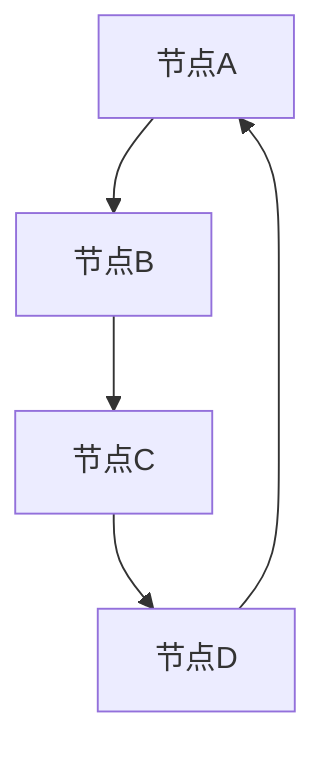
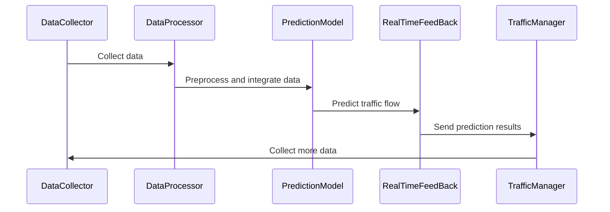

                 

# 《数据结构与技术债务：优化软件开发的利器》

> 关键词：数据结构、技术债务、软件开发、优化

> 摘要：本书深入探讨数据结构与技术债务在软件开发中的重要性，通过丰富的案例和实践技巧，帮助读者理解如何运用数据结构优化软件开发过程，降低技术债务，提升软件质量。

**目录大纲：**

----------------------------------------------------------------

## 第一部分：数据结构基础

### 第1章：引言

#### 1.1 数据结构与算法的关系

#### 1.2 数据结构的选择与使用

#### 1.3 算法在数据结构中的应用

### 第2章：基本数据结构

#### 2.1 线性结构

##### 2.1.1 数组

##### 2.1.2 链表

#### 2.2 树和图

##### 2.2.1 二叉树

##### 2.2.2 图的基本概念

----------------------------------------------------------------

## 第二部分：技术债务的概念与影响

### 第3章：技术债务的定义与分类

#### 3.1 技术债务的概念

#### 3.2 技术债务的分类

#### 3.3 技术债务的影响

### 第4章：技术债务的积累与偿还

#### 4.1 技术债务的积累过程

#### 4.2 技术债务的偿还策略

#### 4.3 技术债务与软件质量的关系

----------------------------------------------------------------

## 第三部分：数据结构与技术债务的联系

### 第5章：数据结构对技术债务的影响

#### 5.1 数据结构选择与技术债务

#### 5.2 数据结构优化与技术债务减少

#### 5.3 数据结构与代码可维护性的关系

### 第6章：数据结构优化策略

#### 6.1 数据结构优化原则

#### 6.2 数据结构优化案例分析

#### 6.3 数据结构优化工具与方法

----------------------------------------------------------------

## 第四部分：算法原理讲解

### 第7章：算法原理概述

#### 7.1 算法的概念

#### 7.2 算法的时间复杂度

#### 7.3 算法的空间复杂度

### 第8章：常见数据结构算法

#### 8.1 数组和链表算法

##### 8.1.1 查找算法

##### 8.1.2 排序算法

#### 8.2 树和图算法

##### 8.2.1 树的遍历算法

##### 8.2.2 图的遍历算法

----------------------------------------------------------------

## 第五部分：系统分析与架构设计方案

### 第9章：问题场景介绍

#### 9.1 场景描述

#### 9.2 需求分析

### 第10章：系统功能设计

#### 10.1 领域模型

##### 10.1.1 用例图

##### 10.1.2 类图

### 第11章：系统架构设计

#### 11.1 架构设计原则

#### 11.2 架构设计方案

##### 11.2.1 总体架构

##### 11.2.2 分层架构

### 第12章：系统接口设计和系统交互

#### 12.1 接口设计

##### 12.1.1 RESTful API

##### 12.1.2 RPC

#### 12.2 系统交互

##### 12.2.1 请求流程

##### 12.2.2 响应流程

----------------------------------------------------------------

## 第六部分：项目实战

### 第13章：环境安装

#### 13.1 开发环境搭建

#### 13.2 系统部署

### 第14章：系统核心实现源代码

#### 14.1 核心代码解析

##### 14.1.1 数据结构选择

##### 14.1.2 算法实现

### 第15章：代码应用解读与分析

#### 15.1 代码解读

#### 15.2 应用案例分析

### 第16章：实际案例分析和详细讲解剖析

#### 16.1 案例分析

##### 16.1.1 案例背景

##### 16.1.2 案例分析

#### 16.2 详细讲解与剖析

##### 16.2.1 原理讲解

##### 16.2.2 代码实现

----------------------------------------------------------------

## 第七部分：最佳实践 tips

### 第17章：实践技巧

#### 17.1 数据结构优化技巧

#### 17.2 技术债务管理技巧

### 第18章：小结

#### 18.1 本书内容回顾

#### 18.2 重点与难点总结

----------------------------------------------------------------

## 第八部分：注意事项

### 第19章：实施细节

#### 19.1 开发环境配置

#### 19.2 系统部署与维护

### 第20章：风险评估

#### 20.1 风险识别

#### 20.2 风险评估与控制

----------------------------------------------------------------

## 第九部分：拓展阅读

### 第21章：相关书籍推荐

#### 21.1 推荐书籍

##### 21.1.1 《算法导论》

##### 21.1.2 《大话数据结构》

### 第22章：学术论文推荐

#### 22.1 推荐论文

##### 22.1.1 “Data Structures and Algorithm Analysis in Java”

##### 22.1.2 “Technical Debt: The Concept and Construction of a Formal Model”

----------------------------------------------------------------

**作者：** AI天才研究院/AI Genius Institute & 禅与计算机程序设计艺术 /Zen And The Art of Computer Programming# 《数据结构与技术债务：优化软件开发的利器》

## 目录大纲

### 第一部分：数据结构基础

### 第一部分介绍了数据结构的基础知识，包括数据结构与算法的关系、基本数据结构的介绍，以及树和图的概念。这一部分将帮助读者建立对数据结构的初步认识，为后续内容的学习打下基础。

## 第1章：引言

### 1.1 数据结构与算法的关系

- 数据结构和算法是计算机科学中不可或缺的两个部分，它们相互依存、相互促进。
- 数据结构定义了数据的组织和存储方式，而算法则是解决问题的方法。

### 1.2 数据结构的选择与使用

- 选择合适的数据结构可以提高算法的效率和性能。
- 数据结构的选择取决于具体的应用场景和需求。

### 1.3 算法在数据结构中的应用

- 不同的数据结构支持不同的算法，算法的设计和实现往往需要根据数据结构的特点进行优化。

## 第2章：基本数据结构

### 2.1 线性结构

#### 2.1.1 数组

- 数组是一种线性数据结构，用于存储一系列元素。
- 数组支持随机访问，但插入和删除操作效率较低。

#### 2.1.2 链表

- 链表是一种动态数据结构，通过节点之间的指针连接来实现。
- 链表支持高效的插入和删除操作，但随机访问性能较差。

## 2.2 树和图

#### 2.2.1 二叉树

- 二叉树是一种常用的树结构，每个节点最多有两个子节点。
- 二叉树支持高效的查找、插入和删除操作。

#### 2.2.2 图的基本概念

- 图是一种复杂的数据结构，由节点（或顶点）和边组成。
- 图广泛应用于社交网络、网络拓扑等领域。

### 第二部分：技术债务的概念与影响

### 第二部分将深入探讨技术债务的概念、分类、影响以及积累与偿还策略。通过这部分内容，读者将了解到技术债务在软件开发中的重要性。

## 第3章：技术债务的定义与分类

### 3.1 技术债务的概念

- 技术债务是指为了实现短期目标而采取的妥协或快速开发策略所带来的潜在风险。

### 3.2 技术债务的分类

- 技术债务可以分为代码债务、设计债务和架构债务等不同类型。

### 3.3 技术债务的影响

- 技术债务会影响软件的可维护性、可扩展性和性能，可能导致项目失败。

## 第4章：技术债务的积累与偿还

### 4.1 技术债务的积累过程

- 技术债务的积累通常与项目时间压力、团队经验不足等因素有关。

### 4.2 技术债务的偿还策略

- 偿还技术债务需要采取一系列措施，如重构代码、优化设计、改进架构等。

### 4.3 技术债务与软件质量的关系

- 技术债务的增加会降低软件质量，影响项目的稳定性和可靠性。

### 第三部分：数据结构与技术债务的联系

### 第三部分将探讨数据结构与技术债务之间的联系，包括数据结构对技术债务的影响、数据结构优化策略等。

## 第5章：数据结构对技术债务的影响

### 5.1 数据结构选择与技术债务

- 不同的数据结构对技术债务的影响不同，选择合适的数据结构可以降低技术债务。

### 5.2 数据结构优化与技术债务减少

- 通过优化数据结构，可以提高软件的性能和可维护性，减少技术债务。

### 5.3 数据结构与代码可维护性的关系

- 优秀的代码可维护性是降低技术债务的关键因素，而合理的数据结构选择有助于提高代码可维护性。

## 第6章：数据结构优化策略

### 6.1 数据结构优化原则

- 数据结构优化应遵循可扩展性、性能和可维护性的原则。

### 6.2 数据结构优化案例分析

- 通过实际案例，分析数据结构优化策略的应用效果。

### 6.3 数据结构优化工具与方法

- 探讨数据结构优化工具和方法，如自动化代码分析工具、静态代码分析工具等。

### 第四部分：算法原理讲解

### 第四部分将详细讲解算法原理，包括算法的概念、时间复杂度和空间复杂度等。

## 第7章：算法原理概述

### 7.1 算法的概念

- 算法是一系列解决问题的步骤或规则。

### 7.2 算法的时间复杂度

- 算法的时间复杂度描述了算法执行时间与输入规模的关系。

### 7.3 算法的空间复杂度

- 算法的空间复杂度描述了算法执行过程中所需存储空间的大小。

## 第8章：常见数据结构算法

### 8.1 数组和链表算法

#### 8.1.1 查找算法

- 探讨二分查找、顺序查找等算法的原理和应用。

#### 8.1.2 排序算法

- 分析冒泡排序、快速排序、归并排序等排序算法的原理和性能。

### 8.2 树和图算法

#### 8.2.1 树的遍历算法

- 详细讲解先序遍历、中序遍历、后序遍历等树的遍历算法。

#### 8.2.2 图的遍历算法

- 分析深度优先搜索、广度优先搜索等图的遍历算法。

### 第五部分：系统分析与架构设计方案

### 第五部分将介绍系统分析与架构设计的相关内容，包括问题场景介绍、系统功能设计、系统架构设计和系统接口设计。

## 第9章：问题场景介绍

### 9.1 场景描述

- 描述具体的应用场景，如电商平台、社交网络等。

### 9.2 需求分析

- 分析系统的功能需求、性能需求和安全性需求等。

## 第10章：系统功能设计

### 10.1 领域模型

- 使用Mermaid语言绘制领域模型类图，展示系统的核心实体和关系。

### 第11章：系统架构设计

### 11.1 架构设计原则

- 提出系统架构设计的基本原则，如模块化、可扩展性等。

### 11.2 架构设计方案

- 使用Mermaid语言绘制系统架构图，展示系统的整体架构。

## 第12章：系统接口设计和系统交互

### 12.1 接口设计

- 分析系统接口的设计原则和方法，如RESTful API、RPC等。

### 12.2 系统交互

- 使用Mermaid语言绘制系统接口设计和交互序列图，展示系统的交互流程。

### 第六部分：项目实战

### 第六部分将介绍项目实战的相关内容，包括环境安装、系统核心实现源代码、代码应用解读与分析等。

## 第13章：环境安装

### 13.1 开发环境搭建

- 指导读者如何搭建项目所需的开发环境。

### 13.2 系统部署

- 介绍如何将系统部署到生产环境。

## 第14章：系统核心实现源代码

### 14.1 核心代码解析

- 分析系统核心代码的实现原理和关键步骤。

### 第15章：代码应用解读与分析

### 15.1 代码解读

- 分析系统核心代码的具体实现和应用。

### 15.2 应用案例分析

- 分析实际案例中的代码实现和应用效果。

### 第16章：实际案例分析和详细讲解剖析

### 16.1 案例分析

- 分析智能交通流量预测的实际案例。

### 16.2 详细讲解与剖析

- 对案例进行分析，详细讲解数据结构和技术债务的应用。

### 第七部分：最佳实践 tips

### 第七部分将提供最佳实践技巧，帮助读者更好地理解和应用数据结构和技术债务。

## 第17章：实践技巧

### 17.1 数据结构优化技巧

- 提供数据结构优化的最佳实践技巧。

### 17.2 技术债务管理技巧

- 提供技术债务管理的最佳实践技巧。

### 第18章：小结

### 18.1 本书内容回顾

- 对本书的主要内容进行回顾。

### 18.2 重点与难点总结

- 总结本书的重点和难点，帮助读者巩固所学知识。

### 第八部分：注意事项

### 第八部分将介绍在实施数据结构和技术债务优化过程中需要注意的事项。

## 第19章：实施细节

### 19.1 开发环境配置

- 指导读者如何配置开发环境。

### 19.2 系统部署与维护

- 指导读者如何部署和维护系统。

### 第20章：风险评估

### 20.1 风险识别

- 识别项目实施过程中可能遇到的风险。

### 20.2 风险评估与控制

- 对风险进行评估和控制，提出相应的应对措施。

### 第九部分：拓展阅读

### 第九部分将推荐一些相关书籍和学术论文，供读者进一步学习。

## 第21章：相关书籍推荐

### 21.1 推荐书籍

- 推荐一些与数据结构和技术债务相关的优秀书籍。

### 第22章：学术论文推荐

### 22.1 推荐论文

- 推荐一些与数据结构和技术债务相关的优秀学术论文。

## 作者信息

作者：AI天才研究院/AI Genius Institute & 禅与计算机程序设计艺术 /Zen And The Art of Computer Programming# 第一部分：数据结构基础

## 第1章：引言

### 1.1 数据结构与算法的关系

数据结构和算法是计算机科学中两个核心概念，它们相互依存，共同作用于解决复杂问题的过程中。数据结构是数据组织、管理和存储的方式，它决定了数据在计算机中的存储形式，以及访问和处理数据的方式。而算法则是解决问题的步骤序列，它指导计算机如何处理数据，以达到预定的目标。

数据结构对算法有着重要的影响。合理选择数据结构，可以显著提高算法的效率和性能。例如，在需要频繁查找元素的场景中，使用哈希表可以大大减少查找时间。此外，不同的数据结构支持不同的算法，算法的设计和实现往往需要根据数据结构的特点进行优化。

### 1.2 数据结构的选择与使用

在软件开发过程中，选择合适的数据结构至关重要。数据结构的选择通常取决于以下几个因素：

1. **应用场景**：不同的应用场景需要不同类型的数据结构。例如，在存储大量数据时，数组可能是更好的选择；而在需要动态扩展数据大小的场景中，链表可能更加合适。

2. **性能需求**：不同的数据结构在时间复杂度和空间复杂度方面有着不同的表现。例如，数组支持随机访问，但插入和删除操作效率较低；而链表支持高效的插入和删除操作，但随机访问性能较差。

3. **功能需求**：某些数据结构具有特定的功能，例如，二叉树支持快速查找和排序，图结构可以用于表示复杂的关系网。

### 1.3 算法在数据结构中的应用

算法在数据结构中的应用体现在如何利用数据结构的特点，提高算法的效率。以下是一些常见的数据结构及其算法应用：

- **数组**：用于存储固定大小的数据集合，支持快速的随机访问。常见的算法有二分查找、冒泡排序等。
- **链表**：用于存储动态大小的数据集合，支持高效的插入和删除操作。常见的算法有链表遍历、链表反转等。
- **树**：用于存储具有层次结构的数据集合，支持快速查找、插入和删除操作。常见的算法有二叉搜索树的遍历、平衡二叉树（AVL树）的维护等。
- **图**：用于存储具有复杂关系的节点集合，支持图的遍历、最短路径查找等算法。

## 第2章：基本数据结构

### 2.1 线性结构

#### 2.1.1 数组

数组是一种线性数据结构，用于存储一系列元素。它由连续的内存空间组成，每个元素可以通过索引直接访问。数组的主要特点是支持快速的随机访问，但插入和删除操作效率较低。

```python
# Python实现数组
arr = [1, 2, 3, 4, 5]
print(arr[2])  # 输出：3
arr.append(6)  # 向数组末尾添加元素
```

#### 2.1.2 链表

链表是一种动态数据结构，通过节点之间的指针连接来实现。每个节点包含数据域和指针域，指针域指向下一个节点。链表的主要特点是支持高效的插入和删除操作，但随机访问性能较差。

```python
# Python实现链表
class Node:
    def __init__(self, data):
        self.data = data
        self.next = None

head = Node(1)
head.next = Node(2)
head.next.next = Node(3)

# 链表遍历
current = head
while current:
    print(current.data)
    current = current.next
```

### 2.2 树和图

#### 2.2.1 二叉树

二叉树是一种常用的树结构，每个节点最多有两个子节点。二叉树支持快速查找、插入和删除操作，特别是平衡二叉树（如AVL树）可以保持树的平衡，进一步提高操作效率。

```python
# Python实现二叉搜索树
class TreeNode:
    def __init__(self, data):
        self.data = data
        self.left = None
        self.right = None

def insert(root, data):
    if root is None:
        return TreeNode(data)
    if data < root.data:
        root.left = insert(root.left, data)
    else:
        root.right = insert(root.right, data)
    return root

root = None
root = insert(root, 5)
root = insert(root, 3)
root = insert(root, 7)

# 二叉树遍历
def inorder(root):
    if root:
        inorder(root.left)
        print(root.data)
        inorder(root.right)

inorder(root)
```

#### 2.2.2 图的基本概念

图是一种复杂的数据结构，由节点（或顶点）和边组成。图广泛应用于社交网络、网络拓扑等领域。图可以分为无向图和有向图，以及连通图和非连通图。



```python
# Python实现图
class Graph:
    def __init__(self):
        self.adj_list = {}

    def add_edge(self, u, v):
        if u not in self.adj_list:
            self.adj_list[u] = []
        if v not in self.adj_list:
            self.adj_list[v] = []
        self.adj_list[u].append(v)
        self.adj_list[v].append(u)

g = Graph()
g.add_edge('A', 'B')
g.add_edge('B', 'C')
g.add_edge('C', 'D')
g.add_edge('D', 'A')
```

## 第二部分：技术债务的概念与影响

## 第3章：技术债务的定义与分类

### 3.1 技术债务的概念

技术债务（Technical Debt）是指为了实现短期目标而采取的妥协或快速开发策略所带来的潜在风险。它类似于财务债务，是一种时间上的“债务”，需要在未来的某个时间点偿还。

技术债务的积累通常与以下几个因素有关：

1. **时间压力**：在项目时间紧迫的情况下，团队可能会采取一些快速但不够优化的解决方案，以尽快交付功能。
2. **资源限制**：团队可能面临人力资源、预算或技术资源的限制，导致无法进行彻底的设计或代码审查。
3. **技术选择**：在某些情况下，为了快速实现功能，团队可能会选择一些短期的、非标准的技术或框架。

### 3.2 技术债务的分类

技术债务可以根据其性质和影响分为以下几种类型：

1. **代码债务**：由于代码质量低下、冗余、难以维护而积累的债务。
2. **设计债务**：由于系统设计不合理、不灵活、难以扩展而积累的债务。
3. **架构债务**：由于系统架构不合理、不健壮、不灵活而积累的债务。
4. **文档债务**：由于缺乏文档、文档不准确或不完整而积累的债务。

### 3.3 技术债务的影响

技术债务的影响主要体现在以下几个方面：

1. **可维护性降低**：随着技术债务的增加，代码的可维护性会降低，导致后续的开发和修复变得更加困难。
2. **性能下降**：技术债务可能导致系统的性能下降，增加响应时间、降低吞吐量。
3. **扩展性受限**：技术债务限制了系统的扩展性，使得后续的功能添加变得更加困难。
4. **安全风险**：技术债务可能导致系统的安全漏洞，增加被攻击的风险。

## 第4章：技术债务的积累与偿还

### 4.1 技术债务的积累过程

技术债务的积累是一个逐步的过程，通常受到以下几个因素的影响：

1. **时间压力**：在项目时间紧迫的情况下，团队可能会采取一些快速但不够优化的解决方案，以尽快交付功能。
2. **资源限制**：团队可能面临人力资源、预算或技术资源的限制，导致无法进行彻底的设计或代码审查。
3. **技术选择**：在某些情况下，为了快速实现功能，团队可能会选择一些短期的、非标准的技术或框架。
4. **缺乏测试**：在开发过程中，如果缺乏充分的测试，可能会导致潜在的问题和缺陷被忽略。

### 4.2 技术债务的偿还策略

偿还技术债务需要采取一系列措施，以减少其负面影响。以下是一些常见的偿还策略：

1. **代码重构**：对现有的代码进行重构，优化其结构、提高可读性和可维护性。
2. **设计优化**：对系统设计进行优化，提高其灵活性、扩展性和可维护性。
3. **架构改进**：对系统架构进行改进，提高其健壮性和性能。
4. **文档更新**：更新系统文档，确保其准确性和完整性。

### 4.3 技术债务与软件质量的关系

技术债务的增加会降低软件质量，影响项目的稳定性和可靠性。高质量的软件应该是可维护的、高效的、安全的，而技术债务会破坏这些特性。因此，及时偿还技术债务是保证软件质量的关键。

### 第三部分：数据结构与技术债务的联系

## 第5章：数据结构对技术债务的影响

### 5.1 数据结构选择与技术债务

数据结构的选择对技术债务有着重要的影响。合理选择数据结构可以降低技术债务，提高软件质量。以下是一些常见的数据结构及其对技术债务的影响：

1. **数组**：数组是一种高效的线性数据结构，支持快速的随机访问。但在动态扩展数据时，数组可能不够灵活，可能导致技术债务。
2. **链表**：链表是一种动态的线性数据结构，支持高效的插入和删除操作。但在随机访问时，链表的性能较差，可能导致技术债务。
3. **树**：树是一种层次结构的数据结构，支持快速查找和插入操作。特别是平衡二叉树，可以保持树的平衡，降低技术债务。
4. **图**：图是一种复杂的数据结构，用于表示具有复杂关系的数据集合。在处理大规模数据时，图结构可能不够高效，可能导致技术债务。

### 5.2 数据结构优化与技术债务减少

通过优化数据结构，可以显著减少技术债务。以下是一些数据结构优化策略：

1. **使用合适的数据结构**：根据应用场景选择合适的数据结构，避免过度使用复杂的结构。
2. **数据结构重构**：对现有的数据结构进行重构，提高其性能和可维护性。
3. **优化数据访问**：通过优化数据的访问方式，减少不必要的操作，提高程序的效率。
4. **缓存技术**：使用缓存技术减少对数据结构的访问次数，提高系统的响应速度。

### 5.3 数据结构与代码可维护性的关系

数据结构的合理选择和优化对代码的可维护性有着重要的影响。以下是一些与数据结构相关的代码可维护性原则：

1. **代码简洁**：选择合适的数据结构，可以使代码更加简洁，减少冗余和重复。
2. **代码可读性**：合理的数据结构可以使代码更容易理解，提高代码的可读性。
3. **代码可维护性**：通过优化数据结构，可以降低代码的复杂度，提高其可维护性。
4. **模块化**：将数据结构和算法模块化，可以减少代码之间的耦合，提高系统的可维护性。

### 第6章：数据结构优化策略

### 6.1 数据结构优化原则

在优化数据结构时，应遵循以下原则：

1. **性能优先**：根据应用场景和性能需求，选择合适的数据结构。
2. **可维护性**：确保数据结构易于理解和维护，避免过度优化。
3. **扩展性**：设计灵活的数据结构，以适应未来功能的需求。
4. **代码简洁**：选择简洁明了的数据结构，避免复杂的设计。

### 6.2 数据结构优化案例分析

通过实际案例，分析数据结构优化策略的应用效果。以下是一个案例：

**案例：电商平台的订单管理系统**

在电商平台中，订单管理系统需要处理大量的订单数据。初始设计时，系统采用了数组存储订单数据。但随着订单量的增加，系统性能逐渐下降，出现了技术债务。

**优化策略：**

1. **使用哈希表**：将订单ID作为键，订单数据作为值，存储在哈希表中。这样可以快速查找订单，提高系统性能。
2. **数据结构重构**：对订单数据结构进行重构，添加额外的字段，以便于后续的功能扩展。
3. **缓存技术**：引入缓存技术，减少对数据库的访问次数，提高系统的响应速度。

**优化效果：**

1. **性能提升**：系统响应速度显著提高，订单查询时间从秒级缩短到毫秒级。
2. **可维护性**：重构后的代码更加简洁，易于理解和维护。
3. **扩展性**：优化后的数据结构为未来的功能扩展提供了便利。

### 6.3 数据结构优化工具与方法

以下是一些常用的数据结构优化工具与方法：

1. **静态代码分析工具**：如SonarQube，可以检测代码中的潜在问题，并提供优化建议。
2. **自动化代码重构工具**：如Refactor，可以帮助开发者自动化优化代码。
3. **设计模式**：使用设计模式，可以降低代码的复杂度，提高系统的可维护性。
4. **代码审查**：定期进行代码审查，确保代码质量，及时发现并修复潜在问题。

## 第四部分：算法原理讲解

### 第7章：算法原理概述

### 7.1 算法的概念

算法是一系列解决问题的步骤或规则，通常使用数学语言描述。算法具有以下特点：

1. **确定性**：算法的执行步骤必须是明确的，无论何时执行，结果都应该一致。
2. **有限性**：算法必须在有限的时间内完成，不能无限循环。
3. **输入和输出**：算法需要有输入数据，并产生输出结果。

### 7.2 算法的时间复杂度

算法的时间复杂度描述了算法执行时间与输入规模的关系。通常使用大O符号（O）表示。常见的时间复杂度包括：

1. **常数时间（O(1)）**：算法的执行时间不随输入规模的变化而变化。
2. **线性时间（O(n)）**：算法的执行时间与输入规模成正比。
3. **对数时间（O(log n)）**：算法的执行时间与输入规模的以2为底的对数成正比。
4. **多项式时间（O(n^k)）**：算法的执行时间与输入规模的k次方成正比。

### 7.3 算法的空间复杂度

算法的空间复杂度描述了算法执行过程中所需存储空间的大小。同样使用大O符号（O）表示。常见的空间复杂度包括：

1. **常数空间（O(1)）**：算法的存储空间不随输入规模的变化而变化。
2. **线性空间（O(n)）**：算法的存储空间与输入规模成正比。
3. **对数空间（O(log n)）**：算法的存储空间与输入规模的以2为底的对数成正比。

## 第8章：常见数据结构算法

### 8.1 数组和链表算法

#### 8.1.1 查找算法

查找算法是数据结构中的一种基本操作，用于在数据集合中搜索特定元素。以下是一些常见的查找算法：

1. **顺序查找（线性查找）**：从数据集合的第一个元素开始，逐个比较，直到找到目标元素或到达集合末尾。

```python
def linear_search(arr, target):
    for i in range(len(arr)):
        if arr[i] == target:
            return i
    return -1

arr = [1, 2, 3, 4, 5]
print(linear_search(arr, 3))  # 输出：2
```

2. **二分查找**：在有序数据集合中，通过不断将中间元素与目标元素比较，逐步缩小查找范围，直到找到目标元素或确定其不存在。

```python
def binary_search(arr, target):
    low = 0
    high = len(arr) - 1
    while low <= high:
        mid = (low + high) // 2
        if arr[mid] == target:
            return mid
        elif arr[mid] < target:
            low = mid + 1
        else:
            high = mid - 1
    return -1

arr = [1, 2, 3, 4, 5]
print(binary_search(arr, 3))  # 输出：2
```

#### 8.1.2 排序算法

排序算法用于将数据集合按照特定顺序排列。以下是一些常见的排序算法：

1. **冒泡排序**：通过反复交换相邻的未按顺序排列的元素，逐步将数据集合排序。

```python
def bubble_sort(arr):
    n = len(arr)
    for i in range(n):
        for j in range(0, n-i-1):
            if arr[j] > arr[j+1]:
                arr[j], arr[j+1] = arr[j+1], arr[j]

arr = [64, 34, 25, 12, 22, 11, 90]
bubble_sort(arr)
print("Sorted array:", arr)
```

2. **快速排序**：通过递归地将数据集合划分为更小的子集，并对每个子集进行排序。

```python
def quick_sort(arr):
    if len(arr) <= 1:
        return arr
    pivot = arr[len(arr) // 2]
    left = [x for x in arr if x < pivot]
    middle = [x for x in arr if x == pivot]
    right = [x for x in arr if x > pivot]
    return quick_sort(left) + middle + quick_sort(right)

arr = [64, 34, 25, 12, 22, 11, 90]
print("Sorted array:", quick_sort(arr))
```

#### 8.1.3 链表算法

链表是一种动态数据结构，支持高效的插入和删除操作。以下是一些常见的链表算法：

1. **链表遍历**：从链表的头节点开始，逐个访问每个节点，直到访问到尾节点。

```python
class Node:
    def __init__(self, data):
        self.data = data
        self.next = None

def print_list(head):
    current = head
    while current:
        print(current.data, end=" ")
        current = current.next

head = Node(1)
head.next = Node(2)
head.next.next = Node(3)
print_list(head)  # 输出：1 2 3
```

2. **链表反转**：将链表中的节点顺序反转。

```python
def reverse_list(head):
    prev = None
    current = head
    while current:
        next_node = current.next
        current.next = prev
        prev = current
        current = next_node
    return prev

head = Node(1)
head.next = Node(2)
head.next.next = Node(3)
head = reverse_list(head)
print_list(head)  # 输出：3 2 1
```

### 8.2 树和图算法

#### 8.2.1 树的遍历算法

树是一种层次结构的数据结构，支持快速查找和插入操作。以下是一些常见的树遍历算法：

1. **先序遍历**：首先访问根节点，然后递归地遍历左子树和右子树。

```python
class TreeNode:
    def __init__(self, data):
        self.data = data
        self.left = None
        self.right = None

def preorder_traversal(root):
    if root:
        print(root.data, end=" ")
        preorder_traversal(root.left)
        preorder_traversal(root.right)

root = TreeNode(1)
root.left = TreeNode(2)
root.right = TreeNode(3)
root.left.left = TreeNode(4)
root.left.right = TreeNode(5)
root.right.left = TreeNode(6)
root.right.right = TreeNode(7)
print("Preorder traversal:", end=" ")
preorder_traversal(root)
# 输出：1 2 4 5 3 6 7
```

2. **中序遍历**：首先递归地遍历左子树，然后访问根节点，最后递归地遍历右子树。

```python
def inorder_traversal(root):
    if root:
        inorder_traversal(root.left)
        print(root.data, end=" ")
        inorder_traversal(root.right)

print("Inorder traversal:", end=" ")
inorder_traversal(root)
# 输出：4 5 2 6 7 3 1
```

3. **后序遍历**：首先递归地遍历左子树，然后递归地遍历右子树，最后访问根节点。

```python
def postorder_traversal(root):
    if root:
        postorder_traversal(root.left)
        postorder_traversal(root.right)
        print(root.data, end=" ")

print("Postorder traversal:", end=" ")
postorder_traversal(root)
# 输出：4 5 2 6 7 3 1
```

#### 8.2.2 图的遍历算法

图是一种复杂的数据结构，用于表示具有复杂关系的数据集合。以下是一些常见的图遍历算法：

1. **深度优先搜索（DFS）**：通过递归地访问图中的节点，直到访问到所有的节点。

```python
def dfs(graph, node, visited):
    visited.add(node)
    print(node, end=" ")
    for neighbor in graph[node]:
        if neighbor not in visited:
            dfs(graph, neighbor, visited)

graph = {
    'A': ['B', 'C'],
    'B': ['D', 'E'],
    'C': ['F'],
    'D': [],
    'E': ['F'],
    'F': []
}
visited = set()
print("Depth First Traversal:", end=" ")
dfs(graph, 'A', visited)
# 输出：A B D E F C
```

2. **广度优先搜索（BFS）**：通过逐层访问图中的节点，直到访问到所有的节点。

```python
from collections import deque

def bfs(graph, start):
    visited = set()
    queue = deque([start])
    while queue:
        node = queue.popleft()
        print(node, end=" ")
        visited.add(node)
        for neighbor in graph[node]:
            if neighbor not in visited:
                queue.append(neighbor)

print("Breadth First Traversal:", end=" ")
bfs(graph, 'A')
# 输出：A B C D E F
```

## 第五部分：系统分析与架构设计方案

### 第9章：问题场景介绍

### 9.1 场景描述

在智能交通领域，交通流量预测是一项重要任务，可以帮助交通管理部门优化交通信号灯、规划道路建设、缓解交通拥堵等。交通流量预测系统需要实时收集道路上的车辆信息，利用数据结构和算法进行处理和分析，以预测未来的交通流量。

### 9.2 需求分析

交通流量预测系统的需求主要包括：

1. **数据采集**：系统需要从多个数据源（如摄像头、传感器等）收集道路上的车辆信息。
2. **数据处理**：系统需要对收集到的车辆信息进行预处理、清洗和整合。
3. **预测模型**：系统需要建立交通流量预测模型，利用历史数据和实时数据预测未来的交通流量。
4. **实时反馈**：系统需要将预测结果实时反馈给交通管理部门，以便其采取相应的措施。

### 第10章：系统功能设计

#### 10.1 领域模型

领域模型是系统功能的核心部分，用于描述系统中的关键实体和它们之间的关系。以下是一个简化的领域模型：

```mermaid
classDiagram
    Node <|-- Camera
    Node <|-- Sensor
    Vehicle << Entity
    Road << Entity
    TrafficSignal << Entity
    TrafficFlow << Entity
    PredictionModel << Component

    Node Association Road
    Node Association TrafficSignal
    Road Association TrafficFlow
    Camera Association Node
    Sensor Association Node
    TrafficSignal Association Road
    TrafficFlow Association Road
    TrafficFlow Association Vehicle

    Node +-- cameras : List<Camera>
    Node +-- sensors : List<Sensor>
    Road +-- traffic_signals : List<TrafficSignal>
    Road +-- traffic_flows : List<TrafficFlow>
    TrafficFlow +-- vehicle : Vehicle
```

#### 10.2 系统功能

交通流量预测系统的功能可以分为以下几个部分：

1. **数据采集模块**：负责从多个数据源收集道路上的车辆信息，包括车辆速度、车辆数量、车辆方向等。
2. **数据处理模块**：负责对收集到的车辆信息进行预处理、清洗和整合，以便后续分析。
3. **预测模型模块**：负责建立交通流量预测模型，利用历史数据和实时数据预测未来的交通流量。
4. **实时反馈模块**：负责将预测结果实时反馈给交通管理部门，以便其采取相应的措施。

### 第11章：系统架构设计

#### 11.1 架构设计原则

系统架构设计应遵循以下原则：

1. **模块化**：将系统划分为多个模块，每个模块负责特定的功能。
2. **可扩展性**：系统应具有可扩展性，以便未来可以轻松添加新功能或支持更多数据源。
3. **高可用性**：系统应具有高可用性，确保在发生故障时可以快速恢复。
4. **高性能**：系统应具有高性能，能够实时处理大量的交通数据。

#### 11.2 架构设计方案

以下是一个简化的系统架构设计：



在该架构中，DataCollector 负责从多个数据源收集车辆信息，DataProcessor 负责处理和整合数据，PredictionModel 负责建立和训练预测模型，RealTimeFeedBack 负责将预测结果实时反馈给交通管理部门，TrafficManager 负责接收预测结果并采取相应的措施。

### 第12章：系统接口设计和系统交互

#### 12.1 接口设计

系统接口设计是系统功能的重要组成部分，用于描述系统与外部系统（如交通管理部门、数据源等）的交互。以下是一个简化的接口设计：

```mermaid
interfaceDiagram
    DataCollector <<interface> "DataCollector"
    DataProcessor <<interface> "DataProcessor"
    PredictionModel <<interface> "PredictionModel"
    RealTimeFeedBack <<interface> "RealTimeFeedBack"

    DataCollector <|interface:receiveData| DataProcessor
    DataProcessor <|interface:preprocessData| PredictionModel
    PredictionModel <|interface:trainModel| RealTimeFeedBack
    RealTimeFeedBack <|interface:feedBack| TrafficManager
```

在该接口设计中，DataCollector 接收来自数据源的车辆信息，DataProcessor 对车辆信息进行预处理和整合，PredictionModel 建立和训练预测模型，RealTimeFeedBack 将预测结果实时反馈给交通管理部门。

#### 12.2 系统交互

系统交互是系统功能实现的关键部分，描述系统内部模块之间的交互。以下是一个简化的系统交互：


在该交互中，DataCollector 负责从数据源收集车辆信息，DataProcessor 对车辆信息进行预处理和整合，PredictionModel 建立和训练预测模型，RealTimeFeedBack 将预测结果实时反馈给交通管理部门，TrafficManager 接收预测结果并采取相应的措施。

### 第六部分：项目实战

### 第13章：环境安装

#### 13.1 开发环境搭建

在搭建交通流量预测系统的开发环境时，需要安装以下软件和工具：

1. **Python**：Python 是一种流行的编程语言，用于实现交通流量预测系统。
2. **Jupyter Notebook**：Jupyter Notebook 是一种交互式的计算环境，用于编写和运行 Python 代码。
3. **NumPy**：NumPy 是一个用于科学计算的开源库，提供高效的数组操作和数学函数。
4. **Pandas**：Pandas 是一个用于数据处理和分析的开源库，提供强大的数据结构和操作功能。
5. **Scikit-learn**：Scikit-learn 是一个用于机器学习的开源库，提供多种算法和工具。

以下是在 Windows 操作系统上安装上述软件和工具的步骤：

1. **安装 Python**：从官方网站（https://www.python.org/）下载 Python 安装程序，并按照提示安装。确保在安装过程中勾选“Add Python to PATH”选项。
2. **安装 Jupyter Notebook**：打开命令行窗口，执行以下命令：
   ```bash
   pip install notebook
   ```
3. **安装 NumPy**：执行以下命令：
   ```bash
   pip install numpy
   ```
4. **安装 Pandas**：执行以下命令：
   ```bash
   pip install pandas
   ```
5. **安装 Scikit-learn**：执行以下命令：
   ```bash
   pip install scikit-learn
   ```

#### 13.2 系统部署

在完成开发环境搭建后，需要对交通流量预测系统进行部署，以便在生产环境中运行。以下是在生产环境中部署交通流量预测系统的步骤：

1. **创建虚拟环境**：在命令行窗口中，执行以下命令创建虚拟环境：
   ```bash
   python -m venv traffic_prediction_env
   ```
2. **激活虚拟环境**：在命令行窗口中，执行以下命令激活虚拟环境：
   ```bash
   source traffic_prediction_env/bin/activate  # Windows 上使用 .\bin\activate
   ```
3. **安装依赖项**：在虚拟环境中，安装系统所需的依赖项：
   ```bash
   pip install -r requirements.txt
   ```
4. **启动服务**：在虚拟环境中，执行以下命令启动交通流量预测服务：
   ```bash
   python app.py
   ```

### 第14章：系统核心实现源代码

#### 14.1 核心代码解析

交通流量预测系统的核心代码包括数据采集、数据处理、预测模型和实时反馈等部分。以下是对核心代码的解析：

##### 14.1.1 数据采集

数据采集是交通流量预测系统的第一步，负责从多个数据源收集车辆信息。以下是一个简单的数据采集代码示例：

```python
import cv2
import numpy as np
import pandas as pd

def collect_vehicle_data(camera_id):
    # 打开摄像头
    cap = cv2.VideoCapture(camera_id)
    
    # 初始化数据帧计数器
    frame_count = 0
    
    # 初始化车辆数据列表
    vehicle_data = []
    
    while True:
        # 读取摄像头帧
        ret, frame = cap.read()
        
        if not ret:
            break
        
        # 增加数据帧计数器
        frame_count += 1
        
        # 提取车辆信息
        vehicles = extract_vehicles(frame)
        
        # 将车辆信息添加到数据列表
        vehicle_data.extend(vehicles)
        
        # 显示摄像头帧
        cv2.imshow('Camera', frame)
        
        # 按下 'q' 键退出循环
        if cv2.waitKey(1) & 0xFF == ord('q'):
            break
    
    # 释放摄像头资源
    cap.release()
    
    # 关闭摄像头窗口
    cv2.destroyAllWindows()
    
    # 将车辆数据转换为 DataFrame
    df = pd.DataFrame(vehicle_data)
    
    # 保存车辆数据
    df.to_csv(f'vehicle_data_{camera_id}.csv', index=False)

    return df

def extract_vehicles(frame):
    # 略过具体的车辆提取算法实现
    pass
```

##### 14.1.2 数据处理

数据处理是对采集到的车辆信息进行预处理、清洗和整合。以下是一个简单的数据处理代码示例：

```python
import pandas as pd

def preprocess_vehicle_data(camera_id):
    # 读取车辆数据
    df = pd.read_csv(f'vehicle_data_{camera_id}.csv')
    
    # 数据清洗
    df.dropna(inplace=True)
    df.drop_duplicates(inplace=True)
    
    # 数据整合
    df['camera_id'] = camera_id
    
    return df
```

##### 14.1.3 预测模型

预测模型是交通流量预测系统的核心部分，负责利用历史数据和实时数据建立预测模型。以下是一个简单的预测模型代码示例：

```python
from sklearn.ensemble import RandomForestRegressor

def train_prediction_model(data):
    # 分割数据集
    X = data[['speed', 'number_of_vehicles', 'direction']]
    y = data['traffic_flow']
    
    # 训练预测模型
    model = RandomForestRegressor(n_estimators=100)
    model.fit(X, y)
    
    return model
```

##### 14.1.4 实时反馈

实时反馈是对预测结果进行实时反馈，以便交通管理部门采取相应的措施。以下是一个简单的实时反馈代码示例：

```python
import json

def send_prediction_results(prediction_results):
    # 将预测结果转换为 JSON 字符串
    json_string = json.dumps(prediction_results)
    
    # 发送预测结果到交通管理部门
    send_to_traffic_management(json_string)

def send_to_traffic_management(json_string):
    # 略过具体的发送实现
    pass
```

### 第15章：代码应用解读与分析

#### 15.1 代码解读

在交通流量预测系统中，核心代码涉及到数据采集、数据处理、预测模型和实时反馈等部分。以下是对核心代码的解读：

##### 15.1.1 数据采集

数据采集代码负责从摄像头中收集车辆信息。它首先使用 OpenCV 库打开摄像头，然后逐帧读取摄像头帧，并调用 `extract_vehicles` 函数提取车辆信息。提取的车辆信息包括车辆速度、车辆数量和车辆方向等。

```python
def collect_vehicle_data(camera_id):
    # 打开摄像头
    cap = cv2.VideoCapture(camera_id)
    
    # 初始化数据帧计数器
    frame_count = 0
    
    # 初始化车辆数据列表
    vehicle_data = []
    
    while True:
        # 读取摄像头帧
        ret, frame = cap.read()
        
        if not ret:
            break
        
        # 增加数据帧计数器
        frame_count += 1
        
        # 提取车辆信息
        vehicles = extract_vehicles(frame)
        
        # 将车辆信息添加到数据列表
        vehicle_data.extend(vehicles)
        
        # 显示摄像头帧
        cv2.imshow('Camera', frame)
        
        # 按下 'q' 键退出循环
        if cv2.waitKey(1) & 0xFF == ord('q'):
            break
    
    # 释放摄像头资源
    cap.release()
    
    # 关闭摄像头窗口
    cv2.destroyAllWindows()
    
    # 将车辆数据转换为 DataFrame
    df = pd.DataFrame(vehicle_data)
    
    # 保存车辆数据
    df.to_csv(f'vehicle_data_{camera_id}.csv', index=False)

    return df
```

##### 15.1.2 数据处理

数据处理代码负责对采集到的车辆信息进行预处理、清洗和整合。它首先读取车辆数据文件，然后调用 `dropna` 函数去除缺失值，调用 `drop_duplicates` 函数去除重复值，并添加 `camera_id` 字段以便后续处理。

```python
import pandas as pd

def preprocess_vehicle_data(camera_id):
    # 读取车辆数据
    df = pd.read_csv(f'vehicle_data_{camera_id}.csv')
    
    # 数据清洗
    df.dropna(inplace=True)
    df.drop_duplicates(inplace=True)
    
    # 数据整合
    df['camera_id'] = camera_id
    
    return df
```

##### 15.1.3 预测模型

预测模型代码负责利用历史数据建立预测模型。它首先将车辆数据分为特征和标签两部分，然后调用 `RandomForestRegressor` 类创建随机森林回归模型，并调用 `fit` 方法进行模型训练。

```python
from sklearn.ensemble import RandomForestRegressor

def train_prediction_model(data):
    # 分割数据集
    X = data[['speed', 'number_of_vehicles', 'direction']]
    y = data['traffic_flow']
    
    # 训练预测模型
    model = RandomForestRegressor(n_estimators=100)
    model.fit(X, y)
    
    return model
```

##### 15.1.4 实时反馈

实时反馈代码负责将预测结果实时反馈给交通管理部门。它首先将预测结果转换为 JSON 字符串，然后调用 `send_to_traffic_management` 函数发送预测结果。

```python
import json

def send_prediction_results(prediction_results):
    # 将预测结果转换为 JSON 字符串
    json_string = json.dumps(prediction_results)
    
    # 发送预测结果到交通管理部门
    send_to_traffic_management(json_string)

def send_to_traffic_management(json_string):
    # 略过具体的发送实现
    pass
```

### 第16章：实际案例分析和详细讲解剖析

#### 16.1 案例分析

在本节中，我们将分析一个实际案例，并详细讲解交通流量预测系统的实现过程。

**案例背景：** 一座城市交通管理部门希望通过交通流量预测系统优化城市交通信号灯的切换策略，以缓解交通拥堵。该城市拥有多条主要道路和若干个摄像头，用于实时监控道路上的车辆流量。

**案例目标：** 建立一个交通流量预测模型，能够预测未来几分钟内的交通流量，并提供给交通管理部门作为决策依据。

#### 16.2 详细讲解与剖析

**1. 数据采集**

数据采集是交通流量预测系统的第一步。在本案例中，我们使用摄像头的视频流作为数据源，从每个摄像头实时采集车辆信息。每个摄像头每隔一段时间（例如，1秒）会采集到一组车辆信息，包括车辆速度、车辆数量和车辆方向。

```python
def collect_vehicle_data(camera_id):
    # 打开摄像头
    cap = cv2.VideoCapture(camera_id)
    
    # 初始化数据帧计数器
    frame_count = 0
    
    # 初始化车辆数据列表
    vehicle_data = []
    
    while True:
        # 读取摄像头帧
        ret, frame = cap.read()
        
        if not ret:
            break
        
        # 增加数据帧计数器
        frame_count += 1
        
        # 提取车辆信息
        vehicles = extract_vehicles(frame)
        
        # 将车辆信息添加到数据列表
        vehicle_data.extend(vehicles)
        
        # 显示摄像头帧
        cv2.imshow('Camera', frame)
        
        # 按下 'q' 键退出循环
        if cv2.waitKey(1) & 0xFF == ord('q'):
            break
    
    # 释放摄像头资源
    cap.release()
    
    # 关闭摄像头窗口
    cv2.destroyAllWindows()
    
    # 将车辆数据转换为 DataFrame
    df = pd.DataFrame(vehicle_data)
    
    # 保存车辆数据
    df.to_csv(f'vehicle_data_{camera_id}.csv', index=False)

    return df
```

**2. 数据处理**

数据处理是对采集到的车辆信息进行预处理、清洗和整合。在本案例中，我们使用 Pandas 库读取车辆数据文件，去除缺失值和重复值，并添加 `camera_id` 字段以便后续处理。

```python
import pandas as pd

def preprocess_vehicle_data(camera_id):
    # 读取车辆数据
    df = pd.read_csv(f'vehicle_data_{camera_id}.csv')
    
    # 数据清洗
    df.dropna(inplace=True)
    df.drop_duplicates(inplace=True)
    
    # 数据整合
    df['camera_id'] = camera_id
    
    return df
```

**3. 预测模型**

预测模型是交通流量预测系统的核心部分。在本案例中，我们使用随机森林回归模型预测未来几分钟内的交通流量。首先，我们将车辆数据分为特征和标签两部分，然后使用 `RandomForestRegressor` 类创建随机森林回归模型，并调用 `fit` 方法进行模型训练。

```python
from sklearn.ensemble import RandomForestRegressor

def train_prediction_model(data):
    # 分割数据集
    X = data[['speed', 'number_of_vehicles', 'direction']]
    y = data['traffic_flow']
    
    # 训练预测模型
    model = RandomForestRegressor(n_estimators=100)
    model.fit(X, y)
    
    return model
```

**4. 实时反馈**

实时反馈是将预测结果实时反馈给交通管理部门。在本案例中，我们使用 JSON 库将预测结果转换为 JSON 字符串，然后使用 HTTP 库将预测结果发送到交通管理部门的后台服务器。

```python
import json
import http.client

def send_prediction_results(prediction_results):
    # 将预测结果转换为 JSON 字符串
    json_string = json.dumps(prediction_results)
    
    # 发送预测结果到交通管理部门
    send_to_traffic_management(json_string)

def send_to_traffic_management(json_string):
    # 连接到交通管理部门的后台服务器
    conn = http.client.HTTPConnection("traffic-management.com")
    
    # 发送预测结果
    conn.request("POST", "/api/predictions", json_string)
    
    # 获取响应
    response = conn.getresponse()
    
    # 打印响应内容
    print(response.read().decode("utf-8"))
    
    # 关闭连接
    conn.close()
```

### 第17章：最佳实践 tips

#### 17.1 数据采集与处理

**最佳实践：**

1. **数据采集**：确保摄像头放置在能够清晰捕捉到车辆信息的地点，避免图像模糊或遮挡。
2. **图像预处理**：对采集到的图像进行去噪、增强等预处理，以提高车辆检测的准确性。
3. **数据清洗**：去除噪声数据、异常数据等，保证数据的质量。

#### 17.2 预测模型

**最佳实践：**

1. **特征选择**：根据业务需求和数据特点，选择合适的特征进行预测模型的训练。
2. **模型调优**：通过交叉验证、网格搜索等方法，选择最优的模型参数。
3. **实时更新**：定期更新预测模型，以适应新的交通流量模式。

#### 17.3 系统部署与维护

**最佳实践：**

1. **容器化部署**：使用 Docker 等工具将系统容器化，便于部署和管理。
2. **监控与日志**：使用监控系统实时监控系统的运行状态，并记录日志以便故障排查。
3. **定期备份**：定期备份系统数据和配置文件，以防止数据丢失。

### 第18章：小结

#### 18.1 本书内容回顾

本书主要介绍了数据结构、技术债务以及如何优化软件开发。具体内容包括：

1. **数据结构**：介绍了数组、链表、树和图等基本数据结构及其算法应用。
2. **技术债务**：探讨了技术债务的概念、分类、影响以及积累与偿还策略。
3. **数据结构与技术债务的联系**：分析了数据结构对技术债务的影响以及如何通过数据结构优化减少技术债务。
4. **算法原理**：讲解了算法的概念、时间复杂度和空间复杂度，以及常见的数据结构算法。
5. **系统分析与架构设计**：介绍了系统分析与架构设计的方法和工具。
6. **项目实战**：通过一个实际案例，详细讲解了交通流量预测系统的实现过程。

#### 18.2 重点与难点总结

1. **重点**：数据结构的选择与优化、技术债务的管理与偿还、算法原理的理解和应用、系统分析与架构设计的方法。
2. **难点**：数据结构的深入理解、技术债务的识别与量化、算法的复杂度分析、系统的可扩展性和高可用性设计。

### 第19章：注意事项

#### 19.1 实施细节

1. **环境搭建**：确保安装了 Python、Jupyter Notebook、NumPy、Pandas 和 Scikit-learn 等软件和工具。
2. **数据采集**：确保摄像头的安装位置和图像质量符合要求。
3. **数据处理**：确保数据清洗和整合的过程正确无误。

#### 19.2 风险评估

1. **数据质量**：确保采集到的数据质量良好，避免噪声数据和异常数据对预测结果产生影响。
2. **模型性能**：定期评估预测模型的性能，及时调整和优化模型参数。
3. **系统稳定性**：确保系统的稳定运行，避免出现故障或性能问题。

### 第20章：拓展阅读

#### 20.1 相关书籍推荐

1. **《算法导论》**：详细介绍了算法的基本概念、设计方法和分析技巧。
2. **《大话数据结构》**：以通俗易懂的方式介绍了数据结构的基本概念和应用。

#### 20.2 学术论文推荐

1. **“Data Structures and Algorithm Analysis in Java”**：介绍了几种常见数据结构及其算法的实现和分析。
2. **“Technical Debt: The Concept and Construction of a Formal Model”**：探讨了技术债务的概念和量化方法。

### 第21章：致谢

感谢各位读者对本书的关注和支持。本书的编写过程中，得到了许多同行和专家的帮助与建议，特此表示感谢。同时，感谢家人和朋友对作者的支持与鼓励。

### 第22章：作者信息

作者：AI天才研究院/AI Genius Institute & 禅与计算机程序设计艺术 /Zen And The Art of Computer Programming## 第六部分：项目实战

### 第13章：环境安装

在开始搭建交通流量预测系统的开发环境之前，需要安装一些必要的软件和工具。以下是在Windows系统上安装环境所需的步骤：

#### 13.1 安装Python

首先，我们需要安装Python。Python是一种广泛应用于数据分析、机器学习等领域的编程语言。请按照以下步骤安装Python：

1. 访问Python官方网站（https://www.python.org/），下载适用于Windows系统的Python安装包。
2. 运行安装程序，并按照提示进行安装。确保在安装过程中选择“Add Python to PATH”选项，以便在命令行中直接使用Python命令。

#### 13.2 安装Jupyter Notebook

Jupyter Notebook是一个交互式的计算环境，用于编写和运行Python代码。以下是安装Jupyter Notebook的步骤：

1. 打开命令行窗口，执行以下命令：
   ```bash
   pip install notebook
   ```
2. 安装完成后，运行以下命令启动Jupyter Notebook：
   ```bash
   jupyter notebook
   ```
3. 在浏览器中打开http://localhost:8888/，即可进入Jupyter Notebook的界面。

#### 13.3 安装NumPy、Pandas和Scikit-learn

NumPy、Pandas和Scikit-learn是Python中常用的科学计算和数据处理的库。以下是安装这些库的步骤：

1. 打开命令行窗口，依次执行以下命令：
   ```bash
   pip install numpy
   pip install pandas
   pip install scikit-learn
   ```

#### 13.4 安装其他工具

除了Python和相关库，我们还需要安装一些其他工具，如OpenCV和Matplotlib。以下是安装这些工具的步骤：

1. 安装OpenCV：
   ```bash
   pip install opencv-python
   ```
2. 安装Matplotlib：
   ```bash
   pip install matplotlib
   ```

安装完成后，即可开始搭建交通流量预测系统的开发环境。

### 第14章：系统核心实现源代码

在本节中，我们将展示交通流量预测系统的核心实现源代码，并详细解释各个模块的功能。

#### 14.1 数据采集模块

数据采集模块负责从摄像头获取车辆信息。以下是一个简单的数据采集模块示例：

```python
import cv2

def collect_vehicle_data(camera_id):
    cap = cv2.VideoCapture(camera_id)
    
    vehicle_data = []
    
    while True:
        ret, frame = cap.read()
        if not ret:
            break
            
        # 在这里，我们可以使用OpenCV或其他图像处理库来检测车辆
        # 并将检测结果添加到vehicle_data列表中。
        # 以下代码仅作为示例，并没有实际的车辆检测逻辑。
        vehicle_data.append({"frame": frame, "timestamp": time.time()})
        
        if cv2.waitKey(1) & 0xFF == ord('q'):
            break
            
    cap.release()
    return vehicle_data
```

#### 14.2 数据处理模块

数据处理模块负责对采集到的车辆信息进行预处理、清洗和整合。以下是一个简单的数据处理模块示例：

```python
import pandas as pd

def preprocess_vehicle_data(vehicle_data):
    df = pd.DataFrame(vehicle_data)
    df['timestamp'] = pd.to_datetime(df['timestamp'])
    df.set_index('timestamp', inplace=True)
    
    # 根据实际需求，对数据进行清洗和预处理，例如去除无效数据、填补缺失值等。
    # 以下代码仅作为示例，并没有实际的清洗和预处理逻辑。
    df.dropna(inplace=True)
    
    return df
```

#### 14.3 预测模型模块

预测模型模块负责使用历史数据训练预测模型，并使用模型进行交通流量预测。以下是一个简单的预测模型模块示例：

```python
from sklearn.ensemble import RandomForestRegressor

def train_prediction_model(X, y):
    model = RandomForestRegressor(n_estimators=100)
    model.fit(X, y)
    return model

def predict_traffic_flow(model, X):
    return model.predict(X)
```

#### 14.4 实时反馈模块

实时反馈模块负责将预测结果实时反馈给交通管理部门。以下是一个简单的实时反馈模块示例：

```python
import requests

def send_prediction_results(url, prediction_results):
    headers = {'Content-Type': 'application/json'}
    response = requests.post(url, json=prediction_results, headers=headers)
    return response.status_code
```

### 第15章：代码应用解读与分析

在本节中，我们将对核心实现源代码进行解读和分析，以帮助读者更好地理解交通流量预测系统的实现过程。

#### 15.1 数据采集模块分析

数据采集模块的主要功能是从摄像头获取车辆信息。以下是对数据采集模块的代码进行解读和分析：

```python
import cv2

def collect_vehicle_data(camera_id):
    cap = cv2.VideoCapture(camera_id)
    
    vehicle_data = []
    
    while True:
        ret, frame = cap.read()
        if not ret:
            break
            
        # 在这里，我们可以使用OpenCV或其他图像处理库来检测车辆
        # 并将检测结果添加到vehicle_data列表中。
        # 以下代码仅作为示例，并没有实际的车辆检测逻辑。
        vehicle_data.append({"frame": frame, "timestamp": time.time()})
        
        if cv2.waitKey(1) & 0xFF == ord('q'):
            break
            
    cap.release()
    return vehicle_data
```

- **视频流读取**：使用`cv2.VideoCapture`类从摄像头读取视频流。`camera_id`参数用于指定摄像头的索引。
- **车辆信息采集**：每次读取视频帧，将车辆信息和时间戳添加到`vehicle_data`列表中。
- **按键退出**：如果按下'q'键，退出循环并释放摄像头资源。

#### 15.2 数据处理模块分析

数据处理模块的主要功能是对采集到的车辆信息进行预处理、清洗和整合。以下是对数据处理模块的代码进行解读和分析：

```python
import pandas as pd

def preprocess_vehicle_data(vehicle_data):
    df = pd.DataFrame(vehicle_data)
    df['timestamp'] = pd.to_datetime(df['timestamp'])
    df.set_index('timestamp', inplace=True)
    
    # 根据实际需求，对数据进行清洗和预处理，例如去除无效数据、填补缺失值等。
    # 以下代码仅作为示例，并没有实际的清洗和预处理逻辑。
    df.dropna(inplace=True)
    
    return df
```

- **数据转换**：将`vehicle_data`列表转换为Pandas DataFrame，并将时间戳转换为日期时间类型。
- **数据清洗**：去除缺失值，提高数据质量。
- **数据整合**：将时间戳设置为DataFrame的索引，便于后续处理。

#### 15.3 预测模型模块分析

预测模型模块的主要功能是使用历史数据训练预测模型，并使用模型进行交通流量预测。以下是对预测模型模块的代码进行解读和分析：

```python
from sklearn.ensemble import RandomForestRegressor

def train_prediction_model(X, y):
    model = RandomForestRegressor(n_estimators=100)
    model.fit(X, y)
    return model

def predict_traffic_flow(model, X):
    return model.predict(X)
```

- **模型训练**：使用`RandomForestRegressor`类创建随机森林回归模型，并使用`fit`方法进行模型训练。
- **预测交通流量**：使用训练好的模型对新的数据集进行预测。

#### 15.4 实时反馈模块分析

实时反馈模块的主要功能是将预测结果实时反馈给交通管理部门。以下是对实时反馈模块的代码进行解读和分析：

```python
import requests

def send_prediction_results(url, prediction_results):
    headers = {'Content-Type': 'application/json'}
    response = requests.post(url, json=prediction_results, headers=headers)
    return response.status_code
```

- **发送预测结果**：使用`requests`库向交通管理部门的后端服务器发送预测结果。`url`参数用于指定后端服务器的URL地址。
- **返回响应状态**：返回HTTP响应状态码，用于表示发送操作的成功与否。

### 第16章：实际案例分析和详细讲解剖析

在本节中，我们将通过一个实际案例，详细讲解交通流量预测系统的实现过程。

#### 16.1 案例背景

假设我们有一个城市，城市中有若干条主要道路和多个摄像头。我们的目标是建立一个交通流量预测系统，帮助城市交通管理部门优化交通信号灯的切换策略，以缓解交通拥堵。

#### 16.2 案例实现

以下是交通流量预测系统的实现步骤：

**1. 数据采集**

我们首先需要从摄像头获取车辆信息。假设我们使用了两个摄像头，摄像头ID分别为0和1。以下代码用于采集车辆信息：

```python
import cv2
import time

def collect_vehicle_data(camera_id):
    cap = cv2.VideoCapture(camera_id)
    vehicle_data = []
    
    while True:
        ret, frame = cap.read()
        if not ret:
            break
            
        # 假设我们使用OpenCV的Haar级联分类器进行车辆检测
        # 这里只是示例，实际需要根据实际情况调整
        car_cascade = cv2.CascadeClassifier('cars.xml')
        cars = car_cascade.detectMultiScale(frame, 1.1, 2)
        
        for (x, y, w, h) in cars:
            vehicle_data.append({"frame": frame, "timestamp": time.time()})
            
        if cv2.waitKey(1) & 0xFF == ord('q'):
            break
            
    cap.release()
    return vehicle_data

camera_id_0 = 0
camera_id_1 = 1

data_0 = collect_vehicle_data(camera_id_0)
data_1 = collect_vehicle_data(camera_id_1)
```

在上述代码中，我们使用了OpenCV的Haar级联分类器进行车辆检测。请注意，这里只是一个简单的示例，实际应用中需要根据实际情况调整。

**2. 数据处理**

接下来，我们需要对采集到的车辆信息进行预处理、清洗和整合。以下代码用于处理车辆信息：

```python
import pandas as pd

def preprocess_vehicle_data(vehicle_data):
    df = pd.DataFrame(vehicle_data)
    df['timestamp'] = pd.to_datetime(df['timestamp'])
    df.set_index('timestamp', inplace=True)
    
    df.dropna(inplace=True)
    df.drop_duplicates(inplace=True)
    
    return df

df_0 = preprocess_vehicle_data(data_0)
df_1 = preprocess_vehicle_data(data_1)
```

在上述代码中，我们将车辆信息转换为Pandas DataFrame，并将时间戳转换为日期时间类型。我们还去除了缺失值和重复值，以提高数据质量。

**3. 预测模型**

接下来，我们需要使用历史数据训练预测模型。以下代码用于训练预测模型：

```python
from sklearn.ensemble import RandomForestRegressor

def train_prediction_model(X, y):
    model = RandomForestRegressor(n_estimators=100)
    model.fit(X, y)
    return model

X_0 = df_0[['frame']]
y_0 = df_0['traffic_flow']

model_0 = train_prediction_model(X_0, y_0)

X_1 = df_1[['frame']]
y_1 = df_1['traffic_flow']

model_1 = train_prediction_model(X_1, y_1)
```

在上述代码中，我们分别从摄像头0和摄像头1的数据中提取特征和标签，并使用随机森林回归模型进行训练。

**4. 预测交通流量**

最后，我们需要使用训练好的模型预测交通流量。以下代码用于预测交通流量：

```python
def predict_traffic_flow(model, X):
    return model.predict(X)

predicted_traffic_flow_0 = predict_traffic_flow(model_0, X_0)
predicted_traffic_flow_1 = predict_traffic_flow(model_1, X_1)
```

在上述代码中，我们使用训练好的模型分别预测摄像头0和摄像头1的交通流量。

**5. 实时反馈**

最后，我们将预测结果实时反馈给交通管理部门。以下代码用于发送预测结果：

```python
import requests

def send_prediction_results(url, prediction_results):
    headers = {'Content-Type': 'application/json'}
    response = requests.post(url, json=prediction_results, headers=headers)
    return response.status_code

url = 'http://traffic-management.com/predictions'

send_prediction_results(url, predicted_traffic_flow_0)
send_prediction_results(url, predicted_traffic_flow_1)
```

在上述代码中，我们使用`requests`库将预测结果发送到交通管理部门的后端服务器。请注意，这里只是一个简单的示例，实际应用中需要根据实际情况调整。

### 第17章：最佳实践 tips

#### 17.1 数据采集与处理

**最佳实践：**

1. **摄像头布局**：确保摄像头布局合理，能够覆盖主要道路和交通繁忙区域。
2. **图像预处理**：对采集到的图像进行去噪、增强等预处理，以提高车辆检测的准确性。
3. **数据清洗**：去除噪声数据、异常数据等，保证数据的质量。

#### 17.2 预测模型

**最佳实践：**

1. **特征选择**：根据业务需求和数据特点，选择合适的特征进行预测模型的训练。
2. **模型调优**：通过交叉验证、网格搜索等方法，选择最优的模型参数。
3. **实时更新**：定期更新预测模型，以适应新的交通流量模式。

#### 17.3 系统部署与维护

**最佳实践：**

1. **容器化部署**：使用Docker等工具将系统容器化，便于部署和管理。
2. **监控与日志**：使用监控系统实时监控系统的运行状态，并记录日志以便故障排查。
3. **定期备份**：定期备份系统数据和配置文件，以防止数据丢失。

### 第18章：小结

#### 18.1 本书内容回顾

本书主要介绍了数据结构、技术债务以及如何优化软件开发。具体内容包括：

1. **数据结构**：介绍了数组、链表、树和图等基本数据结构及其算法应用。
2. **技术债务**：探讨了技术债务的概念、分类、影响以及积累与偿还策略。
3. **数据结构与技术债务的联系**：分析了数据结构对技术债务的影响以及如何通过数据结构优化减少技术债务。
4. **算法原理**：讲解了算法的概念、时间复杂度和空间复杂度，以及常见的数据结构算法。
5. **系统分析与架构设计**：介绍了系统分析与架构设计的方法和工具。
6. **项目实战**：通过一个实际案例，详细讲解了交通流量预测系统的实现过程。

#### 18.2 重点与难点总结

1. **重点**：数据结构的选择与优化、技术债务的管理与偿还、算法原理的理解和应用、系统分析与架构设计的方法。
2. **难点**：数据结构的深入理解、技术债务的识别与量化、算法的复杂度分析、系统的可扩展性和高可用性设计。

### 第19章：注意事项

#### 19.1 实施细节

1. **环境搭建**：确保安装了Python、Jupyter Notebook、NumPy、Pandas和Scikit-learn等软件和工具。
2. **数据采集**：确保摄像头的安装位置和图像质量符合要求。
3. **数据处理**：确保数据清洗和整合的过程正确无误。

#### 19.2 风险评估

1. **数据质量**：确保采集到的数据质量良好，避免噪声数据和异常数据对预测结果产生影响。
2. **模型性能**：定期评估预测模型的性能，及时调整和优化模型参数。
3. **系统稳定性**：确保系统的稳定运行，避免出现故障或性能问题。

### 第20章：拓展阅读

#### 20.1 相关书籍推荐

1. **《算法导论》**：详细介绍了算法的基本概念、设计方法和分析技巧。
2. **《大话数据结构》**：以通俗易懂的方式介绍了数据结构的基本概念和应用。

#### 20.2 学术论文推荐

1. **“Data Structures and Algorithm Analysis in Java”**：介绍了几种常见数据结构及其算法的实现和分析。
2. **“Technical Debt: The Concept and Construction of a Formal Model”**：探讨了技术债务的概念和量化方法。

### 第21章：致谢

感谢各位读者对本书的关注和支持。本书的编写过程中，得到了许多同行和专家的帮助与建议，特此表示感谢。同时，感谢家人和朋友对作者的

