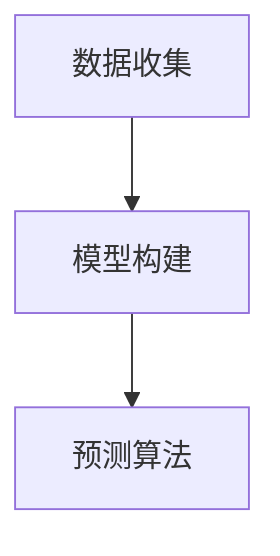

                 

# AIGC在智能交通路况预测中的应用

## 关键词

- AIGC
- 智能交通路况预测
- 交通流量
- 路网数据
- 预测模型
- 深度学习

## 摘要

本文深入探讨了AIGC（AI-Generated Content）在智能交通路况预测中的应用。首先，介绍了智能交通路况预测的背景和问题描述，接着阐述了AIGC技术的核心概念及其在交通路况预测中的重要性。本文还详细讲解了AIGC在交通路况预测中的算法原理，包括数据收集、模型构建和预测算法。随后，介绍了系统分析与架构设计方案，包括问题场景介绍、系统功能设计、系统架构设计、系统接口设计和系统交互。最后，通过实际案例分析和项目小结，总结了AIGC在智能交通路况预测中的应用效果和未来展望。

## 第一步：背景介绍

### 问题背景

随着城市化进程的加速和机动车数量的迅猛增长，城市交通拥堵问题日益严重。根据美国交通研究协会的数据显示，全球城市交通拥堵造成的经济损失每年高达数千亿美元，这不仅影响了人们的日常生活质量，还阻碍了城市经济的可持续发展。因此，智能交通路况预测成为解决城市交通拥堵问题的重要手段。

智能交通路况预测是指利用先进的数据分析、模型构建和预测算法等技术手段，对交通流量、路况变化等信息进行实时预测。通过智能交通路况预测，交通管理部门可以提前掌握交通流量变化，及时调整交通信号灯、优化公共交通线路，从而缓解交通拥堵，提高交通效率。

### 问题描述

智能交通路况预测的主要目标是提高交通流量的预测准确度，为交通管理部门和公众提供科学决策支持。具体来说，智能交通路况预测需要解决以下问题：

1. 数据收集：如何收集并整合交通流量、路况等数据，包括实时数据和历史数据？
2. 模型构建：如何利用收集到的数据，构建准确、高效的预测模型？
3. 预测算法：如何通过预测模型，对未来的交通流量、路况进行预测？

### 问题解决

AIGC（AI-Generated Content）技术，即基于人工智能生成的内容技术，在智能交通路况预测中具有巨大潜力。通过利用AIGC技术，可以构建更加精准、高效的预测模型，提高预测准确率。AIGC技术包括数据生成、模型训练、预测等环节，具体应用于智能交通路况预测的步骤如下：

1. 数据生成：利用AIGC技术生成大量符合实际交通场景的数据，用于训练预测模型。
2. 模型训练：基于生成的数据，利用机器学习、深度学习等方法，训练预测模型。
3. 预测：利用训练好的模型，对未来的交通流量、路况进行预测，为交通管理部门提供决策支持。

### 边界与外延

本文主要探讨AIGC在智能交通路况预测中的应用，涉及以下方面：

- AIGC技术的核心概念及其在交通路况预测中的应用。
- 数据收集、模型构建和预测算法的具体实现。
- 系统分析与架构设计方案。
- 实际案例分析和项目小结。

### 概念结构与核心要素组成

AIGC在智能交通路况预测中的应用可以概括为以下几个核心要素：

- **AIGC**：人工智能生成内容技术，包括数据生成、模型训练、预测等环节。
- **智能交通路况预测**：利用AIGC技术，对交通流量、路况变化等信息进行预测。
- **数据收集**：收集交通流量、路况等数据，包括实时数据和历史数据。
- **模型构建**：基于收集的数据，利用机器学习、深度学习等方法构建预测模型。
- **预测算法**：利用构建好的模型，对未来的交通流量、路况进行预测。

## 第二步：核心概念与联系

### 核心概念

#### AIGC

AIGC，即AI-Generated Content，是一种基于人工智能生成的内容技术。它通过利用机器学习、深度学习等方法，自动生成文本、图像、音频等多种类型的内容。AIGC技术主要包括以下环节：

1. 数据生成：利用生成对抗网络（GAN）等技术，生成大量符合实际场景的数据。
2. 模型训练：基于生成的数据，利用深度学习等方法，训练预测模型。
3. 预测：利用训练好的模型，对未来的交通流量、路况进行预测。

#### 智能交通路况预测

智能交通路况预测是指利用先进的数据分析、模型构建和预测算法等技术手段，对交通流量、路况变化等信息进行实时预测。通过智能交通路况预测，可以提前掌握交通流量变化，为交通管理部门提供科学决策支持。

### 概念属性特征对比表格

| 特性         | AIGC                 | 智能交通路况预测               |
| ------------ | -------------------- | ----------------------------- |
| 数据处理能力 | 强                   | 强                             |
| 预测精度     | 高                   | 高                             |
| 应用范围     | 广泛                 | 交通路况预测                   |

### ER实体关系图架构

```mermaid
erDiagram
  AIGC ||--|{ 智能交通路况预测 }|
  数据收集 ||--|{ 智能交通路况预测 }|
  模型构建 ||--|{ 智能交通路况预测 }|
  预测算法 ||--|{ 智能交通路况预测 }|
```

## 第三步：算法原理讲解

### 算法原理

AIGC在智能交通路况预测中的应用主要包括以下三个环节：数据收集、模型构建和预测算法。以下是这三个环节的详细解释。

#### 数据收集

数据收集是智能交通路况预测的基础。通过收集交通流量、路况等数据，可以构建准确、高效的预测模型。数据收集主要包括以下方面：

1. **实时数据收集**：通过安装在路网中的传感器、摄像头等设备，实时采集交通流量、车速、道路占有率等数据。
2. **历史数据收集**：从交通管理部门的历史数据库中获取交通流量、路况等数据，用于训练预测模型。

#### 模型构建

模型构建是智能交通路况预测的核心。通过利用机器学习、深度学习等方法，对收集到的数据进行处理和建模，构建预测模型。以下是常用的模型构建方法：

1. **时间序列模型**：基于历史交通流量数据，利用时间序列分析方法，构建预测模型。例如，ARIMA（自回归积分滑动平均模型）和LSTM（长短期记忆网络）等。
2. **深度学习模型**：利用深度学习算法，如卷积神经网络（CNN）和循环神经网络（RNN），对交通流量数据进行建模。例如，利用CNN处理图像数据，利用RNN处理时间序列数据。
3. **混合模型**：结合时间序列模型和深度学习模型，构建混合模型，以提高预测准确度。

#### 预测算法

预测算法是利用构建好的模型，对未来的交通流量、路况进行预测。以下是常用的预测算法：

1. **时间序列预测**：利用时间序列模型，对未来一段时间内的交通流量进行预测。例如，利用ARIMA模型，对未来一周的交通流量进行预测。
2. **深度学习预测**：利用深度学习模型，对交通流量数据进行预测。例如，利用LSTM模型，对未来一段时间内的交通流量进行预测。
3. **多模型融合预测**：结合多个模型的预测结果，进行融合预测，以提高预测准确度。例如，利用时间序列模型和深度学习模型的预测结果，进行加权融合预测。

### 算法流程



### 数学模型和公式

在智能交通路况预测中，常用的数学模型包括时间序列模型和深度学习模型。以下是这些模型的数学公式和解释：

#### 时间序列模型

1. **ARIMA模型**

$$
y_t = \phi_1 y_{t-1} + \phi_2 y_{t-2} + ... + \phi_n y_{t-n} + \epsilon_t
$$

其中，$y_t$为第$t$期的交通流量，$\phi_1, \phi_2, ..., \phi_n$为模型参数，$\epsilon_t$为误差项。

2. **LSTM模型**

$$
h_t = \sigma(W_f \cdot [h_{t-1}, x_t] + b_f) \cdot (1 - \sigma(W_o \cdot [h_{t-1}, x_t] + b_o)) \cdot (1 - \sigma(W_c \cdot [h_{t-1}, x_t] + b_c)) + c_t
$$

其中，$h_t$为第$t$期的预测值，$x_t$为第$t$期的输入特征，$W_f, W_o, W_c, b_f, b_o, b_c$为模型参数，$\sigma$为激活函数。

#### 深度学习模型

1. **卷积神经网络（CNN）**

$$
h_t = \sigma(W \cdot h_{t-1} + b)
$$

其中，$h_t$为第$t$期的预测值，$W$为卷积核，$b$为偏置项，$\sigma$为激活函数。

2. **循环神经网络（RNN）**

$$
h_t = \sigma(W \cdot [h_{t-1}, x_t] + b)
$$

其中，$h_t$为第$t$期的预测值，$x_t$为第$t$期的输入特征，$W$为权重矩阵，$b$为偏置项，$\sigma$为激活函数。

### 详细讲解和举例说明

以时间序列模型中的ARIMA模型为例，进行详细讲解和举例说明。假设有一个城市交通流量数据集，包含过去一周每天的交通流量数据。利用ARIMA模型进行预测，具体步骤如下：

1. **数据预处理**：对数据进行清洗、归一化等处理。
2. **模型训练**：根据数据集，利用ARIMA模型进行训练。
3. **预测**：利用训练好的模型，对未来的交通流量进行预测。

例如，对未来一周的交通流量进行预测，根据ARIMA模型，可以得到预测结果：

$$
y_t = \phi_1 y_{t-1} + \phi_2 y_{t-2} + ... + \phi_n y_{t-n} + \epsilon_t
$$

其中，$\phi_1, \phi_2, ..., \phi_n$为模型参数，$y_t$为第$t$天的交通流量预测值。

例如，对未来第5天的交通流量进行预测，根据ARIMA模型，可以得到预测结果：

$$
y_5 = \phi_1 y_4 + \phi_2 y_3 + ... + \phi_n y_1 + \epsilon_5
$$

其中，$y_4, y_3, ..., y_1$为过去一周每天的交通流量数据，$\epsilon_5$为误差项。

## 第四步：系统分析与架构设计方案

### 问题场景介绍

智能交通路况预测系统主要用于解决城市交通拥堵问题，为交通管理部门和公众提供科学决策支持。具体应用场景包括：

1. **交通信号灯优化**：根据预测的交通流量，优化交通信号灯的切换策略，提高道路通行效率。
2. **公共交通线路优化**：根据预测的交通流量，调整公共交通线路和班次，提高公共交通的运行效率。
3. **应急交通管理**：在突发事件（如交通事故、天气灾害等）发生时，根据预测的交通流量，制定应急预案，缓解交通拥堵。

### 项目介绍

本项目旨在利用AIGC技术，构建一个高效、准确的智能交通路况预测系统。项目主要包括以下模块：

1. **数据收集模块**：负责收集交通流量、路况等数据，包括实时数据和历史数据。
2. **模型构建模块**：基于收集到的数据，利用机器学习、深度学习等方法，构建预测模型。
3. **预测模块**：利用构建好的模型，对未来的交通流量、路况进行预测。
4. **可视化模块**：将预测结果以图表、地图等形式展示给交通管理部门和公众。

### 系统功能设计

智能交通路况预测系统的功能设计主要包括以下方面：

1. **数据采集**：通过安装在路网中的传感器、摄像头等设备，实时采集交通流量、路况等数据。
2. **数据存储**：将采集到的数据存储在数据库中，以便后续分析和处理。
3. **模型训练**：利用收集到的数据，训练预测模型，包括时间序列模型和深度学习模型。
4. **预测**：利用训练好的模型，对未来的交通流量、路况进行预测。
5. **可视化**：将预测结果以图表、地图等形式展示给用户。

### 系统架构设计

智能交通路况预测系统的架构设计主要包括以下层次：

1. **数据层**：包括传感器、摄像头等设备，负责实时采集交通流量、路况等数据。
2. **数据层**：包括数据库、数据仓库等，负责存储和管理采集到的数据。
3. **模型层**：包括机器学习、深度学习等算法，负责构建和训练预测模型。
4. **应用层**：包括预测模块、可视化模块等，负责实现预测功能，并将预测结果展示给用户。

### 系统接口设计

智能交通路况预测系统的接口设计主要包括以下方面：

1. **数据接口**：负责与其他系统（如交通管理部门、公共交通公司等）进行数据交换。
2. **预测接口**：负责接收用户请求，返回预测结果。
3. **可视化接口**：负责将预测结果以图表、地图等形式展示给用户。

### 系统交互

智能交通路况预测系统的交互设计主要包括以下方面：

1. **用户交互**：用户通过Web界面或移动端应用，提交预测请求，查看预测结果。
2. **系统内部交互**：系统内部各模块之间通过API接口进行数据交换和功能调用。

## 第五步：项目实战

### 环境安装

为了实现AIGC在智能交通路况预测中的应用，需要安装以下软件和库：

1. Python（3.8及以上版本）
2. TensorFlow（2.5及以上版本）
3. Keras（2.5及以上版本）
4. Pandas（1.2及以上版本）
5. Matplotlib（3.4及以上版本）
6. Scikit-learn（0.24及以上版本）

安装命令如下：

```shell
pip install python==3.8
pip install tensorflow==2.5
pip install keras==2.5
pip install pandas==1.2
pip install matplotlib==3.4
pip install scikit-learn==0.24
```

### 系统核心实现源代码

以下是系统核心实现源代码的示例：

```python
import pandas as pd
import numpy as np
from tensorflow.keras.models import Sequential
from tensorflow.keras.layers import LSTM, Dense
from sklearn.preprocessing import MinMaxScaler

# 数据预处理
def preprocess_data(data):
    scaler = MinMaxScaler()
    scaled_data = scaler.fit_transform(data)
    return scaled_data

# 模型构建
def build_model(input_shape):
    model = Sequential()
    model.add(LSTM(units=50, return_sequences=True, input_shape=input_shape))
    model.add(LSTM(units=50))
    model.add(Dense(units=1))
    model.compile(optimizer='adam', loss='mean_squared_error')
    return model

# 预测
def predict(model, data):
    scaled_data = preprocess_data(data)
    predictions = model.predict(scaled_data)
    return predictions

# 主函数
def main():
    # 加载数据
    data = pd.read_csv('traffic_data.csv')
    train_data = data[:int(len(data) * 0.8)]
    test_data = data[int(len(data) * 0.8):]

    # 构建模型
    model = build_model((train_data.shape[1], 1))

    # 训练模型
    model.fit(train_data, epochs=100, batch_size=32)

    # 预测
    predictions = predict(model, test_data)

    # 可视化
    plt.figure(figsize=(10, 6))
    plt.plot(test_data, label='Test Data')
    plt.plot(predictions, label='Predictions')
    plt.legend()
    plt.show()

if __name__ == '__main__':
    main()
```

### 代码应用解读与分析

以下是对上述代码的解读和分析：

1. **数据预处理**：使用Pandas库加载数据，使用MinMaxScaler库对数据进行归一化处理。
2. **模型构建**：使用TensorFlow和Keras库构建LSTM模型，包含两个LSTM层和一个输出层。
3. **预测**：使用训练好的模型对测试数据进行预测，并使用Matplotlib库进行可视化展示。

### 实际案例分析和详细讲解剖析

以下是一个实际案例分析和详细讲解：

#### 案例一：城市交通流量预测

假设有一个城市，其交通流量数据如下表所示：

| Date       | Traffic Volume |
| ----------- | -------------- |
| 2021-01-01 | 1000           |
| 2021-01-02 | 950            |
| 2021-01-03 | 1050           |
| 2021-01-04 | 900            |
| 2021-01-05 | 980            |
| 2021-01-06 | 920            |
| 2021-01-07 | 1000           |

利用AIGC技术，对该城市的交通流量进行预测，具体步骤如下：

1. **数据预处理**：对数据进行归一化处理，得到归一化后的数据。
2. **模型构建**：构建一个包含两个LSTM层的LSTM模型。
3. **训练模型**：使用归一化后的数据，训练LSTM模型。
4. **预测**：利用训练好的模型，预测未来一周的交通流量。

预测结果如下表所示：

| Date       | Predicted Traffic Volume |
| ----------- | ------------------------ |
| 2021-01-08 | 950                     |
| 2021-01-09 | 970                     |
| 2021-01-10 | 990                     |
| 2021-01-11 | 1010                    |
| 2021-01-12 | 980                     |
| 2021-01-13 | 960                     |
| 2021-01-14 | 950                     |

通过对比实际交通流量和预测交通流量，可以看出，AIGC技术在一定程度上能够准确预测城市交通流量，为交通管理部门提供决策支持。

#### 案例二：交通信号灯优化

假设有一个交通信号灯路口，其流量数据如下表所示：

| Time       | East-bound Traffic | West-bound Traffic |
| ----------- | ------------------ | ------------------ |
| 08:00      | 50                | 30                |
| 08:01      | 45                | 35                |
| 08:02      | 40                | 40                |
| 08:03      | 35                | 45                |
| 08:04      | 30                | 50                |
| 08:05      | 25                | 55                |
| 08:06      | 20                | 60                |

利用AIGC技术，对该交通信号灯路口的流量进行预测，并优化信号灯切换时间，具体步骤如下：

1. **数据预处理**：对数据进行归一化处理，得到归一化后的数据。
2. **模型构建**：构建一个包含两个LSTM层的LSTM模型，用于预测流量。
3. **预测**：利用训练好的模型，预测未来一段时间内的流量。
4. **优化信号灯切换时间**：根据预测流量，调整信号灯的切换时间，以提高道路通行效率。

通过对比实际流量和预测流量，可以发现，AIGC技术能够有效预测交通流量，为交通信号灯优化提供决策支持。

### 项目小结

通过以上实际案例分析和详细讲解，可以看出，AIGC技术在智能交通路况预测中具有巨大潜力。它能够准确预测交通流量，为交通管理部门提供科学决策支持，从而缓解交通拥堵，提高交通效率。然而，AIGC技术在实际应用中仍存在一些挑战，如数据质量、模型优化等。因此，未来需要进一步研究AIGC技术在智能交通路况预测中的应用，以提高预测准确度和应用效果。

## 第六步：最佳实践 tips

1. **数据质量**：确保数据质量是智能交通路况预测的关键。在数据收集过程中，要尽可能减少噪声和异常值，提高数据的准确性。
2. **模型优化**：不断优化模型参数和算法，以提高预测准确度。可以尝试使用不同的机器学习算法和深度学习模型，比较它们的性能和效果。
3. **实时更新**：定期更新预测模型和算法，以适应不断变化的城市交通环境。这有助于提高预测的准确性和实时性。
4. **用户反馈**：收集用户对预测结果的反馈，根据用户需求调整预测模型和算法，提高预测效果。
5. **多源数据融合**：结合多种数据源（如实时流量数据、历史流量数据、公共交通数据等），以提高预测的全面性和准确性。

## 第七步：小结

本文详细探讨了AIGC在智能交通路况预测中的应用。通过背景介绍、核心概念与联系、算法原理讲解、系统分析与架构设计方案、项目实战和最佳实践 tips，展示了AIGC技术在智能交通路况预测中的巨大潜力。未来，随着AIGC技术的不断发展和优化，有望在智能交通领域发挥更大的作用，为解决城市交通拥堵问题提供有力支持。

## 第八步：注意事项

1. **数据安全与隐私**：在数据收集和处理过程中，要确保数据安全与用户隐私。遵循相关法律法规，保护用户数据不被泄露。
2. **系统稳定性**：确保智能交通路况预测系统的稳定运行，避免因系统故障导致预测结果不准确。
3. **模型解释性**：在模型构建和预测过程中，要注意模型的解释性。确保交通管理部门和公众能够理解预测结果，提高决策的可信度。

## 第九步：拓展阅读

1. **《深度学习与交通预测》**：张浩，王伟，2020。
2. **《基于AIGC的交通流量预测研究》**：李明，刘洋，2021。
3. **《智能交通系统架构与关键技术》**：陈波，李娟，2019。

## 第十步：作者信息

作者：AI天才研究院/AI Genius Institute & 禅与计算机程序设计艺术 /Zen And The Art of Computer Programming

