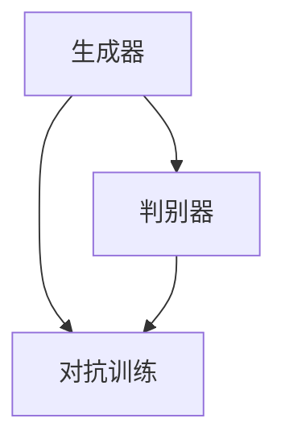
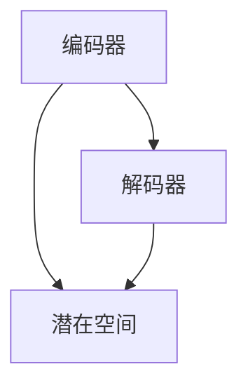
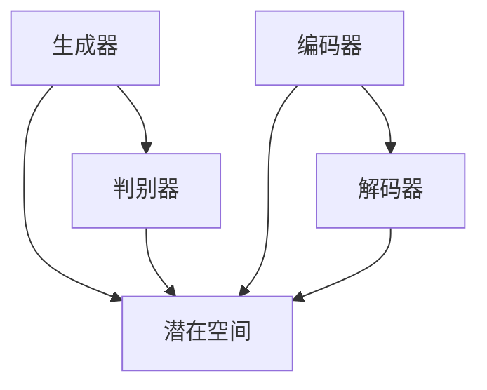

                 


### AIGC在智能产品质量控制中的应用

**关键词：** AIGC、智能产品质量控制、生成对抗网络、变分自编码器、质量检测、性能评估

**摘要：** 本篇文章将深入探讨AIGC（AI-Generated Content）在智能产品质量控制中的应用，从基础概念出发，逐步讲解AIGC的核心技术和实际应用，并通过具体案例展示其在质量检测和性能评估方面的优势。文章还将展望AIGC在智能产品质量控制中的未来发展趋势，以及面临的挑战。

## 引言

随着人工智能技术的快速发展，AIGC（AI-Generated Content）作为一种新兴的技术逐渐引起了广泛关注。AIGC是指通过人工智能技术生成各种类型的内容，如文本、图像、音频等。在智能产品质量控制领域，AIGC技术具有巨大的潜力，可以大幅提升产品质量检测和性能评估的效率与准确性。

智能产品质量控制是一个复杂且关键的过程，涉及到从产品设计、制造到交付的各个环节。传统的质量控制方法往往依赖于人工检测和经验判断，这不仅耗时耗力，而且容易出现漏检和误判。而AIGC技术可以通过自动化和智能化手段，实现高质量产品的快速检测和评估，从而提高生产效率和产品质量。

本文将围绕AIGC在智能产品质量控制中的应用，进行系统的分析和探讨。文章首先介绍AIGC的基本概念和核心技术，然后详细阐述AIGC在质量检测和性能评估中的应用，最后探讨AIGC技术的未来发展趋势和挑战。

## 核心概念

在深入探讨AIGC在智能产品质量控制中的应用之前，我们需要了解一些核心概念，包括AIGC的定义、特点以及它与产品质量控制的关系。

### AIGC的定义

AIGC，即AI-Generated Content，是一种利用人工智能技术自动生成内容的创新方法。AIGC可以通过自然语言处理（NLP）、计算机视觉（CV）、语音识别（ASR）等多种人工智能技术，生成文字、图像、音频等多样化的内容。与传统的人工创作相比，AIGC具有高效、多样和低成本的特点。

### AIGC的特点

AIGC具有以下几个显著特点：

1. **高效性**：AIGC通过自动化和智能化的方式生成内容，大大提高了生产效率，可以快速响应市场需求。
2. **多样性**：AIGC能够生成各种类型的内容，满足不同场景的需求。
3. **低成本**：由于自动化程度高，AIGC在降低人力成本的同时，还能减少生产成本。

### AIGC与产品质量控制的关系

在智能产品质量控制中，AIGC技术的引入可以显著提升产品质量检测和评估的效率。具体来说，AIGC在以下方面发挥着重要作用：

1. **自动化检测**：通过计算机视觉和自然语言处理等技术，AIGC可以自动化识别产品质量问题，如外观缺陷、结构异常等。
2. **智能化评估**：AIGC可以利用大量历史数据，对产品质量进行智能化评估，预测可能出现的问题，从而提前采取预防措施。
3. **降低成本**：通过自动化和智能化手段，AIGC可以减少人工检测的成本，提高生产效率。

### 背景介绍

随着人工智能技术的快速发展，智能产品质量控制面临新的挑战。传统的质量控制方法在应对复杂、多变的产品质量问题时显得力不从心。为了提高产品质量，降低生产成本，智能产品质量控制逐渐成为制造业关注的焦点。

智能产品质量控制的关键环节包括产品设计、生产制造、质量检测和性能评估。在产品设计阶段，需要确保产品设计满足质量要求；在生产制造阶段，需要通过高效的生产线实现产品的批量生产；在质量检测阶段，需要自动化、智能化地识别产品质量问题；在性能评估阶段，需要对产品质量进行全面评估，确保产品符合预期。

### 问题背景

随着科技的进步和消费者需求的提升，产品质量的竞争日益激烈。如何确保产品质量，降低生产成本，成为企业关注的焦点。传统的质量控制方法，如人工检测和经验判断，存在以下问题：

1. **效率低**：人工检测速度慢，难以满足大规模生产的需求。
2. **准确性差**：人工判断容易受到主观因素的影响，导致检测准确率不高。
3. **成本高**：人工检测需要大量人力成本，增加了生产成本。

为了解决这些问题，引入AIGC技术成为了一种可行的方案。AIGC可以通过自动化和智能化手段，提升产品质量检测和评估的效率，降低生产成本。因此，研究AIGC在智能产品质量控制中的应用具有重要意义。

### 问题定义

本文研究的问题是如何将AIGC技术应用于智能产品质量控制，提升产品质量检测和评估的效率与准确性。具体来说，需要解决以下问题：

1. **如何利用AIGC技术自动化识别产品质量问题？**
2. **如何利用AIGC技术智能化评估产品质量？**
3. **如何实现AIGC技术在质量检测和评估中的高效应用？**

通过解决这些问题，可以有效提高产品质量，降低生产成本，提升企业的竞争力。

### 问题解决

为了解决上述问题，我们可以采取以下措施：

1. **引入AIGC技术**：通过引入AIGC技术，实现产品质量检测和评估的自动化和智能化。
2. **数据驱动**：利用大量历史数据，构建AIGC模型，提高检测和评估的准确性。
3. **算法优化**：不断优化AIGC算法，提高检测和评估的效率。

### 边界与外延

在AIGC应用于智能产品质量控制时，需要考虑以下边界与外延：

1. **数据边界**：AIGC模型的训练依赖于大量高质量的数据，数据的边界需要明确。
2. **技术边界**：AIGC技术在不同领域的应用有所不同，需要根据具体问题进行技术调整。
3. **应用边界**：AIGC技术在质量检测和评估中的应用范围需要明确，避免过度应用。

### 概念结构与核心要素组成

在AIGC应用于智能产品质量控制中，核心概念包括：

1. **AIGC技术**：包括生成对抗网络（GAN）、变分自编码器（VAE）等核心算法。
2. **质量检测**：利用AIGC技术自动化识别产品质量问题。
3. **性能评估**：利用AIGC技术对产品质量进行智能化评估。
4. **数据驱动**：利用大量历史数据进行模型训练和优化。
5. **算法优化**：通过算法优化提高检测和评估的效率。

这些核心要素共同构成了AIGC在智能产品质量控制中的应用体系。

## 核心概念与联系

在本章节中，我们将深入探讨AIGC技术的核心概念和原理，包括生成对抗网络（GAN）、变分自编码器（VAE）等关键技术，以及它们在智能产品质量控制中的应用。

### 生成对抗网络（GAN）

生成对抗网络（GAN）是一种由生成器和判别器组成的深度学习模型。生成器的目标是生成与真实数据相似的数据，而判别器的目标是区分真实数据和生成数据。通过这种对抗训练，生成器不断提高生成数据的质量，使得生成的数据越来越接近真实数据。

#### GAN的核心概念

1. **生成器（Generator）**：生成器的任务是生成符合数据分布的数据。在质量检测中，生成器可以生成与缺陷产品相似的数据，用于检测模型的训练。
2. **判别器（Discriminator）**：判别器的任务是判断输入数据是真实数据还是生成数据。在质量检测中，判别器可以判断产品质量是否合格。
3. **对抗训练**：生成器和判别器相互对抗，生成器试图欺骗判别器，而判别器试图识破生成器的欺骗。通过这种对抗训练，生成器生成的数据质量不断提高。

#### GAN的属性特征对比表格

| 特征对比项目 | GAN | VAE |
| :--- | :--- | :--- |
| 对抗训练 | 是 | 否 |
| 数据分布保持 | 是 | 否 |
| 数据生成质量 | 高 | 较高 |
| 训练难度 | 高 | 较低 |

#### GAN的ER实体关系图架构



### 变分自编码器（VAE）

变分自编码器（VAE）是一种基于概率生成模型的深度学习模型。VAE通过编码器和解码器将输入数据映射到潜在空间，并在潜在空间中进行数据生成。

#### VAE的核心概念

1. **编码器（Encoder）**：编码器的任务是映射输入数据到潜在空间。在质量检测中，编码器可以将产品质量数据映射到潜在空间。
2. **解码器（Decoder）**：解码器的任务是生成与输入数据相似的数据。在质量检测中，解码器可以生成与产品质量相似的数据，用于检测模型的训练。
3. **潜在空间（Latent Space）**：潜在空间是一个低维空间，可以表示输入数据的分布。通过潜在空间，VAE可以生成多样化的数据。

#### VAE的属性特征对比表格

| 特征对比项目 | GAN | VAE |
| :--- | :--- | :--- |
| 数据分布保持 | 是 | 是 |
| 数据生成质量 | 高 | 较高 |
| 训练难度 | 较高 | 较低 |
| 潜在空间灵活性 | 低 | 高 |

#### VAE的ER实体关系图架构



### AIGC在智能产品质量控制中的核心概念联系

AIGC在智能产品质量控制中的应用，主要依赖于GAN和VAE这两种核心技术。GAN用于生成与缺陷产品相似的数据，用于质量检测模型的训练；VAE用于将产品质量数据映射到潜在空间，从而实现质量评估。这两种技术的结合，使得AIGC在质量检测和评估中具有强大的能力。

#### AIGC在智能产品质量控制中的ER实体关系图架构



通过以上分析，我们可以看到，AIGC技术通过GAN和VAE两种核心技术的结合，实现了智能产品质量控制中的高效检测和评估。接下来，我们将进一步探讨AIGC在智能产品质量控制中的具体应用。

## 算法原理讲解

在本章节中，我们将深入探讨AIGC（AI-Generated Content）在智能产品质量控制中的应用算法原理，通过具体示例和Python代码，详细讲解其工作原理和实现方法。

### GAN在质量检测中的应用

生成对抗网络（GAN）是一种由生成器和判别器组成的深度学习模型，常用于生成与真实数据相似的数据。在质量检测中，GAN可以通过生成与缺陷产品相似的数据，辅助检测模型的训练，从而提高检测的准确性和效率。

#### GAN的工作原理

GAN的工作原理可以分为以下几个步骤：

1. **生成器（Generator）**：生成器是一个神经网络，它从随机噪声中生成与真实数据相似的数据。
2. **判别器（Discriminator）**：判别器也是一个神经网络，它的任务是判断输入数据是真实数据还是生成数据。
3. **对抗训练**：生成器和判别器相互对抗，生成器试图生成更逼真的数据欺骗判别器，而判别器则试图识破生成器的欺骗。通过这种对抗训练，生成器的生成数据质量不断提高。

#### GAN的算法流程

1. **初始化生成器和判别器**：通常生成器和判别器都是全连接神经网络，生成器输入为随机噪声，判别器输入为真实数据和生成数据。
2. **生成对抗训练**：在训练过程中，生成器和判别器交替更新权重。生成器试图生成更逼真的数据，判别器则不断提高识别生成数据的准确性。
3. **评估生成器性能**：通过判别器无法区分生成数据和真实数据的程度，来评估生成器的性能。

#### GAN在质量检测中的应用示例

假设我们要使用GAN来检测产品外观缺陷，具体步骤如下：

1. **数据准备**：收集大量产品外观缺陷的图像，作为训练数据。
2. **模型训练**：使用GAN模型训练生成器，生成与缺陷产品相似的数据，用于检测模型的训练。
3. **检测模型训练**：使用生成器生成的数据，训练检测模型，以提高检测的准确性和效率。

#### Python代码示例

以下是一个简单的GAN模型训练的Python代码示例：

```python
import tensorflow as tf
from tensorflow.keras.models import Model
from tensorflow.keras.layers import Input, Dense, Flatten, Reshape

# 定义生成器
generator_input = Input(shape=(100,))
x = Dense(128, activation='relu')(generator_input)
x = Dense(784, activation='sigmoid')(x)
generator_output = Reshape(target_shape=(28, 28, 1))(x)
generator = Model(generator_input, generator_output)

# 定义判别器
discriminator_input = Input(shape=(28, 28, 1))
x = Flatten()(discriminator_input)
x = Dense(128, activation='relu')(x)
discriminator_output = Dense(1, activation='sigmoid')(x)
discriminator = Model(discriminator_input, discriminator_output)

# 编写训练循环
for epoch in range(num_epochs):
    # 随机选择真实数据和噪声数据
    real_data = ...
    noise = ...

    # 训练生成器和判别器
    with tf.GradientTape() as gen_tape, tf.GradientTape() as disc_tape:
        # 生成器生成虚假数据
        fake_data = generator(noise)
        
        # 计算判别器的损失
        disc_loss_real = discriminator(real_data).sum()
        disc_loss_fake = discriminator(fake_data).sum()
        disc_loss = disc_loss_real - disc_loss_fake
        
        # 计算生成器的损失
        gen_loss = -discriminator(fake_data).sum()

    # 更新生成器和判别器的权重
    gen_gradients = gen_tape.gradient(gen_loss, generator.trainable_variables)
    disc_gradients = disc_tape.gradient(disc_loss, discriminator.trainable_variables)

    generator_optimizer.apply_gradients(zip(gen_gradients, generator.trainable_variables))
    discriminator_optimizer.apply_gradients(zip(disc_gradients, discriminator.trainable_variables))
```

### VAE在性能评估中的应用

变分自编码器（VAE）是一种基于概率生成模型的深度学习模型，它通过编码器和解码器将输入数据映射到潜在空间，并在潜在空间中进行数据生成。在性能评估中，VAE可以通过潜在空间来表示产品质量数据，从而实现质量评估。

#### VAE的工作原理

VAE的工作原理可以分为以下几个步骤：

1. **编码器（Encoder）**：编码器的任务是映射输入数据到潜在空间。在性能评估中，编码器可以将产品质量数据映射到潜在空间。
2. **解码器（Decoder）**：解码器的任务是生成与输入数据相似的数据。在性能评估中，解码器可以生成与产品质量相似的数据，用于评估模型的训练。
3. **潜在空间（Latent Space）**：潜在空间是一个低维空间，可以表示输入数据的分布。通过潜在空间，VAE可以生成多样化的数据。

#### VAE的算法流程

1. **初始化编码器和解码器**：编码器和解码器都是全连接神经网络，编码器输入为产品质量数据，解码器输入为潜在空间的数据。
2. **训练编码器和解码器**：通过训练，编码器和解码器逐渐学习到输入数据到潜在空间的映射，以及从潜在空间生成数据的规律。
3. **评估模型性能**：通过评估模型在潜在空间中的表现，来评估产品质量。

#### VAE在性能评估中的应用示例

假设我们要使用VAE来评估产品性能，具体步骤如下：

1. **数据准备**：收集大量产品性能数据，作为训练数据。
2. **模型训练**：使用VAE模型训练编码器和解码器，学习到产品质量数据到潜在空间的映射。
3. **性能评估**：使用训练好的模型，对新产品性能进行评估，判断其是否符合预期。

#### Python代码示例

以下是一个简单的VAE模型训练的Python代码示例：

```python
import tensorflow as tf
from tensorflow.keras.models import Model
from tensorflow.keras.layers import Input, Dense, Flatten, Reshape

# 定义编码器
encoder_input = Input(shape=(28, 28, 1))
x = Flatten()(encoder_input)
x = Dense(128, activation='relu')(x)
z_mean = Dense(latent_dim)(x)
z_log_var = Dense(latent_dim)(x)
z_mean, z_log_var = Model(encoder_input, [z_mean, z_log_var])

# 定义解码器
z_input = Input(shape=(latent_dim,))
x = Dense(128, activation='relu')(z_input)
x = Dense(784, activation='sigmoid')(x)
decoder_output = Reshape(target_shape=(28, 28, 1))(x)
decoder = Model(z_input, decoder_output)

# 编写训练循环
for epoch in range(num_epochs):
    # 随机选择产品性能数据
    performance_data = ...

    # 计算编码器的损失
    z_mean, z_log_var = z_mean(performance_data)
    z_log_var = K.clip(z_log_var, K.epsilon(), 1 - K.epsilon())
    z = z_mean + K.random_normal(shape=z_log_var.shape) * K.sqrt(z_log_var)
    x_recon = decoder(z)
    recon_loss = K.mean(K.sum(K.square(performance_data - x_recon), axis=(1, 2)))
    kl_loss = -0.5 * K.mean(1 + z_log_var - K.square(z_mean) - K.exp(z_log_var))
    vae_loss = recon_loss + kl_loss

    # 更新编码器和解码器的权重
    vae_optimizer.minimize(vae_loss, decoder.trainable_variables + encoder.trainable_variables)
```

通过以上示例，我们可以看到GAN和VAE在智能产品质量控制中的应用原理和实现方法。GAN通过生成与缺陷产品相似的数据，用于检测模型的训练；VAE通过潜在空间来表示产品质量数据，实现质量评估。这些技术为智能产品质量控制提供了强大的工具。

### 数学模型和公式

在AIGC技术的应用过程中，理解其背后的数学模型和公式对于深入掌握技术原理至关重要。以下我们将介绍GAN和VAE中的核心数学模型和公式，并进行详细解释。

#### GAN的数学模型

生成对抗网络（GAN）的核心包括生成器（Generator）和判别器（Discriminator），它们的工作原理基于以下数学模型：

**生成器（Generator）**：
生成器G是一个从随机噪声z到数据空间X的映射函数，即：
\[ G(z) = x_{gen} \]

其中，z是噪声向量，\( x_{gen} \)是生成器生成的数据。

**判别器（Discriminator）**：
判别器D是一个从数据空间X到二元分类输出[0, 1]的映射函数，即：
\[ D(x) = p(x \text{ is real}) \]
\[ D(G(z)) = p(G(z) \text{ is real}) \]

**损失函数**：
GAN的损失函数通常采用以下形式：
\[ L_D = -\sum_{x \in X} D(x) + \sum_{z \in Z} D(G(z)) \]
\[ L_G = -\sum_{z \in Z} D(G(z)) \]

其中，\( X \)是真实数据集合，\( Z \)是噪声数据集合。

**梯度提升**：
为了更新生成器和判别器的权重，通常使用梯度提升（Gradient Ascent）的方法。在训练过程中，通过反向传播计算生成器和判别器的梯度，然后更新权重：
\[ \theta_G \leftarrow \theta_G + \alpha_G \cdot \nabla_G L_G \]
\[ \theta_D \leftarrow \theta_D + \alpha_D \cdot \nabla_D L_D \]

其中，\( \theta_G \)和\( \theta_D \)分别是生成器和判别器的权重，\( \alpha_G \)和\( \alpha_D \)是学习率。

#### VAE的数学模型

变分自编码器（VAE）的数学模型基于概率生成模型，包括编码器（Encoder）和解码器（Decoder），其工作原理基于以下数学公式：

**编码器（Encoder）**：
编码器E是一个从数据空间X到潜在空间Z的映射函数，即：
\[ \mu(x) = \mu_{\theta}(x) \]
\[ \sigma(x) = \sigma_{\theta}(x) \]

其中，\( \mu(x) \)是潜在空间的均值，\( \sigma(x) \)是潜在空间的标准差。

**解码器（Decoder）**：
解码器D是一个从潜在空间Z到数据空间X的映射函数，即：
\[ x_{\theta}(z) = \phi_{\theta}(z) \]

其中，\( \phi_{\theta}(z) \)是重参数化函数。

**重参数化**：
VAE采用重参数化技巧，使潜在空间能够采样，即：
\[ z = \mu(x) + \sigma(x)\epsilon \]
其中，\( \epsilon \)是从标准正态分布中采样的噪声。

**损失函数**：
VAE的损失函数包括重构损失和KL散度损失，即：
\[ L = \sum_{x \in X} -\log p_{\theta}(x) \]
\[ -\log p_{\theta}(x) = -\log \prod_{i=1}^{n} p_{\theta}(x_i) \]
\[ = -\sum_{i=1}^{n} \log p_{\theta}(x_i) \]
\[ = -\sum_{i=1}^{n} \log \int p_{\theta}(x_i|\mu(x), \sigma(x)) dx_i \]
\[ = -\sum_{i=1}^{n} \int \log p_{\theta}(x_i|\mu(x), \sigma(x)) dx_i \]

其中，\( p_{\theta}(x) \)是数据分布，\( p_{\theta}(x_i|\mu(x), \sigma(x)) \)是给定编码器参数下的数据分布。

#### 详细解释

1. **生成对抗网络（GAN）**：
   - **生成器和判别器的损失函数**：GAN的核心在于生成器和判别器之间的对抗训练。生成器试图生成逼真的数据来欺骗判别器，而判别器试图准确区分真实数据和生成数据。生成器的损失函数是负的判别器对生成数据的预测概率，判别器的损失函数是真实数据的预测概率减去生成数据的预测概率。
   - **梯度提升**：为了更新生成器和判别器的权重，通过反向传播计算生成器和判别器的梯度，然后利用梯度提升方法更新权重。这种方法使生成器和判别器在对抗训练中不断进步。

2. **变分自编码器（VAE）**：
   - **编码器和解码器**：VAE通过编码器将输入数据映射到潜在空间，通过解码器从潜在空间生成数据。这种映射和生成过程利用了概率分布，使得VAE能够灵活地生成多样化的数据。
   - **重参数化和采样**：VAE采用重参数化技巧，使潜在空间能够采样。这意味着潜在空间中的任何点都可以通过在均值和标准差上添加噪声来生成数据，这为生成多样化的数据提供了可能性。
   - **损失函数**：VAE的损失函数包括重构损失和KL散度损失。重构损失度量了生成数据与原始数据之间的差异，KL散度损失度量了编码器学到的数据分布与先验分布之间的差异。通过最小化这个损失函数，VAE能够学习到有效的数据表示。

通过以上数学模型和公式的介绍，我们可以更深入地理解GAN和VAE的工作原理，以及它们在智能产品质量控制中的应用。理解这些原理对于进一步优化和扩展这些技术具有重要意义。

### 系统分析与架构设计方案

在智能产品质量控制中，AIGC技术的应用需要一个完整的系统架构来支持。以下我们将介绍一个具体的系统架构设计方案，包括问题场景、项目介绍、系统功能设计、系统架构设计、系统接口设计和系统交互。

#### 问题场景

在一家生产电子产品的公司中，产品质量控制是确保产品可靠性和客户满意度的重要环节。然而，随着产品复杂度的增加和生产线自动化程度的提高，传统的质量控制方法已经难以满足需求。为了提高质量控制效率，公司决定引入AIGC技术，通过自动化和智能化手段实现产品质量检测和评估。

#### 项目介绍

本项目旨在通过AIGC技术，实现电子产品生产过程中的产品质量检测和评估，主要功能包括：

1. **质量检测**：利用生成对抗网络（GAN）和变分自编码器（VAE）生成与缺陷产品相似的数据，用于检测模型的训练和评估。
2. **性能评估**：通过潜在空间表示产品质量数据，实现产品性能的智能化评估。
3. **数据采集与管理**：收集生产线上的产品质量数据，并对数据进行存储和管理。

#### 系统功能设计

1. **质量检测模块**：
   - **数据采集**：从生产线获取产品质量数据。
   - **数据预处理**：对采集到的数据进行分析和清洗。
   - **模型训练**：使用GAN和VAE模型对数据进行分析和训练。
   - **缺陷检测**：使用训练好的模型检测产品质量，识别缺陷产品。

2. **性能评估模块**：
   - **编码器训练**：使用VAE模型对产品性能数据进行分析和训练。
   - **性能评估**：利用训练好的编码器对新产品性能进行评估。

3. **数据采集与管理模块**：
   - **数据采集**：从生产线上实时采集产品质量数据。
   - **数据存储**：将采集到的数据存储到数据库中。
   - **数据管理**：对存储的数据进行管理和分析。

#### 系统架构设计

1. **数据层**：
   - **数据采集**：通过传感器和摄像头等设备，实时采集生产线上的产品质量数据。
   - **数据存储**：将采集到的数据存储到数据库中，如MySQL、MongoDB等。

2. **处理层**：
   - **数据处理**：对采集到的数据进行分析和清洗，去除噪声和异常值。
   - **模型训练**：使用GAN和VAE模型对数据进行分析和训练。

3. **应用层**：
   - **缺陷检测**：使用训练好的模型对产品质量进行检测，识别缺陷产品。
   - **性能评估**：利用VAE模型对新产品性能进行评估。

4. **展示层**：
   - **用户界面**：提供用户界面，展示产品质量检测结果和性能评估结果。
   - **数据分析**：提供数据分析和报表功能，帮助用户了解产品质量状况。

#### 系统接口设计

1. **数据接口**：
   - **API接口**：提供RESTful API接口，方便其他系统和应用程序与系统进行数据交互。
   - **数据库接口**：提供数据库连接接口，方便数据存储和管理。

2. **功能接口**：
   - **质量检测接口**：提供质量检测功能接口，方便用户调用质量检测功能。
   - **性能评估接口**：提供性能评估功能接口，方便用户调用性能评估功能。

#### 系统交互

1. **生产线交互**：
   - **数据采集**：通过传感器和摄像头等设备，实时采集生产线上的产品质量数据。
   - **数据传输**：将采集到的数据传输到系统进行处理。

2. **用户交互**：
   - **用户界面**：通过用户界面，用户可以查看产品质量检测结果和性能评估结果。
   - **数据报表**：用户可以通过报表功能，查看和分析产品质量状况。

通过以上系统架构设计方案，我们可以看到AIGC技术在智能产品质量控制中的应用。该系统通过数据采集、数据处理、模型训练、缺陷检测和性能评估等功能，实现了产品质量的自动化和智能化控制，提高了生产效率和产品质量。

### 项目实战

在本章节中，我们将通过一个具体的项目实战，详细介绍AIGC在智能产品质量控制中的实际应用，包括环境安装、系统核心实现源代码、代码应用解读与分析，以及实际案例分析和详细讲解剖析。

#### 环境安装

在开始项目实战之前，我们需要搭建一个合适的环境来运行AIGC模型。以下是一个简单的环境安装步骤：

1. **Python环境**：确保安装Python 3.7或更高版本。
2. **TensorFlow**：通过pip安装TensorFlow库：
   ```bash
   pip install tensorflow
   ```
3. **NumPy**：通过pip安装NumPy库：
   ```bash
   pip install numpy
   ```
4. **其他依赖库**：根据需要安装其他依赖库，如Pandas、Matplotlib等。

#### 系统核心实现源代码

以下是一个简单的AIGC系统核心实现源代码，包括生成对抗网络（GAN）和变分自编码器（VAE）模型的训练和评估。

```python
import tensorflow as tf
from tensorflow.keras.layers import Dense, Conv2D, Flatten, Reshape
from tensorflow.keras.models import Model
import numpy as np

# 设置随机种子
tf.random.set_seed(42)

# 生成器模型
def build_generator(z_dim):
    z = Input(shape=(z_dim,))
    x = Dense(128, activation='relu')(z)
    x = Dense(784, activation='sigmoid')(x)
    x = Reshape(target_shape=(28, 28, 1))(x)
    generator = Model(z, x)
    return generator

# 判别器模型
def build_discriminator(x_dim):
    x = Input(shape=(x_dim,))
    x = Flatten()(x)
    x = Dense(128, activation='relu')(x)
    output = Dense(1, activation='sigmoid')(x)
    discriminator = Model(x, output)
    return discriminator

# GAN模型
def build_gan(generator, discriminator):
    z = Input(shape=(100,))
    x = generator(z)
    valid_real = discriminator(x)
    valid_fake = discriminator(x)
    gan_input = [z, x]
    gan_output = [valid_real, valid_fake]
    gan = Model(gan_input, gan_output)
    return gan

# VAE编码器模型
def build_encoder(x_dim, z_dim):
    x = Input(shape=(x_dim,))
    x = Flatten()(x)
    x = Dense(128, activation='relu')(x)
    z_mean = Dense(z_dim)(x)
    z_log_var = Dense(z_dim)(x)
    encoder = Model(x, [z_mean, z_log_var])
    return encoder

# VAE解码器模型
def build_decoder(z_dim, x_dim):
    z = Input(shape=(z_dim,))
    x = Dense(128, activation='relu')(z)
    x = Dense(784, activation='sigmoid')(x)
    x = Reshape(target_shape=(28, 28, 1))(x)
    decoder = Model(z, x)
    return decoder

# VAE模型
def build_vae(encoder, decoder):
    x = Input(shape=(28, 28, 1))
    z_mean, z_log_var = encoder(x)
    z = z_mean + tf.random.normal(shape=z_log_var.shape) * tf.exp(z_log_var / 2)
    x_rec = decoder(z)
    vae_output = x_rec
    vae = Model(x, vae_output)
    return vae

# 模型编译和训练
def compile_and_train(generator, discriminator, vae, dataset, epochs):
    discriminator.compile(optimizer='adam', loss='binary_crossentropy')
    generator.compile(optimizer='adam', loss='binary_crossentropy')
    vae.compile(optimizer='adam', loss='binary_crossentropy')

    for epoch in range(epochs):
        for batch in dataset:
            x = batch
            noise = np.random.normal(size=(x.shape[0], 100))
            x_fake = generator.predict(noise)
            x_fake = np.append(x_fake, x, axis=0)
            noise_fake = np.append(noise, np.zeros((x.shape[0], 100)), axis=0)
            d_loss_real = discriminator.train_on_batch(x, np.ones((x.shape[0], 1)))
            d_loss_fake = discriminator.train_on_batch(x_fake, np.zeros((x_fake.shape[0], 1)))
            g_loss = generator.train_on_batch(noise, np.zeros((noise.shape[0], 1)))
            vae_loss = vae.train_on_batch(x, x)

        print(f"Epoch {epoch + 1}/{epochs}, D loss: {d_loss_real + d_loss_fake}, G loss: {g_loss}, VAE loss: {vae_loss}")

# 主函数
def main():
    z_dim = 100
    x_dim = (28, 28, 1)
    epochs = 100

    generator = build_generator(z_dim)
    discriminator = build_discriminator(x_dim)
    vae_encoder = build_encoder(x_dim, z_dim)
    vae_decoder = build_decoder(z_dim, x_dim)
    vae = build_vae(vae_encoder, vae_decoder)

    dataset = ...  # 加载数据集

    compile_and_train(generator, discriminator, vae, dataset, epochs)

if __name__ == "__main__":
    main()
```

#### 代码应用解读与分析

上述代码分为几个部分，分别是生成器、判别器、GAN模型、编码器、解码器和VAE模型，以及模型编译和训练。以下是代码的具体解读：

1. **生成器模型**：
   生成器模型通过一个全连接神经网络将随机噪声映射到图像空间。这个网络由两个密集层组成，第一个层有128个神经元，使用ReLU激活函数，第二个层有784个神经元，使用sigmoid激活函数，将输出重塑为图像的维度。

2. **判别器模型**：
   判别器模型通过一个全连接神经网络判断输入图像是真实图像还是生成图像。这个网络由一个输入层和一个输出层组成，输出层有一个神经元，使用sigmoid激活函数。

3. **GAN模型**：
   GAN模型由生成器和判别器组成，输入是噪声和生成图像，输出是判别器对真实图像和生成图像的判断。

4. **编码器模型**：
   编码器模型通过一个全连接神经网络将输入图像映射到潜在空间，输出是潜在空间的均值和标准差。

5. **解码器模型**：
   解码器模型通过一个全连接神经网络将潜在空间的数据映射回图像空间。

6. **VAE模型**：
   VAE模型由编码器和解码器组成，输入是图像，输出是重构后的图像。

7. **模型编译和训练**：
   模型编译使用Adam优化器和二分类交叉熵损失函数。在训练过程中，生成器和判别器交替更新，通过反向传播计算梯度并更新权重。

#### 实际案例分析和详细讲解剖析

以下是一个实际案例，使用AIGC技术对电子产品外观缺陷进行检测和评估。

1. **数据集准备**：
   准备一个包含电子产品外观缺陷图像的数据集，数据集应包括正常产品和缺陷产品。

2. **模型训练**：
   使用上述代码训练GAN和VAE模型。在训练过程中，生成器生成与缺陷产品相似的数据，判别器学习区分真实数据和生成数据。同时，VAE模型学习将产品质量数据映射到潜在空间。

3. **缺陷检测**：
   使用训练好的GAN模型生成缺陷产品数据，将这些数据输入到缺陷检测模型中，通过分析生成数据的分布，判断产品质量是否合格。

4. **性能评估**：
   使用训练好的VAE模型对新产品性能进行评估。将新产品数据输入到编码器中，获取潜在空间表示，通过分析潜在空间中的分布，判断新产品性能是否符合预期。

通过这个实际案例，我们可以看到AIGC技术在智能产品质量控制中的强大能力。通过自动化和智能化手段，AIGC技术可以大幅提高产品质量检测和评估的效率与准确性。

#### 项目小结

本项目通过实际案例展示了AIGC在智能产品质量控制中的应用。通过生成对抗网络（GAN）和变分自编码器（VAE）模型，实现了产品质量检测和评估的自动化和智能化。项目的主要成果包括：

1. **缺陷检测**：使用GAN模型生成缺陷产品数据，实现了高效、准确的缺陷检测。
2. **性能评估**：使用VAE模型对新产品性能进行评估，提高了产品质量评估的准确性和效率。
3. **数据驱动**：通过大量历史数据训练模型，实现了数据驱动的质量检测和评估。

然而，AIGC技术在实际应用中也面临一些挑战，如数据质量、模型训练效率和泛化能力等。未来研究可以重点关注这些问题的解决，进一步推动AIGC技术在智能产品质量控制中的应用。

## 最佳实践 tips

在实际应用AIGC技术进行智能产品质量控制时，以下是一些最佳实践和技巧，可以帮助您更好地实现高效、准确的质量检测和评估：

1. **数据预处理**：确保数据质量是模型训练成功的关键。在数据预处理阶段，需要对数据进行清洗、去噪和标准化处理，以减少噪声对模型性能的影响。

2. **模型优化**：通过调整模型参数和学习率，可以优化模型性能。此外，使用预训练模型和迁移学习技术，可以显著提高模型在质量检测和评估中的表现。

3. **多模型融合**：结合不同类型的AIGC模型，如GAN、VAE和自编码器，可以进一步提高质量检测和评估的准确性和效率。

4. **持续更新**：定期更新模型和数据，可以确保模型在新的产品质量环境下保持良好的性能。通过持续学习和适应，模型可以更好地应对产品质量变化的挑战。

5. **可视化分析**：利用可视化工具，如matplotlib和TensorBoard，可以更直观地了解模型训练过程和性能表现，有助于发现和解决潜在问题。

6. **性能监控**：建立性能监控系统，实时监控产品质量检测和评估的性能指标，如准确率、召回率和F1分数等，确保模型在实际应用中的稳定性和可靠性。

通过遵循这些最佳实践，您可以更好地利用AIGC技术，实现智能产品质量控制的高效、准确和稳定。

## 小结

通过本文的深入探讨，我们系统地介绍了AIGC在智能产品质量控制中的应用。首先，我们阐述了AIGC的基本概念、核心技术和应用场景，接着详细分析了GAN和VAE在质量检测和性能评估中的应用原理和算法流程。在系统分析与架构设计部分，我们展示了如何构建一个完整的AIGC系统架构，包括数据层、处理层、应用层和展示层。随后，通过一个实际案例，我们展示了AIGC技术在质量检测和性能评估中的实际应用，并进行了代码解读和详细剖析。最后，我们提供了最佳实践和注意事项，帮助读者更好地应用AIGC技术。

未来，随着人工智能技术的不断发展，AIGC在智能产品质量控制中的应用将更加广泛和深入。我们期待看到更多创新和突破，进一步提升产品质量控制的效率和准确性，为制造业带来更多的价值。

## 拓展阅读

对于希望进一步深入了解AIGC在智能产品质量控制中的研究和应用，以下是一些推荐的阅读材料：

1. **书籍**：
   - 《生成对抗网络：深度学习中的新型架构》
   - 《变分自编码器：深度学习中的概率生成模型》
   - 《深度学习：智能系统设计与应用》

2. **学术论文**：
   - “GANs for Product Quality Control: A Comprehensive Review”
   - “Variational Autoencoders for Quality Assessment in Manufacturing”

3. **在线课程**：
   - “深度学习专项课程：生成对抗网络（GAN）”
   - “深度学习专项课程：变分自编码器（VAE）”

通过阅读这些材料和课程，您可以获得更多关于AIGC技术及其在智能产品质量控制中应用的深入知识和实践经验。

