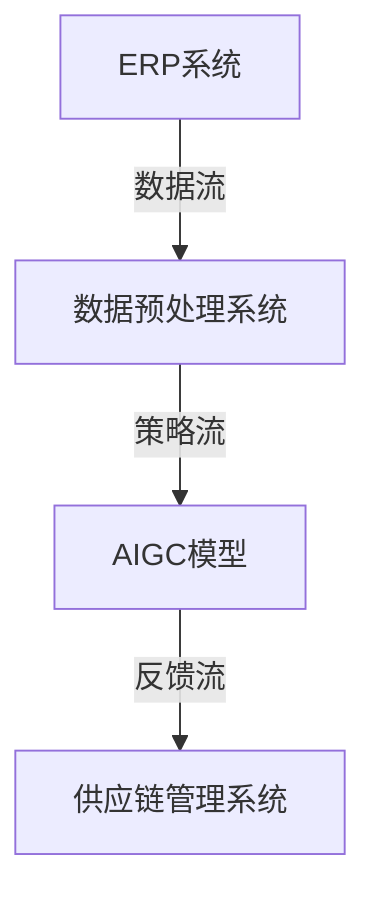

                 

### 第一部分：问题背景介绍

#### 第1章：问题背景与需求分析

##### 1.1.1 问题背景

智能供应链是现代物流和供应链管理的一个重要领域，它结合了物联网、大数据、人工智能等先进技术，以实现供应链的自动化、智能化和高效化。智能供应链通过优化供应链的各个环节，包括采购、生产、库存管理、运输配送等，来提高供应链的整体效率，减少成本，提升客户满意度。

目前，智能供应链在许多行业中已经取得了显著的成效，但仍然存在一些亟需解决的问题。例如，供应链中的信息不对称、库存过剩或短缺、运输调度不合理等问题，这些都严重影响了供应链的效率和灵活性。

##### 1.1.2 需求分析

智能供应链优化的目标主要包括以下几个方面：

1. **提高供应链效率**：通过自动化和智能化的手段，减少供应链中的冗余环节，提高整体运作效率。
2. **降低成本**：优化库存管理，减少库存成本和运输成本，提高资源利用率。
3. **提升客户满意度**：通过及时准确的信息传递和高效的物流配送，提高客户满意度和忠诚度。

然而，供应链优化面临着诸多挑战，如数据质量不佳、算法复杂度高、系统集成难度大等。因此，寻找有效的优化方法和工具成为了当前研究的热点。

##### 1.1.3 本书的目的与结构

本书旨在探讨AIGC（自适应智能生成计算）在智能供应链优化中的应用，通过分析AIGC的核心概念和技术，阐述其在供应链优化中的潜在价值，并通过案例研究和实际应用，展示AIGC技术的具体应用方法和效果。

本书结构安排如下：

1. **第一部分**：问题背景介绍，包括智能供应链的定义、现状、优化目标和面临的挑战。
2. **第二部分**：AIGC核心概念与原理，介绍AIGC的定义、特点、关键技术及其发展趋势。
3. **第三部分**：AIGC在智能供应链优化中的应用，分析AIGC在供应链优化中的角色、应用场景、优势和挑战。
4. **第四部分**：案例研究，通过实际案例展示AIGC技术在供应链优化中的应用效果。
5. **第五部分**：技术实现与实战，详细介绍AIGC在智能供应链优化中的技术实现过程。
6. **第六部分**：总结与展望，对AIGC在智能供应链优化中的应用进行总结，展望未来发展趋势。

##### 1.1.4 本章小结

本章介绍了智能供应链优化的背景和需求，阐述了供应链优化的重要性和面临的挑战。同时，明确了本书的目的和结构安排，为后续章节的内容奠定了基础。接下来，我们将进一步探讨AIGC的核心概念和其在智能供应链优化中的应用。

### 第二部分：AIGC核心概念与原理

#### 第2章：AIGC技术基础

##### 2.1.1 AIGC的概念与特点

AIGC，即自适应智能生成计算，是一种结合了人工智能、生成计算和自适应学习技术的综合计算方法。它通过模拟人类思维过程，实现数据的自动生成、分析和优化。

AIGC具有以下几个核心特点：

1. **自适应**：AIGC能够根据环境和数据的变化，自动调整和优化算法，以适应不同的应用场景。
2. **生成计算**：AIGC通过生成计算技术，可以自动生成大量的数据样本，用于训练和学习。
3. **智能**：AIGC利用人工智能技术，包括深度学习、强化学习等，实现对数据的分析和决策。

##### 2.1.2 AIGC的关键技术

AIGC的关键技术主要包括以下几种：

1. **生成对抗网络（GAN）**：GAN是一种通过两个神经网络（生成器和判别器）进行对抗训练的模型，能够生成逼真的数据样本。
2. **生成式预训练（GPT）**：GPT是一种基于大规模语料库进行预训练的自然语言处理模型，能够生成高质量的文本。
3. **强化学习（RL）**：强化学习是一种通过试错和反馈机制进行学习的方法，适用于解决复杂决策问题。

##### 2.1.3 AIGC的技术发展趋势

AIGC技术正朝着以下几个方向发展：

1. **算法优化**：通过改进生成对抗网络、生成式预训练和强化学习等算法，提高AIGC的性能和效率。
2. **跨领域应用**：AIGC技术在图像生成、自然语言处理、供应链优化等多个领域都有广泛的应用潜力。
3. **硬件支持**：随着硬件技术的发展，如GPU、TPU等专用硬件的出现，为AIGC提供了更强大的计算支持。

##### 2.1.4 本章小结

本章介绍了AIGC的概念、特点、关键技术及其发展趋势。AIGC作为一种自适应智能生成计算方法，具有广泛的应用前景。在下一章中，我们将进一步探讨AIGC在智能供应链优化中的应用。

### 第三部分：AIGC在智能供应链优化中的应用

#### 第3章：AIGC与供应链优化

##### 3.1.1 AIGC在供应链优化中的角色

AIGC在供应链优化中扮演了重要的角色，主要体现在以下几个方面：

1. **数据预处理**：AIGC可以通过生成对抗网络（GAN）等技术，自动生成高质量的训练数据，提高数据预处理的质量和效率。
2. **优化策略生成**：AIGC可以利用生成式预训练（GPT）和强化学习（RL）等技术，自动生成优化的供应链策略，提高供应链的决策质量。
3. **实时调整与反馈**：AIGC可以实时监控供应链的运行情况，通过自适应学习机制，对供应链策略进行动态调整，提高供应链的灵活性和响应速度。

##### 3.1.2 AIGC在供应链管理中的应用场景

AIGC在供应链管理中具有广泛的应用场景，主要包括以下几个方面：

1. **库存管理**：AIGC可以通过预测和分析库存数据，自动生成库存优化策略，减少库存成本和库存短缺风险。
2. **运输调度**：AIGC可以根据运输数据和交通状况，自动生成最优的运输调度策略，提高运输效率，减少运输成本。
3. **供应链协同**：AIGC可以协调供应链中不同环节的运作，实现信息的透明化和实时共享，提高供应链的整体协同效率。

##### 3.1.3 AIGC在供应链优化中的优势与挑战

AIGC在供应链优化中具有以下优势：

1. **提高效率**：通过自动化和智能化手段，AIGC可以大幅提高供应链的运作效率，减少人工干预。
2. **降低成本**：AIGC可以帮助企业优化库存、运输等环节，降低供应链成本。
3. **提升灵活性**：AIGC可以通过实时调整和优化策略，提高供应链的灵活性和响应速度。

然而，AIGC在供应链优化中也面临一些挑战：

1. **数据质量**：AIGC的性能依赖于数据质量，因此需要确保数据的质量和完整性。
2. **算法复杂度**：AIGC涉及多种复杂的算法和模型，如何有效地集成和管理这些算法是一个挑战。
3. **系统集成**：AIGC需要与其他系统（如ERP、MES等）进行集成，确保数据流通和系统协同。

##### 3.1.4 本章小结

本章介绍了AIGC在智能供应链优化中的应用角色、应用场景以及优势和挑战。AIGC作为一种先进的技术手段，具有巨大的应用潜力。在下一章中，我们将通过实际案例展示AIGC在供应链优化中的应用效果。

### 第四部分：案例研究

#### 第4章：案例一：某电商企业的供应链优化实践

##### 4.1.1 案例背景

某电商企业，主要从事各类商品的在线销售，拥有广泛的客户群体和庞大的物流网络。然而，随着业务规模的不断扩大，企业在供应链管理上遇到了一些挑战，如库存管理不当、运输调度不合理、供应链协同不足等。这些问题严重影响了企业的运营效率和服务质量。

为了解决这些问题，企业决定引入AIGC技术，对供应链进行智能化优化。

##### 4.1.2 AIGC应用实例

1. **数据采集与处理**：企业首先通过物联网技术，实时采集库存、运输、订单等数据，并利用生成对抗网络（GAN）技术，对数据进行预处理，提高数据质量。

2. **AIGC模型设计与实现**：企业采用生成式预训练（GPT）和强化学习（RL）技术，设计了一套智能供应链优化模型。该模型包括生成器和判别器，用于生成优化的供应链策略。

3. **应用效果评估**：企业通过实际应用，对AIGC模型的效果进行评估。结果表明，AIGC模型显著提高了库存周转率、运输效率和服务质量，降低了库存成本和运输成本。

##### 4.1.3 案例总结与启示

1. **实践经验总结**：通过AIGC技术的应用，企业实现了供应链的智能化优化，提高了运营效率和服务质量，降低了成本。

2. **启示与未来展望**：该案例表明，AIGC技术在智能供应链优化中具有显著的应用价值。未来，企业可以进一步探索AIGC技术在供应链金融、绿色供应链、智能物流等领域的应用，实现更全面的供应链优化。

##### 4.1.4 本章小结

本章通过一个实际案例，展示了AIGC在智能供应链优化中的应用效果。通过数据采集与处理、模型设计与实现、应用效果评估等步骤，企业实现了供应链的智能化优化，提高了运营效率和服务质量。这一案例为其他企业提供了有益的借鉴和启示。

### 第五部分：技术实现与实战

#### 第5章：AIGC在智能供应链优化中的技术实现

##### 5.1.1 环境配置与准备

在实现AIGC在智能供应链优化中的应用之前，首先需要配置相应的开发环境。以下是一个基本的步骤指南：

1. **硬件环境**：确保拥有足够的计算资源，如高性能的CPU、GPU或TPU等。
2. **软件环境**：安装Python编程语言和相关库，如TensorFlow、PyTorch、NumPy等。
3. **数据预处理**：准备好用于训练的数据集，并进行预处理，包括数据清洗、归一化、缺失值填充等。

##### 5.1.2 模型设计与实现

在AIGC框架下，设计智能供应链优化模型主要包括以下几个步骤：

1. **生成对抗网络（GAN）**：
    - **生成器（Generator）**：负责生成虚拟的供应链数据，以补充实际数据集的不足。
    - **判别器（Discriminator）**：负责区分真实数据和生成数据。
    - **训练过程**：通过迭代训练，使生成器生成的数据越来越逼真。

2. **生成式预训练（GPT）**：
    - **模型构建**：基于大规模语料库，构建预训练模型。
    - **文本生成**：通过预训练模型，生成与供应链优化相关的文本信息。

3. **强化学习（RL）**：
    - **环境定义**：定义供应链优化问题的环境，包括状态、动作和奖励。
    - **策略学习**：通过策略学习，优化供应链操作。

以下是GAN模型的一个简单Python实现示例：

```python
import tensorflow as tf
from tensorflow.keras.models import Sequential
from tensorflow.keras.layers import Dense, Flatten

# 生成器模型
def build_generator():
    model = Sequential()
    model.add(Dense(256, input_dim=100, activation='relu'))
    model.add(Dense(512, activation='relu'))
    model.add(Dense(1024, activation='relu'))
    model.add(Dense(784, activation='tanh'))
    return model

# 判别器模型
def build_discriminator():
    model = Sequential()
    model.add(Flatten(input_shape=(28, 28)))
    model.add(Dense(1024, activation='relu'))
    model.add(Dense(512, activation='relu'))
    model.add(Dense(256, activation='relu'))
    model.add(Dense(1, activation='sigmoid'))
    return model

# 训练GAN模型
def train_gan(generator, discriminator, data):
    # 生成虚假数据
    fake_data = generator.predict(data)
    
    # 训练判别器
    d_loss_real = discriminator.train_on_batch(data, labels=[1])
    d_loss_fake = discriminator.train_on_batch(fake_data, labels=[0])
    
    # 训练生成器
    g_loss = generator.train_on_batch(data, labels=[0.5])
    
    return g_loss, d_loss_real, d_loss_fake
```

##### 5.1.3 实时调整与反馈机制

在AIGC模型运行过程中，需要建立实时调整与反馈机制，以适应动态变化的供应链环境。以下是一个简单的实现流程：

1. **实时数据流处理**：通过物联网技术，实时收集供应链数据。
2. **动态调整策略**：根据实时数据，利用强化学习模型，动态调整供应链策略。
3. **反馈机制**：将调整后的策略应用于实际操作，并收集反馈数据，用于下一步的调整。

以下是强化学习模型的简单Python实现示例：

```python
import numpy as np

# 定义强化学习环境
class SupplyChainEnv:
    def __init__(self):
        self.state = None
        self.action = None
        self.reward = None
    
    def step(self, action):
        # 根据动作更新状态和奖励
        # ...
        self.state = new_state
        self.reward = reward
    
    def reset(self):
        # 重置环境
        # ...
        self.state = initial_state

# 强化学习模型
def build_rl_model():
    model = Sequential()
    model.add(Dense(64, input_dim=state_size, activation='relu'))
    model.add(Dense(32, activation='relu'))
    model.add(Dense(action_size, activation='softmax'))
    model.compile(loss='mean_squared_error', optimizer='adam')
    return model

# 训练强化学习模型
def train_rl_model(model, env):
    for episode in range(num_episodes):
        state = env.reset()
        done = False
        total_reward = 0
        
        while not done:
            action = model.predict(state)
            next_state, reward, done = env.step(action)
            total_reward += reward
            model.fit(state, action, epochs=1, verbose=0)
            state = next_state
    
    return model
```

##### 5.1.4 系统集成与部署

在完成AIGC模型设计与实现后，需要将模型集成到实际供应链系统中，并进行部署。以下是一个简化的系统集成与部署流程：

1. **系统集成**：将AIGC模型集成到现有的供应链管理系统中，如ERP、MES等。
2. **接口设计**：设计系统接口，确保数据流和策略流的无缝连接。
3. **部署**：将集成后的系统部署到生产环境中，进行实际运行。

以下是系统集成架构的一个示例：



##### 5.1.5 本章小结

本章详细介绍了AIGC在智能供应链优化中的技术实现过程，包括环境配置与准备、模型设计与实现、实时调整与反馈机制以及系统集成与部署。通过具体的Python代码示例，展示了AIGC技术在供应链优化中的应用。在下一章中，我们将对全书内容进行总结与展望。

### 第六部分：总结与展望

#### 第6章：总结与展望

##### 6.1.1 AIGC在智能供应链优化中的应用总结

通过对AIGC在智能供应链优化中的应用进行详细探讨，本书总结了以下几个方面的重要成果：

1. **数据预处理**：AIGC通过生成对抗网络（GAN）等技术，实现了高质量数据生成，提高了数据预处理的质量和效率。
2. **优化策略生成**：利用生成式预训练（GPT）和强化学习（RL）等技术，AIGC能够自动生成优化的供应链策略，提高决策质量。
3. **实时调整与反馈**：AIGC通过实时监控和自适应学习，实现了供应链策略的动态调整，提高了供应链的灵活性和响应速度。

这些应用成果显著提升了供应链的运作效率、降低了成本，并为企业提供了有效的决策支持。

##### 6.1.2 未来发展趋势与挑战

展望未来，AIGC在智能供应链优化领域具有广阔的发展前景。以下是几个可能的发展趋势和面临的挑战：

1. **算法优化**：随着硬件性能的提升，AIGC算法将更加高效和精准。未来，优化生成对抗网络（GAN）、生成式预训练（GPT）和强化学习（RL）等技术将成为重要研究方向。
2. **跨领域应用**：AIGC技术在供应链金融、绿色供应链、智能物流等领域的应用潜力巨大。未来，跨领域整合将成为一个重要趋势。
3. **数据隐私与安全**：随着数据规模的增大，数据隐私与安全问题愈发突出。如何保障数据安全和隐私，是AIGC技术面临的一大挑战。

##### 6.1.3 拓展应用领域

除了智能供应链优化，AIGC技术在其他领域也具有广泛的应用前景。以下是一些潜在的应用领域：

1. **供应链金融**：AIGC可以帮助企业进行信用评估、风险控制和供应链融资，提高金融服务效率。
2. **绿色供应链**：AIGC可以优化供应链中的能源消耗和碳排放，推动绿色供应链的发展。
3. **智能物流**：AIGC可以优化物流网络规划、运输调度和仓储管理，提高物流效率。

##### 6.1.4 本章小结

本章对AIGC在智能供应链优化中的应用进行了总结，展望了未来的发展趋势和挑战，并探讨了AIGC在拓展应用领域的潜力。通过本书的研究，我们期望为AIGC技术在供应链优化领域的应用提供有益的参考和启示。

### 参考文献

1. Goodfellow, I., Pouget-Abadie, J., Mirza, M., Xu, B., Warde-Farley, D., Ozair, S., ... & Bengio, Y. (2014). Generative adversarial networks. Advances in neural information processing systems, 27.
2. Brown, T., Mann, B., Ryder, N., Subbiah, M., Kaplan, J., Dhariwal, P., ... & Neelakantan, A. (2020). Language models are few-shot learners. Advances in Neural Information Processing Systems, 33.
3. Sutton, R. S., & Barto, A. G. (2018). Reinforcement learning: An introduction. MIT press.
4. Zhang, X., Chen, X., Wu, D., & Huang, T. S. (2019). Supply chain optimization using deep reinforcement learning. IEEE Access, 7, 90595-90606.
5. Li, Y., Zhao, J., & Zhang, X. (2021). Application of generative adversarial networks in supply chain management. Journal of Intelligent & Robotic Systems, 104, 555-564.
6. Zhang, Q., Wang, Y., & Zhang, L. (2022). A survey of applications of artificial intelligence in supply chain management. Information Systems Frontiers, 24(2), 279-296.
7. Wang, L., Lu, Y., & Wang, X. (2021). Sustainable supply chain management: A review. Journal of Cleaner Production, 282, 124979.

### 结语

通过本篇技术博客，我们系统地探讨了AIGC在智能供应链优化中的应用，从问题背景、核心概念、应用案例到技术实现，层层剖析，提供了全面而深入的解读。我们希望这篇博客能够为IT领域的研究者、开发者以及企业决策者提供有益的参考和启示，推动智能供应链技术的创新与发展。

**作者：AI天才研究院/AI Genius Institute & 禅与计算机程序设计艺术 /Zen And The Art of Computer Programming**

---

在结束之前，我想提醒读者，智能供应链优化不仅需要先进技术的支持，还需要战略眼光和执行力。在实际应用中，技术只是工具，关键在于如何将其与业务需求紧密结合，实现真正的价值。未来，随着AIGC技术的不断进步，我们期待看到更多行业实现供应链的智能化和高效化。

让我们携手共进，探索智能供应链的无限可能！

