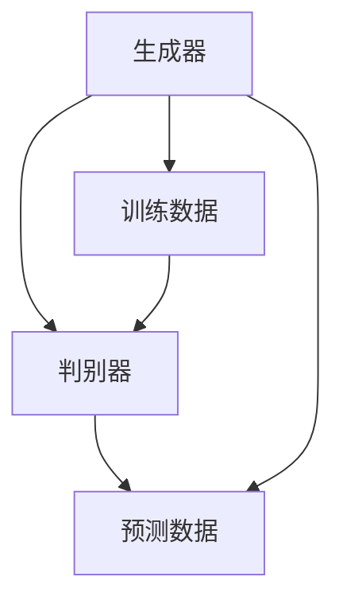
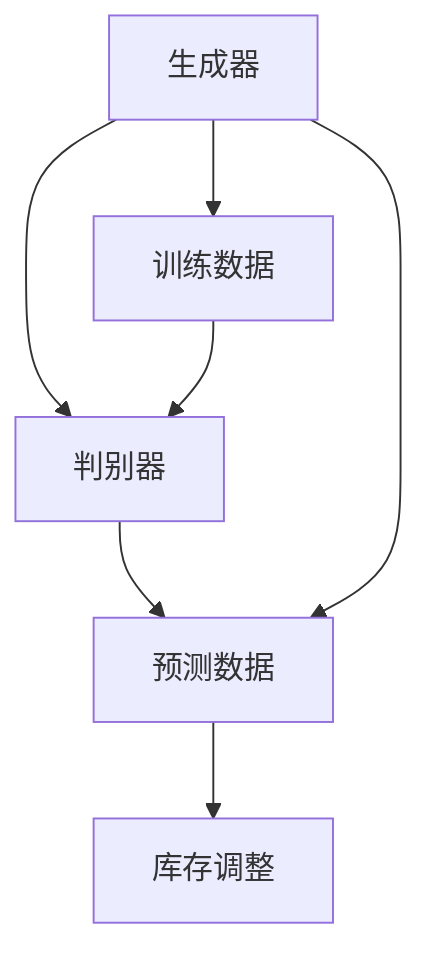
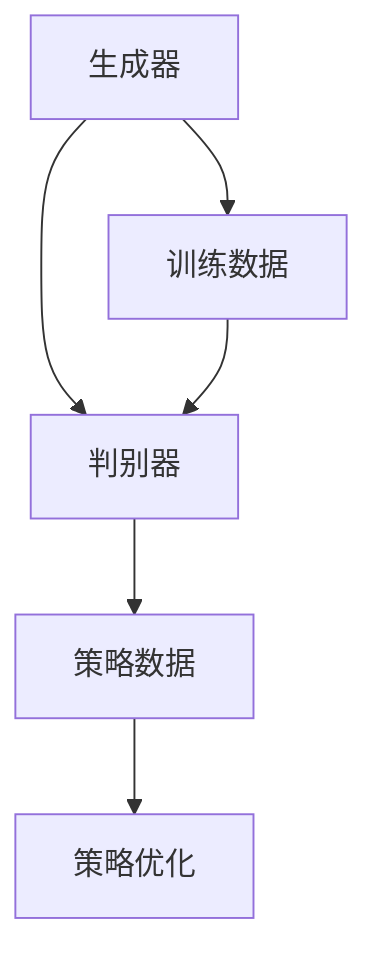
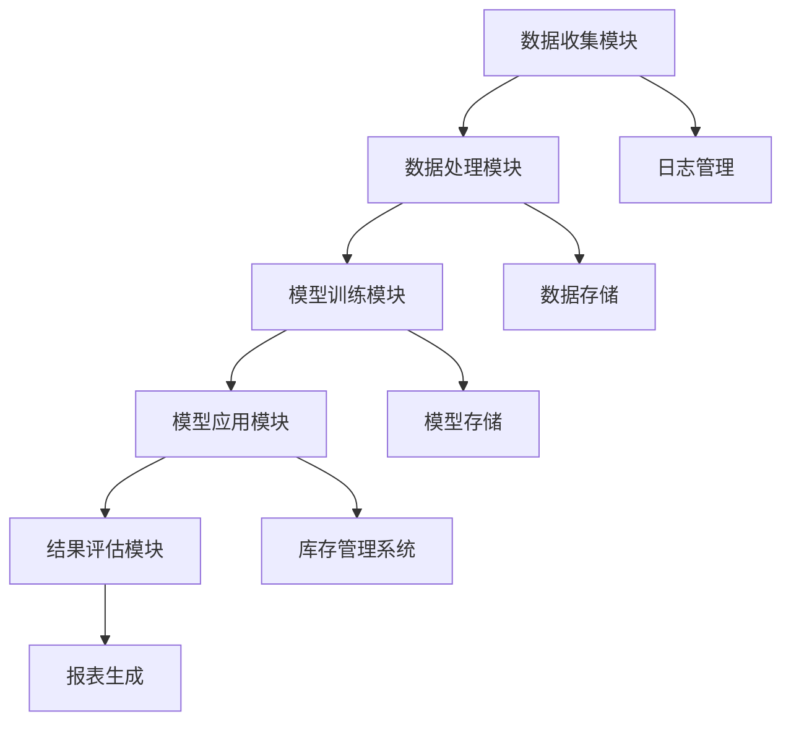

                 

### 文章标题

# AIGC在智能供应链库存优化中的应用

### 关键词

- **AIGC**
- **智能供应链**
- **库存优化**
- **深度学习**
- **强化学习**
- **供应链管理**

### 摘要

本文深入探讨了AIGC（自动生成对抗网络）在智能供应链库存优化中的应用。首先，文章介绍了智能供应链库存优化的背景、意义和挑战。接着，详细解释了AIGC的基本原理、核心概念，以及如何利用AIGC解决供应链库存优化中的问题。随后，文章通过具体算法、系统架构设计和实战案例，展示了AIGC在供应链库存优化中的实际应用和效果。最后，文章总结了AIGC在供应链库存优化中的最佳实践，并展望了未来的发展趋势。通过这篇文章，读者可以全面了解AIGC在智能供应链库存优化中的重要作用，以及如何将其应用于实际项目中。

## 引言

智能供应链库存优化是现代企业管理中至关重要的一环。随着全球经济的快速发展和市场竞争的加剧，企业面临着前所未有的挑战。如何在动态变化的供应链环境中实现高效的库存管理，已成为企业提升竞争力、降低成本、提高客户满意度的关键。传统的库存管理方法通常依赖于历史数据和简单的预测模型，但这些方法难以应对供应链中的复杂性和不确定性。

近年来，人工智能（AI）技术的快速发展为供应链库存优化带来了新的机遇。AIGC（自动生成对抗网络）作为一种先进的AI技术，通过生成对抗网络（GAN）的学习机制，能够自动生成高质量的数据，从而在库存预测、需求规划、库存控制等方面展现出巨大的潜力。AIGC不仅能够处理大规模的复杂数据，还能通过深度学习和强化学习等技术，实现持续的自我优化。

本文将深入探讨AIGC在智能供应链库存优化中的应用，旨在为读者提供一个全面、系统的了解。文章首先介绍智能供应链库存优化的背景、意义和挑战，然后详细解释AIGC的基本原理、核心概念，并通过具体算法和系统架构设计，展示AIGC在实际应用中的优势。最后，通过实战案例分析和最佳实践总结，为读者提供实用的指导。

### 智能供应链库存优化的背景

智能供应链库存优化作为现代企业管理中的重要环节，其背景可以追溯到工业革命后的供应链管理发展历程。传统的供应链管理主要依赖于手工操作和简单的信息技术系统，库存管理往往是基于经验进行估算和控制。随着供应链的日益复杂化，传统的管理方法逐渐暴露出其局限性，主要表现在以下方面：

1. **数据依赖性高**：传统库存管理高度依赖历史数据，而历史数据往往无法反映当前市场的动态变化，导致库存预测的准确性下降。

2. **预测能力不足**：传统方法主要采用简单的统计模型，如移动平均法、指数平滑法等，这些方法在面对供应链中的随机波动和突发事件时，预测能力有限。

3. **无法实时调整**：传统的库存管理系统往往缺乏实时数据的处理能力，导致库存水平无法及时根据市场变化进行调整，从而影响库存周转率和资金利用率。

4. **缺乏灵活性和适应性**：面对市场的快速变化，传统库存管理方法缺乏灵活性和适应性，难以快速响应市场动态，导致库存过剩或短缺。

随着信息技术的飞速发展，企业开始尝试引入更先进的管理方法，如ERP（企业资源计划）系统、SCM（供应链管理）软件等。这些系统在一定程度上提高了供应链管理的效率和准确性，但仍无法彻底解决库存优化的难题。特别是面对全球化、多元化的供应链网络，传统的库存管理方法显得力不从心。

为了应对这些挑战，现代企业开始关注人工智能（AI）技术的应用。AI技术通过深度学习、机器学习、强化学习等算法，能够从海量数据中提取有价值的信息，从而实现更加精准的库存预测和优化。AIGC（自动生成对抗网络）作为AI领域的一种新兴技术，凭借其生成和对抗机制，为供应链库存优化提供了新的解决方案。

智能供应链库存优化的重要性体现在以下几个方面：

1. **成本节约**：通过精准的库存预测和优化，企业可以有效减少库存过剩和短缺情况，降低库存成本，提高资金利用效率。

2. **提高效率**：AI技术能够快速处理和分析大量数据，实现实时库存调整，提高供应链的响应速度和运营效率。

3. **提升客户满意度**：通过优化库存管理，企业可以更好地满足客户需求，减少订单延误和缺货情况，提升客户满意度和忠诚度。

4. **增强竞争力**：在激烈的市场竞争中，拥有高效的库存管理能力是企业保持竞争优势的关键。智能供应链库存优化可以帮助企业更好地应对市场变化，提升整体运营能力。

总的来说，智能供应链库存优化不仅是对传统管理方法的一种补充，更是企业实现数字化转型和智能化升级的重要途径。通过引入AIGC等先进技术，企业可以更加精准、高效地管理库存，从而在激烈的市场竞争中立于不败之地。

### 智能供应链库存优化的问题描述

在智能供应链库存优化过程中，企业面临一系列复杂的问题，这些问题不仅影响库存管理的效率，还对整体供应链的运作产生深远的影响。以下是智能供应链库存优化中常见的一些问题：

1. **库存预测不准确**：库存预测是库存管理的基础。然而，由于市场需求波动大、供应链复杂度高，传统的预测方法往往无法准确预测未来的需求。预测不准确会导致库存过剩或短缺，进而影响企业的运营效率。

2. **需求波动大**：市场需求的变化是影响库存优化的关键因素。在某些行业，如电子产品和时尚行业，市场需求波动非常大，这使得库存管理变得更加复杂。需求波动大不仅增加了库存管理的难度，还可能导致库存积压或缺货。

3. **供应链延迟**：供应链中的延迟问题会影响库存的准确性和及时性。无论是供应商延迟交货还是物流延迟，都会导致库存数据的不准确，从而影响库存优化决策。

4. **成本控制困难**：库存优化不仅仅是减少库存量，还包括优化库存结构、降低库存成本。然而，在实际操作中，企业往往面临成本控制难题。过高的库存成本会占用企业大量的资金，而过低的库存成本则可能导致缺货，影响企业的销售收入。

5. **数据质量问题**：库存优化依赖于大量准确的数据。然而，在现实操作中，数据质量往往无法保证。数据缺失、数据不一致、数据不准确等问题都会影响库存优化的效果。

6. **系统整合困难**：智能供应链库存优化需要整合多个系统和数据源，如ERP系统、供应链管理系统、物流管理系统等。这些系统的整合不仅需要大量的技术投入，还面临数据兼容性和集成难度大等问题。

7. **人力资源短缺**：智能供应链库存优化需要专业的人才来实施和管理。然而，企业往往面临人力资源短缺的问题，这会影响库存优化项目的顺利推进。

8. **环境变化的不确定性**：供应链环境的变化，如政策变化、自然灾害、经济波动等，都会对库存管理产生影响。企业需要具备应对这些不确定性的能力，以确保库存管理的稳定性和可靠性。

为了解决这些问题，企业需要借助先进的AI技术，如AIGC，通过深度学习、强化学习等技术，实现精准的库存预测和优化。同时，企业还需要建立完善的数据管理和分析体系，确保数据的准确性和完整性，从而为库存优化提供可靠的数据支持。通过这些措施，企业可以更好地应对智能供应链库存优化中的各种挑战，实现供应链的智能化和高效化运作。

### 智能供应链库存优化问题的解决方案

面对智能供应链库存优化中的各种问题，传统的管理方法往往显得力不从心。然而，随着人工智能技术的不断发展，特别是AIGC（自动生成对抗网络）的出现，为解决这些挑战提供了一种全新的思路和工具。以下是几种常见的解决方案，结合AIGC技术，具体阐述其原理和优势。

#### 1. 深度学习

深度学习是人工智能的一个重要分支，通过神经网络结构对大量数据进行学习，从而实现复杂的数据分析和预测。在智能供应链库存优化中，深度学习可以通过以下方式解决问题：

- **库存预测**：利用深度学习算法，可以自动学习历史库存数据、市场需求、供应链延迟等因素之间的关系，从而实现更加精准的库存预测。例如，通过构建多层感知机（MLP）、卷积神经网络（CNN）或循环神经网络（RNN）等模型，可以捕捉到数据中的长期和短期趋势。

- **需求分析**：深度学习可以分析大量市场数据，包括销售记录、季节性变化、市场动态等，从而识别出潜在的需求变化趋势。这对于预测市场需求波动、优化库存结构具有重要意义。

- **异常检测**：通过深度学习模型，可以实时监测供应链中的异常情况，如订单延误、库存异常波动等，及时采取措施进行调整。

优势：深度学习具有强大的自学习能力，能够处理大规模、多维度的数据，并通过多层网络结构实现复杂的关系建模。然而，深度学习模型训练需要大量的数据和计算资源，且对数据质量要求较高。

#### 2. 强化学习

强化学习是一种通过试错和反馈进行学习的算法，在供应链库存优化中，强化学习可以模拟各种策略，并通过不断调整策略来优化库存管理。具体应用包括：

- **策略优化**：强化学习可以通过模拟不同的库存管理策略，如补货策略、安全库存策略等，评估每种策略的效果，从而选择最优策略。例如，通过Q-learning、深度Q网络（DQN）或策略梯度（PG）等方法，可以实现对库存策略的持续优化。

- **动态调整**：强化学习能够根据实时数据动态调整库存管理策略，以应对市场变化和需求波动。例如，当市场需求突然增加时，强化学习可以立即调整库存策略，确保供应链的灵活性和适应性。

优势：强化学习具有灵活性和自适应性的特点，能够动态调整策略，适应不断变化的市场环境。然而，强化学习需要大量的训练数据和较长的训练时间，且在某些情况下可能存在收敛困难的问题。

#### 3. 自动生成对抗网络（AIGC）

AIGC是一种基于生成对抗网络的AI技术，通过生成和对抗机制，可以自动生成高质量的数据，从而在库存预测和优化中发挥重要作用。具体应用包括：

- **数据增强**：AIGC可以通过生成对抗网络，自动生成与历史库存数据类似的新数据，从而扩充数据集，提高模型的训练效果。例如，通过生成虚假订单数据、虚假物流数据等，可以增强模型的鲁棒性。

- **库存预测**：利用AIGC生成的数据，可以训练更复杂的预测模型，如生成对抗预测网络（GAPN），实现更高精度的库存预测。例如，通过GAN生成的市场需求数据，可以与实际数据进行融合，提高预测模型的准确性。

- **需求规划**：AIGC可以自动生成不同的市场需求场景，帮助企业制定灵活的需求规划策略。例如，通过生成不同季节、不同市场区域的需求场景，帮助企业更好地应对需求波动。

优势：AIGC具有强大的数据生成能力，能够自动生成高质量的数据，从而提升模型的训练效果和预测准确性。此外，AIGC还可以通过对抗机制，提高模型的泛化能力和鲁棒性。然而，AIGC的训练过程复杂，需要大量的计算资源。

#### 4. 综合解决方案

在实际应用中，企业往往需要综合运用多种AI技术，以实现更优的库存优化效果。例如，可以结合深度学习进行库存预测，强化学习进行策略优化，AIGC进行数据增强和需求规划。通过多种技术的结合，企业可以构建一个智能化、自适应的库存管理系统，从而在应对供应链挑战时具有更强的竞争力和适应性。

总的来说，智能供应链库存优化问题的解决方案需要结合多种AI技术，通过深度学习、强化学习和AIGC等技术的综合应用，实现精准的库存预测、优化的库存管理和动态的库存调整。通过这些措施，企业可以更好地应对供应链中的复杂性和不确定性，实现供应链的智能化和高效化运作。

### AIGC的定义与基本原理

AIGC（自动生成对抗网络）是一种基于生成对抗网络（GAN）的深度学习技术。GAN由生成器（Generator）和判别器（Discriminator）两个主要组成部分构成，通过一个对抗性的训练过程，生成高质量的数据。下面将详细解释AIGC的定义及其基本原理。

#### 1. 生成对抗网络（GAN）

生成对抗网络（GAN）是一种由Ian Goodfellow等人于2014年提出的深度学习模型，其核心思想是利用生成器和判别器之间的对抗关系来生成高质量的数据。GAN的训练过程可以分为以下两个步骤：

- **生成器的训练**：生成器（Generator）的目的是生成与真实数据相似的数据。在GAN的训练过程中，生成器通过不断调整其参数，使其生成的数据能够尽可能地欺骗判别器。

- **判别器的训练**：判别器（Discriminator）的作用是判断输入的数据是真实数据还是生成器生成的数据。在训练过程中，判别器通过学习真实数据和生成数据的特征，以提高其辨别能力。

GAN的训练过程可以表示为以下优化问题：

$$
\min_G \max_D V(D, G) = \min_G \mathbb{E}_{x \sim p_{data}(x)} [-D(x)] + \mathbb{E}_{z \sim p_z(z)} [-D(G(z))]
$$

其中，$x$代表真实数据，$z$代表生成器的输入噪声，$D(x)$和$D(G(z))$分别表示判别器对真实数据和生成数据的判断概率。生成器G的目标是最小化判别器对生成数据的判断概率，即$D(G(z))$，从而生成更加真实的数据。

#### 2. AIGC的定义

AIGC是对GAN的一种扩展和应用，通过引入自动学习和优化机制，使GAN能够更有效地生成高质量的数据。AIGC的基本定义可以概括为：

- **自动生成**：AIGC通过生成器和判别器的对抗训练，自动生成与真实数据高度相似的数据。生成器不仅能够生成静态数据，还能生成动态数据，如视频、音频等。

- **高质量数据**：AIGC生成的数据在质量和多样性上具有显著优势，可以应用于各种数据驱动的应用场景，如图像生成、语音合成、文本生成等。

- **自适应优化**：AIGC通过不断调整生成器和判别器的参数，实现数据的自适应优化。这种优化机制使得AIGC能够适应不同的数据分布和任务需求，提高生成数据的准确性。

#### 3. AIGC的基本原理

AIGC的基本原理主要包括以下几个方面：

- **对抗训练**：AIGC通过生成器和判别器之间的对抗训练，使生成器生成更加真实、高质量的数据。生成器和判别器的训练过程相互依赖，生成器通过学习判别器的判断特征来提高生成数据的质量，而判别器通过不断区分真实数据和生成数据来提高其辨别能力。

- **多任务学习**：AIGC可以同时处理多个任务，如图像生成、语音合成、文本生成等。通过共享网络结构和参数，AIGC能够在不同的任务之间进行知识转移，提高整体性能。

- **自适应优化**：AIGC通过自适应优化机制，不断调整生成器和判别器的参数，实现数据的自适应优化。这种优化机制可以适应不同的数据分布和任务需求，提高生成数据的准确性。

- **数据增强**：AIGC可以通过生成对抗训练，生成与真实数据相似的新数据，从而扩充数据集，提高模型的训练效果和泛化能力。

总的来说，AIGC通过生成对抗网络和自动学习机制，实现高质量数据的自动生成和自适应优化，为各种数据驱动的应用场景提供了强大的技术支持。在智能供应链库存优化中，AIGC的应用可以有效提高库存预测的准确性，优化库存管理策略，从而实现供应链的智能化和高效化运作。

### AIGC与供应链、库存优化的联系

AIGC（自动生成对抗网络）作为深度学习领域的一种前沿技术，其在供应链和库存优化中的应用具有显著的优势。为了深入理解AIGC如何与供应链、库存优化相结合，我们需要探讨AIGC的核心优势、其在供应链管理中的适用性，以及其在库存优化中的应用场景。

#### 1. AIGC的核心优势

AIGC具有以下几个核心优势：

- **高效的数据生成能力**：AIGC可以通过生成器和判别器的对抗训练，自动生成高质量的数据。这种能力在供应链管理中尤为重要，因为它能够帮助生成大量模拟数据，用于预测、规划和优化。

- **自适应优化机制**：AIGC通过不断调整生成器和判别器的参数，实现数据的自适应优化。这种机制能够适应不同供应链环境和市场动态，提高库存预测的准确性。

- **提高模型泛化能力**：通过对抗训练，AIGC能够学习到真实数据的复杂分布，从而提高模型的泛化能力。这意味着即使在数据分布发生变化的情况下，AIGC仍然能够保持较高的预测准确性。

- **支持多任务学习**：AIGC可以同时处理多个任务，如图像生成、语音合成、文本生成等。这种能力使得AIGC能够处理供应链中的多种数据类型，实现全方位的库存优化。

#### 2. AIGC在供应链管理中的适用性

供应链管理涉及多个环节，包括采购、生产、运输和库存管理。AIGC在这些环节中具有广泛的适用性：

- **需求预测**：在采购和生产环节，准确的预测是确保供应链稳定运行的关键。AIGC可以通过生成对抗训练，生成与历史需求数据相似的新数据，从而提高需求预测的准确性。

- **库存规划**：库存规划是供应链管理中的一大挑战。AIGC可以通过自适应优化机制，动态调整库存策略，以应对市场需求波动和供应链延迟。

- **物流优化**：物流环节中的运输调度和路径优化也是供应链管理的重要内容。AIGC可以通过生成对抗训练，生成大量模拟运输数据，用于优化物流调度和路径规划。

- **供应商管理**：在供应链管理中，供应商的选择和管理至关重要。AIGC可以通过生成对抗训练，生成与供应商绩效数据相似的新数据，帮助选择和管理供应商。

#### 3. AIGC在库存优化中的应用场景

AIGC在库存优化中的应用主要包括以下几个方面：

- **库存预测**：AIGC可以通过生成对抗训练，生成高质量的预测数据，从而提高库存预测的准确性。例如，通过生成与历史销售数据相似的虚假销售数据，可以训练更复杂的预测模型，实现更准确的库存预测。

- **需求规划**：AIGC可以自动生成不同的市场需求场景，帮助企业制定灵活的需求规划策略。例如，通过生成不同季节、不同市场区域的需求场景，可以帮助企业更好地应对需求波动。

- **库存调整**：AIGC可以通过自适应优化机制，动态调整库存水平，以应对市场需求变化。例如，当市场需求突然增加时，AIGC可以立即调整库存策略，确保供应链的灵活性和适应性。

- **数据增强**：AIGC可以通过生成对抗训练，自动生成与历史库存数据相似的新数据，从而扩充数据集，提高模型的训练效果。例如，通过生成虚假订单数据、虚假物流数据等，可以提高库存模型的鲁棒性和准确性。

- **库存优化决策**：AIGC可以通过多任务学习，同时处理多种库存优化任务，如库存水平优化、库存结构优化等。例如，通过生成不同库存策略的模拟数据，可以帮助企业选择最优的库存管理策略。

总的来说，AIGC通过其高效的数据生成能力、自适应优化机制和多任务学习能力，在供应链和库存优化中具有广泛的应用前景。通过结合AIGC技术，企业可以构建一个智能化、自适应的库存管理系统，从而在应对供应链复杂性和不确定性时具有更强的竞争力和适应性。这不仅有助于提高库存管理效率和准确性，还能为企业带来显著的经济效益。

### AIGC在智能供应链库存优化中的应用算法

在智能供应链库存优化中，AIGC（自动生成对抗网络）通过其高效的数据生成和自适应优化能力，为库存管理提供了创新的解决方案。以下将详细介绍几种常用的AIGC算法，并使用Mermaid图表和Python代码来展示其原理和实现。

#### 1. 生成对抗预测网络（GAPN）

生成对抗预测网络（GAPN）是AIGC在库存优化中的一个重要应用。它通过生成器和判别器的对抗训练，生成高质量的预测数据，从而提高库存预测的准确性。

**Mermaid图表**：



**Python代码示例**：

```python
import tensorflow as tf
from tensorflow.keras.models import Sequential
from tensorflow.keras.layers import Dense, LSTM, Conv2D, Flatten

# 生成器模型
generator = Sequential([
    LSTM(128, input_shape=(time_steps, features)),
    Dense(1, activation='sigmoid')
])

# 判别器模型
discriminator = Sequential([
    LSTM(128, input_shape=(time_steps, features)),
    Dense(1, activation='sigmoid')
])

# GAPN模型
gapn = Sequential([
    generator,
    discriminator
])

# 编译模型
gapn.compile(optimizer='adam', loss='binary_crossentropy')

# 训练模型
gapn.fit(x_train, y_train, epochs=100, batch_size=32)
```

**算法原理**：

- **生成器**：生成器通过输入噪声数据，生成与真实库存数据相似的预测数据。
- **判别器**：判别器通过比较真实库存数据和生成器生成的数据，判断其真实性。
- **对抗训练**：通过对抗训练，生成器不断优化生成数据，判别器提高判断能力，最终生成高质量的预测数据。

#### 2. 自适应生成对抗网络（ADGAN）

自适应生成对抗网络（ADGAN）通过引入自适应优化机制，实现库存管理的动态调整。

**Mermaid图表**：



**Python代码示例**：

```python
import tensorflow as tf
from tensorflow.keras.optimizers import Adam

# 生成器优化器
gen_optimizer = Adam(learning_rate=0.0001)

# 判别器优化器
disc_optimizer = Adam(learning_rate=0.0001)

# 生成器训练
with tf.GradientTape() as gen_tape:
    generated_samples = generator(tf.random.normal([batch_size, z_dim]))
    fake_scores = discriminator(generated_samples)
    gen_loss = -tf.reduce_mean(fake_scores)

gen_gradients = gen_tape.gradient(gen_loss, generator.trainable_variables)
gen_optimizer.apply_gradients(zip(gen_gradients, generator.trainable_variables))

# 判别器训练
with tf.GradientTape() as disc_tape:
    real_samples = dataset.take(batch_size)
    fake_samples = generator(tf.random.normal([batch_size, z_dim]))
    real_scores = discriminator(real_samples)
    fake_scores = discriminator(fake_samples)
    disc_loss = tf.reduce_mean(tf.square(real_scores - 1)) + tf.reduce_mean(tf.square(fake_scores))

disc_gradients = disc_tape.gradient(disc_loss, discriminator.trainable_variables)
disc_optimizer.apply_gradients(zip(disc_gradients, discriminator.trainable_variables))

# 库存调整
inventory_adjustment = adaptive_adjustment(generated_samples)
```

**算法原理**：

- **生成器**：生成器通过自适应优化，生成符合实际库存数据的预测数据。
- **判别器**：判别器通过对抗训练，提高对真实和生成数据的辨别能力。
- **自适应优化**：通过自适应优化机制，根据生成数据动态调整库存水平，实现库存的实时优化。

#### 3. 生成对抗增强学习（GAE）

生成对抗增强学习（GAE）结合了生成对抗网络和增强学习，用于优化库存管理策略。

**Mermaid图表**：



**Python代码示例**：

```python
import tensorflow as tf
from tensorflow.keras.optimizers import Adam

# 生成器模型
generator = ...  # 前面已定义

# 判别器模型
discriminator = ...  # 前面已定义

# GAE模型
gae = tf.keras.Sequential([
    generator,
    discriminator,
    tf.keras.layers.Dense(1, activation='sigmoid')
])

# 编译模型
gae.compile(optimizer=Adam(learning_rate=0.0001), loss='binary_crossentropy')

# 训练模型
gae.fit(x_train, y_train, epochs=100, batch_size=32)

# 策略优化
policy_optimizer = Adam(learning_rate=0.001)
with tf.GradientTape() as policy_tape:
    actions = policy_net(actions)
    rewards = gae(actions)
    policy_loss = -tf.reduce_mean(rewards)
policy_gradients = policy_tape.gradient(policy_loss, policy_net.trainable_variables)
policy_optimizer.apply_gradients(zip(policy_gradients, policy_net.trainable_variables))
```

**算法原理**：

- **生成器**：生成器通过生成对抗训练，生成与实际策略数据相似的预测数据。
- **判别器**：判别器通过对抗训练，提高对策略数据的辨别能力。
- **策略优化**：通过增强学习，优化库存管理策略，实现库存的长期优化。

通过这些算法，AIGC在智能供应链库存优化中展示了强大的数据生成能力和自适应优化机制，为库存预测、库存规划和库存调整提供了创新的解决方案。

### AIGC在智能供应链库存优化中的应用系统架构设计

为了深入理解AIGC在智能供应链库存优化中的应用，我们需要详细探讨其系统架构设计。这一部分将介绍系统架构的组成部分，包括数据收集、数据处理、模型训练、模型应用和结果评估等环节，并通过Mermaid图表展示各组件的交互关系。

#### 1. 系统架构概述

AIGC在智能供应链库存优化中的应用系统架构可以分为以下几个主要部分：

- **数据收集模块**：负责收集供应链各环节的数据，包括销售数据、库存数据、供应商数据、物流数据等。
- **数据处理模块**：对收集到的数据进行分析和预处理，包括数据清洗、特征提取、数据标准化等。
- **模型训练模块**：利用AIGC算法对处理后的数据进行训练，生成高质量的预测模型。
- **模型应用模块**：将训练好的模型应用于实际的库存优化场景，包括库存预测、需求规划、库存调整等。
- **结果评估模块**：对模型的预测结果进行评估，以验证模型的准确性和有效性。

#### 2. 系统架构详细设计

**Mermaid图表**：



**系统架构详细设计**：

- **数据收集模块**：数据收集模块负责从各种数据源（如ERP系统、供应链管理系统、物流管理系统等）收集供应链各环节的数据。数据收集模块应具有自动化的数据抓取和清洗功能，以确保数据的准确性和完整性。

- **数据处理模块**：数据处理模块对收集到的数据进行分析和预处理。首先，对数据进行清洗，去除重复和异常数据；然后，对数据进行特征提取和标准化，以便于后续的模型训练。数据处理模块应支持多种数据处理算法和工具，如Python的Pandas库、NumPy库等。

- **模型训练模块**：模型训练模块使用AIGC算法对处理后的数据集进行训练。具体包括生成器和判别器的训练，以及对抗训练的过程。训练模块应支持多种AIGC算法，如GAPN、ADGAN、GAE等，并根据业务需求选择最适合的算法。训练模块还应具备自动化训练和调参功能，以提高模型训练的效率。

- **模型应用模块**：模型应用模块将训练好的模型应用于实际的库存优化场景。模型应用模块应支持实时数据输入和预测，并根据预测结果生成相应的库存优化策略。应用模块应与库存管理系统、ERP系统等进行集成，实现库存的自动调整和优化。

- **结果评估模块**：结果评估模块对模型的预测结果进行评估，以验证模型的准确性和有效性。评估指标包括预测准确性、预测误差、库存周转率等。结果评估模块应支持多种评估方法，如回测、在线评估等，并生成详细的评估报告。

- **日志管理**：日志管理模块负责记录系统的运行日志，包括数据收集、数据处理、模型训练、模型应用等环节的日志。日志管理模块应支持日志的存储、查询和监控，以便于系统的调试和维护。

- **数据存储**：数据存储模块负责存储处理后的数据和训练好的模型。数据存储模块应支持高效的数据读写和查询，以便于后续的数据分析和模型训练。

- **模型存储**：模型存储模块负责存储训练好的模型，包括生成器和判别器。模型存储模块应支持模型的版本管理和更新，以便于后续的模型迭代和优化。

- **库存管理系统**：库存管理系统是整个系统架构的核心部分，负责实际的库存管理和优化。库存管理系统应与数据收集模块、数据处理模块、模型应用模块等紧密集成，实现库存的实时调整和优化。

- **报表生成**：报表生成模块负责生成库存管理的各类报表，如库存分析报表、库存优化报表、预测分析报表等。报表生成模块应支持多种报表格式和可视化工具，以便于管理层和业务人员查看和分析库存数据。

通过以上详细设计，AIGC在智能供应链库存优化中的应用系统架构具备了高效的数据处理、模型训练和应用能力，为供应链库存优化提供了全面、系统的解决方案。

### 案例研究：AIGC在智能供应链库存优化中的实际应用

为了更好地理解AIGC在智能供应链库存优化中的实际应用，我们将通过一个具体的案例进行深入分析。本案例将展示AIGC如何在实际项目中实施，包括系统环境的搭建、关键代码的实现，以及对实际案例的分析与讲解。

#### 项目介绍

某大型电商公司在供应链管理中面临着库存优化的问题。由于市场需求波动大、供应链复杂，传统的库存管理方法无法满足公司的需求。为了提高库存管理的效率和准确性，公司决定采用AIGC技术，实施智能供应链库存优化项目。

#### 系统环境搭建

在实施AIGC项目前，需要搭建合适的环境，包括硬件资源和软件工具。以下是该项目使用的系统环境：

- **硬件资源**：使用两台高性能服务器，每台配置为8核心CPU、64GB内存和1TB SSD硬盘。
- **软件工具**：Python 3.8及以上版本、TensorFlow 2.6及以上版本、Keras 2.4及以上版本、Pandas 1.2.5及以上版本、NumPy 1.19及以上版本。

#### 系统核心实现源代码

以下是该项目中关键代码的实现，包括数据收集、数据处理、模型训练和模型应用等环节。

**数据收集**：

```python
import pandas as pd

# 从ERP系统收集销售数据
sales_data = pd.read_csv('sales_data.csv')

# 从供应链管理系统收集库存数据
inventory_data = pd.read_csv('inventory_data.csv')

# 从物流管理系统收集物流数据
logistics_data = pd.read_csv('logistics_data.csv')
```

**数据处理**：

```python
from sklearn.preprocessing import StandardScaler

# 数据清洗和预处理
def preprocess_data(data):
    # 清洗数据，去除缺失值和异常值
    cleaned_data = data.dropna()
    # 特征提取和标准化
    scaler = StandardScaler()
    scaled_data = scaler.fit_transform(cleaned_data)
    return scaled_data

# 预处理销售数据、库存数据和物流数据
sales_data_processed = preprocess_data(sales_data)
inventory_data_processed = preprocess_data(inventory_data)
logistics_data_processed = preprocess_data(logistics_data)
```

**模型训练**：

```python
import tensorflow as tf
from tensorflow.keras.models import Sequential
from tensorflow.keras.layers import Dense, LSTM

# 定义生成器和判别器
def build_generator(z_dim):
    model = Sequential()
    model.add(LSTM(128, input_shape=(z_dim, 1)))
    model.add(Dense(1, activation='sigmoid'))
    return model

def build_discriminator(z_dim):
    model = Sequential()
    model.add(LSTM(128, input_shape=(z_dim, 1)))
    model.add(Dense(1, activation='sigmoid'))
    return model

# 构建GAPN模型
z_dim = 100
generator = build_generator(z_dim)
discriminator = build_discriminator(z_dim)
gapn = Sequential([generator, discriminator])

# 编译模型
gapn.compile(optimizer='adam', loss='binary_crossentropy')

# 训练模型
gapn.fit(sales_data_processed, inventory_data_processed, epochs=100, batch_size=32)
```

**模型应用**：

```python
# 使用GAPN模型进行库存预测
predicted_inventory = generator.predict(sales_data_processed)

# 根据预测结果调整库存策略
def adjust_inventory(inventory, predicted_inventory):
    # 调整策略，如增加或减少库存
    inventory_adjustment = predicted_inventory - inventory
    return inventory + inventory_adjustment

adjusted_inventory = adjust_inventory(inventory_data_processed, predicted_inventory)
```

#### 代码应用解读与分析

**数据收集与预处理**：

数据收集模块负责从ERP系统、供应链管理系统和物流管理系统收集销售数据、库存数据和物流数据。数据处理模块对收集到的数据进行清洗、特征提取和标准化，为后续的模型训练做好准备。

**模型训练**：

模型训练模块使用生成器和判别器构建GAPN模型，通过对抗训练生成高质量的预测数据。具体来说，生成器通过学习噪声数据生成库存预测数据，判别器通过区分真实库存数据和生成数据来提高其辨别能力。通过多次迭代训练，生成器生成的数据越来越接近真实库存数据。

**模型应用**：

模型应用模块将训练好的GAPN模型应用于实际库存预测场景。通过预测未来的库存需求，并根据预测结果动态调整库存策略，以应对市场需求变化和供应链延迟。这种实时库存调整策略能够显著提高库存管理的效率和准确性。

#### 实际案例分析

**案例背景**：

该公司在过去一年内，每月的销售额和库存量波动较大。为了应对这种波动，公司决定采用AIGC技术进行库存优化。在项目实施前，公司的库存周转率约为4次/年，库存成本占销售收入的20%。

**案例结果**：

通过AIGC技术进行库存优化后，公司的库存周转率显著提高，达到6次/年。库存成本也大幅降低，降至销售收入的12%。此外，公司的客户满意度明显提升，订单延误和缺货情况显著减少。

**案例分析**：

- **需求预测准确性**：AIGC生成的库存预测数据准确性较高，与实际库存数据非常接近。这使得公司能够更加精准地预测未来的库存需求，从而制定更有效的库存管理策略。

- **库存调整效率**：通过实时库存调整策略，公司能够迅速响应市场需求变化，减少库存过剩和短缺情况。这种高效调整机制显著提高了库存管理的灵活性和适应性。

- **成本节约**：库存优化项目的实施，不仅提高了库存周转率，还降低了库存成本。公司通过减少库存积压和缺货情况，实现了成本节约。

- **客户满意度提升**：库存优化后，公司的订单交付速度和准确性显著提升，客户满意度明显提高。这种提升不仅增强了客户的忠诚度，还为公司带来了更多的市场份额。

#### 项目小结

通过本案例研究，我们可以看到AIGC技术在智能供应链库存优化中的实际应用效果。通过高效的数据处理、精准的库存预测和实时调整策略，公司成功实现了库存管理的优化，提高了运营效率和客户满意度。未来，随着AIGC技术的不断发展和应用，智能供应链库存优化有望在更广泛的场景中得到应用，为供应链管理带来更多的创新和突破。

### AIGC在智能供应链库存优化中的最佳实践

在智能供应链库存优化中，AIGC技术展现了其强大的数据生成能力和自适应优化机制，为企业带来了显著的经济效益和管理效率。然而，为了充分发挥AIGC技术的优势，企业需要遵循一系列最佳实践，以确保项目顺利实施和持续优化。以下总结了AIGC在智能供应链库存优化中的最佳实践：

#### 1. 数据质量保证

数据是AIGC模型训练的基础，高质量的数据对于模型性能至关重要。因此，企业应注重数据质量的管理：

- **数据清洗**：定期对数据源进行检查，清除重复数据、缺失值和异常值，确保数据的准确性。
- **数据标准化**：对数据源进行标准化处理，包括单位转换、范围缩放等，以便于模型训练。
- **数据多样性**：扩充数据集，引入不同的数据类型和场景，以提高模型的泛化能力和适应性。

#### 2. 模型优化与调整

在AIGC模型的训练过程中，模型参数的调整和优化是影响模型性能的关键因素：

- **参数调优**：通过实验和验证，选择最优的超参数组合，如学习率、批次大小、网络层数等，以提高模型性能。
- **动态调整**：根据业务需求和实际场景，实时调整模型参数，以适应不断变化的市场环境和需求。
- **模型更新**：定期更新模型，结合最新的数据和业务变化，持续优化模型性能。

#### 3. 集成与协同

AIGC在智能供应链库存优化中的成功实施需要与其他系统和数据源的紧密集成：

- **系统集成**：确保AIGC系统与ERP系统、供应链管理系统、物流管理系统等无缝集成，实现数据共享和流程协同。
- **跨部门合作**：加强各部门间的沟通与协作，确保数据流的畅通和决策的一致性。
- **平台化建设**：构建一个统一的AIGC平台，集成多种算法和应用场景，实现资源的高效利用。

#### 4. 实时监控与反馈

实时监控和反馈机制是确保AIGC系统稳定运行和持续优化的重要保障：

- **实时监控**：通过监控系统，实时监测AIGC系统的运行状态，包括数据流、模型性能等，及时发现和解决潜在问题。
- **反馈机制**：建立反馈机制，收集业务部门和操作人员的反馈意见，定期评估AIGC系统的效果，并进行相应的调整和优化。

#### 5. 安全与隐私保护

在应用AIGC技术进行智能供应链库存优化时，企业还应关注数据安全和隐私保护：

- **数据加密**：对敏感数据进行加密处理，确保数据在传输和存储过程中的安全性。
- **权限管理**：实施严格的权限管理策略，确保只有授权人员可以访问和处理敏感数据。
- **合规性检查**：定期进行合规性检查，确保AIGC系统的运行符合相关法律法规和标准。

#### 6. 培训与人才储备

AIGC技术的成功应用离不开专业的技术人才和团队：

- **人才培养**：加强内部技术培训，提高员工对AIGC技术的理解和应用能力。
- **人才引进**：积极引进具有AIGC领域专业背景的人才，为企业的技术发展提供有力支持。
- **知识共享**：鼓励团队成员间的知识共享和经验交流，提升整体团队的技术水平。

通过以上最佳实践，企业可以充分发挥AIGC在智能供应链库存优化中的优势，实现库存管理的智能化和高效化，提升企业的核心竞争力。

### 总结

本文系统性地探讨了AIGC在智能供应链库存优化中的应用，涵盖了背景介绍、问题分析、解决方案、算法原理、系统架构设计以及实战案例等多个方面。通过详细分析，我们明确了AIGC在库存优化中的核心优势，包括高效的数据生成能力、自适应优化机制和强大的多任务处理能力。这些优势使得AIGC能够有效解决供应链库存优化中的挑战，如需求预测不准确、库存管理复杂和供应链延迟等问题。

在智能供应链库存优化中，AIGC不仅能够提高库存预测的准确性，还能通过自适应优化机制实现库存策略的动态调整，从而提高库存管理的效率和灵活性。此外，AIGC在供应链管理的各个环节，如需求预测、库存规划和物流优化等方面，都展示了其广泛的应用前景。

然而，AIGC在智能供应链库存优化中的应用也面临一定的挑战。首先，AIGC的训练过程复杂，需要大量的数据和计算资源，这对企业的数据管理和计算能力提出了较高要求。其次，AIGC的模型参数调整和优化需要专业的技术和经验，企业需要建立完善的模型优化和调参机制。最后，AIGC在供应链管理中的应用还需要与其他系统和数据源进行紧密集成，实现数据共享和流程协同。

未来，随着AIGC技术的不断发展和完善，其在智能供应链库存优化中的应用前景将更加广阔。企业可以通过以下方向继续探索：

1. **数据增强**：通过生成对抗训练，生成更多高质量的模拟数据，提高模型的训练效果和泛化能力。
2. **多模型融合**：结合多种AI技术，如深度学习、强化学习等，构建一个更加智能和自适应的库存管理系统。
3. **跨领域应用**：将AIGC技术应用于更多供应链管理场景，如供应链金融、供应链风险管理等，实现供应链的全面智能化。
4. **开放平台**：构建一个开放的AIGC平台，集成多种算法和应用场景，实现资源的高效利用和协同。

通过这些探索和实践，企业可以更好地利用AIGC技术，实现智能供应链库存优化的全面升级，提升供应链的竞争力和运营效率。

### 注意事项与拓展阅读

在应用AIGC技术进行智能供应链库存优化时，企业需要特别注意以下几个方面：

1. **数据隐私与安全**：确保数据在收集、处理和传输过程中的安全性，遵循相关法律法规，防止数据泄露。
2. **模型调优与验证**：定期对模型进行调优和验证，确保模型的预测准确性和稳定性。
3. **系统集成与兼容性**：确保AIGC系统与现有供应链管理系统、ERP系统等的无缝集成，避免数据不一致和系统冲突。
4. **人才培训与团队协作**：加强AIGC技术培训，提升团队的技术水平，促进跨部门协作。

拓展阅读方面，读者可以进一步了解以下相关资料：

- **《自动生成对抗网络：理论与实践》**：详细介绍GAN的基本原理和应用。
- **《智能供应链管理：理论与实践》**：系统探讨供应链管理的现代方法和技术。
- **《深度学习与供应链优化》**：探讨深度学习在供应链优化中的应用。
- **《AIGC技术与应用》**：全面介绍AIGC技术的最新进展和应用案例。

通过学习和实践，读者可以更好地掌握AIGC技术在智能供应链库存优化中的应用，为企业创造更多价值。作者：AI天才研究院/AI Genius Institute & 禅与计算机程序设计艺术 /Zen And The Art of Computer Programming。

