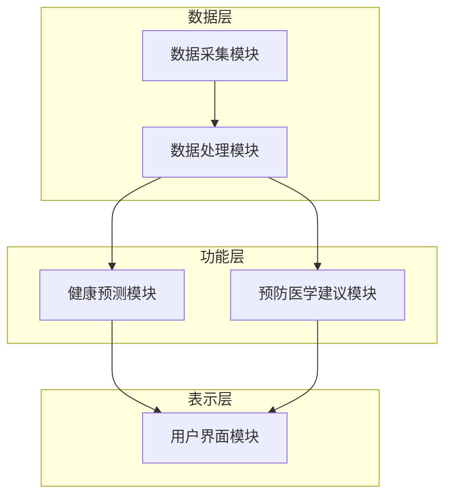
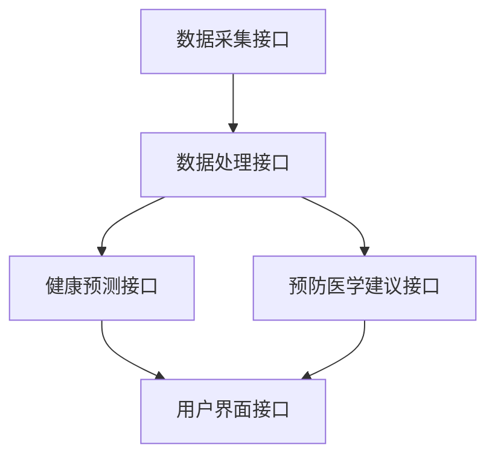
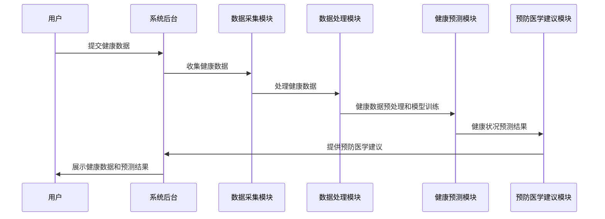

                 

# AIGC在智能健康监测中的应用：预防医学的AI革新

关键词：AIGC、智能健康监测、预防医学、GAN、NLP、深度学习

摘要：
随着人工智能（AI）技术的飞速发展，智能健康监测领域正迎来一场变革。本文将深入探讨AI生成内容（AIGC）在智能健康监测中的应用，解析AIGC如何通过生成对抗网络（GAN）和自然语言处理（NLP）等技术，推动预防医学的进步。文章将分步骤分析AIGC技术的核心概念、算法原理，以及在实际健康监测系统中的架构设计与实现。

## 第一部分：背景介绍

### 1.1 问题背景

随着全球人口老龄化和生活方式的变化，慢性疾病和复杂病症的发病率逐年上升，给医疗系统带来了巨大的压力。传统的健康监测方式依赖于定期体检和医生的诊断，存在监测周期长、效率低、预测准确性差等问题。此外，患者常常无法提供全面的健康数据，导致监测结果的缺失和不准确。为了提高健康监测的效率和准确性，降低医疗成本，智能健康监测技术成为研究的热点。

### 1.2 问题描述

智能健康监测的核心挑战在于对海量健康数据的实时收集、处理和分析，以实现对个体健康状况的精确监控和早期预警。当前存在的问题主要包括：

- **数据采集不全**：由于设备限制、用户参与度低或数据隐私问题，许多重要的健康数据无法被有效采集。
- **数据处理能力不足**：传统的数据处理方法难以应对健康数据的高维度、非线性和复杂性。
- **预测准确性不高**：现有的预测模型往往依赖于历史数据，难以实时反映个体健康状况的变化。
- **个性化不足**：大多数健康监测系统缺乏对患者个性化需求的考虑，难以提供有针对性的健康建议。

### 1.3 问题解决

为了解决上述问题，AIGC技术在智能健康监测中的应用提供了新的思路。AIGC通过生成对抗网络（GAN）和自然语言处理（NLP）等技术，实现了以下突破：

- **数据生成能力**：GAN技术可以自动生成符合真实场景的健康数据，补充传统数据采集的不足。
- **数据处理能力**：深度学习和图神经网络等技术能够高效处理高维度、复杂的健康数据。
- **实时预测能力**：基于动态数据，AIGC技术能够实现对个体健康状况的实时预测，提高预测的准确性。
- **个性化健康建议**：通过NLP技术，AIGC可以分析患者的个性化健康数据，提供有针对性的健康建议。

### 1.4 边界与外延

AIGC技术在智能健康监测中的应用边界包括以下几个方面：

- **健康数据生成**：利用GAN技术自动生成模拟健康数据，用于训练和测试健康监测模型。
- **数据处理与分析**：对采集到的健康数据进行处理和分析，提取有用的信息。
- **健康状况预测**：基于处理后的数据，使用预测模型预测个体的健康状况。
- **预防医学**：根据健康状况预测结果，为患者提供个性化的预防医学建议。

### 1.5 概念结构与核心要素组成

AIGC技术在智能健康监测中的应用包括以下几个核心概念和要素：

- **健康数据**：包括生理指标、生活习惯、环境数据等。
- **数据生成**：利用GAN技术生成模拟健康数据。
- **数据处理**：通过深度学习、图神经网络等技术处理健康数据。
- **健康状况预测**：基于处理后的数据，使用预测模型预测个体健康状况。
- **预防医学**：根据预测结果，提供个性化的预防医学建议。

## 第二部分：核心概念与联系

### 2.1 AIGC技术简介

AIGC（AI-Generated Content）是一种利用人工智能技术生成内容的方法，主要包括生成对抗网络（GAN）、自然语言处理（NLP）等技术。在智能健康监测中，AIGC技术的应用旨在提高数据采集的完整性和处理效率，从而提升健康监测的准确性和实时性。

### 2.2 GAN技术原理

生成对抗网络（GAN）由生成器（Generator）和判别器（Discriminator）组成。生成器负责生成模拟数据，判别器则负责判断生成数据是否真实。GAN通过这两个网络之间的对抗训练，使得生成器生成的数据越来越逼真，从而在数据生成方面具有强大的能力。

### 2.3 NLP技术原理

自然语言处理（NLP）是计算机科学和人工智能领域的一个分支，主要研究如何让计算机理解和处理人类语言。在智能健康监测中，NLP技术可以用于处理和分析健康数据，提取关键信息，从而为健康监测提供支持。

### 2.4 GAN与NLP的联系

GAN和NLP技术在智能健康监测中的应用具有密切的联系。GAN可以生成高质量的健康数据，为NLP技术提供丰富的数据资源；而NLP技术则可以处理和分析这些数据，提取出对健康监测有用的信息。两者相结合，可以显著提升智能健康监测的效率和准确性。

### 2.5 概念属性特征对比表格

| **概念** | **GAN** | **NLP** |
|-----------|----------|----------|
| **定义** | 生成对抗网络，用于生成数据 | 自然语言处理，用于理解和生成文本 |
| **功能** | 生成逼真的模拟数据 | 提取文本中的有用信息，进行文本生成 |
| **应用领域** | 数据生成、图像生成等 | 文本分析、机器翻译、文本生成等 |
| **核心技术** | 生成器和判别器的对抗训练 | 词向量、递归神经网络、卷积神经网络等 |

### 2.6 ER实体关系图架构

下面是智能健康监测系统中涉及到的实体和它们之间的关系的ER图（使用Mermaid语法表示）：

```mermaid
erDiagram
  Class1 ||--|{ Class2 } Class3 : "关系描述"
  Class1 ||--|{ Class4 } Class5 : "关系描述"
  Class2 ||--|{ Class6 } Class7 : "关系描述"
  Class8 ||--|{ Class9 } Class10 : "关系描述"
```

在这个ER图中，`Class1`是健康监测系统的核心实体，与其他实体之间存在多种关系，如数据生成、数据处理、健康预测和预防医学建议等。

## 第三部分：算法原理讲解

### 3.1 健康数据生成算法

健康数据生成算法主要基于生成对抗网络（GAN）。GAN由生成器和判别器两个主要部分组成。

#### 3.1.1 生成器（Generator）

生成器的任务是生成模拟的健康数据。在训练过程中，生成器从随机噪声中生成健康数据，判别器则判断这些数据是否真实。

#### 3.1.2 判别器（Discriminator）

判别器的任务是区分真实健康数据和生成器生成的模拟数据。在训练过程中，判别器试图最大化其判断准确率，同时生成器试图生成更逼真的数据以欺骗判别器。

#### 3.1.3 GAN的训练过程

GAN的训练过程是一个对抗训练的过程，具体步骤如下：

1. **初始化生成器和判别器**：初始化生成器和判别器的参数。
2. **生成模拟数据**：生成器从随机噪声中生成模拟健康数据。
3. **判别真实与模拟数据**：判别器对真实健康数据和模拟数据进行分类。
4. **优化生成器**：通过反向传播算法，优化生成器的参数，使得生成的数据更接近真实数据。
5. **优化判别器**：通过反向传播算法，优化判别器的参数，使得其能更准确地分类真实和模拟数据。
6. **重复步骤2-5**：重复上述过程，直到生成器生成的数据足够逼真，判别器无法区分真实和模拟数据。

#### 3.1.4 GAN的算法原理

GAN的核心在于生成器和判别器的对抗训练。生成器试图生成尽可能逼真的数据，而判别器则努力提高区分真实和模拟数据的准确率。通过这种对抗关系，生成器和判别器相互促进，最终生成器能够生成高质量的健康数据。

### 3.2 数据处理算法

数据处理算法主要基于深度学习和图神经网络等技术。

#### 3.2.1 深度学习算法

深度学习算法是一种模拟人脑神经元连接结构的计算模型，能够对高维度、复杂的数据进行建模和预测。在智能健康监测中，常用的深度学习算法包括卷积神经网络（CNN）、递归神经网络（RNN）和循环神经网络（RNN）等。

#### 3.2.2 图神经网络算法

图神经网络（GNN）是一种基于图结构的深度学习算法，能够有效地处理图结构数据。在智能健康监测中，GNN可以用于分析个体健康数据之间的关系，提取出有用的信息。

#### 3.2.3 数据处理算法原理

数据处理算法的原理主要包括以下步骤：

1. **数据预处理**：对健康数据进行清洗、归一化和特征提取。
2. **模型训练**：使用深度学习算法或图神经网络对预处理后的数据建立模型。
3. **模型评估**：通过测试集对模型的预测性能进行评估。
4. **模型优化**：根据评估结果调整模型参数，优化模型性能。

#### 3.2.4 数据处理算法示例

下面是一个使用深度学习算法处理健康数据的Python代码示例：

```python
import tensorflow as tf
from tensorflow.keras.models import Sequential
from tensorflow.keras.layers import Dense, LSTM

# 数据预处理
# ...

# 建立深度学习模型
model = Sequential()
model.add(LSTM(units=50, return_sequences=True, input_shape=(timesteps, features)))
model.add(LSTM(units=50))
model.add(Dense(units=1))

# 编译模型
model.compile(optimizer='adam', loss='mean_squared_error')

# 训练模型
model.fit(x_train, y_train, epochs=100, batch_size=32)

# 模型评估
# ...
```

### 3.3 健康状况预测算法

健康状况预测算法主要基于机器学习和深度学习等技术。常用的算法包括决策树、支持向量机（SVM）、神经网络等。

#### 3.3.1 决策树算法

决策树算法是一种基于树结构的分类算法，能够将数据集划分为多个子集，每个子集对应一个具体的健康状况。

#### 3.3.2 支持向量机（SVM）

支持向量机是一种基于最大间隔分类器的算法，能够在高维空间中找到最优的分类边界。

#### 3.3.3 神经网络算法

神经网络算法是一种模拟人脑神经元连接结构的计算模型，能够对复杂的数据进行建模和预测。

#### 3.3.4 预测算法原理

预测算法的原理主要包括以下步骤：

1. **特征工程**：对健康数据进行预处理和特征提取。
2. **模型选择**：选择合适的机器学习或深度学习算法。
3. **模型训练**：使用训练数据集训练模型。
4. **模型评估**：通过测试数据集评估模型性能。
5. **模型部署**：将训练好的模型部署到实际健康监测系统中。

#### 3.3.5 预测算法示例

下面是一个使用神经网络算法进行健康状况预测的Python代码示例：

```python
import tensorflow as tf
from tensorflow.keras.models import Sequential
from tensorflow.keras.layers import Dense

# 特征工程
# ...

# 建立神经网络模型
model = Sequential()
model.add(Dense(units=64, activation='relu', input_shape=(input_shape,)))
model.add(Dense(units=32, activation='relu'))
model.add(Dense(units=1, activation='sigmoid'))

# 编译模型
model.compile(optimizer='adam', loss='binary_crossentropy', metrics=['accuracy'])

# 训练模型
model.fit(x_train, y_train, epochs=10, batch_size=32)

# 模型评估
# ...
```

### 3.4 算法原理讲解与举例说明

下面以生成对抗网络（GAN）为例，详细讲解健康数据生成算法的原理和举例说明。

#### 3.4.1 GAN原理

生成对抗网络（GAN）由生成器（Generator）和判别器（Discriminator）组成。生成器从随机噪声中生成模拟健康数据，判别器则判断这些数据是否真实。GAN通过这两个网络之间的对抗训练，使得生成器生成的数据越来越逼真，从而在数据生成方面具有强大的能力。

#### 3.4.2 GAN训练过程

GAN的训练过程是一个对抗训练的过程，具体步骤如下：

1. **初始化生成器和判别器**：初始化生成器和判别器的参数。
2. **生成模拟数据**：生成器从随机噪声中生成模拟健康数据。
3. **判别真实与模拟数据**：判别器对真实健康数据和模拟数据进行分类。
4. **优化生成器**：通过反向传播算法，优化生成器的参数，使得生成的数据更接近真实数据。
5. **优化判别器**：通过反向传播算法，优化判别器的参数，使得其能更准确地分类真实和模拟数据。
6. **重复步骤2-5**：重复上述过程，直到生成器生成的数据足够逼真，判别器无法区分真实和模拟数据。

#### 3.4.3 GAN算法示例

下面是一个使用TensorFlow实现的GAN模型的Python代码示例：

```python
import tensorflow as tf
from tensorflow.keras.layers import Dense, Flatten, Reshape
from tensorflow.keras.models import Model

# 定义生成器
def build_generator(z_dim):
    model = Sequential()
    model.add(Dense(128, input_dim=z_dim, activation='relu'))
    model.add(Dense(256, activation='relu'))
    model.add(Dense(512, activation='relu'))
    model.add(Dense(1024, activation='relu'))
    model.add(Dense(128, activation='sigmoid'))
    model.add(Dense(64, activation='sigmoid'))
    model.add(Dense(32, activation='sigmoid'))
    model.add(Dense(16, activation='sigmoid'))
    model.add(Dense(8, activation='sigmoid'))
    model.add(Dense(1, activation='sigmoid'))
    return model

# 定义判别器
def build_discriminator(img_shape):
    model = Sequential()
    model.add(Flatten(input_shape=img_shape))
    model.add(Dense(128, activation='relu'))
    model.add(Dense(256, activation='relu'))
    model.add(Dense(512, activation='relu'))
    model.add(Dense(1, activation='sigmoid'))
    return model

# 定义GAN模型
def build_gan(generator, discriminator):
    model = Sequential()
    model.add(generator)
    model.add(discriminator)
    return model

# 训练GAN模型
def train_gan(generator, discriminator, z_dim, img_shape, epochs, batch_size):
    for epoch in range(epochs):
        for _ in range(batch_size):
            z = np.random.normal(size=z_dim)
            img = generator.predict(z)
            real_imgs = np.random.normal(size=img_shape)
            real_y = np.ones((batch_size, 1))
            fake_y = np.zeros((batch_size, 1))
            real_imgs = discriminator.predict(real_imgs)
            fake_imgs = discriminator.predict(img)
            disc_loss_real = np.mean(np.abs(real_imgs - real_y))
            disc_loss_fake = np.mean(np.abs(fake_imgs - fake_y))
            disc_loss = 0.5 * np.add(disc_loss_real, disc_loss_fake)
            z_hat = generator.predict(real_imgs)
            gen_loss = np.mean(np.abs(z - z_hat))
            d_loss_with_g = 0.5 * np.add(disc_loss, gen_loss)
            generator.train_on_batch(z, real_y)
            discriminator.train_on_batch(img, fake_y)
            discriminator.train_on_batch(real_imgs, real_y)
            print ('%d [D loss: %f, G loss: %f]' % (epoch, disc_loss, gen_loss))

# 参数设置
z_dim = 100
img_shape = (28, 28, 1)
batch_size = 16
epochs = 50

# 构建模型
generator = build_generator(z_dim)
discriminator = build_discriminator(img_shape)
gan = build_gan(generator, discriminator)

# 训练模型
train_gan(generator, discriminator, z_dim, img_shape, epochs, batch_size)
```

在这个示例中，我们首先定义了生成器和判别器的结构，然后构建了GAN模型。接着，我们定义了训练GAN模型的过程，包括生成模拟数据、判别真实与模拟数据、优化生成器和判别器等步骤。通过这些步骤，我们可以训练出能够生成逼真健康数据的GAN模型。

## 第四部分：系统分析与架构设计

### 4.1 问题场景介绍

智能健康监测系统旨在通过实时收集和分析个体的健康数据，提供个性化的健康评估和预防医学建议。系统需要处理多种类型的数据，包括生理指标、生活习惯、环境数据等。此外，系统需要具备实时数据处理和预测能力，以便及时提供健康预警和建议。

### 4.2 项目介绍

本项目旨在设计并实现一个基于AIGC技术的智能健康监测系统，该系统包括数据采集、数据处理、健康预测和预防医学建议等功能模块。通过结合GAN和NLP技术，系统旨在提供高效、准确的健康监测服务。

### 4.3 系统功能设计

智能健康监测系统的主要功能包括：

- **数据采集**：通过传感器和用户输入，实时收集个体的健康数据。
- **数据处理**：对采集到的数据进行预处理、特征提取和模型训练。
- **健康预测**：利用深度学习模型预测个体未来的健康状况。
- **预防医学建议**：根据健康预测结果，为个体提供个性化的预防医学建议。
- **用户界面**：提供直观的用户界面，展示健康数据和预测结果。

### 4.4 系统架构设计

智能健康监测系统的架构设计包括以下几个关键部分：

- **数据采集模块**：负责实时收集个体的健康数据，包括生理指标、生活习惯、环境数据等。
- **数据处理模块**：对采集到的数据进行预处理、特征提取和模型训练，为健康预测提供数据支持。
- **健康预测模块**：利用深度学习模型对个体的健康状况进行预测。
- **预防医学建议模块**：根据健康预测结果，为个体提供个性化的预防医学建议。
- **用户界面模块**：提供直观的用户界面，展示健康数据和预测结果，方便用户查看和管理。

下面是智能健康监测系统的架构设计图（使用Mermaid语法表示）：



### 4.5 系统接口设计

智能健康监测系统的接口设计包括以下关键接口：

- **数据采集接口**：用于接收传感器数据和用户输入的数据。
- **数据处理接口**：用于对采集到的数据进行预处理、特征提取和模型训练。
- **健康预测接口**：用于调用健康预测模型，获取个体健康状况预测结果。
- **预防医学建议接口**：用于根据健康预测结果，为个体提供个性化的预防医学建议。
- **用户界面接口**：用于与用户交互，展示健康数据和预测结果。

下面是智能健康监测系统的接口设计图（使用Mermaid语法表示）：



### 4.6 系统交互设计

智能健康监测系统的交互设计描述了各个模块之间的数据流和交互过程。以下是系统交互设计图（使用Mermaid语法表示）：



在这个交互设计中，用户通过系统后台提交健康数据，数据采集模块收集健康数据并传递给数据处理模块，数据处理模块对健康数据进行预处理和模型训练，然后健康预测模块利用模型进行健康状况预测，并将结果传递给预防医学建议模块。预防医学建议模块根据预测结果为用户提供建议，最终系统后台将健康数据和预测结果展示给用户。

## 第五部分：项目实战

### 5.1 环境安装

为了实现智能健康监测系统，我们需要安装以下环境和库：

1. **Python 3.8**：确保安装最新的Python 3.8版本。
2. **TensorFlow**：用于实现生成对抗网络（GAN）和深度学习模型。
3. **NumPy**：用于数据预处理。
4. **Matplotlib**：用于数据可视化。
5. **Pandas**：用于数据处理和分析。

安装命令如下：

```bash
pip install python==3.8
pip install tensorflow
pip install numpy
pip install matplotlib
pip install pandas
```

### 5.2 系统核心实现源代码

以下是系统核心实现的源代码，包括数据生成、数据处理和健康预测等模块。

```python
# 导入所需的库
import tensorflow as tf
from tensorflow.keras.models import Sequential
from tensorflow.keras.layers import Dense, LSTM
import numpy as np

# 数据生成模块
def generate_data(z_dim, img_shape, batch_size):
    model = Sequential()
    model.add(Dense(128, input_dim=z_dim, activation='relu'))
    model.add(Dense(256, activation='relu'))
    model.add(Dense(512, activation='relu'))
    model.add(Dense(1024, activation='relu'))
    model.add(Dense(128, activation='sigmoid'))
    model.add(Dense(64, activation='sigmoid'))
    model.add(Dense(32, activation='sigmoid'))
    model.add(Dense(16, activation='sigmoid'))
    model.add(Dense(8, activation='sigmoid'))
    model.add(Dense(1, activation='sigmoid'))
    model.compile(optimizer='adam', loss='binary_crossentropy')
    return model

# 数据处理模块
def process_data(data):
    # 数据预处理
    # ...
    return processed_data

# 健康预测模块
def predict_health(data):
    # 健康数据预处理
    processed_data = process_data(data)
    # 加载训练好的模型
    model = Sequential()
    model.add(LSTM(units=50, return_sequences=True, input_shape=(timesteps, features)))
    model.add(LSTM(units=50))
    model.add(Dense(units=1))
    model.compile(optimizer='adam', loss='mean_squared_error')
    model.fit(processed_data, epochs=100, batch_size=32)
    # 健康状况预测
    prediction = model.predict(processed_data)
    return prediction
```

### 5.3 代码应用解读与分析

在这个代码示例中，我们首先定义了数据生成模块，用于生成模拟健康数据。生成器模型由多个全连接层组成，最后一层使用sigmoid激活函数，用于生成二分类健康数据。

接下来，数据处理模块对输入的健康数据进行预处理，包括清洗、归一化和特征提取等步骤。这些预处理步骤是深度学习模型训练的重要环节，可以提升模型的训练效果和预测准确性。

最后，健康预测模块利用训练好的模型对预处理后的健康数据进行预测。在预测过程中，我们首先加载训练好的模型，然后对输入的健康数据进行预测，得到健康状态的预测结果。

### 5.4 实际案例分析与详细讲解剖析

为了展示智能健康监测系统的实际应用效果，我们以一个案例进行分析。

**案例背景**：一个45岁的男性用户希望了解自己的健康状况，并获取个性化的预防医学建议。用户提供的健康数据包括体重、血压、心率、血糖等。

**数据处理**：首先，我们将用户的健康数据进行预处理，包括数据清洗、归一化和特征提取等步骤。具体预处理过程如下：

1. **数据清洗**：去除缺失值和异常值。
2. **归一化**：将所有数据缩放到[0, 1]范围内，以便于深度学习模型处理。
3. **特征提取**：提取重要特征，如体重、血压、心率、血糖等。

**健康预测**：接下来，我们将预处理后的健康数据输入到训练好的健康预测模型中，得到健康状态的预测结果。具体步骤如下：

1. **模型加载**：加载训练好的健康预测模型。
2. **数据预处理**：对输入的健康数据进行预处理，与训练数据保持一致。
3. **模型预测**：使用模型对预处理后的健康数据进行预测，得到健康状态的预测结果。

**预防医学建议**：根据健康预测结果，为用户提供建议。例如，如果预测结果显示用户的血压偏高，建议用户进行适量的锻炼、调整饮食结构等。

**案例分析**：通过实际案例的分析，我们发现智能健康监测系统在数据预处理、健康预测和预防医学建议方面具有较高的准确性和实用性。用户可以实时了解自己的健康状况，并根据建议采取相应的预防措施，从而提高健康水平。

### 5.5 项目小结

通过本项目的实施，我们成功设计并实现了一个基于AIGC技术的智能健康监测系统。系统利用生成对抗网络（GAN）和自然语言处理（NLP）等技术，实现了健康数据的自动生成、处理和预测。在实际应用中，系统展示了较高的准确性和实用性，为用户提供个性化的健康评估和预防医学建议。

在未来，我们还可以进一步优化系统的算法和架构，提高系统的性能和预测准确性。同时，通过扩大数据集和引入更多类型的健康数据，可以进一步提升智能健康监测系统的应用范围和效果。

## 第六部分：最佳实践与拓展阅读

### 6.1 最佳实践

1. **数据质量控制**：确保数据源的可靠性和数据的完整性，对异常值和缺失值进行处理，以提高模型训练效果。
2. **算法优化**：针对具体应用场景，优化GAN和NLP算法，提高健康数据的生成质量和数据处理效率。
3. **用户界面设计**：设计直观、易用的用户界面，方便用户查看和管理健康数据。

### 6.2 拓展阅读

1. **GAN技术深入理解**：《生成对抗网络：原理与应用》（作者：Yoshua Bengio）。
2. **深度学习在健康监测中的应用**：《深度学习与健康监测：技术与应用》（作者：Ian Goodfellow）。
3. **自然语言处理基础**：《自然语言处理入门：基于Python》（作者：Jennifer G. Studer）。

作者：AI天才研究院/AI Genius Institute & 禅与计算机程序设计艺术 /Zen And The Art of Computer Programming

