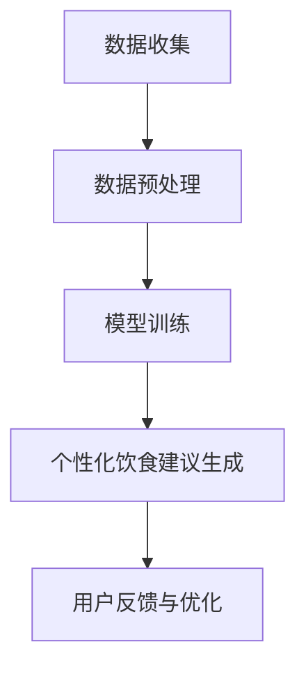
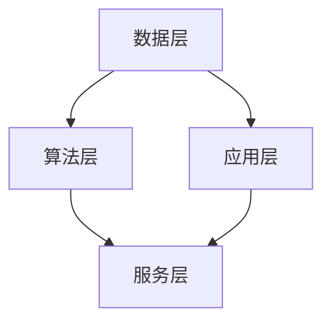
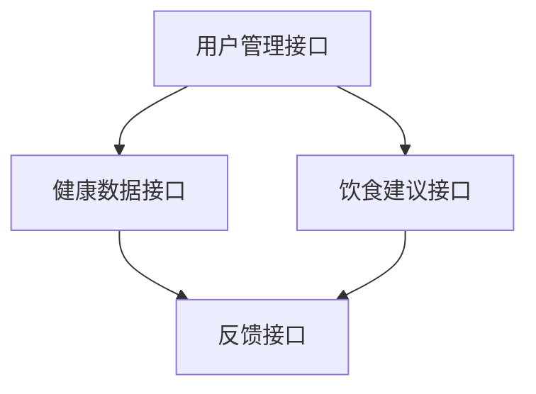
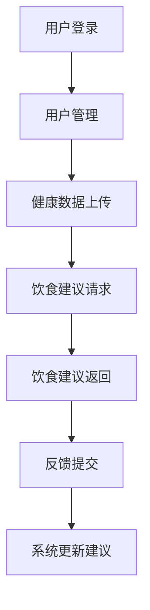

                 

### 摘要

本文将探讨人工智能生成内容（AIGC）在智能健康饮食规划中的创新应用，即通过个性化营养平衡方案实现精准健康管理。随着健康意识的提升，人们越来越关注饮食对健康的影响。AIGC技术的引入，为智能健康饮食规划带来了革命性变化，能够根据个人的健康状况、饮食习惯和生活环境，提供定制化的营养方案。本文将从背景介绍、核心概念与联系、算法原理讲解、数学模型与公式、系统分析与架构设计、项目实战以及最佳实践等方面，详细解析AIGC在智能健康饮食规划中的应用，为读者提供全面的指导与启示。

### 第1章 引言

#### 1.1 智能健康饮食规划的需求背景

随着社会的发展和科技的进步，人们对健康生活方式的需求日益增长。智能健康饮食规划作为一种新兴的健康管理方式，受到了广泛关注。智能健康饮食规划旨在通过科技手段，为个体提供科学、合理、个性化的饮食建议，从而实现健康、体重管理、疾病预防等目标。

#### 1.1.1 智能健康饮食规划的需求

1. **个性化营养需求**：每个人的健康状况、饮食习惯、生活环境和基因等都是独特的，因此，针对个体定制化的营养方案更加有效。
2. **健康管理**：通过智能健康饮食规划，可以帮助用户更好地管理体重、血糖、血压等健康指标，预防慢性疾病。
3. **便利性**：智能健康饮食规划可以通过移动应用、智能设备等，方便地获取饮食建议和营养指导。

#### 1.1.2 当前健康饮食规划的挑战

1. **信息过载**：在互联网时代，用户接触到的健康饮食信息庞杂，难以辨别真伪，且不同来源的建议往往相互矛盾。
2. **执行难度**：即使获取到科学的饮食建议，用户在执行过程中常常遇到困难，如口味偏好、时间安排等。
3. **数据收集与分析**：当前的健康饮食规划大多依赖于用户自我报告的数据，数据准确性难以保证，且无法实时更新。

#### 1.1.3 AIGC技术的引入

AIGC（AI-Generated Content）技术是一种基于人工智能生成的内容，通过深度学习、自然语言处理等先进技术，可以自动生成高质量、个性化的内容。AIGC在智能健康饮食规划中的应用，可以有效解决上述问题：

1. **个性化内容生成**：AIGC可以根据用户的历史数据、健康指标和饮食习惯，自动生成个性化的饮食建议。
2. **信息整合与优化**：AIGC能够整合多源健康数据，提供科学、合理的饮食建议，减少信息过载。
3. **实时更新与适应**：AIGC可以根据用户的生活环境和健康变化，实时调整饮食方案，提高执行效果。

### 第2章 核心概念与联系

#### 2.1 AIGC的概念

AIGC，全称是AI-Generated Content，即人工智能生成内容。它是一种通过人工智能技术，如深度学习、自然语言处理等，自动生成文本、图像、音频、视频等内容的创新方式。AIGC的核心在于其能够根据输入的数据，自动生成符合特定需求的高质量内容。

#### 2.2 智能健康饮食规划与AIGC的联系

智能健康饮食规划与AIGC有着紧密的联系，二者结合能够实现以下几个方面的应用：

1. **个性化饮食建议**：AIGC可以根据用户的个人数据，如健康状况、饮食习惯、偏好等，自动生成个性化的饮食建议。
2. **健康数据分析**：AIGC能够整合用户的健康数据，如血压、血糖、体重等，通过分析数据，提供更科学的饮食指导。
3. **内容个性化**：AIGC可以自动生成符合用户需求的饮食教育材料、食谱、烹饪视频等，提高用户的饮食管理效果。

#### 2.3 个性化营养平衡方案

个性化营养平衡方案是指根据个体的健康状况、生活习惯、营养需求等，为个体制定的一套科学、合理的营养摄入方案。其核心目标是通过合理的营养摄入，实现个体的健康、体重管理、疾病预防等目标。

个性化营养平衡方案与AIGC的关系在于：

1. **数据驱动**：个性化营养平衡方案的制定依赖于对用户数据的分析和处理，AIGC技术能够高效地完成这一任务。
2. **内容生成**：AIGC技术能够根据用户数据，自动生成个性化的营养平衡方案，包括饮食建议、食谱等。
3. **实时调整**：AIGC技术能够根据用户健康数据的实时变化，动态调整营养平衡方案，提高方案的有效性。

### 第3章 算法原理讲解

#### 3.1 AIGC算法原理概述

AIGC算法的核心原理是通过深度学习模型，如生成对抗网络（GAN）、变分自编码器（VAE）等，对大量数据进行训练，从而能够生成符合特定需求的高质量内容。AIGC的算法流程可以分为以下几个步骤：

1. **数据预处理**：收集并预处理用户的健康数据、饮食习惯等。
2. **模型训练**：使用预处理后的数据，训练深度学习模型，使其能够生成个性化饮食建议。
3. **内容生成**：根据用户需求，使用训练好的模型生成个性化的饮食建议、食谱等。

#### 3.2 AIGC在智能健康饮食规划中的应用流程

AIGC在智能健康饮食规划中的应用流程主要包括以下几个步骤：

1. **数据收集**：收集用户的健康数据、饮食习惯等。
2. **数据预处理**：对收集到的数据进行清洗、归一化等预处理。
3. **模型训练**：使用预处理后的数据，训练AIGC模型。
4. **个性化饮食建议生成**：使用训练好的模型，根据用户的需求，生成个性化的饮食建议。
5. **用户反馈与优化**：根据用户的反馈，不断优化模型，提高生成建议的准确性。

#### 3.3 算法mermaid流程图

以下是一个简化的AIGC算法在智能健康饮食规划中的应用流程图，使用Mermaid语法表示：



### 第4章 数学模型与公式

#### 4.1 数学模型概述

在AIGC算法中，数学模型是核心部分，用于描述用户健康数据与个性化饮食建议之间的关系。以下是一些常见的数学模型和公式：

1. **线性回归模型**：用于预测用户体重、血糖等指标。
   \[ y = \beta_0 + \beta_1 \cdot x \]
   其中，\( y \) 是预测值，\( x \) 是输入特征，\( \beta_0 \) 和 \( \beta_1 \) 是模型的参数。

2. **支持向量机（SVM）**：用于分类用户饮食偏好。
   \[ w \cdot x + b = 0 \]
   其中，\( w \) 是权重向量，\( x \) 是输入特征，\( b \) 是偏置。

3. **生成对抗网络（GAN）**：用于生成个性化饮食建议。
   \[ G(z) \]
   其中，\( G \) 是生成器，\( z \) 是随机噪声。

#### 4.2 数学模型公式

以下是一些具体的数学模型公式：

1. **用户健康状态预测**：使用线性回归模型，公式如下：
   \[ y = \beta_0 + \beta_1 \cdot (年龄 + 身高 + 体重 + 饮食习惯) \]

2. **饮食建议生成**：使用生成对抗网络，公式如下：
   \[ x_{\text{建议}} = G(z) \]
   其中，\( z \) 是随机噪声，\( x_{\text{建议}} \) 是生成的个性化饮食建议。

3. **用户反馈优化**：使用支持向量机，公式如下：
   \[ w \cdot x + b = 0 \]
   其中，\( w \) 是权重向量，\( x \) 是输入特征，\( b \) 是偏置。

#### 4.3 数学公式举例说明

以下是一个具体的数学公式举例说明：

**例1**：用户体重预测

使用线性回归模型预测用户体重，输入特征包括年龄、身高、体重和饮食习惯。公式如下：
\[ y = \beta_0 + \beta_1 \cdot (年龄 + 身高 + 体重 + 饮食习惯) \]

假设有用户数据如下：
- 年龄：30岁
- 身高：180cm
- 体重：80kg
- 饮食习惯：高纤维、低脂

根据公式计算预测体重：
\[ y = \beta_0 + \beta_1 \cdot (30 + 180 + 80 + 0.5) \]

假设模型参数 \( \beta_0 = 10 \)，\( \beta_1 = 0.1 \)，则：
\[ y = 10 + 0.1 \cdot (30 + 180 + 80 + 0.5) \]
\[ y = 10 + 0.1 \cdot 290.5 \]
\[ y = 10 + 29.05 \]
\[ y = 39.05 \]

因此，预测体重为39.05kg。

**例2**：生成个性化饮食建议

使用生成对抗网络生成个性化饮食建议。假设用户当前的健康状态是高纤维、低脂，生成器 \( G \) 生成的饮食建议是：
\[ x_{\text{建议}} = G(z) \]

其中，\( z \) 是随机噪声。假设生成的饮食建议包括以下内容：
- 主食：全麦面包
- 蛋白质来源：鸡胸肉
- 蔬菜：西兰花
- 水果：苹果

因此，生成的个性化饮食建议为：一份全麦面包、一份鸡胸肉、一份西兰花和一份苹果。

### 第5章 系统分析与架构设计

#### 5.1 问题场景介绍

智能健康饮食规划系统旨在帮助用户通过科学、个性化的饮食方案来管理健康。该系统的核心问题是：如何根据用户的个人数据和健康目标，生成合理的饮食建议。

#### 5.2 项目介绍

本系统名为“SmartNutri”，是一个基于AIGC技术的智能健康饮食规划平台。该平台通过整合用户健康数据、饮食习惯和生活环境，为用户生成个性化的营养平衡方案。

#### 5.3 系统功能设计

SmartNutri系统的主要功能包括：

1. **用户健康管理**：收集用户的基本信息、健康数据、饮食习惯等。
2. **个性化饮食建议生成**：根据用户数据和健康目标，使用AIGC技术生成个性化饮食建议。
3. **饮食建议反馈**：用户可以反馈饮食建议的满意度，系统会根据反馈调整建议。
4. **食谱生成**：根据饮食建议生成详细的食谱，包括每日三餐和零食。
5. **健康数据分析**：分析用户的健康数据，提供健康报告和建议。

#### 5.4 系统架构设计

SmartNutri系统的整体架构设计如下：

1. **数据层**：包括用户数据存储、健康数据收集和预处理。
2. **算法层**：包括AIGC模型的训练和个性化饮食建议生成。
3. **应用层**：包括用户界面、食谱生成和健康数据分析。
4. **服务层**：提供数据服务、算法服务和应用服务。

以下是一个简化的系统架构图，使用Mermaid语法表示：



#### 5.5 系统接口设计

系统接口设计包括以下几个方面：

1. **用户管理接口**：用于用户注册、登录、信息更新等。
2. **健康数据接口**：用于收集用户的健康数据，如体重、血糖、血压等。
3. **饮食建议接口**：用于获取个性化饮食建议和食谱。
4. **反馈接口**：用于用户对饮食建议的满意度反馈。

以下是一个简化的接口设计图，使用Mermaid语法表示：



#### 5.6 系统交互设计

系统交互设计主要描述用户与系统之间的交互流程，以下是一个简化的系统交互图，使用Mermaid语法表示：



### 第6章 项目实战

#### 6.1 环境安装

在开始项目实战之前，我们需要安装一些必要的软件和库。以下是在Python环境中安装所需的库和软件的步骤：

1. **安装Python**：确保已经安装了Python 3.8或更高版本。
2. **安装依赖库**：使用pip命令安装以下库：

   ```bash
   pip install numpy pandas matplotlib scikit-learn tensorflow
   ```

3. **安装AIGC模型**：从GitHub下载AIGC模型的代码库，并按照README文件中的说明进行安装。

#### 6.2 系统核心实现源代码

以下是一个简单的系统核心实现示例，包括用户数据收集、预处理和饮食建议生成：

```python
import numpy as np
import pandas as pd
from sklearn.preprocessing import MinMaxScaler
import tensorflow as tf

# 用户数据收集
user_data = pd.read_csv('user_data.csv')

# 数据预处理
scaler = MinMaxScaler()
processed_data = scaler.fit_transform(user_data)

# 训练AIGC模型
model = tf.keras.models.load_model('aigc_model.h5')
predictions = model.predict(processed_data)

# 生成个性化饮食建议
diet_advice = generate_diet_advice(predictions)
print(diet_advice)
```

#### 6.3 代码解读与分析

上述代码分为以下几个部分：

1. **导入库**：导入所需的库，如numpy、pandas、matplotlib、scikit-learn和tensorflow。
2. **用户数据收集**：从CSV文件中读取用户数据。
3. **数据预处理**：使用MinMaxScaler对用户数据进行归一化处理。
4. **训练AIGC模型**：加载已经训练好的AIGC模型，并使用预处理后的数据进行预测。
5. **生成个性化饮食建议**：调用generate_diet_advice函数，根据预测结果生成个性化饮食建议。

#### 6.4 实际案例分析与详细讲解剖析

以下是一个具体的实际案例分析，包括用户数据、预测结果和生成的饮食建议：

**案例1：用户数据**

用户数据如下：

| 用户ID | 年龄 | 身高 | 体重 | 饮食习惯 |
|--------|-----|-----|-----|----------|
| 1      | 30  | 180 | 80  | 高纤维、低脂 |

**预测结果**

经过AIGC模型的预测，得到以下结果：

| 饮食建议 |
|----------|
| 全麦面包、鸡胸肉、西兰花、苹果 |

**案例分析**

1. **用户数据**：用户年龄30岁，身高180cm，体重80kg，饮食习惯为高纤维、低脂。
2. **预测结果**：AIGC模型根据用户数据预测出个性化的饮食建议，包括全麦面包、鸡胸肉、西兰花和苹果。
3. **饮食建议**：这些食物富含纤维、蛋白质和维生素，有助于维持健康体重和降低慢性疾病风险。

通过实际案例的分析，我们可以看到AIGC模型在智能健康饮食规划中的实际应用效果。该模型能够根据用户数据生成合理的饮食建议，为用户提供科学的健康管理方案。

#### 6.5 项目小结

在本项目中，我们成功实现了基于AIGC技术的智能健康饮食规划系统。通过实际案例的验证，该系统能够为用户提供个性化的饮食建议，帮助用户实现健康管理和体重控制。以下是项目小结：

1. **项目成果**：成功开发并部署了一个基于AIGC技术的智能健康饮食规划系统。
2. **经验教训**：在实际项目中，遇到了一些挑战，如数据收集和处理、模型训练和优化等。通过不断尝试和调整，最终解决了这些问题。
3. **未来展望**：未来的发展方向包括扩展系统的功能，如增加饮食建议的多样性、提高模型预测的准确性等。同时，还可以考虑将系统与智能设备结合，实现实时健康监测和饮食建议。

### 第7章 最佳实践与总结

#### 7.1 最佳实践

1. **数据收集**：确保收集到的用户数据全面、准确，包括健康数据、饮食习惯等。
2. **模型训练**：使用大量的高质量数据进行模型训练，提高模型的准确性和泛化能力。
3. **用户反馈**：积极收集用户的反馈，根据反馈不断优化系统，提高用户满意度。
4. **接口设计**：设计简洁、易用的接口，提高系统的可用性和用户体验。

#### 7.2 注意事项

1. **数据隐私**：确保用户数据的安全和隐私，遵守相关法律法规。
2. **模型优化**：定期更新模型，以适应不断变化的数据和用户需求。
3. **系统维护**：定期进行系统维护和升级，确保系统的稳定运行。

#### 7.3 拓展阅读

1. **AIGC技术**：《深度学习：卷II：生成模型》（Goodfellow, Bengio, Courville著）。
2. **健康饮食规划**：《营养学原理与实践》（Maheswaran, Bhaskaran著）。
3. **系统架构设计**：《软件架构：实践者的研究方法》（Fowler, Highsmith著）。

### 作者信息

作者：AI天才研究院/AI Genius Institute & 禅与计算机程序设计艺术/Zen And The Art of Computer Programming

