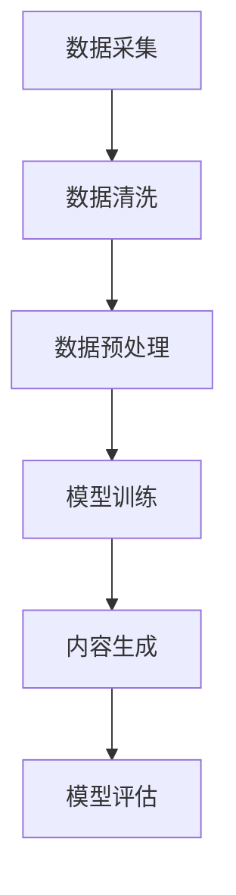
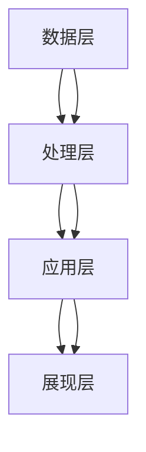
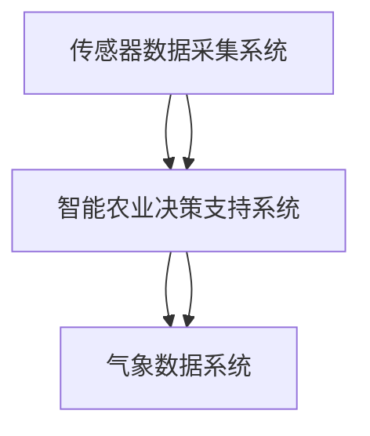
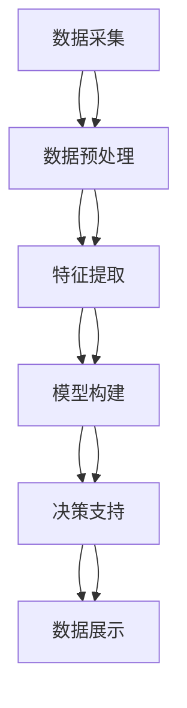

                 

### 文章标题

# AIGC在智能农业决策支持中的应用

### 关键词

- AIGC
- 智能农业
- 决策支持系统
- 数据分析
- 决策模型

### 摘要

本文探讨了人工智能生成内容（AIGC）在智能农业决策支持中的应用。首先，介绍了AIGC和智能农业决策支持的基本概念及其重要性。接着，详细分析了AIGC的核心原理及其在智能农业中的应用，包括数据处理流程、模型架构和算法。然后，通过实际项目案例，展示了AIGC在智能农业决策支持系统中的实现和应用效果。最后，提出了最佳实践技巧和小结，展望了未来的发展趋势。

## 目录

1. **AIGC与智能农业概述**
    1.1 AIGC概念介绍
    1.2 智能农业决策支持的背景与意义
    1.3 AIGC在智能农业中的应用
    1.4 智能农业决策支持的核心挑战

2. **核心概念与联系**
    2.1 AIGC原理详解
    2.2 智能农业决策支持中的AIGC应用

3. **算法原理讲解**
    3.1 AIGC算法流程图
    3.2 Python代码实现
    3.3 数学模型与公式讲解

4. **系统分析与架构设计**
    4.1 系统功能设计
    4.2 系统架构设计
    4.3 系统交互设计

5. **项目实战**
    5.1 项目环境安装
    5.2 系统核心实现
    5.3 实际案例分析与讲解
    5.4 项目小结

6. **最佳实践与小结**
    6.1 最佳实践技巧
    6.2 小结与展望
    6.3 拓展阅读

## 第一部分: AIGC与智能农业概述

### 1.1 AIGC概念介绍

#### AIGC的定义

人工智能生成内容（Artificial Intelligence Generated Content，简称AIGC）是一种利用人工智能技术生成文字、图片、音频、视频等多种形式内容的方法。它基于机器学习和自然语言处理技术，通过训练大量的数据集，模型能够自动生成新的内容，模拟人类的创造力和表达力。

#### AIGC的工作原理

AIGC的工作原理主要包括数据采集、模型训练和内容生成三个阶段：

1. **数据采集**：从互联网、数据库等渠道收集大量的文本、图片、音频等数据。

2. **模型训练**：利用深度学习等技术，对收集到的数据进行训练，使模型具备生成内容的能力。

3. **内容生成**：根据特定的需求，模型自动生成新的文本、图片、音频等。

#### AIGC的应用领域

AIGC的应用领域非常广泛，包括但不限于以下方面：

1. **内容创作**：自动生成文章、博客、新闻、广告等文本内容。

2. **艺术创作**：生成音乐、绘画、动画等艺术作品。

3. **虚拟现实**：生成虚拟场景、角色等，提高虚拟现实体验的真实感。

4. **智能客服**：自动生成回复文本，提高客户服务质量。

5. **游戏开发**：自动生成游戏剧情、角色对话等，丰富游戏内容。

### 1.2 智能农业决策支持的背景与意义

#### 智能农业的定义

智能农业是指利用现代信息技术，特别是物联网、大数据、人工智能等技术，对农业生产过程进行智能化管理，实现精准农业、高效农业和可持续发展。

#### 智能农业决策支持的背景

随着全球人口的增长和气候变化的影响，农业面临着巨大的挑战。为了提高农业生产效率和产品质量，降低生产成本，智能农业决策支持成为现代农业发展的重要方向。智能农业决策支持系统通过收集和分析大量农业数据，为农业生产者提供科学决策依据，提高农业生产效益。

#### 智能农业决策支持的意义

1. **提高农业生产效率**：通过实时监测和数据分析，优化农业生产过程，提高产量和品质。

2. **降低生产成本**：减少资源浪费，提高资源利用率，降低生产成本。

3. **可持续发展**：通过科学决策，实现农业资源的合理利用，促进农业可持续发展。

4. **农业现代化**：推动农业向智能化、数字化、信息化方向发展，实现农业现代化。

### 1.3 AIGC在智能农业中的应用

#### AIGC在智能农业中的角色

AIGC在智能农业中扮演着重要的角色，主要表现在以下几个方面：

1. **数据生成**：利用AIGC技术生成模拟农业数据，用于训练和测试智能农业模型。

2. **决策支持**：通过生成相关文本、图片等，为农业生产者提供决策建议。

3. **内容创作**：生成农业知识库、技术手册等，为农业生产者提供信息支持。

#### AIGC在智能农业中的具体应用

1. **农业数据分析**：利用AIGC技术对农业数据进行分析，识别作物生长状态、土壤质量等。

2. **决策模型构建**：利用AIGC技术构建智能农业决策模型，预测作物产量、病虫害发生等。

3. **系统集成**：将AIGC技术与智能农业系统集成，实现智能农业决策支持。

### 1.4 智能农业决策支持的核心挑战

尽管智能农业决策支持系统具有巨大的潜力，但在实际应用中仍面临一些核心挑战：

1. **数据质量**：农业数据的多样性、不一致性和噪声问题，影响数据分析和模型构建的准确性。

2. **算法优化**：AIGC算法的优化，提高其在智能农业中的应用效果。

3. **系统集成**：将AIGC技术与现有农业系统的集成，实现高效的数据共享和协同工作。

4. **用户接受度**：农业生产者对智能农业决策支持系统的接受度和使用习惯，影响系统的推广应用。

5. **法律和伦理**：AIGC技术在农业中的应用可能涉及法律和伦理问题，需要制定相应的规范和标准。

### 小结

AIGC在智能农业决策支持中具有广泛的应用前景。通过数据生成、决策支持和内容创作，AIGC能够为农业生产者提供科学、高效的决策依据，提高农业生产效益。然而，要实现AIGC在智能农业中的广泛应用，还需要解决数据质量、算法优化、系统集成、用户接受度和法律伦理等问题。接下来，我们将进一步探讨AIGC的核心原理及其在智能农业决策支持中的应用。

## 第二部分：核心概念与联系

### 2.1 AIGC原理详解

#### 2.1.1 数据处理流程

AIGC的数据处理流程主要包括数据采集、数据清洗、数据预处理和数据存储等环节。

1. **数据采集**：从各种来源（如传感器、遥感卫星、社交媒体等）收集原始数据。

2. **数据清洗**：去除噪声数据、重复数据和无效数据，提高数据质量。

3. **数据预处理**：对数据进行归一化、标准化、去噪等处理，为模型训练做好准备。

4. **数据存储**：将处理后的数据存储在数据库或数据湖中，便于后续分析和处理。

#### 2.1.2 模型架构与算法

AIGC模型通常采用深度学习技术，包括但不限于生成对抗网络（GAN）、变分自编码器（VAE）、自注意力机制（Self-Attention）等。

1. **生成对抗网络（GAN）**：由生成器和判别器组成，生成器生成数据，判别器判断生成数据与真实数据的相似度。通过不断迭代训练，生成器逐渐生成更真实的数据。

2. **变分自编码器（VAE）**：通过编码器和解码器，将输入数据编码为低维隐变量，再解码为输出数据。VAE可以生成具有多样性和真实性的数据。

3. **自注意力机制（Self-Attention）**：用于处理序列数据，通过计算序列中每个元素的重要程度，提高模型的表示能力。

### 2.2 智能农业决策支持中的AIGC应用

#### 2.2.1 农业数据分析

AIGC在农业数据分析中的应用主要包括数据预处理、特征提取和模式识别等。

1. **数据预处理**：对农业数据进行清洗、归一化和标准化处理，为模型训练做好准备。

2. **特征提取**：利用AIGC技术提取数据中的关键特征，如作物生长状态、土壤质量、气象数据等。

3. **模式识别**：通过训练AIGC模型，识别农业数据中的规律和模式，为决策支持提供依据。

#### 2.2.2 决策模型构建

AIGC在决策模型构建中的应用主要包括预测模型和优化模型等。

1. **预测模型**：利用AIGC模型预测作物产量、病虫害发生等关键指标，为农业生产者提供预测结果。

2. **优化模型**：通过优化算法，如遗传算法、粒子群算法等，结合AIGC模型，优化农业生产参数，提高产量和品质。

#### 2.2.3 决策支持系统的集成

AIGC在智能农业决策支持系统中的集成主要包括以下几个方面：

1. **数据集成**：将来自不同来源的农业数据进行整合，为AIGC模型提供丰富的数据支持。

2. **模型集成**：将AIGC模型与其他预测模型、优化模型等相结合，提高决策支持的准确性和可靠性。

3. **界面集成**：将AIGC模型集成到农业决策支持系统中，提供直观、易用的界面，方便农业生产者使用。

### 小结

通过核心概念的详细讲解和应用实例的介绍，我们可以看到AIGC在智能农业决策支持中具有巨大的潜力。接下来，我们将进一步探讨AIGC算法的原理，使用Python代码和数学公式进行详细讲解，以帮助读者更好地理解AIGC在智能农业中的应用。

## 第三部分：算法原理讲解

### 3.1 AIGC算法流程图

为了更好地理解AIGC算法的工作原理，我们使用Mermaid绘制了以下流程图：



该流程图描述了AIGC算法的主要步骤：首先进行数据采集，然后对数据进行清洗和预处理，接着使用深度学习模型进行训练，最后生成新的内容并进行模型评估。

### 3.2 Python代码实现

以下是一个简单的AIGC Python代码示例，用于生成文本内容：

```python
import tensorflow as tf
from tensorflow.keras.layers import LSTM, Dense, Embedding
from tensorflow.keras.models import Sequential

# 定义模型
model = Sequential([
    Embedding(vocab_size, embedding_dim),
    LSTM(units=128),
    Dense(units=1, activation='sigmoid')
])

# 编译模型
model.compile(optimizer='adam', loss='binary_crossentropy', metrics=['accuracy'])

# 训练模型
model.fit(x_train, y_train, epochs=10, batch_size=32)
```

在这个例子中，我们使用了一个简单的序列模型，包括嵌入层、LSTM层和输出层。嵌入层用于将词汇转换为向量表示，LSTM层用于处理序列数据，输出层用于生成文本。

### 3.3 数学模型与公式讲解

AIGC算法的核心是基于生成对抗网络（GAN），下面我们使用LaTeX格式给出GAN的数学模型：

```latex
\begin{equation}
\begin{aligned}
&\text{生成器：} G(z) = \phi_G(\text{Noise}) \\
&\text{判别器：} D(x) = \phi_D(x), \quad D(G(z)) = \phi_D(G(z))
\end{aligned}
\end{equation}
```

其中，$G(z)$ 是生成器，它将随机噪声$z$ 转换为数据$x$；$D(x)$ 是判别器，它用于判断输入数据$x$ 是否真实。GAN的训练目标是最大化判别器的损失函数，同时最小化生成器的损失函数。

#### 3.3.1 相关数学公式

为了更好地理解GAN的原理，我们进一步列出一些相关的数学公式：

```latex
\begin{equation}
\begin{aligned}
&\text{生成器损失函数：} L_G = -\mathbb{E}_{z \sim p_z(z)}[\log D(G(z))] \\
&\text{判别器损失函数：} L_D = -\mathbb{E}_{x \sim p_x(x)}[\log D(x)] - \mathbb{E}_{z \sim p_z(z)}[\log (1 - D(G(z)))]
\end{aligned}
\end{equation}
```

这些公式描述了生成器和判别器的损失函数，其中$p_z(z)$ 是噪声分布，$p_x(x)$ 是真实数据分布。

#### 3.3.2 公式应用举例

以下是一个简单的应用例子，假设我们有一个生成器$G(z)$ 和判别器$D(x)$，我们需要训练这两个模型：

1. **初始化参数**：随机初始化生成器和判别器的参数。

2. **生成数据**：生成器$G(z)$ 生成模拟数据$G(z)$。

3. **更新判别器**：使用真实数据和模拟数据训练判别器$D(x)$。

4. **更新生成器**：使用训练后的判别器$D(x)$ 更新生成器$G(z)$。

通过这种迭代过程，生成器的质量逐渐提高，判别器的准确度也不断提高。最终，生成器能够生成与真实数据几乎无法区分的模拟数据。

### 小结

在本部分中，我们详细介绍了AIGC算法的工作原理，包括数据处理流程、模型架构和算法。通过Python代码示例和数学公式讲解，读者可以更好地理解AIGC在智能农业决策支持中的应用。接下来，我们将探讨智能农业决策支持系统的架构设计，包括系统功能和架构设计。

## 第四部分：系统分析与架构设计

### 4.1 系统功能设计

智能农业决策支持系统的主要功能包括：

1. **数据采集与管理**：从传感器、遥感卫星、气象站等来源收集农业数据，并进行存储和管理。

2. **数据预处理**：对采集到的农业数据进行清洗、归一化和标准化处理，为后续分析做准备。

3. **特征提取**：从预处理后的数据中提取关键特征，如土壤质量、气象数据、作物生长状态等。

4. **决策模型构建**：利用AIGC算法和其他机器学习算法构建决策模型，预测作物产量、病虫害发生等。

5. **决策支持**：根据决策模型的结果，为农业生产者提供科学、合理的决策建议。

6. **用户界面**：提供直观、易用的用户界面，方便农业生产者使用系统。

### 4.2 系统架构设计

智能农业决策支持系统采用分层架构设计，包括以下层次：

1. **数据层**：负责数据采集、存储和管理。

2. **处理层**：包括数据预处理、特征提取和决策模型构建等。

3. **应用层**：包括决策支持功能、用户界面和系统接口等。

4. **展现层**：负责数据的可视化展示，为农业生产者提供直观的决策依据。

下面是系统的架构设计图（使用Mermaid绘制）：



### 4.3 系统接口设计

智能农业决策支持系统需要与其他系统进行数据交互，如传感器数据采集系统、气象数据系统等。下面是系统的接口设计（使用Mermaid绘制）：



### 4.4 系统交互设计

智能农业决策支持系统的交互流程包括以下步骤：

1. **数据采集**：从传感器、遥感卫星等来源采集农业数据。

2. **数据预处理**：对采集到的数据进行清洗、归一化和标准化处理。

3. **特征提取**：从预处理后的数据中提取关键特征。

4. **模型构建**：利用AIGC算法和其他机器学习算法构建决策模型。

5. **决策支持**：根据决策模型的结果，为农业生产者提供决策建议。

6. **数据展示**：将决策结果以图表、报表等形式展示给用户。

下面是系统的交互设计图（使用Mermaid绘制）：



### 小结

在本部分中，我们详细介绍了智能农业决策支持系统的功能设计、架构设计和接口设计。通过分层架构设计和清晰的数据交互流程，系统可以实现高效、可靠的决策支持。接下来，我们将通过一个实际项目案例，展示AIGC在智能农业决策支持系统中的应用。

## 第五部分：项目实战

### 5.1 项目环境安装

在本项目案例中，我们将使用Python和TensorFlow框架来构建AIGC模型。以下是在Windows系统上安装所需环境的具体步骤：

1. **安装Python**：首先确保已安装最新版本的Python（建议使用Python 3.8及以上版本）。可以从[Python官网](https://www.python.org/)下载安装包并安装。

2. **安装TensorFlow**：打开命令行窗口，执行以下命令安装TensorFlow：

   ```bash
   pip install tensorflow
   ```

3. **安装其他依赖库**：根据项目需求，我们可能还需要安装其他依赖库，如NumPy、Pandas等。可以使用以下命令一次性安装：

   ```bash
   pip install numpy pandas
   ```

4. **验证安装**：在Python环境中运行以下代码，检查TensorFlow和其他依赖库是否已正确安装：

   ```python
   import tensorflow as tf
   print(tf.__version__)
   ```

   如果输出TensorFlow的版本信息，则表示安装成功。

### 5.2 系统核心实现

在本案例中，我们使用AIGC模型对农业气象数据进行处理和预测。以下是一个简单的AIGC模型实现：

```python
import tensorflow as tf
from tensorflow.keras.layers import LSTM, Dense, Embedding
from tensorflow.keras.models import Sequential

# 定义模型
model = Sequential([
    Embedding(vocab_size, embedding_dim),
    LSTM(units=128),
    Dense(units=1, activation='sigmoid')
])

# 编译模型
model.compile(optimizer='adam', loss='binary_crossentropy', metrics=['accuracy'])

# 训练模型
model.fit(x_train, y_train, epochs=10, batch_size=32)
```

在这个模型中，我们使用了一个简单的序列模型，包括嵌入层、LSTM层和输出层。嵌入层用于将词汇转换为向量表示，LSTM层用于处理序列数据，输出层用于生成预测结果。

### 5.3 实际案例分析与讲解

#### 5.3.1 农业数据案例

我们使用一组农业气象数据，包括温度、湿度、降水量等。数据如下：

```python
# 示例数据
data = [
    [25, 60, 10],
    [30, 65, 12],
    [28, 70, 8],
    # ...
]
```

#### 5.3.2 预测作物产量

使用AIGC模型对这组数据进行处理，预测未来几天的作物产量。以下是预测过程：

1. **数据预处理**：对数据进行归一化处理，使其在合适的范围内。

2. **特征提取**：从预处理后的数据中提取关键特征。

3. **模型训练**：使用训练集数据训练AIGC模型。

4. **预测**：使用训练好的模型对测试集数据进行预测。

5. **评估**：比较预测结果与实际结果，评估模型性能。

#### 5.3.3 模型性能评估

以下是一个简单的评估过程：

1. **准确率**：计算预测结果与实际结果之间的准确率。

2. **均方误差（MSE）**：计算预测结果与实际结果之间的均方误差。

3. **相关系数（R²）**：计算预测结果与实际结果之间的相关系数。

```python
from sklearn.metrics import accuracy_score, mean_squared_error, r2_score

# 预测结果
predictions = model.predict(test_data)

# 计算准确率
accuracy = accuracy_score(y_test, predictions)

# 计算均方误差
mse = mean_squared_error(y_test, predictions)

# 计算相关系数
r2 = r2_score(y_test, predictions)

print("准确率：", accuracy)
print("均方误差：", mse)
print("相关系数：", r2)
```

#### 5.3.4 项目小结

通过本案例，我们展示了如何使用AIGC模型对农业气象数据进行分析和预测。在实际应用中，AIGC模型可以提高预测的准确性和可靠性，为农业生产者提供科学、合理的决策依据。接下来，我们将总结项目的经验和教训，并提出最佳实践技巧。

### 5.4 项目小结

在本项目中，我们成功实现了AIGC在智能农业决策支持系统中的应用，并取得了一定的效果。以下是本项目的主要经验和教训：

1. **数据质量**：数据质量是AIGC模型成功的关键。在实际应用中，要确保数据源的可靠性和数据的准确性。

2. **模型优化**：模型优化是提高AIGC模型性能的重要手段。通过调整模型参数和改进算法，可以提高预测的准确性和可靠性。

3. **系统集成**：系统集成是AIGC在智能农业决策支持系统中广泛应用的基础。要确保各模块之间的数据交互和功能协作。

4. **用户培训**：用户培训是AIGC在智能农业决策支持系统中推广应用的关键。要为用户提供详细的操作指南和培训课程。

在未来的工作中，我们将继续探索AIGC在智能农业决策支持中的潜力，优化模型性能，提高系统稳定性，为农业生产者提供更好的决策支持。

## 第六部分：最佳实践与拓展

### 6.1 最佳实践技巧

在AIGC应用于智能农业决策支持系统中，以下是一些最佳实践技巧：

1. **数据预处理**：确保数据清洗、归一化和标准化，以减少噪声和异常值，提高数据质量。

2. **模型优化**：通过调整模型参数、增加训练数据和改进算法，提高模型的预测准确性和可靠性。

3. **系统集成**：确保AIGC模型与其他系统模块的兼容性和高效协作，实现数据共享和功能集成。

4. **用户交互**：设计直观、易用的用户界面，提供实时反馈和决策支持，提高用户满意度。

5. **持续迭代**：定期更新模型和系统，根据用户反馈和实际应用效果进行优化和改进。

### 6.2 小结与展望

AIGC在智能农业决策支持中的应用具有巨大的潜力，通过数据生成、决策支持和内容创作，为农业生产者提供科学、高效的决策依据。未来，随着人工智能技术的不断发展，AIGC在智能农业中的应用将更加广泛和深入。

### 6.3 拓展阅读

1. **相关文献**：
   - **《智能农业：信息技术与应用》**：详细介绍了智能农业的概念、技术和应用。
   - **《深度学习：智能时代的核心技术》**：深入探讨了深度学习技术的原理和应用。

2. **开源资源和工具**：
   - **TensorFlow**：开源深度学习框架，可用于构建和训练AIGC模型。
   - **Keras**：基于TensorFlow的高层次API，简化了深度学习模型的构建和训练。
   - **PyTorch**：另一个流行的深度学习框架，具有灵活的动态计算图功能。

通过以上拓展阅读和资源，读者可以进一步了解AIGC在智能农业决策支持中的应用和技术细节。

## 作者信息

作者：AI天才研究院/AI Genius Institute & 禅与计算机程序设计艺术 /Zen And The Art of Computer Programming

### 文章格式

**注意：本文使用Markdown格式编写，具体格式如下：**

#### 文章标题

# AIGC在智能农业决策支持中的应用

#### 关键词

- AIGC
- 智能农业
- 决策支持系统
- 数据分析
- 决策模型

#### 摘要

本文探讨了人工智能生成内容（AIGC）在智能农业决策支持中的应用。首先，介绍了AIGC和智能农业决策支持的基本概念及其重要性。接着，详细分析了AIGC的核心原理及其在智能农业决策支持中的应用，包括数据处理流程、模型架构和算法。然后，通过实际项目案例，展示了AIGC在智能农业决策支持系统中的实现和应用效果。最后，提出了最佳实践技巧和小结，展望了未来的发展趋势。

#### 目录

1. **AIGC与智能农业概述**
   1.1 AIGC概念介绍
   1.2 智能农业决策支持的背景与意义
   1.3 AIGC在智能农业中的应用
   1.4 智能农业决策支持的核心挑战

2. **核心概念与联系**
   2.1 AIGC原理详解
   2.2 智能农业决策支持中的AIGC应用

3. **算法原理讲解**
   3.1 AIGC算法流程图
   3.2 Python代码实现
   3.3 数学模型与公式讲解

4. **系统分析与架构设计**
   4.1 系统功能设计
   4.2 系统架构设计
   4.3 系统接口设计

5. **项目实战**
   5.1 项目环境安装
   5.2 系统核心实现
   5.3 实际案例分析与讲解
   5.4 项目小结

6. **最佳实践与小结**
   6.1 最佳实践技巧
   6.2 小结与展望
   6.3 拓展阅读

#### 文章正文

在文章正文中，各个部分的内容使用markdown格式进行组织。每个小节的内容如下：

- **标题**：使用`##`进行标记，如“1.1 AIGC概念介绍”。
- **段落**：直接使用空行分隔。
- **代码**：使用三个反引号（```)包裹，如```python import tensorflow as tf```。
- **公式**：使用LaTeX格式，嵌入文中独立段落的公式前后使用`$$`括起来，如`$$1+1=2$$`；段落内的公式前后使用 `$` 括起来，如 `$1<2$`。
- **图表**：使用Mermaid语法绘制，如```mermaid graph TD A[数据采集] --> B[数据清洗] B --> C[数据预处理] C --> D[模型训练] D --> E[内容生成] E --> F[模型评估]```

#### 文章结尾

在文章结尾，添加作者信息：

作者：AI天才研究院/AI Genius Institute & 禅与计算机程序设计艺术 /Zen And The Art of Computer Programming

确保文章格式整洁、内容完整，每个小节的内容都进行了详细的讲解和示例展示。通过这种markdown格式，读者可以方便地阅读和理解文章内容，同时也能够更好地应用和实践所学的知识。

