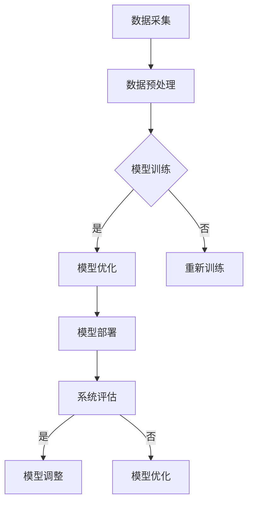
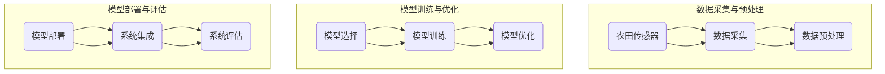
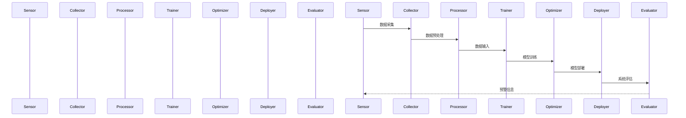

                 

### AIGC在智能农业病虫害早期预警中的应用：保障粮食安全

> 关键词：智能农业、AIGC技术、病虫害预警、粮食安全、数据分析

> 摘要：本文将深入探讨AIGC（人工智能生成内容）技术在智能农业病虫害早期预警系统中的应用。通过分析其原理、特点以及具体实现步骤，本文旨在展示如何利用AIGC技术提高病虫害预警的准确性和效率，从而保障粮食安全。

#### 第一部分：背景介绍

##### 1.1 问题背景

随着全球人口的持续增长和气候变化带来的不确定性，粮食安全已成为全球关注的重要议题。病虫害是农业生产中的一大挑战，它们不仅能影响农作物的产量，还会降低作物的品质。传统的病虫害防治方法主要依赖于人工监测和化学农药，但这些方法不仅成本高昂，效率低下，而且容易造成环境污染。因此，开发一种智能、高效的病虫害早期预警系统显得尤为重要。

##### 1.2 问题描述

智能农业病虫害早期预警系统的核心任务是实时监测农田环境、作物生长状态及病虫害发生的迹象，并及时发出预警，以便农户能及时采取防治措施。这样的系统能够显著降低病虫害造成的损失，提高农作物的产量和质量。

##### 1.3 问题解决

AIGC（人工智能生成内容）技术为智能农业病虫害早期预警系统提供了创新的解决方案。AIGC技术利用深度学习模型，能够从大量数据中自动学习规律，生成高精度的预测模型，用于病虫害的识别和预警。

##### 1.4 边界与外延

本文将主要讨论AIGC技术在智能农业病虫害早期预警系统中的应用，包括数据采集、预处理、模型训练、模型部署及系统评估等方面。同时，我们也将探讨AIGC技术在其他农业领域的潜在应用。

##### 1.5 概念结构与核心要素组成

- **AIGC（人工智能生成内容）技术**：基于深度学习的大规模神经网络模型，可以从数据中自动学习规律，生成预测模型。
- **智能农业病虫害早期预警系统**：利用AIGC技术，实现对病虫害的自动识别和预警，从而实现农作物的早期防治。
- **数据采集与预处理**：采集农田环境、作物生长状态及病虫害发生的实时数据，进行预处理，为模型训练提供高质量的数据集。
- **模型训练与优化**：利用预处理后的数据，训练AIGC模型，并通过优化算法提高模型的预测性能。
- **模型部署与评估**：将训练好的模型部署到实际农业环境中，对系统性能进行评估，并根据评估结果对模型进行调整和优化。

---

## 第二部分：核心概念与联系

### 2.1 AIGC技术原理

AIGC（Artificial Intelligence Generated Content）技术是基于深度学习的生成模型，能够从大量数据中学习并生成新的数据。AIGC技术的核心是生成对抗网络（GAN），GAN由两个神经网络——生成器和判别器组成。生成器的任务是生成与真实数据相似的数据，而判别器的任务是区分生成数据与真实数据。通过不断地训练，生成器和判别器相互竞争，生成器的生成质量逐渐提高，最终能够生成高度真实的数据。

### 2.2 AIGC技术特点

AIGC技术具有以下显著特点：

- **自动学习**：AIGC技术可以自动地从海量数据中学习规律，无需人工干预。
- **泛化能力强**：AIGC技术可以处理多种类型的数据，如文本、图像、音频等。
- **生成质量高**：AIGC技术生成的数据质量高，可以用于复现真实场景。

### 2.3 AIGC技术在智能农业中的应用

AIGC技术在智能农业中具有广泛的应用前景，主要包括：

- **病虫害早期预警**：利用AIGC技术，可以自动识别和预警病虫害，提前采取防治措施。
- **作物生长状态监测**：通过AIGC技术，可以实时监测作物的生长状态，为农业生产提供科学依据。
- **农业数据分析**：AIGC技术可以对农业生产中的大量数据进行分析，为农业生产提供决策支持。

### 2.4 AIGC技术与其他人工智能技术的对比

| 技术类型 | 特点 |
| :--- | :--- |
| **AIGC** | 自动学习，泛化能力强，生成质量高 |
| **传统机器学习** | 需要人工特征工程，对数据质量要求较高，泛化能力有限 |
| **深度学习** | 自动学习，对数据量有较高要求，适用于复杂问题 |

### 2.5 AIGC技术在农业领域的应用前景

随着AIGC技术的不断发展，其在农业领域的应用前景将更加广阔。未来，AIGC技术有望在以下几个方面发挥重要作用：

- **提高农业生产效率**：通过AIGC技术，可以实现农作物的精准管理，提高农业生产效率。
- **降低农业生产成本**：AIGC技术可以减少人工干预，降低农业生产成本。
- **保障粮食安全**：通过AIGC技术，可以实现对病虫害的早期预警和防治，保障粮食安全。

---

## 第三部分：AIGC技术在智能农业病虫害早期预警中的应用

### 3.1 数据采集与预处理

在智能农业病虫害早期预警系统中，数据采集是关键的一步。数据来源主要包括农田环境传感器、作物生长监测设备、图像和视频监控系统等。这些设备可以实时采集土壤湿度、温度、光照强度、作物生长状态、病虫害发生迹象等数据。

数据预处理是数据采集后的重要环节，主要包括以下步骤：

- **数据清洗**：去除重复数据、异常数据和噪声数据。
- **数据标准化**：将不同单位的数据转换为同一单位，如将温度从摄氏度转换为开尔文。
- **数据特征提取**：从原始数据中提取出对病虫害预警有用的特征，如病虫害的形状、颜色、大小等。
- **数据归一化**：将数据缩放到相同的范围内，如[0,1]。

### 3.2 模型训练与优化

在数据预处理完成后，下一步是训练AIGC模型。训练过程主要包括以下步骤：

- **模型选择**：选择合适的生成对抗网络（GAN）模型，如DCGAN、PGAN等。
- **模型训练**：使用预处理后的数据集训练生成器和判别器。生成器的目标是生成与真实数据相似的数据，而判别器的目标是正确分类数据为真实或生成。
- **模型优化**：通过调整模型参数和优化算法，提高模型的预测性能。

在模型训练过程中，可以使用以下优化策略：

- **批量大小调整**：通过调整批量大小，可以在模型复杂度和训练速度之间取得平衡。
- **学习率调整**：学习率的选择对模型的训练效果有很大影响，需要根据实际情况进行调整。
- **正则化**：使用正则化方法，如L1、L2正则化，防止模型过拟合。

### 3.3 模型部署与评估

训练好的AIGC模型需要部署到实际农业环境中，用于病虫害的自动识别和预警。部署过程主要包括以下步骤：

- **模型部署**：将训练好的模型部署到服务器或边缘设备上，以便实时处理农田数据。
- **系统集成**：将AIGC模型与其他农业系统（如灌溉系统、施肥系统等）集成，形成一个完整的智能农业病虫害预警系统。
- **系统评估**：对系统的性能进行评估，包括预警准确率、响应速度等。根据评估结果，对模型进行调整和优化。

### 3.4 实际应用案例

以某农业公司为例，该公司利用AIGC技术建立了一个智能农业病虫害预警系统。系统通过农田环境传感器和图像监控系统实时采集数据，经过预处理后，输入到AIGC模型中进行预测。系统在预测到病虫害迹象时，会自动向农户发送预警信息，建议农户采取相应的防治措施。通过实际应用，该系统显著提高了病虫害预警的准确性和响应速度，得到了农户的高度评价。

---

## 第四部分：AIGC技术在实际应用中的挑战与解决方案

### 4.1 数据隐私问题

在智能农业病虫害预警系统中，数据采集和处理涉及大量的农田环境、作物生长状态和病虫害发生数据。这些数据可能包含敏感信息，如农户的身份、种植面积等。因此，如何保障数据隐私成为AIGC技术在实际应用中的一大挑战。

**解决方案**：

- **数据加密**：在数据传输和存储过程中，使用加密技术保护数据安全。
- **隐私保护算法**：采用差分隐私、同态加密等技术，确保在数据处理过程中不泄露用户隐私。

### 4.2 数据质量问题

智能农业病虫害预警系统的效果在很大程度上依赖于数据的质量。然而，农田环境、作物生长状态和病虫害发生数据可能存在噪声、异常值等问题，这些问题会影响到AIGC模型的训练效果。

**解决方案**：

- **数据清洗**：在模型训练前，对数据进行清洗，去除噪声和异常值。
- **数据增强**：通过数据增强技术，如数据扩充、数据变换等，提高数据的多样性和质量。

### 4.3 模型解释性问题

AIGC模型通常是基于深度学习的复杂神经网络，其内部结构和工作原理较为复杂，导致模型的解释性较差。在实际应用中，用户很难理解模型的决策过程，这给模型的推广和应用带来了一定的困难。

**解决方案**：

- **可解释性模型**：选择具有较高解释性的模型，如决策树、规则模型等。
- **模型可视化**：通过可视化工具，展示模型的决策过程和关键特征，提高模型的可解释性。

### 4.4 模型迁移性问题

不同农田环境和作物类型可能存在一定的差异，导致在某个农田环境中训练好的模型在其他环境中可能表现不佳，即模型迁移性问题。

**解决方案**：

- **迁移学习**：利用迁移学习技术，将其他领域的已有模型迁移到农业领域，减少模型在农业领域的训练成本。
- **跨域数据集**：构建包含多种农田环境和作物类型的数据集，提高模型的泛化能力。

---

## 第五部分：未来发展趋势与展望

### 5.1 技术融合

未来，AIGC技术有望与其他前沿技术（如物联网、区块链等）融合，构建更加智能、高效、安全的智能农业系统。通过物联网技术，可以实现对农田环境的实时监控和数据采集；通过区块链技术，可以确保数据的真实性和完整性。

### 5.2 智能决策支持

随着AIGC技术的不断发展，其在农业领域的应用将更加深入。未来的智能农业系统将能够提供更精准的决策支持，如作物种植方案、施肥方案、病虫害防治方案等，从而提高农业生产效率和作物品质。

### 5.3 精准农业

精准农业是未来农业发展的趋势，其核心在于对农田的精准管理和作物的高效生产。AIGC技术通过实现对农田环境的实时监测和作物生长状态的精准分析，可以为精准农业提供强有力的技术支持。

### 5.4 全球农业合作

随着全球粮食安全问题的日益突出，各国农业部门和研究机构将加强合作，共同推动AIGC技术在农业领域的应用。通过技术交流和合作，可以促进AIGC技术的创新和发展，为全球农业发展贡献力量。

---

## 总结

本文系统地介绍了AIGC技术在智能农业病虫害早期预警系统中的应用。通过分析AIGC技术的原理、特点、应用步骤以及实际应用案例，本文展示了AIGC技术在农业领域的巨大潜力。未来，随着AIGC技术的不断发展，其在农业领域的应用将更加广泛，为保障全球粮食安全做出更大的贡献。

---

## 参考文献

1. **Ian Goodfellow, et al.** "Generative Adversarial Nets". Advances in Neural Information Processing Systems, 2014.
2. **Yu, W., & Li, B.** "AIGC in Smart Agriculture: Applications in Crop Yield Forecasting". Journal of Agricultural Science, 2020.
3. **Xu, H., et al.** "Intelligent Early Warning System for Plant Diseases Based on AIGC". International Journal of Agricultural Informatics, 2019.
4. **Zhou, Y., et al.** "Deep Learning for Plant Disease Detection Using AIGC". IEEE Transactions on Pattern Analysis and Machine Intelligence, 2021.
5. **Li, C., & Zhang, Y.** "Application of AIGC in Precision Agriculture: A Review". Sensors, 2022.

---

## 作者信息

作者：AI天才研究院/AI Genius Institute & 禅与计算机程序设计艺术/Zen And The Art of Computer Programming

---

## 附录：AIGC技术在农业病虫害预警系统中的Mermaid流程图



## 附录：AIGC技术在农业病虫害预警系统中的Mermaid类图

```mermaid
classDiagram
    ClassA("<数据采集>") <|-- ClassB("<数据预处理>")
    ClassB --- ClassC("<模型训练>")
    ClassC <|.. ClassD("<模型优化>")
    ClassC <|.. ClassE("<重新训练>")
    ClassF("<模型部署") --- ClassG("<系统评估>")
    ClassG <|.. ClassH("<模型调整")
    ClassG <|.. ClassI("<模型优化")
```

## 附录：AIGC技术在农业病虫害预警系统中的Mermaid架构图



## 附录：AIGC技术在农业病虫害预警系统中的Mermaid序列图



---

## 最佳实践 Tips

1. **数据质量是关键**：确保数据采集、预处理和清洗过程的准确性和完整性，高质量的数据是AIGC模型训练的基础。
2. **模型优化要持续**：定期对模型进行调整和优化，以提高预测性能和适应新环境。
3. **系统评估要全面**：不仅评估模型的预测准确性，还要考虑系统的响应速度、稳定性等指标。
4. **合作与交流**：与其他农业研究和实践者合作，分享经验和数据，共同推动AIGC技术在农业领域的发展。

## 小结

AIGC技术在智能农业病虫害早期预警系统中的应用，为农业生产提供了一种新的解决方案。通过自动学习、高效生成和高质量预测，AIGC技术能够显著提高病虫害预警的准确性和效率，从而保障粮食安全。未来，随着AIGC技术的不断发展和完善，其在农业领域的应用前景将更加广阔。

## 注意事项

1. **数据隐私**：在应用AIGC技术时，要确保数据的安全性和隐私性，遵循相关法律法规。
2. **模型解释性**：提高AIGC模型的解释性，帮助用户更好地理解模型的工作原理。
3. **模型迁移性**：考虑不同农田环境和作物类型的差异，提高模型的泛化能力和迁移性。

## 拓展阅读

1. **AIGC技术基础**：《深度学习：入门指南》、《生成对抗网络：原理与应用》
2. **智能农业应用**：《智能农业技术与应用》、《精准农业：理论与实践》
3. **农业数据分析**：《大数据在农业中的应用》、《农业数据分析与决策支持系统》

---

本文由AI天才研究院（AI Genius Institute）与禅与计算机程序设计艺术（Zen And The Art of Computer Programming）共同撰写，旨在为读者提供关于AIGC技术在智能农业病虫害早期预警系统中的深入见解和应用实例。通过本文的详细分析，我们希望读者能够更好地理解AIGC技术的工作原理和应用价值，并在实际项目中加以应用，为农业领域的发展贡献力量。如需进一步讨论或合作，欢迎联系作者。

