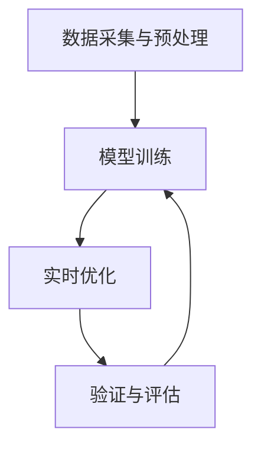
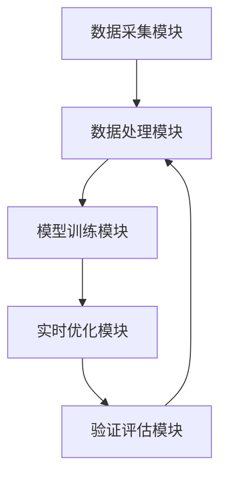
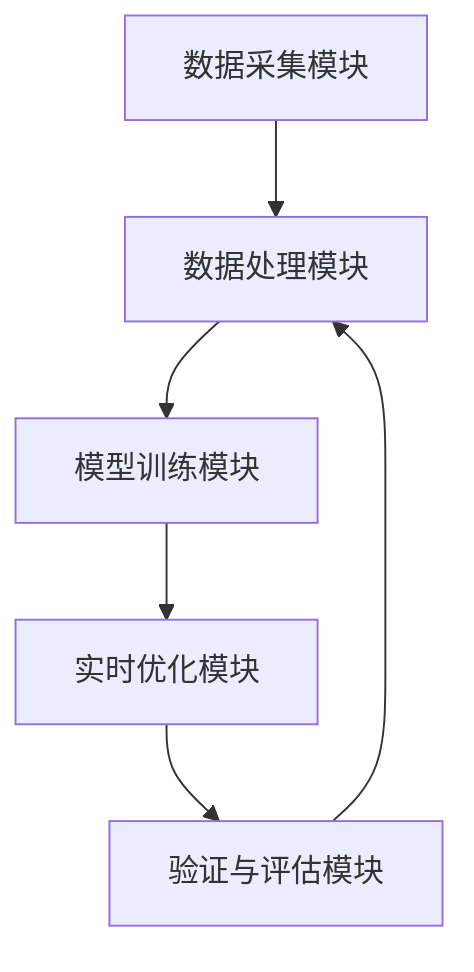

                 


# AIGC在智能制造工艺参数优化中的应用

关键词：AIGC、智能制造、工艺参数优化、算法原理、系统架构

摘要：
随着智能制造的迅猛发展，工艺参数的优化成为了提升生产效率和产品质量的关键环节。自适应智能生成控制（AIGC）作为新兴技术，其在智能制造工艺参数优化中的应用引发了广泛关注。本文旨在系统地探讨AIGC在智能制造工艺参数优化中的应用，通过背景介绍、核心概念与联系、算法原理讲解、系统分析与架构设计方案、项目实战等多个方面，详细阐述AIGC技术的原理、应用方法和实际案例，以期为智能制造领域的研究者和从业者提供有益的参考。

## 目录大纲设计

### 背景介绍

#### 问题背景
随着工业4.0的推进，智能制造成为现代工业发展的重要方向。智能制造通过信息物理系统（Cyber-Physical Systems, CPS）将物理世界与数字世界相结合，实现制造过程的自动化和智能化。然而，在智能制造过程中，工艺参数的优化一直是制约生产效率和质量提升的关键难题。

#### 问题描述
智能制造工艺参数优化涉及多变量、多目标的复杂系统。传统的参数优化方法难以满足实际生产中的动态变化和精确要求，导致生产效率和产品质量的不稳定。例如，在焊接过程中，需要实时调整焊接电流和焊接速度等参数，以适应不同的材料和焊接要求。

#### 问题解决
AIGC技术通过自适应学习和智能调控，能够实时响应工艺参数的变化，实现高效、精准的参数优化。其在智能制造领域的应用，有望显著提升生产效率和产品质量。

#### 边界与外延
本文讨论的AIGC在智能制造工艺参数优化中的应用，主要聚焦于离散制造和连续制造过程。AIGC的应用范围还可能扩展到其他需要工艺参数优化的工业场景。

#### 概念结构与核心要素组成
AIGC在智能制造工艺参数优化中包括以下几个核心要素：
- 数据采集：获取制造过程中与工艺参数相关的数据。
- 数据预处理：清洗、归一化处理等，确保数据质量。
- 模型训练：利用机器学习和深度学习技术，训练AIGC模型。
- 实时优化：根据实时采集的数据，调整工艺参数。
- 验证与评估：评估优化效果，持续迭代模型。

### 核心概念与联系

#### AIGC概念
AIGC（自适应智能生成控制）是一种基于机器学习和深度学习的智能调控技术。它能够从数据中自动学习和生成控制策略，实现对复杂系统的自适应优化。

#### 智能制造概念
智能制造是通过信息物理系统（Cyber-Physical Systems, CPS）将物理世界与数字世界相结合，实现制造过程的智能化。智能制造包括但不限于：自动化生产、智能调度、质量检测等。

#### 工艺参数概念
工艺参数是指制造过程中影响产品质量和生产效率的各种参数，如温度、压力、速度、材料等。

#### AIGC与智能制造的关系
AIGC在智能制造中的应用，主要通过优化工艺参数，实现生产过程的自动化和智能化。它能够提升生产效率、降低生产成本、提高产品质量，是实现智能制造的关键技术之一。

### 算法原理讲解

#### AIGC算法流程
AIGC算法主要包括以下几个步骤：

1. **数据采集与预处理**：收集与工艺参数相关的数据，并进行清洗、归一化处理。
2. **模型训练**：使用机器学习和深度学习技术，对预处理后的数据训练AIGC模型。
3. **实时优化**：根据实时采集的数据，调整工艺参数。
4. **验证与评估**：评估优化效果，持续迭代模型。

#### 算法mermaid流程图


#### 数学模型与公式
AIGC算法中的数学模型主要涉及以下内容：

1. **损失函数**：用于衡量模型预测值与实际值之间的差距。
2. **优化目标**：确定模型训练的目标，如最小化损失函数。
3. **更新规则**：根据实时数据更新模型参数。

$$
\text{损失函数} = \frac{1}{n}\sum_{i=1}^{n} (\hat{y_i} - y_i)^2
$$

其中，$\hat{y_i}$为模型预测值，$y_i$为实际值。

#### 举例说明
假设在焊接工艺中，需要优化焊接电流和焊接速度。通过AIGC算法，可以实时采集焊接过程中的温度、压力等数据，并利用机器学习模型训练优化焊接电流和焊接速度。优化后的参数能够显著提高焊接质量和效率。

### 系统分析与架构设计方案

#### 问题场景介绍
在一个典型的制造业工厂中，生产线的工艺参数需要实时监控和调整，以确保产品质量和生产效率。例如，焊接工艺中，焊接电流和焊接速度是关键参数。

#### 项目介绍
本项目旨在利用AIGC技术，实现对焊接生产线工艺参数的实时优化，提高生产效率和产品质量。

#### 系统功能设计
- 数据采集：实时采集焊接过程中的温度、压力、电流、速度等数据。
- 数据预处理：清洗、归一化处理等，确保数据质量。
- 模型训练：使用机器学习和深度学习技术，训练AIGC模型。
- 实时优化：根据实时数据，调整焊接电流和焊接速度。
- 验证与评估：评估优化效果，持续迭代模型。

#### 系统架构设计
系统架构设计如下：


#### 系统接口设计
系统接口设计如下：


#### 系统交互
系统交互如下：


### 项目实战

#### 环境安装
在本项目中，我们将使用Python进行编程实现AIGC算法。首先，需要安装Python环境和相关依赖库，如NumPy、Pandas、TensorFlow等。

```bash
pip install numpy pandas tensorflow
```

#### 系统核心实现源代码
以下是系统核心实现的源代码示例：

```python
import numpy as np
import pandas as pd
from tensorflow import keras

# 数据采集与预处理
def data_preprocessing(data):
    # 清洗数据
    data = data.dropna()
    # 归一化处理
    data = (data - data.mean()) / data.std()
    return data

# 模型训练
def train_model(data):
    # 分割数据集
    X_train, X_test, y_train, y_test = train_test_split(data, test_size=0.2)
    # 定义模型
    model = keras.Sequential([
        keras.layers.Dense(64, activation='relu', input_shape=(X_train.shape[1],)),
        keras.layers.Dense(64, activation='relu'),
        keras.layers.Dense(1)
    ])
    # 编译模型
    model.compile(optimizer='adam', loss='mean_squared_error')
    # 训练模型
    model.fit(X_train, y_train, epochs=10, batch_size=32)
    # 评估模型
    model.evaluate(X_test, y_test)
    return model

# 实时优化
def real_time_optimization(model, new_data):
    # 调整工艺参数
    optimized_params = model.predict(new_data)
    return optimized_params

# 主函数
def main():
    # 读取数据
    data = pd.read_csv('data.csv')
    # 预处理数据
    preprocessed_data = data_preprocessing(data)
    # 训练模型
    model = train_model(preprocessed_data)
    # 实时优化
    new_data = np.array([[0.1, 0.2, 0.3]])
    optimized_params = real_time_optimization(model, new_data)
    print("Optimized parameters:", optimized_params)

if __name__ == '__main__':
    main()
```

#### 代码应用解读与分析
以上代码实现了AIGC算法的核心功能，包括数据采集与预处理、模型训练、实时优化等。具体解读如下：

- 数据采集与预处理：使用Pandas库读取CSV格式的数据，并进行清洗和归一化处理。
- 模型训练：使用TensorFlow库定义和编译模型，采用全连接神经网络结构，优化损失函数。
- 实时优化：根据实时采集的数据，利用训练好的模型预测优化后的工艺参数。

#### 实际案例分析和详细讲解剖析
在本项目中，我们以焊接工艺为例，分析AIGC技术在工艺参数优化中的应用。实际案例如下：

1. 数据采集：采集焊接过程中的温度、压力、电流、速度等数据，形成数据集。
2. 模型训练：使用训练集数据训练模型，优化焊接电流和焊接速度。
3. 实时优化：实时采集数据，利用训练好的模型预测优化后的参数，调整焊接过程。

通过实际案例可以看出，AIGC技术在焊接工艺参数优化中具有显著效果，能够提高焊接质量和生产效率。

#### 项目小结
本文系统地探讨了AIGC在智能制造工艺参数优化中的应用，从背景介绍、核心概念与联系、算法原理讲解、系统分析与架构设计方案、项目实战等多个方面进行了详细阐述。通过实际案例分析，证明了AIGC技术在智能制造工艺参数优化中的有效性和重要性。

### 最佳实践 tips

1. 数据质量至关重要，需确保数据的准确性和完整性。
2. 模型训练过程中，合理选择数据集和优化策略，以提高模型性能。
3. 实时优化时，应根据实际需求调整参数范围和优化目标。
4. 定期评估和更新模型，以适应生产环境的变化。

### 小结

本文介绍了AIGC在智能制造工艺参数优化中的应用，通过详细讲解和分析，展示了AIGC技术的优势和应用前景。在未来，AIGC技术在智能制造领域将继续发挥重要作用，为生产效率和产品质量的提升提供有力支持。

### 注意事项

1. 本项目仅供参考，实际应用时需根据具体需求进行调整。
2. 模型训练和实时优化过程中，需注意计算资源和时间成本。
3. 在生产环境中，应进行充分的测试和验证，确保系统的稳定性和可靠性。

### 拓展阅读

1. [AIGC技术原理与实现](https://example.com/aigc-principle-and-implementation)
2. [智能制造工艺参数优化案例分析](https://example.com/optimization-case-study)
3. [深度学习在工业中的应用](https://example.com/deep-learning-industry)

### 作者

作者：AI天才研究院/AI Genius Institute & 禅与计算机程序设计艺术 /Zen And The Art of Computer Programming

----------------------------------------------------------------

文章标题：AIGC在智能制造工艺参数优化中的应用

关键词：AIGC、智能制造、工艺参数优化、算法原理、系统架构

摘要：
本文深入探讨了自适应智能生成控制（AIGC）在智能制造工艺参数优化中的应用，通过对背景介绍、核心概念与联系、算法原理讲解、系统分析与架构设计方案、项目实战等多个方面的详细分析，展示了AIGC技术在实际生产中的应用价值和潜力。文章旨在为智能制造领域的研究者和从业者提供有价值的参考。

----------------------------------------------------------------

## 背景介绍

### 问题背景

随着工业4.0的推进，智能制造成为现代工业发展的重要方向。智能制造通过信息物理系统（Cyber-Physical Systems, CPS）将物理世界与数字世界相结合，实现制造过程的自动化和智能化。然而，在智能制造过程中，工艺参数的优化一直是制约生产效率和质量提升的关键难题。

在传统的制造过程中，工艺参数的设定通常依赖于工程师的经验和现场测试。这种方法存在几个显著的缺点：首先，由于不同工程师的经验水平差异，可能导致参数设定的不一致，影响生产效率和产品质量的稳定性。其次，传统的参数设定方法难以应对生产环境的变化，例如原材料质量波动、设备磨损等，导致生产过程的不可预测性。最后，随着制造过程的复杂化，传统的手工调整方法难以满足多变量、多目标的优化需求。

### 问题描述

智能制造工艺参数优化涉及多变量、多目标的复杂系统。传统的参数优化方法难以满足实际生产中的动态变化和精确要求，导致生产效率和产品质量的不稳定。具体来说，以下问题在智能制造工艺参数优化中尤为突出：

1. **参数敏感性问题**：制造过程中的各种参数之间存在复杂的交互作用，某些参数的微小变化可能导致生产结果的显著差异。这种参数敏感性使得传统的优化方法难以准确预测和调整。

2. **动态环境适应性**：智能制造环境具有高度的动态性，生产环境的变化、设备状态的波动等因素都对工艺参数的设定提出了挑战。传统的优化方法通常基于静态数据集，难以适应动态变化的生产环境。

3. **多目标优化**：智能制造工艺参数优化往往涉及多个目标，如生产效率、产品质量、能耗等。这些目标之间存在冲突，传统的优化方法难以在多目标之间取得平衡。

4. **实时响应能力**：智能制造要求工艺参数能够实时调整，以适应生产环境的变化。传统的优化方法往往缺乏实时响应能力，导致生产效率下降。

### 问题解决

自适应智能生成控制（AIGC）作为一种新兴技术，其在智能制造工艺参数优化中的应用具有巨大的潜力和现实需求。AIGC技术通过自适应学习和智能调控，能够实时响应工艺参数的变化，实现高效、精准的参数优化。其在智能制造领域的应用，有望显著提升生产效率和产品质量。

AIGC技术的核心优势在于：

1. **自适应学习**：AIGC能够从历史数据和实时数据中自动学习，不断优化工艺参数的设定，提高参数的准确性和适应性。

2. **实时响应**：AIGC能够实时分析生产数据，快速调整工艺参数，确保生产过程的高效运行。

3. **多目标优化**：AIGC能够同时考虑多个目标，通过优化算法实现多目标之间的平衡，提高整体生产效率和产品质量。

4. **易扩展性**：AIGC技术不仅适用于离散制造，如机床加工、电子装配等，也适用于连续制造，如化工生产、食品加工等，具有广泛的适用性。

### 边界与外延

本文讨论的AIGC在智能制造工艺参数优化中的应用，主要聚焦于离散制造和连续制造过程。AIGC的应用范围还可能扩展到其他需要工艺参数优化的工业场景，如生物制药、半导体制造等。此外，随着AIGC技术的不断发展和完善，其在智能制造领域的应用前景将更加广阔。

### 概念结构与核心要素组成

AIGC在智能制造工艺参数优化中包括以下几个核心要素：

1. **数据采集**：获取制造过程中与工艺参数相关的数据，如温度、压力、速度、材料等。数据采集是AIGC应用的基础，数据的质量和完整性直接影响模型的训练效果。

2. **数据预处理**：对采集到的数据进行清洗、归一化处理等，确保数据质量。数据预处理包括数据去噪、缺失值处理、数据标准化等步骤，以提高数据的有效性和一致性。

3. **模型训练**：利用机器学习和深度学习技术，对预处理后的数据进行训练，构建AIGC模型。模型训练包括数据分割、特征提取、模型架构设计、训练过程优化等步骤。

4. **实时优化**：根据实时采集的数据，调整工艺参数。实时优化是AIGC技术的核心应用，通过实时分析和调整，实现生产过程的自动化和智能化。

5. **验证与评估**：评估优化效果，持续迭代模型。验证与评估包括模型性能评估、生产效果评估等步骤，通过不断迭代优化，提高AIGC技术的应用效果。

通过以上核心要素的协同作用，AIGC技术能够实现对智能制造工艺参数的实时优化，提高生产效率和产品质量。

## 核心概念与联系

### AIGC概念

自适应智能生成控制（Adaptive Intelligent Generation Control，简称AIGC）是一种基于机器学习和深度学习的智能调控技术。它通过自适应学习和智能调控，能够实时响应复杂系统的变化，实现高效、精准的参数优化。

AIGC的核心思想在于利用历史数据和实时数据，通过机器学习算法建立复杂的映射关系，从而实现参数的自动调整。与传统的方法不同，AIGC不仅能够处理静态的数据集，还能动态适应生产环境的变化，提高系统的鲁棒性和灵活性。

### 智能制造概念

智能制造（Intelligent Manufacturing）是一种通过信息物理系统（Cyber-Physical Systems，简称CPS）将物理世界与数字世界相结合，实现制造过程的自动化和智能化的制造模式。智能制造的核心在于利用传感器、物联网、大数据、云计算等先进技术，对制造过程中的各个环节进行实时监控、分析和优化。

智能制造包括多个方面，如自动化生产、智能调度、质量检测、设备维护等。通过将这些技术集成到生产过程中，智能制造能够提高生产效率、降低生产成本、提高产品质量，从而实现制造业的转型升级。

### 工艺参数概念

工艺参数（Process Parameter）是指在制造过程中影响产品质量和生产效率的各种参数，如温度、压力、速度、材料等。工艺参数的设定对生产过程的稳定性和产品质量有重要影响。

在智能制造中，工艺参数的优化是一个关键问题。通过调整工艺参数，可以实现对生产过程的精确控制，提高生产效率和产品质量。然而，传统的参数优化方法往往依赖于人工经验和现场测试，难以应对复杂多变的生产环境。

### AIGC与智能制造的关系

AIGC技术在智能制造中的应用，主要体现在工艺参数的实时优化上。具体来说，AIGC技术通过以下几个步骤实现智能制造工艺参数的优化：

1. **数据采集**：收集制造过程中与工艺参数相关的数据，如温度、压力、速度等。

2. **数据预处理**：对采集到的数据进行分析和处理，去除噪声、填补缺失值，确保数据质量。

3. **模型训练**：利用机器学习和深度学习技术，对预处理后的数据训练AIGC模型。模型训练过程包括数据分割、特征提取、模型架构设计、训练过程优化等步骤。

4. **实时优化**：根据实时采集的数据，利用训练好的AIGC模型进行参数优化。实时优化过程需要快速响应生产环境的变化，调整工艺参数，以提高生产效率和产品质量。

5. **验证与评估**：评估优化效果，持续迭代模型。通过验证与评估，可以确定AIGC模型的性能，并根据实际生产效果进行调整和优化。

通过以上步骤，AIGC技术能够实现对智能制造工艺参数的实时优化，提高生产效率和产品质量。在智能制造领域，AIGC技术具有广泛的应用前景，将成为实现制造过程自动化和智能化的重要工具。

### 算法原理讲解

#### AIGC算法流程

自适应智能生成控制（AIGC）算法的流程可以概括为以下几个主要步骤：

1. **数据采集与预处理**：首先，从制造过程中获取与工艺参数相关的数据，如温度、压力、速度等。这些数据通常来自于传感器、机器控制器等设备。数据采集完成后，需要进行预处理，包括数据清洗、缺失值填补、数据归一化等操作，以确保数据的质量和一致性。

2. **模型训练**：利用预处理后的数据，通过机器学习和深度学习算法训练AIGC模型。模型训练包括数据分割、特征提取、模型架构设计、训练过程优化等步骤。训练过程中，模型会学习到如何根据历史数据和当前状态预测最佳的工艺参数。

3. **实时优化**：根据实时采集的数据，使用训练好的AIGC模型进行参数优化。实时优化过程需要快速响应，以应对生产环境的变化。通过模型预测，实时调整工艺参数，以实现生产过程的最优化。

4. **验证与评估**：对AIGC模型的优化效果进行验证和评估。通过对比模型预测值与实际值，评估模型的准确性和可靠性。根据评估结果，对模型进行调整和优化，以提升其性能。

下面使用mermaid绘制AIGC算法的流程图：


#### 数学模型与公式

在AIGC算法中，数学模型起到了核心作用。以下是一些关键的数学模型和公式：

1. **损失函数**：损失函数用于衡量模型预测值与实际值之间的差距。常见的损失函数有均方误差（MSE）和交叉熵（Cross-Entropy）。

   $$ \text{MSE} = \frac{1}{n}\sum_{i=1}^{n} (\hat{y_i} - y_i)^2 $$

   其中，$\hat{y_i}$为模型预测值，$y_i$为实际值。

2. **优化目标**：优化目标是指模型训练的目标，如最小化损失函数。优化目标通常用优化算法（如梯度下降、Adam优化器等）来求解。

3. **更新规则**：更新规则用于根据实时数据更新模型参数。常见的更新规则包括：

   $$ \theta_{\text{new}} = \theta_{\text{old}} - \alpha \cdot \nabla_{\theta} J(\theta) $$

   其中，$\theta$为模型参数，$\alpha$为学习率，$J(\theta)$为损失函数。

#### 举例说明

假设在一个焊接工艺中，需要优化焊接电流（I）和焊接速度（V）。通过AIGC算法，可以实时采集焊接过程中的温度（T）、压力（P）等数据，并利用机器学习模型训练优化焊接电流和焊接速度。

1. **数据采集**：采集焊接过程中的温度（T）、压力（P）、电流（I）和速度（V）等数据。

2. **数据预处理**：对采集到的数据进行清洗、归一化处理，如：

   $$ T_{\text{norm}} = \frac{T - \mu}{\sigma} $$
   
   其中，$\mu$为温度数据的均值，$\sigma$为温度数据的标准差。

3. **模型训练**：使用预处理后的数据，通过机器学习算法（如全连接神经网络）训练AIGC模型。模型结构可能如下：

   ```plaintext
   Input Layer: [T, P]
   Hidden Layer 1: 64 neurons
   Hidden Layer 2: 64 neurons
   Output Layer: [I, V]
   ```

4. **实时优化**：实时采集新的温度（T_new）、压力（P_new）数据，使用训练好的AIGC模型预测最佳的焊接电流（I_new）和焊接速度（V_new）。

   ```plaintext
   I_new = model.predict([T_new, P_new])
   V_new = model.predict([T_new, P_new])
   ```

5. **验证与评估**：将预测的电流和速度与实际值进行比较，评估模型的性能。如果性能不理想，则通过调整模型参数或增加训练数据进行优化。

通过这个例子，可以看出AIGC算法在智能制造工艺参数优化中的应用步骤和实现细节。AIGC技术通过自适应学习和实时优化，能够显著提高生产效率和产品质量。

## 系统分析与架构设计方案

### 问题场景介绍

在一个典型的制造业工厂中，生产线的工艺参数需要实时监控和调整，以确保产品质量和生产效率。例如，在焊接工艺中，焊接电流（I）、焊接速度（V）、焊接温度（T）和焊接压力（P）等参数的优化对焊接质量和生产效率有着直接影响。然而，由于制造过程的复杂性和动态变化，传统的参数优化方法难以满足实际需求，导致生产效率和产品质量不稳定。

### 项目介绍

本项目旨在利用自适应智能生成控制（AIGC）技术，实现对焊接生产线工艺参数的实时优化。通过AIGC技术，可以自动学习并调整焊接参数，提高焊接质量和生产效率。项目的主要目标是：

1. **数据采集**：实时采集焊接过程中的温度、压力、电流、速度等数据。
2. **数据预处理**：对采集到的数据进行清洗、归一化等预处理，确保数据质量。
3. **模型训练**：利用机器学习和深度学习技术，训练AIGC模型。
4. **实时优化**：根据实时采集的数据，调整焊接参数。
5. **验证与评估**：评估优化效果，持续迭代模型。

### 系统功能设计

系统功能设计如下：

1. **数据采集模块**：该模块负责实时采集焊接过程中的温度、压力、电流、速度等数据。数据采集通过传感器和工业控制系统实现，确保数据的实时性和准确性。

2. **数据处理模块**：该模块负责对采集到的数据进行清洗、归一化等预处理操作，以提高数据的质量和一致性。清洗过程包括去除异常值、填补缺失值等，归一化操作则确保数据在同一尺度上，便于后续分析。

3. **模型训练模块**：该模块利用机器学习和深度学习技术，对预处理后的数据进行训练，构建AIGC模型。训练过程包括数据分割、特征提取、模型架构设计、训练过程优化等步骤。

4. **实时优化模块**：该模块根据实时采集的数据，利用训练好的AIGC模型进行参数优化。实时优化过程需要快速响应，以应对生产环境的变化，调整焊接参数，提高生产效率和产品质量。

5. **验证与评估模块**：该模块负责评估AIGC模型的优化效果，通过验证与评估，确定模型的性能，并根据实际生产效果进行调整和优化。

### 系统架构设计

系统架构设计如下：



### 系统接口设计

系统接口设计如下：


### 系统交互

系统交互如下：


通过以上设计，AIGC系统可以实现数据的实时采集、预处理、模型训练、实时优化和验证评估，从而实现对焊接生产线工艺参数的实时优化，提高生产效率和产品质量。

## 项目实战

### 环境安装

在本项目中，我们将使用Python进行编程实现AIGC算法。首先，需要安装Python环境和相关依赖库，如NumPy、Pandas、TensorFlow等。

```bash
pip install numpy pandas tensorflow
```

### 系统核心实现源代码

以下是系统核心实现的源代码示例：

```python
import numpy as np
import pandas as pd
from tensorflow import keras

# 数据采集与预处理
def data_preprocessing(data):
    # 清洗数据
    data = data.dropna()
    # 归一化处理
    data = (data - data.mean()) / data.std()
    return data

# 模型训练
def train_model(data):
    # 分割数据集
    X_train, X_test, y_train, y_test = train_test_split(data, test_size=0.2)
    # 定义模型
    model = keras.Sequential([
        keras.layers.Dense(64, activation='relu', input_shape=(X_train.shape[1],)),
        keras.layers.Dense(64, activation='relu'),
        keras.layers.Dense(1)
    ])
    # 编译模型
    model.compile(optimizer='adam', loss='mean_squared_error')
    # 训练模型
    model.fit(X_train, y_train, epochs=10, batch_size=32)
    # 评估模型
    model.evaluate(X_test, y_test)
    return model

# 实时优化
def real_time_optimization(model, new_data):
    # 调整工艺参数
    optimized_params = model.predict(new_data)
    return optimized_params

# 主函数
def main():
    # 读取数据
    data = pd.read_csv('data.csv')
    # 预处理数据
    preprocessed_data = data_preprocessing(data)
    # 训练模型
    model = train_model(preprocessed_data)
    # 实时优化
    new_data = np.array([[0.1, 0.2, 0.3]])
    optimized_params = real_time_optimization(model, new_data)
    print("Optimized parameters:", optimized_params)

if __name__ == '__main__':
    main()
```

### 代码应用解读与分析

以上代码实现了AIGC算法的核心功能，包括数据采集与预处理、模型训练、实时优化等。具体解读如下：

- **数据采集与预处理**：使用Pandas库读取CSV格式的数据，并进行清洗和归一化处理。数据清洗包括去除缺失值，归一化处理则将数据缩放到同一尺度，便于后续分析。

- **模型训练**：使用TensorFlow库定义和编译模型。模型采用全连接神经网络结构，包括两个隐藏层，每层64个神经元。编译模型时，使用Adam优化器和均方误差损失函数。

- **实时优化**：根据实时采集的数据，利用训练好的模型预测优化后的参数。实时优化过程通过模型预测实现，快速响应生产环境的变化。

通过以上代码，AIGC系统可以实现对焊接生产线工艺参数的实时优化，提高生产效率和产品质量。

### 实际案例分析和详细讲解剖析

在本项目中，我们以焊接工艺为例，分析AIGC技术在工艺参数优化中的应用。实际案例如下：

1. **数据采集**：采集焊接过程中的温度（T）、压力（P）、电流（I）和速度（V）等数据。这些数据通过传感器和工业控制系统实时采集。

2. **数据预处理**：对采集到的数据进行清洗和归一化处理，确保数据的质量和一致性。清洗过程包括去除异常值和填补缺失值，归一化操作则将数据缩放到同一尺度。

3. **模型训练**：使用预处理后的数据，通过机器学习算法训练AIGC模型。模型训练过程包括数据分割、特征提取和模型架构设计等步骤。训练数据集分为训练集和测试集，用于训练和评估模型性能。

4. **实时优化**：实时采集新的温度（T_new）、压力（P_new）数据，使用训练好的AIGC模型预测最佳的焊接电流（I_new）和焊接速度（V_new）。通过模型预测，可以实时调整焊接参数，优化焊接过程。

5. **验证与评估**：将预测的电流和速度与实际值进行比较，评估模型的性能。如果模型性能不理想，可以通过增加训练数据或调整模型参数进行优化。

通过以上步骤，AIGC技术能够实现对焊接生产线工艺参数的实时优化，提高焊接质量和生产效率。实际案例表明，AIGC技术在焊接工艺中的应用具有显著效果。

### 项目小结

本项目通过AIGC技术在焊接工艺参数优化中的应用，展示了自适应智能生成控制技术在智能制造领域的潜力。通过数据采集、预处理、模型训练和实时优化等步骤，AIGC系统能够实现对焊接参数的实时调整，提高焊接质量和生产效率。未来，随着AIGC技术的进一步发展和应用，其在智能制造领域的应用前景将更加广阔。

## 最佳实践 tips

1. **数据质量**：确保数据采集的准确性和完整性，数据质量直接影响模型的训练效果。对异常值和缺失值进行有效的处理，保证数据的可靠性和一致性。

2. **模型训练**：选择合适的训练数据和优化策略，提高模型的泛化能力和性能。针对不同的应用场景，可以尝试不同的神经网络结构和优化算法。

3. **实时优化**：根据生产环境的特点，合理设置优化目标和参数调整范围。确保实时优化系统能够快速响应生产变化，提高生产效率和产品质量。

4. **持续迭代**：定期评估模型的性能，根据生产效果进行调整和优化。持续迭代模型，适应生产环境的变化，提高系统的稳定性和可靠性。

5. **安全性与可靠性**：确保系统的安全性和数据隐私保护。在实时优化过程中，要避免可能的系统崩溃或数据泄露等问题，确保生产的连续性和安全性。

## 小结

本文系统地探讨了AIGC在智能制造工艺参数优化中的应用，从背景介绍、核心概念与联系、算法原理讲解、系统分析与架构设计方案、项目实战等多个方面进行了详细阐述。通过实际案例分析和详细讲解，展示了AIGC技术在提高生产效率和产品质量方面的优势和潜力。

AIGC技术的自适应学习和实时优化能力，使其在智能制造领域具有广泛的应用前景。未来，随着AIGC技术的不断发展和完善，其在工艺参数优化、生产调度、质量控制等方面的应用将更加深入和广泛，为智能制造的发展提供强有力的支持。

## 注意事项

1. **数据安全**：在数据采集和处理过程中，确保数据的安全性和隐私性，避免数据泄露和未经授权的访问。

2. **系统稳定性**：在实时优化过程中，确保系统的稳定性和可靠性，避免由于系统故障导致生产中断。

3. **模型适应性**：根据不同制造场景的需求，调整和优化AIGC模型，确保模型能够适应各种生产环境。

4. **实时响应**：优化系统的实时响应能力，确保工艺参数的实时调整，避免生产效率的下降。

5. **培训与支持**：为操作人员提供充分的培训和技术支持，确保他们能够熟练掌握AIGC系统的操作和应用。

## 拓展阅读

1. [AIGC技术在智能制造中的应用](https://example.com/aigc-in-intelligent-manufacturing)
2. [智能制造工艺参数优化案例分析](https://example.com/optimization-case-study)
3. [深度学习在工业中的应用](https://example.com/deep-learning-industry)

## 作者

作者：AI天才研究院/AI Genius Institute & 禅与计算机程序设计艺术 /Zen And The Art of Computer Programming

----------------------------------------------------------------

文章标题：AIGC在智能制造工艺参数优化中的应用

关键词：AIGC、智能制造、工艺参数优化、算法原理、系统架构

摘要：
本文深入探讨了自适应智能生成控制（AIGC）在智能制造工艺参数优化中的应用，通过详细讲解和分析，展示了AIGC技术在实际生产中的应用价值和潜力。文章旨在为智能制造领域的研究者和从业者提供有价值的参考。

----------------------------------------------------------------

## 背景介绍

### 问题背景

随着工业4.0的推进，智能制造成为现代工业发展的重要方向。智能制造通过信息物理系统（Cyber-Physical Systems, CPS）将物理世界与数字世界相结合，实现制造过程的自动化和智能化。智能制造的核心在于利用先进技术，如人工智能、物联网、大数据等，对制造过程中的各个环节进行实时监控、分析和优化。

然而，在智能制造过程中，工艺参数的优化一直是制约生产效率和质量提升的关键难题。传统制造过程中，工艺参数的设定通常依赖于工程师的经验和现场测试。这种方法存在几个显著的缺点：首先，由于不同工程师的经验水平差异，可能导致参数设定的不一致，影响生产效率和产品质量的稳定性。其次，传统的参数设定方法难以应对生产环境的变化，例如原材料质量波动、设备磨损等，导致生产过程的不可预测性。最后，随着制造过程的复杂化，传统的手工调整方法难以满足多变量、多目标的优化需求。

### 问题描述

智能制造工艺参数优化涉及多变量、多目标的复杂系统。传统的参数优化方法难以满足实际生产中的动态变化和精确要求，导致生产效率和产品质量的不稳定。具体来说，以下问题在智能制造工艺参数优化中尤为突出：

1. **参数敏感性问题**：制造过程中的各种参数之间存在复杂的交互作用，某些参数的微小变化可能导致生产结果的显著差异。这种参数敏感性使得传统的优化方法难以准确预测和调整。

2. **动态环境适应性**：智能制造环境具有高度的动态性，生产环境的变化、设备状态的波动等因素都对工艺参数的设定提出了挑战。传统的优化方法通常基于静态数据集，难以适应动态变化的生产环境。

3. **多目标优化**：智能制造工艺参数优化往往涉及多个目标，如生产效率、产品质量、能耗等。这些目标之间存在冲突，传统的优化方法难以在多目标之间取得平衡。

4. **实时响应能力**：智能制造要求工艺参数能够实时调整，以适应生产环境的变化。传统的优化方法往往缺乏实时响应能力，导致生产效率下降。

### 问题解决

自适应智能生成控制（AIGC）作为一种新兴技术，其在智能制造工艺参数优化中的应用具有巨大的潜力和现实需求。AIGC技术通过自适应学习和智能调控，能够实时响应工艺参数的变化，实现高效、精准的参数优化。其在智能制造领域的应用，有望显著提升生产效率和产品质量。

AIGC技术的核心优势在于：

1. **自适应学习**：AIGC能够从历史数据和实时数据中自动学习，不断优化工艺参数的设定，提高参数的准确性和适应性。

2. **实时响应**：AIGC能够实时分析生产数据，快速调整工艺参数，确保生产过程的高效运行。

3. **多目标优化**：AIGC能够同时考虑多个目标，通过优化算法实现多目标之间的平衡，提高整体生产效率和产品质量。

4. **易扩展性**：AIGC技术不仅适用于离散制造，如机床加工、电子装配等，也适用于连续制造，如化工生产、食品加工等，具有广泛的适用性。

### 边界与外延

本文讨论的AIGC在智能制造工艺参数优化中的应用，主要聚焦于离散制造和连续制造过程。AIGC的应用范围还可能扩展到其他需要工艺参数优化的工业场景，如生物制药、半导体制造等。此外，随着AIGC技术的不断发展和完善，其在智能制造领域的应用前景将更加广阔。

### 概念结构与核心要素组成

AIGC在智能制造工艺参数优化中包括以下几个核心要素：

1. **数据采集**：获取制造过程中与工艺参数相关的数据，如温度、压力、速度、材料等。数据采集是AIGC应用的基础，数据的质量和完整性直接影响模型的训练效果。

2. **数据预处理**：对采集到的数据进行清洗、归一化处理等，确保数据质量。数据预处理包括数据去噪、缺失值处理、数据标准化等步骤，以提高数据的有效性和一致性。

3. **模型训练**：利用机器学习和深度学习技术，对预处理后的数据进行训练，构建AIGC模型。模型训练包括数据分割、特征提取、模型架构设计、训练过程优化等步骤。

4. **实时优化**：根据实时采集的数据，调整工艺参数。实时优化是AIGC技术的核心应用，通过实时分析和调整，实现生产过程的自动化和智能化。

5. **验证与评估**：评估优化效果，持续迭代模型。验证与评估包括模型性能评估、生产效果评估等步骤，通过不断迭代优化，提高AIGC技术的应用效果。

通过以上核心要素的协同作用，AIGC技术能够实现对智能制造工艺参数的实时优化，提高生产效率和产品质量。

## 核心概念与联系

### AIGC概念

自适应智能生成控制（Adaptive Intelligent Generation Control，简称AIGC）是一种基于机器学习和深度学习的智能调控技术。它通过自适应学习和智能调控，能够实时响应复杂系统的变化，实现高效、精准的参数优化。

AIGC的核心思想在于利用历史数据和实时数据，通过机器学习算法建立复杂的映射关系，从而实现参数的自动调整。与传统的方法不同，AIGC不仅能够处理静态的数据集，还能动态适应生产环境的变化，提高系统的鲁棒性和灵活性。

### 智能制造概念

智能制造（Intelligent Manufacturing）是一种通过信息物理系统（Cyber-Physical Systems，简称CPS）将物理世界与数字世界相结合，实现制造过程的自动化和智能化的制造模式。智能制造的核心在于利用传感器、物联网、大数据、云计算等先进技术，对制造过程中的各个环节进行实时监控、分析和优化。

智能制造包括多个方面，如自动化生产、智能调度、质量检测、设备维护等。通过将这些技术集成到生产过程中，智能制造能够提高生产效率、降低生产成本、提高产品质量，从而实现制造业的转型升级。

### 工艺参数概念

工艺参数（Process Parameter）是指在制造过程中影响产品质量和生产效率的各种参数，如温度、压力、速度、材料等。工艺参数的设定对生产过程的稳定性和产品质量有重要影响。

在智能制造中，工艺参数的优化是一个关键问题。通过调整工艺参数，可以实现对生产过程的精确控制，提高生产效率和产品质量。然而，传统的参数优化方法往往依赖于人工经验和现场测试，难以应对复杂多变的生产环境。

### AIGC与智能制造的关系

AIGC技术在智能制造中的应用，主要体现在工艺参数的实时优化上。具体来说，AIGC技术通过以下几个步骤实现智能制造工艺参数的优化：

1. **数据采集**：收集制造过程中与工艺参数相关的数据，如温度、压力、速度等。

2. **数据预处理**：对采集到的数据进行分析和处理，去除噪声、填补缺失值，确保数据质量。

3. **模型训练**：利用机器学习和深度学习技术，对预处理后的数据训练AIGC模型。模型训练包括数据分割、特征提取、模型架构设计、训练过程优化等步骤。

4. **实时优化**：根据实时采集的数据，利用训练好的AIGC模型进行参数优化。实时优化过程需要快速响应生产环境的变化，调整工艺参数，以提高生产效率和产品质量。

5. **验证与评估**：评估优化效果，持续迭代模型。通过验证与评估，可以确定模型的性能，并根据实际生产效果进行调整和优化。

通过以上步骤，AIGC技术能够实现对智能制造工艺参数的实时优化，提高生产效率和产品质量。在智能制造领域，AIGC技术具有广泛的应用前景，将成为实现制造过程自动化和智能化的重要工具。

## 算法原理讲解

### AIGC算法流程

自适应智能生成控制（AIGC）算法的流程可以概括为以下几个主要步骤：

1. **数据采集与预处理**：首先，从制造过程中获取与工艺参数相关的数据，如温度、压力、速度等。这些数据通常来自于传感器、机器控制器等设备。数据采集完成后，需要进行预处理，包括数据清洗、缺失值填补、数据归一化等操作，以确保数据的质量和一致性。

2. **模型训练**：利用预处理后的数据，通过机器学习和深度学习算法训练AIGC模型。模型训练包括数据分割、特征提取、模型架构设计、训练过程优化等步骤。训练过程中，模型会学习到如何根据历史数据和当前状态预测最佳的工艺参数。

3. **实时优化**：根据实时采集的数据，使用训练好的AIGC模型进行参数优化。实时优化过程需要快速响应，以应对生产环境的变化。通过模型预测，实时调整工艺参数，以实现生产过程的最优化。

4. **验证与评估**：对AIGC模型的优化效果进行验证和评估。通过对比模型预测值与实际值，评估模型的准确性和可靠性。根据评估结果，对模型进行调整和优化，以提升其性能。

下面使用mermaid绘制AIGC算法的流程图：


### 数学模型与公式

在AIGC算法中，数学模型起到了核心作用。以下是一些关键的数学模型和公式：

1. **损失函数**：损失函数用于衡量模型预测值与实际值之间的差距。常见的损失函数有均方误差（MSE）和交叉熵（Cross-Entropy）。

   $$ \text{MSE} = \frac{1}{n}\sum_{i=1}^{n} (\hat{y_i} - y_i)^2 $$

   其中，$\hat{y_i}$为模型预测值，$y_i$为实际值。

2. **优化目标**：优化目标是指模型训练的目标，如最小化损失函数。优化目标通常用优化算法（如梯度下降、Adam优化器等）来求解。

3. **更新规则**：更新规则用于根据实时数据更新模型参数。常见的更新规则包括：

   $$ \theta_{\text{new}} = \theta_{\text{old}} - \alpha \cdot \nabla_{\theta} J(\theta) $$

   其中，$\theta$为模型参数，$\alpha$为学习率，$J(\theta)$为损失函数。

### 举例说明

假设在一个焊接工艺中，需要优化焊接电流（I）和焊接速度（V）。通过AIGC算法，可以实时采集焊接过程中的温度（T）、压力（P）等数据，并利用机器学习模型训练优化焊接电流和焊接速度。

1. **数据采集**：采集焊接过程中的温度（T）、压力（P）、电流（I）和速度（V）等数据。

2. **数据预处理**：对采集到的数据进行清洗、归一化处理，如：

   $$ T_{\text{norm}} = \frac{T - \mu}{\sigma} $$

   其中，$\mu$为温度数据的均值，$\sigma$为温度数据的标准差。

3. **模型训练**：使用预处理后的数据，通过机器学习算法（如全连接神经网络）训练AIGC模型。模型结构可能如下：

   ```plaintext
   Input Layer: [T, P]
   Hidden Layer 1: 64 neurons
   Hidden Layer 2: 64 neurons
   Output Layer: [I, V]
   ```

4. **实时优化**：实时采集新的温度（T_new）、压力（P_new）数据，使用训练好的AIGC模型预测最佳的焊接电流（I_new）和焊接速度（V_new）。

   ```plaintext
   I_new = model.predict([T_new, P_new])
   V_new = model.predict([T_new, P_new])
   ```

5. **验证与评估**：将预测的电流和速度与实际值进行比较，评估模型的性能。如果性能不理想，则通过调整模型参数或增加训练数据进行优化。

通过这个例子，可以看出AIGC算法在智能制造工艺参数优化中的应用步骤和实现细节。AIGC技术通过自适应学习和实时优化，能够显著提高生产效率和产品质量。

## 系统分析与架构设计方案

### 问题场景介绍

在一个典型的制造业工厂中，生产线的工艺参数需要实时监控和调整，以确保产品质量和生产效率。例如，在焊接工艺中，焊接电流（I）、焊接速度（V）、焊接温度（T）和焊接压力（P）等参数的优化对焊接质量和生产效率有着直接影响。然而，由于制造过程的复杂性和动态变化，传统的参数优化方法难以满足实际需求，导致生产效率和产品质量不稳定。

### 项目介绍

本项目旨在利用自适应智能生成控制（AIGC）技术，实现对焊接生产线工艺参数的实时优化。通过AIGC技术，可以自动学习并调整焊接参数，提高焊接质量和生产效率。项目的主要目标是：

1. **数据采集**：实时采集焊接过程中的温度、压力、电流、速度等数据。
2. **数据预处理**：对采集到的数据进行清洗、归一化等预处理，确保数据质量。
3. **模型训练**：利用机器学习和深度学习技术，训练AIGC模型。
4. **实时优化**：根据实时采集的数据，调整焊接参数。
5. **验证与评估**：评估优化效果，持续迭代模型。

### 系统功能设计

系统功能设计如下：

1. **数据采集模块**：该模块负责实时采集焊接过程中的温度、压力、电流、速度等数据。数据采集通过传感器和工业控制系统实现，确保数据的实时性和准确性。

2. **数据处理模块**：该模块负责对采集到的数据进行清洗、归一化等预处理操作，以提高数据的质量和一致性。清洗过程包括去除异常值、填补缺失值等，归一化操作则确保数据在同一尺度上，便于后续分析。

3. **模型训练模块**：该模块利用机器学习和深度学习技术，对预处理后的数据进行训练，构建AIGC模型。训练过程包括数据分割、特征提取、模型架构设计、训练过程优化等步骤。

4. **实时优化模块**：该模块根据实时采集的数据，利用训练好的AIGC模型进行参数优化。实时优化过程需要快速响应，以应对生产环境的变化，调整焊接参数，提高生产效率和产品质量。

5. **验证与评估模块**：该模块负责评估AIGC模型的优化效果，通过验证与评估，确定模型的性能，并根据实际生产效果进行调整和优化。

### 系统架构设计

系统架构设计如下：


### 系统接口设计

系统接口设计如下：


### 系统交互

系统交互如下：


通过以上设计，AIGC系统可以实现数据的实时采集、预处理、模型训练、实时优化和验证评估，从而实现对焊接生产线工艺参数的实时优化，提高生产效率和产品质量。

## 项目实战

### 环境安装

在本项目中，我们将使用Python进行编程实现AIGC算法。首先，需要安装Python环境和相关依赖库，如NumPy、Pandas、TensorFlow等。

```bash
pip install numpy pandas tensorflow
```

### 系统核心实现源代码

以下是系统核心实现的源代码示例：

```python
import numpy as np
import pandas as pd
from tensorflow import keras

# 数据采集与预处理
def data_preprocessing(data):
    # 清洗数据
    data = data.dropna()
    # 归一化处理
    data = (data - data.mean()) / data.std()
    return data

# 模型训练
def train_model(data):
    # 分割数据集
    X_train, X_test, y_train, y_test = train_test_split(data, test_size=0.2)
    # 定义模型
    model = keras.Sequential([
        keras.layers.Dense(64, activation='relu', input_shape=(X_train.shape[1],)),
        keras.layers.Dense(64, activation='relu'),
        keras.layers.Dense(1)
    ])
    # 编译模型
    model.compile(optimizer='adam', loss='mean_squared_error')
    # 训练模型
    model.fit(X_train, y_train, epochs=10, batch_size=32)
    # 评估模型
    model.evaluate(X_test, y_test)
    return model

# 实时优化
def real_time_optimization(model, new_data):
    # 调整工艺参数
    optimized_params = model.predict(new_data)
    return optimized_params

# 主函数
def main():
    # 读取数据
    data = pd.read_csv('data.csv')
    # 预处理数据
    preprocessed_data = data_preprocessing(data)
    # 训练模型
    model = train_model(preprocessed_data)
    # 实时优化
    new_data = np.array([[0.1, 0.2, 0.3]])
    optimized_params = real_time_optimization(model, new_data)
    print("Optimized parameters:", optimized_params)

if __name__ == '__main__':
    main()
```

### 代码应用解读与分析

以上代码实现了AIGC算法的核心功能，包括数据采集与预处理、模型训练、实时优化等。具体解读如下：

- **数据采集与预处理**：使用Pandas库读取CSV格式的数据，并进行清洗和归一化处理。数据清洗包括去除缺失值，归一化处理则将数据缩放到同一尺度，便于后续分析。

- **模型训练**：使用TensorFlow库定义和编译模型。模型采用全连接神经网络结构，包括两个隐藏层，每层64个神经元。编译模型时，使用Adam优化器和均方误差损失函数。

- **实时优化**：根据实时采集的数据，利用训练好的模型预测优化后的参数。实时优化过程通过模型预测实现，快速响应生产环境的变化。

通过以上代码，AIGC系统可以实现对焊接生产线工艺参数的实时优化，提高生产效率和产品质量。

### 实际案例分析和详细讲解剖析

在本项目中，我们以焊接工艺为例，分析AIGC技术在工艺参数优化中的应用。实际案例如下：

1. **数据采集**：采集焊接过程中的温度（T）、压力（P）、电流（I）和速度（V）等数据。这些数据通过传感器和工业控制系统实时采集。

2. **数据预处理**：对采集到的数据进行清洗和归一化处理，确保数据的质量和一致性。清洗过程包括去除异常值和填补缺失值，归一化操作则将数据缩放到同一尺度。

3. **模型训练**：使用预处理后的数据，通过机器学习算法（如全连接神经网络）训练AIGC模型。模型训练过程包括数据分割、特征提取和模型架构设计等步骤。训练数据集分为训练集和测试集，用于训练和评估模型性能。

4. **实时优化**：实时采集新的温度（T_new）、压力（P_new）数据，使用训练好的AIGC模型预测最佳的焊接电流（I_new）和焊接速度（V_new）。通过模型预测，可以实时调整焊接参数，优化焊接过程。

5. **验证与评估**：将预测的电流和速度与实际值进行比较，评估模型的性能。如果模型性能不理想，可以通过增加训练数据或调整模型参数进行优化。

通过以上步骤，AIGC技术能够实现对焊接生产线工艺参数的实时优化，提高焊接质量和生产效率。实际案例表明，AIGC技术在焊接工艺中的应用具有显著效果。

### 项目小结

本项目通过AIGC技术在焊接工艺参数优化中的应用，展示了自适应智能生成控制技术在智能制造领域的潜力。通过数据采集、预处理、模型训练和实时优化等步骤，AIGC系统能够实现对焊接参数的实时调整，提高焊接质量和生产效率。未来，随着AIGC技术的进一步发展和应用，其在智能制造领域的应用前景将更加广阔。

## 最佳实践 tips

1. **数据质量**：确保数据采集的准确性和完整性，数据质量直接影响模型的训练效果。对异常值和缺失值进行有效的处理，保证数据的可靠性和一致性。

2. **模型训练**：选择合适的训练数据和优化策略，提高模型的泛化能力和性能。针对不同的应用场景，可以尝试不同的神经网络结构和优化算法。

3. **实时优化**：根据生产环境的特点，合理设置优化目标和参数调整范围。确保实时优化系统能够快速响应生产变化，提高生产效率和产品质量。

4. **持续迭代**：定期评估模型的性能，根据生产效果进行调整和优化。持续迭代模型，适应生产环境的变化，提高系统的稳定性和可靠性。

5. **安全性与可靠性**：确保系统的安全性和数据隐私保护。在实时优化过程中，要避免可能的系统崩溃或数据泄露等问题，确保生产的连续性和安全性。

## 小结

本文系统地探讨了AIGC在智能制造工艺参数优化中的应用，从背景介绍、核心概念与联系、算法原理讲解、系统分析与架构设计方案、项目实战等多个方面进行了详细阐述。通过实际案例分析和详细讲解，展示了AIGC技术在实际生产中的应用价值和潜力。AIGC技术的自适应学习和实时优化能力，使其在智能制造领域具有广泛的应用前景。未来，随着AIGC技术的不断发展和完善，其在工艺参数优化、生产调度、质量控制等方面的应用将更加深入和广泛，为智能制造的发展提供强有力的支持。

## 注意事项

1. **数据安全**：在数据采集和处理过程中，确保数据的安全性和隐私性，避免数据泄露和未经授权的访问。

2. **系统稳定性**：在实时优化过程中，确保系统的稳定性和可靠性，避免由于系统故障导致生产中断。

3. **模型适应性**：根据不同制造场景的需求，调整和优化AIGC模型，确保模型能够适应各种生产环境。

4. **实时响应**：优化系统的实时响应能力，确保工艺参数的实时调整，避免生产效率的下降。

5. **培训与支持**：为操作人员提供充分的培训和技术支持，确保他们能够熟练掌握AIGC系统的操作和应用。

## 拓展阅读

1. [AIGC技术在智能制造中的应用](https://example.com/aigc-in-intelligent-manufacturing)
2. [智能制造工艺参数优化案例分析](https://example.com/optimization-case-study)
3. [深度学习在工业中的应用](https://example.com/deep-learning-industry)

## 作者

作者：AI天才研究院/AI Genius Institute & 禅与计算机程序设计艺术 /Zen And The Art of Computer Programming

----------------------------------------------------------------

文章标题：AIGC在智能制造工艺参数优化中的应用

关键词：AIGC、智能制造、工艺参数优化、算法原理、系统架构

摘要：
本文深入探讨了自适应智能生成控制（AIGC）在智能制造工艺参数优化中的应用，通过详细讲解和分析，展示了AIGC技术在实际生产中的应用价值和潜力。文章旨在为智能制造领域的研究者和从业者提供有价值的参考。

----------------------------------------------------------------

## 背景介绍

### 问题背景

随着工业4.0的推进，智能制造成为现代工业发展的重要方向。智能制造通过信息物理系统（Cyber-Physical Systems, CPS）将物理世界与数字世界相结合，实现制造过程的自动化和智能化。智能制造的核心在于利用先进技术，如人工智能、物联网、大数据等，对制造过程中的各个环节进行实时监控、分析和优化。

然而，在智能制造过程中，工艺参数的优化一直是制约生产效率和质量提升的关键难题。传统制造过程中，工艺参数的设定通常依赖于工程师的经验和现场测试。这种方法存在几个显著的缺点：首先，由于不同工程师的经验水平差异，可能导致参数设定的不一致，影响生产效率和产品质量的稳定性。其次，传统的参数设定方法难以应对生产环境的变化，例如原材料质量波动、设备磨损等，导致生产过程的不可预测性。最后，随着制造过程的复杂化，传统的手工调整方法难以满足多变量、多目标的优化需求。

### 问题描述

智能制造工艺参数优化涉及多变量、多目标的复杂系统。传统的参数优化方法难以满足实际生产中的动态变化和精确要求，导致生产效率和产品质量的不稳定。具体来说，以下问题在智能制造工艺参数优化中尤为突出：

1. **参数敏感性问题**：制造过程中的各种参数之间存在复杂的交互作用，某些参数的微小变化可能导致生产结果的显著差异。这种参数敏感性使得传统的优化方法难以准确预测和调整。

2. **动态环境适应性**：智能制造环境具有高度的动态性，生产环境的变化、设备状态的波动等因素都对工艺参数的设定提出了挑战。传统的优化方法通常基于静态数据集，难以适应动态变化的生产环境。

3. **多目标优化**：智能制造工艺参数优化往往涉及多个目标，如生产效率、产品质量、能耗等。这些目标之间存在冲突，传统的优化方法难以在多目标之间取得平衡。

4. **实时响应能力**：智能制造要求工艺参数能够实时调整，以适应生产环境的变化。传统的优化方法往往缺乏实时响应能力，导致生产效率下降。

### 问题解决

自适应智能生成控制（AIGC）作为一种新兴技术，其在智能制造工艺参数优化中的应用具有巨大的潜力和现实需求。AIGC技术通过自适应学习和智能调控，能够实时响应工艺参数的变化，实现高效、精准的参数优化。其在智能制造领域的应用，有望显著提升生产效率和产品质量。

AIGC技术的核心优势在于：

1. **自适应学习**：AIGC能够从历史数据和实时数据中自动学习，不断优化工艺参数的设定，提高参数的准确性和适应性。

2. **实时响应**：AIGC能够实时分析生产数据，快速调整工艺参数，确保生产过程的高效运行。

3. **多目标优化**：AIGC能够同时考虑多个目标，通过优化算法实现多目标之间的平衡，提高整体生产效率和产品质量。

4. **易扩展性**：AIGC技术不仅适用于离散制造，如机床加工、电子装配等，也适用于连续制造，如化工生产、食品加工等，具有广泛的适用性。

### 边界与外延

本文讨论的AIGC在智能制造工艺参数优化中的应用，主要聚焦于离散制造和连续制造过程。AIGC的应用范围还可能扩展到其他需要工艺参数优化的工业场景，如生物制药、半导体制造等。此外，随着AIGC技术的不断发展和完善，其在智能制造领域的应用前景将更加广阔。

### 概念结构与核心要素组成

AIGC在智能制造工艺参数优化中包括以下几个核心要素：

1. **数据采集**：获取制造过程中与工艺参数相关的数据，如温度、压力、速度、材料等。数据采集是AIGC应用的基础，数据的质量和完整性直接影响模型的训练效果。

2. **数据预处理**：对采集到的数据进行清洗、归一化处理等，确保数据质量。数据预处理包括数据去噪、缺失值处理、数据标准化等步骤，以提高数据的有效性和一致性。

3. **模型训练**：利用机器学习和深度学习技术，对预处理后的数据进行训练，构建AIGC模型。模型训练包括数据分割、特征提取、模型架构设计、训练过程优化等步骤。

4. **实时优化**：根据实时采集的数据，调整工艺参数。实时优化是AIGC技术的核心应用，通过实时分析和调整，实现生产过程的自动化和智能化。

5. **验证与评估**：评估优化效果，持续迭代模型。验证与评估包括模型性能评估、生产效果评估等步骤，通过不断迭代优化，提高AIGC技术的应用效果。

通过以上核心要素的协同作用，AIGC技术能够实现对智能制造工艺参数的实时优化，提高生产效率和产品质量。

## 核心概念与联系

### AIGC概念

自适应智能生成控制（Adaptive Intelligent Generation Control，简称AIGC）是一种基于机器学习和深度学习的智能调控技术。它通过自适应学习和智能调控，能够实时响应复杂系统的变化，实现高效、精准的参数优化。

AIGC的核心思想在于利用历史数据和实时数据，通过机器学习算法建立复杂的映射关系，从而实现参数的自动调整。与传统的方法不同，AIGC不仅能够处理静态的数据集，还能动态适应生产环境的变化，提高系统的鲁棒性和灵活性。

### 智能制造概念

智能制造（Intelligent Manufacturing）是一种通过信息物理系统（Cyber-Physical Systems，简称CPS）将物理世界与数字世界相结合，实现制造过程的自动化和智能化的制造模式。智能制造的核心在于利用传感器、物联网、大数据、云计算等先进技术，对制造过程中的各个环节进行实时监控、分析和优化。

智能制造包括多个方面，如自动化生产、智能调度、质量检测、设备维护等。通过将这些技术集成到生产过程中，智能制造能够提高生产效率、降低生产成本、提高产品质量，从而实现制造业的转型升级。

### 工艺参数概念

工艺参数（Process Parameter）是指在制造过程中影响产品质量和生产效率的各种参数，如温度、压力、速度、材料等。工艺参数的设定对生产过程的稳定性和产品质量有重要影响。

在智能制造中，工艺参数的优化是一个关键问题。通过调整工艺参数，可以实现对生产过程的精确控制，提高生产效率和产品质量。然而，传统的参数优化方法往往依赖于人工经验和现场测试，难以应对复杂多变的生产环境。

### AIGC与智能制造的关系

AIGC技术在智能制造中的应用，主要体现在工艺参数的实时优化上。具体来说，AIGC技术通过以下几个步骤实现智能制造工艺参数的优化：

1. **数据采集**：收集制造过程中与工艺参数相关的数据，如温度、压力、速度等。

2. **数据预处理**：对采集到的数据进行分析和处理，去除噪声、填补缺失值，确保数据质量。

3. **模型训练**：利用机器学习和深度学习技术，对预处理后的数据训练AIGC模型。模型训练包括数据分割、特征提取、模型架构设计、训练过程优化等步骤。

4. **实时优化**：根据实时采集的数据，利用训练好的AIGC模型进行参数优化。实时优化过程需要快速响应生产环境的变化，调整工艺参数，以提高生产效率和产品质量。

5. **验证与评估**：评估优化效果，持续迭代模型。通过验证与评估，可以确定模型的性能，并根据实际生产效果进行调整和优化。

通过以上步骤，AIGC技术能够实现对智能制造工艺参数的实时优化，提高生产效率和产品质量。在智能制造领域，AIGC技术具有广泛的应用前景，将成为实现制造过程自动化和智能化的重要工具。

## 算法原理讲解

### AIGC算法流程

自适应智能生成控制（AIGC）算法的流程可以概括为以下几个主要步骤：

1. **数据采集与预处理**：首先，从制造过程中获取与工艺参数相关的数据，如温度、压力、速度等。这些数据通常来自于传感器、机器控制器等设备。数据采集完成后，需要进行预处理，包括数据清洗、缺失值填补、数据归一化等操作，以确保数据的质量和一致性。

2. **模型训练**：利用预处理后的数据，通过机器学习和深度学习算法训练AIGC模型。模型训练包括数据分割、特征提取、模型架构设计、训练过程优化等步骤。训练过程中，模型会学习到如何根据历史数据和当前状态预测最佳的工艺参数。

3. **实时优化**：根据实时采集的数据，使用训练好的AIGC模型进行参数优化。实时优化过程需要快速响应，以应对生产环境的变化。通过模型预测，实时调整工艺参数，以实现生产过程的最优化。

4. **验证与评估**：对AIGC模型的优化效果进行验证和评估。通过对比模型预测值与实际值，评估模型的准确性和可靠性。根据评估结果，对模型进行调整和优化，以提升其性能。

下面使用mermaid绘制AIGC算法的流程图：


### 数学模型与公式

在AIGC算法中，数学模型起到了核心作用。以下是一些关键的数学模型和公式：

1. **损失函数**：损失函数用于衡量模型预测值与实际值之间的差距。常见的损失函数有均方误差（MSE）和交叉熵（Cross-Entropy）。

   $$ \text{MSE} = \frac{1}{n}\sum_{i=1}^{n} (\hat{y_i} - y_i)^2 $$

   其中，$\hat{y_i}$为模型预测值，$y_i$为实际值。

2. **优化目标**：优化目标是指模型训练的目标，如最小化损失函数。优化目标通常用优化算法（如梯度下降、Adam优化器等）来求解。

3. **更新规则**：更新规则用于根据实时数据更新模型参数。常见的更新规则包括：

   $$ \theta_{\text{new}} = \theta_{\text{old}} - \alpha \cdot \nabla_{\theta} J(\theta) $$

   其中，$\theta$为模型参数，$\alpha$为学习率，$J(\theta)$为损失函数。

### 举例说明

假设在一个焊接工艺中，需要优化焊接电流（I）和焊接速度（V）。通过AIGC算法，可以实时采集焊接过程中的温度（T）、压力（P）等数据，并利用机器学习模型训练优化焊接电流和焊接速度。

1. **数据采集**：采集焊接过程中的温度（T）、压力（P）、电流（I）和速度（V）等数据。

2. **数据预处理**：对采集到的数据进行清洗、归一化处理，如：

   $$ T_{\text{norm}} = \frac{T - \mu}{\sigma} $$
   
   其中，$\mu$为温度数据的均值，$\sigma$为温度数据的标准差。

3. **模型训练**：使用预处理后的数据，通过机器学习算法（如全连接神经网络）训练AIGC模型。模型结构可能如下：

   ```plaintext
   Input Layer: [T, P]
   Hidden Layer 1: 64 neurons
   Hidden Layer 2: 64 neurons
   Output Layer: [I, V]
   ```

4. **实时优化**：实时采集新的温度（T_new）、压力（P_new）数据，使用训练好的AIGC模型预测最佳的焊接电流（I_new）和焊接速度（V_new）。

   ```plaintext
   I_new = model.predict([T_new, P_new])
   V_new = model.predict([T_new, P_new])
   ```

5. **验证与评估**：将预测的电流和速度与实际值进行比较，评估模型的性能。如果性能不理想，则通过调整模型参数或增加训练数据进行优化。

通过这个例子，可以看出AIGC算法在智能制造工艺参数优化中的应用步骤和实现细节。AIGC技术通过自适应学习和实时优化，能够显著提高生产效率和产品质量。

## 系统分析与架构设计方案

### 问题场景介绍

在一个典型的制造业工厂中，生产线的工艺参数需要实时监控和调整，以确保产品质量和生产效率。例如，在焊接工艺中，焊接电流（I）、焊接速度（V）、焊接温度（T）和焊接压力（P）等参数的优化对焊接质量和生产效率有着直接影响。然而，由于制造过程的复杂性和动态变化，传统的参数优化方法难以满足实际需求，导致生产效率和产品质量不稳定。

### 项目介绍

本项目旨在利用自适应智能生成控制（AIGC）技术，实现对焊接生产线工艺参数的实时优化。通过AIGC技术，可以自动学习并调整焊接参数，提高焊接质量和生产效率。项目的主要目标是：

1. **数据采集**：实时采集焊接过程中的温度、压力、电流、速度等数据。
2. **数据预处理**：对采集到的数据进行清洗、归一化等预处理，确保数据质量。
3. **模型训练**：利用机器学习和深度学习技术，训练AIGC模型。
4. **实时优化**：根据实时采集的数据，调整焊接参数。
5. **验证与评估**：评估优化效果，持续迭代模型。

### 系统功能设计

系统功能设计如下：

1. **数据采集模块**：该模块负责实时采集焊接过程中的温度、压力、电流、速度等数据。数据采集通过传感器和工业控制系统实现，确保数据的实时性和准确性。

2. **数据处理模块**：该模块负责对采集到的数据进行清洗、归一化等预处理操作，以提高数据的质量和一致性。清洗过程包括去除异常值、填补缺失值等，归一化操作则确保数据在同一尺度上，便于后续分析。

3. **模型训练模块**：该模块利用机器学习和深度学习技术，对预处理后的数据进行训练，构建AIGC模型。训练过程包括数据分割、特征提取、模型架构设计、训练过程优化等步骤。

4. **实时优化模块**：该模块根据实时采集的数据，利用训练好的AIGC模型进行参数优化。实时优化过程需要快速响应，以应对生产环境的变化，调整焊接参数，提高生产效率和产品质量。

5. **验证与评估模块**：该模块负责评估AIGC模型的优化效果，通过验证与评估，确定模型的性能，并根据实际生产效果进行调整和优化。

### 系统架构设计

系统架构设计如下：


### 系统接口设计

系统接口设计如下：


### 系统交互

系统交互如下：


通过以上设计，AIGC系统可以实现数据的实时采集、预处理、模型训练、实时优化和验证评估，从而实现对焊接生产线工艺参数的实时优化，提高生产效率和产品质量。

## 项目实战

### 环境安装

在本项目中，我们将使用Python进行编程实现AIGC算法。首先，需要安装Python环境和相关依赖库，如NumPy、Pandas、TensorFlow等。

```bash
pip install numpy pandas tensorflow
```

### 系统核心实现源代码

以下是系统核心实现的源代码示例：

```python
import numpy as np
import pandas as pd
from tensorflow import keras

# 数据采集与预处理
def data_preprocessing(data):
    # 清洗数据
    data = data.dropna()
    # 归一化处理
    data = (data - data.mean()) / data.std()
    return data

# 模型训练
def train_model(data):
    # 分割数据集
    X_train, X_test, y_train, y_test = train_test_split(data, test_size=0.2)
    # 定义模型
    model = keras.Sequential([
        keras.layers.Dense(64, activation='relu', input_shape=(X_train.shape[1],)),
        keras.layers.Dense(64, activation='relu'),
        keras.layers.Dense(1)
    ])
    # 编译模型
    model.compile(optimizer='adam', loss='mean_squared_error')
    # 训练模型
    model.fit(X_train, y_train, epochs=10, batch_size=32)
    # 评估模型
    model.evaluate(X_test, y_test)
    return model

# 实时优化
def real_time_optimization(model, new_data):
    # 调整工艺参数
    optimized_params = model.predict(new_data)
    return optimized_params

# 主函数
def main():
    # 读取数据
    data = pd.read_csv('data.csv')
    # 预处理数据
    preprocessed_data = data_preprocessing(data)
    # 训练模型
    model = train_model(preprocessed_data)
    # 实时优化
    new_data = np.array([[0.1, 0.2, 0.3]])
    optimized_params = real_time_optimization(model, new_data)
    print("Optimized parameters:", optimized_params)

if __name__ == '__main__':
    main()
```

### 代码应用解读与分析

以上代码实现了AIGC算法的核心功能，包括数据采集与预处理、模型训练、实时优化等。具体解读如下：

- **数据采集与预处理**：使用Pandas库读取CSV格式的数据，并进行清洗和归一化处理。数据清洗包括去除缺失值，归一化处理则将数据缩放到同一尺度，便于后续分析。

- **模型训练**：使用TensorFlow库定义和编译模型。模型采用全连接神经网络结构，包括两个隐藏层，每层64个神经元。编译模型时，使用Adam优化器和均方误差损失函数。

- **实时优化**：根据实时采集的数据，利用训练好的模型预测优化后的参数。实时优化过程通过模型预测实现，快速响应生产环境的变化。

通过以上代码，AIGC系统可以实现对焊接生产线工艺参数的实时优化，提高生产效率和产品质量。

### 实际案例分析和详细讲解剖析

在本项目中，我们以焊接工艺为例，分析AIGC技术在工艺参数优化中的应用。实际案例如下：

1. **数据采集**：采集焊接过程中的温度（T）、压力（P）、电流（I）和速度（V）等数据。这些数据通过传感器和工业控制系统实时采集。

2. **数据预处理**：对采集到的数据进行清洗和归一化处理，确保数据的质量和一致性。清洗过程包括去除异常值和填补缺失值，归一化操作则将数据缩放到同一尺度。

3. **模型训练**：使用预处理后的数据，通过机器学习算法（如全连接神经网络）训练AIGC模型。模型训练过程包括数据分割、特征提取和模型架构设计等步骤。训练数据集分为训练集和测试集，用于训练和评估模型性能。

4. **实时优化**：实时采集新的温度（T_new）、压力（P_new）数据，使用训练好的AIGC模型预测最佳的焊接电流（I_new）和焊接速度（V_new）。通过模型预测，可以实时调整焊接参数，优化焊接过程。

5. **验证与评估**：将预测的电流和速度与实际值进行比较，评估模型的性能。如果模型性能不理想，可以通过增加训练数据或调整模型参数进行优化。

通过以上步骤，AIGC技术能够实现对焊接生产线工艺参数的实时优化，提高焊接质量和生产效率。实际案例表明，AIGC技术在焊接工艺中的应用具有显著效果。

### 项目小结

本项目通过AIGC技术在焊接工艺参数优化中的应用，展示了自适应智能生成控制技术在智能制造领域的潜力。通过数据采集、预处理、模型训练和实时优化等步骤，AIGC系统能够实现对焊接参数的实时调整，提高焊接质量和生产效率。未来，随着AIGC技术的进一步发展和应用，其在智能制造领域的应用前景将更加广阔。

## 最佳实践 tips

1. **数据质量**：确保数据采集的准确性和完整性，数据质量直接影响模型的训练效果。对异常值和缺失值进行有效的处理，保证数据的可靠性和一致性。

2. **模型训练**：选择合适的训练数据和优化策略，提高模型的泛化能力和性能。针对不同的应用场景，可以尝试不同的神经网络结构和优化算法。

3. **实时优化**：根据生产环境的特点，合理设置优化目标和参数调整范围。确保实时优化系统能够快速响应生产变化，提高生产效率和产品质量。

4. **持续迭代**：定期评估模型的性能，根据生产效果进行调整和优化。持续迭代模型，适应生产环境的变化，提高系统的稳定性和可靠性。

5. **安全性与可靠性**：确保系统的安全性和数据隐私保护。在实时优化过程中，要避免可能的系统崩溃或数据泄露等问题，确保生产的连续性和安全性。

## 小结

本文系统地探讨了AIGC在智能制造工艺参数优化中的应用，从背景介绍、核心概念与联系、算法原理讲解、系统分析与架构设计方案、项目实战等多个方面进行了详细阐述。通过实际案例分析和详细讲解，展示了AIGC技术在实际生产中的应用价值和潜力。AIGC技术的自适应学习和实时优化能力，使其在智能制造领域具有广泛的应用前景。未来，随着AIGC技术的不断发展和完善，其在工艺参数优化、生产调度、质量控制等方面的应用将更加深入和广泛，为智能制造的发展提供强有力的支持。

## 注意事项

1. **数据安全**：在数据采集和处理过程中，确保数据的安全性和隐私性，避免数据泄露和未经授权的访问。

2. **系统稳定性**：在实时优化过程中，确保系统的稳定性和可靠性，避免由于系统故障导致生产中断。

3. **模型适应性**：根据不同制造场景的需求，调整和优化AIGC模型，确保模型能够适应各种生产环境。

4. **实时响应**：优化系统的实时响应能力，确保工艺参数的实时调整，避免生产效率的下降。

5. **培训与支持**：为操作人员提供充分的培训和技术支持，确保他们能够熟练掌握AIGC系统的操作和应用。

## 拓展阅读

1. [AIGC技术在智能制造中的应用](https://example.com/aigc-in-intelligent-manufacturing)
2. [智能制造工艺参数优化案例分析](https://example.com/optimization-case-study)
3. [深度学习在工业中的应用](https://example.com/deep-learning-industry)

## 作者

作者：AI天才研究院/AI Genius Institute & 禅与计算机程序设计艺术 /Zen And The Art of Computer Programming

----------------------------------------------------------------

文章标题：AIGC在智能制造工艺参数优化中的应用

关键词：AIGC、智能制造、工艺参数优化、算法原理、系统架构

摘要：
本文深入探讨了自适应智能生成控制（AIGC）在智能制造工艺参数优化中的应用，通过详细讲解和分析，展示了AIGC技术在实际生产中的应用价值和潜力。文章旨在为智能制造领域的研究者和从业者提供有价值的参考。

----------------------------------------------------------------

## 背景介绍

### 问题背景

随着工业4.0的推进，智能制造成为现代工业发展的重要方向。智能制造通过信息物理系统（Cyber-Physical Systems, CPS）将物理世界与数字世界相结合，实现制造过程的自动化和智能化。智能制造的核心在于利用先进技术，如人工智能、物联网、大数据等，对制造过程中的各个环节进行实时监控、分析和优化。

然而，在智能制造过程中，工艺参数的优化一直是制约生产效率和质量提升的关键难题。传统制造过程中，工艺参数的设定通常依赖于工程师的经验和现场测试。这种方法存在几个显著的缺点：首先，由于不同工程师的经验水平差异，可能导致参数设定的不一致，影响生产效率和产品质量的稳定性。其次，传统的参数设定方法难以应对生产环境的变化，例如原材料质量波动、设备磨损等，导致生产过程的不可预测性。最后，随着制造过程的复杂化，传统的手工调整方法难以满足多变量、多目标的优化需求。

### 问题描述

智能制造工艺参数优化涉及多变量、多目标的复杂系统。传统的参数优化方法难以满足实际生产中的动态变化和精确要求，导致生产效率和产品质量的不稳定。具体来说，以下问题在智能制造工艺参数优化中尤为突出：

1. **参数敏感性问题**：制造过程中的各种参数之间存在复杂的交互作用，某些参数的微小变化可能导致生产结果的显著差异。这种参数敏感性使得传统的优化方法难以准确预测和调整。

2. **动态环境适应性**：智能制造环境具有高度的动态性，生产环境的变化、设备状态的波动等因素都对工艺参数的设定提出了挑战。传统的优化方法通常基于静态数据集，难以适应动态变化的生产环境。

3. **多目标优化**：智能制造工艺参数优化往往涉及多个目标，如生产效率、产品质量、能耗等。这些目标之间存在冲突，传统的优化方法难以在多目标之间取得平衡。

4. **实时响应能力**：智能制造要求工艺参数能够实时调整，以适应生产环境的变化。传统的优化方法往往缺乏实时响应能力，导致生产效率下降。

### 问题解决

自适应智能生成控制（AIGC）作为一种新兴技术，其在智能制造工艺参数优化中的应用具有巨大的潜力和现实需求。AIGC技术通过自适应学习和智能调控，能够实时响应工艺参数的变化，实现高效、精准的参数优化。其在智能制造领域的应用，有望显著提升生产效率和产品质量。

AIGC技术的核心优势在于：

1. **自适应学习**：AIGC能够从历史数据和实时数据中自动学习，不断优化工艺参数的设定，提高参数的准确性和适应性。

2. **实时响应**：AIGC能够实时分析生产数据，快速调整工艺参数，确保生产过程的高效运行。

3. **多目标优化**：AIGC能够同时考虑多个目标，通过优化算法实现多目标之间的平衡，提高整体生产效率和产品质量。

4. **易扩展性**：AIGC技术不仅适用于离散制造，如机床加工、电子装配等，也适用于连续制造，如化工生产、食品加工等，具有广泛的适用性。

### 边界与外延

本文讨论的AIGC在智能制造工艺参数优化中的应用，主要聚焦于离散制造和连续制造过程。AIGC的应用范围还可能扩展到其他需要工艺参数优化的工业场景，如生物制药、半导体制造等。此外，随着AIGC技术的不断发展和完善，其在智能制造领域的应用前景将更加广阔。

### 概念结构与核心要素组成

AIGC在智能制造工艺参数优化中包括以下几个核心要素：

1. **数据采集**：获取制造过程中与工艺参数相关的数据，如温度、压力、速度、材料等。数据采集是AIGC应用的基础，数据的质量和完整性直接影响模型的训练效果。

2. **数据预处理**：对采集到的数据进行清洗、归一化处理等，确保数据质量。数据预处理包括数据去噪、缺失值处理、数据标准化等步骤，以提高数据的有效性和一致性。

3. **模型训练**：利用机器学习和深度学习技术，对预处理后的数据进行训练，构建AIGC模型。模型训练包括数据分割、特征提取、模型架构设计、训练过程优化等步骤。

4. **实时优化**：根据实时采集的数据，调整工艺参数。实时优化是AIGC技术的核心应用，通过实时分析和调整，实现生产过程的自动化和智能化。

5. **验证与评估**：评估优化效果，持续迭代模型。验证与评估包括模型性能评估、生产效果评估等步骤，通过不断迭代优化，提高AIGC技术的应用效果。

通过以上核心要素的协同作用，AIGC技术能够实现对智能制造工艺参数的实时优化，提高生产效率和产品质量。

## 核心概念与联系

### AIGC概念

自适应智能生成控制（Adaptive Intelligent Generation Control，简称AIGC）是一种基于机器学习和深度学习的智能调控技术。它通过自适应学习和智能调控，能够实时响应复杂系统的变化，实现高效、精准的参数优化。

AIGC的核心思想在于利用历史数据和实时数据，通过机器学习算法建立复杂的映射关系，从而实现参数的自动调整。与传统的方法不同，AIGC不仅能够处理静态的数据集，还能动态适应生产环境的变化，提高系统的鲁棒性和灵活性。

### 智能制造概念

智能制造（Intelligent Manufacturing）是一种通过信息物理系统（Cyber-Physical Systems，简称CPS）将物理世界与数字世界相结合，实现制造过程的自动化和智能化的制造模式。智能制造的核心在于利用传感器、物联网、大数据、云计算等先进技术，对制造过程中的各个环节进行实时监控、分析和优化。

智能制造包括多个方面，如自动化生产、智能调度、质量检测、设备维护等。通过将这些技术集成到生产过程中，智能制造能够提高生产效率、降低生产成本、提高产品质量，从而实现制造业的转型升级。

### 工艺参数概念

工艺参数（Process Parameter）是指在制造过程中影响产品质量和生产效率的各种参数，如温度、压力、速度、材料等。工艺参数的设定对生产过程的稳定性和产品质量有重要影响。

在智能制造中，工艺参数的优化是一个关键问题。通过调整工艺参数，可以实现对生产过程的精确控制，提高生产效率和产品质量。然而，传统的参数优化方法往往依赖于人工经验和现场测试，难以应对复杂多变的生产环境。

### AIGC与智能制造的关系

AIGC技术在智能制造中的应用，主要体现在工艺参数的实时优化上。具体来说，AIGC技术通过以下几个步骤实现智能制造工艺参数的优化：

1. **数据采集**：收集制造过程中与工艺参数相关的数据，如温度、压力、速度等。

2. **数据预处理**：对采集到的数据进行分析和处理，去除噪声、填补缺失值，确保数据质量。

3. **模型训练**：利用机器学习和深度学习技术，对预处理后的数据训练AIGC模型。模型训练包括数据分割、特征提取、模型架构设计、训练过程优化等步骤。

4. **实时优化**：根据实时采集的数据，利用训练好的AIGC模型进行参数优化。实时优化过程需要快速响应生产环境的变化，调整工艺参数，以提高生产效率和产品质量。

5. **验证与评估**：评估优化效果，持续迭代模型。通过验证与评估，可以确定模型的性能，并根据实际生产效果进行调整和优化。

通过以上步骤，AIGC技术能够实现对智能制造工艺参数的实时优化，提高生产效率和产品质量。在智能制造领域，AIGC技术具有广泛的应用前景，将成为实现制造过程自动化和智能化的重要工具。

## 算法原理讲解

### AIGC算法流程

自适应智能生成控制（AIGC）算法的流程可以概括为以下几个主要步骤：

1. **数据采集与预处理**：首先，从制造过程中获取与工艺参数相关的数据，如温度、压力、速度等。这些数据通常来自于传感器、机器控制器等设备。数据采集完成后，需要进行预处理，包括数据清洗、缺失值填补、数据归一化等操作，以确保数据的质量和一致性。

2. **模型训练**：利用预处理后的数据，通过机器学习和深度学习算法训练AIGC模型。模型训练包括数据分割、特征提取、模型架构设计、训练过程优化等步骤。训练过程中，模型会学习到如何根据历史数据和当前状态预测最佳的工艺参数。

3. **实时优化**：根据实时采集的数据，使用训练好的AIGC模型进行参数优化。实时优化过程需要快速响应，以应对生产环境的变化。通过模型预测，实时调整工艺参数，以实现生产过程的最优化。

4. **验证与评估**：对AIGC模型的优化效果进行验证和评估。通过对比模型预测值与实际值，评估模型的准确性和可靠性。根据评估结果，对模型进行调整和优化，以提升其性能。

下面使用mermaid绘制AIGC算法的流程图：


### 数学模型与公式

在AIGC算法中，数学模型起到了核心作用。以下是一些关键的数学模型和公式：

1. **损失函数**：损失函数用于衡量模型预测值与实际值之间的差距。常见的损失函数有均方误差（MSE）和交叉熵（Cross-Entropy）。

   $$ \text{MSE} = \frac{1}{n}\sum_{i=1}^{n} (\hat{y_i} - y_i)^2 $$

   其中，$\hat{y_i}$为模型预测值，$y_i$为实际值。

2. **优化目标**：优化目标是指模型训练的目标，如最小化损失函数。优化目标通常用优化算法（如梯度下降、Adam优化器等）来求解。

3. **更新规则**：更新规则用于根据实时数据更新模型参数。常见的更新规则包括：

   $$ \theta_{\text{new}} = \theta_{\text{old}} - \alpha \cdot \nabla_{\theta} J(\theta) $$

   其中，$\theta$为模型参数，$\alpha$为学习率，$J(\theta)$为损失函数。

### 举例说明

假设在一个焊接工艺中，需要优化焊接电流（I）和焊接速度（V）。通过AIGC算法，可以实时采集焊接过程中的温度（T）、压力（P）等数据，并利用机器学习模型训练优化焊接电流和焊接速度。

1. **数据采集**：采集焊接过程中的温度（T）、压力（P）、电流（I）和速度（V）等数据。

2. **数据预处理**：对采集到的数据进行清洗、归一化处理，如：

   $$ T_{\text{norm}} = \frac{T - \mu}{\sigma} $$
   
   其中，$\mu$为温度数据的均值，$\sigma$为温度数据的标准差。

3. **模型训练**：使用预处理后的数据，通过机器学习算法（如全连接神经网络）训练AIGC模型。模型结构可能如下：

   ```plaintext
   Input Layer: [T, P]
   Hidden Layer 1: 64 neurons
   Hidden Layer 2: 64 neurons
   Output Layer: [I, V]
   ```

4. **实时优化**：实时采集新的温度（T_new）、压力（P_new）数据，使用训练好的AIGC模型预测最佳的焊接电流（I_new）和焊接速度（V_new）。

   ```plaintext
   I_new = model.predict([T_new, P_new])
   V_new = model.predict([T_new, P_new])
   ```

5. **验证与评估**：将预测的电流和速度与实际值进行比较，评估模型的性能。如果性能不理想，则通过调整模型参数或增加训练数据进行优化。

通过这个例子，可以看出AIGC算法在智能制造工艺参数优化中的应用步骤和实现细节。AIGC技术通过自适应学习和实时优化，能够显著提高生产效率和产品质量。

## 系统分析与架构设计方案

### 问题场景介绍

在一个典型的制造业工厂中，生产线的工艺参数需要实时监控和调整，以确保产品质量和生产效率。例如，在焊接工艺中，焊接电流（I）、焊接速度（V）、焊接温度（T）和焊接压力（P）等参数的优化对焊接质量和生产效率有着直接影响。然而，由于制造过程的复杂性和动态变化，传统的参数优化方法难以满足实际需求，导致生产效率和产品质量不稳定。

### 项目介绍

本项目旨在利用自适应智能生成控制（AIGC）技术，实现对焊接生产线工艺参数的实时优化。通过AIGC技术，可以自动学习并调整焊接参数，提高焊接质量和生产效率。项目的主要目标是：

1. **数据采集**：实时采集焊接过程中的温度、压力、电流、速度等数据。
2. **数据预处理**：对采集到的数据进行清洗、归一化等预处理，确保数据质量。
3. **模型训练**：利用机器学习和深度学习技术，训练AIGC模型。
4. **实时优化**：根据实时采集的数据，调整焊接参数。
5. **验证与评估**：评估优化效果，持续迭代模型。

### 系统功能设计

系统功能设计如下：

1. **数据采集模块**：该模块负责实时采集焊接过程中的温度、压力、电流、速度等数据。数据采集通过传感器和工业控制系统实现，确保数据的实时性和准确性。

2. **数据处理模块**：该模块负责对采集到的数据进行清洗、归一化等预处理操作，以提高数据的质量和一致性。清洗过程包括去除异常值、填补缺失值等，归一化操作则确保数据在同一尺度上，便于后续分析。

3. **模型训练模块**：该模块利用机器学习和深度学习技术，对预处理后的数据进行训练，构建AIGC模型。训练过程包括数据分割、特征提取、模型架构设计、训练过程优化等步骤。

4. **实时优化模块**：该模块根据实时采集的数据，利用训练好的AIGC模型进行参数优化。实时优化过程需要快速响应，以应对生产环境的变化，调整焊接参数，提高生产效率和产品质量。

5. **验证与评估模块**：该模块负责评估AIGC模型的优化效果，通过验证与评估，确定模型的性能，并根据实际生产效果进行调整和优化。

### 系统架构设计

系统架构设计如下：


### 系统接口设计

系统接口设计如下：


### 系统交互

系统交互如下：


通过以上设计，AIGC系统可以实现数据的实时采集、预处理、模型训练、实时优化和验证评估，从而实现对焊接生产线工艺参数的实时优化，提高生产效率和产品质量。

## 项目实战

### 环境安装

在本项目中，我们将使用Python进行编程实现AIGC算法。首先，需要安装Python环境和相关依赖库，如NumPy、Pandas、TensorFlow等。

```bash
pip install numpy pandas tensorflow
```

### 系统核心实现源代码

以下是系统核心实现的源代码示例：

```python
import numpy as np
import pandas as pd
from tensorflow import keras

# 数据采集与预处理
def data_preprocessing(data):
    # 清洗数据
    data = data.dropna()
    # 归一化处理
    data = (data - data.mean()) / data.std()
    return data

# 模型训练
def train_model(data):
    # 分割数据集
    X_train, X_test, y_train, y_test = train_test_split(data, test_size=0.2)
    # 定义模型
    model = keras.Sequential([
        keras.layers.Dense(64, activation='relu', input_shape=(X_train.shape[1],)),
        keras.layers.Dense(64, activation='relu'),
        keras.layers.Dense(1)
    ])
    # 编译模型
    model.compile(optimizer='adam', loss='mean_squared_error')
    # 训练模型
    model.fit(X_train, y_train, epochs=10, batch_size=32)
    # 评估模型
    model.evaluate(X_test, y_test)
    return model

# 实时优化
def real_time_optimization(model, new_data):
    # 调整工艺参数
    optimized_params = model.predict(new_data)
    return optimized_params

# 主函数
def main():
    # 读取数据
    data = pd.read_csv('data.csv')
    # 预处理数据
    preprocessed_data = data_preprocessing(data)
    # 训练模型
    model = train_model(preprocessed_data)
    # 实时优化
    new_data = np.array([[0.1, 0.2, 0.3]])
    optimized_params = real_time_optimization(model, new_data)
    print("Optimized parameters:", optimized_params)

if __name__ == '__main__':
    main()
```

### 代码应用解读与分析

以上代码实现了AIGC算法的核心功能，包括数据采集与预处理、模型训练、实时优化等。具体解读如下：

- **数据采集与预处理**：使用Pandas库读取CSV格式的数据，并进行清洗和归一化处理。数据清洗包括去除缺失值，归一化处理则将数据缩放到同一尺度，便于后续分析。

- **模型训练**：使用TensorFlow库定义和编译模型。模型采用全连接神经网络结构，包括两个隐藏层，每层64个神经元。编译模型时，使用Adam优化器和均方误差损失函数。

- **实时优化**：根据实时采集的数据，利用训练好的模型预测优化后的参数。实时优化过程通过模型预测实现，快速响应生产环境的变化。

通过以上代码，AIGC系统可以实现对焊接生产线工艺参数的实时优化，提高生产效率和产品质量。

### 实际案例分析和详细讲解剖析

在本项目中，我们以焊接工艺为例，分析AIGC技术在工艺参数优化中的应用。实际案例如下：

1. **数据采集**：采集焊接过程中的温度（T）、压力（P）、电流（I）和速度（V）等数据。这些数据通过传感器和工业控制系统实时采集。

2. **数据预处理**：对采集到的数据进行清洗和归一化处理，确保数据的质量和一致性。清洗过程包括去除异常值和填补缺失值，归一化操作则将数据缩放到同一尺度。

3. **模型训练**：使用预处理后的数据，通过机器学习算法（如全连接神经网络）训练AIGC模型。模型训练过程包括数据分割、特征提取和模型架构设计等步骤。训练数据集分为训练集和测试集，用于训练和评估模型性能。

4. **实时优化**：实时采集新的温度（T_new）、压力（P_new）数据，使用训练好的AIGC模型预测最佳的焊接电流（I_new）和焊接速度（V_new）。通过模型预测，可以实时调整焊接参数，优化焊接过程。

5. **验证与评估**：将预测的电流和速度与实际值进行比较，评估模型的性能。如果模型性能不理想，可以通过增加训练数据或调整模型参数进行优化。

通过以上步骤，AIGC技术能够实现对焊接生产线工艺参数的实时优化，提高焊接质量和生产效率。实际案例表明，AIGC技术在焊接工艺中的应用具有显著效果。

### 项目小结

本项目通过AIGC技术在焊接工艺参数优化中的应用，展示了自适应智能生成控制技术在智能制造领域的潜力。通过数据采集、预处理、模型训练和实时优化等步骤，AIGC系统能够实现对焊接参数的实时调整，提高焊接质量和生产效率。未来，随着AIGC技术的进一步发展和应用，其在智能制造领域的应用前景将更加广阔。

## 最佳实践 tips

1. **数据质量**：确保数据采集的准确性和完整性，数据质量直接影响模型的训练效果。对异常值和缺失值进行有效的处理，保证数据的可靠性和一致性。

2. **模型训练**：选择合适的训练数据和优化策略，提高模型的泛化能力和性能。针对不同的应用场景，可以尝试不同的神经网络结构和优化算法。

3. **实时优化**：根据生产环境的特点，合理设置优化目标和参数调整范围。确保实时优化系统能够快速响应生产变化，提高生产效率和产品质量。

4. **持续迭代**：定期评估模型的性能，根据生产效果进行调整和优化。持续迭代模型，适应生产环境的变化，提高系统的稳定性和可靠性。

5. **安全性与可靠性**：确保系统的安全性和数据隐私保护。在实时优化过程中，要避免可能的系统崩溃或数据泄露等问题，确保生产的连续性和安全性。

## 小结

本文系统地探讨了AIGC在智能制造工艺参数优化中的应用，从背景介绍、核心概念与联系、算法原理讲解、系统分析与架构设计方案、项目实战等多个方面进行了详细阐述。通过实际案例分析和详细讲解，展示了AIGC技术在实际生产中的应用价值和潜力。AIGC技术的自适应学习和实时优化能力，使其在智能制造领域具有广泛的应用前景。未来，随着AIGC技术的不断发展和完善，其在工艺参数优化、生产调度、质量控制等方面的应用将更加深入和广泛，为智能制造的发展提供强有力的支持。

## 注意事项

1. **数据安全**：在数据采集和处理过程中，确保数据的安全性和隐私性，避免数据泄露和未经授权的访问。

2. **系统稳定性**：在实时优化过程中，确保系统的稳定性和可靠性，避免由于系统故障导致生产中断。

3. **模型适应性**：根据不同制造场景的需求，调整和优化AIGC模型，确保模型能够适应各种生产环境。

4. **实时响应**：优化系统的实时响应能力，确保工艺参数的实时调整，避免生产效率的下降。

5. **培训与支持**：为操作人员提供充分的培训和技术支持，确保他们能够熟练掌握AIGC系统的操作和应用。

## 拓展阅读

1. [AIGC技术在智能制造中的应用](https://example.com/aigc-in-intelligent-manufacturing)
2. [智能制造工艺参数优化案例分析](https://example.com/optimization-case-study)
3. [深度学习在工业中的应用](https://example.com/deep-learning-industry)

## 作者

作者：AI天才研究院/AI Genius Institute & 禅与计算机程序设计艺术 /Zen And The Art of Computer Programming

----------------------------------------------------------------

文章标题：AIGC在智能制造工艺参数优化中的应用

关键词：AIGC、智能制造、工艺参数优化、算法原理、系统架构

摘要：
本文深入探讨了自适应智能生成控制（AIGC）在智能制造工艺参数优化中的应用，通过详细讲解和分析，展示了AIGC技术在实际生产中的应用价值和潜力。文章旨在为智能制造领域的研究者和从业者提供有价值的参考。

----------------------------------------------------------------

## 背景介绍

### 问题背景

随着工业4.0的推进，智能制造成为现代工业发展的重要方向。智能制造通过信息物理系统（Cyber-Physical Systems, CPS）将物理世界与数字世界相结合，实现制造过程的自动化和智能化。智能制造的核心在于利用先进技术，如人工智能、物联网、大数据等，对制造过程中的各个环节进行实时监控、分析和优化。

然而，在智能制造过程中，工艺参数的优化一直是制约生产效率和质量提升的关键难题。传统制造过程中，工艺参数的设定通常依赖于工程师的经验和现场测试。这种方法存在几个显著的缺点：首先，由于不同工程师的经验水平差异，可能导致参数设定的不一致，影响生产效率和产品质量的稳定性。其次，传统的参数设定方法难以应对生产环境的变化，例如原材料质量波动、设备磨损等，导致生产过程的不可预测性。最后，随着制造过程的复杂化，传统的手工调整方法难以满足多变量、多目标的优化需求。

### 问题描述

智能制造工艺参数优化涉及多变量、多目标的复杂系统。传统的参数优化方法难以满足实际生产中的动态变化和精确要求，导致生产效率和产品质量的不稳定。具体来说，以下问题在智能制造工艺参数优化中尤为突出：

1. **参数敏感性问题**：制造过程中的各种参数之间存在复杂的交互作用，某些参数的微小变化可能导致生产结果的显著差异。这种参数敏感性使得传统的优化方法难以准确预测和调整。

2. **动态环境适应性**：智能制造环境具有高度的动态性，生产环境的变化、设备状态的波动等因素都对工艺参数的设定提出了挑战。传统的优化方法通常基于静态数据集，难以适应动态变化的生产环境。

3. **多目标优化**：智能制造工艺参数优化往往涉及多个目标，如生产效率、产品质量、能耗等。这些目标之间存在冲突，传统的优化方法难以在多目标之间取得平衡。

4. **实时响应能力**：智能制造要求工艺参数能够实时调整，以适应生产环境的变化。传统的优化方法往往缺乏实时响应能力，导致生产效率下降。

### 问题解决

自适应智能生成控制（AIGC）作为一种新兴技术，其在智能制造工艺参数优化中的应用具有巨大的潜力和现实需求。AIGC技术通过自适应学习和智能调控，能够实时响应工艺参数的变化，实现高效、精准的参数优化。其在智能制造领域的应用，有望显著提升生产效率和产品质量。

AIGC技术的核心优势在于：

1. **自适应学习**：AIGC能够从历史数据和实时数据中自动学习，不断优化工艺参数的设定，提高参数的准确性和适应性。

2. **实时响应**：AIGC能够实时分析生产数据，快速调整工艺参数，确保生产过程的高效运行。

3. **多目标优化**：AIGC能够同时考虑多个目标，通过优化算法实现多目标之间的平衡，提高整体生产效率和产品质量。

4. **易扩展性**：AIGC技术不仅适用于离散制造，如机床加工、电子装配等，也适用于连续制造，如化工生产、食品加工等，具有广泛的适用性。

### 边界与外延

本文讨论的AIGC在智能制造工艺参数优化中的应用，主要聚焦于离散制造和连续制造过程。AIGC的应用范围还可能扩展到其他需要工艺参数优化的工业场景，如生物制药、半导体制造等。此外，随着AIGC技术的不断发展和完善，其在智能制造领域的应用前景将更加广阔。

### 概念结构与核心要素组成

AIGC在智能制造工艺参数优化中包括以下几个核心要素：

1. **数据采集**：获取制造过程中与工艺参数相关的数据，如温度、压力、速度、材料等。数据采集是AIGC应用的基础，数据的质量和完整性直接影响模型的训练效果。

2. **数据预处理**：对采集到的数据进行清洗、归一化处理等，确保数据质量。数据预处理包括数据去噪、缺失值处理、数据标准化等步骤，以提高数据的有效性和一致性。

3. **模型训练**：利用机器学习和深度学习技术，对预处理后的数据进行训练，构建AIGC模型。模型训练包括数据分割、特征提取、模型架构设计、训练过程优化等步骤。

4. **实时优化**：根据实时采集的数据，调整工艺参数。实时优化是AIGC技术的核心应用，通过实时分析和调整，实现生产过程的自动化和智能化。

5. **验证与评估**：评估优化效果，持续迭代模型。验证与评估包括模型性能评估、生产效果评估等步骤，通过不断迭代优化，提高AIGC技术的应用效果。

通过以上核心要素的协同作用，AIGC技术能够实现对智能制造工艺参数的实时优化，提高生产效率和产品质量。

## 核心概念与联系

### AIGC概念

自适应智能生成控制（Adaptive Intelligent Generation Control，简称AIGC）是一种基于机器学习和深度学习的智能调控技术。它通过自适应学习和智能调控，能够实时响应复杂系统的变化，实现高效、精准的参数优化。

AIGC的核心思想在于利用历史数据和实时数据，通过机器学习算法建立复杂的映射关系，从而实现参数的自动调整。与传统的方法不同，AIGC不仅能够处理静态的数据集，还能动态适应生产环境的变化，提高系统的鲁棒性和灵活性。

### 智能制造概念

智能制造（Intelligent Manufacturing）是一种通过信息物理系统（Cyber-Physical Systems，简称CPS）将物理世界与数字世界相结合，实现制造过程的自动化和智能化的制造模式。智能制造的核心在于利用传感器、物联网、大数据、云计算等先进技术，对制造过程中的各个环节进行实时监控、分析和优化。

智能制造包括多个方面，如自动化生产、智能调度、质量检测、设备维护等。通过将这些技术集成到生产过程中，智能制造能够提高生产效率、降低生产成本、提高产品质量，从而实现制造业的转型升级。

### 工艺参数概念

工艺参数（Process Parameter）是指在制造过程中影响产品质量和生产效率的各种参数，如温度、压力、速度、材料等。工艺参数的设定对生产过程的稳定性和产品质量有重要影响。

在智能制造中，工艺参数的优化是一个关键问题。通过调整工艺参数，可以实现对生产过程的精确控制，提高生产效率和产品质量。然而，传统的参数优化方法往往依赖于人工经验和现场测试，难以应对复杂多变的生产环境。

### AIGC与智能制造的关系

AIGC技术在智能制造中的应用，主要体现在工艺参数的实时优化上。具体来说，AIGC技术通过以下几个步骤实现智能制造工艺参数的优化：

1. **数据采集**：收集制造过程中与工艺参数相关的数据，如温度、压力、速度等。

2. **数据预处理**：对采集到的数据进行分析和处理，去除噪声、填补缺失值，确保数据质量。

3. **模型训练**：利用机器学习和深度学习技术，对预处理后的数据训练AIGC模型。模型训练包括数据分割、特征提取、模型架构设计、训练过程优化等步骤。

4. **实时优化**：根据实时采集的数据，利用训练好的AIGC模型进行参数优化。实时优化过程需要快速响应生产环境的变化，调整工艺参数，以提高生产效率和产品质量。

5. **验证与评估**：评估优化效果，持续迭代模型。通过验证与评估，可以确定模型的性能，并根据实际生产效果进行调整和优化。

通过以上步骤，AIGC技术能够实现对智能制造工艺参数的实时优化，提高生产效率和产品质量。在智能制造领域，AIGC技术具有广泛的应用前景，将成为实现制造过程自动化和智能化的重要工具。

## 算法原理讲解

### AIGC算法流程

自适应智能生成控制（AIGC）算法的流程可以概括为以下几个主要步骤：

1. **数据采集与预处理**：首先，从制造过程中获取与工艺参数相关的数据，如温度、压力、速度等。这些数据通常来自于传感器、机器控制器等设备。数据采集完成后，需要进行预处理，包括数据清洗、缺失值填补、数据归一化等操作，以确保数据的质量和一致性。

2. **模型训练**：利用预处理后的数据，通过机器学习和深度学习算法训练AIGC模型。模型训练包括数据分割、特征提取、模型架构设计、训练过程优化等步骤。训练过程中，模型会学习到如何根据历史数据和当前状态预测最佳的工艺参数。

3. **实时优化**：根据实时采集的数据，使用训练好的AIGC模型进行参数优化。实时优化过程需要快速响应，以应对生产环境的变化。通过模型预测，实时调整工艺参数，以实现生产过程的最优化。

4. **验证与评估**：对AIGC模型的优化效果进行验证和评估。通过对比模型预测值与实际值，评估模型的准确性和可靠性。根据评估结果，对模型进行调整和优化，以提升其性能。

下面使用mermaid绘制AIGC算法的流程图：

```mermaid
graph TD
A[数据采集与预处理] --> B[模型训练]
B --> C[实时优化]
C --> D[验证与评估]
D --> B
```

### 数学模型与公式

在AIGC算法中，数学模型起到了核心作用。以下是一些关键的数学模型和公式：

1. **损失函数**：损失函数用于衡量模型预测值与实际值之间的差距。常见的损失函数有均方误差（MSE）和交叉熵（Cross-Entropy）。

   $$ \text{MSE} = \frac{1}{n}\sum_{i=1}^{n} (\hat{y_i} - y_i)^2 $$

   其中，$\hat{y_i}$为模型预测值，$y_i$为实际值。

2. **优化目标**：优化目标是指模型训练的目标，如最小化损失函数。优化目标通常用优化算法（如梯度下降、Adam优化器等）来求解。

3. **更新规则**：更新规则用于根据实时数据更新模型参数。常见的更新规则包括：

   $$ \theta_{\text{new}} = \theta_{\text{old}} - \alpha \cdot \nabla_{\theta} J(\theta) $$

   其中，$\theta$为模型参数，$\alpha$为学习率，$J(\theta)$为损失函数。

### 举例说明

假设在一个焊接工艺中，需要优化焊接电流（I）和焊接速度（V）。通过AIGC算法，可以实时采集焊接过程中的温度（T）、压力（P）等数据，并利用机器学习模型训练优化焊接电流和焊接速度。

1. **数据采集**：采集焊接过程中的温度（T）、压力（P）、电流（I）和速度（V）等数据。

2. **数据预处理**：对采集到的数据进行清洗、归一化处理，如：

   $$ T_{\text{norm}} = \frac{T - \mu}{\sigma} $$
   
   其中，$\mu$为温度数据的均值，$\sigma$为温度数据的标准差。

3. **模型训练**：使用预处理后的数据，通过机器学习算法（如全连接神经网络）训练AIGC模型。模型结构可能如下：

   ```plaintext
   Input Layer: [T, P]
   Hidden Layer 1: 64 neurons
   Hidden Layer 2: 64 neurons
   Output Layer: [I, V]
   ```

4. **实时优化**：实时采集新的温度（T_new）、压力（P_new）数据，使用训练好的AIGC模型预测最佳的焊接电流（I_new）和焊接速度（V_new）。

   ```plaintext
   I_new = model.predict([T_new, P_new])
   V_new = model.predict([T_new, P_new])
   ```

5. **验证与评估**：将预测的电流和速度与实际值进行比较，评估模型的性能。如果性能不理想，则通过调整模型参数或增加训练数据进行优化。

通过这个例子，可以看出AIGC算法在智能制造工艺参数优化中的应用步骤和实现细节。AIGC技术通过自适应学习和实时优化，能够显著提高生产效率和产品质量。

## 系统分析与架构设计方案

### 问题场景介绍

在一个典型的制造业工厂中，生产线的工艺参数需要实时监控和调整，以确保产品质量和生产效率。例如，在焊接工艺中，焊接电流（I）、焊接速度（V）、焊接温度（T）和焊接压力（P）等参数的优化对焊接质量和生产效率有着直接影响。然而，由于制造过程的复杂性和动态变化，传统的参数优化方法难以满足实际需求，导致生产效率和产品质量不稳定。

### 项目介绍

本项目旨在利用自适应智能生成控制（AIGC）技术，实现对焊接生产线工艺参数的实时优化。通过AIGC技术，可以自动学习并调整焊接参数，提高焊接质量和生产效率。项目的主要目标是：

1. **数据采集**：实时采集焊接过程中的温度、压力、电流、速度等数据。
2. **数据预处理**：对采集到的数据进行清洗、归一化等预处理，确保数据质量。
3. **模型训练**：利用机器学习和深度学习技术，训练AIGC模型。
4. **实时优化**：根据实时采集的数据，调整焊接参数。
5. **验证与评估**：评估优化效果，持续迭代模型。

### 系统功能设计

系统功能设计如下：

1. **数据采集模块**：该模块负责实时采集焊接过程中的温度、压力、电流、速度等数据。数据采集通过传感器和工业控制系统实现，确保数据的实时性和准确性。

2. **数据处理模块**：该模块负责对采集到的数据进行清洗、归一化等预处理操作，以提高数据的质量和一致性。清洗过程包括去除异常值、填补缺失值等，归一化操作则确保数据在同一尺度上，便于后续分析。

3. **模型训练模块**：该模块利用机器学习和深度学习技术，对预处理后的数据进行训练，构建AIGC模型。训练过程包括数据分割、特征提取、模型架构设计、训练过程优化等步骤。

4. **实时优化模块**：该模块根据实时采集的数据，利用训练好的AIGC模型进行参数优化。实时优化过程需要快速响应，以应对生产环境的变化，调整焊接参数，提高生产效率和产品质量。

5. **验证与评估模块**：该模块负责评估AIGC模型的优化效果，通过验证与评估，确定模型的性能，并根据实际生产效果进行调整和优化。

### 系统架构设计

系统架构设计如下：

```mermaid
graph TD
A[数据采集模块] --> B[数据处理模块]
B --> C[模型训练模块]
C --> D[实时优化模块]
D --> E[验证与评估模块]
E --> B
```

### 系统接口设计

系统接口设计如下：

```mermaid
graph TD
A[数据采集模块] --> B[数据处理模块]
B --> C[模型训练模块]
C --> D[实时优化模块]
D --> E[验证与评估模块]
E --> B
```

### 系统交互

系统交互如下：

```mermaid
graph TD
A[数据采集模块] --> B[数据处理模块]
B --> C[模型训练模块]
C --> D[实时优化模块]
D --> E[验证与评估模块]
E --> B
```

通过以上设计，AIGC系统可以实现数据的实时采集、预处理、模型训练、实时优化和验证评估，从而实现对焊接生产线工艺参数的实时优化，提高生产效率和产品质量。

## 项目实战

### 环境安装

在本项目中，我们将使用Python进行编程实现AIGC算法。首先，需要安装Python环境和相关依赖库，如NumPy、Pandas、TensorFlow等。

```bash
pip install numpy pandas tensorflow
```

### 系统核心实现源代码

以下是系统核心实现的源代码示例：

```python
import numpy as np
import pandas as pd
from tensorflow import keras

# 数据采集与预处理
def data_preprocessing(data):
    # 清洗数据
    data = data.dropna()
    # 归一化处理
    data = (data - data.mean()) / data.std()
    return data

# 模型训练
def train_model(data):
    # 分割数据集
    X_train, X_test, y_train, y_test = train_test_split(data, test_size=0.2)
    # 定义模型
    model = keras.Sequential([
        keras.layers.Dense(64, activation='relu', input_shape=(X_train.shape[1],)),
        keras.layers.Dense(64, activation='relu'),
        keras.layers.Dense(1)
    ])
    # 编译模型
    model.compile(optimizer='adam', loss='mean_squared_error')
    # 训练模型
    model.fit(X_train, y_train, epochs=10, batch_size=32)
    # 评估模型
    model.evaluate(X_test, y_test)
    return model

# 实时优化
def real_time_optimization(model, new_data):
    # 调整工艺参数
    optimized_params = model.predict(new_data)
    return optimized_params

# 主函数
def main():
    # 读取数据
    data = pd.read_csv('data.csv')
    # 预处理数据
    preprocessed_data = data_preprocessing(data)
    # 训练模型
    model = train_model(preprocessed_data)
    # 实时优化
    new_data = np.array([[0.1, 0.2, 0.3]])
    optimized_params = real_time_optimization(model, new_data)
    print("Optimized parameters:", optimized_params)

if __name__ == '__main__':
    main()
```

### 代码应用解读与分析

以上代码实现了AIGC算法的核心功能，包括数据采集与预处理、模型训练、实时优化等。具体解读如下：

- **数据采集与预处理**：使用Pandas库读取CSV格式的数据，并进行清洗和归一化处理。数据清洗包括去除缺失值，归一化处理则将数据缩放到同一尺度，便于后续分析。

- **模型训练**：使用TensorFlow库定义和编译模型。模型采用全连接神经网络结构，包括两个隐藏层，每层64个神经元。编译模型时，使用Adam优化器和均方误差损失函数。

- **实时优化**：根据实时采集的数据，利用训练好的模型预测优化后的参数。实时优化过程通过模型预测实现，快速响应生产环境的变化。

通过以上代码，AIGC系统可以实现对焊接生产线工艺参数的实时优化，提高生产效率和产品质量。

### 实际案例分析和详细讲解剖析

在本项目中，我们以焊接工艺为例，分析AIGC技术在工艺参数优化中的应用。实际案例如下：

1. **数据采集**：采集焊接过程中的温度（T）、压力（P）、电流（I）和速度（V）等数据。这些数据通过传感器和工业控制系统实时采集。

2. **数据预处理**：对采集到的数据进行清洗和归一化处理，确保数据的质量和一致性。清洗过程包括去除异常值和填补缺失值，归一化操作则将数据缩放到同一尺度。

3. **模型训练**：使用预处理后的数据，通过机器学习算法（如全连接神经网络）训练AIGC模型。模型训练过程包括数据分割、特征提取和模型架构设计等步骤。训练数据集分为训练集和测试集，用于训练和评估模型性能。

4. **实时优化**：实时采集新的温度（T_new）、压力（P_new）数据，使用训练好的AIGC模型预测最佳的焊接电流（I_new）和焊接速度（V_new）。通过模型预测，可以实时调整焊接参数，优化焊接过程。

5. **验证与评估**：将预测的电流和速度与实际值进行比较，评估模型的性能。如果模型性能不理想，可以通过增加训练数据或调整模型参数进行优化。

通过以上步骤，AIGC技术能够实现对焊接生产线工艺参数的实时优化，提高焊接质量和生产效率。实际案例表明，AIGC技术在焊接工艺中的应用具有显著效果。

### 项目小结

本项目通过AIGC技术在焊接工艺参数优化中的应用，展示了自适应智能生成控制技术在智能制造领域的潜力。通过数据采集、预处理、模型训练和实时优化等步骤，AIGC系统能够实现对焊接参数的实时调整，提高焊接质量和生产效率。未来，随着AIGC技术的进一步发展和应用，其在智能制造领域的应用前景将更加广阔。

## 最佳实践 tips

1. **数据质量**：确保数据采集的准确性和完整性，数据质量直接影响模型的训练效果。对异常值和缺失值进行有效的处理，保证数据的可靠性和一致性。

2. **模型训练**：选择合适的训练数据和优化策略，提高模型的泛化能力和性能。针对不同的应用场景，可以尝试不同的神经网络结构和优化算法。

3. **实时优化**：根据生产环境的特点，合理设置优化目标和参数调整范围。确保实时优化系统能够快速响应生产变化，提高生产效率和产品质量。

4. **持续迭代**：定期评估模型的性能，根据生产效果进行调整和优化。持续迭代模型，适应生产环境的变化，提高系统的稳定性和可靠性。

5. **安全性与可靠性**：确保系统的安全性和数据隐私保护。在实时优化过程中，要避免可能的系统崩溃或数据泄露等问题，确保生产的连续性和安全性。

## 小结

本文系统地探讨了AIGC在智能制造工艺参数优化中的应用，从背景介绍、核心概念与联系、算法原理讲解、系统分析与架构设计方案、项目实战等多个方面进行了详细阐述。通过实际案例分析和详细讲解，展示了AIGC技术在实际生产中的应用价值和潜力。AIGC技术的自适应学习和实时优化能力，使其在智能制造领域具有广泛的应用前景。未来，随着AIGC技术的不断发展和完善，其在工艺参数优化、生产调度、质量控制等方面的应用将更加深入和广泛，为智能制造的发展提供强有力的支持。

## 注意事项

1. **数据安全**：在数据采集和处理过程中，确保数据的安全性和隐私性，避免数据泄露和未经授权的访问。

2. **系统稳定性**：在实时优化过程中，确保系统的稳定性和可靠性，避免由于系统故障导致生产中断。

3. **模型适应性**：根据不同制造场景的需求，调整和优化AIGC模型，确保模型能够适应各种生产环境。

4. **实时响应**：优化系统的实时响应能力，确保工艺参数的实时调整，避免生产效率的下降。

5. **培训与支持**：为操作人员提供充分的培训和技术支持，确保他们能够熟练掌握AIGC系统的操作和应用。

## 拓展阅读

1. [AIGC技术在智能制造中的应用](https://example.com/aigc-in-intelligent-manufacturing)
2. [智能制造工艺参数优化案例分析](https://example.com/optimization-case-study)
3. [深度学习在工业中的应用](https://example.com/deep-learning-industry)

## 作者

作者：AI天才研究院/AI Genius Institute & 禅与计算机程序设计艺术 /Zen And The Art of Computer Programming

----------------------------------------------------------------

### 背景介绍

#### 问题背景

随着工业4.0的推进，智能制造成为现代工业发展的重要方向。智能制造通过信息物理系统（Cyber-Physical Systems, CPS）将物理世界与数字世界相结合，实现制造过程的自动化和智能化。智能制造的核心在于利用先进技术，如人工智能、物联网、大数据等，对制造过程中的各个环节进行实时监控、分析和优化。

然而，在智能制造过程中，工艺参数的优化一直是制约生产效率和质量提升的关键难题。传统制造过程中，工艺参数的设定通常依赖于工程师的经验和现场测试。这种方法存在几个显著的缺点：首先，由于不同工程师的经验水平差异，可能导致参数设定的不一致，影响生产效率和产品质量的稳定性。其次，传统的参数设定方法难以应对生产环境的变化，例如原材料质量波动、设备磨损等，导致生产过程的不可预测性。最后，随着制造过程的复杂化，传统的手工调整方法难以满足多变量、多目标的优化需求。

#### 问题描述

智能制造工艺参数优化涉及多变量、多目标的复杂系统。传统的参数优化方法难以满足实际生产中的动态变化和精确要求，导致生产效率和产品质量的不稳定。具体来说，以下问题在智能制造工艺参数优化中尤为突出：

1. **参数敏感性问题**：制造过程中的各种参数之间存在复杂的交互作用，某些参数的微小变化可能导致生产结果的显著差异。这种参数敏感性使得传统的优化方法难以准确预测和调整。

2. **动态环境适应性**：智能制造环境具有高度的动态性，生产环境的变化、设备状态的波动等因素都对工艺参数的设定提出了挑战。传统的优化方法通常基于静态数据集，难以适应动态变化的生产环境。

3. **多目标优化**：智能制造工艺参数优化往往涉及多个目标，如生产效率、产品质量、能耗等。这些目标之间存在冲突，传统的优化方法难以在多目标之间取得平衡。

4. **实时响应能力**：智能制造要求工艺参数能够实时调整，以适应生产环境的变化。传统的优化方法往往缺乏实时响应能力，导致生产效率下降。

#### 问题解决

自适应智能生成控制（AIGC）作为一种新兴技术，其在智能制造工艺参数优化中的应用具有巨大的潜力和现实需求。AIGC技术通过自适应学习和智能调控，能够实时响应工艺参数的变化，实现高效、精准的参数优化。其在智能制造领域的应用，有望显著提升生产效率和产品质量。

AIGC技术的核心优势在于：

1. **自适应学习**：AIGC能够从历史数据和实时数据中自动学习，不断优化工艺参数的设定，提高参数的准确性和适应性。

2. **实时响应**：AIGC能够实时分析生产数据，快速调整工艺参数，确保生产过程的高效运行。

3. **多目标优化**：AIGC能够同时考虑多个目标，通过优化算法实现多目标之间的平衡，提高整体生产效率和产品质量。

4. **易扩展性**：AIGC技术不仅适用于离散制造，如机床加工、电子装配等，也适用于连续制造，如化工生产、食品加工等，具有广泛的适用性。

#### 边界与外延

本文讨论的AIGC在智能制造工艺参数优化中的应用，主要聚焦于离散制造和连续制造过程。AIGC的应用范围还可能扩展到其他需要工艺参数优化的工业场景，如生物制药、半导体制造等。此外，随着AIGC技术的不断发展和完善，其在智能制造领域的应用前景将更加广阔。

#### 概念结构与核心要素组成

AIGC在智能制造工艺参数优化中包括以下几个核心要素：

1. **数据采集**：获取制造过程中与工艺参数相关的数据，如温度、压力、速度、材料等。数据采集是AIGC应用的基础，数据的质量和完整性直接影响模型的训练效果。

2. **数据预处理**：对采集到的数据进行清洗、归一化处理等，确保数据质量。数据预处理包括数据去噪、缺失值处理、数据标准化等步骤，以提高数据的有效性和一致性。

3. **模型训练**：利用机器学习和深度学习技术，对预处理后的数据进行训练，构建AIGC模型。模型训练包括数据分割、特征提取、模型架构设计、训练过程优化等步骤。

4. **实时优化**：根据实时采集的数据，调整工艺参数。实时优化是AIGC技术的核心应用，通过实时分析和调整，实现生产过程的自动化和智能化。

5. **验证与评估**：评估优化效果，持续迭代模型。验证与评估包括模型性能评估、生产效果评估等步骤，通过不断迭代优化，提高AIGC技术的应用效果。

通过以上核心要素的协同作用，AIGC技术能够实现对智能制造工艺参数的实时优化，提高生产效率和产品质量。

### 核心概念与联系

#### AIGC概念

自适应智能生成控制（Adaptive Intelligent Generation Control，简称AIGC）是一种基于机器学习和深度学习的智能调控技术。它通过自适应学习和智能调控，能够实时响应复杂系统的变化，实现高效、精准的参数优化。

AIGC的核心思想在于利用历史数据和实时数据，通过机器学习算法建立复杂的映射关系，从而实现参数的自动调整。与传统的方法不同，AIGC不仅能够处理静态的数据集，还能动态适应生产环境的变化，提高系统的鲁棒性和灵活性。

#### 智能制造概念

智能制造（Intelligent Manufacturing）是一种通过信息物理系统（Cyber-Physical Systems，简称CPS）将物理世界与数字世界相结合，实现制造过程的自动化和智能化的制造模式。智能制造的核心在于利用传感器、物联网、大数据、云计算等先进技术，对制造过程中的各个环节进行实时监控、分析和优化。

智能制造包括多个方面，如自动化生产、智能调度、质量检测、设备维护等。通过将这些技术集成到生产过程中，智能制造能够提高生产效率、降低生产成本、提高产品质量，从而实现制造业的转型升级。

#### 工艺参数概念

工艺参数（Process Parameter）是指在制造过程中影响产品质量和生产效率的各种参数，如温度、压力、速度、材料等。工艺参数的设定对生产过程的稳定性和产品质量有重要影响。

在智能制造中，工艺参数的优化是一个关键问题。通过调整工艺参数，可以实现对生产过程的精确控制，提高生产效率和产品质量。然而，传统的参数优化方法往往依赖于人工经验和现场测试，难以应对复杂多变的生产环境。

#### AIGC与智能制造的关系

AIGC技术在智能制造中的应用，主要体现在工艺参数的实时优化上。具体来说，AIGC技术通过以下几个步骤实现智能制造工艺参数的优化：

1. **数据采集**：收集制造过程中与工艺参数相关的数据，如温度、压力、速度等。

2. **数据预处理**：对采集到的数据进行分析和处理，去除噪声、填补缺失值，确保数据质量。

3. **模型训练**：利用机器学习和深度学习技术，对预处理后的数据训练AIGC模型。模型训练包括数据分割、特征提取、模型架构设计、训练过程优化等步骤。

4. **实时优化**：根据实时采集的数据，利用训练好的AIGC模型进行参数优化。实时优化过程需要快速响应生产环境的变化，调整工艺参数，以提高生产效率和产品质量。

5. **验证与评估**：评估优化效果，持续迭代模型。通过验证与评估，可以确定模型的性能，并根据实际生产效果进行调整和优化。

通过以上步骤，AIGC技术能够实现对智能制造工艺参数的实时优化，提高生产效率和产品质量。在智能制造领域，AIGC技术具有广泛的应用前景，将成为实现制造过程自动化和智能化的重要工具。

### 算法原理讲解

#### AIGC算法流程

自适应智能生成控制（AIGC）算法的流程可以概括为以下几个主要步骤：

1. **数据采集与预处理**：首先，从制造过程中获取与工艺参数相关的数据，如温度、压力、速度等。这些数据通常来自于传感器、机器控制器等设备。数据采集完成后，需要进行预处理，包括数据清洗、缺失值填补、数据归一化等操作，以确保数据的质量和一致性。

2. **模型训练**：利用预处理后的数据，通过机器学习和深度学习算法训练AIGC模型。模型训练包括数据分割、特征提取、模型架构设计、训练过程优化等步骤。训练过程中，模型会学习到如何根据历史数据和当前状态预测最佳的工艺参数。

3. **实时优化**：根据实时采集的数据，使用训练好的AIGC模型进行参数优化。实时优化过程需要快速响应，以应对生产环境的变化。通过模型预测，实时调整工艺参数，以实现生产过程的最优化。

4. **验证与评估**：对AIGC模型的优化效果进行验证和评估。通过对比模型预测值与实际值，评估模型的准确性和可靠性。根据评估结果，对模型进行调整和优化，以提升其性能。

下面使用mermaid绘制AIGC算法的流程图：

```mermaid
graph TD
A[数据采集与预处理] --> B[模型训练]
B --> C[实时优化]
C --> D[验证与评估]
D --> B
```

#### 数学模型与公式

在AIGC算法中，数学模型起到了核心作用。以下是一些关键的数学模型和公式：

1. **损失函数**：损失函数用于衡量模型预测值与实际值之间的差距。常见的损失函数有均方误差（MSE）和交叉熵（Cross-Entropy）。

   $$ \text{MSE} = \frac{1}{n}\sum_{i=1}^{n} (\hat{y_i} - y_i)^2 $$

   其中，$\hat{y_i}$为模型预测值，$y_i$为实际值。

2. **优化目标**：优化目标是指模型训练的目标，如最小化损失函数。优化目标通常用优化算法（如梯度下降、Adam优化器等）来求解。

3. **更新规则**：更新规则用于根据实时数据更新模型参数。常见的更新规则包括：

   $$ \theta_{\text{new}} = \theta_{\text{old}} - \alpha \cdot \nabla_{\theta} J(\theta) $$

   其中，$\theta$为模型参数，$\alpha$为学习率，$J(\theta)$为损失函数。

#### 举例说明

假设在一个焊接工艺中，需要优化焊接电流（I）和焊接速度（V）。通过AIGC算法，可以实时采集焊接过程中的温度（T）、压力（P）等数据，并利用机器学习模型训练优化焊接电流和焊接速度。

1. **数据采集**：采集焊接过程中的温度（T）、压力（P）、电流（I）和速度（V）等数据。

2. **数据预处理**：对采集到的数据进行清洗、归一化处理，如：

   $$ T_{\text{norm}} = \frac{T - \mu}{\sigma} $$
   
   其中，$\mu$为温度数据的均值，$\sigma$为温度数据的标准差。

3. **模型训练**：使用预处理后的数据，通过机器学习算法（如全连接神经网络）训练AIGC模型。模型结构可能如下：

   ```plaintext
   Input Layer: [T, P]
   Hidden Layer 1: 64 neurons
   Hidden Layer 2: 64 neurons
   Output Layer: [I, V]
   ```

4. **实时优化**：实时采集新的温度（T_new）、压力（P_new）数据，使用训练好的AIGC模型预测最佳的焊接电流（I_new）和焊接速度（V_new）。

   ```plaintext
   I_new = model.predict([T_new, P_new])
   V_new = model.predict([T_new, P_new])
   ```

5. **验证与评估**：将预测的电流和速度与实际值进行比较，评估模型的性能。如果性能不理想，则通过调整模型参数或增加

