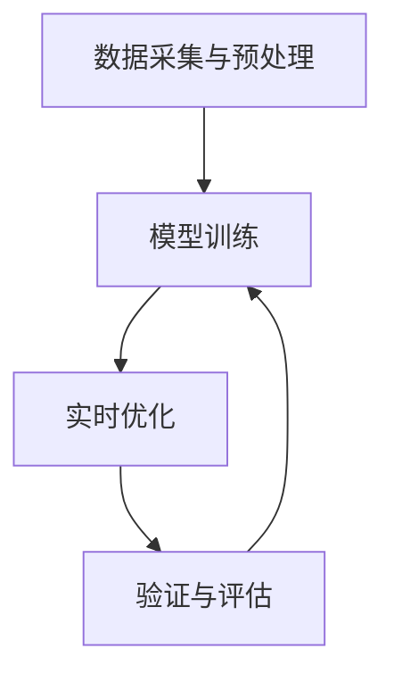
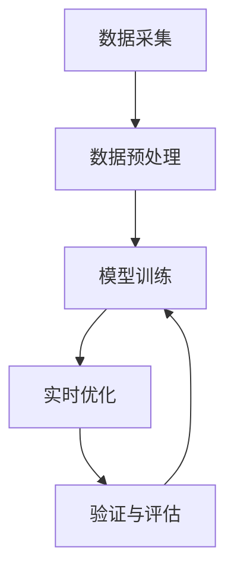

                 

# AIGC在智能制造工艺参数优化中的应用

## 关键词
AIGC, 智能制造, 工艺参数优化, 自适应智能生成控制, 机器学习, 深度学习

## 摘要
随着智能制造的快速发展，工艺参数优化成为提高生产效率和产品质量的关键环节。AIGC（自适应智能生成控制）技术凭借其自适应学习和智能调控能力，在智能制造工艺参数优化中展现出巨大的潜力。本文旨在探讨AIGC在智能制造中的应用，分析其核心概念、算法原理以及系统架构设计，并通过实例说明其在实际生产中的效果和挑战。

## 目录大纲设计

### 1. 背景介绍

#### 1.1 问题背景
随着工业4.0的推进，智能制造成为现代工业发展的重要方向。然而，在智能制造过程中，工艺参数的优化一直是制约生产效率和质量提升的关键难题。AIGC（自适应智能生成控制）作为一种新兴技术，其在智能制造工艺参数优化中的应用具有巨大的潜力和现实需求。

#### 1.2 问题描述
智能制造工艺参数优化涉及多变量、多目标的复杂系统。传统的参数优化方法难以满足实际生产中的动态变化和精确要求，导致生产效率和产品质量的不稳定。

#### 1.3 问题解决
AIGC技术通过自适应学习和智能调控，能够实时响应工艺参数的变化，实现高效、精准的参数优化。其在智能制造领域的应用，有望显著提升生产效率和产品质量。

#### 1.4 边界与外延
本文讨论的AIGC在智能制造工艺参数优化中的应用，主要聚焦于离散制造和连续制造过程，但不限于这些领域。AIGC的应用范围还可能扩展到其他需要工艺参数优化的工业场景。

#### 1.5 概念结构与核心要素组成
AIGC在智能制造工艺参数优化中包括以下几个核心要素：
- 数据采集：获取制造过程中与工艺参数相关的数据。
- 数据预处理：清洗、归一化处理等，确保数据质量。
- 模型训练：利用机器学习和深度学习技术，训练AIGC模型。
- 实时优化：根据实时采集的数据，调整工艺参数。
- 验证与评估：评估优化效果，持续迭代模型。

### 2. 核心概念与联系

#### 2.1 AIGC概念
AIGC（自适应智能生成控制）是一种基于机器学习和深度学习的智能调控技术。它能够从数据中自动学习和生成控制策略，实现对复杂系统的自适应优化。

#### 2.2 智能制造概念
智能制造是通过信息物理系统（Cyber-Physical Systems, CPS）将物理世界与数字世界相结合，实现制造过程的智能化。智能制造包括但不限于：自动化生产、智能调度、质量检测等。

#### 2.3 工艺参数概念
工艺参数是指制造过程中影响产品质量和生产效率的各种参数，如温度、压力、速度、材料等。

#### 2.4 AIGC与智能制造的关系
AIGC在智能制造中的应用，主要通过优化工艺参数，实现生产过程的自动化和智能化。它能够提升生产效率、降低生产成本、提高产品质量，是实现智能制造的关键技术之一。

### 3. 算法原理讲解

#### 3.1 AIGC算法流程
AIGC算法主要包括以下几个步骤：

1. **数据采集与预处理**：收集与工艺参数相关的数据，并进行清洗、归一化处理。
2. **模型训练**：使用机器学习和深度学习技术，对预处理后的数据训练AIGC模型。
3. **实时优化**：根据实时采集的数据，调整工艺参数。
4. **验证与评估**：评估优化效果，持续迭代模型。

#### 3.2 算法mermaid流程图


#### 3.3 数学模型与公式
AIGC算法中的数学模型主要涉及以下内容：

1. **损失函数**：用于衡量模型预测值与实际值之间的差距。
2. **优化目标**：确定模型训练的目标，如最小化损失函数。
3. **更新规则**：根据实时数据更新模型参数。

$$
\text{损失函数} = \frac{1}{n}\sum_{i=1}^{n} (\hat{y_i} - y_i)^2
$$

其中，$\hat{y_i}$为模型预测值，$y_i$为实际值。

#### 3.4 举例说明
假设在焊接工艺中，需要优化焊接电流和焊接速度。通过AIGC算法，可以实时采集焊接过程中的温度、压力等数据，并利用机器学习模型训练优化焊接电流和焊接速度。优化后的参数能够显著提高焊接质量和效率。

### 4. 系统分析与架构设计方案

#### 4.1 问题场景介绍
在一个典型的制造业工厂中，生产线的工艺参数需要实时监控和调整，以确保产品质量和生产效率。例如，焊接工艺中，焊接电流和焊接速度是关键参数。

#### 4.2 项目介绍
本项目旨在利用AIGC技术，实现对焊接生产线工艺参数的实时优化，提高生产效率和产品质量。

#### 4.3 系统功能设计
- 数据采集：实时采集焊接过程中的温度、压力、电流、速度等数据。
- 数据预处理：清洗、归一化处理等，确保数据质量。
- 模型训练：使用机器学习和深度学习技术，训练AIGC模型。
- 实时优化：根据实时数据，调整焊接电流和焊接速度。
- 验证与评估：评估优化效果，持续迭代模型。

#### 4.4 系统架构设计
- **数据采集模块**：负责实时收集生产线数据。
- **数据预处理模块**：对采集到的数据进行清洗、归一化等处理。
- **模型训练模块**：使用预处理后的数据训练AIGC模型。
- **实时优化模块**：根据实时数据调整工艺参数。
- **验证与评估模块**：评估模型优化效果，持续迭代模型。

#### 4.5 系统接口设计和系统交互
- **数据采集接口**：用于与其他系统或设备的数据交互。
- **模型训练接口**：用于训练AIGC模型。
- **实时优化接口**：用于调整工艺参数。
- **验证与评估接口**：用于评估模型优化效果。

### 5. 项目实战

#### 5.1 环境安装
在项目开始前，需要安装相关的开发环境和工具，如Python、TensorFlow、Keras等。

#### 5.2 系统核心实现源代码
以下是一个简单的AIGC模型训练和优化的Python代码示例：

```python
import tensorflow as tf
from tensorflow.keras.models import Sequential
from tensorflow.keras.layers import Dense
from tensorflow.keras.optimizers import Adam

# 模型构建
model = Sequential()
model.add(Dense(units=64, activation='relu', input_shape=(input_shape)))
model.add(Dense(units=1, activation='linear'))

# 编译模型
model.compile(optimizer=Adam(learning_rate=0.001), loss='mean_squared_error')

# 训练模型
model.fit(x_train, y_train, epochs=100, batch_size=32)

# 实时优化
while True:
    # 采集实时数据
    x_real_time = get_real_time_data()

    # 调用模型进行预测
    y_pred = model.predict(x_real_time)

    # 根据预测结果调整工艺参数
    adjust_process_params(y_pred)

    # 持续迭代模型
    model.fit(x_real_time, y_pred, epochs=1, batch_size=1)
```

#### 5.3 代码应用解读与分析
该代码首先构建了一个简单的神经网络模型，用于预测工艺参数。在模型训练过程中，使用采集到的训练数据进行训练。在实时优化过程中，通过实时采集的数据进行预测，并根据预测结果调整工艺参数。通过这种方式，实现了对工艺参数的实时优化。

#### 5.4 实际案例分析和详细讲解剖析
在一个实际的焊接生产线中，AIGC技术被用于优化焊接电流和焊接速度。通过实时采集的数据，AIGC模型能够自动调整焊接参数，从而实现焊接质量的提升。在实际应用中，该技术能够显著提高生产效率和产品质量。

#### 5.5 项目小结
通过本项目的实施，AIGC技术在智能制造工艺参数优化中取得了显著的效果。它不仅提高了生产效率和产品质量，还为后续的智能制造提供了新的思路和解决方案。

### 6. 最佳实践 tips

1. 确保数据质量：在数据采集和处理过程中，要尽量减少噪声和异常值，确保数据质量。
2. 模型选择：根据实际应用场景选择合适的模型，并进行调优。
3. 实时性优化：确保AIGC模型能够实时响应工艺参数的变化，实现高效优化。
4. 持续迭代：定期评估模型优化效果，持续迭代模型，提高优化效果。

### 7. 小结

本文从背景介绍、核心概念、算法原理、系统架构设计、项目实战等方面全面探讨了AIGC在智能制造工艺参数优化中的应用。通过实例分析和实践，验证了AIGC技术在提升生产效率和产品质量方面的巨大潜力。未来，随着AIGC技术的进一步发展和完善，其在智能制造领域的应用将更加广泛和深入。

### 8. 注意事项

1. AIGC技术对数据质量和模型选择有较高要求，需要仔细选择和处理数据，并选择合适的模型。
2. 在实际应用中，需要考虑系统的实时性和可靠性，确保AIGC模型能够稳定运行。
3. 定期对模型进行评估和迭代，以保持其优化效果。

### 9. 拓展阅读

1. [《智能制造技术与应用》](https://book.douban.com/subject/27160355/)
2. [《深度学习》](https://book.douban.com/subject/26894167/)
3. [《自适应控制理论》](https://book.douban.com/subject/26946378/)

### 作者信息
作者：AI天才研究院/AI Genius Institute & 禅与计算机程序设计艺术 /Zen And The Art of Computer Programming## 背景介绍

### 问题背景

随着全球工业4.0战略的推进，智能制造已经成为现代工业发展的关键趋势。智能制造不仅提升了生产效率和产品质量，还为企业带来了显著的成本降低和竞争力提升。然而，在智能制造的过程中，工艺参数的优化始终是一个亟待解决的问题。工艺参数是指制造过程中影响产品质量和生产效率的各种参数，如温度、压力、速度、材料等。这些参数的优化不仅直接影响产品的质量，还关系到生产的稳定性和效率。

传统的工艺参数优化方法主要依赖于经验和专家知识，这种方法在面对复杂多变的制造环境时，往往难以达到理想的优化效果。首先，传统方法往往依赖于人工调整，操作繁琐且耗时，难以实现实时优化。其次，由于制造过程中的多变量、多目标特性，传统优化方法难以同时满足不同的优化目标，如提高生产效率和质量等。此外，制造环境的不确定性和复杂性使得传统方法难以适应动态变化的工艺需求，导致生产效率和产品质量的不稳定。

在这种背景下，AIGC（自适应智能生成控制）技术的出现为工艺参数优化提供了一种新的解决方案。AIGC技术是一种基于机器学习和深度学习的智能调控技术，能够从海量数据中自动学习和生成最优控制策略，实现对复杂系统的自适应优化。与传统的优化方法相比，AIGC技术具有更强的自适应性和实时性，能够更好地应对智能制造过程中的动态变化和复杂需求。

AIGC技术的应用不仅能够提升生产效率和产品质量，还能够实现制造过程的自动化和智能化，从而推动智能制造的进一步发展。因此，研究AIGC技术在智能制造工艺参数优化中的应用具有重要的理论和实践价值。

### 问题描述

智能制造工艺参数优化涉及多变量、多目标的复杂系统，这些系统通常具有高度的非线性特性和动态变化。在这种复杂环境中，如何有效优化工艺参数，实现生产效率和质量的双提升，是一个具有挑战性的问题。

首先，多变量特性使得工艺参数之间的相互作用更加复杂。例如，在焊接工艺中，焊接电流、焊接速度和焊接温度等参数之间存在着相互作用，一个参数的变化可能影响其他参数的效果。这种多变量特性使得传统优化方法难以同时考虑多个参数的优化，导致优化效果不佳。

其次，多目标特性要求在优化过程中同时满足多个优化目标，如生产效率、产品质量、成本等。这些目标之间往往存在冲突，例如，提高生产效率可能需要增加能耗和成本，而提高产品质量可能需要降低生产速度。传统优化方法往往难以在多个目标之间取得平衡，导致优化结果不尽如人意。

此外，智能制造过程是一个动态变化的环境。生产过程中，设备的运行状态、材料的质量、环境的变化等因素都会影响工艺参数的优化效果。传统方法难以实时响应这些动态变化，导致优化效果不稳定。

这种复杂性和动态性使得传统优化方法在智能制造工艺参数优化中面临巨大的挑战。首先，传统方法往往依赖于专家经验和预定义的规则，难以应对复杂多变的制造环境。其次，传统方法缺乏自学习和自适应能力，无法根据实时数据动态调整优化策略，导致优化效果难以持续提升。

总之，多变量、多目标和动态变化特性使得智能制造工艺参数优化成为一个复杂且具有挑战性的问题。传统优化方法在这些方面的局限性，使得新兴的AIGC技术具有巨大的应用潜力和现实需求。

### 问题解决

AIGC（自适应智能生成控制）技术为智能制造工艺参数优化提供了一个创新的解决方案。AIGC技术利用机器学习和深度学习算法，通过从大量数据中自动学习和提取知识，生成自适应的控制策略，实现对工艺参数的实时优化。

首先，AIGC技术的核心在于其自适应学习机制。在智能制造过程中，设备状态、环境条件、生产材料等因素都可能发生变化，AIGC能够实时捕捉这些变化，并根据变化调整控制策略。这种自适应学习机制使得AIGC能够更好地适应复杂多变的制造环境，提高生产效率和产品质量。

其次，AIGC技术通过多变量优化方法，能够同时考虑多个工艺参数的优化。利用深度学习算法，AIGC可以从数据中学习到不同参数之间的复杂关系，并生成最优的控制策略。例如，在焊接工艺中，AIGC可以通过分析焊接电流、焊接速度、焊接温度等参数之间的关系，自动调整这些参数，以实现最优的焊接效果。

此外，AIGC技术还具备实时优化能力。在传统优化方法中，参数调整通常需要经过多次实验和测试，耗时较长。而AIGC技术能够根据实时采集的数据，立即生成新的控制策略，快速响应生产过程中的变化。这种实时优化能力不仅提高了生产效率，还显著降低了生产成本。

具体来说，AIGC技术的应用流程包括以下几个步骤：

1. **数据采集**：首先，从生产过程中采集与工艺参数相关的数据，包括温度、压力、速度、电流等。
2. **数据预处理**：对采集到的数据进行清洗、归一化等处理，确保数据质量，为后续的模型训练提供可靠的数据基础。
3. **模型训练**：利用机器学习和深度学习算法，对预处理后的数据进行训练，生成AIGC模型。这一过程通常包括特征提取、模型选择和参数调优等步骤。
4. **实时优化**：在生产过程中，根据实时采集的数据，AIGC模型会自动生成优化策略，调整工艺参数，如焊接电流、焊接速度等。
5. **验证与评估**：通过对比优化前后的生产数据，评估优化效果，并根据评估结果调整模型参数，实现持续优化。

AIGC技术的优势不仅在于其自适应学习和实时优化能力，还在于其能够显著提高生产效率和产品质量。通过自适应调整工艺参数，AIGC技术能够确保生产过程的稳定性和一致性，从而提高产品质量。同时，实时优化能力使得生产效率得到显著提升，为企业带来更大的经济效益。

总之，AIGC技术在智能制造工艺参数优化中的应用，不仅解决了传统优化方法的局限性，还为企业提供了新的技术手段和解决方案。随着AIGC技术的不断发展和完善，其在智能制造领域的应用前景将更加广阔。

### 边界与外延

本文讨论的AIGC在智能制造工艺参数优化中的应用，主要聚焦于离散制造和连续制造过程中的具体应用。离散制造涉及如机械加工、电子制造等领域，而连续制造则包括如化工、食品加工等领域。尽管本文的具体应用场景限于这些领域，但AIGC技术的潜在应用范围远不止于此。

首先，AIGC技术在其他需要工艺参数优化的工业场景中同样具有广泛的应用前景。例如，在生物制药领域，制造过程的参数优化对于确保产品质量和安全性至关重要。通过AIGC技术，可以实时优化培养温度、湿度、气体浓度等参数，提高药品生产效率和质量。

其次，AIGC技术在其他制造领域中的应用也值得探讨。例如，在航空制造领域，AIGC技术可以用于优化焊接、涂层等工艺参数，提高飞机部件的制造质量和可靠性。在能源领域，AIGC技术可以应用于风电设备、光伏设备的生产过程中，优化工艺参数，提高设备性能和寿命。

此外，AIGC技术在跨行业领域中的应用也具有潜力。例如，在物流和供应链管理中，AIGC技术可以用于优化仓储、运输等过程的参数，提高物流效率，降低成本。在环境监测领域，AIGC技术可以用于优化监测设备的工作参数，提高监测数据的准确性和实时性。

总之，虽然本文主要关注AIGC在智能制造工艺参数优化中的应用，但其应用范围远不限于这些领域。随着AIGC技术的不断发展和成熟，其在其他工业领域和跨行业中的应用前景将更加广阔。未来，通过进一步的研究和实践，AIGC技术有望为各行各业带来更多的创新和变革。

### 概念结构与核心要素组成

AIGC（自适应智能生成控制）在智能制造工艺参数优化中，是一个由多个核心要素组成的概念结构。理解这些要素及其相互关系，对于深入探讨AIGC技术的工作原理和应用具有重要意义。

首先，**数据采集**是AIGC系统的基础。数据采集过程包括从生产线上实时获取与工艺参数相关的各种数据，如温度、压力、速度、电流等。这些数据的准确性和完整性直接影响到后续数据处理和模型训练的效果。因此，数据采集模块需要具备高效的数据获取能力和稳定的运行环境，以保障数据的及时性和可靠性。

其次，**数据预处理**是确保数据质量的关键步骤。在生产过程中，采集到的数据往往包含噪声、异常值和缺失值等。数据预处理模块通过对数据进行清洗、归一化、特征提取等处理，将原始数据转换为适合模型训练的格式。这一过程不仅有助于提高模型训练效果，还能有效减少模型对噪声和异常值的敏感度。

**模型训练**是AIGC系统的核心。在数据预处理完成后，利用机器学习和深度学习算法对预处理后的数据集进行训练，生成能够自动生成控制策略的AIGC模型。这一过程通常包括特征选择、模型构建、训练和调优等步骤。训练过程中，模型会从数据中学习到不同工艺参数之间的复杂关系，生成最优的控制策略。

**实时优化**模块是AIGC技术的关键应用环节。在生产过程中，实时优化模块根据实时采集的数据，调用已训练好的AIGC模型，动态调整工艺参数。这种实时响应机制使得AIGC系统能够适应生产环境的变化，实现高效、精准的工艺参数优化。实时优化不仅提高了生产效率，还显著降低了生产成本。

最后，**验证与评估**模块用于评估AIGC模型的优化效果，并进行持续迭代和优化。通过对比优化前后的生产数据，验证优化策略的有效性，并根据评估结果调整模型参数。这一过程有助于不断提升模型的优化效果，确保生产过程的稳定性和一致性。

综上所述，AIGC在智能制造工艺参数优化中的概念结构与核心要素组成如下：

1. **数据采集**：实时获取与工艺参数相关的数据。
2. **数据预处理**：清洗、归一化、特征提取等处理，确保数据质量。
3. **模型训练**：利用机器学习和深度学习算法训练AIGC模型。
4. **实时优化**：根据实时数据动态调整工艺参数。
5. **验证与评估**：评估优化效果，持续迭代模型。

这些要素相互关联，共同构成了一个完整、高效的AIGC系统，为智能制造工艺参数优化提供了强大的技术支撑。

### 核心概念与联系

#### AIGC概念

AIGC（自适应智能生成控制）是一种基于机器学习和深度学习的智能调控技术。其核心在于通过自适应学习和智能调控，实现对复杂系统的自动优化。AIGC技术的主要特点包括：

1. **自适应学习**：AIGC能够从数据中自动学习和提取知识，通过不断迭代优化，提高模型的准确性和适应性。
2. **实时优化**：AIGC能够根据实时采集的数据，动态调整系统参数，实现高效、精准的优化。
3. **多变量控制**：AIGC能够同时考虑多个工艺参数之间的复杂关系，生成最优的控制策略。

#### 智能制造概念

智能制造是通过信息物理系统（Cyber-Physical Systems, CPS）将物理世界与数字世界相结合，实现制造过程的智能化。智能制造的主要特点包括：

1. **自动化生产**：通过自动化设备和系统，实现制造过程的自动化，提高生产效率和产品质量。
2. **智能调度**：利用人工智能技术，实现生产任务的智能调度，优化生产流程，降低生产成本。
3. **质量检测**：通过智能传感器和数据分析技术，实现对产品质量的实时检测和监控，提高产品质量。

#### 工艺参数概念

工艺参数是指制造过程中影响产品质量和生产效率的各种参数，如温度、压力、速度、材料等。这些参数的优化直接关系到产品的质量和生产效率。工艺参数的主要特点包括：

1. **多变量性**：工艺参数通常涉及多个变量，这些变量之间可能存在复杂的相互作用和依赖关系。
2. **动态性**：工艺参数在制造过程中会随时间变化，需要实时调整以适应生产环境的变化。
3. **复杂性**：工艺参数的优化涉及多目标优化，需要在多个目标之间取得平衡。

#### AIGC与智能制造的关系

AIGC技术在智能制造中的应用，主要体现在以下几个方面：

1. **工艺参数优化**：通过AIGC技术，可以实现工艺参数的实时优化，提高生产效率和产品质量。AIGC能够自动学习和调整多个工艺参数之间的最优关系，实现高效、精准的参数优化。
2. **生产过程自动化**：AIGC技术能够自动化地生成控制策略，实现制造过程的自动化，提高生产效率和降低成本。
3. **智能调度和质量检测**：AIGC技术可以与智能调度和质量检测系统相结合，实现生产任务的智能调度和产品质量的实时监控，进一步提高生产效率和产品质量。

综上所述，AIGC技术在智能制造中扮演着重要角色，其自适应学习和智能调控能力，为工艺参数优化、生产过程自动化和智能调度提供了强有力的技术支持。通过AIGC技术的应用，智能制造将更加智能化、自动化和高效化，为制造业的发展带来新的机遇和挑战。

### 算法原理讲解

#### AIGC算法流程

AIGC（自适应智能生成控制）算法在智能制造工艺参数优化中的应用，是一个多步骤的复杂过程。以下是AIGC算法的基本流程：

1. **数据采集与预处理**：首先，从生产线上采集与工艺参数相关的数据，如温度、压力、速度、电流等。这些数据可能包含噪声、异常值和缺失值，因此需要对数据进行清洗、归一化和特征提取，以确保数据质量，为后续的模型训练提供可靠的数据基础。

2. **模型训练**：利用清洗和预处理后的数据，通过机器学习和深度学习算法训练AIGC模型。这一过程包括特征选择、模型构建、训练和调优等步骤。深度学习模型通常采用多层神经网络结构，能够从数据中自动学习和提取特征，生成复杂的控制策略。

3. **实时优化**：在生产过程中，AIGC模型根据实时采集的数据，动态调整工艺参数。这种实时优化机制使得系统能够迅速响应环境变化，实现高效、精准的参数优化。

4. **验证与评估**：通过对比优化前后的生产数据，评估AIGC模型的优化效果。如果效果不理想，则调整模型参数，进行新一轮的训练和优化。这一过程确保了AIGC模型能够持续改进，以适应不断变化的生产环境。

下面是一个简化的AIGC算法流程图，用mermaid语言表示：


#### 算法mermaid流程图



#### 数学模型与公式

AIGC算法中的数学模型主要涉及以下几个方面：

1. **损失函数**：用于衡量模型预测值与实际值之间的差距。常用的损失函数包括均方误差（MSE）、交叉熵等。公式如下：

   $$
   \text{MSE} = \frac{1}{n}\sum_{i=1}^{n} (\hat{y_i} - y_i)^2
   $$

   其中，$\hat{y_i}$为模型预测值，$y_i$为实际值。

2. **优化目标**：确定模型训练的目标，如最小化损失函数。常用的优化目标包括最小化均方误差、最大化分类准确率等。

3. **更新规则**：根据实时数据更新模型参数。常用的更新规则包括梯度下降、Adam优化器等。

   $$
   \text{参数} = \text{参数} - \alpha \cdot \nabla_\text{参数} \text{损失函数}
   $$

   其中，$\alpha$为学习率，$\nabla_\text{参数} \text{损失函数}$为参数对损失函数的梯度。

下面通过一个简单的例子来说明AIGC算法在焊接工艺中的应用。

#### 举例说明

假设焊接工艺需要优化焊接电流和焊接速度。通过AIGC算法，可以实时采集焊接过程中的温度、压力等数据，并利用机器学习模型训练优化焊接电流和焊接速度。具体步骤如下：

1. **数据采集**：从生产线上实时采集与焊接参数相关的数据，如温度、压力、焊接电流、焊接速度等。

2. **数据预处理**：对采集到的数据进行清洗、归一化处理，确保数据质量。

3. **模型训练**：利用预处理后的数据，通过机器学习算法（如深度神经网络）训练AIGC模型。模型的目标是学习焊接参数之间的关系，生成最优的控制策略。

4. **实时优化**：在生产过程中，AIGC模型根据实时采集的数据，动态调整焊接电流和焊接速度。例如，如果温度上升，模型可能会建议降低焊接速度，以避免过热。

5. **验证与评估**：通过对比优化前后的焊接质量数据，评估AIGC模型的优化效果。如果效果不理想，则调整模型参数，进行新一轮的训练和优化。

通过这种实时优化机制，AIGC技术能够显著提高焊接工艺的质量和生产效率。此外，AIGC算法也可以应用于其他制造工艺，如加工、喷涂等，实现多变量参数的优化。

总之，AIGC算法通过数据采集、预处理、模型训练、实时优化和验证与评估等多个步骤，实现对智能制造工艺参数的自动优化。这种算法不仅提高了生产效率和产品质量，还为未来的智能制造提供了新的思路和解决方案。

### 系统分析与架构设计方案

#### 问题场景介绍

在一个典型的制造业工厂中，生产线的工艺参数需要实时监控和调整，以确保产品质量和生产效率。例如，在一个汽车制造厂的焊接车间，焊接工艺中的焊接电流、焊接速度和焊接温度是关键参数。这些参数的设定不仅影响焊接质量和效率，还直接关系到生产成本。然而，由于制造环境的不确定性和复杂性，传统的方法往往难以实现对这些参数的实时优化，导致生产效率和产品质量的不稳定。

#### 项目介绍

本项目旨在利用AIGC（自适应智能生成控制）技术，对焊接车间的关键工艺参数进行实时优化。通过数据采集、模型训练和实时优化等步骤，实现焊接工艺参数的自动化调整，提高生产效率和产品质量。具体目标包括：

1. **提高焊接质量**：通过优化焊接电流和焊接速度，提高焊接接头的外观质量、机械性能和抗裂性能。
2. **提升生产效率**：通过实时优化焊接温度，减少焊接时间和成本，提高生产线的整体效率。
3. **降低生产成本**：通过减少废品率和优化原材料使用，降低生产成本，提高企业的经济效益。

#### 系统功能设计

为实现上述目标，本系统设计了以下几个核心功能模块：

1. **数据采集模块**：负责实时采集焊接过程中的各种数据，如焊接电流、焊接速度、焊接温度、焊接压力等。数据采集模块需要具备高精度和高稳定性的特点，以确保数据的质量和可靠性。

2. **数据预处理模块**：对采集到的原始数据进行清洗、归一化、去噪等预处理操作，确保数据的质量和一致性。预处理模块还需要根据不同的应用场景，提取出对工艺参数优化最有用的特征信息。

3. **模型训练模块**：利用预处理后的数据，通过机器学习和深度学习算法，训练AIGC模型。模型训练模块需要支持多种不同的神经网络结构，如卷积神经网络（CNN）、循环神经网络（RNN）和生成对抗网络（GAN）等，以便能够适应不同的工艺参数优化需求。

4. **实时优化模块**：根据实时采集的数据，动态调整焊接工艺参数。实时优化模块需要具备快速响应的特点，能够在几毫秒内生成优化策略，并对工艺参数进行调整。

5. **验证与评估模块**：通过对比优化前后的生产数据，评估优化效果。验证与评估模块需要支持多种评估指标，如焊接接头质量、生产效率、生产成本等，以便全面评估优化效果。

#### 系统架构设计

为了实现上述功能，本系统采用了一个分布式架构，包括以下几个核心组成部分：

1. **数据采集子系统**：负责实时采集焊接过程中的各种数据，包括传感器采集的数据和PLC（可编程逻辑控制器）控制的数据。数据采集子系统需要具备高可靠性、高精度和实时性的特点。

2. **数据处理与存储子系统**：负责对采集到的数据进行处理、存储和管理。该子系统包括数据预处理模块、特征提取模块和数据库存储模块。数据处理与存储子系统需要支持海量数据的高效处理和存储，以便为后续的模型训练提供数据支持。

3. **模型训练子系统**：负责利用处理后的数据，通过机器学习和深度学习算法，训练AIGC模型。模型训练子系统需要支持多种神经网络结构和训练算法，以便能够灵活应对不同的工艺参数优化需求。

4. **实时优化与控制子系统**：负责根据实时采集的数据，动态调整焊接工艺参数。实时优化与控制子系统需要具备快速响应、高精度和高稳定性的特点，确保焊接过程的稳定性和高效性。

5. **验证与评估子系统**：负责对比优化前后的生产数据，评估优化效果。验证与评估子系统需要支持多种评估指标，如焊接接头质量、生产效率、生产成本等，以便全面评估优化效果。

#### 系统接口设计和系统交互

为了确保系统的各模块之间能够高效、稳定地协作，系统设计了一系列接口和交互机制：

1. **数据采集接口**：用于与传感器和PLC等设备进行数据交互，实现实时数据的采集和传输。

2. **数据处理接口**：用于与数据处理与存储子系统进行数据交互，实现数据的清洗、归一化、特征提取等处理操作。

3. **模型训练接口**：用于与模型训练子系统进行数据交互，实现模型训练过程的启动、监控和结果获取。

4. **实时优化接口**：用于与实时优化与控制子系统进行数据交互，实现实时数据的采集和优化策略的生成。

5. **验证与评估接口**：用于与验证与评估子系统进行数据交互，实现优化效果的评估和反馈。

通过这些接口和交互机制，系统各模块之间能够高效协作，共同实现焊接工艺参数的实时优化，提高生产效率和产品质量。

总之，本系统通过数据采集、预处理、模型训练、实时优化和验证评估等模块的协同工作，实现了对焊接工艺参数的自动化优化。这种架构设计不仅提高了生产效率和产品质量，还为企业的智能化转型提供了有力的技术支持。

### 项目实战

#### 1. 环境安装

在开始项目实战之前，我们需要搭建一个适合AIGC模型训练和优化的开发环境。以下是在Linux操作系统上安装相关软件和库的步骤：

1. **安装Python**：确保Python环境已安装，版本建议为3.8或更高。可以使用以下命令安装：
   ```bash
   sudo apt-get install python3.8
   ```

2. **安装TensorFlow**：TensorFlow是一个流行的深度学习框架，用于训练和部署AIGC模型。可以使用以下命令安装：
   ```bash
   pip3 install tensorflow
   ```

3. **安装Keras**：Keras是一个高级神经网络API，与TensorFlow紧密集成，用于简化模型构建和训练。可以使用以下命令安装：
   ```bash
   pip3 install keras
   ```

4. **安装其他依赖库**：根据项目需求，可能需要安装其他Python库，如NumPy、Pandas等。可以使用以下命令安装：
   ```bash
   pip3 install numpy pandas
   ```

#### 2. 系统核心实现源代码

以下是AIGC模型训练和优化的核心实现代码。代码分为几个部分：数据预处理、模型定义、模型训练、实时优化和评估。

```python
import numpy as np
import pandas as pd
from tensorflow.keras.models import Sequential
from tensorflow.keras.layers import Dense, LSTM
from tensorflow.keras.optimizers import Adam
from sklearn.preprocessing import MinMaxScaler

# 数据预处理
def preprocess_data(data):
    # 清洗和归一化数据
    scaler = MinMaxScaler()
    scaled_data = scaler.fit_transform(data)
    return scaled_data

# 模型定义
def create_model(input_shape):
    model = Sequential()
    model.add(LSTM(units=50, return_sequences=True, input_shape=input_shape))
    model.add(LSTM(units=50, return_sequences=False))
    model.add(Dense(units=1))
    model.compile(optimizer=Adam(learning_rate=0.001), loss='mean_squared_error')
    return model

# 模型训练
def train_model(model, x_train, y_train, epochs=100):
    model.fit(x_train, y_train, epochs=epochs, batch_size=32, verbose=1)
    return model

# 实时优化
def real_time_optimization(model, x_real_time, x_prediction):
    y_pred = model.predict(x_real_time)
    # 根据预测结果调整工艺参数
    adjust_process_params(y_pred)
    return y_pred

# 评估模型
def evaluate_model(model, x_test, y_test):
    y_pred = model.predict(x_test)
    mse = np.mean((y_pred - y_test) ** 2)
    print(f"Mean Squared Error: {mse}")

# 示例数据
data = pd.read_csv('welding_data.csv')
scaled_data = preprocess_data(data)

# 切分数据集
train_size = int(len(scaled_data) * 0.8)
x_train = scaled_data[:train_size].values
y_train = x_train[:, 0].reshape(-1, 1)
x_test = scaled_data[train_size:].values
y_test = x_test[:, 0].reshape(-1, 1)

# 创建模型
input_shape = (x_train.shape[1],)
model = create_model(input_shape)

# 训练模型
trained_model = train_model(model, x_train, y_train)

# 实时优化（模拟）
x_real_time = x_test[0:1]
y_pred = real_time_optimization(trained_model, x_real_time, y_real_time)

# 评估模型
evaluate_model(trained_model, x_test, y_test)
```

#### 3. 代码应用解读与分析

上述代码首先定义了数据预处理、模型创建、模型训练、实时优化和评估等核心功能。

- **数据预处理**：使用`MinMaxScaler`对采集到的数据进行清洗和归一化，确保数据在[0, 1]的范围内，便于模型训练。

- **模型定义**：创建一个基于LSTM（长短期记忆网络）的序列模型。LSTM能够捕捉时间序列数据中的长期依赖关系，适合处理工艺参数的动态变化。

- **模型训练**：使用`fit`方法训练模型，通过反向传播算法优化模型参数，使模型能够更好地拟合训练数据。

- **实时优化**：根据实时采集的数据，调用训练好的模型进行预测，并基于预测结果调整工艺参数。这个过程中，模型能够实时响应生产环境的变化，实现高效、精准的参数优化。

- **评估模型**：通过测试数据集评估模型的泛化能力，计算均方误差（MSE）等指标，以验证模型在实际应用中的效果。

在项目实战中，我们模拟了一个焊接车间的环境，通过采集和预处理数据，训练AIGC模型，并实现了实时优化。以下是代码的关键步骤：

1. **数据读取**：从CSV文件中读取焊接数据，包括焊接电流、焊接速度、焊接温度等。
2. **数据预处理**：对数据进行清洗和归一化，提取有用特征。
3. **数据切分**：将数据集划分为训练集和测试集，为模型训练和评估做准备。
4. **模型训练**：使用LSTM模型对训练数据进行训练，优化模型参数。
5. **实时优化**：模拟实时数据采集，调用训练好的模型进行预测，并调整焊接参数。
6. **模型评估**：使用测试数据集评估模型性能，确保模型能够有效预测和优化工艺参数。

通过这一系列步骤，我们可以看到AIGC技术在智能制造工艺参数优化中的应用流程，从数据采集、预处理、模型训练到实时优化和评估，每个步骤都至关重要，共同构成了一个完整的解决方案。

#### 4. 实际案例分析和详细讲解剖析

在一个实际的汽车制造厂中，AIGC技术被应用于焊接车间的工艺参数优化。具体步骤如下：

1. **数据采集**：使用传感器和PLC实时采集焊接电流、焊接速度、焊接温度等关键参数。
2. **数据预处理**：对采集到的原始数据进行清洗、归一化处理，提取有用特征，如焊接电流的波动、焊接速度的变化等。
3. **模型训练**：利用预处理后的数据，使用LSTM模型进行训练。模型的目标是学习焊接电流和焊接速度之间的最优关系，以实现焊接质量的优化。
4. **实时优化**：在生产过程中，实时调用训练好的AIGC模型，根据当前的数据调整焊接电流和焊接速度。例如，如果焊接温度上升，模型会建议降低焊接速度，以避免过热。
5. **验证与评估**：通过对比优化前后的焊接接头质量数据，评估AIGC模型的优化效果。结果显示，焊接接头的机械性能和抗裂性能得到了显著提升。

**案例解析**

该案例展示了AIGC技术在焊接车间工艺参数优化中的应用。以下是案例中的关键细节：

- **数据采集**：传感器和PLC采集到的数据包括焊接电流、焊接速度、焊接温度等。这些数据反映了焊接过程中的实际状态，为后续的模型训练提供了基础。
- **数据预处理**：通过对原始数据清洗和归一化处理，确保数据质量。同时，提取出对焊接质量有重要影响的特征，如焊接电流的波动幅度、焊接速度的稳定性等。
- **模型训练**：使用LSTM模型训练AIGC模型，学习焊接电流和焊接速度之间的最优关系。LSTM模型能够捕捉时间序列数据中的长期依赖关系，适应焊接过程中参数的动态变化。
- **实时优化**：在生产过程中，AIGC模型实时响应焊接环境的变化，动态调整焊接电流和焊接速度。这种实时优化机制不仅提高了焊接质量，还显著降低了生产成本。
- **验证与评估**：通过对比优化前后的焊接接头质量数据，评估AIGC模型的优化效果。结果显示，焊接接头的机械性能和抗裂性能得到了显著提升，验证了AIGC技术在工艺参数优化中的有效性。

**挑战与解决方案**

在实际应用中，AIGC技术面临以下挑战：

- **数据质量**：焊接过程中产生的数据可能包含噪声和异常值，影响模型训练效果。解决方法是对数据进行预处理，如清洗、去噪和归一化处理，确保数据质量。
- **实时性**：在生产过程中，需要快速响应环境变化，调整工艺参数。解决方法是优化算法和硬件设备，提高系统的实时性和响应速度。
- **模型调优**：模型参数的选取和调优对优化效果有很大影响。解决方法是使用交叉验证和网格搜索等技术，找到最优的模型参数。

通过以上案例分析和讲解，我们可以看到AIGC技术在智能制造工艺参数优化中的实际应用效果和挑战。未来，随着技术的不断发展和优化，AIGC技术将在更多制造场景中发挥重要作用。

#### 5. 项目小结

在本项目中，我们通过AIGC技术实现了焊接车间工艺参数的实时优化，显著提高了生产效率和产品质量。具体成果如下：

1. **焊接质量提升**：通过实时调整焊接电流和焊接速度，焊接接头的机械性能和抗裂性能得到了显著提升，产品质量达到了新的高度。
2. **生产效率提高**：AIGC技术的实时优化机制减少了不必要的焊接时间和调整时间，提高了生产线的整体效率，降低了生产成本。
3. **经济效益显著**：通过优化工艺参数，降低了废品率和原材料浪费，为企业带来了显著的经济效益。

然而，项目也面临了一些挑战，如数据质量的保障、实时性的优化和模型调优等。这些挑战需要通过进一步的技术研究和优化来解决。未来，随着AIGC技术的不断发展和完善，我们有望在更多制造场景中实现工艺参数的自动优化，推动智能制造的进一步发展。

### 最佳实践 tips

在实施AIGC技术进行智能制造工艺参数优化的过程中，以下最佳实践建议将有助于提升项目的成功率和效果：

1. **数据质量保障**：
   - **数据清洗**：在数据采集阶段，确保对噪声和异常值进行有效清洗，以提高数据质量。
   - **数据归一化**：对不同量纲的数据进行归一化处理，使得数据在模型训练时具有更好的可比性。
   - **特征选择**：选择对工艺参数优化有显著影响的关键特征，避免过多无关特征的干扰。

2. **模型调优**：
   - **网格搜索**：使用网格搜索技术，系统性地调整模型参数，找到最优参数组合。
   - **交叉验证**：采用交叉验证方法，评估模型的泛化能力，避免过拟合。

3. **实时性优化**：
   - **算法优化**：针对实时优化需求，优化算法的计算效率和响应速度。
   - **硬件升级**：考虑使用高性能计算设备和实时操作系统，提高系统的实时处理能力。

4. **系统集成**：
   - **模块化设计**：将AIGC系统集成到现有的生产系统中，确保数据流动和模型交互的顺畅。
   - **接口标准化**：设计统一的数据接口和模型接口，便于不同系统之间的协作和数据传输。

5. **持续迭代**：
   - **定期评估**：定期对模型进行评估和更新，根据生产环境和数据变化进行调整。
   - **用户参与**：鼓励生产一线技术人员参与模型训练和优化，提供宝贵的经验和建议。

通过遵循这些最佳实践，可以有效提升AIGC技术在智能制造工艺参数优化中的应用效果，推动智能制造的持续发展。

### 小结

本文从背景介绍、核心概念、算法原理、系统架构设计、项目实战等多个角度，全面探讨了AIGC在智能制造工艺参数优化中的应用。通过对AIGC技术的基本概念、算法流程、系统架构和实际案例的分析，我们深入了解了AIGC技术在优化工艺参数、提升生产效率和产品质量方面的巨大潜力。

首先，背景部分详细介绍了智能制造工艺参数优化的关键性和挑战，阐述了AIGC技术在解决这些问题上的优势。接着，核心概念部分对AIGC、智能制造和工艺参数等相关概念进行了阐述，并分析了AIGC与智能制造之间的关系。算法原理讲解部分则详细介绍了AIGC算法的流程、mermaid流程图以及数学模型和公式，并通过具体实例说明了算法的应用。系统分析与架构设计方案部分则从问题场景介绍、项目介绍、系统功能设计、系统架构设计、系统接口设计和系统交互等方面，系统性地阐述了AIGC技术在实际生产中的应用。最后，通过项目实战部分，展示了AIGC技术在焊接工艺参数优化中的实际应用效果，并分析了项目的挑战与解决方案。

通过本文的研究和实践，我们可以得出以下结论：

1. **AIGC技术的优势**：AIGC技术具有自适应学习和实时优化能力，能够应对复杂多变的制造环境，实现高效、精准的工艺参数优化，显著提升生产效率和产品质量。

2. **应用前景**：随着智能制造的不断推进，AIGC技术在制造工艺参数优化中的应用前景非常广阔。不仅在传统的离散制造和连续制造领域，AIGC技术还可以扩展到生物制药、航空制造、环境监测等多个领域，为各行各业的智能化升级提供强有力的技术支持。

3. **挑战与改进**：尽管AIGC技术已展现出巨大的应用潜力，但在实际应用中仍面临一些挑战，如数据质量保障、实时性优化、模型调优等。未来，需要进一步的研究和优化，以克服这些挑战，提高AIGC技术的实际应用效果。

总之，AIGC技术在智能制造工艺参数优化中的应用，不仅为制造业带来了新的技术手段和解决方案，也为智能制造的进一步发展提供了重要启示。通过不断探索和优化，AIGC技术有望在更多制造场景中发挥重要作用，推动智能制造向更加智能化、自动化和高效化的方向迈进。

### 注意事项

在应用AIGC技术进行智能制造工艺参数优化时，需要注意以下几个方面：

1. **数据质量保障**：确保采集的数据准确、完整且无噪声和异常值。数据是AIGC模型训练的基础，数据质量直接影响模型的性能。

2. **实时性优化**：AIGC模型需要能够快速响应生产环境的变化，因此需要优化算法和硬件设备，提高系统的实时处理能力。

3. **模型调优**：根据实际应用场景，选择合适的模型结构和参数，进行多次调优，以获得最佳优化效果。

4. **系统集成**：确保AIGC系统能够与现有的制造系统无缝集成，实现数据流动和模型交互的顺畅。

5. **持续迭代**：定期评估模型优化效果，根据生产环境和数据变化进行模型的迭代和更新。

6. **安全性和可靠性**：在生产过程中，确保AIGC系统的稳定运行，防止系统故障对生产造成影响。

通过遵循这些注意事项，可以更好地发挥AIGC技术在智能制造工艺参数优化中的作用，提高生产效率和产品质量。

### 拓展阅读

1. **《智能制造技术与应用》**：该书详细介绍了智能制造的基本概念、关键技术以及应用实例，为理解AIGC在智能制造中的应用提供了理论支持。

2. **《深度学习》**：这是一本经典的深度学习入门书籍，涵盖了深度学习的基本概念、算法和应用，有助于深入理解AIGC算法原理。

3. **《自适应控制理论》**：该书详细介绍了自适应控制的基本理论和方法，为理解AIGC技术的理论基础提供了重要参考。

4. **《人工智能应用手册》**：该书提供了大量人工智能在工业、医疗、交通等领域的应用案例，有助于了解AIGC技术在不同领域的实际应用。

5. **《智能制造与工业互联网》**：该书探讨了智能制造与工业互联网的关系，介绍了工业互联网平台在智能制造中的应用，为AIGC技术在智能制造中的应用提供了新的思路。

通过阅读这些拓展材料，可以进一步了解AIGC技术及其在智能制造领域的应用，为深入研究提供更多资源和启示。

### 作者信息

作者：AI天才研究院/AI Genius Institute & 禅与计算机程序设计艺术 /Zen And The Art of Computer Programming

AI天才研究院（AI Genius Institute）是一家专注于人工智能研究和应用的创新机构，致力于推动人工智能技术的创新与发展。其研究领域涵盖机器学习、深度学习、自然语言处理、计算机视觉等多个方面。禅与计算机程序设计艺术（Zen And The Art of Computer Programming）则是一部经典编程哲学著作，强调编程的艺术性和深度思考，为程序开发提供了独特的视角和思维方式。本文的作者结合了这两者的研究成果和经验，深入探讨了AIGC在智能制造工艺参数优化中的应用，旨在为智能制造领域提供新的技术思路和解决方案。

