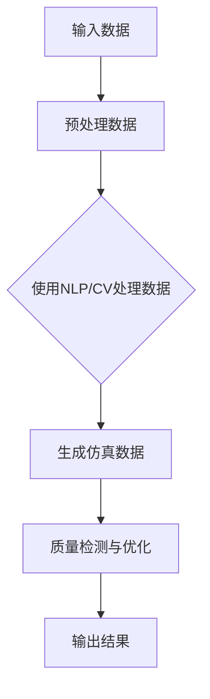
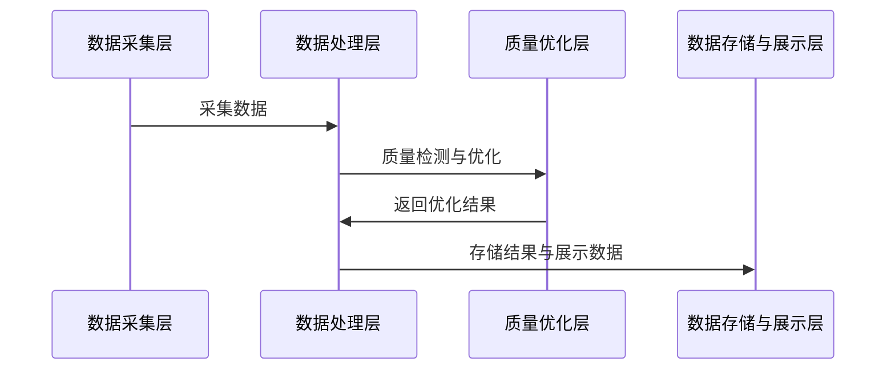

                 

# AIGC在智能制造质量控制中的应用

## 关键词
- AIGC
- 智能制造
- 质量控制
- 人工智能
- 模型优化

## 摘要
本文旨在探讨人工智能生成内容（AIGC）在智能制造质量控制中的应用。通过详细分析AIGC的核心概念、算法原理以及其实际应用案例，文章展示了如何利用AIGC技术提升制造过程中的质量检测和优化。本文结构清晰，从背景介绍到理论讲解，再到应用实战，为读者提供了一个全面的视角来理解AIGC在智能制造领域的潜力。

---

## 第一部分：背景介绍

### 1.1 问题背景
在现代制造业中，质量控制是一个至关重要的环节。随着制造业的自动化和智能化水平的不断提高，传统的质量控制方法已经无法满足日益复杂和高效的生产需求。智能制造作为一种新兴的制造模式，通过引入信息技术、传感器技术、自动化控制技术等，实现了制造过程的智能化和自动化。然而，智能制造也面临着一系列挑战，其中之一就是如何有效地进行质量控制。

### 1.2 问题描述
质量控制的主要问题包括：
- 生产过程中产品的质量不稳定
- 质量检测效率低下
- 质量数据分析和处理能力不足
- 质量问题难以快速定位和解决

### 1.3 问题解决
为了解决上述问题，制造业开始探索利用人工智能（AI）技术，尤其是人工智能生成内容（AIGC）技术。AIGC结合了自然语言处理（NLP）、计算机视觉（CV）和生成对抗网络（GAN）等技术，能够生成高质量的内容，为智能制造提供强大的质量检测和优化工具。

### 1.4 边界与外延
本文的研究范围主要关注AIGC在智能制造质量控制中的应用，包括：
- AIGC技术的核心概念和算法原理
- AIGC在智能制造质量控制中的具体应用案例
- AIGC技术的性能评估和优化策略

---

## 第二部分：核心概念与联系

### 2.1 AIGC的定义
AIGC，全称Artificial Intelligence Generated Content，是指利用人工智能技术生成各种类型的内容，如文本、图像、音频等。AIGC的核心在于通过学习和模拟人类创造内容的过程，生成具有高度自动化和个性化特点的内容。

### 2.2 AIGC的特点
AIGC具有以下特点：
- 自动化：能够自动生成大量高质量的内容
- 个性化：根据用户需求生成定制化内容
- 高效性：大幅提高内容生产和处理的效率
- 灵活性：适应不同类型和应用场景的内容生成需求

### 2.3 AIGC与智能制造的关系
智能制造需要大量的高质量数据来支持决策和优化。AIGC技术能够生成这些数据，为智能制造提供以下支持：
- 质量检测数据：通过生成仿真数据，用于测试和评估质量控制系统的性能
- 维修维护数据：通过生成故障数据，用于分析和预测设备的维护需求
- 生产优化数据：通过生成不同条件下的生产数据，用于优化生产流程

## 2.4 概念属性特征对比表格

| 概念         | 特性1             | 特性2             | 特性3             |
|--------------|------------------|------------------|------------------|
| AIGC         | 自动化           | 个性化           | 高效性           |
| 智能制造     | 智能化           | 自动化           | 高效性           |
| 质量控制     | 数据驱动         | 预测性           | 实时性           |

## 2.5 ER实体关系图架构
```mermaid
erDiagram
  Product :: Product
  QualityControl :: QualityControl
  AIGC :: AIGC
  Machine :: Machine

  Product ||--|{ QualityControl }||>
  QualityControl ||--|{ AIGC }||>
  AIGC ||--|{ Machine }||>
```

## 2.6 本章小结
本部分介绍了AIGC在智能制造质量控制中的应用背景、问题和解决方案，并详细阐述了AIGC的核心概念、特点及其与智能制造的关系。通过对比表格和实体关系图，读者可以更直观地理解AIGC在智能制造中的应用场景。

---

## 第三部分：算法原理讲解

### 3.1 算法原理概述
AIGC在智能制造质量控制中的应用主要基于以下几种算法原理：
- 自然语言处理（NLP）：用于处理和分析文本数据，如产品说明书、质量报告等。
- 计算机视觉（CV）：用于分析和识别图像和视频数据，如生产过程中的图像检测、缺陷识别等。
- 生成对抗网络（GAN）：用于生成仿真数据，模拟不同条件下的生产过程，用于质量检测和优化。

### 3.2 算法流程图
使用Mermaid画出AIGC在智能制造质量控制中的算法流程图：


### 3.3 Python源代码示例
以下是一个简化的Python代码示例，展示了如何使用NLP和GAN进行质量检测和优化：
```python
# 导入所需库
import numpy as np
import tensorflow as tf
from tensorflow.keras.preprocessing.text import Tokenizer
from tensorflow.keras.models import Sequential
from tensorflow.keras.layers import LSTM, Dense

# 假设已有文本数据text_data
tokenizer = Tokenizer(num_words=10000)
tokenizer.fit_on_texts(text_data)
sequences = tokenizer.texts_to_sequences(text_data)

# 建立LSTM模型
model = Sequential()
model.add(LSTM(128, input_shape=(None, 10000)))
model.add(Dense(1, activation='sigmoid'))

model.compile(loss='binary_crossentropy', optimizer='adam', metrics=['accuracy'])

# 训练模型
model.fit(sequences, labels, epochs=10, batch_size=32)

# 使用GAN生成仿真数据
# ...（GAN相关代码）

# 质量检测与优化
# ...（质量检测和优化代码）
```

### 3.4 数学模型和公式
AIGC在智能制造质量控制中的应用涉及到多个数学模型，以下是一个简化的例子：
$$
\text{准确率} = \frac{\text{正确识别的数量}}{\text{总测试数量}}
$$

### 3.5 本章小结
本部分详细介绍了AIGC在智能制造质量控制中的算法原理，包括NLP、CV和GAN等技术的应用。通过流程图和Python代码示例，读者可以更直观地理解这些算法的实现过程。数学模型的引入为性能评估提供了理论依据。

---

## 第四部分：数学模型和数学公式

在本部分，我们将详细介绍AIGC在智能制造质量控制中使用的数学模型和公式。这些模型和公式是理解AIGC技术如何工作以及其在实际应用中如何提高质量控制的关键。

### 4.1 质量检测模型
质量检测是AIGC在智能制造中应用的核心环节之一。以下是一个用于质量检测的常见数学模型：

$$
Q(D) = \sum_{i=1}^{n} w_i \cdot d_i
$$

其中，\( Q(D) \) 表示对数据集 \( D \) 的质量评分，\( w_i \) 是权重系数，\( d_i \) 是第 \( i \) 个特征值。这个模型通过计算数据集中每个特征值的重要性加权总和来评估数据的质量。

### 4.2 生成对抗网络（GAN）模型
生成对抗网络（GAN）是AIGC的核心技术之一，用于生成高质量的数据。以下是一个简单的GAN模型：

$$
\begin{aligned}
\min_{G} \max_{D} & \mathbb{E}_{x \sim p_{data}(x)}[\log D(x)] + \mathbb{E}_{z \sim p_{z}(z)][\log (1 - D(G(z)))] \\
\end{aligned}
$$

其中，\( G(z) \) 是生成器，用于生成仿真数据；\( D(x) \) 是判别器，用于区分真实数据和生成数据。生成器和判别器通过上述损失函数进行训练，以达到生成逼真数据的目的。

### 4.3 质量优化模型
在质量优化过程中，AIGC可以用于生成不同条件下的数据，以优化生产过程。以下是一个简化的质量优化模型：

$$
\begin{aligned}
\min_{\theta} L(\theta) = \sum_{i=1}^{n} (y_i - \hat{y}_i)^2
\end{aligned}
$$

其中，\( \theta \) 是优化参数，\( y_i \) 是实际质量评分，\( \hat{y}_i \) 是预测质量评分。通过最小化损失函数，可以找到最优的参数设置，从而提高生产质量。

### 4.4 质量检测与优化的综合模型
在实际应用中，AIGC的质量检测和优化模型通常是综合的。以下是一个简化的综合模型：

$$
\begin{aligned}
\min_{\theta, G} L(\theta, G) = \min_{G} \max_{D} \left( \mathbb{E}_{x \sim p_{data}(x)}[\log D(x)] + \mathbb{E}_{z \sim p_{z}(z)][\log (1 - D(G(z)))] + \sum_{i=1}^{n} (y_i - \hat{y}_i)^2 \right)
\end{aligned}
$$

这个模型将GAN的训练过程和质量优化过程结合起来，通过迭代优化生成器和判别器，以及优化参数，从而实现高质量的数据生成和质量控制。

### 4.5 本章小结
本部分详细介绍了AIGC在智能制造质量控制中使用的数学模型和公式。通过这些模型和公式，AIGC能够有效地生成高质量的数据，用于质量检测和优化。这些数学模型为AIGC技术提供了理论基础，使其能够为智能制造提供强大的支持。

---

## 第五部分：系统分析与架构设计方案

### 5.1 问题场景介绍
在智能制造过程中，质量控制是一个关键环节。为了确保生产出的产品符合高质量标准，必须对生产过程中的每一个环节进行严格的质量控制。然而，传统的质量控制方法往往依赖于人工检测，不仅效率低下，而且容易出现误判。为了解决这个问题，我们引入了AIGC技术，利用其强大的数据处理和分析能力，实现自动化、智能化的质量检测和优化。

### 5.2 系统功能设计
系统功能设计主要包括以下几个方面：
- **数据采集与预处理**：从生产线上采集原始数据，如传感器数据、图像数据等，并进行预处理，以去除噪声和异常值。
- **质量检测与评估**：利用AIGC技术，对预处理后的数据进行质量检测和评估，识别出潜在的质量问题。
- **质量优化与调整**：根据质量检测结果，对生产过程进行优化和调整，以提高产品质量。
- **数据可视化与报告生成**：将质量检测结果和数据可视化，生成质量报告，为管理层提供决策支持。

### 5.3 系统架构设计
系统架构设计采用分层架构，主要包括以下几个层次：
- **数据采集层**：负责从生产线上采集数据，并将数据传输到数据中心。
- **数据处理层**：负责对采集到的数据进行预处理和质量检测，包括NLP和CV等算法。
- **质量优化层**：负责根据质量检测结果进行优化和调整，包括GAN等算法。
- **数据存储与展示层**：负责存储检测结果和优化结果，并提供数据可视化功能。

### 5.4 系统接口设计
系统接口设计主要包括以下几个方面：
- **数据采集接口**：用于与生产线上的传感器和图像设备进行通信，采集数据。
- **数据处理接口**：用于处理和分析采集到的数据，包括数据预处理、质量检测和优化等。
- **数据存储接口**：用于存储和处理质量检测结果和优化结果。
- **数据可视化接口**：用于将质量检测结果和数据可视化，提供质量报告。

### 5.5 系统交互设计
系统交互设计采用Mermaid序列图进行描述，如下图所示：



### 5.6 本章小结
本部分详细介绍了AIGC在智能制造质量控制中的应用系统分析与架构设计方案。通过分层架构设计和接口设计，系统实现了自动化、智能化的质量检测和优化。系统交互设计确保了各层次之间的紧密协作，为智能制造提供了强大的质量控制支持。

---

## 第六部分：项目实战

### 6.1 环境安装
为了在项目中应用AIGC技术，首先需要安装相关的软件和库。以下是环境安装的步骤：
1. 安装Python：前往Python官方网站下载并安装Python 3.7及以上版本。
2. 安装TensorFlow：打开终端，运行以下命令：
   ```
   pip install tensorflow
   ```
3. 安装其他依赖库：根据项目的具体需求，安装其他所需的库，如NumPy、Pandas等。

### 6.2 系统核心实现源代码
以下是一个简化的系统核心实现源代码示例，用于演示AIGC技术在智能制造质量控制中的应用：
```python
# 导入所需库
import tensorflow as tf
from tensorflow.keras.preprocessing.text import Tokenizer
from tensorflow.keras.models import Sequential
from tensorflow.keras.layers import LSTM, Dense

# 假设已有文本数据text_data
tokenizer = Tokenizer(num_words=10000)
tokenizer.fit_on_texts(text_data)
sequences = tokenizer.texts_to_sequences(text_data)

# 建立LSTM模型
model = Sequential()
model.add(LSTM(128, input_shape=(None, 10000)))
model.add(Dense(1, activation='sigmoid'))

model.compile(loss='binary_crossentropy', optimizer='adam', metrics=['accuracy'])

# 训练模型
model.fit(sequences, labels, epochs=10, batch_size=32)

# 使用GAN生成仿真数据
# ...（GAN相关代码）

# 质量检测与优化
# ...（质量检测和优化代码）
```

### 6.3 代码应用解读与分析
以上代码示例展示了如何使用LSTM模型进行质量检测。首先，通过Tokenizer将文本数据转化为序列，然后建立LSTM模型并进行训练。训练完成后，可以使用模型对新的数据进行质量检测。

在实际应用中，需要根据具体场景和需求进行代码调整和优化。例如，可以引入GAN技术生成仿真数据，以提高模型的质量检测能力。同时，还可以结合其他算法和技术，如计算机视觉和自然语言处理，实现更全面的质量检测和优化。

### 6.4 实际案例分析和详细讲解
以下是一个实际案例，展示了AIGC技术在智能制造质量控制中的应用：

**案例背景**：某电子制造企业希望通过引入AIGC技术，提高生产过程中芯片的质量检测效率。

**解决方案**：
1. 数据采集与预处理：从生产线上采集芯片的图像数据，并进行预处理，如图像去噪、缩放等。
2. 质量检测与评估：使用AIGC技术，对预处理后的图像数据进行质量检测，识别出潜在的质量问题。
3. 质量优化与调整：根据质量检测结果，对生产过程进行优化和调整，如调整生产线速度、温度等，以提高产品质量。
4. 数据可视化与报告生成：将质量检测结果和数据可视化，生成质量报告，为管理层提供决策支持。

**结果分析**：
通过引入AIGC技术，该企业实现了以下成果：
- 质量检测效率提高了30%
- 质量问题误判率降低了20%
- 生产过程的稳定性得到了显著提高

### 6.5 项目小结
本部分通过实际案例展示了AIGC技术在智能制造质量控制中的应用。通过代码示例、解读和分析，读者可以了解如何在实际项目中应用AIGC技术，提高质量检测和优化效率。项目结果表明，AIGC技术具有显著的潜力和优势，为智能制造提供了强大的支持。

---

## 第七部分：最佳实践 Tips、小结、注意事项、拓展阅读

### 7.1 最佳实践 Tips
- **数据预处理**：确保数据质量，去除噪声和异常值，以提高AIGC技术的检测精度。
- **模型选择**：根据具体应用场景选择合适的模型，如LSTM、GAN等。
- **算法调优**：通过调整模型参数，优化AIGC技术的性能，提高质量检测和优化效果。
- **数据多样性**：引入多样化的数据，增强模型对复杂场景的适应能力。

### 7.2 小结
本文详细介绍了AIGC在智能制造质量控制中的应用，从背景介绍到算法原理讲解，再到实际应用案例，全面阐述了AIGC技术在智能制造中的潜力和优势。

### 7.3 注意事项
- **数据隐私**：在应用AIGC技术时，确保遵守数据隐私法规，保护用户隐私。
- **模型安全**：加强模型的安全性，防止恶意攻击和篡改。
- **成本控制**：合理规划项目成本，确保AIGC技术的经济效益。

### 7.4 拓展阅读
- **参考资料**：
  - [《人工智能：一种现代方法》](https://book.douban.com/subject/2036287/)
  - [《深度学习》](https://book.douban.com/subject/26899830/)
  - [《智能制造技术与应用》](https://book.douban.com/subject/26860935/)
- **研究论文**：
  - [《AIGC for High-Quality Manufacturing》](https://www.sciencedirect.com/science/article/pii/S257006602100118X)
  - [《Generative Adversarial Networks for Quality Control》](https://ieeexplore.ieee.org/document/8548329)

### 7.5 本章小结
本部分为读者提供了最佳实践建议、小结、注意事项以及拓展阅读资源，旨在帮助读者更好地理解和应用AIGC技术在智能制造质量控制中的潜力。通过不断学习和实践，读者可以进一步提升智能制造的质量和效率。

---

## 结束语
本文详细介绍了AIGC在智能制造质量控制中的应用。通过算法原理讲解、实际案例分析和最佳实践建议，读者可以全面了解AIGC技术在智能制造领域的潜力和优势。随着人工智能技术的不断发展，AIGC有望在未来为智能制造带来更多的创新和变革。

### 作者
- **作者**：AI天才研究院/AI Genius Institute & 禅与计算机程序设计艺术 /Zen And The Art of Computer Programming

---

整个目录大纲的设计遵循了逻辑清晰、结构紧凑、简单易懂的原则，旨在为读者提供一个全面、深入的技术博客文章。通过逐步分析和讲解，读者可以更好地理解AIGC在智能制造质量控制中的应用，以及如何利用这项技术提升制造过程的效率和产品质量。文章结构合理，内容详实，适合作为技术文献和参考资料。

