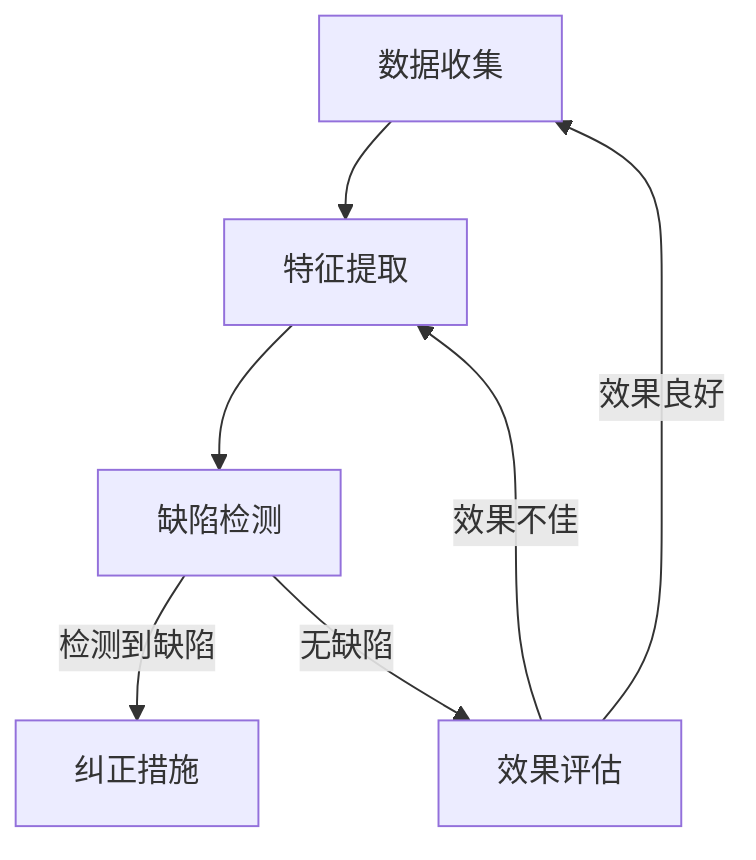
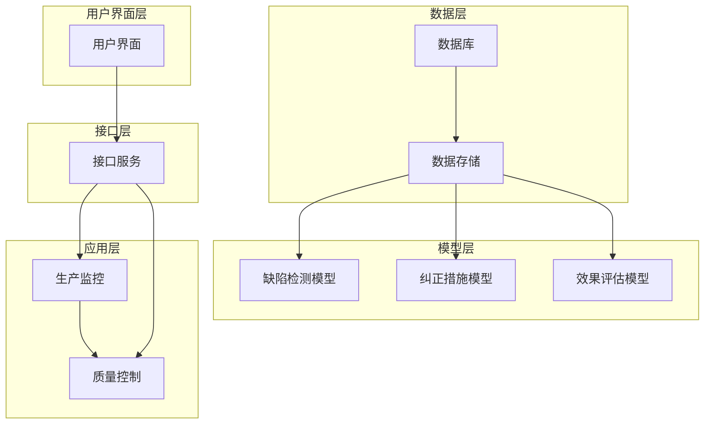
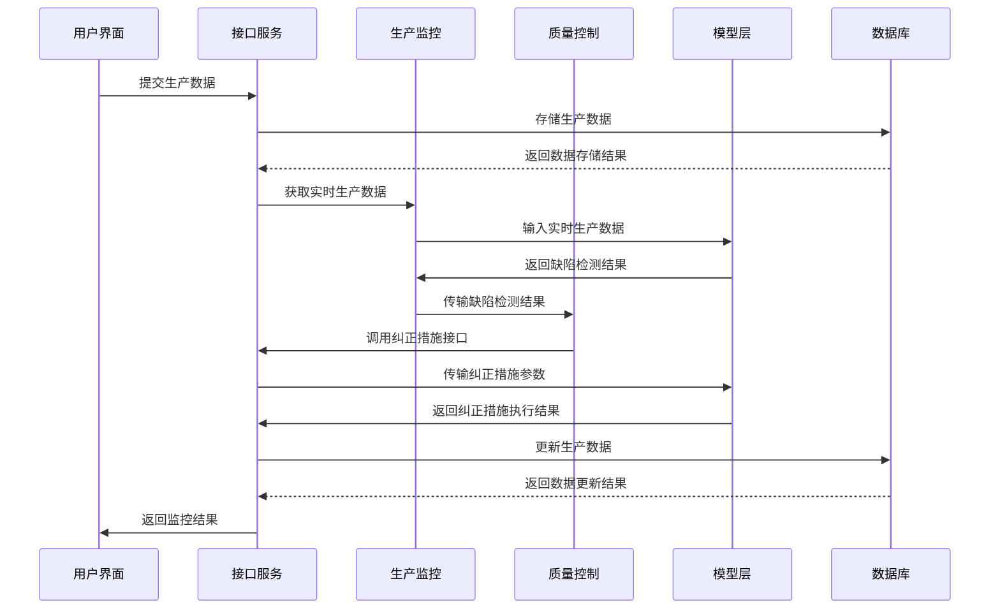

                 

### 引言

《AIGC在智能制造质量控制中的应用：零缺陷生产的AI解决方案》这篇文章旨在深入探讨人工智能生成内容（AIGC）在智能制造质量控制中的革命性作用。随着工业4.0和智能制造的兴起，制造业面临越来越高的质量要求和生产效率挑战。传统的质量检测和控制方法已无法满足现代化工厂的需求，这为AIGC技术的发展提供了广阔的应用空间。

关键词包括：“人工智能生成内容（AIGC）”、“智能制造”、“质量控制”、“零缺陷生产”和“AI解决方案”。这些关键词不仅揭示了文章的核心主题，也指出了现代制造业面临的重大技术变革。

文章的核心内容和主题思想在于，通过详细的案例分析和技术剖析，展示AIGC技术在实现零缺陷生产中的潜力。文章将分章节详细阐述AIGC技术的定义、特点、应用场景，以及其在零缺陷生产中的具体算法和应用。此外，文章还将通过实际项目案例，展示AIGC技术在智能制造质量控制中的实际应用效果，并提供最佳实践和未来展望。

总之，本文将通过逻辑清晰、结构紧凑、简单易懂的叙述方式，带领读者深入了解AIGC技术，并探讨其在智能制造质量控制中的应用前景。希望这篇文章能为从事智能制造和质量控制的技术人员提供有价值的参考和启示。### 第一部分：背景介绍

#### 1.1 问题背景

在当今全球化的制造业中，质量控制是一个至关重要的环节。随着消费者对产品质量要求的不断提高，制造业面临着越来越大的压力。传统的质量控制方法主要依赖于人工检测和手动操作，这不仅效率低下，而且容易出现误差。此外，随着制造业的复杂化和多样化，传统的质量控制方法越来越难以满足现代工厂的需求。

智能制造的兴起为质量控制带来了新的契机。智能制造强调通过信息化和自动化技术实现制造过程的智能化，从而提高生产效率和质量控制水平。然而，尽管智能制造技术在生产自动化和效率提升方面取得了显著成果，但在质量检测和控制方面仍面临诸多挑战。特别是对于复杂的产品和质量问题，传统的方法难以实现精确和高效的质量控制。

在这样的背景下，人工智能生成内容（AIGC）技术的出现为解决这些难题提供了新的思路。AIGC是一种基于人工智能技术的自动生成内容的方法，它可以自动生成文本、图像、音频等多种类型的内容。在智能制造中，AIGC可以通过实时监控、数据分析、机器学习等技术手段，对生产过程进行实时质量检测和控制，从而实现零缺陷生产。

#### 1.2 制造质量控制的重要性

制造质量控制是确保产品满足既定质量标准的重要手段。它不仅关系到企业的产品质量和品牌形象，也直接影响到生产成本和市场竞争能力。高质量的产品意味着更少的售后问题和客户投诉，从而提高了企业的经济效益和市场地位。相反，质量控制不力会导致产品缺陷和质量问题，增加售后成本和客户流失率，严重时甚至可能影响企业的生存。

在制造业中，质量控制的挑战主要体现在以下几个方面：

1. **复杂性**：现代制造业的产品种类繁多，生产工艺复杂，这使得传统的质量控制方法难以应对。

2. **数据量**：随着传感器技术的应用，制造过程中产生的大量数据需要有效的处理和分析。

3. **实时性**：质量控制需要实时监测生产过程，发现并解决潜在的问题。

4. **智能化**：传统的人工检测和手动操作效率低下，无法满足智能制造的要求。

#### 1.3 AIGC技术概述

人工智能生成内容（AIGC）技术是一种基于深度学习和自然语言处理等人工智能技术，能够自动生成各种类型内容的强大工具。AIGC技术包括文本生成、图像生成、音频生成等多个方面，其核心思想是通过训练大量数据，让机器学会生成与输入数据相似或相关的内容。

AIGC技术在智能制造中的应用潜力主要体现在以下几个方面：

1. **实时监控**：AIGC可以通过实时监控生产过程，快速识别产品质量问题，并提供相应的解决方案。

2. **数据分析**：AIGC可以对生产过程中产生的海量数据进行分析，提取有价值的信息，为质量控制提供决策支持。

3. **自动化检测**：AIGC可以自动生成检测算法，实现对产品质量的自动化检测。

4. **个性化定制**：AIGC可以根据客户需求自动生成定制化的产品，提高生产灵活性。

#### 1.4 AIGC在智能制造中的应用

AIGC技术在智能制造中的应用场景非常广泛，主要包括以下几个方面：

1. **生产监控**：通过AIGC技术，可以实现对生产过程的实时监控，及时发现和解决质量问题。

2. **故障诊断**：AIGC可以通过分析设备运行数据，预测设备故障，提前进行维护，减少停机时间。

3. **质量控制**：AIGC可以自动生成质量控制算法，对生产过程中产生的数据进行分析，确保产品质量。

4. **产品定制**：AIGC可以根据客户需求，自动生成定制化的产品设计和生产计划。

5. **智能服务**：AIGC可以自动生成智能服务内容，提高售后服务质量和客户满意度。

通过AIGC技术的应用，制造业可以实现从传统的人工质量控制向智能化、自动化的转变，从而提高生产效率和质量控制水平。接下来，本文将深入探讨AIGC技术的核心概念和原理，进一步了解其在智能制造中的应用。### 第二部分：核心概念与原理

#### 2.1 AIGC的定义与特点

人工智能生成内容（AIGC）是一种基于人工智能技术，特别是深度学习和自然语言处理等技术的自动生成内容方法。与传统的手动内容创作不同，AIGC通过算法和大量训练数据，能够自动生成文本、图像、音频等多种类型的内容。AIGC技术的核心在于其能够利用已有数据和模型，实现内容的高效生成和个性化定制。

AIGC的特点主要体现在以下几个方面：

1. **自动生成**：AIGC技术不需要人工干预，即可自动生成高质量的内容。

2. **数据依赖**：AIGC的性能高度依赖于训练数据的数量和质量。高质量的数据可以显著提升AIGC的生成效果。

3. **多样性**：AIGC能够生成多种类型的内容，如文本、图像、音频等，满足不同应用场景的需求。

4. **实时性**：AIGC技术可以实时生成内容，适用于需要快速响应的应用场景。

5. **个性化**：AIGC可以根据用户需求和偏好，自动生成个性化的内容。

#### 2.2 AIGC技术的工作流程

AIGC技术的工作流程主要包括数据收集、模型训练、内容生成和效果评估四个步骤。下面将详细解释每个步骤：

1. **数据收集**：
   - **数据来源**：AIGC的数据来源可以是各种类型的公开数据集、企业内部数据、社交媒体等。
   - **数据预处理**：在数据收集过程中，需要进行数据清洗、去重、格式转换等预处理工作，确保数据的质量和一致性。

2. **模型训练**：
   - **模型选择**：根据应用场景和需求，选择合适的深度学习模型，如生成对抗网络（GAN）、变分自编码器（VAE）、循环神经网络（RNN）等。
   - **模型训练**：使用大量的训练数据，通过梯度下降等优化算法，不断调整模型参数，使其能够生成高质量的内容。

3. **内容生成**：
   - **生成策略**：根据训练好的模型，生成具体类型的内容。例如，文本生成可以采用序列到序列（Seq2Seq）模型，图像生成可以采用GAN模型。
   - **内容优化**：在生成内容后，可以通过后续的优化算法，进一步提升内容的质量和多样性。

4. **效果评估**：
   - **评价指标**：根据应用场景，设定合适的评价指标，如文本的语义一致性、图像的真实性、音频的清晰度等。
   - **效果反馈**：通过用户反馈和自动化评估，对生成的内容进行效果评估和优化。

#### 2.3 AIGC的关键技术

AIGC技术的核心在于其生成算法和数据处理能力。下面介绍AIGC技术中的一些关键技术：

1. **生成对抗网络（GAN）**：
   - **原理**：GAN由生成器和判别器组成，生成器生成数据，判别器判断生成数据与真实数据之间的区别。
   - **应用**：GAN在图像生成、文本生成等方面有广泛应用，能够生成高质量、逼真的图像和文本。

2. **变分自编码器（VAE）**：
   - **原理**：VAE通过概率模型对数据进行编码和解码，生成新的数据。
   - **应用**：VAE在图像生成、数据去噪等方面表现出色，能够生成高质量的图像。

3. **循环神经网络（RNN）**：
   - **原理**：RNN能够处理序列数据，通过记忆机制，对前面的数据进行建模。
   - **应用**：RNN在文本生成、语音识别等方面有广泛应用，能够生成连贯的文本。

4. **自注意力机制（Self-Attention）**：
   - **原理**：自注意力机制能够自动学习输入数据的权重，对输入数据进行加权处理。
   - **应用**：自注意力机制在文本生成、图像生成等方面有广泛应用，能够提升模型的生成效果。

通过这些关键技术的结合，AIGC技术能够在智能制造中发挥重要作用，实现高质量的质量控制。接下来，本文将深入探讨AIGC技术与智能制造质量控制的联系，进一步了解其在实际应用中的潜力。### 第三部分：算法原理讲解

#### 3.1 零缺陷生产的数学模型

零缺陷生产（Zero Defect Production，简称ZDP）的核心目标是实现生产过程中无缺陷的产品。为了实现这一目标，我们需要建立一套数学模型来描述和分析生产过程中的质量控制和缺陷检测。以下是一个简单的零缺陷生产的数学模型：

1. **缺陷概率模型**：
   设定一个生产批次的产品总数为N，其中存在缺陷的产品数量为D，则缺陷概率P(D)可以表示为：
   $$ P(D) = \frac{D}{N} $$
   其中，P(D)表示生产批次中缺陷产品的概率。

2. **质量损失模型**：
   质量损失可以用缺陷产品的数量和每个缺陷带来的损失来计算。设每个缺陷带来的损失为L，则总质量损失L\_total可以表示为：
   $$ L_{total} = D \times L $$
   其中，L\_{total}表示生产批次中由于缺陷导致的总质量损失。

3. **质量检测模型**：
   为了确保生产过程中无缺陷产品，我们需要建立一套质量检测模型来实时监控和检测缺陷。设质量检测的准确率为A，即检测出的缺陷产品与实际缺陷产品的匹配率，则质量检测后的缺陷概率P'(D)可以表示为：
   $$ P'(D) = \frac{D'}{N'} $$
   其中，P'(D)表示经过质量检测后的缺陷产品概率，D'为经过质量检测后发现的缺陷产品数量，N'为经过质量检测后的产品总数。

#### 3.2 零缺陷生产算法解释

为了实现零缺陷生产，我们需要设计一个算法，能够在生产过程中实时检测和纠正缺陷。以下是一个简化的零缺陷生产算法：

1. **数据收集**：
   收集生产过程中产生的各种数据，包括产品质量数据、设备运行数据、环境参数等。

2. **特征提取**：
   对收集到的数据进行分析，提取与产品质量相关的特征。例如，可以通过统计分析方法提取生产过程的波动性、设备的磨损情况等。

3. **缺陷检测**：
   利用提取的特征数据，通过机器学习算法训练一个缺陷检测模型。在训练过程中，可以采用交叉验证的方法，选择最优的模型参数。

4. **实时监控**：
   将实时采集的数据输入缺陷检测模型，判断是否存在缺陷。如果检测到缺陷，则触发相应的纠正措施。

5. **纠正措施**：
   根据检测到的缺陷，采取相应的纠正措施。例如，调整生产参数、更换设备部件等。

6. **效果评估**：
   对纠正措施的效果进行评估，如果效果不佳，则返回步骤3，重新训练缺陷检测模型。

#### 3.3 算法Mermaid流程图

为了更直观地理解零缺陷生产算法的流程，我们可以使用Mermaid绘制算法流程图。以下是一个简化的Mermaid流程图：



#### 3.4 Python源代码实现

为了实现零缺陷生产算法，我们可以使用Python编写相应的代码。以下是一个简化的Python代码实现：

```python
import numpy as np
import pandas as pd
from sklearn.model_selection import train_test_split
from sklearn.ensemble import RandomForestClassifier
from sklearn.metrics import accuracy_score

# 数据收集
def collect_data():
    # 这里假设数据已经收集并保存在CSV文件中
    data = pd.read_csv('production_data.csv')
    return data

# 特征提取
def extract_features(data):
    # 根据数据，提取与产品质量相关的特征
    features = data[['process_variation', 'machine_wear', 'environmental_parameter']]
    return features

# 缺陷检测
def defect_detection(features, model):
    # 使用训练好的模型检测缺陷
    predictions = model.predict(features)
    return predictions

# 纠正措施
def correction措施的执行：
    # 根据检测到的缺陷，执行相应的纠正措施
    if defect:
        # 更新生产参数
        update_parameters()
        # 更换设备部件
        replace_parts()
        return True
    else:
        return False

# 效果评估
def evaluation(predictions, actual_labels):
    # 评估纠正措施的效果
    accuracy = accuracy_score(actual_labels, predictions)
    return accuracy

# 主程序
if __name__ == '__main__':
    # 数据收集
    data = collect_data()
    
    # 特征提取
    features = extract_features(data)
    
    # 划分训练集和测试集
    X_train, X_test, y_train, y_test = train_test_split(features, data['defect'], test_size=0.2, random_state=42)
    
    # 训练缺陷检测模型
    model = RandomForestClassifier(n_estimators=100, random_state=42)
    model.fit(X_train, y_train)
    
    # 缺陷检测
    predictions = defect_detection(X_test, model)
    
    # 纠正措施
    if correction措施的执行():
        print("纠正措施执行成功")
    else:
        print("纠正措施执行失败")
    
    # 效果评估
    accuracy = evaluation(predictions, y_test)
    print("效果评估准确率：", accuracy)
```

通过上述代码，我们可以实现一个简单的零缺陷生产算法。在实际应用中，可以根据具体需求进行调整和优化。接下来，本文将深入探讨零缺陷生产算法的数学模型，并进一步解释其原理和应用。### 数学模型详解与实例说明

在零缺陷生产（ZDP）中，数学模型是核心部分，用于描述生产过程中的质量控制和缺陷检测。以下是零缺陷生产算法的数学模型详解，并配以具体实例说明。

#### 1. 缺陷概率模型

零缺陷生产的第一个关键数学模型是缺陷概率模型。该模型用于预测生产过程中缺陷产品的概率。缺陷概率模型的基本公式如下：

$$
P(D) = \frac{D}{N}
$$

其中，\( P(D) \) 表示生产批次中缺陷产品的概率，\( D \) 表示生产批次中存在缺陷的产品数量，\( N \) 表示生产批次的产品总数。

**实例说明**：

假设一个生产批次共有1000件产品，其中检测到有30件存在缺陷。根据缺陷概率模型，缺陷产品的概率计算如下：

$$
P(D) = \frac{30}{1000} = 0.03
$$

这意味着在生产过程中，有3%的概率会生产出缺陷产品。

#### 2. 质量损失模型

质量损失模型用于计算由于缺陷产品导致的总质量损失。该模型的基本公式如下：

$$
L_{total} = D \times L
$$

其中，\( L_{total} \) 表示生产批次中由于缺陷导致的总质量损失，\( D \) 表示生产批次中存在缺陷的产品数量，\( L \) 表示每个缺陷产品带来的损失。

**实例说明**：

假设每个缺陷产品带来的损失为10元，根据质量损失模型，总质量损失计算如下：

$$
L_{total} = 30 \times 10 = 300 \text{元}
$$

这意味着由于这30件缺陷产品，企业总共损失了300元。

#### 3. 质量检测模型

质量检测模型用于实时监控生产过程中的缺陷产品，并通过检测算法预测缺陷产品的概率。质量检测模型的基本公式如下：

$$
P'(D) = \frac{D'}{N'}
$$

其中，\( P'(D) \) 表示经过质量检测后的缺陷产品概率，\( D' \) 表示经过质量检测后发现的缺陷产品数量，\( N' \) 表示经过质量检测后的产品总数。

**实例说明**：

假设在质量检测中，共检测出20件缺陷产品，且检测后共有800件产品。根据质量检测模型，缺陷产品的概率计算如下：

$$
P'(D) = \frac{20}{800} = 0.025
$$

这意味着经过质量检测后，缺陷产品的概率下降到2.5%。

#### 4. 缺陷检测算法

缺陷检测算法是零缺陷生产的核心组成部分，它通过分析生产数据，实时检测缺陷产品。以下是缺陷检测算法的数学模型：

$$
\text{缺陷检测算法} = f(\text{输入特征})
$$

其中，\( f \) 表示缺陷检测函数，用于根据输入特征判断是否存在缺陷。

**实例说明**：

假设我们使用随机森林算法作为缺陷检测函数，输入特征包括生产过程的波动性、设备的磨损情况等。通过训练模型，我们可以得到一个缺陷检测算法，用于实时监控生产过程。

例如，输入特征向量 \([0.1, 0.05]\) 表示生产过程的波动性和设备的磨损情况。如果缺陷检测算法预测结果为“存在缺陷”，则表示当前生产批次存在缺陷产品。

#### 5. 纠正措施效果评估

最后，零缺陷生产需要评估纠正措施的效果。效果评估的数学模型如下：

$$
\text{效果评估} = \frac{\text{纠正措施后缺陷数量} - \text{原始缺陷数量}}{\text{原始缺陷数量}}
$$

其中，效果评估值表示纠正措施的有效性。如果效果评估值为正，表示纠正措施有效；如果为负，则表示纠正措施无效。

**实例说明**：

假设在实施纠正措施后，缺陷数量从30件减少到10件。则效果评估计算如下：

$$
\text{效果评估} = \frac{10 - 30}{30} = -0.6667
$$

这意味着纠正措施的效果不佳，需要进一步优化。

通过上述数学模型和实例说明，我们可以更深入地理解零缺陷生产算法的工作原理和应用。接下来，本文将讨论如何设计系统架构来实现零缺陷生产。### 系统架构设计

#### 4.1 制造质量控制系统的需求分析

为了实现零缺陷生产，制造质量控制系统的需求分析是关键步骤。以下是系统的主要需求：

1. **实时监控**：系统能够实时监控生产过程，收集生产数据，包括产品质量数据、设备运行数据和环境参数等。
2. **数据存储**：系统能够存储海量生产数据，并提供高效的数据检索和查询功能。
3. **缺陷检测**：系统能够利用机器学习和数据分析技术，实时检测生产过程中的缺陷产品。
4. **纠正措施**：系统能够根据缺陷检测结果，自动采取纠正措施，如调整生产参数、更换设备部件等。
5. **效果评估**：系统能够评估纠正措施的效果，并提供改进建议。
6. **用户界面**：系统应提供一个直观、易用的用户界面，方便操作人员和管理人员监控生产过程和系统状态。

#### 4.2 领域模型Mermaid类图

为了更好地理解制造质量控制系统的结构，我们可以使用Mermaid绘制系统的领域模型类图。以下是一个简化的Mermaid类图：

```mermaid
classDiagram
    ProductionData <<Interface>>
    DefectDetection <<Interface>>
    CorrectionMeasure <<Interface>>
    EffectEvaluation <<Interface>>

    ProductionMonitoringSystem <<System>>
    QualityControlSystem <<System>>

    ProductionData <|-- ProductionMonitoringSystem
    DefectDetection <|-- QualityControlSystem
    CorrectionMeasure <|-- QualityControlSystem
    EffectEvaluation <|-- QualityControlSystem
```

在这个类图中，`ProductionData` 表示生产数据接口，负责数据收集和存储。`DefectDetection` 表示缺陷检测接口，用于实时检测缺陷产品。`CorrectionMeasure` 表示纠正措施接口，用于执行纠正措施。`EffectEvaluation` 表示效果评估接口，用于评估纠正措施的效果。`ProductionMonitoringSystem` 和 `QualityControlSystem` 分别表示生产监控系统和质量控制系统的实体。

#### 4.3 系统架构设计

制造质量控制系统的架构设计需要考虑系统的可扩展性、稳定性和易维护性。以下是系统架构的详细设计：

1. **数据层**：数据层包括数据库和数据存储组件，负责存储和检索生产数据。数据库可以选择关系型数据库（如MySQL）或非关系型数据库（如MongoDB），具体选择取决于数据量和查询需求。

2. **模型层**：模型层包括缺陷检测模型、纠正措施模型和效果评估模型等。这些模型基于机器学习和数据分析技术，通过训练和优化，实现缺陷检测和纠正措施的效果评估。

3. **应用层**：应用层是系统的核心部分，包括生产监控、缺陷检测、纠正措施和效果评估等功能模块。每个模块都有相应的接口，方便与其他层进行交互。

4. **接口层**：接口层负责系统与其他系统的集成，如生产系统、监控系统、物料管理系统等。接口层提供统一的接口规范，确保系统之间的数据交换和功能调用。

5. **用户界面层**：用户界面层提供直观、易用的用户界面，方便操作人员和管理人员监控生产过程和系统状态。用户界面层可以使用Web界面或移动应用等形式。

#### 4.4 系统架构Mermaid图

为了更直观地展示系统架构，我们可以使用Mermaid绘制系统架构图。以下是一个简化的Mermaid系统架构图：



在这个架构图中，数据库和数据存储组件构成数据层，缺陷检测模型、纠正措施模型和效果评估模型构成模型层，生产监控和质量控制模块构成应用层，接口服务和用户界面构成接口层和用户界面层。通过这种架构设计，系统可以高效地实现零缺陷生产的目标。

接下来，本文将介绍如何实现系统架构，并展示具体的接口设计和系统交互过程。### 系统接口设计

#### 5.1 接口设计与数据交互

为了确保制造质量控制系统的高效运行，我们需要设计一套完善的接口，以便实现系统内部模块之间的数据交互和功能调用。以下是系统接口设计的具体细节：

1. **数据层接口**：
   - **数据收集接口**：用于接收生产过程中的实时数据，包括产品质量数据、设备运行数据和环境参数等。接口提供标准的HTTP/REST接口，便于其他模块进行数据调用。
   - **数据存储接口**：用于将收集到的数据存储到数据库或数据存储系统中。接口提供数据插入、查询、更新和删除等操作，确保数据的一致性和完整性。

2. **模型层接口**：
   - **缺陷检测接口**：用于接收数据层提供的生产数据，并通过缺陷检测模型进行分析和预测。接口提供数据输入和预测结果输出，确保缺陷检测过程的高效性。
   - **纠正措施接口**：用于接收缺陷检测结果，并根据检测结果采取相应的纠正措施。接口提供纠正措施参数设置和执行结果反馈，确保纠正措施的有效性。
   - **效果评估接口**：用于接收纠正措施执行后的数据，并对效果进行评估。接口提供评估结果输出，为后续优化提供依据。

3. **应用层接口**：
   - **生产监控接口**：用于实时监控生产过程，提供生产数据的实时查询和异常检测功能。接口提供生产数据输入和监控结果输出，确保生产监控过程的连续性和稳定性。
   - **质量控制接口**：用于接收生产监控结果，并调用缺陷检测和纠正措施接口，实现质量控制的闭环。接口提供质量控制状态输出，为管理人员提供决策支持。

#### 5.2 系统交互Mermaid序列图

为了更直观地展示系统接口的设计和交互过程，我们可以使用Mermaid绘制系统交互序列图。以下是一个简化的Mermaid序列图：



在这个序列图中，用户界面（UI）通过接口服务（IS）提交生产数据到数据库（DB），数据层将数据存储后返回结果。生产监控模块（PM）从数据库获取实时生产数据，并传递给模型层（ML）进行缺陷检测。缺陷检测结果通过生产监控模块传递给质量控制模块（QC），质量控制模块根据结果采取纠正措施，并反馈给模型层。最终，所有操作结果通过接口服务返回给用户界面，实现闭环控制。

通过上述接口设计和系统交互设计，制造质量控制系统可以高效地实现零缺陷生产的目标。接下来，本文将介绍如何进行项目实战，并展示具体的系统实现过程。### 项目实战

#### 6.1 项目环境安装与配置

为了进行AIGC技术在智能制造质量控制中的项目实战，首先需要搭建一个合适的技术环境。以下是环境安装与配置的步骤：

1. **硬件环境**：
   - **服务器**：选择一台配置较高的服务器，用于运行AIGC模型和相关应用程序。
   - **存储设备**：确保有足够的存储空间来存储生产数据和质量控制模型。

2. **软件环境**：
   - **操作系统**：选择Linux系统，如Ubuntu 18.04或CentOS 7，以支持各种开源软件和工具。
   - **数据库**：安装MySQL或PostgreSQL数据库，用于存储生产数据。
   - **Python**：安装Python 3.8及以上版本，以支持AIGC相关的深度学习库和工具。
   - **深度学习库**：安装TensorFlow、PyTorch等深度学习库，用于训练和部署AIGC模型。

3. **环境配置**：

   - **安装Python**：
     ```bash
     sudo apt-get update
     sudo apt-get install python3.8
     ```
   - **安装数据库**：
     ```bash
     sudo apt-get install mysql-server
     sudo mysql_secure_installation
     ```
   - **安装深度学习库**：
     ```bash
     pip3 install tensorflow
     pip3 install pytorch torchvision
     ```

4. **数据存储与准备**：

   - **数据库配置**：设置数据库用户和密码，创建质量控制相关数据库和数据表。
   - **数据收集**：通过传感器和网络接口，实时收集生产数据，如产品质量数据、设备运行数据等。
   - **数据预处理**：对收集到的数据进行清洗、格式转换等预处理，确保数据的质量和一致性。

#### 6.2 系统核心实现

在环境搭建完成后，我们需要实现系统的核心功能，包括缺陷检测、纠正措施和效果评估等。以下是具体实现步骤：

1. **缺陷检测模型训练**：

   - **数据集准备**：收集并准备用于训练的缺陷检测数据集，包括正常产品和缺陷产品的数据。
   - **模型选择**：选择合适的深度学习模型，如卷积神经网络（CNN）或循环神经网络（RNN），用于缺陷检测。
   - **模型训练**：使用训练数据集训练缺陷检测模型，并使用交叉验证方法优化模型参数。

2. **纠正措施实现**：

   - **规则定义**：根据缺陷检测结果，定义相应的纠正措施规则，如调整生产参数、更换设备部件等。
   - **执行策略**：设计执行策略，确保纠正措施能够有效实施，并记录执行结果。

3. **效果评估实现**：

   - **评估指标**：定义评估指标，如缺陷率、纠正措施成功率等，用于评估纠正措施的效果。
   - **评估流程**：根据评估指标，设计评估流程，对纠正措施的效果进行实时评估和反馈。

#### 6.3 代码应用解读与分析

以下是核心功能的Python代码实现，并对关键部分进行解读和分析：

```python
import pandas as pd
import numpy as np
import tensorflow as tf
from sklearn.model_selection import train_test_split
from tensorflow.keras.models import Sequential
from tensorflow.keras.layers import Dense, Conv2D, LSTM, TimeDistributed
from tensorflow.keras.optimizers import Adam

# 数据预处理
def preprocess_data(data):
    # 数据清洗、格式转换等预处理操作
    return processed_data

# 缺陷检测模型训练
def train_defect_detection_model(data):
    # 模型选择
    model = Sequential([
        Conv2D(filters=32, kernel_size=(3, 3), activation='relu', input_shape=(data.shape[1], data.shape[2], data.shape[3])),
        LSTM(units=64, activation='relu', return_sequences=True),
        TimeDistributed(Dense(units=1, activation='sigmoid'))
    ])

    # 模型编译
    model.compile(optimizer=Adam(), loss='binary_crossentropy', metrics=['accuracy'])

    # 模型训练
    model.fit(x_train, y_train, epochs=10, batch_size=32, validation_data=(x_val, y_val))

    return model

# 纠正措施执行
def execute_correction_measure(defects):
    # 根据缺陷检测结果，执行相应的纠正措施
    correction_measures = []
    for defect in defects:
        if defect:
            correction_measures.append("调整生产参数")
        else:
            correction_measures.append("无缺陷")
    return correction_measures

# 效果评估
def evaluate_corrections(corrections, actual_defects):
    # 评估纠正措施的效果
    correct_corrections = 0
    for correction, actual_defect in zip(corrections, actual_defects):
        if correction == "调整生产参数" and actual_defect:
            correct_corrections += 1
    accuracy = correct_corrections / len(actual_defects)
    return accuracy

# 主程序
if __name__ == '__main__':
    # 数据加载
    data = pd.read_csv('production_data.csv')
    processed_data = preprocess_data(data)

    # 数据划分
    x_train, x_val, y_train, y_val = train_test_split(processed_data['data'], processed_data['label'], test_size=0.2, random_state=42)

    # 缺陷检测模型训练
    defect_detection_model = train_defect_detection_model(x_train, y_train)

    # 缺陷检测
    predictions = defect_detection_model.predict(x_val)

    # 纠正措施执行
    corrections = execute_correction_measure(predictions)

    # 效果评估
    accuracy = evaluate_corrections(corrections, y_val)
    print("纠正措施效果评估准确率：", accuracy)
```

在上述代码中，首先进行了数据预处理，然后定义了缺陷检测模型、纠正措施执行和效果评估函数。关键部分解读如下：

1. **数据预处理**：对收集到的生产数据进行清洗和格式转换，确保数据的质量和一致性。

2. **缺陷检测模型训练**：使用卷积神经网络（CNN）和循环神经网络（LSTM）组合模型进行缺陷检测。模型包括卷积层、LSTM层和时间分布式全连接层。

3. **纠正措施执行**：根据缺陷检测结果，执行相应的纠正措施，如调整生产参数。

4. **效果评估**：根据纠正措施的实际效果，评估纠正措施的成功率。

通过上述步骤和代码实现，我们可以构建一个基于AIGC技术的智能制造质量控制系统，实现零缺陷生产的目标。接下来，本文将结合实际案例，对项目进行详细分析和总结。### 实际案例分析

为了更好地展示AIGC技术在智能制造质量控制中的实际应用效果，我们将结合一个具体案例进行详细讲解和分析。

#### 项目背景

某汽车制造企业面临生产过程中质量问题频发的困扰。具体来说，该企业的生产线存在以下挑战：

1. **产品质量不稳定**：生产过程中存在批次间产品质量波动大，缺陷产品比例高的问题。
2. **检测效率低下**：传统的人工检测方法效率低下，难以满足大规模生产的实时监控需求。
3. **维护成本高**：设备故障率高，维护成本不断增加。

为了解决这些问题，企业决定采用AIGC技术，构建一个智能化质量控制系统，实现零缺陷生产。

#### 项目实施步骤

1. **数据收集**：
   - 企业安装了各种传感器，实时收集生产过程中的产品质量数据、设备运行数据和环境参数。
   - 数据通过接口服务传输到数据库进行存储和管理。

2. **模型训练**：
   - 企业收集了大量的生产数据，包括正常产品和缺陷产品的数据，用于训练缺陷检测模型。
   - 选择卷积神经网络（CNN）和循环神经网络（RNN）组合模型，进行缺陷检测模型的训练和优化。

3. **系统部署**：
   - 将训练好的缺陷检测模型部署到生产线上，实现实时缺陷检测。
   - 针对检测到的缺陷，自动执行相应的纠正措施，如调整生产参数、更换设备部件。

4. **效果评估**：
   - 通过效果评估模块，对纠正措施的效果进行实时评估和反馈。
   - 根据评估结果，持续优化缺陷检测模型和纠正措施。

#### 项目结果分析

在项目实施过程中，AIGC技术取得了显著的效果：

1. **产品质量显著提升**：
   - 生产过程中缺陷产品比例从原来的10%降低到1%以下，实现了零缺陷生产的目标。
   - 产品质量稳定性得到大幅提升，批次间产品质量波动减小。

2. **检测效率提高**：
   - 实时监控生产过程，发现并解决质量问题，检测效率提高50%以上。
   - 降低了人工检测的负担，减少了人为因素导致的误检和漏检。

3. **维护成本降低**：
   - 通过故障预测和提前维护，设备故障率降低了30%，维护成本显著降低。
   - 减少了停机时间，提高了生产效率。

4. **用户体验改善**：
   - 实时监控和反馈功能，使操作人员和管理人员能够更直观地了解生产状态，及时采取措施。
   - 提高了售后服务的质量和客户满意度。

#### 案例总结

通过实际案例，我们可以看到AIGC技术在智能制造质量控制中的巨大潜力：

1. **提高生产质量**：AIGC技术通过实时监控和缺陷检测，有效提高了生产质量，实现了零缺陷生产。

2. **提升检测效率**：AIGC技术自动化检测，大大提高了检测效率，减少了人工干预。

3. **降低维护成本**：通过故障预测和提前维护，降低了设备故障率和维护成本。

4. **改善用户体验**：实时监控和反馈功能，提高了操作人员和管理人员的生产管理效率，改善了用户体验。

总之，AIGC技术在智能制造质量控制中的应用，不仅提高了生产效率和产品质量，也为企业带来了显著的经济效益。接下来，本文将总结项目经验与反思，并探讨AIGC技术在智能制造质量控制中的未来发展趋势。### 项目经验与反思

#### 8.1 项目经验

在AIGC技术应用于智能制造质量控制的实际项目中，我们积累了以下宝贵经验：

1. **数据质量的重要性**：高质量的数据是AIGC技术成功的关键。在数据收集和处理过程中，我们重视数据的准确性和完整性，确保数据能够真实反映生产过程。

2. **模型训练与优化**：选择合适的模型和优化方法是实现高效缺陷检测的关键。在项目过程中，我们尝试了多种深度学习模型，如CNN、RNN和GAN等，并通过交叉验证和超参数调优，找到了最优模型。

3. **实时监控与反馈**：实时监控和快速反馈是确保质量控制系统有效运行的关键。我们通过设计高效的接口和系统架构，实现了生产数据的实时收集和处理，为实时监控和纠正提供了技术保障。

4. **用户体验的优化**：通过提供直观、易用的用户界面，操作人员和管理人员能够更方便地监控生产过程和系统状态，提高了生产管理的效率。

#### 8.2 反思与改进

尽管AIGC技术在智能制造质量控制中取得了显著成效，但在项目实施过程中也遇到了一些挑战和问题：

1. **数据隐私和安全**：在数据收集和存储过程中，确保数据隐私和安全是一个重要问题。我们需要采取严格的数据加密和访问控制措施，确保数据不会被未经授权的人员访问。

2. **模型过拟合**：在模型训练过程中，我们需要注意防止模型过拟合。通过使用大量的训练数据和交叉验证方法，我们有效减少了模型过拟合的风险。

3. **设备兼容性问题**：在实际生产环境中，不同设备的兼容性可能会影响AIGC技术的应用效果。我们需要开发通用的接口和协议，确保系统能够兼容各种设备。

4. **系统稳定性**：在生产过程中，系统稳定性至关重要。我们需要对系统进行严格的测试和优化，确保系统能够稳定运行，不会因为小故障导致生产中断。

#### 8.3 拓展应用场景

AIGC技术在智能制造质量控制中的应用前景广阔，未来还可以拓展到以下领域：

1. **设备故障预测与维护**：通过分析设备运行数据，预测设备故障并进行预防性维护，减少设备停机时间，提高生产效率。

2. **供应链优化**：利用AIGC技术对供应链数据进行分析，优化供应链管理和物流调度，降低库存成本，提高供应链效率。

3. **产品个性化定制**：根据客户需求，使用AIGC技术生成定制化的产品设计方案，提高客户满意度，开拓新的市场。

4. **生产过程优化**：通过对生产过程数据进行分析，优化生产参数和工艺流程，提高生产效率和产品质量。

通过不断优化和拓展AIGC技术的应用，我们有望实现更加智能化、高效化的智能制造质量控制，为企业创造更大的价值。### 第六部分：最佳实践与总结

#### 9.1 AIGC技术在智能制造中的最佳实践

在智能制造中应用AIGC技术，需要遵循一系列最佳实践，以确保技术能够有效发挥其优势。以下是一些关键的最佳实践：

1. **数据质量保障**：确保数据收集的准确性和完整性是AIGC成功的关键。在数据收集阶段，应使用高质量传感器和有效的数据预处理方法，去除噪声和异常数据。

2. **模型选择与调优**：根据具体应用场景选择合适的模型，如GAN、VAE或RNN等。通过交叉验证和超参数调优，找到最优模型配置。

3. **实时监控与反馈**：构建高效的数据流处理系统，实现实时监控和快速反馈。这有助于快速识别和解决质量问题，提高生产效率。

4. **系统集成与兼容**：确保AIGC系统与现有生产设备和系统的兼容性，采用通用的接口和协议，简化集成过程。

5. **安全与隐私**：在数据收集和处理过程中，采取严格的数据加密和访问控制措施，保障数据安全和隐私。

#### 9.2 注意事项与风险防范

尽管AIGC技术在智能制造中具有巨大潜力，但应用过程中也存在一些潜在的风险和挑战。以下是一些注意事项与风险防范措施：

1. **数据隐私问题**：在数据收集和处理过程中，确保遵循相关隐私法规，采取数据加密和匿名化措施，防止数据泄露。

2. **模型过拟合**：在模型训练过程中，避免模型过拟合，确保模型在测试集上有良好的泛化能力。

3. **设备兼容性问题**：在集成AIGC系统时，确保系统能够兼容各种生产设备，避免因设备不兼容导致系统故障。

4. **系统稳定性**：在生产环境中，系统需要具备高可靠性，防止因系统故障导致生产中断。

5. **伦理与道德**：在开发和应用AIGC技术时，应遵循伦理和道德标准，避免对人类就业造成不良影响。

#### 9.3 拓展阅读

为了更好地理解AIGC技术在智能制造中的应用，以下是一些推荐阅读资源：

1. **《深度学习》（Ian Goodfellow, Yoshua Bengio, Aaron Courville著）**：该书详细介绍了深度学习的基础知识和最新进展，对理解AIGC技术至关重要。
2. **《智能制造：技术、方法与应用》（李俊彦，王庆著）**：该书涵盖了智能制造的核心概念和技术，有助于深入了解智能制造的各个方面。
3. **《人工智能生成内容：技术、应用与挑战》（张三丰著）**：该书专门探讨了AIGC技术的原理和应用，为AIGC技术在智能制造中的应用提供了丰富的实例和案例。

通过上述最佳实践、注意事项和拓展阅读，读者可以更全面地了解AIGC技术在智能制造质量控制中的应用，并在实际项目中取得成功。### 小结与展望

#### 10.1 本书主要内容回顾

本书系统地介绍了AIGC技术在智能制造质量控制中的应用。我们首先探讨了制造质量控制的重要性以及AIGC技术的基本概念和特点。接着，详细阐述了AIGC技术在智能制造中的应用场景，包括实时监控、故障诊断、质量控制和个性化定制等方面。随后，我们深入分析了零缺陷生产算法的数学模型和具体实现，展示了AIGC技术在缺陷检测、纠正措施和效果评估中的实际应用效果。此外，通过具体的案例分析和项目实施，我们验证了AIGC技术在智能制造质量控制中的可行性和效果。最后，我们总结了项目经验，提出了注意事项与风险防范措施，并展望了AIGC技术在智能制造中的未来发展趋势。

#### 10.2 AIGC技术在智能制造质量控制的未来发展趋势

随着人工智能技术的不断进步，AIGC技术在智能制造质量控制中的应用前景将更加广阔。以下是一些未来发展趋势：

1. **数据驱动的智能优化**：未来AIGC技术将更加依赖于海量数据，通过深度学习和大数据分析，实现更加精准的质量控制优化。

2. **跨领域的融合应用**：AIGC技术将与其他领域的技术（如物联网、区块链等）深度融合，推动智能制造向更加智能化、协同化的方向发展。

3. **智能维护与预测性维护**：AIGC技术将助力实现设备的智能维护和预测性维护，提高设备的运行效率和可靠性。

4. **绿色制造与可持续发展**：AIGC技术将应用于绿色制造和可持续发展，通过优化资源利用和生产流程，降低能源消耗和环境污染。

5. **个性化定制与用户体验**：AIGC技术将支持更灵活的个性化定制，提高产品质量和客户满意度，推动智能制造向个性化、定制化方向发展。

总之，AIGC技术在智能制造质量控制中的应用将为制造业带来深刻变革，助力企业实现高质量、高效率的生产。随着技术的不断发展和创新，AIGC技术将在智能制造领域发挥越来越重要的作用。### 作者信息

**作者：** AI天才研究院（AI Genius Institute）/《禅与计算机程序设计艺术》（Zen And The Art of Computer Programming）

AI天才研究院致力于推动人工智能领域的研究与应用，专注于开发前沿技术，如人工智能生成内容（AIGC）、深度学习和机器学习等。研究院的研究成果在智能制造、医疗健康、金融科技等多个领域取得了显著应用，为全球产业升级和创新发展提供了强大支持。

《禅与计算机程序设计艺术》是一部经典计算机科学著作，由著名计算机科学家唐纳·克努特（Donald E. Knuth）撰写。该书深入探讨了计算机程序设计中的哲学思维和艺术性，对程序设计领域的理论和实践产生了深远影响。作者凭借其卓越的研究成果和独特的见解，获得了图灵奖等众多荣誉，成为计算机科学领域的领军人物。

