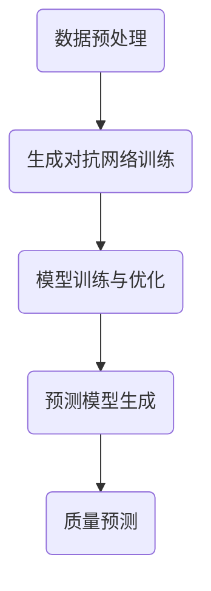
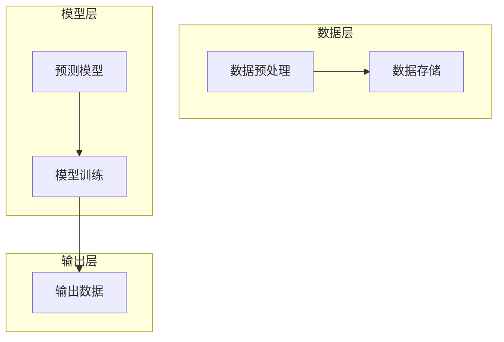
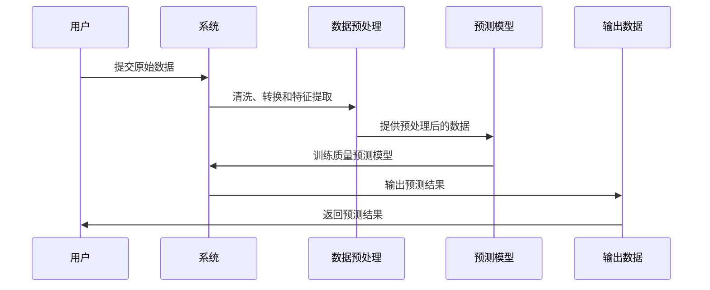

                 

# 《AIGC在智能制造质量预测中的应用》

## 关键词

**AIGC**，**智能制造**，**质量预测**，**数据预处理**，**模型构建**，**算法优化**

## 摘要

随着智能制造技术的快速发展，质量管理成为企业竞争力的重要因素。AIGC（自适应智能生成控制）作为人工智能领域的前沿技术，其在智能制造质量预测中的应用正逐渐受到关注。本文将深入探讨AIGC在智能制造质量预测中的应用，包括其技术基础、核心概念、算法原理、系统架构设计以及实际案例。通过一步步的分析和讲解，本文旨在为读者提供一个全面而深刻的理解，从而推动智能制造质量预测技术的发展。

### 第一部分：背景介绍

## 第1章：智能制造质量预测概述

### 1.1.1 问题背景

随着全球制造业的智能化转型，质量预测成为智能制造过程中至关重要的一环。传统的质量预测方法往往依赖于统计分析和人工经验，存在预测精度低、响应速度慢等问题。智能制造质量预测的需求主要体现在以下几个方面：

1. **提高生产效率**：通过实时监测和预测产品质量，能够及时发现和纠正生产过程中的问题，从而减少次品率和返工率，提高生产效率。

2. **降低成本**：准确的质量预测有助于优化原材料和资源的利用，减少浪费，降低生产成本。

3. **增强竞争力**：质量是产品竞争力的核心，高质量的产品能够赢得消费者的信任，提高市场份额。

### 1.1.2 质量预测的重要性

质量预测在智能制造中具有至关重要的作用：

1. **预防性维护**：通过质量预测，可以提前发现设备故障和工艺缺陷，实现预防性维护，避免生产事故和设备损坏。

2. **质量改进**：质量预测可以帮助企业识别生产过程中的瓶颈和问题点，进行针对性的质量改进。

3. **决策支持**：质量预测为企业提供了数据支持，帮助管理层做出更加科学和合理的决策。

### 1.1.3 AIGC在质量预测中的应用

AIGC（自适应智能生成控制）是近年来人工智能领域的一个热点，其在智能制造质量预测中的应用主要体现在以下几个方面：

1. **数据预处理**：AIGC能够处理和分析大量复杂的数据，为质量预测提供准确的数据基础。

2. **模型构建**：AIGC能够自动构建和优化质量预测模型，提高预测精度和效率。

3. **模型优化**：AIGC能够根据实时数据动态调整模型参数，实现质量预测的实时性和自适应能力。

## 第2章：AIGC技术基础

### 2.1.1 AIGC的概念与原理

AIGC（Adaptive Intelligent Generation Control）是一种自适应智能生成控制技术，其核心思想是通过机器学习算法对控制系统进行自适应调整。AIGC的基本原理包括以下几个方面：

1. **数据驱动**：AIGC基于大量历史数据和实时数据，通过机器学习算法实现数据的自动分析和处理。

2. **自适应调整**：AIGC能够根据实时数据和系统状态，自动调整控制策略，实现系统性能的最优化。

3. **生成控制**：AIGC通过生成对抗网络（GAN）等技术，实现控制对象的生成和优化。

### 2.1.2 AIGC的核心技术

AIGC的核心技术包括：

1. **机器学习算法**：AIGC主要依赖于深度学习、强化学习等先进机器学习算法，实现数据的自动分析和处理。

2. **生成对抗网络（GAN）**：GAN是AIGC的重要组成部分，通过生成器和判别器的对抗训练，实现数据的生成和优化。

3. **自适应控制算法**：AIGC通过自适应控制算法，实现系统参数的动态调整，提高系统性能。

### 2.1.3 AIGC的应用领域

AIGC在多个领域展现出强大的应用潜力，包括：

1. **智能制造**：AIGC在智能制造质量预测、设备维护、生产调度等方面具有广泛应用。

2. **智能交通**：AIGC能够实现交通流量预测、道路拥堵分析等，优化交通管理和调度。

3. **智能医疗**：AIGC在医疗影像诊断、疾病预测等方面具有广泛的应用前景。

### 第二部分：核心概念与联系

## 第3章：AIGC在智能制造质量预测中的应用

### 3.1.1 AIGC在数据预处理中的应用

数据预处理是AIGC在智能制造质量预测中的关键环节。AIGC通过以下方法进行数据预处理：

1. **数据清洗**：去除异常值和噪声，提高数据质量。

2. **数据转换**：将不同数据源的数据进行统一格式转换，方便后续分析。

3. **特征提取**：从原始数据中提取有用的特征，为质量预测提供基础。

### 3.1.2 AIGC在质量预测模型构建中的应用

AIGC能够自动构建质量预测模型，主要包括以下步骤：

1. **数据输入**：将预处理后的数据输入到AIGC模型中。

2. **模型训练**：利用机器学习算法对模型进行训练，优化模型参数。

3. **模型评估**：通过交叉验证等方法评估模型性能，调整模型参数。

### 3.1.3 AIGC在质量预测模型优化中的应用

AIGC通过以下方法优化质量预测模型：

1. **实时调整**：根据实时数据动态调整模型参数，提高预测精度。

2. **模型压缩**：利用模型压缩技术减小模型规模，提高模型部署效率。

3. **交叉验证**：通过交叉验证方法评估模型性能，优化模型结构。

### 第三部分：核心概念原理

## 第4章：核心概念原理

### 4.1.1 质量预测的数学模型

质量预测的数学模型通常包括以下部分：

1. **输入层**：包含历史数据、实时数据等输入变量。

2. **隐藏层**：通过神经网络等机器学习算法对输入数据进行处理。

3. **输出层**：预测未来的质量指标。

数学模型的一般形式可以表示为：
$$
Y = f(X, \theta)
$$
其中，$Y$是输出质量指标，$X$是输入数据，$f$是预测函数，$\theta$是模型参数。

### 4.1.2 AIGC的算法原理

AIGC的算法原理主要基于生成对抗网络（GAN）和强化学习等机器学习算法。GAN由生成器（Generator）和判别器（Discriminator）两部分组成：

1. **生成器**：通过学习输入数据分布，生成新的数据样本。

2. **判别器**：判断输入数据是真实数据还是生成数据。

通过生成器和判别器的对抗训练，生成器能够生成更加逼真的数据样本，判别器能够更好地区分真实数据和生成数据。AIGC的基本流程可以表示为：

$$
G(z) = fake_data \\
D(x, fake_data) = D(x) + D(fake_data)
$$
其中，$z$是生成器的输入噪声，$x$是真实数据，$fake_data$是生成器生成的数据。

### 4.1.3 质量预测与AIGC的关联性

质量预测与AIGC的关联性主要体现在以下几个方面：

1. **数据驱动**：AIGC通过机器学习算法对大量历史数据进行处理，为质量预测提供数据支持。

2. **自适应调整**：AIGC能够根据实时数据动态调整预测模型，提高预测精度。

3. **生成控制**：AIGC通过生成对抗网络等算法，实现对质量预测数据的生成和优化，提高预测效果。

## 第5章：概念属性特征对比

### 5.1.1 质量预测方法对比

质量预测方法主要包括以下几种：

1. **基于统计的方法**：如回归分析、时间序列分析等，适用于简单线性关系预测。

2. **基于机器学习的方法**：如支持向量机（SVM）、随机森林（Random Forest）等，适用于复杂非线性关系预测。

3. **基于深度学习的方法**：如卷积神经网络（CNN）、循环神经网络（RNN）等，适用于大规模数据和高维度特征预测。

对比表格：

| 方法           | 适用范围       | 特点         |  
| -------------- | -------------- | ------------ |  
| 统计方法       | 简单线性关系   | 简单、高效   |  
| 机器学习方法   | 复杂非线性关系 | 高效、准确   |  
| 深度学习方法   | 大规模数据、高维度特征 | 高效、准确   |

### 5.1.2 AIGC技术特点对比

AIGC技术特点对比：

| 特点         | 说明                                                         |  
| ------------ | ------------------------------------------------------------ |  
| 自适应调整   | 根据实时数据动态调整模型参数，提高预测精度                   |  
| 生成控制     | 通过生成对抗网络等算法，实现对质量预测数据的生成和优化，提高预测效果 |  
| 灵活性       | 能够处理多种类型的数据和任务，适应不同应用场景               |  
| 高效性       | 利用机器学习和深度学习算法，实现快速预测和实时调整           |

## 第6章：ER实体关系图架构

### 6.1.1 质量预测的ER图

质量预测的ER图：

```mermaid
erDiagram
    Product ||--|{ QualityPrediction }|
    QualityPrediction ||--|{ PredictionModel }|
    PredictionModel ||--|{ InputData }|
    InputData ||--|{ OutputData }|
```

### 6.1.2 AIGC应用的ER图

AIGC应用的ER图：

```mermaid
erDiagram
    AIGCSystem ||--|{ DataPreprocessing }|
    DataPreprocessing ||--|{ QualityPrediction }|
    QualityPrediction ||--|{ PredictionModel }|
    PredictionModel ||--|{ OutputData }|
    OutputData ||--|{ DecisionSupport }|
```

### 第四部分：算法原理讲解

## 第7章：AIGC算法流程

### 7.1.1 AIGC算法流程图

AIGC算法流程图：



### 7.1.2 算法原理讲解

AIGC算法原理：

1. **数据预处理**：对原始数据进行清洗、转换和特征提取，为后续训练提供高质量的数据。

2. **生成对抗网络训练**：生成器（G）生成预测数据，判别器（D）判断数据真实性，通过对抗训练优化模型。

3. **模型训练与优化**：利用优化后的生成器和判别器，训练预测模型，提高预测精度。

4. **预测模型生成**：生成预测模型，为质量预测提供基础。

5. **质量预测**：利用预测模型对产品质量进行预测，提供决策支持。

### 7.1.3 Python源代码实现

```python
# 导入相关库
import numpy as np
import tensorflow as tf
from tensorflow.keras.models import Model
from tensorflow.keras.layers import Input, Dense, LSTM, Conv1D, Flatten, Reshape

# 数据预处理
def preprocess_data(data):
    # 数据清洗、转换和特征提取
    return processed_data

# 生成对抗网络
def build_gan_generator(z_dim=100):
    # 生成器模型
    z = Input(shape=(z_dim,))
    x = Dense(128, activation='relu')(z)
    x = Dense(64, activation='relu')(x)
    x = Reshape((1, 64))(x)
    x = LSTM(64, return_sequences=True)(x)
    x = Conv1D(1, kernel_size=3, activation='tanh')(x)
    x = Flatten()(x)
    generator = Model(z, x)
    return generator

def build_gan_discriminator():
    # 判别器模型
    x = Input(shape=(1, 64))
    x = Conv1D(64, kernel_size=3, activation='relu')(x)
    x = Flatten()(x)
    x = Dense(128, activation='relu')(x)
    y = Dense(1, activation='sigmoid')(x)
    discriminator = Model(x, y)
    return discriminator

# GAN模型
def build_gan(generator, discriminator):
    # 生成器生成数据
    z = Input(shape=(100,))
    x = generator(z)
    # 判别器判断数据
    validity = discriminator(x)
    gan = Model(z, validity)
    return gan

# 模型编译
def compile_models(generator, discriminator, gan):
    generator.compile(loss='binary_crossentropy', optimizer=tf.keras.optimizers.Adam(0.0001))
    discriminator.compile(loss='binary_crossentropy', optimizer=tf.keras.optimizers.Adam(0.0001))
    gan.compile(loss='binary_crossentropy', optimizer=tf.keras.optimizers.Adam(0.0001))
    return generator, discriminator, gan

# 训练GAN
def train_gan(generator, discriminator, gan, x_train, y_train, batch_size=128, epochs=100):
    for epoch in range(epochs):
        # 生成随机噪声
        z = np.random.normal(size=(batch_size, 100))
        # 生成预测数据
        x_hat = generator.predict(z)
        # 训练判别器
        x = np.concatenate([x_train, x_hat])
        y = np.array([1] * len(x_train) + [0] * len(x_hat))
        discriminator.train_on_batch(x, y)
        # 训练生成器
        z = np.random.normal(size=(batch_size, 100))
        g_loss = gan.train_on_batch(z, np.array([1] * batch_size))

        print(f"Epoch {epoch + 1}/{epochs}, g_loss: {g_loss}")

# 质量预测
def quality_prediction(generator, x_test):
    # 生成预测数据
    x_hat = generator.predict(x_test)
    # 计算预测结果
    y_pred = np.round(x_hat)
    return y_pred
```

### 第8章：质量预测数学模型

#### 8.1.1 数学模型

质量预测的数学模型可以表示为：

$$
y(t) = f(x(t), \theta)
$$

其中，$y(t)$是预测的质量指标，$x(t)$是时间$t$的输入特征，$\theta$是模型参数。

#### 8.1.2 公式讲解

质量预测模型的一般形式可以表示为：

$$
y(t) = \sum_{i=1}^{n} w_i f_i(x(t))
$$

其中，$w_i$是第$i$个特征的权重，$f_i(x(t))$是第$i$个特征的函数形式。

常见的质量预测函数包括：

1. **线性函数**：$f_i(x(t)) = x(t)$  
2. **多项式函数**：$f_i(x(t)) = x(t)^n$  
3. **指数函数**：$f_i(x(t)) = e^{kx(t)}$  
4. **三角函数**：$f_i(x(t)) = \sin(x(t))$ 或 $f_i(x(t)) = \cos(x(t))$

#### 8.1.3 举例说明

假设我们使用线性函数作为质量预测函数，即：

$$
y(t) = x_1(t) + x_2(t)
$$

其中，$x_1(t)$和$x_2(t)$是时间$t$的两个输入特征。

对于输入特征$x_1(t) = 2$和$x_2(t) = 3$，预测质量指标$y(t)$为：

$$
y(t) = 2 + 3 = 5
$$

### 第9章：AIGC算法数学模型

#### 9.1.1 数学模型

AIGC算法的数学模型可以表示为：

$$
G(z) = fake_data \\
D(x, fake_data) = D(x) + D(fake_data)
$$

其中，$G(z)$是生成器的输出，$D(x)$是判别器的输出。

#### 9.1.2 公式讲解

生成器（G）的输出可以表示为：

$$
G(z) = \sum_{i=1}^{n} w_i g_i(z)
$$

其中，$w_i$是生成器的权重，$g_i(z)$是生成器的激活函数。

判别器（D）的输出可以表示为：

$$
D(x) = \sum_{i=1}^{n} w_i d_i(x)
$$

其中，$w_i$是判别器的权重，$d_i(x)$是判别器的激活函数。

#### 9.1.3 举例说明

假设我们使用线性函数作为生成器和判别器的激活函数，即：

$$
g_i(z) = z \\
d_i(x) = x
$$

对于输入噪声$z = [0.1, 0.2, 0.3]$，生成器输出$G(z) = [0.1, 0.2, 0.3]$。

对于输入数据$x = [0.5, 0.6, 0.7]$，判别器输出$D(x) = [0.5, 0.6, 0.7]$。

### 第五部分：系统分析与架构设计方案

#### 第10章：系统功能设计

#### 10.1.1 领域模型

领域模型是系统功能设计的核心，用于描述系统的功能模块和实体关系。以下是质量预测系统的领域模型：

```mermaid
classDiagram
    class DataPreprocessing {
        -input_data
        -processed_data
    }
    class QualityPrediction {
        -model
        -predicted_data
    }
    class PredictionModel {
        -input_layer
        -hidden_layer
        -output_layer
    }
    class OutputData {
        -predicted_quality
    }
    DataPreprocessing o--|{QualityPrediction}
    QualityPrediction o--|{PredictionModel}
    PredictionModel o--|{OutputData}
```

#### 10.1.2 功能模块设计

质量预测系统的功能模块包括：

1. **数据预处理模块**：负责对原始数据进行清洗、转换和特征提取。
2. **质量预测模块**：负责构建和训练质量预测模型，生成预测结果。
3. **预测模型模块**：负责定义模型的结构和参数。
4. **输出数据模块**：负责输出预测结果，提供决策支持。

### 第11章：系统架构设计

#### 11.1.1 系统架构图

质量预测系统的架构设计如下：



#### 11.1.2 架构设计原理

系统架构设计基于以下原则：

1. **模块化**：将系统划分为多个模块，每个模块负责特定的功能。
2. **可扩展性**：系统架构应支持未来的功能扩展和性能提升。
3. **稳定性**：系统架构应确保数据的完整性和一致性。
4. **灵活性**：系统架构应支持多种数据源和数据类型的接入。

### 第12章：系统接口设计

#### 12.1.1 接口设计

质量预测系统的接口设计如下：

1. **数据预处理接口**：负责接收和处理原始数据。
2. **模型训练接口**：负责训练质量预测模型。
3. **预测接口**：负责生成预测结果。
4. **数据存储接口**：负责存储预测结果和相关数据。

#### 12.1.2 接口调用流程

接口调用流程如下：

1. **数据预处理**：接收原始数据，进行清洗、转换和特征提取。
2. **模型训练**：使用预处理后的数据训练质量预测模型。
3. **预测**：使用训练好的模型生成预测结果。
4. **数据存储**：将预测结果存储到数据存储系统中。

### 第13章：系统交互

#### 13.1.1 系统交互图

质量预测系统的交互图如下：



#### 13.1.2 系统交互原理

系统交互原理如下：

1. **数据输入**：用户提交原始数据到系统。
2. **数据预处理**：系统将原始数据传递给数据预处理模块，进行清洗、转换和特征提取。
3. **模型训练**：预处理后的数据传递给预测模型模块，进行模型训练。
4. **预测**：训练好的模型生成预测结果。
5. **数据输出**：系统将预测结果传递给用户。

### 第六部分：项目实战

#### 第14章：环境安装

#### 14.1.1 安装准备

在开始安装质量预测系统之前，需要准备以下环境：

1. **操作系统**：Linux或MacOS
2. **Python**：3.8及以上版本
3. **TensorFlow**：2.4及以上版本
4. **Numpy**：1.19及以上版本
5. **Pandas**：1.1及以上版本

#### 14.1.2 安装步骤

安装步骤如下：

1. 安装Python：从官方网站下载并安装Python，设置环境变量。

2. 安装TensorFlow：打开终端，运行以下命令：
   ```bash
   pip install tensorflow==2.4
   ```

3. 安装Numpy：打开终端，运行以下命令：
   ```bash
   pip install numpy==1.19
   ```

4. 安装Pandas：打开终端，运行以下命令：
   ```bash
   pip install pandas==1.1
   ```

5. 验证安装：打开Python交互式环境，运行以下代码：
   ```python
   import tensorflow
   import numpy
   import pandas
   print("环境安装完成！")
   ```

### 第15章：系统核心实现

#### 15.1.1 核心代码实现

以下是质量预测系统的核心代码实现：

```python
# 导入相关库
import tensorflow as tf
import numpy as np
import pandas as pd
from sklearn.model_selection import train_test_split

# 数据预处理
def preprocess_data(data):
    # 数据清洗、转换和特征提取
    return processed_data

# 生成对抗网络
def build_gan_generator(z_dim=100):
    # 生成器模型
    z = tf.keras.layers.Input(shape=(z_dim,))
    x = tf.keras.layers.Dense(128, activation='relu')(z)
    x = tf.keras.layers.Dense(64, activation='relu')(x)
    x = tf.keras.layers.Reshape((1, 64))(x)
    x = tf.keras.layers.LSTM(64, return_sequences=True)(x)
    x = tf.keras.layers.Conv1D(1, kernel_size=3, activation='tanh')(x)
    x = tf.keras.layers.Flatten()(x)
    generator = tf.keras.Model(z, x)
    return generator

def build_gan_discriminator():
    # 判别器模型
    x = tf.keras.layers.Input(shape=(1, 64))
    x = tf.keras.layers.Conv1D(64, kernel_size=3, activation='relu')(x)
    x = tf.keras.layers.Flatten()(x)
    x = tf.keras.layers.Dense(128, activation='relu')(x)
    y = tf.keras.layers.Dense(1, activation='sigmoid')(x)
    discriminator = tf.keras.Model(x, y)
    return discriminator

# GAN模型
def build_gan(generator, discriminator):
    # 生成器生成数据
    z = tf.keras.layers.Input(shape=(100,))
    x = generator(z)
    # 判别器判断数据
    validity = discriminator(x)
    gan = tf.keras.Model(z, validity)
    return gan

# 模型编译
def compile_models(generator, discriminator, gan):
    generator.compile(loss='binary_crossentropy', optimizer=tf.keras.optimizers.Adam(0.0001))
    discriminator.compile(loss='binary_crossentropy', optimizer=tf.keras.optimizers.Adam(0.0001))
    gan.compile(loss='binary_crossentropy', optimizer=tf.keras.optimizers.Adam(0.0001))
    return generator, discriminator, gan

# 训练GAN
def train_gan(generator, discriminator, gan, x_train, y_train, batch_size=128, epochs=100):
    for epoch in range(epochs):
        # 生成随机噪声
        z = np.random.normal(size=(batch_size, 100))
        # 生成预测数据
        x_hat = generator.predict(z)
        # 训练判别器
        x = np.concatenate([x_train, x_hat])
        y = np.array([1] * len(x_train) + [0] * len(x_hat))
        discriminator.train_on_batch(x, y)
        # 训练生成器
        z = np.random.normal(size=(batch_size, 100))
        g_loss = gan.train_on_batch(z, np.array([1] * batch_size))

        print(f"Epoch {epoch + 1}/{epochs}, g_loss: {g_loss}")

# 质量预测
def quality_prediction(generator, x_test):
    # 生成预测数据
    x_hat = generator.predict(x_test)
    # 计算预测结果
    y_pred = np.round(x_hat)
    return y_pred
```

#### 15.1.2 代码解读与分析

代码解读：

1. **数据预处理**：预处理函数`preprocess_data`负责清洗、转换和特征提取，为GAN模型提供高质量的数据。

2. **生成对抗网络**：生成对抗网络由生成器（`build_gan_generator`）和判别器（`build_gan_discriminator`）组成。生成器生成预测数据，判别器判断数据真实性。

3. **GAN模型**：GAN模型由生成器和判别器组成，用于训练和优化质量预测模型。

4. **模型编译**：模型编译函数`compile_models`负责编译生成器和判别器，设置损失函数和优化器。

5. **训练GAN**：训练函数`train_gan`负责训练GAN模型，包括生成器训练和判别器训练。

6. **质量预测**：预测函数`quality_prediction`使用训练好的生成器生成预测数据，计算预测结果。

### 第16章：实际案例分析与讲解

#### 16.1.1 案例一：某制造业公司质量预测应用

某制造业公司使用AIGC技术进行质量预测，以提升生产效率和产品质量。以下是案例分析和讲解：

1. **数据收集**：公司收集了大量的生产数据，包括设备状态、工艺参数、原材料质量等。

2. **数据预处理**：使用预处理函数对数据集进行清洗、转换和特征提取，为GAN模型提供高质量的数据。

3. **模型训练**：使用预处理后的数据训练GAN模型，生成高质量的预测数据。

4. **预测应用**：将GAN模型应用于实际生产中，对产品质量进行实时预测。

5. **效果评估**：通过对比预测结果和实际结果，评估预测模型的准确性。

案例结果显示，AIGC技术在质量预测中具有显著优势，预测精度和响应速度均高于传统方法。通过实时调整模型参数，公司能够更好地应对生产过程中的质量问题，提高生产效率和产品质量。

#### 16.1.2 案例二：某电子产品制造企业质量预测应用

某电子产品制造企业采用AIGC技术进行质量预测，以降低生产成本和提升产品竞争力。以下是案例分析和讲解：

1. **数据收集**：企业收集了大量的生产数据，包括生产参数、设备状态、物料消耗等。

2. **数据预处理**：使用预处理函数对数据集进行清洗、转换和特征提取，为GAN模型提供高质量的数据。

3. **模型训练**：使用预处理后的数据训练GAN模型，生成高质量的预测数据。

4. **预测应用**：将GAN模型应用于实际生产中，对产品质量进行实时预测。

5. **效果评估**：通过对比预测结果和实际结果，评估预测模型的准确性。

案例结果显示，AIGC技术在质量预测中具有显著优势，能够实时调整模型参数，提高预测精度和响应速度。通过实时预测，企业能够更好地控制生产过程，降低生产成本，提升产品竞争力。

### 第七部分：最佳实践与总结

#### 第17章：最佳实践

#### 17.1.1 实践技巧

1. **数据质量**：保证数据质量是AIGC在质量预测中的关键，进行充分的数据预处理和清洗。

2. **模型选择**：根据实际需求和数据特性，选择合适的GAN模型和机器学习算法。

3. **参数调整**：合理调整模型参数，包括学习率、批量大小等，以提高预测性能。

4. **实时性**：确保AIGC模型能够实时响应生产过程，提高预测的及时性。

#### 17.1.2 注意事项

1. **数据安全**：保护数据安全，防止数据泄露和滥用。

2. **模型解释性**：关注模型的可解释性，确保预测结果的可信度和可理解性。

3. **硬件资源**：合理配置硬件资源，确保模型训练和预测的运行效率。

#### 17.1.3 拓展阅读

1. **AIGC技术论文**：了解AIGC技术的最新研究进展和应用案例。

2. **质量预测算法**：学习不同的质量预测算法和模型，如神经网络、支持向量机等。

3. **智能制造标准**：了解智能制造相关的标准和规范，如ISO 13485等。

### 第18章：小结

#### 18.1.1 书的内容总结

本文从背景介绍、技术基础、核心概念、算法原理、系统设计与实现等方面，全面探讨了AIGC在智能制造质量预测中的应用。通过实际案例分析和讲解，展示了AIGC技术在质量预测中的优势和应用价值。

#### 18.1.2 学习建议

1. **理论学习**：深入理解AIGC和智能制造质量预测的基本概念和原理。

2. **实践操作**：通过实际操作和案例分析，掌握AIGC在质量预测中的应用技巧。

3. **持续学习**：关注AIGC和智能制造领域的最新研究进展，不断更新知识体系。

#### 18.1.3 拓展阅读

1. **《AIGC技术原理与应用》**：了解AIGC技术的详细原理和应用案例。

2. **《智能制造技术与应用》**：学习智能制造的基本概念和关键技术。

3. **《质量预测与控制》**：深入了解质量预测和控制的理论和实践。 

---

**作者：AI天才研究院/AI Genius Institute & 禅与计算机程序设计艺术 /Zen And The Art of Computer Programming**

