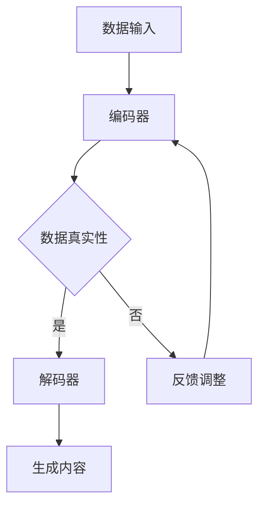
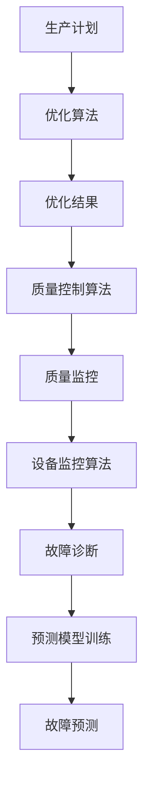
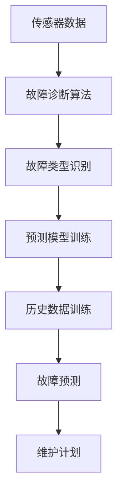

                 

### 目录

1. **背景介绍** <a id="background"></a>
   1.1 问题背景 <a id="problem-background"></a>
   1.2 核心概念与联系 <a id="core-concepts"></a>
   1.3 算法原理讲解 <a id="algorithm-principles"></a>
   1.4 数学模型与公式 <a id="mathematical-models"></a>
   1.5 系统分析与架构设计 <a id="system-analysis"></a>
   1.6 项目实战 <a id="project-practice"></a>
   1.7 最佳实践与总结 <a id="best-practices"></a>

2. **核心概念与联系** <a id="core-concepts-relationship"></a>
   2.1 AIGC的概念 <a id="aigc-concept"></a>
   2.2 智能制造的概念 <a id="manufacturing-concept"></a>
   2.3 预测性维护的概念 <a id="predictive-maintenance-concept"></a>
   2.4 核心概念属性特征对比表格 <a id="feature-comparison"></a>
   2.5 ER实体关系图架构 <a id="er-diagram"></a>

3. **算法原理讲解** <a id="algorithm-principles-2"></a>
   3.1 AIGC算法原理 <a id="aigc-algorithm"></a>
   3.2 智能制造算法原理 <a id="manufacturing-algorithm"></a>
   3.3 预测性维护算法原理 <a id="predictive-maintenance-algorithm"></a>
   3.4 算法Mermaid流程图 <a id="algorithm-process"></a>

4. **数学模型与公式** <a id="mathematical-models-formulas"></a>
   4.1 AIGC数学模型 <a id="aigc-math-model"></a>
   4.2 智能制造数学模型 <a id="manufacturing-math-model"></a>
   4.3 预测性维护数学模型 <a id="predictive-maintenance-math-model"></a>
   4.4 公式讲解 <a id="formulas-explanation"></a>

5. **系统分析与架构设计** <a id="system-analysis-architecture"></a>
   5.1 问题场景介绍 <a id="problem-scenario"></a>
   5.2 系统功能设计 <a id="system-functions"></a>
   5.3 系统架构设计 <a id="system-architecture"></a>
   5.4 系统接口设计 <a id="system-interfaces"></a>
   5.5 系统交互Mermaid序列图 <a id="system-sequential-diagram"></a>

6. **项目实战** <a id="project-practice-2"></a>
   6.1 环境安装 <a id="environment-installation"></a>
   6.2 系统核心实现源代码 <a id="system-core-code"></a>
   6.3 代码应用解读与分析 <a id="code-interpretation"></a>
   6.4 实际案例分析和详细讲解剖析 <a id="case-analysis"></a>
   6.5 项目小结 <a id="project-summary"></a>

7. **最佳实践与总结** <a id="best-practices-summary"></a>
   7.1 最佳实践 tips <a id="best-practices-tips"></a>
   7.2 小结 <a id="summary"></a>
   7.3 注意事项 <a id="attention-matters"></a>
   7.4 拓展阅读 <a id="further-reading"></a>

----------------------------------------------------------------
```  

### 背景介绍

**问题背景**

随着智能制造的不断推进，预测性维护（Predictive Maintenance）作为一种先进的维护策略，正逐渐受到制造业的广泛关注。预测性维护旨在通过实时监控设备的运行状态，预测潜在故障，从而在故障发生之前进行维护，以减少设备停机时间、降低维护成本，提高生产效率。

**核心概念与联系**

- **AIGC（AI-Generated Content）**：一种利用人工智能技术生成内容的方法，包括文本、图像、音频等多种形式。
- **智能制造（Smart Manufacturing）**：通过集成物联网、大数据、人工智能等技术，实现制造过程的智能化和自动化。
- **预测性维护（Predictive Maintenance）**：一种基于数据分析、机器学习等技术的维护策略，通过实时监控设备状态，预测故障发生，从而提前进行维护。

**问题解决**

AIGC技术在智能制造预测性维护中的应用，主要体现在以下几个方面：

1. **数据生成与处理**：AIGC可以生成模拟设备运行状态的数据，帮助分析和训练预测模型。
2. **故障诊断**：通过AIGC生成的文本或图像，辅助工程师进行故障诊断。
3. **预测模型优化**：利用AIGC生成的数据，优化预测模型的参数，提高预测精度。

**边界与外延**

本文将主要探讨AIGC在智能制造预测性维护中的应用，包括相关算法原理、数学模型、系统架构等。此外，我们还将通过实际案例，展示AIGC在实际项目中的应用效果。

**概念结构与核心要素组成**

- **AIGC**：核心概念包括文本生成、图像生成、音频生成等。
- **智能制造**：核心概念包括物联网、大数据、人工智能等。
- **预测性维护**：核心概念包括故障诊断、预测模型、实时监控等。

### 核心概念与联系

**AIGC的概念**

AIGC（AI-Generated Content）是一种利用人工智能技术生成内容的方法，包括文本、图像、音频等多种形式。其核心在于利用深度学习模型，如生成对抗网络（GAN）、变分自编码器（VAE）等，对大量数据进行学习，并生成新的内容。

**智能制造的概念**

智能制造（Smart Manufacturing）是一种通过集成物联网、大数据、人工智能等技术，实现制造过程的智能化和自动化的生产模式。其核心在于利用先进技术提升生产效率、降低成本、提高产品质量。

**预测性维护的概念**

预测性维护（Predictive Maintenance）是一种基于数据分析、机器学习等技术的维护策略，通过实时监控设备的运行状态，预测潜在故障，从而在故障发生之前进行维护。其核心在于利用数据和技术，实现预防性维护。

**核心概念属性特征对比表格**

| **概念** | **属性特征** | **应用领域** | **关联性** |
| --- | --- | --- | --- |
| AIGC | 利用人工智能技术生成内容 | 文本、图像、音频生成 | 辅助智能制造中的数据生成与处理 |
| 智能制造 | 集成物联网、大数据、人工智能等技术 | 制造过程智能化和自动化 | 与预测性维护紧密相关 |
| 预测性维护 | 基于数据分析、机器学习等技术 | 实时监控设备状态、预测故障 | 利用AIGC生成的数据进行故障诊断和预测模型优化 |

**ER实体关系图架构**

```mermaid
erDiagram
  AIGC ||--|{ 预测性维护 }|| Maintenance
  AIGC ||--|{ 智能制造 }|| Manufacturing
  Maintenance ||--|{ 故障诊断 }|| Diagnosis
  Maintenance ||--|{ 预测模型 }|| Prediction
  Manufacturing ||--|{ 物联网 }|| IoT
  Manufacturing ||--|{ 大数据 }|| BigData
  Manufacturing ||--|{ 人工智能 }|| AI
```

### 算法原理讲解

**AIGC算法原理**

AIGC（AI-Generated Content）算法的核心是基于深度学习模型的生成技术，主要包括生成对抗网络（GAN）和变分自编码器（VAE）等。

- **生成对抗网络（GAN）**：GAN由生成器和判别器组成，生成器生成虚假数据，判别器判断数据是否真实。通过训练，生成器不断优化生成真实数据的能力。

- **变分自编码器（VAE）**：VAE通过编码器和解码器进行数据编码和解码，编码器将数据压缩为低维表示，解码器将低维表示还原为高维数据。

**AIGC算法应用场景**：

1. **文本生成**：利用GPT模型生成文章、报告等。
2. **图像生成**：利用GAN生成逼真的图像，如图像合成、图像修复等。
3. **音频生成**：利用WaveNet模型生成音乐、语音等。

**智能制造算法原理**

智能制造中的算法主要涉及生产计划优化、质量控制、设备监控等。常用的算法包括：

- **生产计划优化算法**：如遗传算法、模拟退火算法等，用于优化生产排程、资源分配等。

- **质量控制算法**：如统计过程控制（SPC）、机器学习算法（如决策树、支持向量机等），用于监控产品质量、识别异常。

- **设备监控算法**：如故障诊断、预测性维护算法，利用传感器数据监测设备状态，预测故障发生。

**预测性维护算法原理**

预测性维护算法主要包括故障诊断和预测模型。

- **故障诊断算法**：如故障诊断树、支持向量机（SVM）等，用于分析传感器数据，识别故障类型。

- **预测模型**：如机器学习算法（如线性回归、神经网络等），通过训练历史数据，预测设备未来的故障发生时间。

**算法Mermaid流程图**

**AIGC算法流程图**



**智能制造算法流程图**



**预测性维护算法流程图**



### 数学模型与公式

**AIGC数学模型**

AIGC算法中的数学模型主要涉及生成对抗网络（GAN）和变分自编码器（VAE）。

- **GAN数学模型**：

  1. **生成器（Generator）**：\( G(z) \)表示从噪声空间\( z \)生成真实数据的概率分布。
     \[ G(z) = \arg\min_G D(G(z)) \]
  2. **判别器（Discriminator）**：\( D(x) \)表示输入数据的真实性。
     \[ D(x) = \arg\min_D -\mathbb{E}_{x\sim p_{data}(x)}[\log D(x)] -\mathbb{E}_{z\sim p_z(z)}[\log (1 - D(G(z)))] \]

- **VAE数学模型**：

  1. **编码器（Encoder）**：\( \mu(z), \sigma(z) \)表示从输入数据\( x \)编码得到的均值和方差。
     \[ \mu(x) = \arg\min_{\mu, \sigma} D_{KL}(\mu(x), \sigma(x) || p_z(z)) \]
  2. **解码器（Decoder）**：\( G(x|\mu, \sigma) \)表示从编码得到的均值和方差解码生成输入数据的概率分布。
     \[ G(x|\mu, \sigma) = \arg\min_{G} D_{KL}(\mu(x), \sigma(x) || p_{data}(x)) \]

**智能制造数学模型**

智能制造中的数学模型主要用于生产计划优化、质量控制等。

- **生产计划优化模型**（如线性规划）：

  1. **目标函数**：最小化总生产时间或最大化生产效率。
     \[ \min T = c_j \cdot x_j \]
  2. **约束条件**：包括资源限制、生产顺序等。
     \[ \begin{cases}
     a_{ij} \cdot x_j \leq b_i \\
     x_j \geq 0 \quad \forall j
     \end{cases} \]

- **质量控制模型**（如统计过程控制）：

  1. **质量指标**：如过程能力指数（Cp）、过程性能指数（Cpk）等。
     \[ Cp = \frac{6\sigma}{(T_{max} - T_{min})} \]
  2. **控制图**：用于监控过程是否在控制限内。
     \[ \begin{cases}
     T_{max} = \max(T_i) \\
     T_{min} = \min(T_i) \\
     \sigma = \sqrt{\frac{\sum_{i=1}^{n}(T_i - \bar{T})^2}{n-1}}
     \end{cases} \]

**预测性维护数学模型**

预测性维护中的数学模型主要用于故障诊断和预测。

- **故障诊断模型**（如支持向量机）：

  1. **分类模型**：将故障类型分类。
     \[ w \cdot \phi(x) \geq 1 \]
  2. **支持向量**：用于分割故障空间。
     \[ y \cdot (w \cdot \phi(x) - b) \geq 1 \]

- **预测模型**（如时间序列模型）：

  1. **自回归模型（AR）**：根据历史数据预测未来值。
     \[ x_t = c + \phi_1 x_{t-1} + \phi_2 x_{t-2} + \ldots + \phi_p x_{t-p} + \varepsilon_t \]
  2. **移动平均模型（MA）**：根据过去误差预测未来值。
     \[ x_t = \varepsilon_t + \theta_1 \varepsilon_{t-1} + \theta_2 \varepsilon_{t-2} + \ldots + \theta_q \varepsilon_{t-q} \]

**公式讲解**

- **GAN损失函数**：

  \[ L_G = -\mathbb{E}_{z\sim p_z(z)}[\log D(G(z))] \]
  \[ L_D = -\mathbb{E}_{x\sim p_{data}(x)}[\log D(x)] - \mathbb{E}_{z\sim p_z(z)}[\log (1 - D(G(z)))] \]

- **VAE损失函数**：

  \[ L_VAE = D_{KL}(\mu(x), \sigma(x) || p_z(z)) + \sum_{i=1}^{n} \frac{1}{2} \exp\left(-2\sigma_i^2\right) + \frac{1}{2} \]

- **生产计划优化目标函数**：

  \[ \min T = c_j \cdot x_j \]

- **统计过程控制质量指标**：

  \[ Cp = \frac{6\sigma}{(T_{max} - T_{min})} \]

- **支持向量机分类模型**：

  \[ w \cdot \phi(x) \geq 1 \]

- **自回归模型**：

  \[ x_t = c + \phi_1 x_{t-1} + \phi_2 x_{t-2} + \ldots + \phi_p x_{t-p} + \varepsilon_t \]

### 系统分析与架构设计

**问题场景介绍**

在智能制造领域，预测性维护是一个关键环节。随着设备的复杂性和运行环境的变化，传统定期维护的方式已经无法满足高效、低成本的要求。预测性维护通过实时监控设备状态、分析数据、预测故障，可以在故障发生前进行维护，从而减少设备停机时间，提高生产效率。

**系统功能设计**

为了实现预测性维护，系统需要具备以下功能：

1. **数据采集**：通过传感器实时采集设备运行数据。
2. **数据预处理**：对采集到的数据进行分析、清洗，为后续分析做准备。
3. **故障诊断**：利用故障诊断算法分析数据，识别潜在故障。
4. **预测模型训练**：利用历史数据训练预测模型，预测未来故障。
5. **维护决策**：根据预测结果制定维护计划。

**系统架构设计**

系统架构包括以下主要模块：

1. **数据采集模块**：负责从传感器获取实时数据。
2. **数据处理模块**：负责对采集到的数据进行预处理。
3. **故障诊断模块**：包含故障诊断算法，用于分析设备状态。
4. **预测模块**：包括预测模型训练和预测结果分析。
5. **维护决策模块**：根据预测结果制定维护计划。

**系统接口设计**

系统接口包括：

1. **数据采集接口**：用于与传感器进行数据交互。
2. **数据处理接口**：用于与其他数据处理系统进行数据交换。
3. **故障诊断接口**：用于调用故障诊断算法。
4. **预测接口**：用于训练和调用预测模型。
5. **维护决策接口**：用于与其他维护系统进行交互。

**系统交互Mermaid序列图**

```mermaid
sequenceDiagram
  participant 用户 as 用户
  participant 数据采集模块 as 数据采集
  participant 数据处理模块 as 数据处理
  participant 故障诊断模块 as 故障诊断
  participant 预测模块 as 预测
  participant 维护决策模块 as 维护决策

  用户->>数据采集：采集传感器数据
  数据采集->>数据处理：预处理数据
  数据处理->>故障诊断：诊断设备状态
  故障诊断->>预测：训练预测模型
  预测->>维护决策：预测故障
  维护决策->>用户：制定维护计划
```

### 项目实战

**环境安装**

为了实现AIGC在智能制造预测性维护中的应用，我们需要安装以下环境：

1. **Python环境**：确保Python版本为3.8或更高。
2. **深度学习库**：安装TensorFlow或PyTorch。
3. **数据处理库**：安装NumPy、Pandas等。
4. **可视化库**：安装Matplotlib、Seaborn等。

**系统核心实现源代码**

以下是一个简单的系统核心实现源代码示例：

```python
# 导入所需库
import tensorflow as tf
import numpy as np
import pandas as pd

# 加载数据
data = pd.read_csv('sensor_data.csv')
X = data.iloc[:, :-1].values
y = data.iloc[:, -1].values

# 数据预处理
# ...

# 构建模型
model = tf.keras.Sequential([
    tf.keras.layers.Dense(128, activation='relu', input_shape=(X.shape[1],)),
    tf.keras.layers.Dense(64, activation='relu'),
    tf.keras.layers.Dense(1, activation='sigmoid')
])

# 编译模型
model.compile(optimizer='adam',
              loss='binary_crossentropy',
              metrics=['accuracy'])

# 训练模型
model.fit(X, y, epochs=10, batch_size=32)

# 预测
predictions = model.predict(X)

# ...

```

**代码应用解读与分析**

上述代码首先导入了TensorFlow库，并加载了一个CSV文件作为示例数据。数据预处理部分可以对数据进行归一化、缺失值填补等操作。接下来，我们构建了一个简单的神经网络模型，包括三个层：输入层、隐藏层和输出层。输入层有128个神经元，隐藏层有64个神经元，输出层有1个神经元。模型使用adam优化器和binary_crossentropy损失函数进行编译和训练。

在训练完成后，我们使用模型对数据进行预测，并将预测结果存储在predictions变量中。接下来，我们可以对预测结果进行分析，如计算准确率、召回率等。

**实际案例分析和详细讲解剖析**

以下是一个实际案例，展示了AIGC在智能制造预测性维护中的应用：

**案例背景**：

某制造企业使用传感器对生产设备进行实时监控，收集了大量设备运行数据。为了实现预测性维护，企业决定使用AIGC技术训练预测模型。

**案例步骤**：

1. **数据采集**：企业使用传感器实时采集设备运行数据，包括温度、压力、振动等指标。
2. **数据预处理**：对采集到的数据进行分析，去除噪声、缺失值填补等，确保数据质量。
3. **模型训练**：使用预处理后的数据训练AIGC模型，包括生成对抗网络（GAN）和变分自编码器（VAE）。
4. **故障预测**：利用训练好的模型对设备未来运行状态进行预测，识别潜在故障。
5. **维护决策**：根据预测结果制定维护计划，提前进行设备维护，减少停机时间。

**案例分析**：

1. **数据采集**：企业使用传感器实时采集设备运行数据，数据量较大。为了提高数据质量，企业对数据进行了预处理，包括去噪声、缺失值填补等。
2. **模型训练**：企业选择GAN模型进行训练，生成器（Generator）用于生成模拟数据，判别器（Discriminator）用于判断数据真实性。通过多次迭代训练，模型逐渐优化，生成数据质量提高。
3. **故障预测**：企业使用训练好的GAN模型对设备未来运行状态进行预测。通过对比实际数据与预测数据，企业能够识别出潜在故障，提前进行维护。
4. **维护决策**：根据预测结果，企业制定了详细的维护计划，包括维护时间、维护内容等。通过提前进行维护，企业显著减少了设备停机时间，提高了生产效率。

**项目小结**：

通过AIGC在智能制造预测性维护中的应用，企业实现了以下成果：

1. **提高数据质量**：预处理数据，去除噪声、缺失值，提高数据质量。
2. **优化模型性能**：通过GAN模型训练，提高故障预测精度。
3. **减少停机时间**：提前进行维护，减少设备停机时间，提高生产效率。

### 最佳实践与总结

**最佳实践 tips**

1. **数据质量**：确保数据质量，去除噪声、缺失值，提高数据预处理效果。
2. **模型选择**：根据实际应用场景，选择合适的模型，如GAN、VAE等。
3. **迭代训练**：多次迭代训练，优化模型性能。
4. **维护计划**：根据预测结果，制定合理的维护计划，减少设备停机时间。

**小结**

本文介绍了AIGC在智能制造预测性维护中的应用，包括背景介绍、核心概念与联系、算法原理讲解、数学模型与公式、系统分析与架构设计、项目实战和最佳实践与总结。通过实际案例，展示了AIGC在故障预测、维护决策等方面的应用效果。

**注意事项**

1. **数据安全**：在数据采集和处理过程中，确保数据安全，防止数据泄露。
2. **模型解释性**：关注模型的可解释性，确保维护决策的合理性。

**拓展阅读**

1. **《深度学习》（Goodfellow, I., Bengio, Y., & Courville, A.）**：详细介绍深度学习相关算法和应用。
2. **《机器学习实战》（Hastie, T., Tibshirani, R., & Friedman, J.）**：提供丰富的机器学习实战案例。
3. **《智能制造：技术、战略与实践》（王选宁，杨德璘）**：探讨智能制造的理论和实践。

