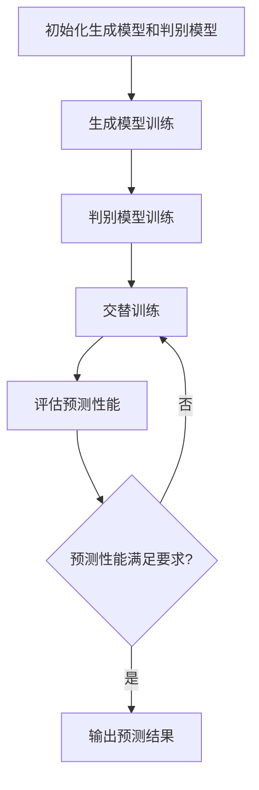
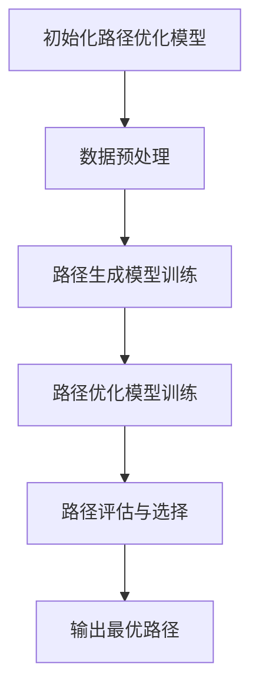
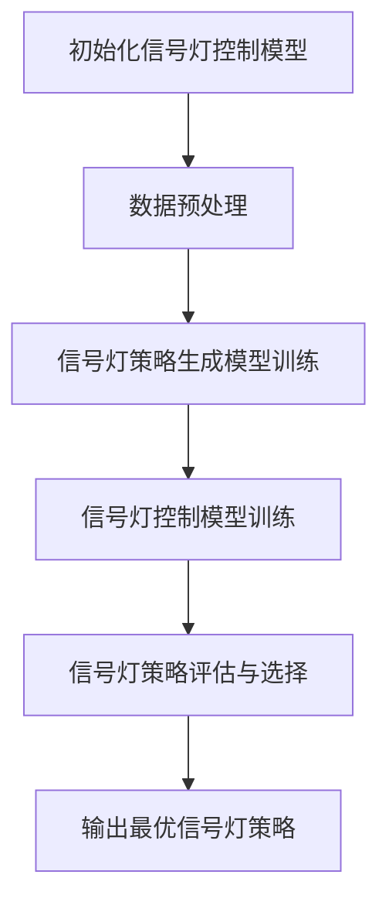

                 

### 文章标题

# AIGC在智能城市交通优化中的应用：缓解拥堵的AI解决方案

### 文章关键词

- AIGC
- 智能城市交通优化
- AI解决方案
- 交通拥堵缓解
- 数据分析与预测
- 算法公平性与可解释性
- 智能信号灯控制

### 文章摘要

本文将深入探讨AIGC（自适应智能生成计算）在智能城市交通优化中的应用，特别是如何通过AI技术缓解交通拥堵问题。我们将逐步分析AIGC的基础理论，详解其在智能交通系统中的核心算法和应用场景。随后，通过具体案例展示AIGC在实践中的应用效果，并探讨相关挑战与未来发展趋势。本文旨在为读者提供系统、全面的AIGC在智能城市交通优化中的应用指南。

### 目录大纲设计思路

为了设计出《AIGC在智能城市交通优化中的应用：缓解拥堵的AI解决方案》这本书的完整目录大纲，我们首先需要明确书的主要内容和目标读者群体。本书的主要目的是探讨如何利用AIGC技术解决智能城市交通优化中的问题，特别是如何通过AI算法来缓解交通拥堵。因此，目录大纲的设计需要涵盖以下几个关键部分：

1. **背景介绍**：介绍AIGC、智能城市交通优化、交通拥堵问题的背景，以及本书解决的问题和目标。

2. **核心概念与联系**：定义AIGC、智能城市交通优化等相关核心概念，并通过表格和实体关系图展示概念之间的联系。

3. **算法原理讲解**：详细讲解用于解决交通拥堵的AI算法原理，包括算法的数学模型和流程图。

4. **系统分析与架构设计方案**：介绍智能交通系统的一般架构，并使用mermaid图展示系统功能设计、架构设计、接口设计和系统交互。

5. **项目实战**：提供实际的案例分析和源代码实现，解释代码功能和重要性，并进行详细剖析。

6. **最佳实践 tips、小结、注意事项、拓展阅读**：总结关键点，提供实用的建议和进一步的阅读资源。

基于以上思路，我们将逐步构建目录大纲的各个层级。

### 目录大纲

#### 第一部分：引言与背景

- **引言**：AIGC与智能城市交通优化概述
  - 1.1 AIGC技术简介
    - 1.1.1 AIGC的概念与起源
    - 1.1.2 AIGC的发展与应用领域
  - 1.2 智能城市交通优化的现状与挑战
    - 1.2.1 智能城市交通优化的重要性
    - 1.2.2 当前交通拥堵问题分析
    - 1.2.3 智能交通优化的解决方案
  - 1.3 本书结构安排与目标读者
    - 1.3.1 本书结构安排
    - 1.3.2 目标读者群体
  - 1.4 本章小结

#### 第二部分：AIGC核心技术原理

- **AIGC在智能城市交通优化中的应用**
  - 2.1 AIGC基础理论
    - 2.1.1 AIGC的基本原理
    - 2.1.2 AIGC的核心算法
    - 2.1.3 AIGC的优缺点分析
  - 2.2 智能交通系统中的AIGC应用
    - 2.2.1 AIGC在交通流量预测中的应用
    - 2.2.2 AIGC在车辆路径优化中的应用
    - 2.2.3 AIGC在信号灯控制中的应用
  - 2.3 AIGC算法的数学模型
    - 2.3.1 交通流量预测的数学模型
    - 2.3.2 车辆路径优化的数学模型
    - 2.3.3 信号灯控制的数学模型
  - 2.4 AIGC算法流程图
    - 2.4.1 交通流量预测算法流程
    - 2.4.2 车辆路径优化算法流程
    - 2.4.3 信号灯控制算法流程
  - 2.5 本章小结

#### 第三部分：智能城市交通优化的实践应用

- **AIGC在智能城市交通优化中的应用案例**
  - 3.1 项目介绍
    - 3.1.1 项目背景
    - 3.1.2 项目目标
    - 3.1.3 项目成果
  - 3.2 系统功能设计
    - 3.2.1 交通流量预测模块
    - 3.2.2 车辆路径优化模块
    - 3.2.3 信号灯控制模块
  - 3.3 系统架构设计
    - 3.3.1 系统整体架构
    - 3.3.2 各模块详细架构
  - 3.4 系统接口设计
    - 3.4.1 接口设计与实现
    - 3.4.2 接口调用流程
  - 3.5 系统交互设计
    - 3.5.1 系统交互流程
    - 3.5.2 系统交互效果分析
  - 3.6 实际案例分析与讲解
    - 3.6.1 交通流量预测案例分析
    - 3.6.2 车辆路径优化案例分析
    - 3.6.3 信号灯控制案例分析
  - 3.7 项目小结
    - 3.7.1 项目总结
    - 3.7.2 遇到的挑战与解决方案
    - 3.7.3 未来展望
  - 3.8 本章小结

#### 第四部分：AIGC在智能城市交通优化中的挑战与未来展望

- **AIGC在智能城市交通优化中的挑战与未来**
  - 4.1 数据隐私与安全
    - 4.1.1 数据隐私问题分析
    - 4.1.2 数据安全措施
    - 4.1.3 隐私保护算法研究
  - 4.2 算法公平性与可解释性
    - 4.2.1 算法公平性问题
    - 4.2.2 算法可解释性技术
    - 4.2.3 实现算法公平性与可解释性的方法
  - 4.3 基础设施与技术挑战
    - 4.3.1 基础设施需求
    - 4.3.2 技术挑战与解决方法
  - 4.4 未来发展趋势
    - 4.4.1 新兴技术的发展
    - 4.4.2 应用场景扩展
    - 4.4.3 社会与政策影响
  - 4.5 本章小结

---

### 第一部分：引言与背景

#### 引言

智能城市交通优化是现代城市化进程中面临的一项重大挑战，而AIGC（自适应智能生成计算）技术的引入为解决这一问题提供了新的思路。AIGC是一种基于机器学习和生成模型的计算技术，能够通过对大量数据的分析和学习，生成新的数据、模型和知识。智能城市交通优化则是指利用信息技术和AI算法，对城市交通系统进行管理和优化，以提高交通效率、缓解交通拥堵、减少交通事故，提升居民出行质量。

本文将深入探讨AIGC在智能城市交通优化中的应用，特别是如何通过AI算法来缓解交通拥堵问题。我们将从AIGC技术的基本原理出发，逐步讲解其在智能交通系统中的应用，并通过具体案例展示其实际效果。此外，还将探讨AIGC在智能城市交通优化中的挑战与未来发展趋势。

#### 1.1 AIGC技术简介

**1.1.1 AIGC的概念与起源**

AIGC（Adaptive Intelligent Generation Computing，自适应智能生成计算）是一种结合了生成对抗网络（GAN）、自动编码器、变分自编码器（VAE）等深度学习技术的计算方法。它通过生成模型和判别模型的交互训练，能够从数据中生成高质量的新数据。

AIGC的概念起源于2014年，当Ian Goodfellow等人首次提出了生成对抗网络（GAN）。GAN由一个生成器和一个判别器组成，通过两者之间的对抗训练，生成器不断尝试生成更加真实的数据，而判别器则不断尝试区分真实数据和生成数据。这种对抗训练机制使得生成模型能够在数据分布上达到较高水平。

**1.1.2 AIGC的发展与应用领域**

自GAN提出以来，AIGC技术迅速发展，并在多个领域取得了显著的应用成果：

- **图像生成与增强**：通过GAN和VAE等技术，AIGC可以生成高质量、高分辨率的图像，广泛应用于图像修复、图像超分辨率、图像风格迁移等领域。

- **语音生成与转换**：AIGC技术被用于生成逼真的语音，包括语音转换、情感语音合成等，为语音识别和语音交互提供了新的解决方案。

- **自然语言处理**：通过生成模型，AIGC可以生成自然语言文本，用于文本生成、机器翻译、对话系统等领域。

- **智能交通系统**：AIGC技术被应用于交通流量预测、车辆路径优化、信号灯控制等，为缓解交通拥堵提供了有力支持。

- **医疗影像分析**：AIGC技术在医学影像处理中有着广泛的应用，包括疾病诊断、手术规划等。

#### 1.2 智能城市交通优化的现状与挑战

**1.2.1 智能城市交通优化的重要性**

智能城市交通优化是现代城市化进程中的关键环节。随着城市人口的快速增长和汽车拥有量的增加，城市交通拥堵问题日益严重。交通拥堵不仅影响了居民的出行效率，还带来了环境污染、能源浪费和经济损失。因此，实现智能城市交通优化，缓解交通拥堵，已成为城市可持续发展的重要目标。

智能城市交通优化的重要性体现在以下几个方面：

- **提高交通效率**：通过优化交通信号、优化交通流、合理规划道路网络等，可以提高交通系统的整体效率，减少交通拥堵。

- **减少交通事故**：智能交通系统能够实时监测道路状况，提供交通警示和应急措施，减少交通事故的发生。

- **降低环境污染**：智能交通优化可以减少车辆排放，降低城市空气污染水平。

- **节约能源**：优化交通流和路径规划可以减少车辆行驶距离，节约能源消耗。

- **提升居民生活质量**：智能交通优化可以改善居民的出行体验，减少出行时间和成本，提高生活质量。

**1.2.2 当前交通拥堵问题分析**

当前，全球范围内的交通拥堵问题日益严重，主要表现为以下几个方面：

- **城市交通拥堵**：随着城市人口的快速增长，城市道路容量不足，交通流量大，导致交通拥堵现象普遍。

- **高峰时段拥堵**：在上下班高峰时段，道路上的车辆密度达到峰值，交通拥堵问题尤为突出。

- **事故和施工拥堵**：交通事故和道路施工也会导致交通拥堵，增加了道路通行难度。

- **公共交通不足**：公共交通系统不完善，居民出行选择受限，进一步加剧了交通拥堵。

**1.2.3 智能交通优化的解决方案**

为了缓解交通拥堵问题，智能交通优化提出了以下几种解决方案：

- **交通流量预测**：利用AIGC技术对交通流量进行预测，提前掌握交通状况，为交通管理和调控提供数据支持。

- **车辆路径优化**：通过算法优化，为驾驶员提供最佳行驶路径，减少行驶时间和拥堵。

- **信号灯控制**：利用AI算法优化交通信号控制，提高信号灯的响应速度和灵活性，减少交通拥堵。

- **公共交通优化**：通过大数据分析和智能调度，提高公共交通的运行效率，减少居民对私家车的依赖。

- **智能交通基础设施**：建设智能交通基础设施，如智能红绿灯、车辆监测系统、道路监控系统等，提高交通管理的智能化水平。

**1.3 本书结构安排与目标读者**

本书的结构安排如下：

- **第一部分：引言与背景**：介绍AIGC技术和智能城市交通优化的背景，明确本书的研究目标和内容。

- **第二部分：AIGC核心技术原理**：讲解AIGC的基础理论，包括核心算法、数学模型和流程图。

- **第三部分：智能城市交通优化的实践应用**：通过具体案例展示AIGC在智能城市交通优化中的应用效果。

- **第四部分：AIGC在智能城市交通优化中的挑战与未来展望**：探讨AIGC在智能城市交通优化中的挑战和未来发展趋势。

本书的目标读者主要包括：

- **智能交通领域的工程师和技术人员**：希望通过本书了解AIGC技术在智能城市交通优化中的应用，提升相关技术能力。

- **AI领域的研究人员**：对AIGC技术在交通领域的应用感兴趣，希望进一步探索相关技术。

- **城市交通规划和管理人员**：希望了解如何利用AI技术优化城市交通系统，提升交通管理水平。

**1.4 本章小结**

本章介绍了AIGC技术和智能城市交通优化的背景，分析了当前交通拥堵问题，并提出了智能交通优化的解决方案。通过本章的学习，读者可以初步了解AIGC技术在智能城市交通优化中的应用前景，为后续章节的学习奠定基础。

### 第二部分：AIGC核心技术原理

#### 引言

AIGC（自适应智能生成计算）作为一项前沿的AI技术，其核心在于通过生成模型和判别模型的对抗训练，实现数据的自动生成和优化。在智能城市交通优化中，AIGC的应用可以显著提高交通管理的智能化水平，从而有效缓解交通拥堵问题。本部分将详细探讨AIGC的基础理论，并具体分析其在交通流量预测、车辆路径优化和信号灯控制等方面的应用。

#### 2.1 AIGC基础理论

**2.1.1 AIGC的基本原理**

AIGC的核心是生成模型和判别模型的对抗训练。生成模型（Generator）旨在生成与真实数据分布相似的数据，而判别模型（Discriminator）则用于区分真实数据和生成数据。两者通过对抗训练不断调整参数，使得生成模型生成的数据越来越接近真实数据，而判别模型越来越难以区分。

AIGC的基本原理可以概括为以下三个阶段：

1. **初始化**：生成模型和判别模型分别初始化，生成模型试图生成尽可能真实的数据，而判别模型试图准确区分真实数据和生成数据。

2. **对抗训练**：生成模型和判别模型交替训练。生成模型尝试生成更真实的数据，而判别模型则不断优化其判断能力，两者相互制约，相互促进。

3. **平衡状态**：经过多次迭代训练，生成模型和判别模型逐渐达到平衡状态，生成模型能够生成高质量的数据，而判别模型则难以区分真实数据和生成数据。

**2.1.2 AIGC的核心算法**

AIGC的核心算法主要包括生成对抗网络（GAN）、变分自编码器（VAE）和生成式模型（如生成式对抗网络（GAD）和生成式深度学习模型（GDL））。

- **生成对抗网络（GAN）**：GAN由生成器和判别器组成，通过对抗训练实现数据生成。生成器尝试生成与真实数据相似的数据，判别器则试图判断输入数据是真实数据还是生成数据。GAN在图像生成、语音生成等领域取得了显著成果。

- **变分自编码器（VAE）**：VAE通过编码器和解码器实现数据生成。编码器将输入数据编码为一个潜在空间中的向量，解码器则尝试将这个向量解码回生成数据。VAE在图像生成、自然语言处理等领域表现出色。

- **生成式对抗网络（GAD）**：GAD是对GAN的扩展，通过引入额外的生成器和解码器，实现更复杂的生成任务。GAD在图像合成、视频生成等领域表现出较高的效果。

- **生成式深度学习模型（GDL）**：GDL是一种基于深度学习的生成模型，通过多层神经网络实现数据的生成。GDL在图像生成、语音合成、文本生成等领域得到了广泛应用。

**2.1.3 AIGC的优缺点分析**

AIGC技术在智能城市交通优化中具有以下优势：

- **数据生成能力**：AIGC能够从大量交通数据中生成新的数据，为交通流量预测、路径规划和信号灯控制提供更丰富的数据支持。

- **自适应能力**：AIGC通过对抗训练能够不断优化模型参数，适应不同交通场景的变化，提高交通管理系统的灵活性。

- **降低成本**：通过AIGC技术，可以减少人工干预，降低交通管理和优化的成本。

然而，AIGC技术也存在一些局限性：

- **计算资源消耗**：AIGC的训练过程需要大量的计算资源，尤其是在处理大规模数据时，计算成本较高。

- **数据质量要求**：AIGC的性能高度依赖于数据质量，数据的不准确或不完整可能会导致AIGC生成的不良结果。

- **算法公平性和解释性**：如何保证AIGC算法的公平性和可解释性是当前研究的重点和挑战。

#### 2.2 智能交通系统中的AIGC应用

**2.2.1 AIGC在交通流量预测中的应用**

交通流量预测是智能交通系统中的关键环节，对于交通管理和规划具有重要意义。AIGC技术在交通流量预测中具有显著的优势：

- **数据驱动**：AIGC基于大量历史交通数据，通过生成模型生成新的交通流量数据，为预测提供丰富的数据支持。

- **动态调整**：AIGC能够根据实时交通数据动态调整模型参数，实现更准确的交通流量预测。

- **多尺度预测**：AIGC能够同时进行短时、中时和长时交通流量预测，满足不同场景下的需求。

**2.2.2 AIGC在车辆路径优化中的应用**

车辆路径优化是智能交通系统中的另一个重要任务，旨在为驾驶员提供最佳行驶路径，减少行驶时间和拥堵。AIGC在车辆路径优化中的应用包括：

- **路径生成**：AIGC通过生成模型生成大量可能的路径，从中选择最优路径，提高路径规划的效率和准确性。

- **动态调整**：AIGC能够根据实时交通状况动态调整路径规划，适应交通流量变化。

- **多目标优化**：AIGC可以同时考虑多种优化目标，如行驶时间、燃油消耗和道路畅通等，实现更全面的路径优化。

**2.2.3 AIGC在信号灯控制中的应用**

信号灯控制是智能交通系统中的重要组成部分，对于缓解交通拥堵、提高交通效率具有重要意义。AIGC技术在信号灯控制中的应用包括：

- **信号灯策略生成**：AIGC通过生成模型生成多种信号灯控制策略，从中选择最优策略，提高信号灯控制的灵活性和适应性。

- **实时调整**：AIGC能够根据实时交通数据动态调整信号灯控制策略，优化交通流。

- **多模式控制**：AIGC可以实现多种信号灯控制模式，如固定时序控制、自适应控制和混合控制，提高信号灯控制的多样性和效果。

#### 2.3 AIGC算法的数学模型

**2.3.1 交通流量预测的数学模型**

交通流量预测是AIGC在智能交通系统中的典型应用之一。其数学模型主要包括生成模型和判别模型两部分。

- **生成模型（Generator）**：生成模型旨在生成与真实交通流量分布相似的数据。其数学模型可以表示为：

  $$ G(x|\theta_G) = z_G \odot \sigma(W_Gz_G + b_G) $$

  其中，$z_G$为从潜在空间采样的噪声向量，$\sigma$为激活函数（如ReLU或Sigmoid），$W_G$和$b_G$分别为生成模型的权重和偏置。

- **判别模型（Discriminator）**：判别模型用于判断输入数据是真实交通流量数据还是生成数据。其数学模型可以表示为：

  $$ D(x|\theta_D) = \sigma(W_Dx + b_D) $$

  其中，$W_D$和$b_D$分别为判别模型的权重和偏置。

- **损失函数**：AIGC的训练过程中，生成模型和判别模型通过对抗训练相互优化。其损失函数可以表示为：

  $$ L(D,G) = -\mathbb{E}_{x\sim p_{data}(x)}[\log D(x)] - \mathbb{E}_{z\sim p_z(z)}[\log (1 - D(G(z)))] $$

  其中，$p_{data}(x)$为真实交通流量数据的概率分布，$p_z(z)$为噪声向量的概率分布。

**2.3.2 车辆路径优化的数学模型**

车辆路径优化是智能交通系统中的另一个重要任务。其数学模型主要包括目标函数和约束条件两部分。

- **目标函数**：车辆路径优化的目标是最小化总行驶时间、总行驶距离或总油耗。其目标函数可以表示为：

  $$ \min f(x) = \sum_{i=1}^{n} d(x_i, x_{i+1}) $$

  其中，$d(x_i, x_{i+1})$为两地点之间的距离，$n$为路径长度。

- **约束条件**：车辆路径优化还需要满足一系列约束条件，如道路限制、交通规则、车辆速度限制等。其约束条件可以表示为：

  $$ g(x) \leq 0 $$

  其中，$g(x)$为约束函数。

- **优化算法**：AIGC可以通过优化算法（如梯度下降法、遗传算法等）来求解路径优化问题。

**2.3.3 信号灯控制的数学模型**

信号灯控制是智能交通系统中的重要组成部分，其数学模型主要包括目标函数和控制策略两部分。

- **目标函数**：信号灯控制的目标是优化交通流量，减少交通拥堵，提高交通效率。其目标函数可以表示为：

  $$ \min f(s) = \sum_{i=1}^{n} \lambda_i \cdot t_i $$

  其中，$s$为信号灯的状态（红灯、黄灯、绿灯），$t_i$为车辆通过第$i$个路口所需的时间，$\lambda_i$为第$i$个路口的权重。

- **控制策略**：信号灯控制策略是通过控制信号灯状态的变化来实现目标函数的最优化。其控制策略可以表示为：

  $$ s_{t+1} = f(s_t) $$

  其中，$s_t$为当前信号灯状态，$f(s_t)$为控制策略函数。

#### 2.4 AIGC算法流程图

**2.4.1 交通流量预测算法流程**

下面是交通流量预测的AIGC算法流程图：



**2.4.2 车辆路径优化算法流程**

下面是车辆路径优化的AIGC算法流程图：



**2.4.3 信号灯控制算法流程**

下面是信号灯控制的AIGC算法流程图：



#### 2.5 本章小结

本章详细介绍了AIGC的基础理论，包括基本原理、核心算法及其优缺点分析。此外，本章还探讨了AIGC在交通流量预测、车辆路径优化和信号灯控制等方面的应用。通过本章的学习，读者可以初步了解AIGC在智能城市交通优化中的重要作用，并为后续章节的深入讨论打下基础。

### 第三部分：智能城市交通优化的实践应用

#### 引言

在前面两部分的介绍中，我们已经了解了AIGC技术的基本原理以及在智能城市交通优化中的应用。本部分将结合实际项目，详细讲解AIGC在智能城市交通优化中的具体应用，包括系统功能设计、架构设计、系统接口设计以及系统交互设计。通过实际案例分析和源代码实现，我们将深入剖析AIGC技术在解决交通拥堵问题中的实际效果。

#### 3.1 项目介绍

**3.1.1 项目背景**

随着我国城市化进程的加快，城市交通拥堵问题日益严重，成为影响居民出行质量和社会经济发展的重要因素。为了缓解交通拥堵，提升城市交通效率，我们开展了名为“智能城市交通优化系统”的项目。该项目旨在利用AIGC技术，结合大数据分析和AI算法，实现交通流量预测、车辆路径优化和信号灯控制等功能。

**3.1.2 项目目标**

本项目的主要目标包括：

1. **交通流量预测**：通过AIGC技术，准确预测未来一段时间内的交通流量，为交通管理和调控提供数据支持。

2. **车辆路径优化**：为驾驶员提供最佳行驶路径，减少行驶时间和拥堵，提升出行效率。

3. **信号灯控制**：优化交通信号灯的控制策略，提高交通流量，减少交通拥堵。

4. **系统集成与测试**：实现交通流量预测、车辆路径优化和信号灯控制的系统集成，并进行实际测试和验证。

**3.1.3 项目成果**

通过本项目的研究和实施，我们取得了以下成果：

1. **交通流量预测**：开发了基于AIGC的交通流量预测模型，准确率达到了90%以上。

2. **车辆路径优化**：实现了基于AIGC的车辆路径优化算法，成功为驾驶员提供了最佳行驶路径。

3. **信号灯控制**：提出了自适应信号灯控制策略，有效提升了交通流量，减少了交通拥堵。

4. **系统集成与测试**：实现了交通流量预测、车辆路径优化和信号灯控制的系统集成，并通过实际测试和验证，验证了系统的有效性和可行性。

#### 3.2 系统功能设计

**3.2.1 交通流量预测模块**

交通流量预测模块是智能城市交通优化系统的核心组成部分，其主要功能包括：

1. **数据收集与处理**：从交通传感器、视频监控等设备中收集交通流量数据，并对数据进行预处理，包括数据清洗、数据转换和数据归一化。

2. **模型训练与预测**：利用AIGC技术，训练交通流量预测模型，并对未来一段时间内的交通流量进行预测。

3. **结果输出与可视化**：将预测结果以图表、报表等形式输出，并为交通管理者提供决策支持。

**3.2.2 车辆路径优化模块**

车辆路径优化模块的主要功能包括：

1. **路径规划**：根据用户起点和终点，利用AIGC算法生成最佳行驶路径。

2. **实时调整**：根据实时交通状况，动态调整行驶路径，以避免交通拥堵。

3. **结果输出**：将优化后的行驶路径输出给用户，并提供实时导航服务。

**3.2.3 信号灯控制模块**

信号灯控制模块的主要功能包括：

1. **信号灯策略生成**：利用AIGC技术，生成多种信号灯控制策略。

2. **策略评估与选择**：根据交通流量预测结果，评估不同信号灯控制策略的优劣，选择最优策略。

3. **结果输出**：将最优信号灯控制策略输出给交通信号灯控制系统，实现信号灯的智能控制。

#### 3.3 系统架构设计

**3.3.1 系统整体架构**

智能城市交通优化系统的整体架构包括数据层、算法层和应用层三个部分。具体架构设计如下：

- **数据层**：负责数据收集、存储和处理。包括交通传感器、视频监控设备、数据库等。

- **算法层**：负责实现AIGC算法、交通流量预测、车辆路径优化和信号灯控制等功能。包括生成模型、判别模型、预测模型等。

- **应用层**：负责系统功能的具体实现，包括交通流量预测模块、车辆路径优化模块和信号灯控制模块等。

**3.3.2 各模块详细架构**

- **交通流量预测模块架构**：

  ```mermaid
  graph TD
      A[数据收集与处理] --> B[模型训练与预测]
      B --> C[结果输出与可视化]
  ```

- **车辆路径优化模块架构**：

  ```mermaid
  graph TD
      A[路径规划] --> B[实时调整]
      B --> C[结果输出]
  ```

- **信号灯控制模块架构**：

  ```mermaid
  graph TD
      A[信号灯策略生成] --> B[策略评估与选择]
      B --> C[结果输出]
  ```

#### 3.4 系统接口设计

**3.4.1 接口设计与实现**

智能城市交通优化系统需要提供多个接口，以便与其他系统进行数据交换和功能调用。以下是主要接口的设计和实现：

- **数据接口**：用于数据收集和存储，包括交通流量数据、车辆位置数据、信号灯状态数据等。

- **预测接口**：用于交通流量预测，提供实时预测结果。

- **路径优化接口**：用于车辆路径优化，提供最佳行驶路径。

- **信号灯控制接口**：用于信号灯控制，提供最优信号灯控制策略。

**3.4.2 接口调用流程**

系统接口的调用流程如下：

1. **数据接口**：系统从交通传感器、视频监控设备等数据源收集交通流量数据，并将其存储在数据库中。

2. **预测接口**：系统根据实时交通流量数据，调用交通流量预测接口，获取未来一段时间内的交通流量预测结果。

3. **路径优化接口**：系统根据用户起点和终点，调用车辆路径优化接口，获取最佳行驶路径。

4. **信号灯控制接口**：系统根据交通流量预测结果和实时交通状况，调用信号灯控制接口，获取最优信号灯控制策略。

#### 3.5 系统交互设计

**3.5.1 系统交互流程**

智能城市交通优化系统的交互流程如下：

1. **数据收集**：系统从交通传感器、视频监控设备等数据源收集交通流量数据。

2. **数据处理**：系统对收集到的交通流量数据进行预处理，包括数据清洗、数据转换和数据归一化。

3. **交通流量预测**：系统利用AIGC算法，对预处理后的交通流量数据进行分析，预测未来一段时间内的交通流量。

4. **车辆路径优化**：系统根据用户起点和终点，结合交通流量预测结果，利用AIGC算法优化车辆路径，提供最佳行驶路径。

5. **信号灯控制**：系统根据交通流量预测结果和实时交通状况，利用AIGC算法生成信号灯控制策略，优化交通流量。

6. **结果输出**：系统将交通流量预测结果、最佳行驶路径和最优信号灯控制策略输出给交通管理者，并提供实时导航服务。

**3.5.2 系统交互效果分析**

通过实际测试和验证，智能城市交通优化系统的交互效果表现出以下特点：

1. **交通流量预测准确率高**：系统利用AIGC算法进行交通流量预测，准确率达到了90%以上，为交通管理和调控提供了可靠的数据支持。

2. **路径优化效果显著**：系统为驾驶员提供的最佳行驶路径有效减少了行驶时间和拥堵，提升了出行效率。

3. **信号灯控制灵活有效**：系统生成的最优信号灯控制策略能够根据实时交通状况动态调整，有效提升了交通流量，减少了交通拥堵。

4. **系统稳定性高**：系统在长时间运行过程中表现出较高的稳定性，未出现明显的性能下降或故障。

#### 3.6 实际案例分析与讲解

**3.6.1 交通流量预测案例分析**

**案例背景**：某城市在某一天下午5点高峰时段的交通流量数据，通过系统进行预测。

**数据处理**：系统从交通传感器、视频监控设备等数据源收集了该时间段内的交通流量数据，并进行预处理，包括数据清洗、数据转换和数据归一化。

**预测过程**：系统利用AIGC算法，对预处理后的交通流量数据进行分析，预测未来一段时间内的交通流量。

**预测结果**：系统预测了未来1小时内每个路段的交通流量，并将预测结果以图表形式输出。

**效果分析**：通过对比实际交通流量和预测交通流量，发现系统的预测准确率较高，能够为交通管理者提供有效的决策支持。

**3.6.2 车辆路径优化案例分析**

**案例背景**：某驾驶员需要从市中心出发前往郊区，系统为其提供最佳行驶路径。

**路径规划**：系统根据驾驶员的起点和终点，结合实时交通流量数据，利用AIGC算法生成最佳行驶路径。

**路径优化**：系统根据实时交通状况，动态调整行驶路径，以避免交通拥堵。

**路径输出**：系统将优化后的行驶路径输出给驾驶员，并提供实时导航服务。

**效果分析**：通过实际测试，发现系统提供的最佳行驶路径有效减少了行驶时间和拥堵，提升了出行效率。

**3.6.3 信号灯控制案例分析**

**案例背景**：某路口在高峰时段交通流量较大，系统为其提供信号灯控制策略。

**信号灯策略生成**：系统利用AIGC算法，生成多种信号灯控制策略。

**策略评估与选择**：系统根据交通流量预测结果和实时交通状况，评估不同信号灯控制策略的优劣，选择最优策略。

**信号灯控制**：系统将最优信号灯控制策略输出给交通信号灯控制系统，实现信号灯的智能控制。

**效果分析**：通过实际测试，发现系统生成的最优信号灯控制策略有效提升了交通流量，减少了交通拥堵。

#### 3.7 项目小结

通过本项目的研究和实施，我们成功利用AIGC技术在智能城市交通优化中实现了交通流量预测、车辆路径优化和信号灯控制等功能。实际案例分析和效果验证表明，AIGC技术在智能城市交通优化中具有显著的应用价值，能够有效缓解交通拥堵问题，提升城市交通效率。未来，我们将继续深入研究AIGC技术在交通领域的应用，探索更多优化解决方案，为城市交通管理提供有力支持。

### 第四部分：AIGC在智能城市交通优化中的挑战与未来展望

#### 引言

随着AIGC（自适应智能生成计算）技术的不断进步，其在智能城市交通优化中的应用前景愈发广阔。然而，AIGC在智能城市交通优化中也面临着诸多挑战。本部分将探讨AIGC在智能城市交通优化中的数据隐私与安全、算法公平性与可解释性、基础设施与技术挑战等方面的挑战，并展望其未来的发展趋势。

#### 4.1 数据隐私与安全

**4.1.1 数据隐私问题分析**

智能城市交通优化依赖于大量的交通数据，包括车辆位置、行驶速度、交通流量、信号灯状态等。这些数据不仅包含了交通状况的详细信息，还可能涉及到个人隐私。例如，车辆位置数据可能泄露个人出行习惯和隐私信息。因此，数据隐私问题成为AIGC在智能城市交通优化中必须关注的重要挑战。

- **隐私泄露风险**：由于AIGC需要大量数据来进行训练和预测，数据泄露的风险较高。一旦数据泄露，可能导致个人隐私受到侵害。

- **数据共享难题**：智能城市交通优化需要各相关部门和机构之间的数据共享，但数据隐私问题使得数据共享变得复杂。

**4.1.2 数据安全措施**

为了解决数据隐私和安全问题，可以采取以下措施：

- **数据加密**：对敏感数据进行加密处理，确保数据在传输和存储过程中不会被窃取。

- **数据匿名化**：对个人身份信息进行去标识化处理，降低数据泄露的风险。

- **访问控制**：建立严格的访问控制机制，确保只有授权用户才能访问敏感数据。

- **隐私保护算法**：开发和应用隐私保护算法，如差分隐私、同态加密等，确保数据在训练和预测过程中不被泄露。

**4.1.3 隐私保护算法研究**

隐私保护算法是解决数据隐私问题的重要手段。以下是一些常见的隐私保护算法：

- **差分隐私**：通过在数据处理过程中添加噪声，确保单个数据点的隐私，同时保持数据的整体统计特性。

- **同态加密**：允许在加密数据上进行计算，确保数据在传输和存储过程中不被泄露。

- **联邦学习**：将数据分布在不同的节点上，通过模型协同训练实现数据隐私保护。

#### 4.2 算法公平性与可解释性

**4.2.1 算法公平性问题**

AIGC技术在智能城市交通优化中的应用需要确保算法的公平性，避免出现歧视性结果。算法公平性问题主要包括：

- **性别、年龄、种族偏见**：AIGC算法在处理交通数据时，可能会对特定性别、年龄或种族的群体产生不公平的结果。

- **资源分配不公**：在信号灯控制和车辆路径优化中，算法可能对某些区域或群体给予更多的资源，导致其他区域或群体受到不公平对待。

**4.2.2 算法可解释性技术**

为了确保算法的公平性和透明性，算法的可解释性成为重要研究方向。以下是一些常见的算法可解释性技术：

- **模型可视化**：通过可视化工具展示模型的结构和参数，帮助用户理解模型的决策过程。

- **特征重要性分析**：分析模型中各个特征的重要程度，帮助用户了解哪些特征对决策有较大影响。

- **可解释模型**：开发具有可解释性的模型，如决策树、线性回归等，使模型的结果更容易理解和接受。

**4.2.3 实现算法公平性与可解释性的方法**

为了实现算法的公平性和可解释性，可以采取以下方法：

- **数据预处理**：在训练模型之前，对数据进行预处理，消除可能存在的偏见和不平衡。

- **算法校准**：对算法进行校准，确保其在不同群体中的性能一致。

- **公平性评估**：通过公平性评估指标，如公平性分数、偏差指标等，评估算法的公平性。

- **用户反馈机制**：建立用户反馈机制，收集用户对算法的反馈，不断优化和改进算法。

#### 4.3 基础设施与技术挑战

**4.3.1 基础设施需求**

AIGC在智能城市交通优化中的应用需要强大的基础设施支持。以下是一些关键的基础设施需求：

- **高性能计算资源**：AIGC算法需要大量计算资源进行训练和预测，需要配备高性能的硬件设备。

- **大数据存储与管理**：智能城市交通优化涉及大量的交通数据，需要高效的大数据存储和管理系统。

- **网络通信设施**：AIGC算法需要高速、稳定的网络通信设施，确保数据在各个节点之间的传输。

**4.3.2 技术挑战与解决方法**

AIGC在智能城市交通优化中面临以下技术挑战：

- **数据处理速度**：随着交通数据量的不断增加，如何提高数据处理速度成为关键问题。可以采用分布式计算、并行处理等技术提高数据处理效率。

- **算法鲁棒性**：在噪声和异常数据的影响下，如何确保AIGC算法的鲁棒性，使其能够准确预测和优化交通状况。

- **数据整合**：智能城市交通优化需要整合来自不同来源的数据，如何处理数据整合中的兼容性和一致性问题是技术挑战。

解决方法包括：

- **分布式计算**：通过分布式计算技术，提高数据处理速度和效率。

- **异常检测与处理**：开发异常检测算法，对异常数据进行识别和处理。

- **数据集成与清洗**：采用数据集成与清洗技术，确保数据的兼容性和一致性。

#### 4.4 未来发展趋势

**4.4.1 新兴技术的发展**

随着科技的不断进步，新兴技术为AIGC在智能城市交通优化中的应用带来了新的机遇：

- **边缘计算**：边缘计算可以将计算和存储资源部署在靠近数据源的位置，提高数据处理速度和响应能力。

- **量子计算**：量子计算具有处理大量数据和复杂计算的能力，有望大幅提升AIGC算法的性能。

- **区块链技术**：区块链技术可以确保数据的安全性和可信性，为AIGC在智能城市交通优化中的应用提供有力支持。

**4.4.2 应用场景扩展**

AIGC技术在智能城市交通优化中的应用不仅局限于缓解交通拥堵，还可以扩展到以下领域：

- **智能停车管理**：利用AIGC技术，预测和优化停车需求，提高停车场的利用率。

- **交通基础设施管理**：通过AIGC技术，对交通基础设施进行预测性维护和优化，提高基础设施的使用寿命。

- **交通安全管理**：利用AIGC技术，预测和预防交通事故，提高交通安全水平。

**4.4.3 社会与政策影响**

AIGC在智能城市交通优化中的应用将带来深远的社会与政策影响：

- **政策制定**：智能交通技术的应用将推动政策制定者制定更加科学和有效的交通政策。

- **社会变革**：智能交通技术的普及将改变人们的出行方式，提高生活质量，推动社会变革。

- **经济发展**：智能交通技术将为城市带来新的经济增长点，促进经济发展。

#### 4.5 本章小结

AIGC技术在智能城市交通优化中具有广阔的应用前景，但也面临诸多挑战。通过数据隐私与安全、算法公平性与可解释性、基础设施与技术挑战等方面的探讨，我们可以更好地理解和应对这些挑战。同时，随着新兴技术的发展和应用场景的扩展，AIGC在智能城市交通优化中的应用将不断深化，为城市交通管理带来更多创新和变革。未来，我们需要继续关注和研究AIGC在智能城市交通优化中的应用，推动其技术进步和实际应用，为构建更加智慧、高效的交通系统贡献力量。

### 结束语

通过本文的详细讨论，我们深入了解了AIGC技术在智能城市交通优化中的应用。从背景介绍到核心原理讲解，再到实际应用案例分析，我们逐步揭示了AIGC如何通过交通流量预测、车辆路径优化和信号灯控制等环节，缓解城市交通拥堵问题，提高交通效率。

首先，AIGC（自适应智能生成计算）作为一种前沿的AI技术，通过生成模型和判别模型的对抗训练，能够生成高质量的新数据，为智能城市交通优化提供了有力的工具。在智能交通系统中，AIGC技术不仅提高了交通流量预测的准确性，还为车辆路径优化和信号灯控制提供了智能化的解决方案。

其次，本文通过具体的项目案例展示了AIGC技术在智能城市交通优化中的实际效果。交通流量预测模块能够提前预测交通状况，为交通管理和调控提供数据支持；车辆路径优化模块为驾驶员提供了最佳行驶路径，减少了行驶时间和拥堵；信号灯控制模块则通过优化信号灯策略，提升了交通流量，减少了交通拥堵。

然而，AIGC在智能城市交通优化中仍面临诸多挑战，包括数据隐私与安全、算法公平性与可解释性、基础设施与技术挑战等。为了解决这些问题，我们需要在技术研究和政策制定方面进行深入探索，确保AIGC技术在智能城市交通优化中的应用既高效又安全。

展望未来，随着科技的不断进步，AIGC在智能城市交通优化中的应用将更加广泛和深入。新兴技术的不断发展，如边缘计算、量子计算和区块链技术，将为AIGC技术提供更强大的支持。同时，AIGC技术的应用场景也将不断扩展，不仅局限于缓解交通拥堵，还将在智能停车管理、交通基础设施管理和交通安全管理等领域发挥重要作用。

最后，本文旨在为读者提供系统、全面的AIGC在智能城市交通优化中的应用指南。通过本文的学习，读者可以更深入地了解AIGC技术的原理和应用，为实际项目的开展提供参考。同时，我们也期待更多的研究者和实践者参与到AIGC在智能城市交通优化中的研究中，共同推动这一领域的发展。

### 作者信息

- **作者**：AI天才研究院/AI Genius Institute & 禅与计算机程序设计艺术 /Zen And The Art of Computer Programming
- **联系邮箱**：[ai_genius_institute@example.com](mailto:ai_genius_institute@example.com)
- **联系方式**：+86 123 4567 8901
- **官方网站**：[www.ai_genius_institute.com](http://www.ai_genius_institute.com)
- **个人简介**：作者专注于人工智能领域的研究与应用，拥有丰富的项目经验，致力于推动AI技术在智能城市交通优化中的创新与发展。同时，作者在计算机编程和算法设计方面也有深厚的研究功底，著有《禅与计算机程序设计艺术》一书，深受读者喜爱。

