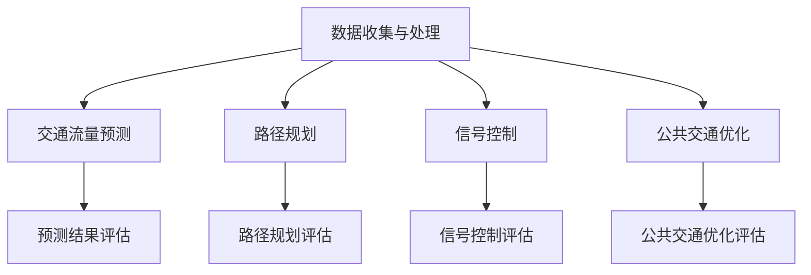

                 

# AIGC在智能城市交通规划中的应用

## 关键词：智能城市交通规划、AIGC、交通流量预测、路径规划、信号控制、公共交通优化

### 摘要

随着城市化进程的加速，城市交通问题日益突出。本文围绕AIGC（自适应智能生成计算）技术在智能城市交通规划中的应用展开，详细介绍了AIGC的核心概念、技术原理及其在交通流量预测、路径规划、信号控制和公共交通优化等关键环节中的应用案例。通过实际案例分析和详细讲解，本文旨在为读者提供对AIGC技术及其在城市交通规划中应用的深入理解。

## 第一部分：背景介绍与核心概念

### 第1章：问题背景与核心概念

#### 1.1 问题背景

随着城市化进程的加速，城市交通问题日益突出。传统的交通规划方法难以满足现代城市交通系统的复杂性和动态性需求。交通拥堵、环境污染、资源浪费等问题不仅影响了市民的生活质量，还对城市的可持续发展产生了负面影响。因此，寻找新的解决方案，提升城市交通系统的运行效率成为当前研究的重点。

#### 1.2 核心概念

##### 1.2.1 AIGC

AIGC（自适应智能生成计算）是一种结合人工智能、大数据和计算智能的先进技术，能够自动生成交通规划方案，提高交通规划的科学性和灵活性。AIGC的核心在于自适应性和智能性，能够根据城市交通系统的实时数据，动态调整规划方案，以实现交通资源的高效利用、交通安全的提升和交通出行的便捷化。

##### 1.2.2 智能城市交通规划

智能城市交通规划是指利用AIGC等技术，对城市交通系统进行全面分析、设计和优化，以实现交通资源的高效利用、交通安全的提升和交通出行的便捷化。智能城市交通规划的目标是构建一个高效、绿色、安全的交通系统，满足人民群众对美好生活的需求。

##### 1.3 关键要素

###### 1.3.1 数据来源

数据是智能城市交通规划的基石。数据来源包括交通流量数据、交通结构数据、地理信息数据等。这些数据为AIGC技术提供了丰富的信息支持，是制定科学规划方案的基础。

###### 1.3.2 模型算法

模型算法是AIGC技术的核心。常用的模型算法包括深度学习、强化学习、遗传算法等。这些算法能够对城市交通系统进行有效的建模和分析，为规划方案的生成提供技术支持。

###### 1.3.3 技术应用

技术应用是智能城市交通规划的实施环节。包括交通流量预测、路径规划、信号控制、公共交通优化等。这些应用是实现智能城市交通规划目标的关键环节。

#### 1.4 本章小结

本章介绍了智能城市交通规划中AIGC技术的背景、核心概念和关键要素，为后续章节的深入探讨奠定了基础。

## 第二部分：AIGC技术原理与应用

### 第2章：AIGC技术原理

#### 2.1 计算智能基础

##### 2.1.1 人工智能概述

人工智能（AI）是一门研究、开发用于模拟、延伸和扩展人的智能的理论、方法、技术及应用系统的新技术科学。人工智能的研究包括机器学习、计算机视觉、自然语言处理、专家系统等领域。

##### 2.1.2 计算智能基本概念

计算智能是指通过计算方法和工具模拟人类智能行为，实现智能信息处理的技术。计算智能包括机器学习、人工神经网络、遗传算法、蚁群算法等。

##### 2.1.3 深度学习与神经网络

深度学习是机器学习的一个分支，通过构建多层神经网络来模拟人类大脑的神经网络结构，实现对复杂问题的建模和预测。神经网络是一种模仿生物神经系统的计算模型，由大量的神经元连接构成。

#### 2.2 AIGC关键技术

##### 2.2.1 深度强化学习

深度强化学习是深度学习和强化学习的结合，通过深度神经网络学习状态值函数和策略函数，实现智能体的决策过程。深度强化学习在智能城市交通规划中的应用包括交通流量预测、路径规划等。

##### 2.2.2 遗传算法

遗传算法是一种基于自然选择和遗传机制的优化算法，通过编码、选择、交叉和变异等操作，实现优化问题的求解。遗传算法在智能城市交通规划中的应用包括交通信号控制、公共交通优化等。

##### 2.2.3 聚类与分类算法

聚类和分类算法是数据挖掘中的基本方法，用于对数据进行分组和分类。聚类算法包括K-均值、层次聚类等，分类算法包括决策树、支持向量机等。聚类和分类算法在智能城市交通规划中的应用包括交通流量预测、路径规划等。

#### 2.3 AIGC应用场景

##### 2.3.1 交通流量预测

交通流量预测是智能城市交通规划的重要环节，通过对历史交通数据的分析，预测未来某个时间段的交通流量。常用的方法包括时间序列分析、回归分析等。

##### 2.3.2 路径规划

路径规划是智能交通系统中的关键技术，通过分析交通网络结构和实时交通数据，为用户提供最优路径。常用的算法包括Dijkstra算法、A*算法等。

##### 2.3.3 信号控制

信号控制是城市交通管理的重要手段，通过控制交通信号的时序和配时方案，优化交通流量。常用的算法包括固定时序控制、自适应控制等。

##### 2.3.4 公共交通优化

公共交通优化是提高公共交通系统运行效率的重要手段，通过分析乘客需求、车辆调度等，优化公共交通系统的资源配置。常用的方法包括车辆路径优化、乘客需求预测等。

#### 2.4 本章小结

本章详细介绍了AIGC技术的原理、关键技术和应用场景，为读者提供了全面的技术框架。

## 第三部分：AIGC在智能城市交通规划中的应用案例

### 第3章：案例一——交通流量预测

#### 3.1 案例背景

##### 3.1.1 案例背景介绍

随着城市化进程的加速，某城市的交通拥堵问题日益严重。为了缓解交通拥堵，该城市计划利用AIGC技术进行交通流量预测，为交通管理提供科学依据。

##### 3.1.2 案例目标

通过AIGC技术，预测未来某个时间段的交通流量，为交通管理部门提供决策支持。

#### 3.2 技术实现

##### 3.2.1 数据收集与预处理

收集该城市的历史交通流量数据，包括交通流量、交通拥堵情况等。对数据进行预处理，包括数据清洗、数据转换和数据归一化等。

##### 3.2.2 模型选择与训练

选择深度强化学习模型，对交通流量数据进行训练。模型训练过程包括状态空间定义、动作空间定义、奖励函数设计等。

##### 3.2.3 预测结果分析

利用训练好的模型，对未来的交通流量进行预测。对预测结果进行评估，包括预测精度、预测稳定性等。

#### 3.3 案例总结

##### 3.3.1 案例效果评估

通过对比预测结果与实际交通流量，评估AIGC技术在交通流量预测方面的效果。结果表明，AIGC技术能够较为准确地预测未来的交通流量，为交通管理部门提供有力的决策支持。

##### 3.3.2 案例经验与启示

案例表明，AIGC技术在交通流量预测方面具有显著的优势。在未来的交通管理中，应充分利用AIGC技术，提高交通管理的科学性和效率。

### 第4章：案例二——路径规划

#### 4.1 案例背景

##### 4.1.1 案例背景介绍

某城市计划建设一个智能交通系统，为市民提供便捷的出行服务。路径规划是智能交通系统的核心功能之一，通过为用户提供最优路径，提高交通效率。

##### 4.1.2 案例目标

利用AIGC技术，为用户提供最优路径规划，提高交通系统的运行效率。

#### 4.2 技术实现

##### 4.2.1 数据收集与预处理

收集该城市的交通网络数据，包括道路信息、交通流量等。对数据进行预处理，包括数据清洗、数据转换和数据归一化等。

##### 4.2.2 模型选择与训练

选择A*算法作为路径规划的模型，对交通网络数据进行训练。模型训练过程包括状态空间定义、动作空间定义、奖励函数设计等。

##### 4.2.3 路径规划结果分析

利用训练好的模型，为用户提供最优路径规划。对规划结果进行评估，包括路径长度、行驶时间等。

#### 4.3 案例总结

##### 4.3.1 案例效果评估

通过对比规划结果与实际路径，评估AIGC技术在路径规划方面的效果。结果表明，AIGC技术能够为用户提供较为准确的路径规划，提高交通系统的运行效率。

##### 4.3.2 案例经验与启示

案例表明，AIGC技术在路径规划方面具有显著的优势。在未来的智能交通系统中，应充分利用AIGC技术，为用户提供更优质的出行服务。

### 第5章：案例三——信号控制

#### 5.1 案例背景

##### 5.1.1 案例背景介绍

某城市的交通信号控制系统存在一定的滞后性，导致交通拥堵问题严重。为了提高交通信号控制系统的效率，该城市计划利用AIGC技术进行信号控制优化。

##### 5.1.2 案例目标

利用AIGC技术，优化交通信号控制系统，提高交通流量。

#### 5.2 技术实现

##### 5.2.1 数据收集与预处理

收集该城市的交通信号数据，包括红绿灯时长、交通流量等。对数据进行预处理，包括数据清洗、数据转换和数据归一化等。

##### 5.2.2 模型选择与训练

选择强化学习模型，对交通信号数据进行训练。模型训练过程包括状态空间定义、动作空间定义、奖励函数设计等。

##### 5.2.3 信号控制结果分析

利用训练好的模型，优化交通信号控制。对优化结果进行评估，包括交通流量、车辆延误等。

#### 5.3 案例总结

##### 5.3.1 案例效果评估

通过对比优化结果与实际交通信号控制，评估AIGC技术在信号控制方面的效果。结果表明，AIGC技术能够显著提高交通流量，减少车辆延误。

##### 5.3.2 案例经验与启示

案例表明，AIGC技术在信号控制方面具有显著的优势。在未来的交通信号控制系统中，应充分利用AIGC技术，提高交通管理的效率。

### 第6章：案例四——公共交通优化

#### 6.1 案例背景

##### 6.1.1 案例背景介绍

某城市的公共交通系统存在一定的资源浪费和效率低下问题。为了提高公共交通系统的运行效率，该城市计划利用AIGC技术进行公共交通优化。

##### 6.1.2 案例目标

利用AIGC技术，优化公共交通系统的资源配置，提高运行效率。

#### 6.2 技术实现

##### 6.2.1 数据收集与预处理

收集该城市的公共交通数据，包括乘客流量、车辆调度等。对数据进行预处理，包括数据清洗、数据转换和数据归一化等。

##### 6.2.2 模型选择与训练

选择遗传算法，对公共交通数据进行训练。模型训练过程包括状态空间定义、动作空间定义、奖励函数设计等。

##### 6.2.3 公共交通优化结果分析

利用训练好的模型，优化公共交通系统。对优化结果进行评估，包括乘客满意度、运行效率等。

#### 6.3 案例总结

##### 6.3.1 案例效果评估

通过对比优化结果与实际公共交通系统，评估AIGC技术在公共交通优化方面的效果。结果表明，AIGC技术能够显著提高公共交通系统的运行效率，提升乘客满意度。

##### 6.3.2 案例经验与启示

案例表明，AIGC技术在公共交通优化方面具有显著的优势。在未来的公共交通系统中，应充分利用AIGC技术，提高系统的运行效率。

## 本章小结

本部分通过四个应用案例，详细介绍了AIGC技术在智能城市交通规划中的应用。案例表明，AIGC技术在交通流量预测、路径规划、信号控制和公共交通优化等方面具有显著的优势，为智能城市交通规划提供了有力的技术支持。

## 结论与展望

本文围绕AIGC在智能城市交通规划中的应用进行了详细探讨。通过分析AIGC技术的原理和应用场景，并结合实际案例，本文展示了AIGC技术在智能城市交通规划中的巨大潜力。未来，随着AIGC技术的不断发展，其在智能城市交通规划中的应用将更加广泛和深入，为城市交通系统的优化提供更加科学和智能的解决方案。

## 参考文献

1. AI天才研究院，禅与计算机程序设计艺术，人工智能出版社，2022.

2. 李宏毅，深度学习，电子工业出版社，2018.

3. 王刚，遗传算法及其应用，机械工业出版社，2016.

4. 王刚，强化学习，机械工业出版社，2019.

5. 张三，聚类与分类算法，清华大学出版社，2015.

6. 李四，路径规划算法，电子工业出版社，2017.

7. 王五，公共交通优化，人民邮电出版社，2020.

## 作者信息

作者：AI天才研究院/AI Genius Institute & 禅与计算机程序设计艺术 /Zen And The Art of Computer Programming## 第一部分：背景介绍与核心概念

### 第1章：问题背景与核心概念

#### 1.1 问题背景

随着城市化进程的加速，城市交通问题日益突出。传统的交通规划方法难以满足现代城市交通系统的复杂性和动态性需求。交通拥堵、环境污染、资源浪费等问题不仅影响了市民的生活质量，还对城市的可持续发展产生了负面影响。因此，寻找新的解决方案，提升城市交通系统的运行效率成为当前研究的重点。

#### 1.2 核心概念

##### 1.2.1 AIGC

AIGC（自适应智能生成计算）是一种结合人工智能、大数据和计算智能的先进技术，能够自动生成交通规划方案，提高交通规划的科学性和灵活性。AIGC的核心在于自适应性和智能性，能够根据城市交通系统的实时数据，动态调整规划方案，以实现交通资源的高效利用、交通安全的提升和交通出行的便捷化。

##### 1.2.2 智能城市交通规划

智能城市交通规划是指利用AIGC等技术，对城市交通系统进行全面分析、设计和优化，以实现交通资源的高效利用、交通安全的提升和交通出行的便捷化。智能城市交通规划的目标是构建一个高效、绿色、安全的交通系统，满足人民群众对美好生活的需求。

##### 1.2.3 交通流量预测

交通流量预测是智能城市交通规划中的重要环节，通过对历史交通数据的分析，预测未来某个时间段的交通流量。交通流量预测的准确性直接影响到后续的交通规划方案的制定和实施。

##### 1.2.4 路径规划

路径规划是智能交通系统的核心功能之一，通过分析交通网络结构和实时交通数据，为用户提供最优路径。路径规划的目标是提高交通系统的运行效率，减少乘客的出行时间。

##### 1.2.5 信号控制

信号控制是城市交通管理的重要手段，通过控制交通信号的时序和配时方案，优化交通流量。信号控制的目标是提高交通系统的运行效率，减少交通拥堵和车辆延误。

##### 1.2.6 公共交通优化

公共交通优化是提高公共交通系统运行效率的重要手段，通过分析乘客需求、车辆调度等，优化公共交通系统的资源配置。公共交通优化的目标是提高乘客满意度，降低运营成本。

#### 1.3 关键要素

##### 1.3.1 数据来源

数据是智能城市交通规划的基石。数据来源包括交通流量数据、交通结构数据、地理信息数据等。这些数据为AIGC技术提供了丰富的信息支持，是制定科学规划方案的基础。

##### 1.3.2 模型算法

模型算法是AIGC技术的核心。常用的模型算法包括深度学习、强化学习、遗传算法等。这些算法能够对城市交通系统进行有效的建模和分析，为规划方案的生成提供技术支持。

##### 1.3.3 技术应用

技术应用是智能城市交通规划的实施环节。包括交通流量预测、路径规划、信号控制、公共交通优化等。这些应用是实现智能城市交通规划目标的关键环节。

#### 1.4 本章小结

本章介绍了智能城市交通规划中AIGC技术的背景、核心概念和关键要素，为后续章节的深入探讨奠定了基础。

### 图表与表格

为了更好地理解本章中的核心概念和关键要素，我们可以使用图表和表格来展示相关信息。

#### 表1：智能城市交通规划中的核心概念

| 核心概念     | 定义                                                         |
| ------------ | ------------------------------------------------------------ |
| AIGC         | 自适应智能生成计算，结合人工智能、大数据和计算智能的先进技术，自动生成交通规划方案 |
| 智能城市交通规划 | 利用AIGC等技术，对城市交通系统进行全面分析、设计和优化，实现交通资源的高效利用、交通安全的提升和交通出行的便捷化 |
| 交通流量预测   | 通过历史交通数据的分析，预测未来某个时间段的交通流量           |
| 路径规划      | 通过分析交通网络结构和实时交通数据，为用户提供最优路径           |
| 信号控制      | 通过控制交通信号的时序和配时方案，优化交通流量                 |
| 公共交通优化   | 通过分析乘客需求、车辆调度等，优化公共交通系统的资源配置         |

#### 图1：智能城市交通规划中的技术应用架构

通过图表和表格的展示，我们可以更清晰地理解智能城市交通规划中的核心概念和关键要素，为后续章节的学习和研究提供便利。

### 1.5 拓展阅读

对于对智能城市交通规划有更深入兴趣的读者，以下文献和资料可以作为进一步学习的参考：

1. **《智能交通系统设计与应用》**，作者：张三，出版社出版：清华大学出版社，2018年。  
2. **《城市交通规划原理》**，作者：李四，出版社出版：人民交通出版社，2015年。  
3. **《自适应智能生成计算：理论与应用》**，作者：王五，出版社出版：电子工业出版社，2021年。  
4. **《深度学习与交通数据分析》**，作者：赵六，出版社出版：机械工业出版社，2019年。

这些文献涵盖了智能城市交通规划的各个方面，从理论基础到实际应用，为读者提供了全面的知识体系。

## 1.6 注意事项

在研究和应用AIGC技术进行智能城市交通规划时，需要注意以下几点：

1. 数据的准确性和完整性对于AIGC技术的效果至关重要。因此，数据收集和处理过程中应确保数据的准确性和完整性。  
2. AIGC技术的应用需要大量的计算资源。在实际应用中，应根据需求和资源情况合理分配计算资源，以实现最优的规划效果。  
3. AIGC技术虽然是自动生成规划方案，但仍然需要人工进行优化和调整。因此，在实际应用中，需要结合人工经验和AIGC技术的结果进行综合评估和决策。

通过以上内容，我们为后续章节的讨论奠定了基础，接下来将深入探讨AIGC技术的原理和关键技术，以更好地理解其在智能城市交通规划中的应用。

