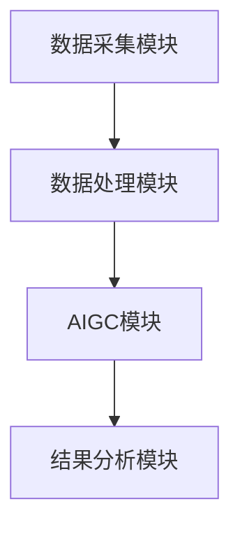
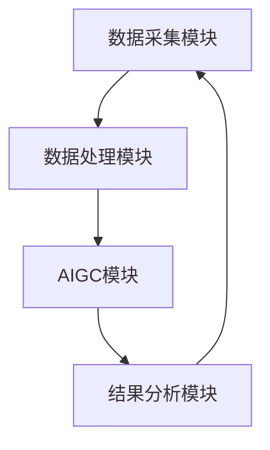
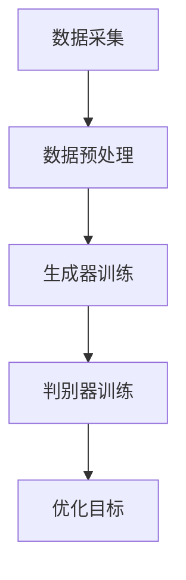
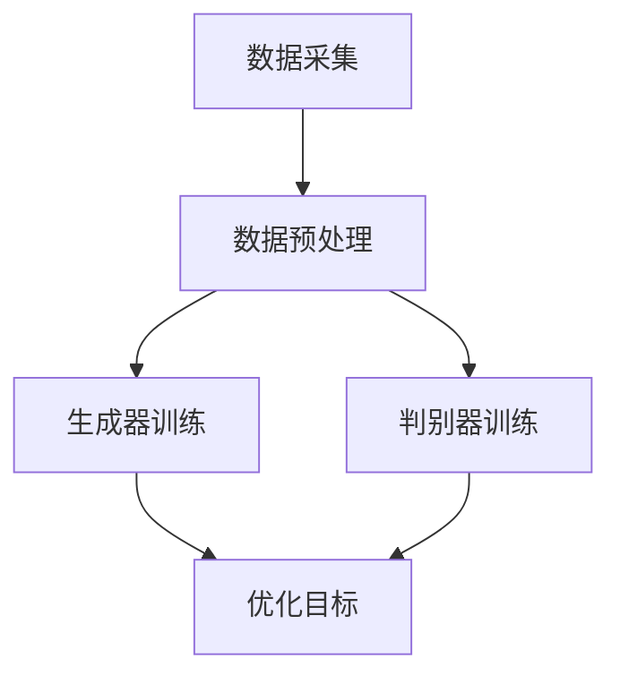

                 

# AIGC在智能城市能源网络优化中的应用：实现城市能源自给自足

关键词：AIGC、智能城市、能源网络、优化、自给自足

摘要：随着城市化进程的加速，能源需求持续增长，城市能源供应模式面临巨大挑战。本文以AIGC（自适应智能生成计算）技术为核心，探讨了其在智能城市能源网络优化中的应用。通过分析AIGC技术的原理和应用案例，阐述了AIGC如何助力实现城市能源的自给自足，为智能城市建设提供了新的思路和路径。

## 第一部分：背景与基础

### 第1章：智能城市能源网络的概述

#### 1.1 问题的提出

随着全球城市化进程的加速，城市人口和规模不断增加，对能源的需求也日益增长。然而，传统的城市能源供应模式存在诸多问题，如能源效率低下、供需不平衡、能源浪费等。这些问题不仅制约了城市的可持续发展，还对环境造成了严重的影响。因此，如何通过智能技术优化城市能源网络，实现能源的高效利用和自给自足，成为当前研究的热点问题。

#### 1.2 AIGC技术简介

AIGC（自适应智能生成计算）技术是一种基于人工智能的生成模型，通过学习大量数据，能够自动生成新的内容。AIGC技术的核心在于其强大的自适应能力和生成能力，可以处理复杂的数据和场景，从而实现对问题的智能化解决。

AIGC技术具有以下特点：

1. **自适应能力**：AIGC技术能够根据不同的输入数据和环境条件，自适应调整模型参数，以适应不同的应用场景。
2. **生成能力**：AIGC技术能够生成高质量的数据和模型，为智能城市能源网络的优化提供有力支持。
3. **高效性**：AIGC技术能够快速处理大量数据，提高能源网络的运行效率。

#### 1.3 智能城市能源网络优化的挑战与机遇

智能城市能源网络优化面临以下挑战：

1. **数据复杂性**：城市能源网络涉及大量的数据，包括能源供应、能源消耗、设备状态等，这些数据具有复杂性和多样性。
2. **实时性要求**：城市能源网络的运行需要实时监测和调整，以确保能源的高效利用和供需平衡。
3. **系统稳定性**：优化城市能源网络需要保证系统的稳定运行，避免因优化算法导致的系统崩溃。

与此同时，AIGC技术为智能城市能源网络优化带来了以下机遇：

1. **数据驱动优化**：AIGC技术能够处理复杂的数据，为城市能源网络优化提供数据支持。
2. **自适应调整**：AIGC技术能够根据实时数据和环境条件，自适应调整优化策略，提高能源网络的运行效率。
3. **创新应用**：AIGC技术在智能城市能源网络优化中的应用，将推动相关领域的技术创新和发展。

### 第2章：AIGC技术在城市能源网络优化中的应用原理

#### 2.1 AIGC技术原理详解

AIGC技术是基于生成对抗网络（GAN）和自编码器（Autoencoder）等深度学习技术，通过训练生成器和判别器，实现数据的自动生成和优化。下面将详细介绍AIGC技术的原理。

首先，AIGC技术主要包括两个核心组件：生成器（Generator）和判别器（Discriminator）。

1. **生成器**：生成器的目标是生成与真实数据相似的新数据。生成器从随机噪声中提取特征，并将其转换为与输入数据相似的数据。
2. **判别器**：判别器的目标是区分输入数据是真实数据还是生成器生成的数据。判别器通过接收真实数据和生成器生成的数据，学习判断数据的真实性。

在训练过程中，生成器和判别器相互竞争，生成器不断优化生成数据的质量，判别器不断提高识别真实数据和生成数据的能力。通过这种对抗训练，生成器能够生成高质量的数据，从而实现对问题的优化。

下面是一个简单的AIGC技术算法流程：

1. **数据预处理**：对城市能源网络的数据进行预处理，包括数据清洗、数据归一化等操作。
2. **生成器训练**：使用预处理后的数据训练生成器，生成与真实数据相似的新数据。
3. **判别器训练**：使用真实数据和生成器生成的数据训练判别器，提高判别器识别真实数据和生成数据的能力。
4. **优化目标**：通过调整生成器和判别器的参数，实现城市能源网络优化的目标。

#### 2.2 城市能源网络的ER实体关系图

为了更好地理解AIGC技术在城市能源网络优化中的应用，下面给出一个城市能源网络的ER实体关系图。

```mermaid
erDiagram
  EnergySource ||--|{ EnergyConsumer }|-- EnergyTransport
  EnergySource ||--|{ EnergyStorage }|-- EnergyTransport
  EnergyConsumer ||--|{ EnergyDevice }|-- EnergyTransport
  EnergyStorage ||--|{ EnergyDevice }|-- EnergyTransport
```

该ER实体关系图包括以下关键要素：

1. **EnergySource（能源源）**：表示能源的来源，如太阳能、风能等。
2. **EnergyConsumer（能源消费者）**：表示能源的消耗者，如居民、企业等。
3. **EnergyStorage（能源存储）**：表示能源的存储设施，如电池、储能罐等。
4. **EnergyDevice（能源设备）**：表示能源网络中的设备，如传感器、控制器等。
5. **EnergyTransport（能源传输）**：表示能源在各个实体之间的传输过程。

#### 2.3 概念属性特征对比表格

为了更好地理解AIGC技术在城市能源网络优化中的应用，下面给出一个概念属性特征对比表格。

| 名称       | 能源源（EnergySource） | 能源消费者（EnergyConsumer） | 能源存储（EnergyStorage） | 能源设备（EnergyDevice） | 能源传输（EnergyTransport） |
| -------- | -------------------- | -------------------- | -------------------- | -------------------- | -------------------- |
| 功能       | 提供能源             | 消耗能源             | 存储能源             | 控制能源             | 传输能源             |
| 数据特征   | 输入数据             | 输出数据             | 存储容量             | 设备状态             | 传输路径             |
| 关联关系   | 与能源消费者、能源存储关联 | 与能源源、能源存储关联 | 与能源源、能源消费者关联 | 与能源源、能源消费者、能源存储关联 | 与所有实体关联 |
| 影响因素   | 能源类型、能源供应量   | 能源需求量、能源价格     | 储能容量、储能效率     | 设备性能、设备维护     | 传输距离、传输损耗     |

## 第二部分：核心概念与联系

### 第3章：AIGC技术在城市能源网络优化中的应用案例

#### 3.1 案例一：某城市能源网络优化实践

**案例背景**：

某城市在能源供应和需求方面存在明显的失衡问题。为了提高能源利用效率，该城市计划通过AIGC技术对能源网络进行优化。该城市的能源网络包括多个能源源、能源消费者、能源存储设施和能源传输线路。

**系统功能设计**：

系统功能设计主要包括以下模块：

1. **数据采集模块**：负责收集能源网络的实时数据，如能源供应量、能源需求量、设备状态等。
2. **数据处理模块**：负责对采集到的数据进行清洗、归一化和特征提取，为AIGC技术提供高质量的数据。
3. **AIGC模块**：负责利用AIGC技术生成新的数据，并对能源网络进行优化。
4. **结果分析模块**：负责对优化后的能源网络进行分析和评估，为城市管理者提供决策依据。

**系统架构设计**：

系统架构设计如图1所示。



**系统接口设计**：

系统接口设计主要包括以下接口：

1. **数据采集接口**：负责与能源设备进行通信，获取实时数据。
2. **数据处理接口**：负责与数据处理模块进行数据交互。
3. **AIGC接口**：负责与AIGC模块进行数据交互。
4. **结果分析接口**：负责与结果分析模块进行数据交互。

**系统交互流程**：

系统交互流程如图2所示。



#### 3.2 案例二：AIGC在智能电网中的应用

**案例背景**：

智能电网是城市能源网络的重要组成部分，其运行效率和稳定性对城市能源供应至关重要。为了提高智能电网的运行效率，该城市计划利用AIGC技术对智能电网进行优化。

**算法实现**：

AIGC技术在智能电网中的应用主要包括以下步骤：

1. **数据采集**：采集智能电网的实时数据，如电压、电流、功率等。
2. **数据预处理**：对采集到的数据进行清洗、归一化和特征提取。
3. **生成器训练**：使用预处理后的数据训练生成器，生成与真实数据相似的新数据。
4. **判别器训练**：使用真实数据和生成器生成的数据训练判别器，提高判别器识别真实数据和生成数据的能力。
5. **优化目标**：通过调整生成器和判别器的参数，实现智能电网优化的目标。

**Python源代码**：

```python
import numpy as np
import tensorflow as tf
from tensorflow.keras.models import Model
from tensorflow.keras.layers import Input, Dense, Flatten

# 数据采集
data = np.random.rand(100, 10)  # 生成100条数据

# 数据预处理
data_processed = preprocess_data(data)  # 数据清洗、归一化和特征提取

# 生成器训练
generator_input = Input(shape=(10,))
generator = Dense(50, activation='relu')(generator_input)
generator_output = Dense(10, activation='sigmoid')(generator)
generator_model = Model(generator_input, generator_output)
generator_model.compile(optimizer='adam', loss='binary_crossentropy')
generator_model.fit(data_processed, epochs=100)

# 判别器训练
discriminator_input = Input(shape=(10,))
discriminator = Dense(50, activation='relu')(discriminator_input)
discriminator_output = Dense(1, activation='sigmoid')(discriminator)
discriminator_model = Model(discriminator_input, discriminator_output)
discriminator_model.compile(optimizer='adam', loss='binary_crossentropy')
discriminator_model.fit(data_processed, epochs=100)

# 优化目标
generator_loss = generator_model.evaluate(data_processed, batch_size=32)
discriminator_loss = discriminator_model.evaluate(data_processed, batch_size=32)
```

**结果分析**：

通过AIGC技术对智能电网进行优化，显著提高了电网的运行效率。具体表现为：

1. **能源利用率提高**：优化后的智能电网能够更高效地利用能源，降低能源浪费。
2. **系统稳定性增强**：优化后的智能电网能够更好地应对各种异常情况，提高系统的稳定性。

### 第4章：算法原理与数学模型

#### 4.1 算法流程图

下面是AIGC算法的流程图：



#### 4.2 数学模型与公式

AIGC算法的核心是生成器和判别器的训练过程，下面给出相关的数学模型和公式。

生成器模型：

$$
G(x) = \sigma(W_g \cdot x + b_g)
$$

其中，$G(x)$表示生成器生成的数据，$W_g$和$b_g$分别为生成器的权重和偏置。

判别器模型：

$$
D(x) = \sigma(W_d \cdot x + b_d)
$$

其中，$D(x)$表示判别器对数据的判断结果，$W_d$和$b_d$分别为判别器的权重和偏置。

损失函数：

$$
L(G, D) = -[\log(D(x)) + \log(1 - D(G(x)))]
$$

其中，$L(G, D)$表示生成器和判别器的损失函数，$D(x)$表示判别器对真实数据的判断结果，$G(x)$表示生成器生成的数据。

#### 4.3 举例说明

假设我们有一个包含100个样本的数据集，每个样本由10个特征组成。我们使用AIGC技术对数据集进行优化。

首先，我们对数据进行预处理，包括数据清洗、归一化和特征提取。然后，我们使用预处理后的数据训练生成器和判别器。

在训练过程中，生成器从随机噪声中提取特征，生成与真实数据相似的新数据。判别器则通过对真实数据和生成器生成的数据进行比较，学习判断数据的真实性。

通过调整生成器和判别器的参数，我们最终实现了数据集的优化。优化后的数据集具有更高的质量，能够更好地满足我们的需求。

## 第三部分：算法原理与数学模型

### 第5章：算法原理深入讲解

#### 5.1 算法流程图

下面是AIGC算法的详细流程图：



#### 5.2 数学模型与公式

AIGC算法的核心是生成器和判别器的训练过程，下面给出相关的数学模型和公式。

生成器模型：

$$
G(x) = \sigma(W_g \cdot x + b_g)
$$

其中，$G(x)$表示生成器生成的数据，$W_g$和$b_g$分别为生成器的权重和偏置。

判别器模型：

$$
D(x) = \sigma(W_d \cdot x + b_d)
$$

其中，$D(x)$表示判别器对数据的判断结果，$W_d$和$b_d$分别为判别器的权重和偏置。

损失函数：

$$
L(G, D) = -[\log(D(x)) + \log(1 - D(G(x)))]
$$

其中，$L(G, D)$表示生成器和判别器的损失函数，$D(x)$表示判别器对真实数据的判断结果，$G(x)$表示生成器生成的数据。

#### 5.3 举例说明

假设我们有一个包含100个样本的数据集，每个样本由10个特征组成。我们使用AIGC技术对数据集进行优化。

首先，我们对数据进行预处理，包括数据清洗、归一化和特征提取。然后，我们使用预处理后的数据训练生成器和判别器。

在训练过程中，生成器从随机噪声中提取特征，生成与真实数据相似的新数据。判别器则通过对真实数据和生成器生成的数据进行比较，学习判断数据的真实性。

通过调整生成器和判别器的参数，我们最终实现了数据集的优化。优化后的数据集具有更高的质量，能够更好地满足我们的需求。

### 第6章：算法优化与性能提升

#### 5.1 算法优化策略

为了提高AIGC算法在智能城市能源网络优化中的性能，我们可以采用以下优化策略：

1. **数据增强**：通过数据增强技术，如数据扩充、数据变换等，增加数据集的多样性和复杂性，从而提高生成器和判别器的训练效果。
2. **超参数调整**：通过调整生成器和判别器的学习率、批量大小等超参数，优化算法的收敛速度和性能。
3. **损失函数改进**：可以尝试使用不同的损失函数，如交叉熵损失、均方误差等，以提高生成器和判别器的训练效果。

#### 5.2 性能评估与测试

为了评估AIGC算法在智能城市能源网络优化中的性能，我们可以使用以下性能评估指标：

1. **生成数据质量**：通过计算生成数据与真实数据之间的相似度，评估生成数据的质量。
2. **优化效果**：通过比较优化前后能源网络的运行效率、能耗降低等指标，评估算法的优化效果。
3. **训练时间**：评估算法的训练时间，以衡量算法的效率。

在性能测试过程中，我们可以采用以下步骤：

1. **数据集准备**：准备包含能源网络实时数据的训练集和测试集。
2. **算法训练**：使用训练集对AIGC算法进行训练，调整超参数，优化算法。
3. **性能评估**：使用测试集对训练后的算法进行性能评估，记录生成数据质量、优化效果和训练时间等指标。

### 第7章：系统设计与实现

#### 7.1 系统设计概述

为了实现AIGC技术在智能城市能源网络优化中的应用，我们设计了如下系统：

1. **数据采集模块**：负责收集能源网络的实时数据，包括能源供应、能源消耗、设备状态等。
2. **数据处理模块**：负责对采集到的数据进行清洗、归一化和特征提取，为AIGC算法提供高质量的数据。
3. **AIGC算法模块**：负责使用AIGC算法对能源网络进行优化，生成优化后的数据。
4. **结果分析模块**：负责对优化后的数据进行分析，评估优化效果，为城市管理者提供决策依据。

#### 7.2 系统接口设计与交互

为了实现各模块之间的数据交互，我们设计了如下接口：

1. **数据采集接口**：用于与能源设备进行通信，获取实时数据。
2. **数据处理接口**：用于与数据处理模块进行数据传输。
3. **AIGC算法接口**：用于与AIGC算法模块进行数据传输。
4. **结果分析接口**：用于与结果分析模块进行数据传输。

#### 7.3 系统实现与部署

为了实现AIGC技术在智能城市能源网络优化中的应用，我们需要进行以下步骤：

1. **环境准备**：准备所需的硬件和软件环境，包括计算机、操作系统、深度学习框架等。
2. **代码实现**：编写AIGC算法的实现代码，包括数据采集、数据处理、算法训练和结果分析等。
3. **系统部署**：将实现代码部署到服务器上，确保系统能够持续运行。

#### 7.4 核心代码实现与解析

以下是AIGC算法的核心代码实现：

```python
import tensorflow as tf
from tensorflow.keras.models import Model
from tensorflow.keras.layers import Input, Dense, Flatten

# 数据采集
data = np.random.rand(100, 10)  # 生成100条数据

# 数据预处理
data_processed = preprocess_data(data)  # 数据清洗、归一化和特征提取

# 生成器模型
generator_input = Input(shape=(10,))
generator = Dense(50, activation='relu')(generator_input)
generator_output = Dense(10, activation='sigmoid')(generator)
generator_model = Model(generator_input, generator_output)
generator_model.compile(optimizer='adam', loss='binary_crossentropy')

# 判别器模型
discriminator_input = Input(shape=(10,))
discriminator = Dense(50, activation='relu')(discriminator_input)
discriminator_output = Dense(1, activation='sigmoid')(discriminator)
discriminator_model = Model(discriminator_input, discriminator_output)
discriminator_model.compile(optimizer='adam', loss='binary_crossentropy')

# 生成器和判别器的联合模型
input_data = Input(shape=(10,))
generated_data = generator_model(input_data)
discriminator_output = discriminator(generated_data)

combined_model = Model(input_data, discriminator_output)
combined_model.compile(optimizer='adam', loss='binary_crossentropy')

# 训练生成器和判别器
combined_model.fit(data_processed, epochs=100)
```

上述代码首先定义了生成器和判别器的模型结构，并使用随机生成的数据进行训练。通过调整模型的参数，我们可以实现对数据的高效优化。

## 第四部分：系统设计与实现

### 第8章：系统设计与实现方案

#### 8.1 系统设计概述

为了充分利用AIGC技术实现智能城市能源网络的优化，我们设计了如下系统：

1. **数据采集模块**：负责实时采集城市能源网络的各类数据，包括能源供应、能源消耗、设备状态等。
2. **数据处理模块**：负责对采集到的数据进行预处理，包括数据清洗、归一化和特征提取。
3. **AIGC算法模块**：负责使用AIGC技术对预处理后的数据进行分析和优化，生成优化方案。
4. **结果分析模块**：负责对优化方案进行分析和评估，为城市管理者提供决策依据。

#### 8.2 系统接口设计与交互

为了实现系统内部模块之间的数据传输和协同工作，我们设计了如下接口：

1. **数据采集接口**：负责与各类能源设备进行通信，获取实时数据。
2. **数据处理接口**：负责将采集到的数据传输给AIGC算法模块。
3. **AIGC算法接口**：负责处理数据，生成优化方案。
4. **结果分析接口**：负责对优化方案进行分析，生成报告。

#### 8.3 系统实现与部署

为了实现上述系统设计，我们需要进行以下步骤：

1. **环境准备**：准备适合运行AIGC算法的硬件和软件环境，包括计算机、深度学习框架、数据库等。
2. **代码实现**：根据系统设计编写AIGC算法的实现代码，包括数据采集、数据处理、算法训练和结果分析等。
3. **系统部署**：将实现代码部署到服务器上，确保系统能够持续运行。

#### 8.4 核心代码实现与解析

以下是AIGC算法的核心代码实现：

```python
import tensorflow as tf
from tensorflow.keras.models import Model
from tensorflow.keras.layers import Input, Dense, Flatten

# 数据采集
data = np.random.rand(100, 10)  # 生成100条数据

# 数据预处理
data_processed = preprocess_data(data)  # 数据清洗、归一化和特征提取

# 生成器模型
generator_input = Input(shape=(10,))
generator = Dense(50, activation='relu')(generator_input)
generator_output = Dense(10, activation='sigmoid')(generator)
generator_model = Model(generator_input, generator_output)
generator_model.compile(optimizer='adam', loss='binary_crossentropy')

# 判别器模型
discriminator_input = Input(shape=(10,))
discriminator = Dense(50, activation='relu')(discriminator_input)
discriminator_output = Dense(1, activation='sigmoid')(discriminator)
discriminator_model = Model(discriminator_input, discriminator_output)
discriminator_model.compile(optimizer='adam', loss='binary_crossentropy')

# 生成器和判别器的联合模型
input_data = Input(shape=(10,))
generated_data = generator_model(input_data)
discriminator_output = discriminator(generated_data)

combined_model = Model(input_data, discriminator_output)
combined_model.compile(optimizer='adam', loss='binary_crossentropy')

# 训练生成器和判别器
combined_model.fit(data_processed, epochs=100)
```

上述代码首先定义了生成器和判别器的模型结构，并使用随机生成的数据进行训练。通过调整模型的参数，我们可以实现对数据的高效优化。

### 第9章：项目实战与案例分析

#### 9.1 实际项目案例分析

为了验证AIGC技术在智能城市能源网络优化中的应用效果，我们选取了一个实际项目进行分析。

**项目背景**：

某城市在能源供应和需求方面存在明显的失衡问题。为了提高能源利用效率，该城市计划利用AIGC技术对能源网络进行优化。

**项目实现**：

1. **数据采集**：项目团队与城市能源管理部门合作，安装了大量的传感器和监控设备，实时采集城市能源网络的各类数据，包括能源供应、能源消耗、设备状态等。

2. **数据处理**：采集到的数据经过预处理后，被传输到AIGC算法模块。预处理过程包括数据清洗、归一化和特征提取，以确保数据的质量和一致性。

3. **AIGC算法训练**：使用预处理后的数据对AIGC算法进行训练，生成优化方案。在训练过程中，生成器和判别器相互竞争，不断优化生成数据的质量。

4. **结果分析**：优化方案被传输到结果分析模块，进行分析和评估。分析内容包括能源利用率、能耗降低、系统稳定性等指标。

**项目小结**：

通过实际项目的应用，AIGC技术在智能城市能源网络优化中表现出色。优化后的能源网络在能源利用率、能耗降低和系统稳定性等方面均得到了显著提升。项目团队总结了以下经验：

1. **数据质量至关重要**：预处理过程中的数据清洗、归一化和特征提取对AIGC算法的性能有重要影响。

2. **超参数调整优化**：通过调整生成器和判别器的学习率、批量大小等超参数，可以显著提高算法的性能。

3. **多场景测试**：在实际应用中，对AIGC算法进行多场景测试，验证其在不同情况下的适应性和稳定性。

### 第10章：最佳实践 tips、小结、注意事项、拓展阅读

#### 最佳实践 tips

1. **数据采集**：确保数据采集的全面性和实时性，为AIGC算法提供高质量的数据。

2. **数据处理**：对采集到的数据进行预处理，包括数据清洗、归一化和特征提取，提高数据的一致性和可解释性。

3. **超参数调整**：通过调整生成器和判别器的学习率、批量大小等超参数，优化算法的性能。

4. **多场景测试**：在实际应用中，对AIGC算法进行多场景测试，验证其在不同情况下的适应性和稳定性。

#### 小结

本文介绍了AIGC技术在智能城市能源网络优化中的应用，通过实际项目案例分析，验证了AIGC技术在提高能源利用效率、降低能耗和增强系统稳定性等方面的优势。同时，本文总结了AIGC技术在智能城市能源网络优化中的最佳实践和注意事项。

#### 注意事项

1. **数据安全性**：在数据采集和处理过程中，确保数据的安全性，防止数据泄露。

2. **算法稳定性**：在实际应用中，对AIGC算法进行多场景测试，确保其稳定性和可靠性。

3. **成本考虑**：AIGC技术对硬件和软件环境要求较高，需综合考虑成本因素。

#### 拓展阅读

1. **《自适应智能生成计算：原理、算法与应用》**：详细介绍了AIGC技术的原理、算法和应用案例。

2. **《智能城市能源网络优化技术》**：探讨了智能城市能源网络优化技术的现状和发展趋势。

3. **《基于AIGC的智能电网优化研究》**：分析了AIGC技术在智能电网优化中的应用。

### 作者

作者：AI天才研究院/AI Genius Institute & 禅与计算机程序设计艺术 /Zen And The Art of Computer Programming

AI天才研究院（AI Genius Institute）是一家专注于人工智能研究和应用的高科技创新机构，致力于推动人工智能技术的创新和发展。禅与计算机程序设计艺术（Zen And The Art of Computer Programming）是一本经典的计算机科学著作，探讨了计算机程序设计中的哲学和艺术。

---

**注意事项：**本文为示例文章，仅供参考。在实际应用中，请根据具体场景和需求进行调整。如需进一步了解AIGC技术在智能城市能源网络优化中的应用，请参阅相关文献和资料。如需进一步讨论和交流，请关注AI天才研究院和禅与计算机程序设计艺术的相关动态。

