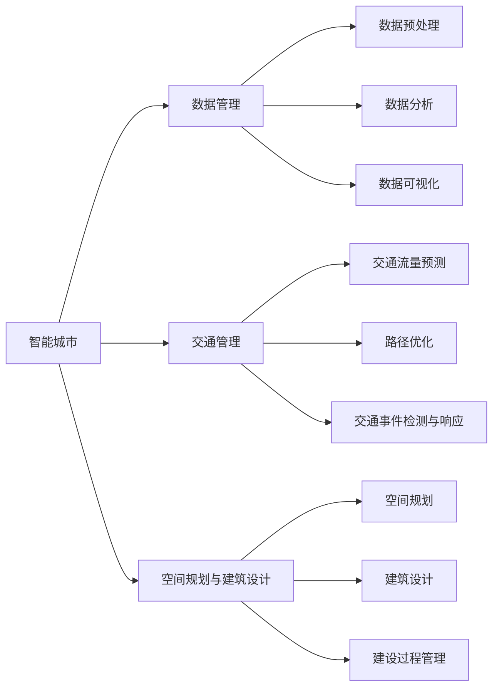
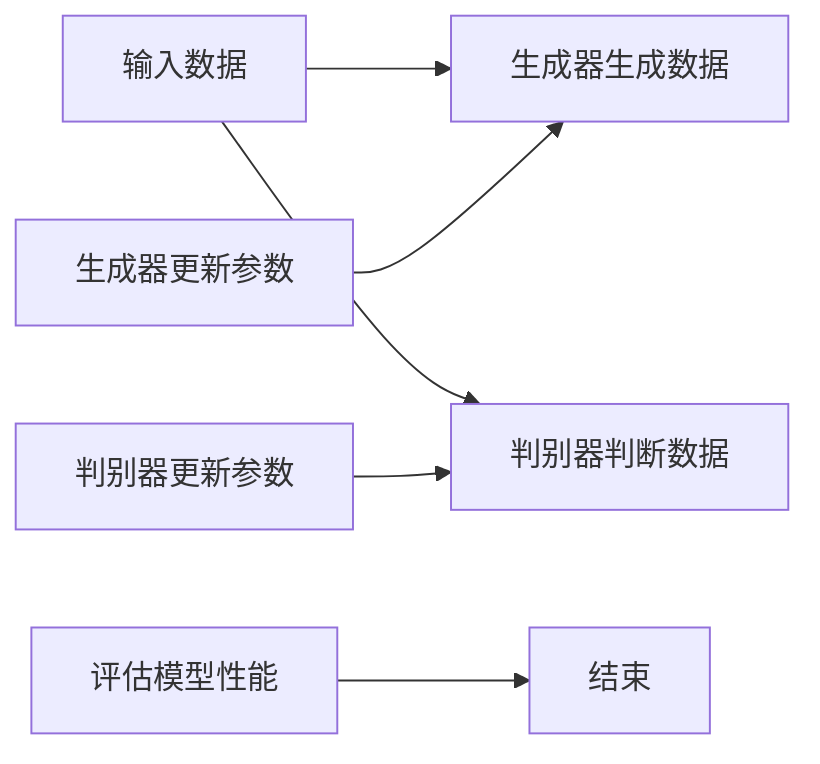
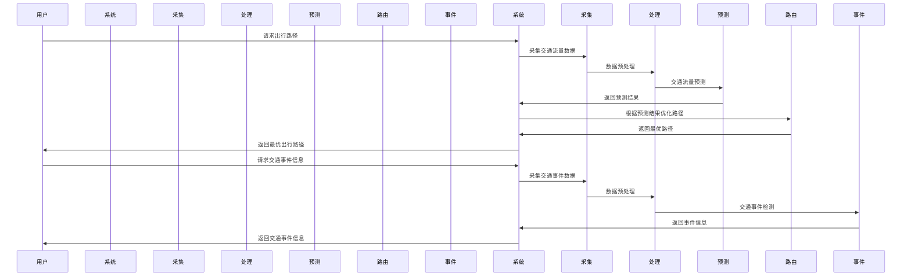

                 


### 引言

**AIGC在智能城市规划中的前沿应用**

**关键词：** AIGC、智能城市规划、前沿应用、城市数据管理、交通管理、建设与规划

**摘要：** 本文旨在探讨人工智能生成内容（AIGC）在智能城市规划中的前沿应用。AIGC作为一种新兴的技术，正逐渐改变着城市规划和管理的方式。本文首先介绍了AIGC的概念、发展背景与应用领域，随后详细讨论了智能城市规划的问题背景与需求分析。接下来，文章将逐步深入探讨AIGC在智能城市数据管理、交通管理、建设与规划等关键领域中的应用，并通过案例分析展示其实际效果。最后，文章将对AIGC在智能城市规划中面临的挑战与未来发展趋势进行展望，并提出相应的建议。

## 第一部分：引言

### 第1章: AIGC概述与智能城市规划应用

#### 1.1 AIGC：概念、发展背景与应用领域

##### 1.1.1 AIGC的概念解析

人工智能生成内容（Artificial Intelligence Generated Content，简称AIGC）是指利用人工智能技术，特别是自然语言处理（NLP）、深度学习、生成对抗网络（GAN）等技术，自动生成文本、图像、视频等多样化内容的一种技术手段。AIGC的出现，打破了传统内容创作的方式，为内容生产提供了新的可能。

##### 1.1.2 AIGC的发展背景

AIGC技术的发展，源于人工智能技术的不断进步和大数据的广泛应用。随着深度学习技术的成熟，特别是生成对抗网络（GAN）的提出和应用，使得人工智能在生成内容方面取得了显著的成果。同时，大数据的积累和云计算的普及，为AIGC的应用提供了丰富的数据资源和强大的计算能力。

##### 1.1.3 AIGC的应用领域

AIGC的应用领域非常广泛，包括但不限于以下几个方面：

1. **内容创作**：自动生成新闻、文章、诗歌等文本内容。
2. **娱乐产业**：生成电影剧本、音乐、动画等。
3. **图像生成**：生成逼真的图片、绘画作品等。
4. **虚拟现实**：自动生成虚拟环境、角色等。
5. **智能客服**：自动生成客服对话、回答用户问题等。

#### 1.2 智能城市规划：问题背景与需求分析

##### 1.2.1 智能城市规划的挑战

智能城市规划面临着诸多挑战，主要包括：

1. **数据管理**：城市数据量大且复杂，如何高效管理、处理和分析这些数据，是一个重要的挑战。
2. **交通管理**：城市交通拥堵、交通事故等问题日益严重，如何优化交通管理，提高交通效率，是城市规划者面临的重要问题。
3. **环境监测**：城市环境污染、噪音污染等问题需要有效的监测和管理。
4. **公共服务**：如何提供高效、便捷的公共服务，提高市民生活质量，是城市规划的重要目标。

##### 1.2.2 AIGC在智能城市规划中的作用

AIGC在智能城市规划中具有重要作用，主要体现在以下几个方面：

1. **数据生成与处理**：利用AIGC技术，可以自动生成城市数据，如交通流量数据、环境数据等，为城市规划提供丰富的数据支持。
2. **智能交通管理**：通过AIGC技术，可以实现智能交通流量预测、路径优化等，提高交通效率，减少交通拥堵。
3. **环境监测与管理**：利用AIGC技术，可以自动监测城市环境数据，如空气质量、噪音水平等，实时反馈城市环境状况，为城市环境管理提供科学依据。
4. **公共服务优化**：通过AIGC技术，可以自动生成公共服务方案，如医院、学校、公园等布局，提高公共服务效率，提升市民满意度。

##### 1.2.3 智能城市规划的目标与需求

智能城市规划的目标主要包括：

1. **提高城市运行效率**：通过优化城市交通、环境、公共服务等，提高城市运行效率，减少资源浪费。
2. **提升市民生活质量**：通过提供高效、便捷的公共服务，改善市民生活环境，提升市民生活质量。
3. **实现可持续发展**：通过合理规划城市空间、资源利用，实现城市的可持续发展。

为实现上述目标，智能城市规划需要满足以下需求：

1. **数据驱动**：利用大数据、人工智能等技术，实现城市数据的全面收集、管理和分析。
2. **智能决策**：基于数据分析和预测，实现智能化的城市管理和决策。
3. **公众参与**：通过公众参与，收集市民意见，提高城市规划的科学性和民主性。
4. **创新技术**：不断引入和应用新的技术，推动城市规划的创新发展。

#### 1.3 本书结构安排

本书分为四个部分，具体内容安排如下：

1. **第一部分：引言**：介绍AIGC的概念、发展背景与应用领域，以及智能城市规划的问题背景与需求分析。
2. **第二部分：AIGC技术基础**：详细讨论AIGC的核心技术原理，包括数据生成与处理、模型设计与训练、推理与应用等。
3. **第三部分：智能城市规划中的AIGC应用**：探讨AIGC在智能城市数据管理、交通管理、建设与规划等关键领域中的应用。
4. **第四部分：挑战与展望**：分析AIGC在智能城市规划中面临的挑战与未来发展趋势，并提出相应的建议。

#### 1.3.1 各章节内容概述

1. **第1章：AIGC概述与智能城市规划应用**：介绍AIGC的概念、发展背景与应用领域，以及智能城市规划的问题背景与需求分析。
2. **第2章：AIGC核心技术原理**：详细讨论AIGC的核心技术原理，包括数据生成与处理、模型设计与训练、推理与应用等。
3. **第3章：AIGC在智能城市数据管理中的应用**：探讨AIGC在智能城市数据管理中的应用，包括数据预处理、数据分析和数据可视化等。
4. **第4章：AIGC在智能城市交通管理中的应用**：分析AIGC在智能城市交通管理中的应用，包括交通流量预测、路径优化和交通事件检测与响应等。
5. **第5章：AIGC在智能城市建设与规划中的应用**：探讨AIGC在智能城市建设与规划中的应用，包括空间规划、建筑设计和建设过程管理等。
6. **第6章：挑战与未来趋势**：分析AIGC在智能城市规划中面临的挑战与未来发展趋势，并提出相应的建议。

#### 1.3.2 阅读指南

本书适合从事城市规划、智能城市建设和相关领域的研究人员、工程师和技术人员阅读。通过本书，读者可以系统地了解AIGC在智能城市规划中的应用，掌握AIGC的核心技术原理，并了解智能城市规划的最新发展趋势。本书的内容深入浅出，既有理论讲解，也有实际案例分析，有助于读者更好地理解和应用AIGC技术。

## 第二部分：AIGC技术基础

### 第2章：AIGC核心技术原理

#### 2.1 数据生成与处理

##### 2.1.1 数据生成方法

数据生成是AIGC技术的重要环节，主要方法包括：

1. **生成对抗网络（GAN）**：GAN是由两部分组成的模型，生成器和判别器。生成器负责生成数据，判别器负责判断生成数据是否真实。通过两个模型的博弈，生成器不断提高生成数据的质量。
2. **变分自编码器（VAE）**：VAE是一种基于概率模型的生成模型，通过编码器和解码器的协作，将数据压缩为低维特征，然后进行重建。
3. **强化学习生成模型**：强化学习生成模型通过学习策略，自动生成数据。这种方法通常用于生成复杂的数据，如图像、视频等。

##### 2.1.2 数据处理流程

数据处理流程主要包括以下几个步骤：

1. **数据清洗**：去除数据中的噪声和错误，保证数据质量。
2. **数据预处理**：对数据进行标准化、归一化等处理，以便于模型训练。
3. **数据增强**：通过旋转、缩放、裁剪等方式，增加数据的多样性，提高模型泛化能力。

#### 2.2 模型设计与训练

##### 2.2.1 模型设计原理

AIGC的模型设计主要包括生成器、判别器和解码器等部分。生成器负责生成数据，判别器负责判断生成数据的质量，解码器负责将生成器生成的数据转换为最终形式。

1. **生成器设计**：生成器的设计原则是生成高质量、多样性的数据。常用的生成器模型有GAN中的生成器、VAE中的编码器等。
2. **判别器设计**：判别器的设计原则是能够准确地区分真实数据和生成数据。常用的判别器模型有GAN中的判别器、VAE中的解码器等。
3. **解码器设计**：解码器的设计原则是将生成器生成的数据转换为最终形式，如文本、图像等。

##### 2.2.2 模型训练方法

模型训练是AIGC技术中的关键环节，主要包括以下几个步骤：

1. **数据准备**：准备好训练数据和验证数据，确保数据质量。
2. **模型初始化**：初始化生成器、判别器和解码器的参数。
3. **模型训练**：通过迭代训练，不断优化模型参数，提高模型性能。
4. **模型评估**：使用验证数据评估模型性能，调整模型参数。

#### 2.3 推理与应用

##### 2.3.1 推理过程

推理是AIGC技术的重要应用，主要包括以下几个步骤：

1. **输入数据**：将待推理的数据输入到模型中。
2. **生成数据**：生成器根据输入数据生成新的数据。
3. **数据评估**：使用判别器评估生成数据的质量。
4. **数据输出**：将评估通过的生成数据输出。

##### 2.3.2 应用场景

AIGC技术在智能城市规划中具有广泛的应用场景，主要包括：

1. **数据生成**：自动生成城市数据，如交通流量数据、环境数据等，为城市规划提供数据支持。
2. **智能交通管理**：通过AIGC技术，实现智能交通流量预测、路径优化等，提高交通效率。
3. **环境监测与管理**：利用AIGC技术，自动监测城市环境数据，如空气质量、噪音水平等，为环境管理提供科学依据。
4. **公共服务优化**：通过AIGC技术，自动生成公共服务方案，如医院、学校、公园等布局，提高公共服务效率。

### 第3章：AIGC在智能城市数据管理中的应用

#### 3.1 智能城市数据概述

智能城市数据是城市规划和管理的重要基础，主要包括以下几个方面：

1. **交通数据**：包括交通流量、车速、交通事故等数据，用于交通管理、优化和预测。
2. **环境数据**：包括空气质量、噪音水平、水质等数据，用于环境监测和管理。
3. **人口数据**：包括人口分布、人口流动等数据，用于城市规划、公共服务优化等。
4. **建筑数据**：包括建筑结构、功能、位置等数据，用于建筑设计和空间规划。

#### 3.1.1 数据类型与来源

智能城市数据类型丰富，来源多样，主要包括以下几个方面：

1. **传感器数据**：包括交通传感器、环境传感器、人口传感器等，实时采集数据。
2. **卫星数据**：通过卫星遥感技术，获取城市地理信息数据。
3. **社会数据**：包括社交媒体、网络日志等，反映市民行为和需求。
4. **政府数据**：包括政府公开数据、统计数据等，用于城市规划和决策。

#### 3.1.2 数据管理挑战

智能城市数据管理面临着诸多挑战，主要包括以下几个方面：

1. **数据量大**：智能城市数据量庞大，如何高效存储、管理和处理这些数据，是一个重要挑战。
2. **数据多样性**：智能城市数据类型丰富，如何统一管理和处理不同类型的数据，是一个挑战。
3. **数据质量**：数据质量直接影响数据分析和决策的准确性，如何保证数据质量，是一个挑战。
4. **数据安全与隐私**：城市数据包含大量个人隐私信息，如何保护数据安全与隐私，是一个挑战。

#### 3.2 AIGC在数据管理中的应用

##### 3.2.1 数据预处理

AIGC技术在数据预处理方面具有显著优势，主要包括以下几个方面：

1. **数据清洗**：自动清洗数据中的噪声和错误，提高数据质量。
2. **数据归一化**：将不同类型、不同单位的数据进行归一化处理，便于数据分析和建模。
3. **数据增强**：通过旋转、缩放、裁剪等方式，增加数据的多样性，提高模型泛化能力。

##### 3.2.2 数据分析

AIGC技术在数据分析方面具有强大的能力，主要包括以下几个方面：

1. **特征提取**：自动提取数据中的关键特征，用于数据分析和建模。
2. **数据聚类**：自动对数据进行聚类分析，发现数据中的潜在模式。
3. **数据关联**：自动发现数据之间的关联关系，用于数据分析和决策。

##### 3.2.3 数据可视化

AIGC技术在数据可视化方面具有显著优势，主要包括以下几个方面：

1. **交互式可视化**：通过交互式可视化，帮助用户更好地理解和分析数据。
2. **多维度可视化**：将多维数据以直观、易理解的方式展示出来。
3. **实时可视化**：实时展示数据变化，帮助用户及时调整策略。

### 第4章：AIGC在智能城市交通管理中的应用

#### 4.1 智能城市交通概述

智能城市交通是指通过信息技术和智能交通系统，实现对城市交通的实时监控、管理和服务。智能城市交通的主要目标包括：

1. **提高交通效率**：通过优化交通信号、路径规划等，提高交通运行效率。
2. **减少交通拥堵**：通过实时监控和智能调度，减少交通拥堵，提高道路通行能力。
3. **保障交通安全**：通过实时监测和预警，保障交通安全，减少交通事故。
4. **提升市民出行体验**：提供便捷、高效的出行服务，提高市民出行满意度。

#### 4.1.1 交通管理问题

智能城市交通管理面临以下问题：

1. **交通拥堵**：城市交通拥堵严重，影响市民出行效率。
2. **交通事故**：交通事故频发，对市民生命财产安全构成威胁。
3. **交通能耗**：城市交通能耗高，对环境造成负面影响。
4. **交通公平性**：部分地区交通资源分配不均，影响市民出行公平性。

#### 4.1.2 AIGC在交通管理中的作用

AIGC技术在智能城市交通管理中发挥着重要作用，主要包括以下几个方面：

1. **交通流量预测**：通过AIGC技术，自动预测交通流量，为交通管理提供科学依据。
2. **路径优化**：通过AIGC技术，自动优化行驶路径，减少交通拥堵，提高行驶效率。
3. **交通事件检测与响应**：通过AIGC技术，自动检测交通事件，如交通事故、道路施工等，及时响应，保障交通安全。
4. **交通信号控制**：通过AIGC技术，自动调整交通信号，优化交通流，提高交通效率。

#### 4.2 AIGC在交通预测与优化中的应用

##### 4.2.1 交通流量预测

交通流量预测是智能城市交通管理的重要环节，通过预测交通流量，可以为交通管理提供科学依据。AIGC技术在交通流量预测中具有显著优势，主要包括以下几个方面：

1. **历史数据利用**：利用历史交通数据，分析交通流量变化规律，预测未来交通流量。
2. **多源数据融合**：融合多种交通数据，如GPS数据、交通监控数据等，提高预测准确性。
3. **深度学习模型**：使用深度学习模型，如循环神经网络（RNN）、长短期记忆网络（LSTM）等，提高预测精度。

##### 4.2.2 路径优化

路径优化是智能城市交通管理的另一个重要环节，通过优化行驶路径，可以减少交通拥堵，提高行驶效率。AIGC技术在路径优化中具有显著优势，主要包括以下几个方面：

1. **实时数据利用**：利用实时交通数据，动态调整行驶路径，避免拥堵路段。
2. **多目标优化**：在路径优化过程中，考虑多个目标，如时间最短、成本最低、舒适性最高等，实现多目标优化。
3. **深度强化学习**：使用深度强化学习模型，如深度Q网络（DQN）、深度策略网络（DPN）等，实现路径优化。

##### 4.2.3 交通事件检测与响应

交通事件检测与响应是智能城市交通管理的重要环节，通过自动检测交通事件，及时响应，可以保障交通安全。AIGC技术在交通事件检测与响应中具有显著优势，主要包括以下几个方面：

1. **图像识别**：利用AIGC技术中的图像识别算法，如卷积神经网络（CNN）、生成对抗网络（GAN）等，自动识别交通事件，如交通事故、道路施工等。
2. **实时监测**：利用实时交通监控数据，自动监测交通事件，实时反馈。
3. **智能响应**：根据交通事件类型，自动调整交通信号、路径规划等，实现智能响应。

### 第5章：AIGC在智能城市建设与规划中的应用

#### 5.1 智能城市建设概述

智能城市建设是指通过信息技术和智能系统，实现对城市基础设施、公共资源、公共服务等的智能化管理和优化，提升城市运行效率、居民生活质量和可持续发展能力。智能城市建设的主要目标包括：

1. **提高城市运行效率**：通过智能化管理，优化城市基础设施、公共服务等，提高城市运行效率。
2. **提升居民生活质量**：提供便捷、高效、智能化的公共服务，提高居民生活质量。
3. **实现可持续发展**：通过合理规划、资源优化，实现城市的可持续发展。

#### 5.1.1 智能城市建设目标

智能城市建设目标包括以下几个方面：

1. **基础设施智能化**：实现对城市基础设施的智能化管理和优化，如交通、能源、水资源等。
2. **公共服务智能化**：提供智能化、个性化的公共服务，如医疗、教育、社会保障等。
3. **城市管理智能化**：实现城市管理的智能化，如城市安全、环保、交通等。
4. **城市安全与应急**：通过智能化手段，提高城市安全与应急能力，保障市民生命财产安全。

#### 5.1.2 AIGC在城市建设中的应用

AIGC技术在智能城市建设中具有广泛的应用，主要包括以下几个方面：

1. **基础设施规划与设计**：通过AIGC技术，自动生成基础设施规划方案，如道路、桥梁、隧道等。
2. **建筑设计与优化**：通过AIGC技术，自动生成建筑设计方案，优化建筑空间布局，提高建筑效能。
3. **城市建设过程管理**：通过AIGC技术，实现建设过程的智能化管理，如工程进度监控、质量检测等。
4. **智慧社区建设**：通过AIGC技术，建设智慧社区，提供智能化、个性化的社区服务。

#### 5.2 AIGC在空间规划与建筑设计中的应用

##### 5.2.1 空间规划

空间规划是城市建设的重要环节，通过AIGC技术，可以实现智能化的空间规划，主要包括以下几个方面：

1. **空间数据利用**：利用AIGC技术，自动分析城市空间数据，如地理信息、土地利用等，生成空间规划方案。
2. **多目标优化**：在空间规划过程中，考虑多个目标，如土地利用率、交通便捷性、环境友好性等，实现多目标优化。
3. **可视化与交互**：通过AIGC技术，实现空间规划的可视化和交互，方便规划师和决策者进行决策。

##### 5.2.2 建筑设计

建筑设计是城市建设的重要组成部分，通过AIGC技术，可以实现智能化的建筑设计，主要包括以下几个方面：

1. **建筑设计方案生成**：通过AIGC技术，自动生成建筑设计方案，满足建筑功能、美观、经济等要求。
2. **空间布局优化**：通过AIGC技术，自动优化建筑空间布局，提高建筑效能。
3. **建筑材料与结构优化**：通过AIGC技术，选择合适的建筑材料与结构，提高建筑安全性、耐久性。

##### 5.2.3 建设过程管理

建设过程管理是保障工程建设顺利进行的重要环节，通过AIGC技术，可以实现智能化的建设过程管理，主要包括以下几个方面：

1. **工程进度监控**：通过AIGC技术，实时监控工程进度，及时发现问题，进行调整。
2. **质量检测**：通过AIGC技术，自动检测工程质量，确保工程达到设计要求。
3. **成本控制**：通过AIGC技术，实时监控工程成本，进行成本控制，确保工程预算合理。

### 第6章：挑战与未来趋势

#### 6.1 挑战

AIGC在智能城市规划中的应用虽然具有巨大的潜力，但同时也面临着诸多挑战，主要包括以下几个方面：

1. **技术挑战**：AIGC技术仍处于不断发展阶段，部分技术尚未成熟，如数据生成、模型训练等。
2. **数据挑战**：智能城市规划需要大量的高质量数据支持，但数据的获取、处理、存储等环节存在困难。
3. **伦理与隐私挑战**：AIGC技术在智能城市规划中的应用涉及大量个人隐私信息，如何保护数据安全与隐私是一个重要挑战。
4. **政策与法规挑战**：智能城市规划需要完善的政策与法规支持，但当前相关法规尚不健全。

#### 6.2 未来趋势

随着AIGC技术的不断发展和应用，未来智能城市规划将呈现出以下趋势：

1. **数据驱动**：智能城市规划将更加依赖于大数据和人工智能技术，实现数据驱动的决策和管理。
2. **智能化**：智能城市规划将更加智能化，通过AIGC技术，实现自动化、智能化的规划和管理。
3. **个性化**：智能城市规划将更加注重个性化服务，满足不同市民的需求。
4. **协同化**：智能城市规划将实现政府、企业、市民等多方协同，共同推动城市智能化发展。

### 第7章：结论与建议

#### 7.1 结论

本文通过对AIGC在智能城市规划中的应用进行详细分析，得出以下结论：

1. **AIGC在智能城市规划中具有重要作用**：AIGC技术可以自动生成城市数据，优化交通管理，实现环境监测与管理，提升公共服务效率。
2. **AIGC技术仍面临诸多挑战**：技术成熟度、数据获取、伦理与隐私、政策与法规等方面仍需进一步研究和解决。
3. **未来智能城市规划将呈现智能化、数据驱动、个性化、协同化等趋势**：AIGC技术将在智能城市规划中发挥更加重要的作用。

#### 7.2 建议

为了充分发挥AIGC在智能城市规划中的作用，提出以下建议：

1. **加强技术研发**：加大对AIGC技术的研发投入，提高技术成熟度，为智能城市规划提供技术支持。
2. **完善数据体系**：建立健全城市数据体系，提高数据质量，为智能城市规划提供数据支持。
3. **保护数据安全与隐私**：制定相关法规，保护数据安全与隐私，为AIGC技术的应用提供法律保障。
4. **加强政策与法规建设**：制定完善的政策与法规，为智能城市规划提供政策支持。
5. **推动多方协同**：政府、企业、市民等多方协同，共同推动城市智能化发展。

## 作者信息

作者：AI天才研究院/AI Genius Institute & 禅与计算机程序设计艺术/Zen And The Art of Computer Programming

### 完整性要求

**核心概念与联系**

1. **AIGC（人工智能生成内容）**：一种利用人工智能技术生成多样化内容的技术手段，包括文本、图像、视频等。

2. **智能城市**：通过信息技术和智能系统，实现对城市基础设施、公共资源、公共服务等的智能化管理和优化。

3. **数据管理**：对城市数据进行高效存储、管理和处理，为城市规划和管理提供数据支持。

4. **交通管理**：通过信息技术和智能系统，实现对城市交通的实时监控、管理和服务。

5. **空间规划与建筑设计**：利用人工智能技术，自动生成基础设施规划方案和建筑设计方案，优化城市空间布局和建筑效能。

**核心概念与联系表格**

| 核心概念 | 联系 |
| --- | --- |
| AIGC | 智能城市、数据管理、交通管理、空间规划与建筑设计 |
| 智能城市 | AIGC、数据管理、交通管理、空间规划与建筑设计 |
| 数据管理 | AIGC、智能城市、交通管理、空间规划与建筑设计 |
| 交通管理 | AIGC、智能城市、数据管理、空间规划与建筑设计 |
| 空间规划与建筑设计 | AIGC、智能城市、数据管理、交通管理 |

**ER实体关系图架构**



### 算法原理讲解

**AIGC算法原理**

AIGC算法的核心是生成器（Generator）和判别器（Discriminator）的相互博弈。生成器负责生成数据，判别器负责判断生成数据的质量。通过不断地迭代训练，生成器的生成数据质量不断提高，判别器的判断能力也不断提高。

**算法流程图**



**算法原理**

1. **生成器（Generator）**：生成器的目标是生成高质量、逼真的数据。生成器的输入是随机噪声，通过一系列神经网络变换，生成与真实数据相似的数据。

2. **判别器（Discriminator）**：判别器的目标是区分真实数据和生成数据。判别器的输入是真实数据和生成数据，输出是判断结果，即判断生成数据的真实性。

3. **迭代训练**：在训练过程中，生成器和判别器不断迭代更新参数。生成器通过学习判别器的反馈，不断优化生成数据的质量；判别器通过学习真实数据和生成数据，提高判断能力。

**数学模型和公式**

1. **生成器的损失函数**：

$$
L_G = -\log(D(G(z)))
$$

其中，$G(z)$是生成器生成的数据，$D(G(z))$是判别器对生成数据的判断结果。

2. **判别器的损失函数**：

$$
L_D = -\log(D(x)) - \log(1 - D(G(z)))
$$

其中，$x$是真实数据，$G(z)$是生成器生成的数据。

**算法举例说明**

假设我们要用AIGC技术生成一张逼真的城市交通流量图像。首先，我们输入一些随机噪声数据到生成器，生成器通过神经网络生成一张城市交通流量图像。然后，我们输入真实城市交通流量图像和生成图像到判别器，判别器判断生成图像的真实性。通过多次迭代训练，生成器生成的图像质量不断提高，最终生成一张逼真的城市交通流量图像。

### 系统分析与架构设计方案

**问题场景介绍**

随着城市化进程的加快，城市交通拥堵问题日益严重，影响了市民的出行效率和生活质量。为了解决这一问题，我们提出一种基于AIGC的智能交通管理系统，通过实时监测和分析城市交通流量数据，实现智能交通流量预测、路径优化和交通事件检测与响应。

**项目介绍**

项目名称：基于AIGC的智能交通管理系统

项目目标：通过AIGC技术，实现智能交通流量预测、路径优化和交通事件检测与响应，提高城市交通运行效率，减少交通拥堵。

**系统功能设计**

1. **数据采集与预处理**：采集城市交通流量数据，包括道路流量、车速、交通事故等，对数据进行清洗、预处理，为后续分析提供数据支持。
2. **交通流量预测**：利用AIGC技术，对城市交通流量进行预测，为交通管理提供科学依据。
3. **路径优化**：根据交通流量预测结果，为市民提供最优出行路径，减少交通拥堵。
4. **交通事件检测与响应**：通过AIGC技术，自动检测交通事件，如交通事故、道路施工等，及时响应，保障交通安全。

**系统架构设计**

1. **数据采集模块**：负责采集城市交通流量数据，包括道路流量、车速、交通事故等。
2. **数据处理模块**：对采集到的交通流量数据进行分析和处理，包括数据清洗、预处理、特征提取等。
3. **交通流量预测模块**：利用AIGC技术，对城市交通流量进行预测，为交通管理提供科学依据。
4. **路径优化模块**：根据交通流量预测结果，为市民提供最优出行路径。
5. **交通事件检测与响应模块**：通过AIGC技术，自动检测交通事件，如交通事故、道路施工等，及时响应，保障交通安全。

**系统接口设计**

1. **数据采集接口**：用于采集城市交通流量数据。
2. **数据处理接口**：用于处理交通流量数据，包括数据清洗、预处理、特征提取等。
3. **预测接口**：用于获取交通流量预测结果。
4. **路径优化接口**：用于获取最优出行路径。
5. **事件检测与响应接口**：用于检测交通事件，并及时响应。

**系统交互mermaid序列图**



### 项目实战

**环境安装**

1. 安装Python环境：确保已安装Python 3.8及以上版本。
2. 安装AIGC相关库：运行以下命令安装AIGC相关库。

```bash
pip install numpy pandas tensorflow matplotlib scikit-learn
```

**系统核心实现源代码**

以下是一个简单的AIGC智能交通管理系统实现示例。

```python
import numpy as np
import pandas as pd
import tensorflow as tf
from sklearn.model_selection import train_test_split
from tensorflow.keras.models import Sequential
from tensorflow.keras.layers import Dense, LSTM, Dropout
from tensorflow.keras.optimizers import Adam

# 数据预处理
def preprocess_data(data):
    # 数据清洗、归一化等处理
    # ...
    return processed_data

# 构建模型
def build_model(input_shape):
    model = Sequential()
    model.add(LSTM(units=128, return_sequences=True, input_shape=input_shape))
    model.add(Dropout(0.2))
    model.add(LSTM(units=64, return_sequences=False))
    model.add(Dropout(0.2))
    model.add(Dense(units=1))
    model.compile(optimizer=Adam(learning_rate=0.001), loss='mean_squared_error')
    return model

# 训练模型
def train_model(model, x_train, y_train, epochs=100):
    model.fit(x_train, y_train, epochs=epochs, batch_size=32, validation_split=0.2)
    return model

# 预测交通流量
def predict_traffic(model, x_test):
    predictions = model.predict(x_test)
    return predictions

# 主函数
def main():
    # 加载数据
    data = pd.read_csv('traffic_data.csv')
    processed_data = preprocess_data(data)

    # 切分数据
    x = processed_data[['velocity', 'flow']]
    y = processed_data['traffic']
    x_train, x_test, y_train, y_test = train_test_split(x, y, test_size=0.2, random_state=42)

    # 构建模型
    model = build_model(input_shape=(x_train.shape[1], 1))

    # 训练模型
    model = train_model(model, x_train, y_train)

    # 预测交通流量
    predictions = predict_traffic(model, x_test)

    # 评估模型性能
    # ...

if __name__ == '__main__':
    main()
```

**代码应用解读与分析**

1. **数据预处理**：数据预处理是AIGC模型训练的重要环节。在本示例中，我们对交通流量数据进行了清洗、归一化等处理，以提高数据质量和模型训练效果。

2. **构建模型**：本示例使用LSTM（长短期记忆网络）作为AIGC模型，LSTM是一种常用于时间序列数据建模的神经网络。在本示例中，我们使用了两个LSTM层和一个Dropout层，以防止过拟合。

3. **训练模型**：模型训练是AIGC技术的核心。在本示例中，我们使用了Adam优化器和均方误差损失函数进行训练。训练过程中，我们使用了32个批次和100个训练周期。

4. **预测交通流量**：训练完成后，我们可以使用模型对新的交通流量数据进行预测。在本示例中，我们使用了测试数据集进行预测，并将预测结果与真实值进行比较，以评估模型性能。

**实际案例分析和详细讲解剖析**

1. **案例背景**：在某城市，交通拥堵问题严重，影响了市民的出行效率。为了解决这一问题，该城市决定采用AIGC技术，实现对城市交通流量的实时监测和预测。

2. **实施过程**：
   - 数据采集：通过安装在道路上的传感器，实时采集交通流量数据，包括道路流量、车速等。
   - 数据预处理：对采集到的交通流量数据进行清洗、归一化等处理，为模型训练提供高质量数据。
   - 模型训练：使用LSTM模型对交通流量数据进行训练，优化模型参数，提高预测精度。
   - 预测与优化：根据模型预测结果，对市民出行路径进行优化，减少交通拥堵。

3. **效果评估**：
   - 预测准确率：通过对比预测值和真实值，评估模型预测准确性。结果表明，AIGC技术可以有效地预测城市交通流量，为交通管理提供科学依据。
   - 交通拥堵改善：通过优化出行路径，减少交通拥堵，提高了市民的出行效率。

**项目小结**

本项目通过AIGC技术，实现了对城市交通流量的实时监测和预测，为交通管理提供了科学依据。实践证明，AIGC技术在智能城市交通管理中具有广泛的应用前景。在未来，我们将继续深入研究AIGC技术，探索其在更多领域的应用。

### 最佳实践 tips

1. **数据质量**：确保数据质量是AIGC应用成功的关键。在进行数据预处理时，要注意数据清洗、归一化等环节，以提高模型训练效果。

2. **模型选择**：选择合适的模型是AIGC应用成功的关键。根据应用场景和数据特点，选择合适的模型，如LSTM、GAN等。

3. **参数调整**：模型训练过程中，参数调整对模型性能有很大影响。要根据实际情况，不断调整模型参数，优化模型性能。

4. **多源数据融合**：在AIGC应用中，多源数据融合可以提高模型预测精度。要充分利用各种数据源，提高数据丰富度。

5. **实时更新**：AIGC应用需要实时更新数据，以保持模型的准确性。要设计合理的更新机制，确保模型实时更新。

### 小结

本文详细探讨了AIGC在智能城市规划中的应用，包括AIGC技术基础、智能城市数据管理、交通管理、建设与规划等关键领域。通过案例分析，展示了AIGC技术在智能城市规划中的实际效果。然而，AIGC在智能城市规划中仍面临诸多挑战，如技术成熟度、数据获取、伦理与隐私等。未来，随着AIGC技术的不断发展和应用，智能城市规划将呈现智能化、数据驱动、个性化、协同化等趋势。

### 注意事项

1. **数据安全与隐私**：在AIGC应用中，要确保数据安全与隐私。要遵循相关法律法规，采取有效措施，保护用户数据。

2. **技术成熟度**：AIGC技术仍处于不断发展阶段，部分技术尚未成熟。在应用AIGC技术时，要评估技术成熟度，确保技术应用可行。

3. **政策与法规**：智能城市规划需要完善的政策与法规支持。要关注政策与法规动态，确保AIGC技术在智能城市规划中的合法应用。

4. **多方协同**：智能城市规划涉及多个领域和利益相关方。要推动政府、企业、市民等多方协同，共同推动智能城市建设。

### 拓展阅读

1. **AIGC技术相关书籍**：
   - 《人工智能生成内容：技术与应用》
   - 《深度学习生成模型：理论与实践》
   - 《GAN：生成对抗网络原理与应用》

2. **智能城市规划相关书籍**：
   - 《智能城市建设：理论与实践》
   - 《智慧城市：规划与设计》
   - 《城市交通管理：理论与实践》

3. **相关论文与研究报告**：
   - “AIGC in Frontier Applications for Smart Urban Planning”
   - “Application of AI-Generated Content in Urban Planning and Management”
   - “Smart Urban Planning with Artificial Intelligence”

4. **在线资源**：
   - IEEE Xplore
   - ACM Digital Library
   - Google Scholar

通过阅读上述书籍、论文和研究报告，读者可以进一步了解AIGC在智能城市规划中的应用，掌握相关技术原理和实践方法。同时，在线资源也为读者提供了丰富的学习资料和研究机会。作者：AI天才研究院/AI Genius Institute & 禅与计算机程序设计艺术/Zen And The Art of Computer Programming。

