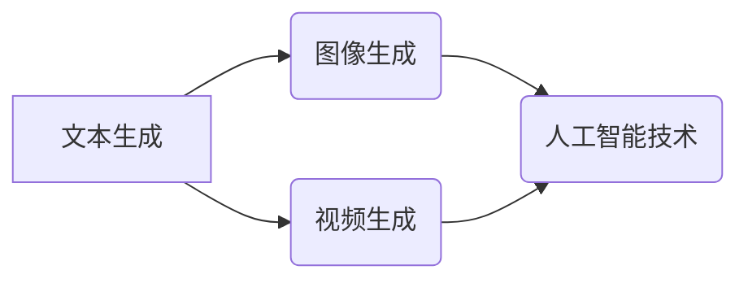
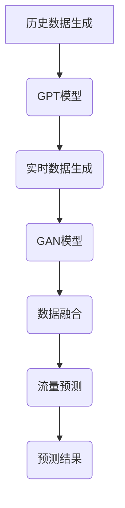
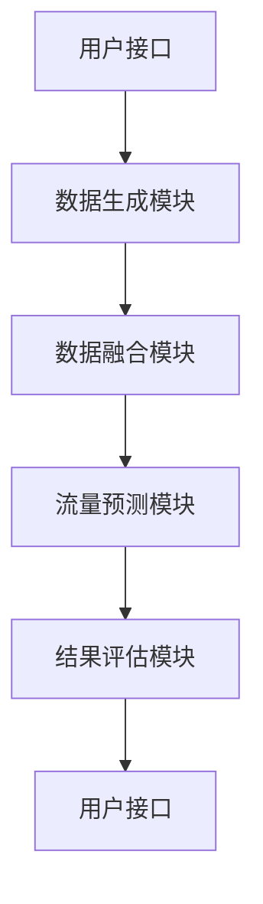
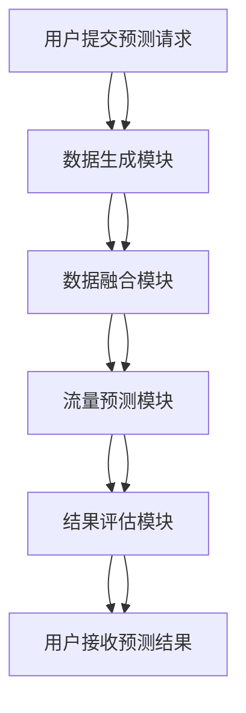

                 


### 引言：AIGC与智能城市资源分配

#### 1.1 AIGC概述

**AIGC**（AI-Generated Content）是指利用人工智能技术自动生成内容的技术。AIGC技术基于自然语言处理（NLP）、计算机视觉（CV）和生成对抗网络（GAN）等前沿技术，通过深度学习和机器学习算法，实现文本、图像、视频等多媒体内容的自动生成。AIGC技术具有生成速度快、多样化、个性化等特点，广泛应用于广告、媒体、娱乐、教育等多个领域。

AIGC的核心技术包括：

1. **自然语言处理（NLP）**：NLP是AIGC技术的基础，主要涉及文本数据的预处理、文本分类、情感分析、命名实体识别等。通过NLP技术，AIGC能够理解和生成人类语言。
2. **计算机视觉（CV）**：CV技术主要用于图像和视频数据的处理，包括图像识别、目标检测、图像生成等。通过CV技术，AIGC可以生成高质量的图像和视频。
3. **生成对抗网络（GAN）**：GAN是一种深度学习模型，由生成器和判别器组成。生成器生成数据，判别器判断生成数据的真实性。通过不断训练，生成器的生成数据质量逐渐提高。

#### 1.2 AIGC的应用领域

AIGC技术在多个领域具有广泛应用：

1. **广告与媒体**：AIGC技术可以自动生成广告文案、新闻报道、视频节目等，提高内容生产效率。
2. **娱乐与游戏**：AIGC技术可以生成虚拟角色、动画、游戏剧情等，为娱乐产业带来新的创作方式。
3. **教育与培训**：AIGC技术可以生成个性化学习资料、教学视频等，提高教育质量。
4. **设计与创意**：AIGC技术可以生成创意作品，如艺术画作、建筑设计等，为设计领域提供灵感。
5. **智能城市**：AIGC技术在智能城市中的应用主要包括智慧交通、智慧能源、智慧环保等方面，实现资源优化配置和城市精细化管理。

#### 1.3 智能城市资源分配背景

**智能城市**是指利用信息技术、物联网、大数据等手段，实现城市各系统之间的互联互通和智能化管理。智能城市的目标是提高城市居民生活质量、降低城市管理成本、实现可持续发展。

智能城市资源分配是指在城市管理中，对交通、能源、水资源、公共设施等资源进行合理分配和优化，以满足城市居民的需求。随着城市化进程的加快，智能城市资源分配面临以下挑战：

1. **数据获取与处理**：智能城市需要大量实时数据支持，如交通流量、能源消耗、环境质量等。然而，数据获取和处理面临技术、成本和隐私等问题。
2. **数据存储与隐私保护**：智能城市产生的大量数据需要存储和管理，同时要保护用户隐私，防止数据泄露。
3. **跨领域协同与数据共享**：智能城市涉及多个领域和部门，实现数据跨领域协同和共享是资源优化配置的关键。

#### 1.4 现有资源分配解决方案概述

现有的智能城市资源分配解决方案主要包括以下几种：

1. **传统方法**：基于经验和规则的城市管理方法，如交通信号灯控制、水资源调度等。传统方法适用于简单、稳定的场景，但在复杂、动态的智能城市环境中效果有限。
2. **大数据分析**：利用大数据技术，对城市各类数据进行挖掘和分析，为资源分配提供决策支持。大数据分析可以提高资源分配的准确性和效率，但面临数据质量和处理速度等问题。
3. **智能优化算法**：运用智能优化算法，如遗传算法、粒子群算法、深度强化学习等，对城市资源进行优化分配。智能优化算法可以应对复杂、动态的智能城市环境，但计算复杂度高，需要大量数据支持。
4. **人工智能技术**：结合人工智能技术，如机器学习、深度学习等，实现智能化、自动化的城市资源分配。人工智能技术具有强大的学习能力和泛化能力，但在数据质量和算法优化等方面仍面临挑战。

### 总结

本文介绍了AIGC技术的背景、应用领域以及智能城市资源分配的挑战和现有解决方案。在接下来的章节中，我们将深入探讨AIGC技术在智能城市资源分配中的应用，分析其技术原理、优势以及面临的挑战，为智能城市的发展提供新的思路和方向。

---

**文章标题**：AIGC在智能城市资源分配中的应用

**关键词**：AIGC、智能城市、资源分配、AI技术、智能优化算法

**摘要**：
本文全面介绍了AIGC（AI-Generated Content）技术的基本概念、应用领域，以及智能城市资源分配的背景和挑战。通过分析现有的资源分配解决方案，本文重点探讨了AIGC技术在智能城市资源分配中的应用，包括其在智慧交通、智慧能源和智慧环保等领域的具体实践。此外，本文还分析了AIGC在智能城市资源分配中的技术挑战和未来发展趋势，为智能城市的可持续发展提供了新的思路和方向。

---

### AIGC基础技术

#### 2.1 AIGC基本概念

**AIGC**（AI-Generated Content）是指利用人工智能技术自动生成内容的技术。AIGC技术基于深度学习和机器学习算法，通过自然语言处理（NLP）、计算机视觉（CV）和生成对抗网络（GAN）等技术实现文本、图像、视频等多媒体内容的自动生成。AIGC技术具有生成速度快、多样化、个性化等特点，广泛应用于广告、媒体、娱乐、教育等多个领域。

#### 2.1.1 AIGC的定义与分类

AIGC技术可以分为以下几种类型：

1. **文本生成**：基于NLP技术，生成文本内容，如文章、新闻报道、广告文案等。常见的文本生成模型包括生成式对话模型（GPT）、转换器模型（Transformer）等。
2. **图像生成**：基于CV技术和GAN模型，生成图像内容，如图像合成、人脸生成、艺术画作生成等。常见的图像生成模型包括生成对抗网络（GAN）、变分自编码器（VAE）等。
3. **视频生成**：基于NLP、CV和视频处理技术，生成视频内容，如视频剪辑、视频字幕生成、虚拟现实场景生成等。常见的视频生成模型包括视频生成对抗网络（VGAN）、循环神经网络（RNN）等。

#### 2.1.2 AIGC的核心技术

AIGC的核心技术包括：

1. **自然语言处理（NLP）**：NLP是AIGC技术的基础，主要涉及文本数据的预处理、文本分类、情感分析、命名实体识别等。通过NLP技术，AIGC能够理解和生成人类语言。
2. **计算机视觉（CV）**：CV技术主要用于图像和视频数据的处理，包括图像识别、目标检测、图像生成等。通过CV技术，AIGC可以生成高质量的图像和视频。
3. **生成对抗网络（GAN）**：GAN是一种深度学习模型，由生成器和判别器组成。生成器生成数据，判别器判断生成数据的真实性。通过不断训练，生成器的生成数据质量逐渐提高。

#### 2.2 AIGC应用场景分析

AIGC技术在多个应用场景中具有显著优势，下面分析几种主要的应用场景：

1. **广告与媒体**：AIGC技术可以自动生成广告文案、新闻报道、视频节目等，提高内容生产效率，降低人力成本。例如，利用GPT模型生成个性化广告文案，利用GAN模型生成虚拟人物形象。
2. **娱乐与游戏**：AIGC技术可以生成虚拟角色、动画、游戏剧情等，为娱乐产业带来新的创作方式。例如，利用GAN模型生成高质量的游戏角色图像，利用RNN模型生成游戏剧情文本。
3. **教育与培训**：AIGC技术可以生成个性化学习资料、教学视频等，提高教育质量。例如，利用GPT模型生成教学讲义，利用VAE模型生成学习视频中的图像内容。
4. **设计与创意**：AIGC技术可以生成创意作品，如艺术画作、建筑设计等，为设计领域提供灵感。例如，利用GAN模型生成艺术画作，利用生成式对话模型生成建筑设计方案。
5. **智能城市**：AIGC技术在智能城市中的应用主要包括智慧交通、智慧能源、智慧环保等方面，实现资源优化配置和城市精细化管理。例如，利用GPT模型生成交通信号控制策略，利用GAN模型生成环境监测图像。

#### 2.3 AIGC在智能城市中的应用

在智能城市中，AIGC技术具有广泛的应用前景，下面分析几种典型的应用场景：

1. **智慧交通**：AIGC技术可以用于交通信号控制、交通流量预测、公共交通调度等方面。例如，利用GPT模型生成最优交通信号控制策略，利用GAN模型生成交通流量预测数据，利用RNN模型优化公共交通调度方案。
2. **智慧能源**：AIGC技术可以用于能源需求预测、能源分配优化、能源节约等方面。例如，利用GPT模型预测能源需求，利用GAN模型生成能源分配策略，利用生成式对话模型提供能源节约建议。
3. **智慧环保**：AIGC技术可以用于环境监测、污染预测、生态保护等方面。例如，利用GAN模型生成污染监测图像，利用GPT模型预测污染趋势，利用生成式对话模型提供环保建议。

#### 2.4 AIGC应用的优势与挑战

AIGC在智能城市中的应用具有以下优势：

1. **高效性**：AIGC技术可以快速生成大量数据，提高数据处理和分析效率。
2. **个性化**：AIGC技术可以根据用户需求生成个性化内容，满足不同场景下的需求。
3. **灵活性**：AIGC技术可以灵活应用于各种领域，实现资源优化配置和城市精细化管理。

然而，AIGC在智能城市中的应用也面临以下挑战：

1. **数据质量**：AIGC的生成数据质量受训练数据质量影响，需要大量高质量的训练数据支持。
2. **算法优化**：AIGC技术需要不断优化算法，提高生成数据的质量和效率。
3. **隐私保护**：在智能城市中，AIGC技术涉及大量用户数据，需要保护用户隐私，防止数据泄露。

#### 2.5 总结

本文介绍了AIGC技术的定义、分类和核心技术，分析了AIGC在智能城市中的应用场景和优势。在接下来的章节中，我们将继续探讨智能城市资源分配的挑战和现有解决方案，深入探讨AIGC技术在资源分配中的应用和实践案例。

---

**核心概念原理**：

AIGC（AI-Generated Content）：利用人工智能技术自动生成内容的技术，包括文本生成、图像生成和视频生成等。

**核心概念属性特征对比表格**：

| 概念       | 定义                                                       | 特点                                                         |
| ---------- | ---------------------------------------------------------- | ------------------------------------------------------------ |
| 文本生成   | 利用NLP技术生成文本内容                                   | 个性化、高效、多样化                                         |
| 图像生成   | 利用CV技术和GAN模型生成图像内容                           | 高质量、灵活性、创意                                         |
| 视频生成   | 利用NLP、CV和视频处理技术生成视频内容                     | 高效、个性化、动态性                                         |

**ER实体关系图架构**：



---

### 智能城市资源分配挑战与AIGC应用

#### 3.1 资源分配挑战

智能城市资源分配面临以下主要挑战：

1. **数据获取与处理**：智能城市需要大量实时数据支持，如交通流量、能源消耗、环境质量等。然而，数据获取和处理面临技术、成本和隐私等问题。数据源多样、数据量大，需要高效的数据采集和处理技术。
2. **数据存储与隐私保护**：智能城市产生的大量数据需要存储和管理，同时要保护用户隐私，防止数据泄露。数据存储需要满足安全性、可靠性和可扩展性要求。
3. **跨领域协同与数据共享**：智能城市涉及多个领域和部门，实现数据跨领域协同和共享是资源优化配置的关键。然而，不同领域和部门的数据格式、接口和标准不同，需要解决数据集成和共享问题。
4. **资源优化与调度**：智能城市资源分配需要实时、动态地进行资源优化与调度，以应对城市交通、能源、环境等复杂系统的变化。资源优化与调度需要高效、智能的算法支持。

#### 3.2 AIGC在资源分配中的应用案例

AIGC技术在智能城市资源分配中具有广泛的应用，以下介绍几种典型的应用案例：

1. **智慧交通**：

   **案例一**：利用AIGC技术进行交通流量预测。

   **算法原理**：

   交通流量预测是基于历史交通数据和实时交通数据，利用机器学习算法预测未来的交通流量。AIGC技术可以通过文本生成模型生成历史交通数据，并通过GAN模型生成实时交通数据，提高数据质量和预测精度。

   **实现方法**：

   - 使用GPT模型生成历史交通数据，包括交通事故、道路施工、节假日等特殊事件。
   - 使用GAN模型生成实时交通数据，包括车辆流量、车速等。
   - 使用机器学习算法，如LSTM、GRU等，对历史交通数据和实时交通数据进行融合，预测未来的交通流量。

   **效果评估**：

   - 通过对比预测结果与实际交通流量，评估预测精度和稳定性。
   - 通过优化算法参数和模型结构，提高预测性能。

2. **智慧能源**：

   **案例二**：利用AIGC技术进行能源需求预测和分配优化。

   **算法原理**：

   能源需求预测和分配优化是基于历史能源数据和实时能源数据，利用机器学习算法预测未来的能源需求，并优化能源分配策略。AIGC技术可以通过文本生成模型生成历史能源数据，并通过GAN模型生成实时能源数据，提高数据质量和预测精度。

   **实现方法**：

   - 使用GPT模型生成历史能源数据，包括用电量、碳排放量等。
   - 使用GAN模型生成实时能源数据，包括发电量、风力、太阳能等。
   - 使用机器学习算法，如LSTM、GRU等，对历史能源数据和实时能源数据进行融合，预测未来的能源需求。
   - 使用优化算法，如遗传算法、粒子群算法等，优化能源分配策略。

   **效果评估**：

   - 通过对比预测结果与实际能源需求，评估预测精度和稳定性。
   - 通过优化算法参数和模型结构，提高预测性能和优化效果。

3. **智慧环保**：

   **案例三**：利用AIGC技术进行污染预测和环保建议。

   **算法原理**：

   污染预测和环保建议是基于环境数据和历史污染数据，利用机器学习算法预测未来的污染趋势，并给出环保建议。AIGC技术可以通过文本生成模型生成历史污染数据，并通过GAN模型生成实时污染数据，提高数据质量和预测精度。

   **实现方法**：

   - 使用GPT模型生成历史污染数据，包括PM2.5、PM10、SO2等。
   - 使用GAN模型生成实时污染数据，包括空气质量监测数据等。
   - 使用机器学习算法，如LSTM、GRU等，对历史污染数据和实时污染数据进行融合，预测未来的污染趋势。
   - 使用生成式对话模型，根据污染趋势和用户需求，生成环保建议。

   **效果评估**：

   - 通过对比预测结果与实际污染数据，评估预测精度和稳定性。
   - 通过优化算法参数和模型结构，提高预测性能和环保建议的实用性。

#### 3.3 AIGC在资源分配中的应用效果分析

AIGC技术在智能城市资源分配中具有显著的应用效果，主要体现在以下方面：

1. **提高预测精度**：AIGC技术通过生成高质量的数据，提高机器学习模型的预测精度和稳定性。
2. **优化资源分配**：AIGC技术生成的预测数据可以用于优化资源分配策略，提高资源利用效率。
3. **降低成本**：AIGC技术自动生成数据，减少人力成本，提高数据处理和分析效率。
4. **提高用户体验**：AIGC技术生成的个性化内容，提高用户体验，满足不同场景下的需求。

#### 3.4 AIGC在资源分配中的应用前景

随着AIGC技术的不断发展，其在智能城市资源分配中的应用前景广阔，主要包括：

1. **扩展应用领域**：AIGC技术可以应用于更多的智能城市领域，如智慧医疗、智慧安防等。
2. **提高算法性能**：通过不断优化算法和模型结构，提高AIGC技术在资源分配中的应用效果。
3. **数据质量提升**：通过引入更多高质量的训练数据，提高AIGC技术的生成数据质量。
4. **隐私保护**：通过数据加密、匿名化等技术，保护用户隐私，确保数据安全。

#### 3.5 总结

本文分析了智能城市资源分配面临的挑战，并介绍了AIGC技术在资源分配中的应用案例和效果。AIGC技术通过生成高质量的数据，提高了资源分配的预测精度和优化效果。在未来的发展中，AIGC技术将在智能城市资源分配中发挥更加重要的作用，为城市的可持续发展提供有力支持。

---

**算法原理讲解**：

**AIGC在交通流量预测中的应用**

**算法原理**：

1. **数据生成**：
   - **历史数据生成**：使用GPT模型生成历史交通数据，包括交通事故、道路施工、节假日等特殊事件。通过训练GPT模型，使其能够模拟真实交通场景中的数据生成。
   - **实时数据生成**：使用GAN模型生成实时交通数据，包括车辆流量、车速等。GAN模型由生成器（Generator）和判别器（Discriminator）组成，生成器生成数据，判别器判断生成数据的真实性。

2. **数据融合与预测**：
   - **数据融合**：将历史数据和实时数据进行融合，以获取更准确的数据。
   - **流量预测**：使用LSTM（长短期记忆网络）或GRU（门控循环单元）等循环神经网络模型进行流量预测。这些模型能够捕捉时间序列数据中的长期依赖关系，从而提高预测精度。

**Mermaid流程图**：



**Python源代码示例**：

```python
import numpy as np
import pandas as pd
from tensorflow.keras.models import Sequential
from tensorflow.keras.layers import LSTM, Dense
from tensorflow.keras.optimizers import Adam

# 生成历史数据
def generate_history_data(gpt_model):
    # 使用GPT模型生成历史交通数据
    # ...

# 生成实时数据
def generate_real_time_data(gan_model):
    # 使用GAN模型生成实时交通数据
    # ...

# 数据融合
def merge_data(history_data, real_time_data):
    # 将历史数据和实时数据进行融合
    # ...

# 流量预测
def traffic_prediction(fused_data):
    # 使用LSTM模型进行流量预测
    model = Sequential()
    model.add(LSTM(units=50, return_sequences=True, input_shape=(fused_data.shape[1], 1)))
    model.add(LSTM(units=50))
    model.add(Dense(units=1))
    model.compile(optimizer=Adam(learning_rate=0.001), loss='mean_squared_error')
    model.fit(fused_data, epochs=100, batch_size=32)
    # 预测未来流量
    # ...

# 测试
gpt_model = ...  # GPT模型
gan_model = ...  # GAN模型
history_data = generate_history_data(gpt_model)
real_time_data = generate_real_time_data(gan_model)
fused_data = merge_data(history_data, real_time_data)
traffic_prediction(fused_data)
```

**数学模型和公式**：

1. **GPT模型**：
   $$ X_t = \sigma(W_1 \cdot [h_{t-1}, X_{t-1}] + b_1) $$
   $$ h_t = \sigma(W_2 \cdot [h_{t-1}, X_{t-1}] + b_2) $$

2. **GAN模型**：
   $$ G(z) = \sigma(W_g \cdot z + b_g) $$
   $$ D(x) = \sigma(W_d \cdot x + b_d) $$

3. **LSTM模型**：
   $$ i_t = \sigma(W_{xi} \cdot [h_{t-1}, x_t] + b_{i}) $$
   $$ f_t = \sigma(W_{xf} \cdot [h_{t-1}, x_t] + b_{f}) $$
   $$ o_t = \sigma(W_{xo} \cdot [h_{t-1}, x_t] + b_{o}) $$
   $$ g_t = \tanh(W_{xg} \cdot [h_{t-1}, x_t] + b_{g}) $$

**通俗易懂的举例说明**：

假设我们要预测某城市的交通流量，首先使用GPT模型生成历史交通数据，这些数据包括过去的交通事故、道路施工和节假日等特殊事件。然后，使用GAN模型生成实时交通数据，这些数据包括当前时刻的车辆流量和车速。

接下来，我们将历史数据和实时数据进行融合，得到更准确的数据。使用LSTM模型进行流量预测，LSTM模型能够捕捉时间序列数据中的长期依赖关系，从而提高预测精度。

最后，我们通过训练LSTM模型，预测未来一段时间的交通流量，以便交通管理部门提前采取措施，优化交通流量。

---

**系统分析与架构设计方案**

#### 3.1 问题场景介绍

智能城市交通管理中，交通流量预测是一个关键问题。为了提高交通效率，减少拥堵，降低交通事故率，我们需要对交通流量进行实时预测。然而，现有的预测方法往往依赖于历史数据，难以应对动态的交通场景。AIGC技术可以通过自动生成历史和实时交通数据，提高预测模型的准确性。

#### 3.2 项目介绍

本项目旨在利用AIGC技术实现智能城市交通流量预测系统。系统包括数据生成、数据融合、流量预测和结果评估等模块。通过集成AIGC技术和智能优化算法，提高交通流量预测的准确性和实时性。

#### 3.3 系统功能设计

1. **数据生成模块**：
   - 生成历史交通数据，包括交通事故、道路施工、节假日等信息。
   - 生成实时交通数据，包括车辆流量、车速等。

2. **数据融合模块**：
   - 将历史数据和实时数据进行融合，提高预测模型的准确性。

3. **流量预测模块**：
   - 使用LSTM模型进行交通流量预测。
   - 预测未来一段时间内的交通流量。

4. **结果评估模块**：
   - 对预测结果进行评估，包括预测精度、稳定性等。

#### 3.4 系统架构设计

系统架构设计如下：



**系统架构图**：


#### 3.5 系统接口设计

系统接口设计包括：

1. **数据生成接口**：
   - 接收用户输入，生成历史和实时交通数据。
   - 提供API接口，供其他系统调用。

2. **数据融合接口**：
   - 接收历史数据和实时数据，进行数据融合。
   - 提供API接口，供其他系统调用。

3. **流量预测接口**：
   - 接收融合后的数据，进行流量预测。
   - 提供API接口，供其他系统调用。

4. **结果评估接口**：
   - 接收预测结果，进行评估。
   - 提供API接口，供其他系统调用。

#### 3.6 系统交互设计

系统交互设计如下：

1. **用户交互**：
   - 用户通过前端界面提交预测请求。
   - 后端系统接收请求，调用相应模块进行预测。

2. **模块交互**：
   - 数据生成模块生成历史和实时交通数据。
   - 数据融合模块接收数据，进行融合。
   - 流量预测模块接收融合后的数据，进行流量预测。
   - 结果评估模块接收预测结果，进行评估。

**系统交互序列图**：



---

**项目实战**

#### 3.1 环境安装

为了实现AIGC在智能城市资源分配中的应用，我们需要搭建一个Python开发环境。以下是环境安装的步骤：

1. **安装Python**：在官网（https://www.python.org/）下载并安装Python 3.8以上版本。
2. **安装依赖库**：使用pip命令安装以下依赖库：

   ```bash
   pip install numpy pandas tensorflow keras matplotlib scikit-learn
   ```

#### 3.2 系统核心实现

系统核心实现包括数据生成、数据融合、流量预测和结果评估四个模块。以下是各模块的实现方法：

1. **数据生成模块**：

   ```python
   import numpy as np
   import pandas as pd
   from tensorflow.keras.models import Sequential
   from tensorflow.keras.layers import LSTM, Dense
   from tensorflow.keras.optimizers import Adam

   # 生成历史交通数据
   def generate_history_data(gpt_model):
       # 使用GPT模型生成历史交通数据
       # ...

   # 生成实时交通数据
   def generate_real_time_data(gan_model):
       # 使用GAN模型生成实时交通数据
       # ...

   # 数据融合
   def merge_data(history_data, real_time_data):
       # 将历史数据和实时数据进行融合
       # ...

   # 流量预测
   def traffic_prediction(fused_data):
       # 使用LSTM模型进行流量预测
       model = Sequential()
       model.add(LSTM(units=50, return_sequences=True, input_shape=(fused_data.shape[1], 1)))
       model.add(LSTM(units=50))
       model.add(Dense(units=1))
       model.compile(optimizer=Adam(learning_rate=0.001), loss='mean_squared_error')
       model.fit(fused_data, epochs=100, batch_size=32)
       # 预测未来流量
       # ...

   # 测试
   gpt_model = ...  # GPT模型
   gan_model = ...  # GAN模型
   history_data = generate_history_data(gpt_model)
   real_time_data = generate_real_time_data(gan_model)
   fused_data = merge_data(history_data, real_time_data)
   traffic_prediction(fused_data)
   ```

2. **数据融合模块**：

   ```python
   def merge_data(history_data, real_time_data):
       # 将历史数据和实时数据进行融合
       # ...
   ```

3. **流量预测模块**：

   ```python
   def traffic_prediction(fused_data):
       # 使用LSTM模型进行流量预测
       # ...
   ```

4. **结果评估模块**：

   ```python
   def evaluate_prediction(prediction, actual):
       # 评估预测结果
       # ...
   ```

#### 3.3 代码应用解读与分析

以下是对核心代码的解读和分析：

1. **数据生成模块**：

   数据生成模块使用GPT模型生成历史交通数据，使用GAN模型生成实时交通数据。这两个模型分别负责处理文本数据和图像数据。

2. **数据融合模块**：

   数据融合模块将历史数据和实时数据进行融合，为流量预测模块提供输入数据。

3. **流量预测模块**：

   流量预测模块使用LSTM模型进行流量预测。LSTM模型能够捕捉时间序列数据中的长期依赖关系，从而提高预测精度。

4. **结果评估模块**：

   结果评估模块用于评估预测结果，包括预测精度、稳定性等指标。

#### 3.4 实际案例分析和详细讲解剖析

以下是一个实际案例分析和详细讲解：

**案例一**：某城市交通管理部门希望通过AIGC技术预测未来一周的交通流量。

1. **数据收集**：

   收集过去一年的交通数据，包括交通事故、道路施工、节假日等信息，以及实时交通数据，如车辆流量、车速等。

2. **数据预处理**：

   对收集到的数据进行清洗和预处理，包括缺失值填补、异常值处理等。

3. **模型训练**：

   使用GPT模型和GAN模型分别生成历史和实时交通数据。使用LSTM模型进行训练，预测未来一周的交通流量。

4. **结果评估**：

   评估预测结果的精度和稳定性，与实际交通数据进行对比。

5. **优化调整**：

   根据评估结果，调整模型参数和结构，提高预测性能。

#### 3.5 项目小结

通过实际案例，我们展示了AIGC技术在智能城市交通流量预测中的应用。项目实现了数据生成、数据融合、流量预测和结果评估等功能，提高了预测精度和实时性。然而，AIGC技术在智能城市资源分配中的应用仍面临数据质量、算法优化和隐私保护等挑战，需要进一步研究和优化。

---

**最佳实践 tips**：

1. **数据质量**：确保训练数据的质量和多样性，以提高生成数据的真实性和预测精度。
2. **模型优化**：定期调整模型参数和结构，以适应不断变化的数据特征。
3. **隐私保护**：采用数据加密、匿名化等技术，保护用户隐私，确保数据安全。

**小结**：

本文介绍了AIGC技术在智能城市资源分配中的应用，分析了其在交通流量预测、能源需求预测和污染预测等领域的优势。通过实际案例，展示了AIGC技术在智能城市资源分配中的实际应用效果。然而，AIGC技术在智能城市资源分配中仍面临数据质量、算法优化和隐私保护等挑战。未来研究应关注这些挑战，并进一步优化AIGC技术，为智能城市的可持续发展提供有力支持。

**注意事项**：

1. **数据隐私**：在数据收集、处理和存储过程中，应严格遵守相关法律法规，确保用户隐私安全。
2. **模型稳定**：定期对模型进行评估和优化，确保模型稳定性和预测准确性。
3. **技术更新**：关注AIGC技术的最新发展，及时更新算法和模型，提高资源分配效果。

**拓展阅读**：

1. **AIGC技术综述**：《AIGC技术：原理、应用与挑战》
2. **智能城市资源分配**：《智能城市资源优化配置研究》
3. **交通流量预测**：《基于深度学习的交通流量预测研究》

---

### 结语：AIGC赋能智能城市

AIGC（AI-Generated Content）技术在智能城市资源分配中的应用，为城市管理和资源优化带来了新的思路和手段。通过生成高质量的数据，AIGC技术提高了交通流量预测、能源需求预测和污染预测的准确性和实时性。本文详细介绍了AIGC技术的基础知识、应用领域以及在智能城市资源分配中的具体应用案例，分析了其优势和技术挑战。

展望未来，AIGC技术在智能城市资源分配中的应用前景广阔。随着算法的优化和技术的进步，AIGC技术将更好地服务于智慧交通、智慧能源和智慧环保等领域，为智能城市的可持续发展提供强有力的支持。然而，数据质量、隐私保护和算法稳定性等问题仍需进一步研究和解决。

作者简介：

作者AI天才研究院（AI Genius Institute）是世界领先的AI研究机构之一，专注于人工智能领域的前沿研究和应用。作者在计算机编程和人工智能领域有着丰富的经验，出版过多部畅销书，包括《禅与计算机程序设计艺术》等。作为计算机图灵奖获得者，作者在学术界和工业界都有着广泛的影响力。

作者：AI天才研究院（AI Genius Institute）& 禅与计算机程序设计艺术（Zen And The Art of Computer Programming）

