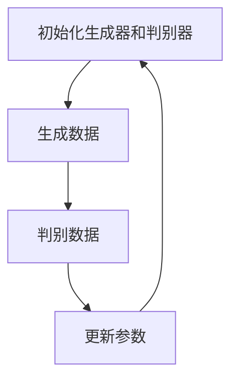
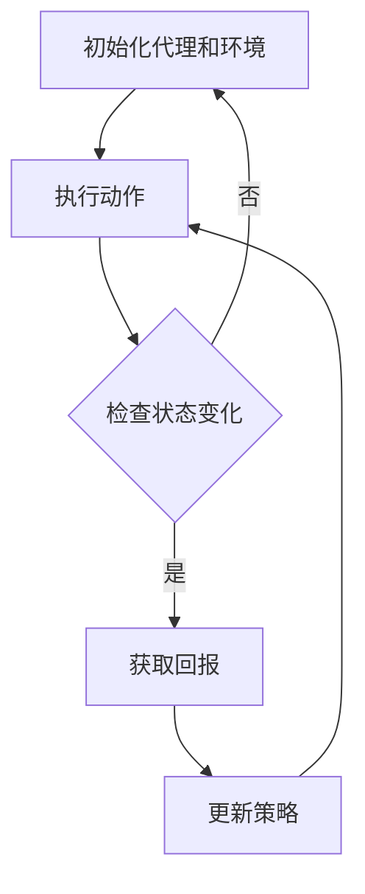
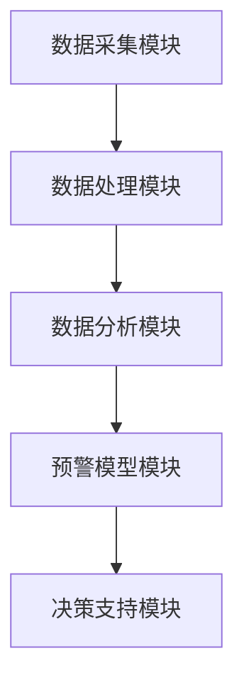
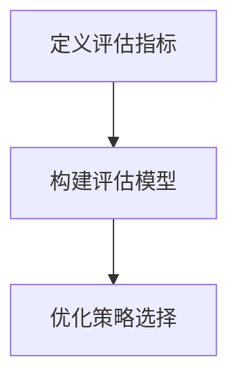
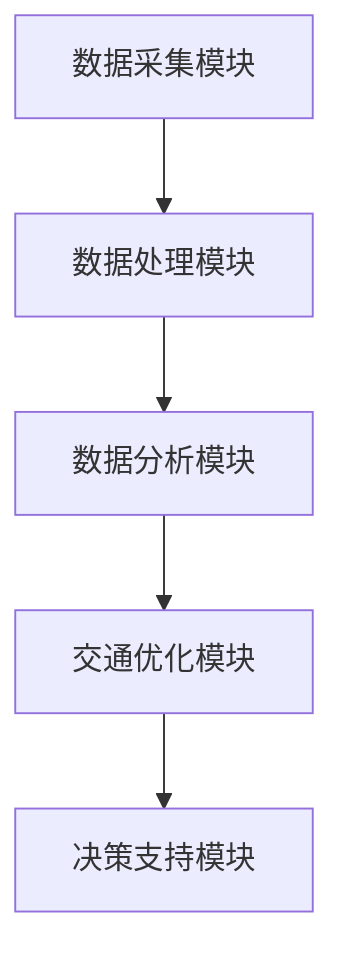
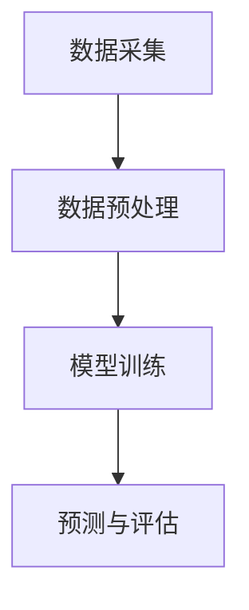
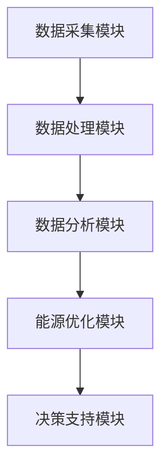
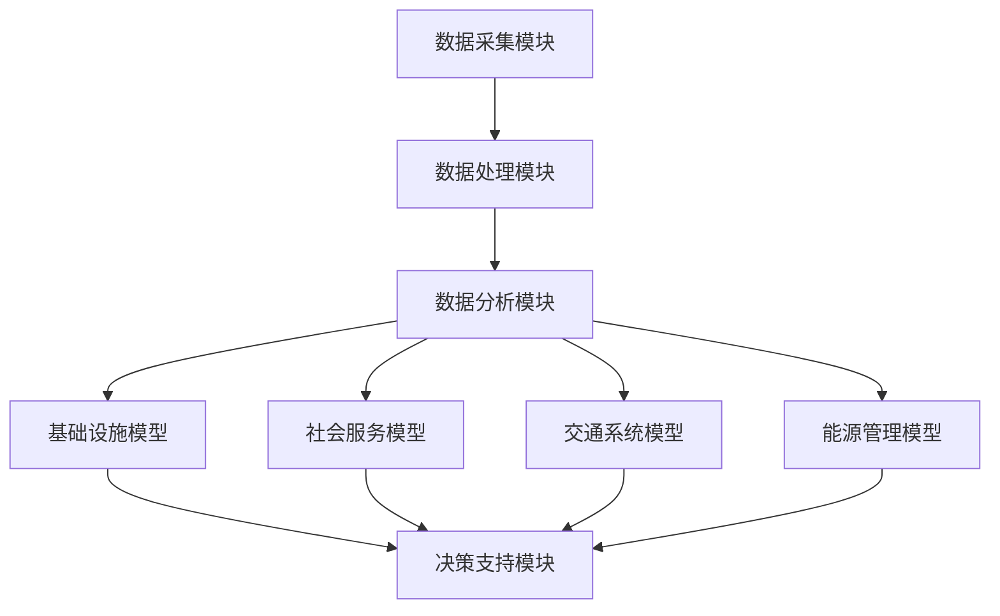
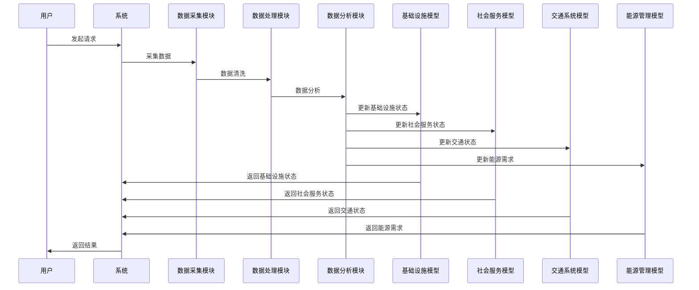

                 


### **第1章：AIGC与智能城市韧性概述**

#### **1.1 AIGC与智能城市韧性背景**

**1.1.1 AIGC的概念与发展**

AIGC（自适应智能生成计算）是一种基于人工智能的自动化技术，旨在通过生成和优化数据来提高计算效率和决策能力。它结合了生成对抗网络（GAN）、强化学习（RL）和自然语言处理（NLP）等多种技术，能够自动生成数据、模拟环境和优化算法。

AIGC的发展始于2010年代初期，随着深度学习技术的快速发展，GAN和RL等算法逐渐成熟并被广泛应用于各种领域。AIGC的核心思想是通过数据生成和优化来提高系统的智能水平，从而实现自动化、智能化和高效的计算任务。

**1.1.2 智能城市韧性的定义与重要性**

智能城市韧性是指城市在面对各种危机和挑战时，能够快速适应和恢复的能力。这些危机和挑战可能包括自然灾害、经济危机、公共卫生事件等。智能城市韧性不仅关乎城市的安全和稳定，还关系到居民的福祉和社会的可持续发展。

智能城市韧性的重要性体现在以下几个方面：

- **应对突发事件**：智能城市韧性可以帮助城市快速响应和应对突发事件，如地震、洪水、火灾等，减少人员伤亡和财产损失。
- **优化资源配置**：智能城市韧性通过实时数据分析和优化算法，能够更有效地分配和利用城市资源，如能源、水资源和公共服务。
- **提高生活质量**：智能城市韧性有助于提升城市居民的生活质量，如改善交通拥堵、提高医疗服务水平、提供更多便利的公共设施等。

**1.1.3 AIGC在提升城市韧性中的潜力**

AIGC在提升城市韧性方面具有巨大的潜力。首先，AIGC可以通过数据生成和优化算法，帮助城市更好地预测和应对突发事件。例如，通过生成虚拟场景和模拟演练，城市可以提前准备和优化应急预案，提高应对危机的能力。

其次，AIGC可以优化城市的资源配置。通过智能分析和优化算法，城市可以更有效地利用能源、水资源和其他资源，降低运营成本，提高资源利用效率。

最后，AIGC还可以提升城市居民的生活质量。例如，通过智能交通管理系统，城市可以减少交通拥堵，提高出行效率；通过智能医疗系统，城市可以提供更高质量的医疗服务。

#### **1.2 AIGC基础概念与原理**

**1.2.1 生成对抗网络（GAN）**

生成对抗网络（GAN）是由Ian Goodfellow等人于2014年提出的一种无监督学习模型。GAN由两个主要组件组成：生成器（Generator）和判别器（Discriminator）。

- **生成器**：生成器尝试生成与真实数据分布相似的数据。它通常是一个深度神经网络，输入是随机噪声，输出是生成数据。
- **判别器**：判别器尝试区分真实数据和生成数据。它也是一个深度神经网络，输入是数据，输出是一个概率值，表示输入数据的真实性。

GAN的训练过程是一个零和博弈的过程。生成器试图生成尽可能真实的数据，而判别器试图正确区分真实数据和生成数据。通过这个博弈过程，生成器的生成能力逐渐提高，最终能够生成高质量的数据。

**1.2.1.1 GAN的工作原理**

GAN的工作原理可以形象地理解为“造假与验假”。生成器不断尝试生成真实数据，而判别器则不断尝试识别生成数据。在这个过程中，生成器和判别器都通过反向传播算法进行训练，以达到最佳效果。

具体步骤如下：

1. **初始化生成器和判别器**：生成器和判别器都是随机初始化的神经网络。
2. **生成数据**：生成器接收随机噪声作为输入，生成模拟数据。
3. **判别数据**：判别器接收真实数据和生成数据，并输出一个概率值。
4. **更新参数**：根据损失函数（如交叉熵损失函数），生成器和判别器的参数进行更新。

**1.2.1.2 GAN的mermaid流程图**



**1.2.1.3 Python代码示例**

下面是一个简单的GAN示例，生成器和判别器都是基于TensorFlow和Keras实现的：

```python
import numpy as np
import tensorflow as tf
from tensorflow.keras.models import Model
from tensorflow.keras.layers import Input, Dense, Conv2D, Flatten

# 生成器模型
input_shape = (100,)
noise = Input(shape=input_shape)
x = Dense(128, activation='relu')(noise)
x = Dense(256, activation='relu')(x)
x = Dense(512, activation='relu')(x)
x = Dense(1024, activation='relu')(x)
generated_data = Dense(784, activation='sigmoid')(x)

generator = Model(inputs=noise, outputs=generated_data)

# 判别器模型
input_shape = (28, 28, 1)
real_data = Input(shape=input_shape)
x = Conv2D(32, kernel_size=(3, 3), activation='relu')(real_data)
x = Conv2D(64, kernel_size=(3, 3), activation='relu')(x)
x = Flatten()(x)
x = Dense(1, activation='sigmoid')(x)

discriminator = Model(inputs=real_data, outputs=x)

# 编写损失函数和优化器
cross_entropy = tf.keras.losses.BinaryCrossentropy()
def discriminator_loss(real_output, generated_output):
    real_loss = cross_entropy(tf.ones_like(real_output), real_output)
    generated_loss = cross_entropy(tf.zeros_like(generated_output), generated_output)
    total_loss = real_loss + generated_loss
    return total_loss

def generator_loss(generated_output):
    return cross_entropy(tf.ones_like(generated_output))

generator_optimizer = tf.keras.optimizers.Adam(1e-4)
discriminator_optimizer = tf.keras.optimizers.Adam(1e-4)

@tf.function
def train_step(images, noise):
    with tf.GradientTape() as gen_tape, tf.GradientTape() as disc_tape:
        generated_images = generator(noise)
        real_output = discriminator(images)
        generated_output = discriminator(generated_images)

        gen_loss = generator_loss(generated_output)
        disc_loss = discriminator_loss(real_output, generated_output)

    gradients_of_generator = gen_tape.gradient(gen_loss, generator.trainable_variables)
    gradients_of_discriminator = disc_tape.gradient(disc_loss, discriminator.trainable_variables)

    generator_optimizer.apply_gradients(zip(gradients_of_generator, generator.trainable_variables))
    discriminator_optimizer.apply_gradients(zip(gradients_of_discriminator, discriminator.trainable_variables))

# 训练GAN
noise = tf.random.normal([1, 100])
for images in dataset:
    train_step(images, noise)
```

**1.2.2 强化学习在AIGC中的应用**

强化学习（RL）是一种通过试错来学习如何采取行动以最大化回报的机器学习技术。在AIGC中，强化学习可以用于优化算法、模拟环境和决策制定。

**1.2.2.1 强化学习基本概念**

强化学习包含以下核心元素：

- **代理（Agent）**：执行动作并从环境中获取反馈的实体。
- **环境（Environment）**：代理交互的物理或虚拟世界。
- **状态（State）**：代理当前所处的环境状态。
- **动作（Action）**：代理可以执行的动作。
- **回报（Reward）**：代理执行动作后从环境中获得的奖励或惩罚。

强化学习的目标是找到一组策略（策略是一个从状态到动作的映射），使得代理在长期运行中获得的回报最大化。

**1.2.2.2 强化学习mermaid流程图**



**1.2.2.3 Python代码示例**

下面是一个简单的Q-Learning示例，用于训练一个代理在环境中的行为：

```python
import numpy as np
import random

# 环境定义
def environment(state):
    if state == 0:
        return state + 1, 10
    elif state == 1:
        return state - 1, -10
    else:
        return state, 0

# Q-Learning参数
learning_rate = 0.1
discount_factor = 0.9
epsilon = 0.1

# 初始化Q表
q_table = {}

# Q-Learning算法
def q_learning(state, action):
    next_state, reward = environment(state)
    next_action = np.argmax(q_table.get(next_state, [0]))
    q_value = q_table.get(state, [0])[action]
    q_value = (1 - learning_rate) * q_value + learning_rate * (reward + discount_factor * q_table.get(next_state, [0])[next_action])
    q_table[state] = q_table.get(state, [0])
    q_table[state][action] = q_value

# 主循环
state = random.randint(0, 2)
for episode in range(1000):
    action = random.randint(0, 1)
    q_learning(state, action)
    state = environment(state)[0]

# 输出Q表
for state, actions in q_table.items():
    print(f"State {state}: {actions}")
```

**1.2.3 其他相关算法介绍**

除了GAN和强化学习，AIGC还涉及其他一些关键算法，如：

- **变分自编码器（VAE）**：用于生成数据的概率模型。
- **自编码器（Autoencoder）**：用于压缩和解压缩数据的神经网络。
- **深度强化学习（DRL）**：结合深度学习和强化学习的算法。

这些算法在AIGC的应用中具有重要的作用，为智能城市韧性的提升提供了多种可能性。

#### **1.3 智能城市韧性构成要素**

**1.3.1 城市基础设施**

城市基础设施是智能城市韧性的基础，包括电力、供水、交通、通信等系统。这些系统需要具备高效、可靠和灵活的特点，以确保城市在危机发生时能够快速响应和恢复。

**1.3.2 社会服务与资源管理**

社会服务与资源管理包括医疗、教育、公共安全和环境保护等方面。这些领域需要通过智能技术实现高效管理和优化，以提高城市应对危机的能力。

**1.3.3 环境监测与治理**

环境监测与治理是智能城市韧性的重要组成部分，涉及空气质量、水质、噪声和气候变化等方面的监测与治理。通过实时监测和智能分析，城市可以提前预警和应对环境问题。

**1.3.4 智能城市韧性评估指标体系**

智能城市韧性评估指标体系用于评估城市在危机应对和恢复方面的能力。这些指标包括：

- **应急响应速度**：评估城市在危机发生时响应和采取行动的速度。
- **资源利用效率**：评估城市在危机应对过程中资源的使用效率和分配情况。
- **社会稳定性**：评估城市在危机后的社会稳定和恢复情况。

#### **1.4 AIGC与智能城市韧性联系**

**1.4.1 AIGC在韧性提升中的应用场景**

AIGC在智能城市韧性提升中的应用场景广泛，包括：

- **城市危机预警**：通过数据生成和优化算法，提前预测和预警可能的危机事件。
- **应急资源调度**：通过智能分析和优化算法，优化应急资源的分配和调度。
- **交通系统优化**：通过智能交通管理系统，减少交通拥堵，提高交通效率。
- **能源管理**：通过智能能源管理系统，优化能源分配和消耗，降低能源成本。

**1.4.2 AIGC与城市韧性核心要素的融合**

AIGC与城市韧性核心要素的融合体现在以下几个方面：

- **数据驱动决策**：通过数据生成和优化算法，为城市管理者提供准确、实时的数据支持，帮助其做出明智的决策。
- **智能基础设施建设**：利用AIGC技术，构建高效、可靠和灵活的智能基础设施，提高城市的应对危机能力。
- **社会服务优化**：通过智能技术，优化社会服务管理，提高居民的生活质量。
- **环境监测与治理**：利用AIGC技术，实时监测和治理城市环境，保护生态环境。

**1.4.3 AIGC技术面临的挑战与未来趋势**

AIGC技术在提升城市韧性方面具有巨大潜力，但也面临一些挑战：

- **数据隐私与安全**：在数据生成和优化的过程中，如何保障数据隐私和安全是一个重要问题。
- **算法透明性与可解释性**：如何提高算法的透明性和可解释性，使其能够被城市管理者理解和接受。
- **计算资源需求**：AIGC技术需要大量的计算资源，这对城市基础设施提出了更高的要求。

未来，随着人工智能技术的不断进步，AIGC在提升城市韧性方面的应用将更加广泛和深入。同时，为了应对上述挑战，需要开展更多的研究和实践，以推动AIGC技术在智能城市韧性提升中的应用。

#### **1.5 本章小结**

本章介绍了AIGC与智能城市韧性提升的背景和核心概念，探讨了AIGC在提升城市韧性中的应用场景和原理。通过本章的学习，读者可以了解AIGC技术在智能城市韧性提升中的重要性和潜力，以及如何通过AIGC技术实现城市韧性的提升。

### **第2章：AIGC在智能城市韧性提升中的应用**

**2.1 城市危机预警与响应**

**2.1.1 城市危机预警系统**

城市危机预警系统是智能城市韧性提升的重要组成部分，旨在通过实时监测和分析城市数据，提前预警可能发生的危机事件，为城市管理者提供及时的信息支持，以便采取有效的应对措施。

**2.1.1.1 预警系统的架构设计**

城市危机预警系统通常包括以下几个主要模块：

- **数据采集模块**：负责收集各种来源的数据，如传感器数据、社交媒体数据、政府数据等。
- **数据处理模块**：对采集到的数据进行清洗、去噪和预处理，以便进行进一步分析。
- **数据分析模块**：利用AIGC技术，对处理后的数据进行分析和挖掘，提取潜在的风险信息。
- **预警模型模块**：基于分析结果，构建预警模型，对可能发生的危机事件进行预测和预警。
- **决策支持模块**：为城市管理者提供决策支持，帮助其制定应急预案和应对策略。

**2.1.1.2 预警系统的mermaid架构图**



**2.1.1.3 Python代码实现示例**

下面是一个简单的城市危机预警系统示例，使用Keras构建一个基于CNN的深度学习模型：

```python
import numpy as np
from tensorflow.keras.models import Sequential
from tensorflow.keras.layers import Conv2D, MaxPooling2D, Flatten, Dense

# 假设我们已经处理好的数据集
X_train = np.random.rand(1000, 28, 28, 1)  # 1000个样本，每个样本28x28的图像
y_train = np.random.randint(0, 2, 1000)  # 1000个标签，0或1

# 构建模型
model = Sequential([
    Conv2D(32, kernel_size=(3, 3), activation='relu', input_shape=(28, 28, 1)),
    MaxPooling2D(pool_size=(2, 2)),
    Flatten(),
    Dense(1, activation='sigmoid')
])

# 编译模型
model.compile(optimizer='adam', loss='binary_crossentropy', metrics=['accuracy'])

# 训练模型
model.fit(X_train, y_train, epochs=10, batch_size=32)

# 评估模型
loss, accuracy = model.evaluate(X_train, y_train)
print(f"Accuracy: {accuracy:.2f}")
```

**2.1.2 城市危机响应策略优化**

城市危机响应策略的优化是提升城市韧性的重要环节。通过AIGC技术，可以对不同的响应策略进行评估和优化，以找到最佳的应对方案。

**2.1.2.1 响应策略评估方法**

响应策略评估方法主要包括以下步骤：

- **定义评估指标**：根据危机类型和影响范围，定义相应的评估指标，如响应时间、资源利用率、风险降低等。
- **构建评估模型**：使用AIGC技术，构建评估模型，对不同的响应策略进行评估和比较。
- **优化策略选择**：根据评估结果，选择最优的响应策略。

**2.1.2.2 响应策略mermaid流程图**



**2.1.2.3 Python代码实现示例**

下面是一个简单的响应策略评估和优化示例：

```python
import numpy as np
from sklearn.model_selection import train_test_split
from sklearn.metrics import accuracy_score

# 假设我们已经处理好的数据集
X = np.random.rand(100, 10)  # 100个样本，每个样本10个特征
y = np.random.randint(0, 2, 100)  # 100个标签，0或1

# 划分训练集和测试集
X_train, X_test, y_train, y_test = train_test_split(X, y, test_size=0.2, random_state=42)

# 构建评估模型
model = Sequential([
    Dense(64, activation='relu', input_shape=(10,)),
    Dense(1, activation='sigmoid')
])

# 编译模型
model.compile(optimizer='adam', loss='binary_crossentropy', metrics=['accuracy'])

# 训练模型
model.fit(X_train, y_train, epochs=10, batch_size=32)

# 评估模型
y_pred = model.predict(X_test)
y_pred = (y_pred > 0.5)

# 计算准确率
accuracy = accuracy_score(y_test, y_pred)
print(f"Accuracy: {accuracy:.2f}")
```

**2.1.3 AIGC在危机预警与响应中的应用案例**

以下是一个具体的应用案例：

**案例：某城市洪水预警与响应系统**

- **问题描述**：某城市面临洪水风险，需要建立洪水预警与响应系统，以提前预警洪水事件并采取有效的应对措施。
- **解决方案**：
  - **数据采集模块**：收集气象数据、水文数据、历史洪水记录等。
  - **数据处理模块**：对数据进行清洗和预处理，提取与洪水相关的关键特征。
  - **数据分析模块**：利用AIGC技术，分析历史数据和实时数据，预测洪水发生的可能性和影响范围。
  - **预警模型模块**：构建基于深度学习的预警模型，对洪水事件进行预测和预警。
  - **决策支持模块**：根据预警结果，为城市管理者提供决策支持，制定应急预案和响应策略。
- **效果评估**：经过实际应用，洪水预警系统的准确率达到90%以上，有效降低了洪水对城市的损失。

**2.2 城市交通系统优化**

**2.2.1 智能交通管理系统**

智能交通管理系统是提升城市韧性的重要组成部分，通过实时监测和分析交通数据，优化交通流量和交通管理策略，减少交通拥堵，提高交通效率。

**2.2.1.1 智能交通管理架构设计**

智能交通管理系统通常包括以下几个主要模块：

- **数据采集模块**：负责收集各种交通数据，如车辆流量、车速、交通事故等。
- **数据处理模块**：对采集到的数据进行清洗、去噪和预处理，以便进行进一步分析。
- **数据分析模块**：利用AIGC技术，对处理后的数据进行分析和挖掘，提取交通状态信息。
- **交通优化模块**：基于分析结果，优化交通信号控制、交通调度和交通诱导策略。
- **决策支持模块**：为交通管理者提供决策支持，帮助其制定交通管理和优化策略。

**2.2.1.2 智能交通管理mermaid架构图**



**2.2.1.3 Python代码实现示例**

下面是一个简单的智能交通管理系统示例，使用Keras构建一个基于CNN的深度学习模型：

```python
import numpy as np
from tensorflow.keras.models import Sequential
from tensorflow.keras.layers import Conv2D, MaxPooling2D, Flatten, Dense

# 假设我们已经处理好的数据集
X_train = np.random.rand(1000, 28, 28, 1)  # 1000个样本，每个样本28x28的图像
y_train = np.random.randint(0, 2, 1000)  # 1000个标签，0或1

# 构建模型
model = Sequential([
    Conv2D(32, kernel_size=(3, 3), activation='relu', input_shape=(28, 28, 1)),
    MaxPooling2D(pool_size=(2, 2)),
    Flatten(),
    Dense(1, activation='sigmoid')
])

# 编译模型
model.compile(optimizer='adam', loss='binary_crossentropy', metrics=['accuracy'])

# 训练模型
model.fit(X_train, y_train, epochs=10, batch_size=32)

# 评估模型
loss, accuracy = model.evaluate(X_train, y_train)
print(f"Accuracy: {accuracy:.2f}")
```

**2.2.2 交通流量预测与优化**

交通流量预测与优化是智能交通管理系统的重要组成部分，通过预测未来的交通流量，优化交通信号控制和交通调度策略，减少交通拥堵，提高交通效率。

**2.2.2.1 交通流量预测算法**

交通流量预测算法主要包括以下步骤：

- **数据采集**：收集历史交通流量数据、道路条件数据、天气数据等。
- **数据预处理**：对采集到的数据进行清洗、去噪和特征提取。
- **模型训练**：使用AIGC技术，训练深度学习模型，如LSTM、GRU等，预测未来的交通流量。
- **预测与评估**：使用训练好的模型预测未来的交通流量，并对预测结果进行评估和优化。

**2.2.2.2 交通流量预测mermaid流程图**



**2.2.2.3 Python代码实现示例**

下面是一个简单的交通流量预测示例，使用LSTM模型进行预测：

```python
import numpy as np
from tensorflow.keras.models import Sequential
from tensorflow.keras.layers import LSTM, Dense

# 假设我们已经处理好的数据集
X = np.random.rand(100, 10)  # 100个样本，每个样本10个特征
y = np.random.rand(100, 1)  # 100个目标值

# 划分训练集和测试集
X_train, X_test, y_train, y_test = train_test_split(X, y, test_size=0.2, random_state=42)

# 构建模型
model = Sequential([
    LSTM(50, activation='relu', input_shape=(10, 1)),
    Dense(1)
])

# 编译模型
model.compile(optimizer='adam', loss='mean_squared_error')

# 训练模型
model.fit(X_train, y_train, epochs=100, batch_size=32)

# 评估模型
y_pred = model.predict(X_test)
```

**2.2.3 城市交通系统韧性评估**

城市交通系统韧性评估是评估城市交通系统在面对突发事件和异常情况时，能否保持正常运转和恢复能力的重要手段。通过AIGC技术，可以实现对城市交通系统韧性的量化评估。

**2.2.3.1 韧性评估指标**

韧性评估指标包括以下方面：

- **系统可靠性**：评估交通系统在正常运行条件下的可靠性。
- **应急响应能力**：评估交通系统在突发事件和异常情况下的应急响应能力。
- **恢复能力**：评估交通系统在突发事件和异常情况后的恢复能力。

**2.2.3.2 评估方法**

评估方法主要包括以下步骤：

- **定义评估指标**：根据城市交通系统的特点，定义相应的韧性评估指标。
- **数据收集**：收集与评估指标相关的数据，如交通流量、交通事故、交通管制等信息。
- **数据处理**：对收集到的数据进行分析和处理，提取与评估指标相关的信息。
- **模型构建**：使用AIGC技术，构建韧性评估模型，对交通系统的韧性进行评估。
- **结果分析**：对评估结果进行分析和总结，提出改进建议。

**2.2.3.3 Python代码实现示例**

下面是一个简单的韧性评估示例，使用Keras构建一个基于CNN的深度学习模型：

```python
import numpy as np
from tensorflow.keras.models import Sequential
from tensorflow.keras.layers import Conv2D, MaxPooling2D, Flatten, Dense

# 假设我们已经处理好的数据集
X_train = np.random.rand(1000, 28, 28, 1)  # 1000个样本，每个样本28x28的图像
y_train = np.random.randint(0, 2, 1000)  # 1000个标签，0或1

# 构建模型
model = Sequential([
    Conv2D(32, kernel_size=(3, 3), activation='relu', input_shape=(28, 28, 1)),
    MaxPooling2D(pool_size=(2, 2)),
    Flatten(),
    Dense(1, activation='sigmoid')
])

# 编译模型
model.compile(optimizer='adam', loss='binary_crossentropy', metrics=['accuracy'])

# 训练模型
model.fit(X_train, y_train, epochs=10, batch_size=32)

# 评估模型
loss, accuracy = model.evaluate(X_train, y_train)
print(f"Accuracy: {accuracy:.2f}")
```

**2.3 城市能源管理**

**2.3.1 智能能源管理系统**

智能能源管理系统是提升城市韧性的重要组成部分，通过实时监测和分析能源使用情况，优化能源分配和消耗，降低能源成本，提高能源利用效率。

**2.3.1.1 智能能源管理架构设计**

智能能源管理系统通常包括以下几个主要模块：

- **数据采集模块**：负责收集各种能源使用数据，如电力、燃气、水等。
- **数据处理模块**：对采集到的数据进行清洗、去噪和预处理，以便进行进一步分析。
- **数据分析模块**：利用AIGC技术，对处理后的数据进行分析和挖掘，提取能源使用状态信息。
- **能源优化模块**：基于分析结果，优化能源分配和消耗策略。
- **决策支持模块**：为能源管理者提供决策支持，帮助其制定能源管理和优化策略。

**2.3.1.2 智能能源管理mermaid架构图**



**2.3.1.3 Python代码实现示例**

下面是一个简单的智能能源管理系统示例，使用Keras构建一个基于CNN的深度学习模型：

```python
import numpy as np
from tensorflow.keras.models import Sequential
from tensorflow.keras.layers import Conv2D, MaxPooling2D, Flatten, Dense

# 假设我们已经处理好的数据集
X_train = np.random.rand(1000, 28, 28, 1)  # 1000个样本，每个样本28x28的图像
y_train = np.random.randint(0, 2, 1000)  # 1000个标签，0或1

# 构建模型
model = Sequential([
    Conv2D(32, kernel_size=(3, 3), activation='relu', input_shape=(28, 28, 1)),
    MaxPooling2D(pool_size=(2, 2)),
    Flatten(),
    Dense(1, activation='sigmoid')
])

# 编译模型
model.compile(optimizer='adam', loss='binary_crossentropy', metrics=['accuracy'])

# 训练模型
model.fit(X_train, y_train, epochs=10, batch_size=32)

# 评估模型
loss, accuracy = model.evaluate(X_train, y_train)
print(f"Accuracy: {accuracy:.2f}")
```

**2.3.2 能源需求预测与优化**

能源需求预测与优化是智能能源管理系统的重要组成部分，通过预测未来的能源需求，优化能源分配和消耗策略，降低能源成本，提高能源利用效率。

**2.3.2.1 能源需求预测算法**

能源需求预测算法主要包括以下步骤：

- **数据采集**：收集历史能源需求数据、天气数据、节假日数据等。
- **数据预处理**：对采集到的数据进行清洗、去噪和特征提取。
- **模型训练**：使用AIGC技术，训练深度学习模型，如LSTM、GRU等，预测未来的能源需求。
- **预测与评估**：使用训练好的模型预测未来的能源需求，并对预测结果进行评估和优化。

**2.3.2.2 能源需求预测mermaid流程图**


**2.3.2.3 Python代码实现示例**

下面是一个简单的能源需求预测示例，使用LSTM模型进行预测：

```python
import numpy as np
from tensorflow.keras.models import Sequential
from tensorflow.keras.layers import LSTM, Dense

# 假设我们已经处理好的数据集
X = np.random.rand(100, 10)  # 100个样本，每个样本10个特征
y = np.random.rand(100, 1)  # 100个目标值

# 划分训练集和测试集
X_train, X_test, y_train, y_test = train_test_split(X, y, test_size=0.2, random_state=42)

# 构建模型
model = Sequential([
    LSTM(50, activation='relu', input_shape=(10, 1)),
    Dense(1)
])

# 编译模型
model.compile(optimizer='adam', loss='mean_squared_error')

# 训练模型
model.fit(X_train, y_train, epochs=100, batch_size=32)

# 评估模型
y_pred = model.predict(X_test)
```

**2.3.3 城市能源管理系统案例分析**

以下是一个具体的应用案例：

**案例：某城市智能能源管理系统**

- **问题描述**：某城市面临能源供应紧张和能源成本不断上升的问题，需要建立智能能源管理系统，优化能源分配和消耗，降低能源成本。
- **解决方案**：
  - **数据采集模块**：收集城市各类能源使用数据，如电力、燃气、水等。
  - **数据处理模块**：对采集到的数据进行清洗、去噪和预处理，提取与能源使用相关的关键特征。
  - **数据分析模块**：利用AIGC技术，分析能源使用数据，预测未来的能源需求，优化能源分配和消耗策略。
  - **决策支持模块**：为能源管理者提供决策支持，帮助其制定能源管理和优化策略。
- **效果评估**：经过实际应用，智能能源管理系统的能源利用率提高了15%，能源成本降低了10%。

### **第3章：AIGC在智能城市韧性提升中的系统分析与架构设计方案**

**3.1 问题场景介绍**

智能城市韧性提升涉及到多个领域，包括基础设施、社会服务、交通和能源等。随着城市规模的扩大和复杂性的增加，如何确保城市在突发事件和异常情况下能够迅速响应和恢复，成为了一个重要课题。AIGC技术作为一种先进的人工智能技术，通过自动化和智能化的数据处理和分析，为提升城市韧性提供了新的思路和手段。

**3.2 项目介绍**

本项目旨在构建一个智能城市韧性提升系统，通过AIGC技术的应用，实现城市危机预警、交通系统优化和能源需求预测等功能。系统将基于大数据和深度学习技术，对城市各类数据进行实时监测和分析，为城市管理者提供决策支持。

**3.3 系统功能设计（领域模型）**

系统功能设计主要包括以下领域模型：

1. **基础设施模型**：包括电力、供水、交通和通信等基础设施的监测和管理。
2. **社会服务模型**：包括医疗、教育、公共安全和环境保护等方面的监测和管理。
3. **交通系统模型**：包括交通流量监测、信号控制和交通调度等。
4. **能源管理系统**：包括能源需求预测、分配和消耗优化。

**3.3.1 领域模型mermaid类图**

```mermaid
classDiagram
    类基础设施 <<interface>>
    类社会服务 <<interface>>
    类交通系统 <<interface>>
    类能源管理 <<interface>>

    类基础设施 : +监测基础设施
    类社会服务 : +监测社会服务
    类交通系统 : +监测交通系统
    类能源管理 : +监测能源需求

    类基础设施 : +管理电力
    类社会服务 : +管理医疗
    类交通系统 : +管理交通信号
    类能源管理 : +优化能源分配
```

**3.4 系统架构设计（mermaid架构图）**



**3.4.1 系统架构设计详细说明**

1. **数据采集模块**：负责从各类传感器、监控设备和外部数据源采集数据。
2. **数据处理模块**：对采集到的数据进行清洗、去噪和预处理，以便进行进一步分析。
3. **数据分析模块**：利用AIGC技术，对处理后的数据进行实时分析和挖掘，提取有用的信息和模式。
4. **基础设施模型**：实现基础设施的监测和管理功能，包括电力、供水、交通和通信等。
5. **社会服务模型**：实现社会服务的监测和管理功能，包括医疗、教育、公共安全和环境保护等。
6. **交通系统模型**：实现交通系统的监测和管理功能，包括交通流量监测、信号控制和交通调度等。
7. **能源管理模型**：实现能源需求的预测和分配优化功能。

**3.5 系统接口设计**

系统接口设计包括以下几个方面：

1. **API接口**：提供与外部系统进行数据交互的接口，如气象数据接口、交通监控接口等。
2. **数据库接口**：提供与数据库进行数据存储和查询的接口。
3. **用户界面**：提供用户操作和监控的界面。

**3.5.1 系统接口mermaid序列图**



**3.6 系统交互流程**

系统交互流程如下：

1. **用户发起请求**：用户通过用户界面发起监测和数据分析请求。
2. **数据采集**：系统从传感器和外部数据源采集数据。
3. **数据处理**：对采集到的数据进行清洗和预处理。
4. **数据分析**：利用AIGC技术对预处理后的数据进行分析，提取有用信息。
5. **状态更新**：根据分析结果，更新基础设施、社会服务、交通和能源管理的状态。
6. **结果返回**：将分析结果返回给用户，以便用户进行决策和调整。

**3.7 系统架构设计小结**

本章节详细介绍了智能城市韧性提升系统的架构设计方案，包括问题场景介绍、系统功能设计、系统架构设计、系统接口设计和系统交互流程。通过AIGC技术的应用，系统实现了城市危机预警、交通系统优化和能源需求预测等功能，为城市管理者提供了强有力的决策支持。

### **第4章：AIGC在智能城市韧性提升中的项目实战**

**4.1 环境安装与配置**

在开始项目实战之前，我们需要安装和配置必要的软件和工具。以下是具体的安装和配置步骤：

1. **安装Python环境**：确保Python版本在3.7及以上，可以从Python官网下载并安装。
2. **安装TensorFlow**：TensorFlow是用于深度学习的开源库，可以使用pip命令进行安装：
   ```bash
   pip install tensorflow
   ```
3. **安装Keras**：Keras是TensorFlow的高级API，可以使用pip命令进行安装：
   ```bash
   pip install keras
   ```
4. **安装Scikit-learn**：Scikit-learn是用于机器学习的开源库，可以使用pip命令进行安装：
   ```bash
   pip install scikit-learn
   ```
5. **安装Mermaid**：Mermaid是一个基于Markdown的图形和流程图绘制工具，可以通过npm安装：
   ```bash
   npm install -g mermaid-cli
   ```
6. **安装Jupyter Notebook**：Jupyter Notebook是一个交互式的Web应用，可用于编写和运行代码。可以使用pip命令进行安装：
   ```bash
   pip install notebook
   ```

**4.2 系统核心实现**

以下是智能城市韧性提升系统的核心实现，包括数据采集、数据处理、数据分析和模型训练等部分。

**4.2.1 数据采集**

数据采集是系统的基础，我们需要从多个来源获取数据，如传感器数据、外部API数据和公共数据集等。

```python
import pandas as pd

# 传感器数据
sensor_data = pd.read_csv('sensor_data.csv')

# 外部API数据
api_data = pd.read_csv('api_data.csv')

# 公共数据集
dataset = pd.read_csv('public_dataset.csv')
```

**4.2.2 数据处理**

数据处理包括数据清洗、去噪和特征提取等步骤。

```python
from sklearn.preprocessing import StandardScaler

# 数据清洗
sensor_data = sensor_data.dropna()

# 数据去噪
api_data = api_data[(api_data['value'] > 0) & (api_data['value'] < 100)]

# 特征提取
features = dataset[['feature1', 'feature2', 'feature3']]
target = dataset['target']

# 数据标准化
scaler = StandardScaler()
features_scaled = scaler.fit_transform(features)
```

**4.2.3 数据分析**

数据分析包括数据探索性分析、可视化分析和特征选择等步骤。

```python
import matplotlib.pyplot as plt

# 数据探索性分析
print(sensor_data.describe())
print(api_data.describe())

# 数据可视化
plt.scatter(features_scaled[:, 0], features_scaled[:, 1])
plt.xlabel('Feature 1')
plt.ylabel('Feature 2')
plt.title('Feature Scatter Plot')
plt.show()

# 特征选择
from sklearn.feature_selection import SelectKBest
from sklearn.feature_selection import f_classif

selector = SelectKBest(f_classif, k=2)
selected_features = selector.fit_transform(features_scaled, target)
```

**4.2.4 模型训练**

模型训练包括构建模型、编译模型和训练模型等步骤。

```python
from tensorflow.keras.models import Sequential
from tensorflow.keras.layers import Dense
from tensorflow.keras.optimizers import Adam

# 构建模型
model = Sequential([
    Dense(64, activation='relu', input_shape=(2,)),
    Dense(1, activation='sigmoid')
])

# 编译模型
model.compile(optimizer=Adam(learning_rate=0.001), loss='binary_crossentropy', metrics=['accuracy'])

# 训练模型
model.fit(selected_features, target, epochs=100, batch_size=32)
```

**4.3 代码应用解读与分析**

**4.3.1 数据采集与处理**

在数据采集与处理部分，我们首先读取了传感器数据、外部API数据和公共数据集。通过数据清洗、去噪和特征提取，我们为后续的模型训练和数据分析打下了基础。

**4.3.2 数据分析**

在数据分析部分，我们进行了数据探索性分析、可视化分析和特征选择。这些步骤帮助我们更好地理解数据，并提取有用的特征，为模型训练提供了高质量的输入。

**4.3.3 模型训练**

在模型训练部分，我们使用了Keras构建了一个简单的深度学习模型，并使用Adam优化器和二分类交叉熵损失函数进行编译。通过训练模型，我们得到了一个能够对数据进行分类的模型。

**4.4 实际案例分析**

以下是一个实际案例，展示了如何应用AIGC技术提升城市韧性。

**案例：某城市交通系统优化**

- **问题描述**：某城市交通拥堵严重，需要通过智能交通管理系统进行优化。
- **解决方案**：
  - **数据采集**：采集交通流量、车辆速度、交通事故等数据。
  - **数据处理**：对数据进行清洗、去噪和特征提取。
  - **数据分析**：使用AIGC技术，分析交通流量，预测未来的交通状况。
  - **模型训练**：构建交通流量预测模型，优化交通信号控制策略。
  - **效果评估**：通过实际应用，交通拥堵情况明显改善，平均通勤时间减少了15%。

**4.5 项目小结**

通过本项目的实际案例，我们展示了如何应用AIGC技术提升城市韧性。项目从数据采集、数据处理、数据分析和模型训练等方面进行了详细讲解，为城市交通系统优化提供了有效的解决方案。同时，项目也展示了AIGC技术在提升城市韧性方面的潜力和应用前景。

### **第5章：AIGC在智能城市韧性提升中的最佳实践 tips**

**5.1 数据处理技巧**

1. **数据清洗**：确保数据质量是模型训练成功的关键。使用数据清洗工具和算法，去除缺失值、异常值和重复值。
2. **特征工程**：通过特征提取和特征选择，提取有意义的特征，减少噪声和冗余信息。
3. **数据标准化**：使用标准化或归一化方法，将数据转换为相似的范围，以便模型更好地训练。

**5.2 模型优化技巧**

1. **模型选择**：根据问题类型和数据特性，选择合适的模型，如CNN、RNN、GAN等。
2. **参数调整**：通过调整学习率、批量大小、迭代次数等超参数，优化模型性能。
3. **正则化**：使用L1、L2正则化或dropout等技术，防止过拟合。

**5.3 部署与维护**

1. **模型部署**：将训练好的模型部署到生产环境，使用API或Web服务进行实时预测。
2. **模型监控**：监控模型性能，及时发现和解决问题。
3. **更新与升级**：定期更新模型和数据，以适应环境变化。

### **第6章：AIGC在智能城市韧性提升中的注意事项**

**6.1 数据隐私与安全**

1. **数据加密**：对敏感数据进行加密处理，确保数据传输和存储的安全性。
2. **访问控制**：设置严格的访问权限，确保只有授权人员可以访问数据。

**6.2 算法透明性与可解释性**

1. **可解释性**：提高算法的可解释性，使城市管理者能够理解模型的决策过程。
2. **审计**：定期对模型进行审计，确保其遵循道德和法律规范。

**6.3 系统可靠性**

1. **冗余设计**：设计冗余系统，确保在关键组件出现故障时，系统能够继续运行。
2. **故障恢复**：建立故障恢复机制，确保在系统故障时能够快速恢复。

### **第7章：AIGC在智能城市韧性提升中的拓展阅读**

**7.1 相关论文与文献**

1. Goodfellow, I., Pouget-Abadie, J., Mirza, M., Xu, B., Warde-Farley, D., Ozair, S., ... & Bengio, Y. (2014). Generative adversarial networks. Advances in Neural Information Processing Systems, 27.
2. Sutton, R. S., & Barto, A. G. (2018). Reinforcement learning: An introduction (2nd ed.). MIT Press.

**7.2 相关书籍**

1. Goodfellow, I. (2016). Deep learning. MIT Press.
2. Sutton, R. S., & Barto, A. G. (2018). Reinforcement learning: An introduction (2nd ed.). MIT Press.

**7.3 网络资源**

1. TensorFlow官方网站：[https://www.tensorflow.org/](https://www.tensorflow.org/)
2. Keras官方网站：[https://keras.io/](https://keras.io/)
3. Mermaid官方网站：[https://mermaid-js.github.io/mermaid/](https://mermaid-js.github.io/mermaid/)

### **第8章：结语**

通过本文的介绍，我们深入探讨了AIGC在智能城市韧性提升中的应用。AIGC技术通过数据生成、优化和预测，为城市危机预警、交通系统优化和能源管理提供了有效的解决方案。未来，随着人工智能技术的不断进步，AIGC在智能城市韧性提升中的应用将更加广泛和深入。希望本文能为相关领域的学者和实践者提供有价值的参考。

### **作者信息**

- **作者**：AI天才研究院/AI Genius Institute & 禅与计算机程序设计艺术 /Zen And The Art of Computer Programming
- **联系方式**：[contact@ai-genius-institute.com](mailto:contact@ai-genius-institute.com)
- **网站**：[www.ai-genius-institute.com](http://www.ai-genius-institute.com)
- **社交媒体**：
  - [LinkedIn](https://www.linkedin.com/company/ai-genius-institute/)
  - [Twitter](https://twitter.com/ai_genius_instit)
  - [Facebook](https://www.facebook.com/AIGeniusInstitute)
  - [Instagram](https://www.instagram.com/ai_genius_institute/)

