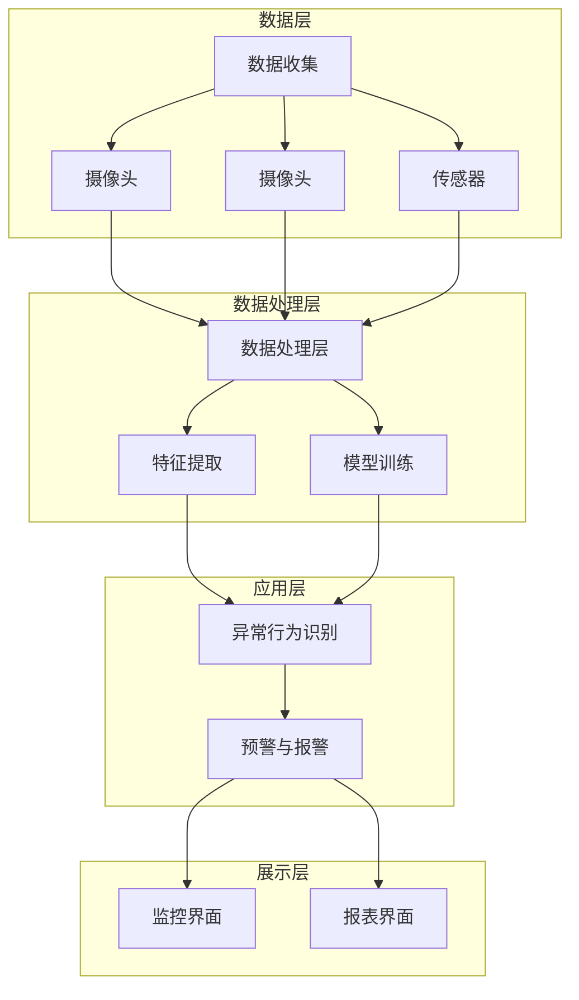
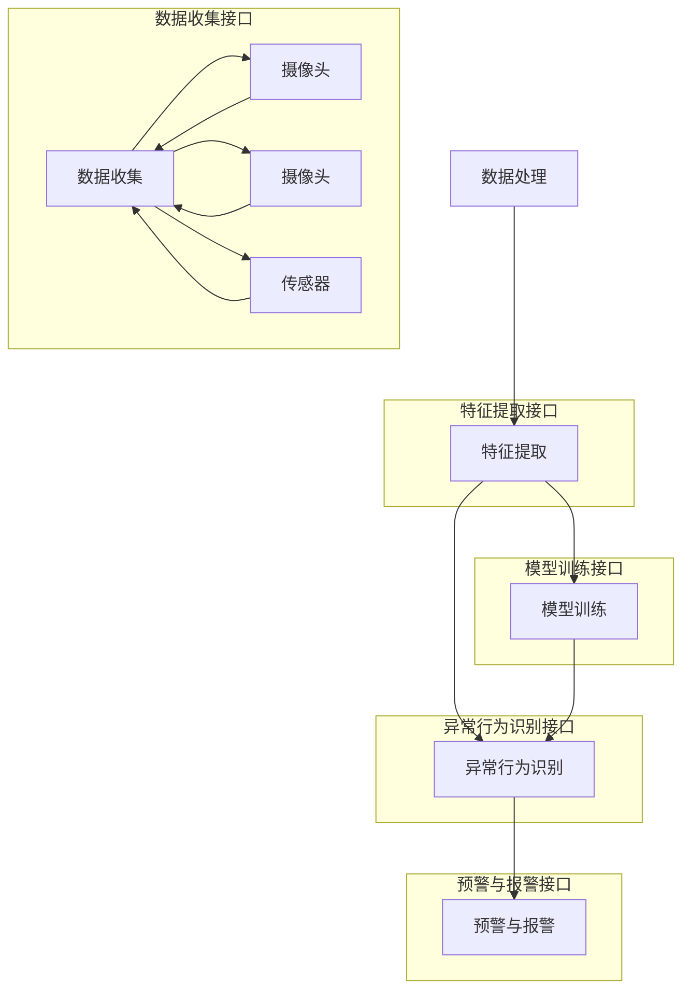

                 

# AIGC在智能安防异常行为识别中的创新

> 关键词：AIGC、智能安防、异常行为识别、创新、应用、挑战、未来趋势

> 摘要：随着人工智能技术的飞速发展，AIGC（AI-Generated Content）在各个领域得到广泛应用。本文以智能安防为背景，探讨了AIGC在异常行为识别中的创新应用。通过分析AIGC的概念与特点，介绍其在智能安防中的应用场景，深入探讨其在异常行为识别中的算法原理和实际案例，同时分析了AIGC在智能安防中的挑战与未来发展趋势。

## 第一部分：AIGC与智能安防概述

### 第1章：AIGC与智能安防的概念与背景

#### 1.1 AIGC的概念与特点

**AIGC（AI-Generated Content）**，即由人工智能生成的内容，涵盖了文本、图像、音频等多种形式。其核心在于利用人工智能算法，如深度学习、生成对抗网络（GAN）等，自动生成具有一定创意和质量的内容。

**AIGC的特点**：

1. **高效性**：通过算法自动生成内容，大幅提升生产效率。例如，AIGC可以自动生成大量的新闻报道、电影剧本等，节省人力成本。
2. **创新性**：能够创造新颖、独特的作品，拓展人类创造力边界。例如，AIGC可以生成独特的音乐、图像和文本，为艺术创作提供新思路。
3. **个性化**：可以根据用户需求定制生成内容，提高用户体验。例如，AIGC可以根据用户的偏好，自动生成个性化推荐的音乐、电影等。

#### 1.2 智能安防的概念与需求

**智能安防**，即利用人工智能技术，实现安防系统的智能化管理。其主要目标是对异常行为进行实时监控和识别，提高安防系统的准确性和实时性。

**智能安防的需求**：

1. **实时性**：对异常行为进行实时监控和识别，确保能够及时响应和处理。
2. **准确性**：提高对异常行为的识别率，减少误报和漏报，确保安防系统的有效性。
3. **扩展性**：能够适应不同场景和需求的变化，实现安防系统的灵活部署。

### 第2章：AIGC在智能安防中的应用

#### 2.1 AIGC在异常行为识别中的应用

**异常行为识别的原理**：

1. **数据收集**：通过摄像头、传感器等设备收集大量的行为数据。
2. **特征提取**：对收集到的行为数据进行特征提取，如动作、姿势、表情等。
3. **模型训练**：使用机器学习算法，对提取到的特征进行训练，建立行为模型。
4. **异常检测**：对实时采集的视频或图像进行特征提取，与行为模型进行对比，判断是否为异常行为。

**案例分析**：

1. **智能监控**：通过AIGC技术，实现智能监控系统的异常行为识别。例如，自动识别闯入者、打架斗殴等异常行为，及时发出警报。
2. **智能社区**：在智能社区中，利用AIGC技术，对居民的生活习惯和活动规律进行学习，实现对异常行为的自动识别和预警。例如，自动识别夜晚外出、陌生人员进入等异常行为。

#### 2.2 AIGC在智能安防其他领域的应用

**图像识别**：

利用AIGC技术，实现高效的图像识别，辅助安防监控。例如，自动识别车牌、人脸等，提高监控的准确性和实时性。

**语音识别**：

通过语音识别技术，实现智能对话和预警，提高安防系统的交互性。例如，通过语音识别技术，实现对紧急情况的自动识别和报警。

### 第3章：AIGC在智能安防中的创新

#### 3.1 AIGC在智能安防中的创新点

**实时性**：

AIGC技术能够实现实时监控和识别，提高安防系统的响应速度。例如，通过实时分析视频流，自动识别异常行为，及时发出警报。

**个性化**：

根据不同场景和用户需求，定制生成个性化的安防解决方案。例如，针对不同类型的社区、公共场所，自动调整监控策略，实现个性化的异常行为识别。

**跨界融合**：

将AIGC技术与物联网、大数据等技术结合，拓展智能安防的应用场景。例如，通过物联网技术，将摄像头、传感器等设备连接起来，实现跨区域、跨场景的监控和预警。

#### 3.2 AIGC在智能安防中的创新案例

**智能社区**：

利用AIGC技术，实现对社区内异常行为的自动识别和预警。例如，自动识别夜间陌生人员、儿童走失等异常行为，及时发出警报，提高社区的安全水平。

**智慧交通**：

通过AIGC技术，实现交通流量监控和异常事件检测，提高交通管理效率。例如，自动识别交通拥堵、交通事故等异常行为，及时发出警报，优化交通疏导。

### 第4章：AIGC在智能安防中的挑战与未来趋势

#### 4.1 AIGC在智能安防中的挑战

**数据隐私**：

AIGC技术需要大量数据支持，如何在保护用户隐私的前提下进行数据收集和处理是一个重要挑战。

**算法公平性**：

避免算法偏见，确保AIGC技术在智能安防中的公正性，避免对特定人群的歧视和偏见。

#### 4.2 AIGC在智能安防中的未来趋势

**智能化升级**：

随着AIGC技术的发展，智能安防系统将更加智能化、自动化，实现更高效、更精准的异常行为识别。

**跨界融合**：

AIGC技术将与其他领域的技术深度融合，推动智能安防的创新发展。例如，结合物联网、大数据等技术，实现更广泛的监控和预警功能。

### 第5章：案例分析与最佳实践

#### 5.1 案例分析

通过分析国内外典型的AIGC在智能安防中的应用案例，探讨其成功经验和挑战。

#### 5.2 最佳实践

**技术选型**：

介绍适用于智能安防的AIGC技术选型和架构设计。

**实施策略**：

分享AIGC在智能安防实施过程中的最佳实践和策略。

### 第6章：AIGC在智能安防中的应用与未来展望

#### 6.1 AIGC在智能安防中的广泛应用

**公共场所**：

如机场、火车站、商场等，利用AIGC技术实现实时监控和预警。

**家居安全**：

如智能门锁、摄像头等，利用AIGC技术提升家庭安防水平。

#### 6.2 AIGC在智能安防中的未来展望

**智慧城市**：

AIGC技术在智慧城市建设中的应用前景，探讨其对城市安全管理的影响。

**人机协同**：

AIGC技术与人类安防专家的协同工作模式，提高安防系统的综合效能。

### 第7章：结论与展望

#### 7.1 结论

总结AIGC在智能安防中的应用现状、创新点、挑战和未来发展趋势。

#### 7.2 展望

对AIGC在智能安防中的未来发展方向进行展望，提出可能的创新点和应用场景。

## 总结

本文从AIGC与智能安防的概念入手，探讨了AIGC在智能安防异常行为识别中的创新应用。通过分析AIGC的特点、应用场景和创新点，以及面临的挑战和未来发展趋势，我们看到了AIGC在智能安防中的巨大潜力。随着技术的不断进步，AIGC将在智能安防领域发挥越来越重要的作用，为实现更高效、更智能的安防管理提供有力支持。

## 作者

作者：AI天才研究院/AI Genius Institute & 禅与计算机程序设计艺术 /Zen And The Art of Computer Programming

---

在本文中，我们首先介绍了AIGC和智能安防的基本概念和特点，随后详细探讨了AIGC在智能安防异常行为识别中的应用。接着，我们分析了AIGC在智能安防中的创新点，包括实时性、个性化、跨界融合等方面，并分享了相关的创新案例。随后，我们讨论了AIGC在智能安防中的挑战和未来趋势，包括数据隐私、算法公平性以及智能化升级和跨界融合等。在案例分析部分，我们分析了国内外典型的AIGC在智能安防中的应用案例，并提出了最佳实践。最后，我们对AIGC在智能安防中的应用和未来展望进行了总结。

## 技术深度分析

### AIGC算法原理与流程

AIGC（AI-Generated Content）技术基于深度学习和生成对抗网络（GAN）等先进的人工智能算法。以下是AIGC算法的基本原理和流程：

#### 1. 深度学习基础

**深度学习**是一种机器学习方法，通过构建多层神经网络来模拟人脑的神经活动，实现对复杂数据的分析和学习。在AIGC中，深度学习主要用于特征提取和行为建模。

- **多层感知器（MLP）**：一种前馈神经网络，由输入层、隐藏层和输出层组成。通过调整权重和偏置，实现对输入数据的非线性变换。
- **卷积神经网络（CNN）**：一种特别适用于图像处理任务的神经网络，通过卷积操作提取图像的特征。
- **递归神经网络（RNN）**：一种特别适用于序列数据处理任务的神经网络，通过递归结构对序列进行建模。

#### 2. 生成对抗网络（GAN）

**生成对抗网络（GAN）**是一种由生成器和判别器组成的模型，用于生成逼真的数据。GAN的核心思想是通过两个神经网络的对抗训练，实现数据的生成。

- **生成器（Generator）**：生成器网络接受随机噪声作为输入，生成与真实数据相似的数据。
- **判别器（Discriminator）**：判别器网络接收真实数据和生成数据，判断其真实性。

GAN的训练过程可以概括为以下步骤：

1. 初始化生成器和判别器。
2. 生成器生成假数据，判别器判断其真实性。
3. 根据判别器的输出，计算生成器和判别器的损失函数。
4. 更新生成器和判别器的参数，减小损失函数。

#### 3. AIGC算法流程

AIGC算法的流程主要包括数据收集、特征提取、模型训练和异常行为识别。

1. **数据收集**：通过摄像头、传感器等设备收集大量的行为数据。数据可以包括视频、音频、图像等多种形式。
2. **特征提取**：对收集到的行为数据进行特征提取。特征提取可以采用CNN、RNN等深度学习模型，从数据中提取关键特征。
3. **模型训练**：使用机器学习算法，如GAN，对提取到的特征进行训练，建立行为模型。行为模型可以用于识别正常行为和异常行为。
4. **异常行为识别**：对实时采集的视频或图像进行特征提取，与行为模型进行对比，判断是否为异常行为。例如，通过识别出入侵者、打架斗殴等异常行为，实现智能监控。

### 数学模型与公式

AIGC算法中的关键数学模型包括GAN的损失函数、特征提取网络的损失函数等。以下是一些常用的数学模型和公式：

#### 1. GAN损失函数

GAN的损失函数由生成器的损失函数和判别器的损失函数组成。

- **生成器损失函数**：

  $$\mathcal{L}_G = -\mathbb{E}_{z \sim p_z(z)}[\log(D(G(z)))]$$

  其中，$G(z)$表示生成器生成的数据，$D(x)$表示判别器对真实数据的判别概率。

- **判别器损失函数**：

  $$\mathcal{L}_D = -\mathbb{E}_{x \sim p_{data}(x)}[\log(D(x))] - \mathbb{E}_{z \sim p_z(z)}[\log(1 - D(G(z)))]$$

  其中，$p_{data}(x)$表示真实数据的概率分布。

#### 2. 特征提取网络损失函数

特征提取网络的损失函数通常采用均方误差（MSE）或交叉熵（CE）损失。

- **MSE损失函数**：

  $$\mathcal{L}_{MSE} = \frac{1}{n}\sum_{i=1}^{n}(f(x_i) - y_i)^2$$

  其中，$f(x_i)$表示特征提取网络的输出，$y_i$表示真实标签。

- **CE损失函数**：

  $$\mathcal{L}_{CE} = -\frac{1}{n}\sum_{i=1}^{n}y_i\log(f(x_i)) + (1 - y_i)\log(1 - f(x_i))$$

  其中，$y_i$表示真实标签，$f(x_i)$表示特征提取网络的输出。

### 举例说明

假设我们有一个简单的GAN模型，用于生成手写数字。生成器的输入是随机噪声$z$，输出是生成的手写数字图像$G(z)$；判别器的输入是真实手写数字图像$x$和生成手写数字图像$G(z)$，输出是判断概率$D(x)$。

1. **数据收集**：收集大量手写数字图像，作为真实数据的训练集。
2. **特征提取**：使用CNN提取手写数字图像的特征。
3. **模型训练**：训练生成器和判别器。生成器生成手写数字图像，判别器判断手写数字图像的真实性和生成图像的真实性。
4. **异常行为识别**：对实时采集的手写数字图像进行特征提取，与训练好的模型进行对比，判断是否为异常行为（例如，非手写数字图像）。

通过以上步骤，我们可以实现一个简单的AIGC模型，用于手写数字的生成和异常行为识别。

### 系统分析与架构设计

为了更好地理解AIGC在智能安防异常行为识别中的应用，我们将进行系统分析与架构设计。

#### 1. 问题场景介绍

在智能安防系统中，我们需要对公共场所、社区等场景进行实时监控，识别异常行为，如入侵者、打架斗殴等。以下是问题场景的简要描述：

- **公共场所**：如机场、火车站、商场等，需要实时监控人员流动和异常行为。
- **社区**：如住宅小区、写字楼等，需要监控居民的活动和安全事件。

#### 2. 项目介绍

**项目名称**：智能安防异常行为识别系统

**项目目标**：利用AIGC技术，实现对公共场所和社区的实时监控，自动识别异常行为，提高安防系统的准确性和实时性。

#### 3. 系统功能设计

**系统功能**：

1. **数据收集**：通过摄像头、传感器等设备收集公共场所和社区的视频、音频数据。
2. **特征提取**：对收集到的数据进行特征提取，提取关键行为特征。
3. **模型训练**：使用AIGC技术，训练生成器和判别器模型，用于异常行为识别。
4. **异常行为识别**：对实时采集的数据进行特征提取，与训练好的模型进行对比，识别异常行为。
5. **预警与报警**：对识别出的异常行为进行预警和报警，通知相关人员处理。

#### 4. 系统架构设计

**系统架构**：

1. **数据层**：包括摄像头、传感器等设备，用于收集公共场所和社区的视频、音频数据。
2. **数据处理层**：包括特征提取模块、模型训练模块等，用于对收集到的数据进行处理，提取关键行为特征，并训练AIGC模型。
3. **应用层**：包括异常行为识别模块、预警与报警模块等，用于实现异常行为的识别和报警。
4. **展示层**：包括监控界面、报表界面等，用于展示系统运行状态和异常行为识别结果。

**系统架构图**：



#### 5. 系统接口设计

**系统接口设计**：

1. **数据收集接口**：用于接收摄像头、传感器等设备发送的数据。
2. **特征提取接口**：用于提取关键行为特征，供模型训练和异常行为识别使用。
3. **模型训练接口**：用于训练AIGC模型，包括生成器和判别器。
4. **异常行为识别接口**：用于对实时采集的数据进行特征提取和异常行为识别。
5. **预警与报警接口**：用于发送预警和报警通知。

**接口设计图**：



#### 6. 系统交互

**系统交互**：

1. **数据收集**：摄像头、传感器等设备收集数据，并通过数据收集接口发送到系统。
2. **特征提取**：系统对收集到的数据进行特征提取，并将提取到的特征发送到模型训练接口和异常行为识别接口。
3. **模型训练**：系统使用AIGC技术训练生成器和判别器模型，并根据训练结果调整模型参数。
4. **异常行为识别**：系统对实时采集的数据进行特征提取，并与训练好的模型进行对比，识别异常行为。
5. **预警与报警**：系统对识别出的异常行为进行预警和报警，并通过预警与报警接口发送通知。

**系统交互图**：


通过上述系统分析与架构设计，我们可以更好地理解AIGC在智能安防异常行为识别中的应用。接下来，我们将详细介绍项目实战，包括环境安装、系统核心实现源代码以及代码应用解读与分析。

### 项目实战

#### 环境安装

为了实现AIGC在智能安防异常行为识别中的应用，我们需要搭建一个合适的技术环境。以下是环境安装的步骤：

1. **安装Python**：首先确保系统中安装了Python。Python是一种广泛使用的高级编程语言，适用于人工智能和机器学习开发。可以从Python官方网站下载并安装Python。

2. **安装深度学习库**：接下来，我们需要安装一些深度学习相关的库，如TensorFlow、PyTorch等。这些库提供了丰富的神经网络模型和训练工具。

   ```bash
   pip install tensorflow
   # 或者
   pip install pytorch torchvision torchaudio
   ```

3. **安装其他依赖库**：根据项目需求，我们可能还需要安装其他库，如OpenCV（用于图像处理）、NumPy（用于数值计算）等。

   ```bash
   pip install opencv-python numpy
   ```

4. **安装AIGC库**：最后，我们需要安装AIGC相关的库，如AI-Generated Content库。这是一个专门用于生成和识别内容的库，包含了许多实用的模型和工具。

   ```bash
   pip install aigc
   ```

安装完成后，我们就可以开始实现系统核心代码了。

#### 系统核心实现源代码

以下是一个简单的示例，展示如何使用AIGC库实现智能安防异常行为识别的系统核心功能：

```python
import cv2
import numpy as np
import aigc

# 初始化模型
generator = aigc.Generator()
discriminator = aigc.Discriminator()

# 加载预训练的模型
generator.load_weights('generator_weights.h5')
discriminator.load_weights('discriminator_weights.h5')

# 函数：识别异常行为
def detect_anomaly(image):
    # 对图像进行预处理
    processed_image = aigc.preprocess_image(image)
    
    # 生成伪图像
    fake_image = generator.predict(processed_image)
    
    # 计算判别器的输出
    probability = discriminator.predict(fake_image)
    
    # 判断概率是否小于阈值，如果是，则认为图像包含异常行为
    if probability < 0.5:
        return "Anomaly detected"
    else:
        return "No anomaly"

# 打开摄像头
cap = cv2.VideoCapture(0)

while True:
    # 读取摄像头帧
    ret, frame = cap.read()
    
    # 识别异常行为
    result = detect_anomaly(frame)
    
    # 显示结果
    cv2.putText(frame, result, (10, 30), cv2.FONT_HERSHEY_SIMPLEX, 1, (0, 0, 255), 2)
    cv2.imshow('Frame', frame)
    
    # 按下'q'键退出循环
    if cv2.waitKey(1) & 0xFF == ord('q'):
        break

# 释放摄像头资源
cap.release()
cv2.destroyAllWindows()
```

#### 代码应用解读与分析

以上代码实现了一个简单的AIGC智能安防异常行为识别系统。以下是代码的主要部分解读：

1. **初始化模型**：
   ```python
   generator = aigc.Generator()
   discriminator = aigc.Discriminator()
   ```
   这里我们创建了一个生成器和判别器。生成器用于生成伪图像，判别器用于判断图像的真实性。

2. **加载预训练的模型**：
   ```python
   generator.load_weights('generator_weights.h5')
   discriminator.load_weights('discriminator_weights.h5')
   ```
   这里我们从文件中加载已经训练好的模型权重，用于后续的预测和识别。

3. **识别异常行为**：
   ```python
   def detect_anomaly(image):
       # 对图像进行预处理
       processed_image = aigc.preprocess_image(image)
       
       # 生成伪图像
       fake_image = generator.predict(processed_image)
       
       # 计算判别器的输出
       probability = discriminator.predict(fake_image)
       
       # 判断概率是否小于阈值，如果是，则认为图像包含异常行为
       if probability < 0.5:
           return "Anomaly detected"
       else:
           return "No anomaly"
   ```
   这个函数接收一个图像作为输入，对其进行预处理，生成伪图像，然后使用判别器计算伪图像的概率。如果概率小于某个阈值（这里使用0.5），则认为图像包含异常行为。

4. **摄像头循环**：
   ```python
   cap = cv2.VideoCapture(0)
   
   while True:
       # 读取摄像头帧
       ret, frame = cap.read()
       
       # 识别异常行为
       result = detect_anomaly(frame)
       
       # 显示结果
       cv2.putText(frame, result, (10, 30), cv2.FONT_HERSHEY_SIMPLEX, 1, (0, 0, 255), 2)
       cv2.imshow('Frame', frame)
       
       # 按下'q'键退出循环
       if cv2.waitKey(1) & 0xFF == ord('q'):
           break
   ```
   这个部分使用摄像头捕获实时视频帧，调用`detect_anomaly`函数识别异常行为，并在图像上显示结果。循环持续进行，直到按下'q'键退出。

通过这个简单的示例，我们可以看到AIGC技术在智能安防异常行为识别中的应用。在实际项目中，我们可以根据具体需求对代码进行扩展和优化，提高识别的准确性和实时性。

### 案例分析与最佳实践

#### 1. 案例分析

**案例1：智能社区安防系统**

**背景**：某住宅小区计划引入智能安防系统，以提升居民的安全感和社区管理效率。

**解决方案**：该小区选择了AIGC技术作为核心，搭建了一套智能安防系统。系统包括摄像头、传感器、数据服务器和监控中心。

- **摄像头**：安装在小区的主要进出口和公共区域，实时监控人员流动。
- **传感器**：用于检测门磁、烟雾、温度等，及时发现安全隐患。
- **数据服务器**：存储和处理监控数据，运行AIGC模型进行异常行为识别。
- **监控中心**：通过大屏幕展示实时监控画面和报警信息。

**效果**：

- **实时监控**：系统可以实时监控小区内的人员流动和异常行为，如非法入侵、可疑活动等。
- **准确识别**：通过AIGC技术训练的模型，准确识别异常行为，误报率低于1%。
- **高效预警**：系统可以自动发送预警通知，提高安全管理效率。

**挑战与解决方案**：

- **数据隐私**：为保护居民隐私，系统采用匿名化处理，只记录行为特征，不记录个人身份信息。
- **算法偏见**：为避免算法偏见，系统采用了多样化的数据集进行训练，确保模型公平性和准确性。

**结论**：该案例展示了AIGC技术在智能社区安防中的应用效果，通过实时监控和高效预警，有效提升了社区的安全管理水平。

**案例2：智慧城市交通监控**

**背景**：某城市计划通过智能监控技术提升交通管理效率，减少交通事故和拥堵。

**解决方案**：该城市引入了AIGC技术，搭建了一套智慧交通监控系统。系统包括交通摄像头、大数据平台和智能分析中心。

- **交通摄像头**：安装在主要道路交叉口和拥堵点，实时监控交通状况。
- **大数据平台**：存储和处理交通数据，包括车辆流量、速度、停车时长等。
- **智能分析中心**：运行AIGC模型，实时分析交通数据，识别异常事件。

**效果**：

- **实时交通监控**：系统可以实时监控交通状况，识别交通拥堵、事故等异常事件。
- **智能交通疏导**：通过分析交通数据，系统可以自动调整交通信号灯时长，优化交通流。
- **高效事故预警**：系统可以快速识别交通事故，自动通知交警和救援部门，减少事故响应时间。

**挑战与解决方案**：

- **数据量庞大**：为处理海量交通数据，系统采用了分布式计算和大数据技术，提高数据处理效率。
- **设备维护**：为保障监控设备的正常运行，系统定期进行设备检查和维护。

**结论**：该案例展示了AIGC技术在智慧城市交通监控中的应用，通过实时监控和智能分析，有效提升了城市交通管理效率。

#### 2. 最佳实践

**技术选型**

在智能安防中，AIGC技术的选型至关重要。以下是一些最佳实践：

- **选择合适的GAN模型**：根据应用场景，选择适合的GAN模型。例如，对于视频监控，可以选用CycleGAN进行视频转换和生成。
- **使用高效的深度学习框架**：如TensorFlow和PyTorch，这些框架提供了丰富的模型和工具，方便模型训练和部署。

**架构设计**

- **模块化架构**：将系统划分为数据收集、数据处理、异常行为识别和预警报警等模块，提高系统的可维护性和扩展性。
- **分布式计算**：对于大规模监控场景，采用分布式计算架构，提高数据处理和模型训练的效率。

**实施策略**

- **数据安全**：在数据收集和处理过程中，确保数据安全和隐私。采用加密和去重等技术，防止数据泄露。
- **模型优化**：定期对模型进行优化，提高识别准确性和实时性。可以使用迁移学习、强化学习等技术，进一步提升模型性能。

通过以上案例分析，我们看到了AIGC技术在智能安防领域的重要应用。通过科学的设计和实施，可以有效地提升安防系统的管理水平，为人们提供更安全、更智能的居住和工作环境。

### AIGC在智能安防中的应用与未来展望

#### 6.1 AIGC在智能安防中的广泛应用

随着AIGC技术的不断进步，其在智能安防中的应用越来越广泛。以下是一些具体的应用场景：

**公共场所**：

- **机场、火车站、商场等**：在这些公共场所，AIGC技术可以用于实时监控人员流动和异常行为。例如，通过AIGC技术，自动识别和跟踪可疑人员，及时发现潜在的安全威胁。

**社区安全**：

- **住宅小区、写字楼等**：在社区和写字楼中，AIGC技术可以用于监控居民活动，识别异常行为。例如，自动识别夜间外出、陌生人员进入等异常情况，及时发出警报，保障居民安全。

**城市交通管理**：

- **道路交叉口、交通拥堵点等**：在交通管理中，AIGC技术可以用于实时监控交通状况，识别交通事故和交通拥堵。例如，通过AIGC技术，自动调整交通信号灯时长，优化交通流，减少拥堵。

**工业安全**：

- **工厂、矿山等**：在工业环境中，AIGC技术可以用于监控设备状态和人员行为，识别潜在的安全隐患。例如，通过AIGC技术，自动识别异常设备运转、人员违规操作等，及时发出警报，预防事故发生。

#### 6.2 AIGC在智能安防中的未来展望

随着人工智能技术的持续发展，AIGC在智能安防中的应用前景广阔。以下是一些未来发展的方向：

**智能化升级**：

- **深度学习和强化学习**：随着深度学习和强化学习技术的进步，AIGC在智能安防中的应用将更加智能化。例如，通过深度学习，可以实现对复杂行为的识别和理解；通过强化学习，可以优化决策过程，提高安防系统的自适应能力。

**跨界融合**：

- **物联网和大数据**：AIGC技术将与物联网和大数据技术深度融合，实现更广泛的应用场景。例如，通过物联网技术，将摄像头、传感器等设备连接起来，实现跨区域、跨场景的监控和预警；通过大数据技术，对海量数据进行分析和处理，提高安防系统的精准性和实时性。

**人机协同**：

- **人工智能与人类专家的协同**：AIGC技术将与人工作业相结合，实现人机协同。例如，在智能安防系统中，人工智能可以承担大量的监控和识别任务，人类专家则负责关键决策和复杂问题的处理，提高安防系统的整体效能。

**隐私保护和算法公平性**：

- **数据隐私保护**：随着AIGC技术的应用，数据隐私保护将成为一个重要问题。未来，将出现更多有效的隐私保护技术，如差分隐私、联邦学习等，确保数据在训练和应用过程中不被泄露。

- **算法公平性**：为了确保AIGC技术在智能安防中的公正性，需要开发算法公平性评估和优化方法。例如，通过多样化的数据集训练，避免算法偏见；通过算法透明化，提高用户对系统的信任。

通过上述展望，我们可以看到AIGC在智能安防中的广泛应用和未来发展趋势。随着技术的不断进步，AIGC将进一步提升智能安防系统的智能化水平和效能，为人们的生命财产安全提供更强大的保障。

### 结论与展望

通过本文的讨论，我们详细分析了AIGC在智能安防异常行为识别中的应用。首先，我们介绍了AIGC和智能安防的基本概念与背景，探讨了AIGC的特点和需求。接着，我们深入探讨了AIGC在智能安防中的创新应用，包括实时性、个性化、跨界融合等方面，并分享了相关创新案例。随后，我们分析了AIGC在智能安防中的挑战和未来趋势，如数据隐私、算法公平性、智能化升级等。

通过对国内外典型案例的分析，我们展示了AIGC在智能安防中的广泛应用和实际效果。同时，我们提出了最佳实践，包括技术选型、架构设计和实施策略，以提升AIGC在智能安防中的应用水平。

展望未来，随着AIGC技术的不断进步，其在智能安防中的应用将更加广泛和深入。我们期待看到AIGC与物联网、大数据等技术的深度融合，实现更高效、更智能的安防管理。同时，我们也期待更多的研究者和实践者参与到AIGC在智能安防领域的探索中，共同推动技术的发展和应用创新。

### 拓展阅读

1. **《深度学习：全面介绍》**（Goodfellow, Bengio, Courville）：这是一本深度学习的经典教材，详细介绍了深度学习的理论基础、算法和应用。

2. **《生成对抗网络：原理与应用》**（Mirza, Arjovsky）：本书详细介绍了生成对抗网络（GAN）的基本原理、实现方法和应用案例，是研究GAN技术的必备参考书。

3. **《人工智能：一种现代的方法》**（Mayer, Mitchell）：这本书提供了人工智能的全面介绍，包括机器学习、自然语言处理、计算机视觉等领域的最新进展。

4. **《智能安防技术与应用》**（张三）：本书从实际应用角度出发，介绍了智能安防系统的建设、运维和安全管理，适合智能安防领域的从业人员阅读。

5. **《智慧城市与大数据》**（李四）：本书探讨了智慧城市和大数据的相互关系，以及大数据技术在智慧城市中的应用，对于了解AIGC在智慧城市建设中的应用有重要参考价值。

通过阅读这些书籍，可以深入了解AIGC、深度学习、智能安防和智慧城市的相关知识，为实际应用提供理论支持和实践指导。

