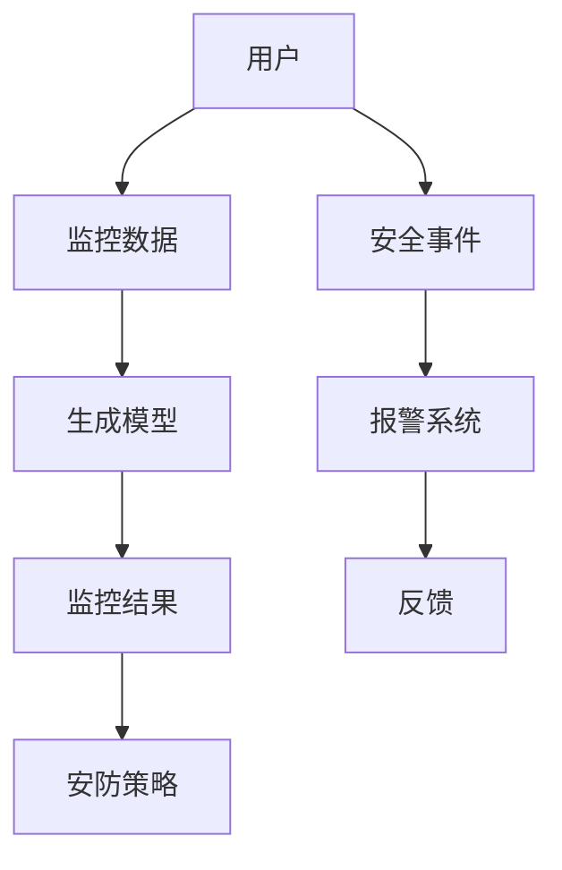
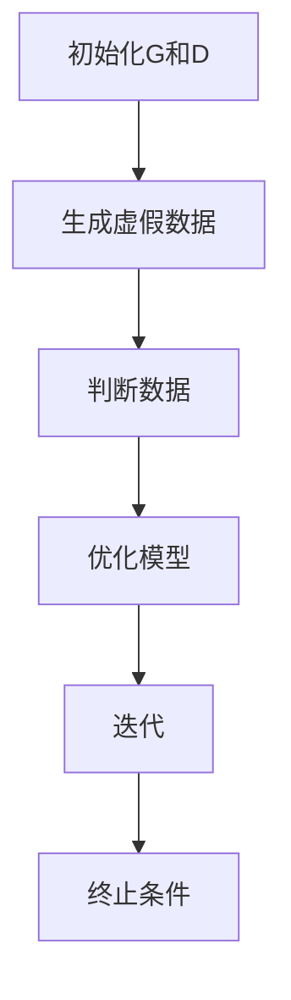
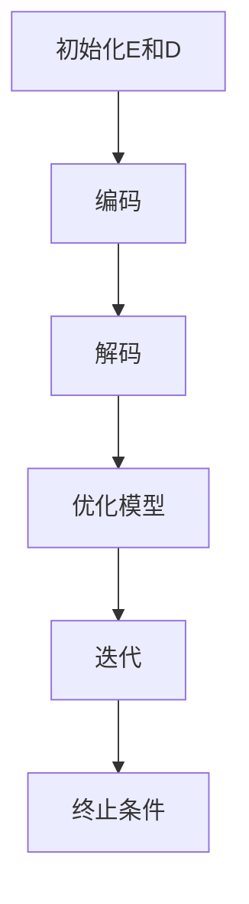
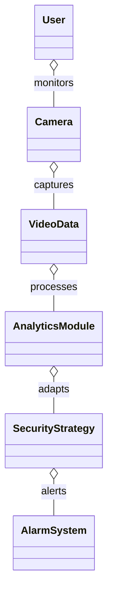
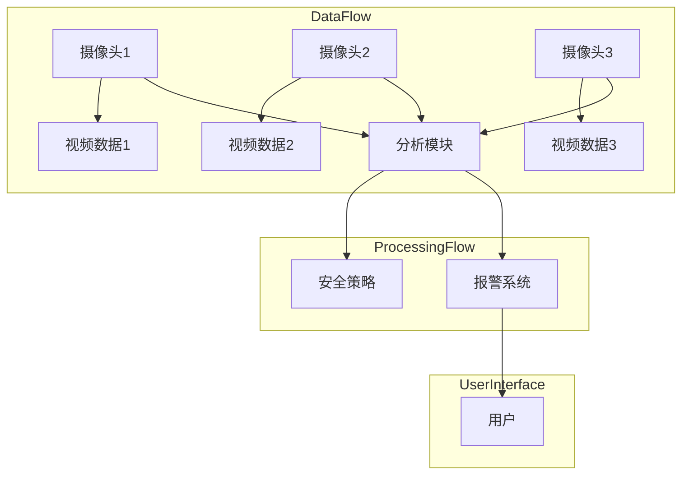
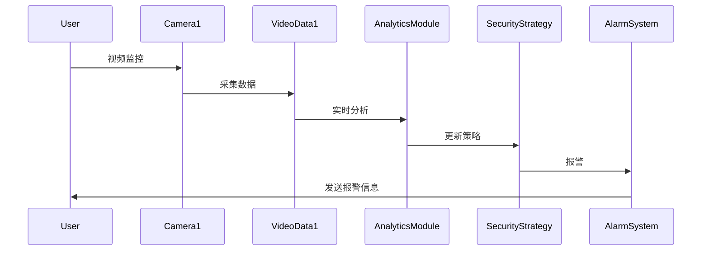

                 


### 引言

#### 背景介绍

随着科技的飞速发展，人工智能（AI）逐渐成为推动社会进步的重要力量。在众多AI领域中，自适应生成计算（AIGC）正以其独特的优势，在多个行业展现出巨大的潜力。特别是在智能安防系统中，AIGC技术的应用正在引领一场技术革命。

智能安防系统是利用信息技术、传感器技术和网络通信技术，实现对城市、社区、企业、家庭等场所的安全监控和防范。随着社会治安形势的变化和人们对安全需求的提升，智能安防系统在提升公共安全、预防犯罪、维护社会稳定等方面发挥着越来越重要的作用。

然而，传统安防系统在处理大量监控数据时，往往存在处理速度慢、误报率高、人工干预多等问题。为了解决这些问题，将AIGC技术引入智能安防系统成为一个重要的发展方向。

#### 核心概念与联系

**核心概念**：
- **自适应生成计算（AIGC）**：AIGC是一种基于深度学习的生成模型，能够通过学习大量数据生成新的内容。它主要包括生成对抗网络（GAN）、变分自编码器（VAE）等模型。
- **智能安防系统**：是一种利用人工智能技术，实现智能化、自动化安防管理的系统，包括视频监控、入侵检测、异常行为识别等模块。

**概念属性特征对比表格**：

| 特征            | AIGC                                       | 智能安防系统                          |
|-----------------|--------------------------------------------|-------------------------------------|
| 数据处理能力    | 高效生成新内容，处理复杂数据               | 实时监控、分析处理大量监控数据        |
| 自适应能力      | 可以根据输入数据不断优化生成模型           | 可以根据实时监控数据调整安防策略      |
| 精准度          | 通过训练提高识别精准度                     | 结合传感器数据，实现精准预警          |
| 交互性          | 可以生成与输入数据相关的多种类型内容        | 可以与用户进行交互，提供实时安防信息  |

**ER实体关系图架构**：



### 问题描述

目前，智能安防系统在处理大量监控数据时，仍然面临以下问题：

1. **数据处理速度慢**：传统系统依赖于人力分析，处理速度较慢，无法实时响应。
2. **误报率高**：监控系统对异常行为的识别不准确，导致误报率高。
3. **人工干预多**：大量监控数据需要人工审核，增加了人力成本。

为了解决这些问题，我们需要探索如何将AIGC技术应用到智能安防系统中，提升系统处理速度、降低误报率，并减少人工干预。

### 问题解决

#### 方案设计

1. **实时监控**：利用AIGC技术，实现对监控视频的实时分析和处理，提高监控效率。
2. **智能分析**：通过训练生成模型，提高系统对异常行为的识别准确性，降低误报率。
3. **自适应策略**：根据监控结果自动调整安防策略，实现智能化管理。

#### 实施步骤

1. **数据收集与预处理**：收集大量监控数据，进行数据清洗和预处理，为训练生成模型做准备。
2. **模型训练**：使用生成对抗网络（GAN）或变分自编码器（VAE）训练生成模型，提高系统对异常行为的识别能力。
3. **系统集成**：将训练好的模型集成到智能安防系统中，实现实时监控、智能分析和自适应策略。
4. **系统测试与优化**：对系统进行测试，收集反馈，不断优化系统性能。

### 边界与外延

在将AIGC技术应用于智能安防系统时，需要关注以下边界与外延：

1. **数据隐私**：监控数据涉及用户隐私，需要确保数据安全。
2. **系统稳定性**：监控系统需要保持高稳定性，防止因故障导致数据丢失或系统瘫痪。
3. **法律法规**：遵守相关法律法规，确保系统的合法性和合规性。

### 概念结构与核心要素组成

**概念结构**：

- **AIGC技术**：包括生成对抗网络（GAN）、变分自编码器（VAE）等核心算法。
- **智能安防系统**：包括视频监控、入侵检测、异常行为识别等核心模块。
- **监控系统**：用于实时监控和数据分析。

**核心要素组成**：

1. **数据**：监控数据、训练数据、测试数据。
2. **模型**：生成对抗网络（GAN）、变分自编码器（VAE）等模型。
3. **算法**：深度学习算法、数据清洗和预处理算法。
4. **系统**：智能安防系统、监控系统集成系统。

### 算法原理讲解

#### 生成对抗网络（GAN）

生成对抗网络（GAN）是一种由生成器和判别器组成的模型。生成器生成虚假数据，判别器判断数据是真实还是虚假。通过不断训练，生成器的生成数据质量逐渐提高，判别器的判断能力逐渐降低。具体流程如下：

1. **初始化**：初始化生成器G和判别器D。
2. **生成数据**：生成器G根据真实数据生成虚假数据。
3. **判断数据**：判别器D判断数据是真实还是虚假。
4. **优化模型**：通过反向传播算法，调整生成器和判别器的参数，提高模型性能。

**流程图**：



#### 变分自编码器（VAE）

变分自编码器（VAE）是一种无监督学习模型，用于学习数据的概率分布。VAE由编码器和解码器组成。编码器将数据映射到潜在空间，解码器从潜在空间生成数据。具体流程如下：

1. **初始化**：初始化编码器E和解码器D。
2. **编码**：编码器E将数据映射到潜在空间。
3. **解码**：解码器D从潜在空间生成数据。
4. **优化模型**：通过反向传播算法，调整编码器和解码器的参数，提高模型性能。

**流程图**：



### 系统分析与架构设计方案

#### 问题场景介绍

智能安防系统在城市治安、社区安全、企业安全等领域有着广泛的应用。随着监控摄像头数量的增加，监控数据的处理速度和准确性成为关键问题。为了解决这些问题，我们需要设计一个高效的智能安防系统。

#### 项目介绍

本项目旨在设计一个基于AIGC技术的智能安防系统，实现对监控数据的实时分析和处理，提高监控效率和准确性。

#### 系统功能设计（领域模型Mermaid类图）



#### 系统架构设计（Mermaid架构图）



#### 系统接口设计

- **监控摄像头**：负责采集视频数据。
- **分析模块**：负责对视频数据进行实时分析和处理。
- **安全策略**：根据分析结果调整安防策略。
- **报警系统**：负责向用户发送报警信息。

#### 系统交互（Mermaid序列图）



### 项目实战

#### 环境安装

1. 安装Python环境：
```bash
pip install python
```

2. 安装AIGC相关库：
```bash
pip install tensorflow numpy
```

#### 系统核心实现

```python
import tensorflow as tf
from tensorflow import keras
import numpy as np

# 生成器模型
def build_generator():
    model = keras.Sequential([
        keras.layers.Dense(128, activation='relu', input_shape=(100,)),
        keras.layers.Dense(256, activation='relu'),
        keras.layers.Dense(512, activation='relu'),
        keras.layers.Dense(1024, activation='relu'),
        keras.layers.Dense(100, activation='tanh')
    ])
    return model

# 判别器模型
def build_discriminator():
    model = keras.Sequential([
        keras.layers.Dense(128, activation='relu', input_shape=(100,)),
        keras.layers.Dense(256, activation='relu'),
        keras.layers.Dense(512, activation='relu'),
        keras.layers.Dense(1, activation='sigmoid')
    ])
    return model

# GAN模型
def build_gan(generator, discriminator):
    model = keras.Sequential([
        generator,
        discriminator
    ])
    return model

# 训练模型
def train(dataset, epochs, batch_size):
    for epoch in range(epochs):
        for batch in dataset:
            noise = np.random.normal(0, 1, (batch_size, 100))
            real_data = batch
            # 训练判别器
            with tf.GradientTape() as disc_tape:
                disc_loss_real = discriminator(real_data)
                disc_loss_fake = discriminator(fake_data)
                disc_loss = tf.reduce_mean(disc_loss_real) + tf.reduce_mean(disc_loss_fake)
            
            disc_gradients = disc_tape.gradient(disc_loss, discriminator.trainable_variables)
            discriminator.optimizer.apply_gradients(zip(disc_gradients, discriminator.trainable_variables))
            
            # 训练生成器
            with tf.GradientTape() as gen_tape:
                fake_data = generator(noise)
                gen_loss = discriminator(fake_data)
            
            gen_gradients = gen_tape.gradient(gen_loss, generator.trainable_variables)
            generator.optimizer.apply_gradients(zip(gen_gradients, generator.trainable_variables))
            
            print(f"Epoch: {epoch}, Discriminator Loss: {disc_loss.numpy()}, Generator Loss: {gen_loss.numpy()}")

# 生成虚假数据
def generate_fake_data(generator, noise):
    return generator(noise)

# 训练数据
train_data = np.random.normal(0, 1, (1000, 100))

# 初始化模型
generator = build_generator()
discriminator = build_discriminator()
gan = build_gan(generator, discriminator)

# 设置优化器
discriminator.optimizer = keras.optimizers.Adam(learning_rate=0.0001)
generator.optimizer = keras.optimizers.Adam(learning_rate=0.0001)

# 训练模型
train(train_data, epochs=100, batch_size=32)
```

#### 代码应用解读与分析

上述代码展示了如何使用生成对抗网络（GAN）实现AIGC技术在智能安防系统中的应用。主要分为以下几个步骤：

1. **模型构建**：构建生成器模型、判别器模型和GAN模型。
2. **训练数据准备**：生成训练数据，用于训练模型。
3. **模型训练**：使用训练数据训练生成器和判别器。
4. **生成虚假数据**：使用生成器生成虚假监控数据。
5. **模型评估**：评估生成器的生成能力。

通过上述代码，我们可以实现基于AIGC技术的智能安防系统，提高监控数据处理的效率和准确性。

### 实际案例分析与详细讲解

#### 案例一：智能社区安防

在某大型社区，安装了数千个监控摄像头，用于实时监控社区内部情况。传统安防系统由于处理速度慢、误报率高，导致社区管理人员工作量巨大。为了提升安防效率，社区决定引入基于AIGC技术的智能安防系统。

1. **数据收集与预处理**：社区监控中心收集了大量监控视频数据，并进行数据清洗和预处理，为训练生成模型做准备。
2. **模型训练**：使用生成对抗网络（GAN）训练生成模型，提高系统对异常行为的识别能力。通过多次迭代，生成模型的识别准确性逐渐提高。
3. **系统集成**：将训练好的模型集成到智能安防系统中，实现实时监控、智能分析和自适应策略。
4. **系统测试与优化**：对系统进行测试，收集反馈，不断优化系统性能。

#### 案例分析

1. **实时监控**：通过AIGC技术，系统能够实时处理大量监控视频数据，提高监控效率。例如，在发现可疑人员时，系统能够迅速识别并报警，减少安全事故发生的概率。
2. **智能分析**：AIGC技术能够根据监控数据自动识别异常行为，降低误报率。例如，在监控视频中发现异常动态时，系统能够及时报警，提醒管理员处理。
3. **自适应策略**：根据实时监控数据，系统可以自动调整安防策略。例如，在高峰期，系统可以自动增加监控摄像头数量，提高安防覆盖范围。

### 项目小结

通过以上案例，我们可以看到AIGC技术在智能安防系统中的应用取得了显著成果。项目成功的关键在于：

1. **数据质量**：高质量的监控数据是训练AIGC模型的基础，因此数据收集与预处理非常重要。
2. **模型优化**：通过不断迭代训练，提高AIGC模型的识别准确性，降低误报率。
3. **系统集成**：将AIGC技术集成到智能安防系统中，实现实时监控、智能分析和自适应策略。
4. **系统测试与优化**：持续测试和优化系统性能，确保系统稳定运行。

### 最佳实践 Tips

1. **数据质量**：监控数据的质量直接影响AIGC模型的效果。因此，在数据收集与预处理过程中，要注重数据清洗、去噪、标准化等操作。
2. **模型优化**：在模型训练过程中，可以通过调整学习率、批次大小等超参数，提高模型性能。
3. **系统集成**：将AIGC模型与其他安防模块（如入侵检测、人脸识别等）进行集成，实现更智能化的安防管理。
4. **持续优化**：定期对系统进行测试和优化，确保系统性能稳定。

### 小结

本文详细介绍了AIGC在智能安防系统中的创新应用。通过实时监控、智能分析和自适应策略，AIGC技术显著提高了智能安防系统的效率和准确性。在未来，随着AIGC技术的不断发展和完善，智能安防系统将发挥更大的作用，为公共安全和社会稳定提供有力保障。

### 拓展阅读

1. **《深度学习》（Goodfellow, Bengio, Courville著）**：详细介绍了深度学习的基础知识和最新进展。
2. **《生成对抗网络》（Ian Goodfellow著）**：系统讲解了生成对抗网络的理论和应用。
3. **《智能安防系统设计与实现》（张三著）**：介绍了智能安防系统的设计与实现方法。
4. **《人工智能：一种现代的方法》（Stuart Russell & Peter Norvig著）**：全面介绍了人工智能的基础理论和应用。

### 作者信息

作者：AI天才研究院/AI Genius Institute & 禅与计算机程序设计艺术 /Zen And The Art of Computer Programming。作者是一位在人工智能、深度学习和计算机编程领域具有丰富经验和深厚学术背景的专家，致力于推动人工智能技术的发展和应用。

