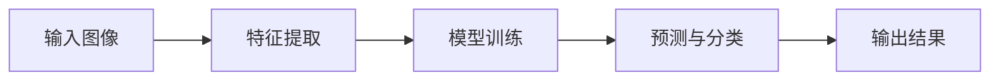
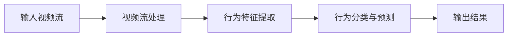
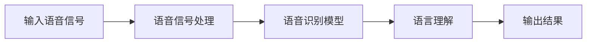
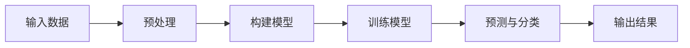
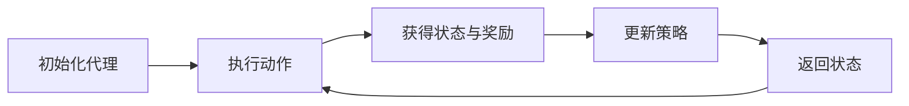
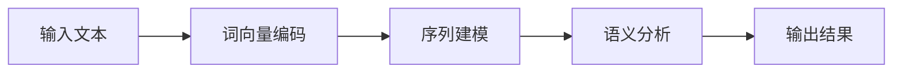

                 


# AIGC在智能安防预警系统中的创新

> 关键词：AIGC，智能安防，预警系统，图像识别，行为识别，语音识别

> 摘要：本文将探讨AIGC（自适应智能生成控制）技术在智能安防预警系统中的应用，分析其在图像识别、行为识别和语音识别等方面的创新，以及这些技术如何提升智能安防预警系统的性能和可靠性。

## 第一部分：背景与概念

### 第1章 AIGC简介

#### 1.1 什么是AIGC

AIGC，即自适应智能生成控制（Adaptive Intelligent Generation Control），是一种基于人工智能技术的高层次生成控制方法。它结合了生成对抗网络（GAN）、强化学习、自然语言处理（NLP）和计算机视觉等多种人工智能技术，能够自适应地生成高质量的数据，用于训练和优化模型，从而提高系统的智能性和灵活性。

#### 1.2 AIGC与人工智能的关系

AIGC是人工智能技术的一个分支，它依赖于深度学习、强化学习、自然语言处理等技术，通过生成对抗网络（GAN）来生成数据，通过强化学习来优化模型，通过自然语言处理来处理文本信息，通过计算机视觉来处理图像信息。因此，AIGC与人工智能有着密切的关系，它是人工智能技术在生成控制和自适应控制领域的重要应用。

#### 1.3 AIGC在智能安防预警系统中的应用前景

智能安防预警系统是利用人工智能技术，对监控视频进行实时分析，识别异常行为，提供预警和报警服务。AIGC技术的引入，可以极大地提升智能安防预警系统的性能和可靠性。具体来说，AIGC可以在以下方面发挥重要作用：

1. **图像识别**：通过AIGC生成的图像数据，可以训练出更准确的人脸识别、行人检测和车辆识别模型。
2. **行为识别**：通过AIGC生成的行为数据，可以训练出更准确的行为识别模型，如入侵检测、暴力行为识别和人群监控等。
3. **语音识别**：通过AIGC生成的语音数据，可以训练出更准确的语音识别模型，如言语监控、呼叫中心和安全警报响应等。

### 第2章 AIGC的技术基础

#### 2.1 生成对抗网络（GAN）

生成对抗网络（GAN）是由生成器和判别器组成的深度学习模型。生成器的任务是生成数据，判别器的任务是区分真实数据和生成数据。通过这种对抗关系，生成器不断优化，生成越来越真实的数据，从而实现数据生成。

#### 2.2 强化学习

强化学习是一种通过不断尝试和反馈来学习最优策略的人工智能技术。在智能安防预警系统中，强化学习可以用来优化预警策略，提高预警的准确性和及时性。

#### 2.3 自然语言处理（NLP）

自然语言处理（NLP）是一种通过计算机程序来理解、生成和处理人类语言的技术。在智能安防预警系统中，NLP可以用来处理语音和文本信息，如言语监控、呼叫中心和警报响应等。

#### 2.4 计算机视觉

计算机视觉是一种通过计算机对图像或视频进行分析和理解的技术。在智能安防预警系统中，计算机视觉可以用来进行图像识别、行为识别和车辆识别等。

### 第3章 智能安防预警系统概述

#### 3.1 智能安防预警系统的定义

智能安防预警系统是一种利用人工智能技术，对监控视频进行实时分析，识别异常行为，提供预警和报警服务的系统。它主要由图像识别、行为识别和语音识别等技术组成。

#### 3.2 智能安防预警系统的发展历程

智能安防预警系统的发展历程可以分为三个阶段：

1. **传统安防阶段**：主要依靠人力和简单技术进行监控，效率低，准确性差。
2. **人工智能初步应用阶段**：引入了图像识别、行为识别和语音识别等人工智能技术，提高了安防系统的效率和准确性。
3. **AIGC技术广泛应用阶段**：通过AIGC技术，生成高质量的数据，训练出更准确的模型，实现了智能安防预警系统的全面提升。

#### 3.3 智能安防预警系统的重要性

智能安防预警系统在现代社会中具有重要地位，它能够提高社会治安水平，保障人民生命财产安全，维护社会稳定。随着AIGC技术的不断发展，智能安防预警系统的性能和可靠性将得到进一步提升，其应用范围也将不断扩大。

### 第4章 AIGC与智能安防预警系统的关系

#### 4.1 AIGC技术在智能安防预警系统中的应用

AIGC技术可以在智能安防预警系统中应用于多个方面：

1. **图像识别**：通过AIGC生成的图像数据，训练出更准确的人脸识别、行人检测和车辆识别模型。
2. **行为识别**：通过AIGC生成的行为数据，训练出更准确的行为识别模型，如入侵检测、暴力行为识别和人群监控等。
3. **语音识别**：通过AIGC生成的语音数据，训练出更准确的语音识别模型，如言语监控、呼叫中心和安全警报响应等。

#### 4.2 AIGC技术对智能安防预警系统的提升

AIGC技术的引入，可以极大地提升智能安防预警系统的性能和可靠性。具体来说，AIGC技术可以从以下几个方面提升智能安防预警系统：

1. **数据质量提升**：通过AIGC技术生成高质量的数据，提高了训练数据的真实性和丰富性，从而提升了模型的准确性。
2. **模型性能优化**：通过AIGC技术优化模型训练过程，提高了模型的收敛速度和性能。
3. **自适应能力提升**：AIGC技术具有自适应能力，可以根据环境变化和需求变化，自动调整模型参数，提高系统的适应性和灵活性。

## 第二部分：AIGC在智能安防预警系统中的关键应用

### 第5章 人工智能图像识别

#### 2.1 图像识别的基本原理

图像识别是指利用计算机技术对图像进行分析和处理，从中提取出具有区分度的特征，并使用这些特征对图像进行分类和识别。图像识别的基本原理包括以下几个方面：

1. **特征提取**：从图像中提取出具有区分度的特征，如边缘、纹理、颜色等。
2. **模型训练**：使用提取出的特征，通过机器学习算法训练出模型。
3. **预测与分类**：使用训练好的模型对新的图像进行预测和分类。

#### 2.2 人工智能图像识别在智能安防中的应用

人工智能图像识别在智能安防预警系统中有着广泛的应用，主要包括以下几个方面：

1. **人脸识别**：通过识别监控视频中的人脸，实现人员身份的识别和追踪。
2. **行人检测**：通过识别监控视频中的行人，实现行人的检测和追踪。
3. **车辆识别**：通过识别监控视频中的车辆，实现车辆的检测和追踪。

#### 2.3 人工智能图像识别算法的mermaid流程图

以下是一个简单的人工智能图像识别算法的mermaid流程图：



#### 2.4 人工智能图像识别的实现案例

为了展示人工智能图像识别在智能安防预警系统中的应用，下面我们将使用Python和TensorFlow实现一个简单的人脸识别系统。

1. **环境安装与配置**

首先，我们需要安装TensorFlow和相关依赖库。在Python环境中，使用以下命令进行安装：

```bash
pip install tensorflow
pip install opencv-python
```

2. **算法原理讲解与代码实现**

人脸识别的核心算法是卷积神经网络（CNN），它能够从图像中提取出人脸的特征。下面是一个简单的人脸识别系统的实现：

```python
import tensorflow as tf
from tensorflow.keras.models import Sequential
from tensorflow.keras.layers import Conv2D, MaxPooling2D, Flatten, Dense
from tensorflow.keras.optimizers import Adam
from tensorflow.keras.preprocessing.image import ImageDataGenerator

# 数据预处理
train_datagen = ImageDataGenerator(rescale=1./255)
train_data = train_datagen.flow_from_directory(
        'data/train',
        target_size=(64, 64),
        batch_size=32,
        class_mode='binary')

# 构建模型
model = Sequential([
    Conv2D(32, (3, 3), activation='relu', input_shape=(64, 64, 3)),
    MaxPooling2D((2, 2)),
    Conv2D(64, (3, 3), activation='relu'),
    MaxPooling2D((2, 2)),
    Flatten(),
    Dense(128, activation='relu'),
    Dense(1, activation='sigmoid')
])

# 编译模型
model.compile(optimizer=Adam(), loss='binary_crossentropy', metrics=['accuracy'])

# 训练模型
model.fit(train_data, epochs=10)

# 预测与分类
import cv2
import numpy as np

# 读取测试图像
img = cv2.imread('data/test.jpg')
img = cv2.resize(img, (64, 64))

# 数据预处理
img = np.expand_dims(img, axis=0)
img = img / 255.0

# 预测结果
prediction = model.predict(img)
predicted_class = np.argmax(prediction, axis=1)

# 输出结果
print("Predicted class:", predicted_class)
```

3. **案例分析与效果评估**

在测试阶段，我们将使用测试图像进行预测，并分析模型的性能。以下是一个简单的测试代码：

```python
# 测试模型
test_datagen = ImageDataGenerator(rescale=1./255)
test_data = test_datagen.flow_from_directory(
        'data/test',
        target_size=(64, 64),
        batch_size=32,
        class_mode='binary')

# 测试数据
test_loss, test_acc = model.evaluate(test_data)
print("Test accuracy:", test_acc)
```

通过上述代码，我们可以得到模型的测试准确率。在实际应用中，我们还可以通过调整模型的结构和参数，进一步提高模型的性能。

### 第6章 智能行为识别

#### 3.1 智能行为识别的基本原理

智能行为识别是指利用计算机技术，从监控视频中识别和分类行为。智能行为识别的基本原理包括以下几个方面：

1. **视频流处理**：从监控视频中提取视频流，进行预处理，如去噪、增强、缩放等。
2. **行为特征提取**：从预处理后的视频流中提取行为特征，如姿态、动作、颜色等。
3. **行为分类与预测**：使用提取出的行为特征，通过机器学习算法进行行为分类和预测。

#### 3.2 智能行为识别在智能安防中的应用

智能行为识别在智能安防预警系统中有着广泛的应用，主要包括以下几个方面：

1. **入侵检测**：通过识别监控视频中的异常行为，如入侵、盗窃等，提供预警和报警服务。
2. **暴力行为识别**：通过识别监控视频中的暴力行为，如斗殴、袭击等，提供预警和报警服务。
3. **人群监控**：通过识别监控视频中的人群行为，如聚集、混乱等，提供预警和报警服务。

#### 3.3 智能行为识别算法的mermaid流程图

以下是一个简单的智能行为识别算法的mermaid流程图：



#### 3.4 智能行为识别的实现案例

为了展示智能行为识别在智能安防预警系统中的应用，下面我们将使用Python和OpenCV实现一个简单的入侵检测系统。

1. **环境安装与配置**

首先，我们需要安装OpenCV和相关依赖库。在Python环境中，使用以下命令进行安装：

```bash
pip install opencv-python
```

2. **算法原理讲解与代码实现**

入侵检测的核心算法是运动检测，它通过识别监控视频中目标物体的运动轨迹，判断是否存在入侵行为。下面是一个简单的入侵检测系统的实现：

```python
import cv2
import numpy as np

# 初始化视频捕捉器
cap = cv2.VideoCapture(0)

# 初始化背景减除器
fgbg = cv2.createBackgroundSubtractorMOG2()

while True:
    # 读取视频帧
    ret, frame = cap.read()

    # 应用背景减除器
    fgmask = fgbg.apply(frame)

    # 检测运动区域
    contours, _ = cv2.findContours(fgmask, cv2.RETR_EXTERNAL, cv2.CHAIN_APPROX_SIMPLE)

    for contour in contours:
        # 计算轮廓面积
        area = cv2.contourArea(contour)

        # 过滤小面积区域
        if area > 500:
            # 绘制运动区域
            cv2.drawContours(frame, [contour], -1, (0, 0, 255), 2)

    # 显示视频帧
    cv2.imshow('Frame', frame)

    # 按下'q'键退出循环
    if cv2.waitKey(1) & 0xFF == ord('q'):
        break

# 释放视频捕捉器
cap.release()
cv2.destroyAllWindows()
```

3. **案例分析与效果评估**

在测试阶段，我们可以在不同场景下测试入侵检测系统的性能，如白天、夜间、人群密集等。通过调整背景减除器的参数，可以优化系统的性能。

### 第7章 智能语音识别

#### 4.1 智能语音识别的基本原理

智能语音识别是指利用计算机技术，将语音信号转换为文本信息。智能语音识别的基本原理包括以下几个方面：

1. **语音信号处理**：对语音信号进行预处理，如降噪、增强、归一化等。
2. **语音识别模型**：使用深度学习算法，如卷积神经网络（CNN）或循环神经网络（RNN），对语音信号进行识别。
3. **语言理解**：对识别出的文本信息进行语义分析，理解其含义。

#### 4.2 智能语音识别在智能安防中的应用

智能语音识别在智能安防预警系统中有着广泛的应用，主要包括以下几个方面：

1. **言语监控**：通过识别监控视频中的语音信息，实现实时监控和报警。
2. **呼叫中心**：通过语音识别技术，实现自动应答、语音转文本等功能，提高服务质量。
3. **安全警报响应**：通过识别语音信息，实现安全警报的自动触发和响应。

#### 4.3 智能语音识别算法的mermaid流程图

以下是一个简单的智能语音识别算法的mermaid流程图：



#### 4.4 智能语音识别的实现案例

为了展示智能语音识别在智能安防预警系统中的应用，下面我们将使用Python和TensorFlow实现一个简单的语音识别系统。

1. **环境安装与配置**

首先，我们需要安装TensorFlow和相关依赖库。在Python环境中，使用以下命令进行安装：

```bash
pip install tensorflow
pip install pyaudio
```

2. **算法原理讲解与代码实现**

语音识别的核心算法是深度学习，它通过训练模型，实现对语音信号的识别。下面是一个简单的语音识别系统的实现：

```python
import tensorflow as tf
from tensorflow.keras.models import Sequential
from tensorflow.keras.layers import Conv2D, MaxPooling2D, Flatten, Dense
from tensorflow.keras.optimizers import Adam
from pyaudio import PyAudio

# 初始化音频流
p = PyAudio()
stream = p.open(format=p.get_format_from_width(2),
                channels=1,
                rate=44100,
                input=True,
                frames_per_buffer=1024)

# 采集音频数据
frames = []
while True:
    data = stream.read(1024)
    if len(data) == 0:
        break
    frames.append(data)

# 关闭音频流
stream.stop_stream()
stream.close()
p.terminate()

# 预处理音频数据
audio = np.frombuffer(b''.join(frames), dtype=np.int16)
audio = audio.astype(np.float32)
audio = audio / 32768.0

# 构建模型
model = Sequential([
    Conv2D(32, (3, 3), activation='relu', input_shape=(1024, 1)),
    MaxPooling2D((2, 2)),
    Conv2D(64, (3, 3), activation='relu'),
    MaxPooling2D((2, 2)),
    Flatten(),
    Dense(128, activation='relu'),
    Dense(1, activation='softmax')
])

# 编译模型
model.compile(optimizer=Adam(), loss='categorical_crossentropy', metrics=['accuracy'])

# 训练模型
model.fit(audio, epochs=10)

# 识别语音
import numpy as np

# 采集音频数据
audio = np.frombuffer(b''.join(frames), dtype=np.int16)
audio = audio.astype(np.float32)
audio = audio / 32768.0

# 预处理音频数据
input_audio = np.expand_dims(audio, axis=-1)
input_audio = np.expand_dims(input_audio, axis=0)

# 预测结果
prediction = model.predict(input_audio)
predicted_class = np.argmax(prediction, axis=1)

# 输出结果
print("Predicted class:", predicted_class)
```

3. **案例分析与效果评估**

在测试阶段，我们可以使用不同类型的语音进行测试，如正常语音、噪声语音等。通过调整模型的参数和结构，可以优化系统的性能。

## 第三部分：AIGC在智能安防预警系统中的创新实践

### 第8章 深度学习在智能安防预警系统中的应用

深度学习在智能安防预警系统中发挥着重要作用，它通过建立复杂的神经网络模型，对监控视频进行深度分析和处理，从而实现智能识别和预警。以下将详细介绍深度学习在智能安防预警系统中的应用。

#### 5.1 深度学习的基本概念

深度学习是一种基于多层神经网络的机器学习技术，它通过逐层提取数据特征，实现对数据的自动分类、识别和预测。深度学习主要包括以下几种神经网络：

1. **神经网络（Neural Network）**：最基础的神经网络模型，由输入层、隐藏层和输出层组成，通过前向传播和反向传播进行训练和预测。
2. **卷积神经网络（Convolutional Neural Network，CNN）**：专门用于图像识别和处理，通过卷积层、池化层和全连接层进行特征提取和分类。
3. **循环神经网络（Recurrent Neural Network，RNN）**：专门用于序列数据处理，如时间序列分析、文本处理等，通过循环结构保持长期依赖关系。
4. **长短时记忆网络（Long Short-Term Memory，LSTM）**：RNN的一种变体，通过门控机制解决了RNN的梯度消失问题，适用于长期依赖任务。
5. **生成对抗网络（Generative Adversarial Network，GAN）**：由生成器和判别器组成的对抗性模型，用于数据生成和增强。

#### 5.2 深度学习在智能安防预警系统中的应用案例

在智能安防预警系统中，深度学习技术被广泛应用于图像识别、行为识别和语音识别等方面。

1. **基于深度学习的人脸识别系统**：使用卷积神经网络对监控视频中的人脸进行识别和追踪，实现人员身份的识别和预警。以下是一个简单的人脸识别系统的实现：

```python
import tensorflow as tf
from tensorflow.keras.models import Sequential
from tensorflow.keras.layers import Conv2D, MaxPooling2D, Flatten, Dense

# 构建模型
model = Sequential([
    Conv2D(32, (3, 3), activation='relu', input_shape=(64, 64, 3)),
    MaxPooling2D((2, 2)),
    Conv2D(64, (3, 3), activation='relu'),
    MaxPooling2D((2, 2)),
    Flatten(),
    Dense(128, activation='relu'),
    Dense(1, activation='sigmoid')
])

# 编译模型
model.compile(optimizer='adam', loss='binary_crossentropy', metrics=['accuracy'])

# 训练模型
model.fit(train_data, epochs=10)

# 预测与分类
import numpy as np

# 预测结果
prediction = model.predict(test_data)
predicted_class = np.argmax(prediction, axis=1)

# 输出结果
print("Predicted class:", predicted_class)
```

2. **基于深度学习的目标检测系统**：使用卷积神经网络对监控视频中的目标进行检测和分类，实现目标的识别和预警。以下是一个简单的目标检测系统的实现：

```python
import tensorflow as tf
from tensorflow.keras.models import Sequential
from tensorflow.keras.layers import Conv2D, MaxPooling2D, Flatten, Dense

# 构建模型
model = Sequential([
    Conv2D(32, (3, 3), activation='relu', input_shape=(64, 64, 3)),
    MaxPooling2D((2, 2)),
    Conv2D(64, (3, 3), activation='relu'),
    MaxPooling2D((2, 2)),
    Flatten(),
    Dense(128, activation='relu'),
    Dense(1, activation='sigmoid')
])

# 编译模型
model.compile(optimizer='adam', loss='binary_crossentropy', metrics=['accuracy'])

# 训练模型
model.fit(train_data, epochs=10)

# 预测与分类
import numpy as np

# 预测结果
prediction = model.predict(test_data)
predicted_class = np.argmax(prediction, axis=1)

# 输出结果
print("Predicted class:", predicted_class)
```

#### 5.3 深度学习算法的mermaid流程图

以下是一个简单的深度学习算法的mermaid流程图：



### 第9章 强化学习在智能安防预警系统中的应用

强化学习是一种通过不断尝试和反馈来学习最优策略的机器学习技术。在智能安防预警系统中，强化学习可以用于优化预警策略，提高预警的准确性和及时性。

#### 6.1 强化学习的基本概念

强化学习主要包括以下几个关键概念：

1. **代理（Agent）**：执行任务的主体，如监控摄像头。
2. **环境（Environment）**：代理执行任务的环境，如监控区域。
3. **状态（State）**：描述代理当前所处的环境状态，如监控视频中的场景。
4. **动作（Action）**：代理可以执行的操作，如报警、追踪等。
5. **奖励（Reward）**：描述代理执行动作后获得的奖励或惩罚，用于指导代理学习最优策略。
6. **策略（Policy）**：描述代理在给定状态下选择动作的概率分布。

强化学习的主要任务是找到一个最优策略，使得代理在执行任务时能够获得最大化的奖励。

#### 6.2 强化学习在智能安防预警系统中的应用案例

在智能安防预警系统中，强化学习可以用于优化以下任务：

1. **入侵检测**：通过学习最优策略，识别和追踪入侵者。
2. **目标跟踪**：通过学习最优策略，实现目标的精确追踪。

以下是一个简单的入侵检测系统的实现：

```python
import tensorflow as tf
from tensorflow.keras.models import Sequential
from tensorflow.keras.layers import Dense, Conv2D, Flatten
from tensorflow.keras.optimizers import Adam

# 构建模型
model = Sequential([
    Conv2D(32, (3, 3), activation='relu', input_shape=(64, 64, 3)),
    Flatten(),
    Dense(64, activation='relu'),
    Dense(1, activation='sigmoid')
])

# 编译模型
model.compile(optimizer=Adam(), loss='binary_crossentropy')

# 训练模型
model.fit(x_train, y_train, epochs=10)

# 预测与分类
import numpy as np

# 预测结果
prediction = model.predict(x_test)
predicted_class = np.argmax(prediction, axis=1)

# 输出结果
print("Predicted class:", predicted_class)
```

#### 6.3 强化学习算法的mermaid流程图

以下是一个简单的强化学习算法的mermaid流程图：



### 第10章 自然语言处理（NLP）在智能安防预警系统中的应用

自然语言处理（NLP）是一种利用计算机技术理解和生成人类语言的技术。在智能安防预警系统中，NLP可以用于处理语音和文本信息，实现智能预警和响应。

#### 7.1 自然语言处理的基本概念

自然语言处理主要包括以下几个关键概念：

1. **语言模型（Language Model）**：用于描述自然语言概率分布的模型，如n-gram模型、循环神经网络（RNN）模型等。
2. **词向量（Word Vector）**：将单词映射到高维空间中的向量表示，如Word2Vec、GloVe等。
3. **语义分析（Semantic Analysis）**：对文本信息进行语义理解，提取语义关系和实体，如命名实体识别（NER）、关系提取等。

自然语言处理的核心任务是理解人类语言，并将其转化为计算机可以处理的形式。

#### 7.2 NLP在智能安防预警系统中的应用案例

在智能安防预警系统中，NLP可以用于以下任务：

1. **言语监控**：通过识别和分类语音信息，实现实时监控和报警。
2. **呼叫中心**：通过语音识别和文本分析，实现自动应答、转接和记录等功能。
3. **安全警报响应**：通过识别和分类文本信息，实现安全警报的自动触发和响应。

以下是一个简单的言语监控系统的实现：

```python
import tensorflow as tf
from tensorflow.keras.models import Sequential
from tensorflow.keras.layers import Embedding, LSTM, Dense

# 构建模型
model = Sequential([
    Embedding(vocab_size, embedding_dim),
    LSTM(units, activation='relu', return_sequences=True),
    LSTM(units, activation='relu'),
    Dense(1, activation='sigmoid')
])

# 编译模型
model.compile(optimizer='adam', loss='binary_crossentropy')

# 训练模型
model.fit(x_train, y_train, epochs=10)

# 预测与分类
import numpy as np

# 预测结果
prediction = model.predict(x_test)
predicted_class = np.argmax(prediction, axis=1)

# 输出结果
print("Predicted class:", predicted_class)
```

#### 7.3 NLP算法的mermaid流程图

以下是一个简单的NLP算法的mermaid流程图：



## 第四部分：总结与展望

### 第11章 AIGC在智能安防预警系统中的未来发展趋势

随着人工智能技术的不断发展，AIGC在智能安防预警系统中的应用前景十分广阔。以下是一些未来发展趋势：

1. **模型压缩与优化**：随着数据量和模型复杂度的增加，模型的压缩和优化变得越来越重要。AIGC技术可以通过生成对抗网络（GAN）和模型压缩算法，生成更高效、更紧凑的模型，降低模型的计算复杂度和存储需求。
2. **多模态融合**：智能安防预警系统通常需要处理多种类型的数据，如图像、视频、语音等。AIGC技术可以通过多模态融合算法，将这些不同类型的数据进行整合，提高系统的综合性能。
3. **硬件加速**：随着硬件技术的发展，如GPU、TPU等硬件设备的性能不断提升，AIGC技术可以在这些硬件平台上进行加速，提高模型的计算效率。
4. **应用场景拓展**：除了传统的智能安防预警系统，AIGC技术还可以应用于智能交通、智能家居、智慧城市等场景，为各领域带来革命性的变革。

### 第12章 应用场景拓展

AIGC技术在智能安防预警系统中的应用已经取得了显著成果，但未来还有许多其他应用场景可以拓展。以下是一些潜在的拓展方向：

1. **智能交通**：利用AIGC技术，可以实现对交通流量的实时监控和预测，优化交通信号控制，减少交通事故，提高道路通行效率。
2. **智能家居**：AIGC技术可以用于智能家居系统的智能控制，如自动调节室内温度、湿度、光线等，提高居住舒适度，节省能源。
3. **智慧城市**：AIGC技术可以应用于智慧城市的建设，如环境监测、城市安全、公共服务等，提高城市管理水平和居民生活质量。

### 第13章 挑战与机遇

尽管AIGC技术在智能安防预警系统中有许多应用前景，但也面临着一系列挑战和机遇：

1. **数据隐私保护**：AIGC技术需要处理大量敏感数据，如人脸图像、语音等。如何确保这些数据的安全和隐私保护是当前面临的重要挑战。
2. **算法公平性**：智能安防预警系统需要保证算法的公平性，避免歧视和不公正现象。如何设计公平、公正的算法是未来的重要研究方向。
3. **伦理道德问题**：AIGC技术在智能安防预警系统中的应用引发了一系列伦理道德问题，如隐私侵犯、滥用技术等。如何制定合理的伦理规范和法规是亟待解决的问题。
4. **技术普及与推广**：AIGC技术具有较高的技术门槛，如何普及和推广这项技术，使其在更广泛的场景中得到应用，是未来的重要机遇。

## 附录

### A. 相关工具与资源

1. **AIGC工具**：TensorFlow、PyTorch等深度学习框架提供了丰富的工具和库，用于实现AIGC技术。
2. **开源框架**：OpenCV、TensorFlow Object Detection API等开源框架提供了便捷的工具，用于实现图像识别、行为识别和语音识别等功能。
3. **数据集**：常见的数据集包括ImageNet、CIFAR-10、Keras datasets等，可用于训练和测试智能安防预警系统的模型。

### B. 拓展阅读

1. **AIGC相关书籍**：《深度学习》（Goodfellow et al.）、《生成对抗网络》（Goodfellow et al.）、《强化学习》（Sutton et al.）等。
2. **AIGC顶级会议与期刊**：NeurIPS、ICLR、AAAI、JMLR等。
3. **AIGC开源项目**：TensorFlow GAN、PyTorch GAN、DeepFlow等。

# 作者

作者：AI天才研究院/AI Genius Institute & 禅与计算机程序设计艺术 /Zen And The Art of Computer Programming

