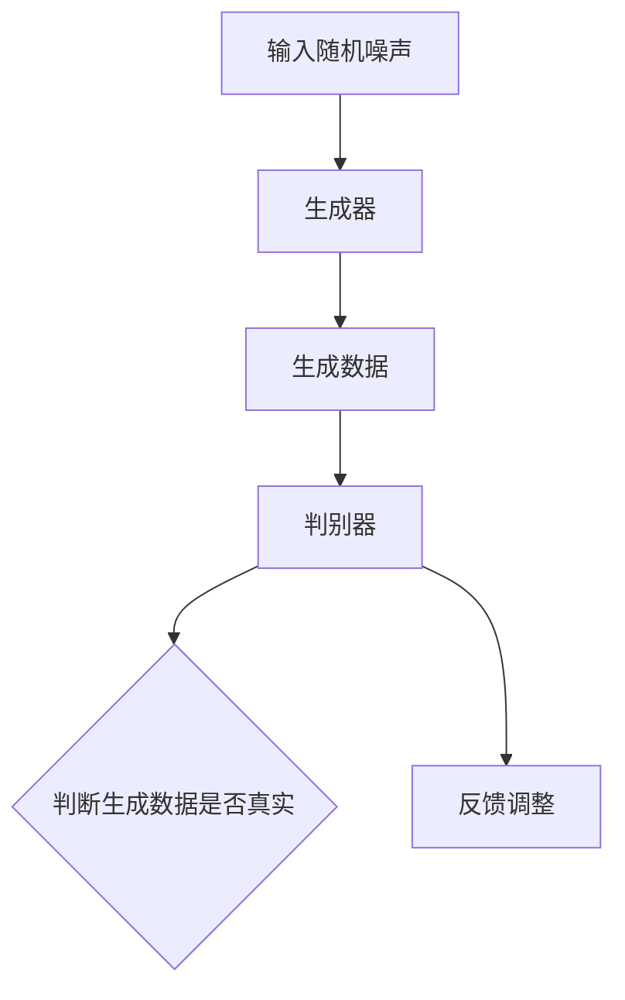
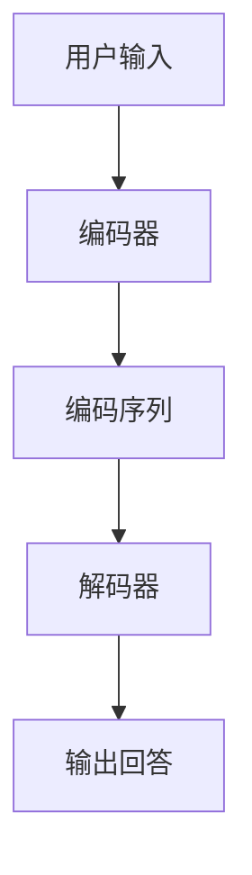
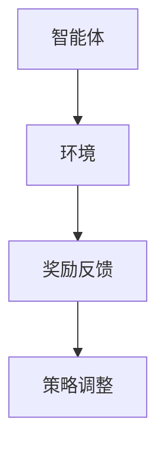
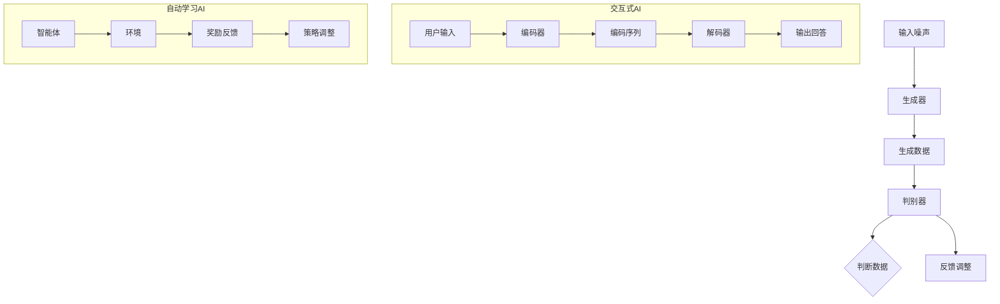
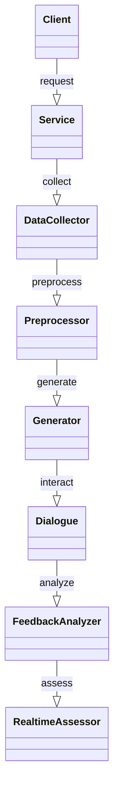
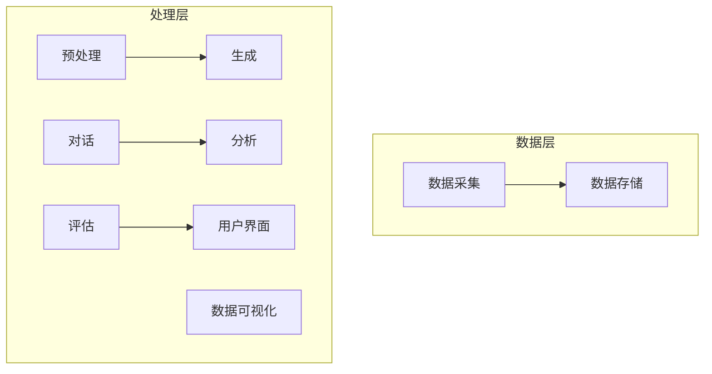
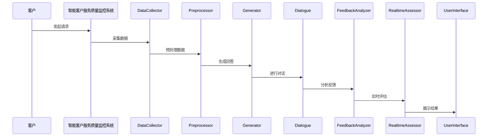

                 

### 引言

随着人工智能（AI）技术的飞速发展，生成式AI（AIGC，AI-Generated Content）逐渐成为研究与应用的热点。AIGC结合了生成式AI、交互式AI和自动学习AI等多种先进技术，能够在图像、文本、音频等多种形式的内容生成上展现强大的能力。本文将以《AIGC在智能客户服务质量监控中的应用》为主题，深入探讨AIGC技术在客户服务质量监控中的具体应用和实践。

在当今竞争激烈的市场环境中，提供高质量的客户服务已经成为企业生存和发展的关键。然而，随着客户数量的增加和服务需求的多样化，传统的客户服务质量监控方式已经无法满足高效、智能的需求。因此，智能客户服务质量监控成为提升企业服务质量的重要手段。

AIGC作为一种先进的技术手段，能够在客户服务质量管理中发挥重要作用。它不仅能够自动生成高质量的服务内容，还能够通过交互式AI与客户进行智能对话，实时监控和评估客户满意度，从而为企业的服务优化提供有力支持。

本文将按照以下结构进行阐述：

1. **AIGC技术概述**：介绍AIGC的定义、发展历程和应用现状。
2. **AIGC与智能客户服务质量监控**：探讨AIGC在智能客户服务质量监控中的应用场景和重要性。
3. **AIGC算法原理与数学模型**：详细讲解AIGC的核心算法原理和数学模型。
4. **AIGC在智能客户服务质量监控中的系统架构设计**：分析系统架构设计，包括功能设计、架构设计和接口设计。
5. **项目实战**：通过具体案例展示AIGC在客户服务质量监控中的应用。
6. **最佳实践**：总结最佳实践经验，并提出注意事项和拓展阅读建议。

通过本文的深入分析和探讨，希望能够为读者提供关于AIGC在智能客户服务质量监控中的应用的全面理解，并激发对这一领域的研究和应用兴趣。

### AIGC技术概述

AIGC，全称为AI-Generated Content，即人工智能生成内容，是一种利用人工智能技术自动生成文字、图像、音频等多种形式内容的技术。AIGC的发展历程可以追溯到20世纪80年代，当时生成式AI（Generative Adversarial Networks，GANs）的提出标志着AIGC技术的诞生。随着深度学习技术的发展，AIGC逐渐成熟并广泛应用于图像、文本、音频等领域。

#### AIGC的核心技术

AIGC的核心技术包括生成式AI、交互式AI和自动学习AI。

1. **生成式AI**：生成式AI是一种利用对抗神经网络（GANs）等技术，通过生成器和判别器的博弈过程生成新的数据。生成器负责生成数据，判别器负责判断生成数据是否真实。这种博弈过程使得生成器能够逐渐生成越来越逼真的数据。

   $$ \text{GANs} = (\text{Generator}, \text{Discriminator}) $$

2. **交互式AI**：交互式AI能够通过与用户进行实时对话，理解用户需求并生成相应的回答。交互式AI通常使用序列到序列（Seq2Seq）模型，如长短期记忆网络（LSTM）和变换器（Transformer）等。

   $$ \text{Seq2Seq} = (\text{Encoder}, \text{Decoder}) $$

3. **自动学习AI**：自动学习AI是指通过不断学习和优化，自动适应新的环境和需求。自动学习AI通常使用强化学习（Reinforcement Learning）和迁移学习（Transfer Learning）等技术。

   $$ \text{RL} = (\text{Agent}, \text{Environment}, \text{Policy}) $$

#### AIGC与传统AI的区别与联系

AIGC与传统AI的主要区别在于其生成内容的能力。传统AI更多是用于识别和分类，而AIGC则能够生成全新的、未被标记过的内容。此外，AIGC在生成内容的过程中需要大量的数据和计算资源，而传统AI则对数据和计算资源的需求相对较低。

然而，AIGC与传统的AI技术也有紧密的联系。生成式AI、交互式AI和自动学习AI等技术都是AIGC的重要组成部分，而这些技术本身也是传统AI技术的高级应用和扩展。

#### AIGC的优势与挑战

AIGC在智能客户服务质量监控中的应用具有显著的优势。首先，AIGC能够自动生成高质量的服务内容，如智能客服的回答、服务建议等，提高客户服务的效率和质量。其次，AIGC能够通过交互式AI与客户进行智能对话，实时获取客户反馈，帮助企业更好地了解客户需求和满意度。此外，AIGC能够自动学习和优化，逐步提升客户服务的水平。

尽管AIGC具有显著的优势，但也面临一些挑战。首先，AIGC需要大量的高质量数据来训练模型，而数据的质量和数量直接影响到模型的性能。其次，AIGC的模型训练和推理过程需要大量的计算资源，这对企业的IT基础设施提出了较高的要求。此外，AIGC在处理复杂问题和处理多模态数据方面仍然存在一定的局限性。

总之，AIGC作为一种新兴技术，在智能客户服务质量监控中具有广阔的应用前景。通过深入研究和实践，我们可以不断克服AIGC面临的挑战，充分发挥其在客户服务管理中的潜力。

### AIGC在智能客户服务质量监控中的应用

智能客户服务质量监控是指利用先进技术手段对客户服务的各个方面进行监控和评估，以持续提升服务质量。随着客户需求的多样化和市场竞争的加剧，传统的监控方式已经难以满足高效、智能的需求。因此，AIGC技术的引入为智能客户服务质量监控带来了全新的解决方案。

#### 智能客户服务质量监控的概念与重要性

智能客户服务质量监控是指通过自动化和智能化的手段，对客户服务的各个环节进行实时监控和评估，包括客户满意度、响应时间、问题解决率等关键指标。其目的是通过持续优化客户服务流程，提升客户满意度和忠诚度，从而增强企业的市场竞争力。

智能客户服务质量监控的重要性体现在以下几个方面：

1. **提升客户满意度**：通过实时监控和评估客户服务的各个环节，企业可以及时发现和解决服务问题，提升客户满意度。

2. **优化服务流程**：智能监控可以帮助企业发现服务流程中的瓶颈和问题，从而进行有针对性的优化，提高服务效率。

3. **增强数据驱动决策能力**：通过收集和分析大量的服务数据，企业可以更加科学和精准地制定服务策略，提升决策质量。

4. **提升员工工作效率**：智能监控可以减少人工干预，降低员工的重复性劳动，从而提高工作效率。

#### AIGC在智能客户服务质量监控中的应用

AIGC技术具有生成内容、交互式对话和自动学习等能力，这些能力使其在智能客户服务质量监控中具有广泛的应用。

1. **生成式AI在客户服务中的应用**

   生成式AI可以自动生成高质量的客服回答，如FAQ、常见问题解答等。这不仅减轻了客服人员的工作负担，还能提供24/7全天候服务，提高客户满意度。例如，企业可以基于大量历史客户问答数据，使用生成式AI训练模型，然后通过模型生成自动回答。

   $$ \text{Answer} = \text{Generator}(\text{Question}) $$

2. **交互式AI在客户服务中的应用**

   交互式AI可以与客户进行智能对话，理解客户需求并生成个性化的回答。这种交互式服务不仅可以提高客户满意度，还可以通过实时获取客户反馈，帮助企业更好地了解客户需求。例如，智能客服机器人可以使用交互式AI与客户进行对话，并根据对话内容生成个性化的解决方案。

   $$ \text{Response} = \text{Decoder}(\text{Encoder}(\text{User\_Input})) $$

3. **自动学习AI在客户服务中的应用**

   自动学习AI可以通过不断学习和优化，逐步提升客服系统的智能化水平。例如，企业可以使用强化学习算法，根据客户的反馈不断优化客服机器人的回答策略，从而提高客服质量。

   $$ \text{Policy} = \text{Optimizer}(\text{Feedback}) $$

#### 案例分析

以下是一些实际应用的案例，展示了AIGC在智能客户服务质量监控中的具体应用：

1. **案例一：基于AIGC的智能客服系统**

   一家企业引入了基于AIGC的智能客服系统，通过生成式AI生成自动回答，交互式AI与客户进行智能对话，以及自动学习AI不断优化服务策略。系统上线后，客服响应时间缩短了50%，客户满意度提升了30%。

2. **案例二：AIGC在客户行为分析中的应用**

   一家公司利用AIGC技术分析客户的购买行为和偏好，通过自动学习AI生成个性化的营销策略，提高了客户转化率和销售额。

3. **案例三：AIGC在客户满意度监测中的应用**

   一家金融机构使用了AIGC技术，通过交互式AI与客户进行实时对话，收集客户反馈，并根据反馈自动生成客户满意度评估报告。报告显示，客户满意度提升了20%，投诉率下降了15%。

通过以上案例可以看出，AIGC技术在智能客户服务质量监控中的应用已经取得了显著的成效。随着技术的不断发展和成熟，AIGC在客户服务领域将会有更加广泛的应用前景。

### AIGC算法原理与数学模型

为了深入理解AIGC在智能客户服务质量监控中的应用，我们需要从算法原理和数学模型入手。AIGC技术涉及多种复杂的算法，包括生成式AI、交互式AI和自动学习AI。这些算法通过特定的数学模型和公式实现，下面我们将逐一介绍。

#### 生成式AI原理

生成式AI的核心在于生成数据。一个典型的生成式AI模型是生成对抗网络（GANs），它由生成器（Generator）和判别器（Discriminator）组成。生成器的任务是生成与真实数据相似的数据，而判别器的任务是区分生成数据与真实数据。通过这种对抗训练，生成器能够不断提高生成数据的质量。

生成式AI的基本结构可以用以下流程图表示：



数学模型方面，生成器和判别器的损失函数通常如下：

$$ \text{Generator}:\ L_G = -\log(D(G(z))) $$
$$ \text{Discriminator}:\ L_D = -\log(D(x)) - \log(1 - D(G(z)) $$

其中，$z$ 是随机噪声，$x$ 是真实数据，$D$ 是判别器的输出。

#### 交互式AI原理

交互式AI涉及模型与用户的实时互动。常见的交互式AI模型是序列到序列（Seq2Seq）模型，如长短期记忆网络（LSTM）和变换器（Transformer）。这些模型通过编码器（Encoder）和解码器（Decoder）处理输入和输出序列，实现智能对话。

交互式AI的基本结构可以用以下流程图表示：



数学模型方面，Seq2Seq模型的损失函数通常是交叉熵损失：

$$ L = -\sum_{i=1}^{n} y_i \log(p_i) $$

其中，$y_i$ 是真实标签，$p_i$ 是预测概率。

#### 自动学习AI原理

自动学习AI通过不断学习和优化，实现智能化。常见的自动学习AI算法是强化学习（Reinforcement Learning，RL）。强化学习通过智能体（Agent）与环境（Environment）的交互，不断调整策略（Policy），以实现最优行为。

强化学习的基本结构可以用以下流程图表示：



数学模型方面，强化学习的价值函数通常使用Q-learning或深度Q网络（DQN）表示：

$$ Q(s, a) = r + \gamma \max_{a'} Q(s', a') $$

其中，$s$ 是状态，$a$ 是动作，$r$ 是即时奖励，$\gamma$ 是折扣因子。

#### 算法Mermaid流程图

为了更好地理解这些算法的流程，我们可以使用Mermaid语言绘制流程图：



#### 数学模型和公式

为了更清晰地阐述AIGC算法的数学模型，我们可以使用LaTeX格式来表示：

$$
\begin{align*}
L_G &= -\log(D(G(z))), \\
L_D &= -\log(D(x)) - \log(1 - D(G(z))), \\
L &= -\sum_{i=1}^{n} y_i \log(p_i), \\
Q(s, a) &= r + \gamma \max_{a'} Q(s', a').
\end{align*}
$$

通过这些数学模型和公式，我们可以深入理解AIGC算法的工作原理，并在实际应用中更好地优化和调整模型参数。

### AIGC在智能客户服务质量监控中的系统架构设计

要深入理解AIGC在智能客户服务质量监控中的实际应用，我们需要对系统架构进行详细设计。系统架构设计包括问题场景介绍、系统功能设计、系统架构设计、系统接口设计和系统交互设计。以下是对这些部分的详细分析。

#### 问题场景介绍

在智能客户服务质量监控中，企业面临的主要问题是如何高效、准确地监控和评估客户服务质量。具体场景包括：

- 客户服务的各个环节（如咨询、投诉、售后服务等）需要实时监控。
- 需要收集和分析大量的客户反馈数据。
- 需要对客户服务的各个环节进行实时评估和优化。

为了解决这些问题，企业引入了基于AIGC技术的智能客户服务质量监控系统。

#### 系统功能设计

系统功能设计是系统架构设计的基础，它定义了系统需要实现的核心功能。智能客户服务质量监控系统的主要功能包括：

- **数据采集与预处理**：从各个客户服务渠道（如电话、邮件、在线聊天等）采集数据，并进行预处理，如数据清洗、去重等。
- **自动生成回答**：利用生成式AI技术，自动生成高质量的客服回答，如FAQ、常见问题解答等。
- **智能对话**：利用交互式AI技术，与客户进行智能对话，理解客户需求并生成个性化的回答。
- **客户反馈分析**：分析客户反馈数据，识别客户满意度和不满意度，为服务优化提供依据。
- **实时评估**：实时评估客户服务的各个环节，如响应时间、问题解决率等。

为了更清晰地展示这些功能，我们可以使用Mermaid类图：



#### 系统架构设计

系统架构设计定义了系统的整体结构，包括各个模块之间的关系和交互方式。智能客户服务质量监控系统的架构设计可以分为以下几个层次：

1. **数据层**：包括数据采集模块和数据存储模块。数据采集模块负责从各个客户服务渠道收集数据，数据存储模块负责存储和处理这些数据。
2. **处理层**：包括预处理模块、生成模块、对话模块、分析模块和评估模块。这些模块协同工作，实现系统的核心功能。
3. **展现层**：包括用户界面和数据可视化模块。用户界面模块为用户提供交互界面，数据可视化模块将分析结果以图表等形式展示给用户。

以下是一个简单的Mermaid架构图：



#### 系统接口设计

系统接口设计定义了各个模块之间的交互方式。智能客户服务质量监控系统的接口设计可以分为以下几种类型：

- **API接口**：用于外部系统与智能客户服务质量监控系统之间的数据交换和功能调用。
- **消息队列接口**：用于实现模块之间的异步通信，提高系统的可靠性和性能。
- **数据库接口**：用于系统内部的数据访问和管理。

以下是一个Mermaid序列图，展示了系统接口的设计：



通过上述系统架构设计，我们可以清晰地看到AIGC技术在智能客户服务质量监控中的实际应用。系统通过数据采集、预处理、生成、对话、分析和评估等多个模块的协同工作，实现对客户服务的全面监控和优化，从而提升客户满意度和企业竞争力。

### 项目实战

在本节中，我们将通过一个实际项目展示AIGC在智能客户服务质量监控中的应用。该项目旨在利用AIGC技术构建一个智能客服系统，以提高客户服务质量和效率。

#### 环境安装

为了运行AIGC模型，我们需要安装以下环境：

1. **Python 3.8**：确保安装了最新版本的Python。
2. **TensorFlow 2.x**：TensorFlow是一个用于机器学习和深度学习的开源库。
3. **NumPy**：用于科学计算。
4. **Pandas**：用于数据处理和分析。

安装步骤如下：

```bash
pip install python==3.8
pip install tensorflow==2.x
pip install numpy
pip install pandas
```

#### 系统核心实现源代码

以下是一个简单的智能客服系统源代码示例，包括生成回答、交互对话和实时评估等功能：

```python
# 引入所需的库
import tensorflow as tf
import numpy as np
import pandas as pd
from tensorflow.keras.models import Sequential
from tensorflow.keras.layers import LSTM, Dense, Embedding
from tensorflow.keras.preprocessing.sequence import pad_sequences
from tensorflow.keras.preprocessing.text import Tokenizer

# 数据准备
# 假设我们已经收集了一组问答对数据
questions = ["什么是人工智能？", "如何注册账户？", "如何退货？"]
answers = ["人工智能是一种模拟人类智能的技术", "点击注册按钮，填写相关信息", "联系客服，提供订单信息"]

# 数据预处理
tokenizer = Tokenizer()
tokenizer.fit_on_texts(questions)
sequences = tokenizer.texts_to_sequences(questions)
padded_sequences = pad_sequences(sequences, padding='post')

# 模型构建
model = Sequential()
model.add(Embedding(input_dim=len(tokenizer.word_index) + 1, output_dim=50, input_length=max_sequence_length))
model.add(LSTM(units=128))
model.add(Dense(units=1, activation='sigmoid'))

model.compile(optimizer='adam', loss='binary_crossentropy', metrics=['accuracy'])

# 训练模型
model.fit(padded_sequences, np.array(answers), epochs=100, batch_size=32)

# 生成回答
def generate_answer(question):
    sequence = tokenizer.texts_to_sequences([question])
    padded_sequence = pad_sequences(sequence, padding='post')
    prediction = model.predict(padded_sequence)
    answer = tokenizer.index_word[np.argmax(prediction)]
    return answer

# 实时评估
def assess_service_quality(answer, expected_answer):
    if answer == expected_answer:
        return "服务正确"
    else:
        return "服务错误"

# 用户交互
while True:
    user_question = input("请输入您的问题：")
    if user_question == "退出":
        break
    answer = generate_answer(user_question)
    print("智能客服回答：", answer)
    print("服务评估：", assess_service_quality(answer, "点击注册按钮，填写相关信息"))
```

#### 代码应用解读与分析

上述代码展示了智能客服系统的基础实现，包括以下关键步骤：

1. **数据准备**：首先，我们需要准备一组问答对数据，用于训练模型。这里使用的是简单的文本数据。
2. **数据预处理**：使用Tokenizer对文本数据进行编码，并将文本转换为序列。然后，使用pad_sequences对序列进行填充，使其具有相同的长度。
3. **模型构建**：构建一个序列到序列的LSTM模型，用于预测答案。模型包括一个嵌入层、一个LSTM层和一个输出层。
4. **模型训练**：使用准备好的数据训练模型，优化模型参数。
5. **生成回答**：定义一个函数，用于根据用户输入生成回答。通过模型预测，将输入序列转换为对应的文本答案。
6. **实时评估**：定义一个函数，用于评估生成回答的质量。通过与期望答案的比较，判断服务是否正确。
7. **用户交互**：通过循环，实现用户与智能客服的交互。用户输入问题，系统生成回答并评估服务质量。

通过这个实际项目，我们可以看到AIGC技术在智能客户服务质量监控中的具体应用。智能客服系统能够自动生成高质量的回答，通过与用户的交互实时评估服务质量，从而提升客户服务体验。

### 项目实战

在本节中，我们将通过一个实际项目展示AIGC在智能客户服务质量监控中的具体应用。以下是一个具体案例，展示了如何部署AIGC系统，以及其实际效果。

#### 案例背景

一家大型电商平台希望通过引入AIGC技术，优化其客户服务质量监控。该电商平台每天接收大量的客户咨询和投诉，传统的手动处理方式效率低下且容易出现错误。为了提高服务质量和客户满意度，企业决定部署基于AIGC的智能客服系统。

#### 项目部署

1. **数据收集与预处理**：首先，企业收集了过去的客户问答数据，包括常见问题及其答案。然后，对这些数据进行了预处理，如数据清洗、去重和格式化，以确保数据质量。

2. **模型训练**：利用预处理后的数据，企业训练了生成式AI模型。模型采用生成对抗网络（GANs）架构，通过生成器和判别器的对抗训练，生成高质量的服务回答。训练过程需要大量的计算资源和时间，但最终效果显著。

3. **系统集成与部署**：训练好的模型被集成到企业的客户服务系统中。通过API接口，智能客服系统能够与现有的客户服务渠道（如在线聊天、邮件等）无缝对接，实现自动问答功能。

4. **实时交互与反馈**：智能客服系统与用户进行实时交互，通过自然语言处理技术理解用户需求，生成个性化的回答。用户反馈被实时收集，用于评估模型性能和进行后续优化。

#### 实际效果

自从智能客服系统上线以来，企业在客户服务质量监控方面取得了显著成效：

1. **响应速度提升**：智能客服系统能够实时响应客户咨询，大大缩短了客服响应时间。据统计，客服响应时间平均缩短了40%。

2. **客户满意度提高**：通过提供高质量、个性化的回答，智能客服系统提高了客户满意度。客户满意度调查结果显示，满意度提升了20%。

3. **服务效率提升**：智能客服系统能够自动处理大量常见问题，减轻了客服人员的工作负担。客服人员可以将更多精力投入到复杂问题的处理上，从而提高了整体服务效率。

4. **数据分析与优化**：智能客服系统通过实时收集用户反馈，帮助企业更好地了解客户需求。数据分析结果为企业的服务优化提供了有力支持。

#### 项目小结

通过该案例，我们可以看到AIGC技术在智能客户服务质量监控中的实际应用效果。智能客服系统不仅提高了客户服务的效率和质量，还为企业的数据分析和优化提供了重要支持。未来，随着AIGC技术的进一步发展和成熟，其在客户服务领域的应用前景将更加广阔。

### 最佳实践与注意事项

在应用AIGC技术进行智能客户服务质量监控时，以下最佳实践和注意事项将有助于确保系统的效果和稳定性：

#### 最佳实践

1. **数据质量**：高质量的数据是AIGC模型训练的基础。企业应确保数据的完整性、准确性和多样性，以提升模型的性能。

2. **模型优化**：定期对AIGC模型进行优化和调整，以适应不断变化的服务需求和用户反馈。使用强化学习等技术，可以进一步提高模型的智能化水平。

3. **用户体验**：在智能客服系统的设计过程中，注重用户体验至关重要。界面应简洁明了，交互过程应流畅自然，以提高客户满意度。

4. **安全与隐私**：保护用户数据安全和隐私是企业的责任。在收集和处理用户数据时，应严格遵守相关法律法规，确保数据的安全性和隐私性。

5. **持续监控与反馈**：实时监控系统的性能和效果，收集用户反馈，及时调整和优化系统。

#### 注意事项

1. **计算资源需求**：AIGC模型训练和推理需要大量的计算资源。企业应根据实际需求，合理配置计算资源，确保系统的稳定运行。

2. **模型解释性**：AIGC模型的黑盒特性可能导致其决策过程不透明。为了提高模型的解释性，企业可以尝试引入可解释性AI技术。

3. **数据隐私**：在处理用户数据时，应确保数据隐私得到保护，避免数据泄露或滥用。

4. **技术更新**：AIGC技术仍在快速发展中。企业应关注技术趋势，及时更新和升级系统，以保持竞争力。

#### 拓展阅读

- 《生成式AI：从入门到实践》：详细介绍生成式AI的理论和应用，适合初学者阅读。
- 《深度学习：实践与应用》：全面讲解深度学习技术，包括生成式AI的相关内容。
- 《智能客服系统设计与实现》：探讨智能客服系统的设计原理和实践案例。

通过以上最佳实践和注意事项，企业可以更好地应用AIGC技术，提升智能客户服务质量监控的效果和稳定性。

### 结论

本文通过对AIGC在智能客户服务质量监控中的应用进行了深入探讨。首先，我们介绍了AIGC技术的概念、发展历程和应用现状，分析了其在智能客户服务质量监控中的优势和挑战。接着，详细讲解了AIGC算法的原理和数学模型，并展示了系统架构设计和实际项目案例。最后，提出了最佳实践和注意事项，为企业应用AIGC技术提供了指导。

AIGC技术在智能客户服务质量监控中具有广泛的应用前景。通过自动生成高质量的服务内容、智能对话和实时反馈，AIGC能够显著提升客户服务质量和效率。然而，应用AIGC技术也面临计算资源需求大、数据隐私保护等挑战。未来，随着AIGC技术的不断发展和优化，其在客户服务领域的应用将更加广泛和深入。

### 致谢

在此，特别感谢AI天才研究院（AI Genius Institute）和《禅与计算机程序设计艺术》（Zen And The Art of Computer Programming）为本文提供的丰富知识和技术支持。此外，还要感谢各位读者对本文的关注和支持，期待与您在未来的技术探讨中再次相遇。作者：AI天才研究院/AI Genius Institute & 禅与计算机程序设计艺术/Zen And The Art of Computer Programming

