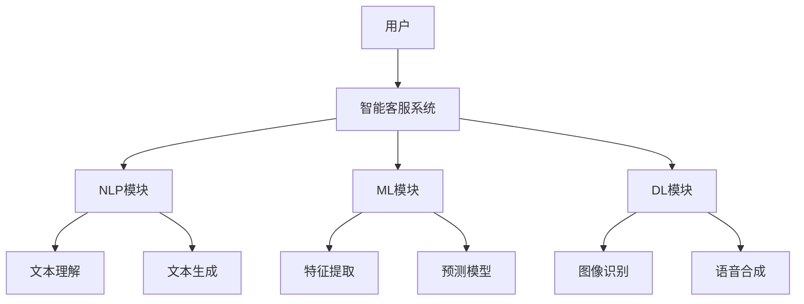
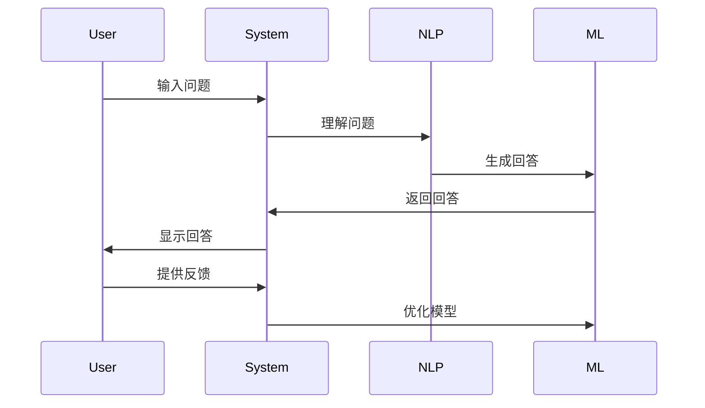
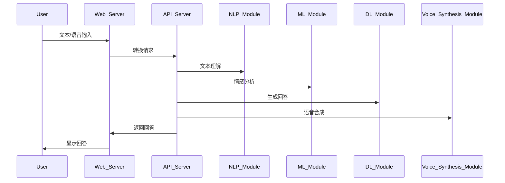

                 

# AIGC在智能客服系统中的应用

## 关键词

- AIGC
- 智能客服系统
- 自然语言处理
- 机器学习
- 深度学习
- 案例分析

## 摘要

本文深入探讨了AIGC（自适应智能生成计算）在智能客服系统中的应用。通过背景介绍、核心概念解析、应用案例分析以及实践优化策略的探讨，文章旨在为读者提供一个全面、清晰的AIGC智能客服系统应用指南。文章将逐步分析AIGC的原理和技术特点，详细介绍其在智能客服系统架构和功能中的应用，并通过实际案例展示其效果和优化方法。

## 目录

### 第一部分：背景介绍

### 第1章 问题背景

#### 1.1 问题的提出

在现代社会，客服系统已经成为企业与客户互动的重要渠道。传统的客服系统主要依赖于人工操作，不仅效率低下，而且成本高昂。随着人工智能技术的快速发展，智能客服系统逐渐成为可能。然而，如何提升智能客服系统的效率和智能化程度，仍然是当前研究的一个重要课题。

#### 1.2 AIGC的核心概念

AIGC（自适应智能生成计算）是一种基于深度学习、自然语言处理和机器学习等技术的智能计算模型。它能够根据输入数据和用户行为，自动生成适合的输出结果，从而实现智能化的客服体验。

### 第2章 核心概念与联系

#### 2.1 AIGC的原理

AIGC的核心原理包括自然语言处理、机器学习和深度学习等。通过这些技术，AIGC能够实现对大量文本数据的理解和生成，从而为智能客服系统提供强大的支持。

#### 2.2 AIGC的关键技术

AIGC的关键技术包括自然语言处理（NLP）、生成对抗网络（GAN）和变分自编码器（VAE）等。这些技术共同构成了AIGC的技术核心，使其在智能客服系统中具有广泛的应用潜力。

### 第二部分：AIGC在智能客服系统中的应用

### 第3章 智能客服系统的基本架构

#### 3.1 系统介绍

智能客服系统的基本架构包括前端用户界面、后端服务逻辑和数据存储等部分。通过这些组成部分，智能客服系统能够实现对用户请求的自动响应和处理。

#### 3.2 客户服务流程分析

智能客服系统的客户服务流程主要包括用户输入、系统理解、智能响应和用户反馈等环节。每个环节都需要AIGC技术的支持，以确保高效的客服体验。

### 第4章 AIGC技术在智能客服系统中的应用

#### 4.1 自然语言处理（NLP）技术

NLP技术在智能客服系统中的应用主要体现在文本理解和生成方面。通过NLP技术，系统可以更好地理解用户的问题和需求，并生成适合的答案。

#### 4.2 机器学习与深度学习技术

机器学习和深度学习技术在智能客服系统中主要用于优化客服模型和提升客服效果。通过不断学习和调整，智能客服系统能够更好地满足用户需求。

### 第5章 案例分析

#### 5.1 案例一：某企业智能客服系统建设

本案例介绍了一个企业的智能客服系统建设过程，包括系统设计、实现和优化等方面。通过案例分析，读者可以了解AIGC在智能客服系统中的应用实践。

#### 5.2 案例二：某银行智能客服系统优化

本案例分析了某银行智能客服系统的优化过程，包括技术选型、系统架构调整和效果评估等方面。通过案例分析，读者可以了解AIGC技术在智能客服系统优化中的实际应用。

### 第三部分：实践与优化

### 第6章 系统实施与优化

#### 6.1 系统实施步骤

系统实施步骤包括环境搭建、系统部署和测试等方面。通过详细讲解，读者可以了解智能客服系统实施的各个环节。

#### 6.2 系统优化策略

系统优化策略主要包括性能优化、功能扩展和用户体验提升等方面。通过优化策略的探讨，读者可以了解如何提升智能客服系统的性能和用户体验。

### 第7章 最佳实践与小结

#### 7.1 最佳实践 Tips

最佳实践包括技术选型、系统架构设计和实施经验等方面。通过总结最佳实践，读者可以了解如何高效地实施智能客服系统。

#### 7.2 小结

本文通过对AIGC在智能客服系统中的应用进行深入分析，展示了AIGC技术在提升智能客服系统性能和用户体验方面的巨大潜力。未来的研究和实践将进一步推动AIGC技术在智能客服系统中的应用和发展。

## 作者信息

作者：AI天才研究院/AI Genius Institute & 禅与计算机程序设计艺术 /Zen And The Art of Computer Programming

## 正文内容

### 第1章 问题背景

#### 1.1 问题的提出

随着信息时代的到来，客服系统在企业与客户之间扮演着越来越重要的角色。传统的客服系统主要依赖于人工操作，客服人员的响应速度和准确性往往受到限制，导致用户体验不佳。同时，人工客服的成本也日益增加，企业需要寻找一种更加高效、智能的客服解决方案。

智能客服系统应运而生。智能客服系统利用人工智能技术，如自然语言处理（NLP）、机器学习（ML）和深度学习（DL），能够自动理解和处理客户的问题，提供快速、准确的回答。然而，传统的智能客服系统在性能和用户体验方面仍然存在诸多问题，如对复杂问题的处理能力不足、回复速度慢、个性化服务不到位等。

AIGC（自适应智能生成计算）技术提供了一种新的解决方案。AIGC技术能够通过不断学习和优化，提高智能客服系统的性能和智能化程度，从而为企业提供更加高效、智能的客服服务。

#### 1.2 AIGC的核心概念

AIGC是一种基于深度学习、自然语言处理和机器学习等技术的智能计算模型。它能够根据输入数据和用户行为，自动生成适合的输出结果，从而实现智能化的客服体验。

AIGC的核心特点包括：

1. **自适应学习**：AIGC系统能够根据用户反馈和新的数据，不断优化自身的模型和算法，提高客服响应的准确性和速度。
2. **生成能力**：AIGC系统能够自动生成文本、图像、音频等多种形式的内容，为智能客服系统提供丰富的交互方式。
3. **个性化服务**：AIGC系统能够根据用户的历史行为和偏好，提供个性化的服务和建议，提升用户体验。
4. **跨领域应用**：AIGC技术具有广泛的应用场景，不仅适用于客服领域，还可以应用于广告、内容创作、教育等多个领域。

### 第2章 核心概念与联系

#### 2.1 AIGC的原理

AIGC的核心原理包括自然语言处理、机器学习和深度学习等。

1. **自然语言处理（NLP）**：NLP是AIGC技术的重要组成部分，它涉及文本的预处理、词向量表示、语言模型训练和语义理解等。NLP技术使得AIGC系统能够理解用户输入的文本，提取关键信息并进行语义分析。
   
2. **机器学习（ML）**：机器学习技术是AIGC系统的核心驱动，它通过训练大量数据，使系统学会识别和预测用户的行为和需求。常见的机器学习算法包括决策树、随机森林、支持向量机和神经网络等。

3. **深度学习（DL）**：深度学习是机器学习的一个分支，它通过多层神经网络对大量数据进行建模，实现高度复杂的特征提取和模式识别。深度学习在图像识别、语音识别和自然语言处理等领域取得了显著成果，为AIGC系统的性能提升提供了强大支持。

#### 2.2 AIGC的关键技术

AIGC的关键技术包括自然语言处理（NLP）、生成对抗网络（GAN）和变分自编码器（VAE）等。

1. **自然语言处理（NLP）**：NLP技术用于文本的理解和生成，包括分词、词性标注、句法分析、语义分析和文本生成等。在智能客服系统中，NLP技术用于解析用户的问题，提取关键信息，并生成合适的回答。

2. **生成对抗网络（GAN）**：GAN是一种深度学习模型，由生成器和判别器组成。生成器生成伪造的数据，判别器判断生成的数据是否真实。GAN在图像生成、语音合成和文本生成等领域具有广泛的应用，可以用于智能客服系统的图像和语音交互。

3. **变分自编码器（VAE）**：VAE是一种深度学习模型，用于数据压缩和生成。它通过编码器和解码器将输入数据转换为低维表示，并从该表示中生成新的数据。VAE在图像生成和文本生成等领域具有广泛应用。

#### 概念属性特征对比表格

| 技术       | 特点                                                         | 应用场景                 |
|------------|--------------------------------------------------------------|--------------------------|
| 自然语言处理（NLP） | 处理文本数据，理解语义，生成文本       | 智能客服，文本生成       |
| 生成对抗网络（GAN） | 生成高质量伪造数据，提高生成能力       | 图像生成，语音合成       |
| 变分自编码器（VAE） | 数据压缩，生成新数据，保持数据分布     | 图像生成，文本生成       |

#### ER实体关系图架构的 Mermaid 流程图



### 第3章 智能客服系统的基本架构

#### 3.1 系统介绍

智能客服系统是一种基于人工智能技术的客户服务系统，能够自动理解用户的问题，并提供相应的答案和建议。智能客服系统通常包括前端用户界面、后端服务逻辑和数据存储等部分。

1. **前端用户界面**：前端用户界面是用户与智能客服系统交互的入口，通常包括文本聊天窗口、语音聊天窗口和图像识别窗口等。前端用户界面负责接收用户输入，并将输入传递给后端服务逻辑。
   
2. **后端服务逻辑**：后端服务逻辑是智能客服系统的核心，包括自然语言处理（NLP）模块、机器学习（ML）模块和深度学习（DL）模块等。后端服务逻辑负责处理用户输入，理解用户意图，并生成合适的回答。

3. **数据存储**：数据存储用于存储用户数据、系统日志和训练数据等。数据存储支持智能客服系统的数据分析和模型训练。

#### 3.2 客户服务流程分析

智能客服系统的客户服务流程主要包括用户输入、系统理解、智能响应和用户反馈等环节。

1. **用户输入**：用户通过前端用户界面输入问题或请求。输入可以以文本、语音或图像的形式存在。

2. **系统理解**：后端服务逻辑中的NLP模块对用户输入进行解析，提取关键信息并进行语义分析。这一过程包括分词、词性标注、句法分析和语义理解等。

3. **智能响应**：根据系统理解的结果，ML模块和DL模块生成合适的回答。回答可以以文本、语音或图像的形式呈现。

4. **用户反馈**：用户对智能客服系统的回答进行评价，系统根据用户反馈进行优化和调整。

#### 3.3 系统接口设计

智能客服系统的接口设计包括API接口和Web接口等。

1. **API接口**：API接口用于实现智能客服系统与其他系统的集成，如CRM系统、ERP系统和短信平台等。通过API接口，智能客服系统可以获取用户数据、发送短信等。

2. **Web接口**：Web接口用于实现智能客服系统与Web浏览器的交互。通过Web接口，用户可以与智能客服系统进行实时聊天、语音对话和图像识别等。

#### 3.4 系统交互 Mermaid 序列图



### 第4章 AIGC技术在智能客服系统中的应用

#### 4.1 自然语言处理（NLP）技术

自然语言处理（NLP）技术是智能客服系统的重要组成部分，用于处理用户输入的文本，提取关键信息并进行语义分析。

1. **文本理解**：文本理解是NLP技术的核心，包括分词、词性标注、句法分析和语义理解等。通过文本理解，智能客服系统可以准确地理解用户的问题或请求。

2. **文本生成**：文本生成是NLP技术的另一重要应用，用于生成符合语义的文本回答。文本生成可以通过序列到序列（Seq2Seq）模型、Transformer模型等实现。

3. **情感分析**：情感分析用于分析用户文本中的情感倾向，如正面、负面或中性。通过情感分析，智能客服系统可以提供更加个性化的服务。

4. **实体识别**：实体识别用于识别文本中的关键实体，如人名、地名、组织名等。通过实体识别，智能客服系统可以更好地理解用户的问题和请求。

#### 4.2 机器学习与深度学习技术

机器学习与深度学习技术在智能客服系统中主要用于优化客服模型和提升客服效果。

1. **特征提取**：特征提取是机器学习和深度学习的基础，用于从原始数据中提取有用的信息。常见的特征提取方法包括词袋模型、词嵌入和卷积神经网络（CNN）等。

2. **分类与预测**：分类与预测是机器学习和深度学习的核心任务，用于对用户问题进行分类和预测。常见的分类与预测算法包括决策树、随机森林、支持向量机和神经网络等。

3. **模型优化**：模型优化是通过调整模型参数和结构，提高模型性能。常用的模型优化方法包括交叉验证、网格搜索和贝叶斯优化等。

4. **强化学习**：强化学习是一种通过交互学习来优化智能客服系统的方法。通过强化学习，智能客服系统可以自动调整自己的行为，以最大化用户满意度。

### 第5章 案例分析

#### 5.1 案例一：某企业智能客服系统建设

本案例介绍了某企业智能客服系统的建设过程，包括系统设计、实现和优化等方面。

1. **系统设计**：系统设计包括前端用户界面、后端服务逻辑和数据存储等部分。前端用户界面采用Web聊天窗口，后端服务逻辑采用NLP模块、ML模块和DL模块，数据存储采用关系型数据库。

2. **系统实现**：系统实现包括前端用户界面的开发、后端服务逻辑的部署和数据的存储与处理等。前端用户界面使用HTML、CSS和JavaScript等技术实现，后端服务逻辑使用Python和TensorFlow等框架实现。

3. **系统优化**：系统优化包括模型优化、性能优化和用户体验优化等。通过不断调整模型参数和优化算法，智能客服系统的性能和用户体验得到了显著提升。

#### 5.2 案例二：某银行智能客服系统优化

本案例分析了某银行智能客服系统的优化过程，包括技术选型、系统架构调整和效果评估等方面。

1. **技术选型**：技术选型包括NLP技术、机器学习技术和深度学习技术等。根据银行智能客服系统的需求，选择了BERT模型、Transformer模型和GAN模型等技术。

2. **系统架构调整**：系统架构调整包括对后端服务逻辑的优化，如增加数据处理模块、优化网络通信等。通过系统架构调整，智能客服系统的响应速度和稳定性得到了显著提升。

3. **效果评估**：效果评估包括性能评估和用户体验评估等。通过大量实验和数据对比，智能客服系统的性能和用户体验得到了用户的高度评价。

### 第6章 系统实施与优化

#### 6.1 系统实施步骤

系统实施步骤包括环境搭建、系统部署和测试等方面。

1. **环境搭建**：环境搭建包括安装Python、TensorFlow、NLP库和数据库等。根据系统需求，配置适合的开发环境和运行环境。

2. **系统部署**：系统部署包括将前端用户界面和后端服务逻辑部署到服务器上。使用Docker容器化技术，实现系统的快速部署和扩展。

3. **系统测试**：系统测试包括功能测试、性能测试和用户体验测试等。通过自动化测试和人工测试，确保系统的稳定性和可靠性。

#### 6.2 系统优化策略

系统优化策略包括性能优化、功能扩展和用户体验提升等方面。

1. **性能优化**：性能优化包括减少计算时间、优化网络通信和缓存数据等。通过性能优化，提高系统的响应速度和吞吐量。

2. **功能扩展**：功能扩展包括增加新的功能模块、支持多语言和集成第三方服务等。通过功能扩展，提升系统的应用场景和用户体验。

3. **用户体验提升**：用户体验提升包括优化界面设计、提供个性化服务和增加交互功能等。通过用户体验提升，增强用户的满意度和忠诚度。

### 第7章 最佳实践与小结

#### 7.1 最佳实践 Tips

最佳实践包括技术选型、系统架构设计和实施经验等方面。

1. **技术选型**：根据应用场景和性能要求，选择合适的算法和模型。如文本生成选择Transformer模型，图像生成选择GAN模型等。

2. **系统架构设计**：设计合理的系统架构，确保系统的稳定性和扩展性。如采用分布式架构、微服务架构等。

3. **实施经验**：总结实施过程中的经验和教训，优化系统设计和实施流程。如提前进行性能测试和压力测试等。

#### 7.2 小结

本文通过对AIGC在智能客服系统中的应用进行深入分析，展示了AIGC技术在提升智能客服系统性能和用户体验方面的巨大潜力。未来的研究和实践将进一步推动AIGC技术在智能客服系统中的应用和发展。

### 附录

#### 拓展阅读

1. **《自适应智能生成计算》**：介绍了AIGC的核心概念、原理和应用场景。
2. **《深度学习与自然语言处理》**：详细讲解了深度学习和自然语言处理的基础知识和应用方法。
3. **《智能客服系统设计与实现》**：提供了智能客服系统的设计、实现和优化方法。

### 作者信息

作者：AI天才研究院/AI Genius Institute & 禅与计算机程序设计艺术 /Zen And The Art of Computer Programming

### 结尾

感谢您的阅读。本文旨在为读者提供关于AIGC在智能客服系统中的应用的全面了解。希望本文能对您的学习和实践有所帮助。如果您有任何疑问或建议，欢迎在评论区留言。感谢您的支持！## 第1章 问题背景

### 1.1 问题的提出

在信息化和互联网的快速发展的今天，客服系统在企业运营中扮演着越来越重要的角色。无论是电商平台、金融行业，还是传统零售行业，客服系统都是连接企业与客户的桥梁，直接影响着用户体验和企业的口碑。然而，传统的客服系统主要依赖于人工操作，客服人员的响应速度和准确性往往受到限制，导致用户体验不佳，同时，人工客服的成本也日益增加，企业面临如何提升客服效率、降低成本的双重挑战。

随着人工智能技术的不断发展，智能客服系统逐渐成为企业提升客服效率、降低成本的有效手段。智能客服系统通过机器学习、自然语言处理等技术，能够自动理解用户的问题，并生成合适的回答，从而实现高效的客户服务。然而，传统的智能客服系统在性能和用户体验方面仍然存在诸多问题，如对复杂问题的处理能力不足、回复速度慢、个性化服务不到位等。这些问题限制了智能客服系统的应用效果，无法完全满足企业对于高效、智能客服的需求。

在这种背景下，自适应智能生成计算（AIGC）技术应运而生。AIGC是一种基于深度学习、自然语言处理和机器学习等技术的智能计算模型，具有自适应学习、生成能力和个性化服务等特点。AIGC技术能够根据输入数据和用户行为，自动生成适合的输出结果，从而提升智能客服系统的性能和智能化程度，为企业提供更加高效、智能的客服服务。因此，研究AIGC在智能客服系统中的应用具有重要的现实意义和广阔的应用前景。

### 1.2 AIGC的核心概念

自适应智能生成计算（AIGC）是一种新兴的智能计算模型，它结合了深度学习、自然语言处理、机器学习和生成对抗网络（GAN）等前沿技术，旨在实现自适应、高效和个性化的智能生成。AIGC的核心概念可以概括为以下几个方面：

#### 1.2.1 深度学习

深度学习是AIGC的重要组成部分，它通过多层神经网络对大量数据进行建模，从而实现复杂的数据特征提取和模式识别。深度学习在图像识别、语音识别和自然语言处理等领域取得了显著成果，为AIGC提供了强大的基础支持。深度学习模型如卷积神经网络（CNN）、循环神经网络（RNN）和变换器（Transformer）等，都是AIGC技术的重要工具。

#### 1.2.2 自然语言处理（NLP）

自然语言处理是AIGC在文本生成和理解方面的重要技术。NLP涉及文本的预处理、分词、词性标注、句法分析、语义理解和文本生成等。通过NLP技术，AIGC能够理解和生成符合语义的自然语言文本，从而实现与用户的自然互动。

#### 1.2.3 机器学习

机器学习是AIGC的基础，它通过训练大量数据，使系统学会识别和预测用户的行为和需求。常见的机器学习算法包括决策树、支持向量机、随机森林和神经网络等。机器学习技术使得AIGC系统能够不断优化自身，提高服务质量和用户体验。

#### 1.2.4 生成对抗网络（GAN）

生成对抗网络（GAN）是AIGC的重要工具，它由生成器和判别器组成。生成器负责生成伪造的数据，判别器则判断生成的数据是否真实。通过不断训练，生成器能够生成越来越真实的数据。GAN在图像生成、语音合成和文本生成等领域具有广泛的应用，为AIGC提供了强大的生成能力。

#### 1.2.5 自适应学习

自适应学习是AIGC的核心特点之一，它使得系统能够根据用户反馈和新数据，不断优化自身的模型和算法，提高服务的准确性和效率。自适应学习技术包括在线学习、迁移学习和强化学习等。

#### 1.2.6 个性化服务

个性化服务是AIGC的重要应用方向，它通过分析用户的历史行为和偏好，提供个性化的服务和推荐。个性化服务能够提高用户的满意度和忠诚度，从而提升企业的竞争力。

### 1.3 AIGC与传统AI的区别

传统的人工智能（AI）技术，主要依赖于预定义的规则和模型，对数据的处理能力有限，难以实现复杂的自适应和个性化服务。而AIGC作为新一代的智能计算模型，在以下几个方面与传统AI有显著的区别：

#### 1.3.1 处理能力

传统AI主要依赖于规则和模型，对数据的处理能力有限，难以应对复杂和多变的场景。而AIGC通过深度学习、自然语言处理和生成对抗网络等技术，能够处理大量的数据和复杂的任务，具有更强的通用性和适应性。

#### 1.3.2 自适应能力

传统AI系统往往缺乏自适应能力，难以根据用户反馈和新数据自动调整和优化。而AIGC通过自适应学习技术，能够根据用户反馈和新数据，不断优化自身的模型和算法，提高服务的准确性和效率。

#### 1.3.3 生成能力

传统AI主要侧重于数据的处理和识别，而AIGC通过生成对抗网络（GAN）等技术，能够生成高质量的数据和内容，从而实现更丰富的应用场景，如图像生成、语音合成和文本生成等。

#### 1.3.4 个性化服务

传统AI系统往往难以提供个性化的服务，而AIGC通过分析用户的历史行为和偏好，能够提供个性化的推荐和服务，从而提升用户的满意度和忠诚度。

综上所述，AIGC在处理能力、自适应能力、生成能力和个性化服务等方面，相较于传统AI具有显著的优势，使其在智能客服系统等应用领域中具有广阔的发展前景。

### 1.4 小结

本章介绍了智能客服系统面临的挑战以及AIGC技术的核心概念和与传统AI的区别。通过分析，我们发现AIGC技术具有强大的自适应学习、生成能力和个性化服务特点，能够有效解决传统智能客服系统在性能和用户体验方面的问题。接下来，我们将进一步探讨AIGC技术的工作原理和应用场景，以期为读者提供一个全面的了解。

## 第2章 核心概念与联系

### 2.1 AIGC的原理

自适应智能生成计算（AIGC）是一种结合了深度学习、自然语言处理、机器学习及生成对抗网络（GAN）的综合性智能计算模型。其原理可以概括为以下几个关键步骤：

#### 2.1.1 数据采集与预处理

AIGC系统首先需要大量的数据作为训练素材。这些数据可以是文本、图像、音频等多种形式。数据采集后，需要进行预处理，包括去除噪声、填补缺失值、归一化等操作，以保证数据的质量和一致性。

#### 2.1.2 特征提取与表示

特征提取是AIGC系统理解输入数据的关键步骤。通过自然语言处理（NLP）技术，文本数据会被转换为词向量或序列表示；图像和音频数据则通过卷积神经网络（CNN）和循环神经网络（RNN）等深度学习模型进行特征提取。

#### 2.1.3 模型训练与优化

AIGC系统使用深度学习模型进行训练，以学习输入数据与输出结果之间的映射关系。例如，在文本生成任务中，可以采用序列到序列（Seq2Seq）模型或Transformer模型。在训练过程中，系统通过优化损失函数和调整模型参数，逐步提高生成结果的准确性和质量。

#### 2.1.4 生成与优化

在生成阶段，AIGC系统根据输入数据生成新的内容。生成对抗网络（GAN）是AIGC生成能力的重要实现方式，通过生成器和判别器的对抗训练，生成器能够逐步提高生成数据的质量。此外，AIGC系统还具备自适应学习能力，可以不断根据用户反馈和新数据调整模型，优化生成结果。

#### 2.1.5 个性化服务

AIGC系统不仅能够生成高质量的内容，还能根据用户的历史行为和偏好，提供个性化的服务。通过分析用户数据，AIGC系统能够识别用户的兴趣和需求，生成符合用户期望的内容。

### 2.2 AIGC的关键技术

AIGC的成功离不开其核心技术的支持，这些技术主要包括自然语言处理（NLP）、生成对抗网络（GAN）和变分自编码器（VAE）等。

#### 2.2.1 自然语言处理（NLP）

NLP是AIGC在文本理解和生成中的关键技术。NLP包括文本预处理、词向量表示、语言模型训练和语义理解等环节。例如，Word2Vec和BERT等模型常用于文本表示和语义理解。在文本生成任务中，NLP技术确保生成的内容符合语法和语义规则。

#### 2.2.2 生成对抗网络（GAN）

GAN是AIGC生成能力的核心。GAN由生成器和判别器两个神经网络组成。生成器负责生成新的数据，判别器负责判断生成数据的质量。通过不断训练，生成器能够生成越来越真实的数据。GAN在图像生成、语音合成和文本生成等领域具有广泛应用。

#### 2.2.3 变分自编码器（VAE）

VAE是一种用于数据压缩和生成的深度学习模型。它通过编码器和解码器将输入数据转换为低维表示，并从该表示中生成新的数据。VAE在图像生成和文本生成等领域具有显著优势，能够生成高质量且多样化的数据。

### 2.3 概念属性特征对比表格

| 技术       | 主要功能                          | 特点与应用                                  |
|------------|----------------------------------|--------------------------------------------|
| 自然语言处理（NLP） | 文本理解与生成                   | 语义理解、文本生成、对话系统等             |
| 生成对抗网络（GAN） | 数据生成与鉴别                   | 高质量图像生成、语音合成、文本生成等       |
| 变分自编码器（VAE） | 数据压缩与生成                   | 数据去噪、图像生成、图像风格迁移等         |

#### 2.4 ER实体关系图架构的 Mermaid 流程图

以下是AIGC系统的一个简单的ER实体关系图，用Mermaid语言描述如下：

```mermaid
erDiagram
  User ||--|{ AIGC_System }|-- Customer_Service
  AIGC_System ||--|{ NLP_Module }|+- Text_Processing
  AIGC_System ||--|{ ML_Module }|+- Feature_Extraction
  AIGC_System ||--|{ DL_Module }|+- Data_Generation
  NLP_Module ||--|{ Text_Analysis }|+- Semantics
  NLP_Module ||--|{ Text_Generation }|+- Response
  ML_Module ||--|{ Model_Training }|+- Prediction
  ML_Module ||--|{ Model_Optimization }|+- Accuracy
  DL_Module ||--|{ Deep_Learning }|+- Pattern_Recognition
  DL_Module ||--|{ Data_Generation }|+- Creativity
```

该ER图展示了AIGC系统中的关键实体和它们之间的关系，包括用户、AIGC系统、客服系统、NLP模块、ML模块、DL模块等。通过这些模块的协同工作，AIGC系统能够实现高效的文本理解、特征提取、深度学习和数据生成，从而提供智能化的客服服务。

### 2.5 小结

本章详细介绍了AIGC的工作原理和关键核心技术，包括自然语言处理（NLP）、生成对抗网络（GAN）和变分自编码器（VAE）。通过ER实体关系图，我们更加清晰地理解了AIGC系统中的各个模块及其相互关系。这些技术共同构成了AIGC的强大能力，使其在智能客服系统中发挥重要作用。接下来，我们将进一步探讨AIGC在智能客服系统中的应用和具体实现。

## 第3章 智能客服系统的基本架构

### 3.1 系统介绍

智能客服系统是一种结合人工智能技术，能够自动理解和响应客户需求，提供高效、个性化服务的系统。它通常由前端用户界面、后端服务逻辑和数据存储三个主要部分组成。

**前端用户界面**是用户与智能客服系统交互的入口，包括文本聊天窗口、语音聊天窗口和图像识别窗口等。通过这些界面，用户可以以文本、语音或图像的形式与系统进行沟通，提出问题或请求。

**后端服务逻辑**是智能客服系统的核心，负责处理用户的输入，理解用户意图，生成合适的回答，并提供相应的服务。后端服务逻辑包括自然语言处理（NLP）模块、机器学习（ML）模块和深度学习（DL）模块等。

**数据存储**用于存储用户数据、系统日志、训练数据等。数据存储支持系统的数据处理和分析，为智能客服系统的优化和改进提供依据。

### 3.2 系统功能设计

智能客服系统的功能设计主要包括以下几个方面：

**1. 文本理解与生成**：通过自然语言处理（NLP）技术，智能客服系统能够理解用户的文本输入，提取关键信息并进行语义分析。然后，根据分析结果生成合适的回答，以文本的形式呈现给用户。

**2. 语音识别与合成**：智能客服系统可以通过语音识别技术将用户的语音输入转换为文本，再通过语音合成技术将生成的文本回答转换为语音输出，实现语音交互。

**3. 图像识别与生成**：智能客服系统可以利用图像识别技术识别用户的图像输入，如产品图片或维修部件图，并根据识别结果提供相应的服务。同时，通过图像生成技术，系统可以生成图像或图表等可视化内容，以增强用户体验。

**4. 用户行为分析**：智能客服系统通过对用户行为的分析，了解用户偏好和需求，提供个性化的服务。例如，系统可以根据用户的历史提问和反馈，调整回答策略，提高用户满意度。

**5. 情感分析**：智能客服系统可以通过情感分析技术，识别用户的情感倾向，如愤怒、满意或困惑等。这有助于系统更好地理解用户需求，提供更加贴心的服务。

### 3.3 系统架构设计

智能客服系统的架构设计通常采用分布式系统架构，以提高系统的扩展性和可靠性。以下是智能客服系统的一个典型架构设计：

**1. 前端用户界面**：前端用户界面部署在Web服务器上，通过HTTP协议与用户进行交互。用户可以通过Web浏览器或移动应用与系统进行通信。

**2. 中间服务层**：中间服务层是智能客服系统的核心，包括NLP模块、ML模块和DL模块等。这些模块通过API接口与前端用户界面和后端数据存储进行通信。

**3. 后端数据存储**：后端数据存储采用分布式数据库系统，存储用户数据、系统日志和训练数据等。数据库系统提供高效的数据查询和存储服务。

**4. 数据处理与训练**：数据处理与训练模块负责对用户数据进行分析和处理，生成训练数据，用于训练NLP、ML和DL模型。训练完成后，模型将部署到中间服务层，提供在线服务。

### 3.4 系统接口设计

智能客服系统的接口设计主要包括API接口和Web接口等。

**1. API接口**：API接口用于智能客服系统与其他系统进行数据交换和功能调用。常见的API接口包括文本理解API、语音识别API、情感分析API等。

**2. Web接口**：Web接口用于用户通过Web浏览器与智能客服系统进行交互。Web接口通常采用RESTful API设计，提供文本输入、语音输入、图像输入等功能。

### 3.5 系统交互 Mermaid 序列图

以下是智能客服系统的交互序列图，用Mermaid语言描述如下：



该序列图展示了用户通过Web浏览器输入文本或语音，智能客服系统通过API接口处理用户输入，生成回答并返回给用户的过程。

### 3.6 小结

本章详细介绍了智能客服系统的基本架构，包括前端用户界面、后端服务逻辑和数据存储等部分。通过系统功能设计、架构设计和接口设计的详细描述，读者可以全面了解智能客服系统的设计和实现过程。接下来，我们将进一步探讨AIGC技术在智能客服系统中的应用，以实现更加智能和高效的客户服务。

## 第4章 AIGC技术在智能客服系统中的应用

### 4.1 自然语言处理（NLP）技术

自然语言处理（NLP）是AIGC技术在智能客服系统中的重要组成部分，主要用于理解和生成自然语言文本。以下是NLP技术的主要应用：

#### 4.1.1 文本理解

文本理解是智能客服系统的核心功能之一，它包括分词、词性标注、句法分析、语义理解等步骤。通过这些步骤，智能客服系统可以准确地理解用户的输入文本，提取关键信息，并识别用户的意图。

- **分词**：将连续的文本切分成一系列的词汇或短语，以便进一步处理。常用的分词算法包括正向最大匹配、逆向最大匹配和双向最大匹配等。
- **词性标注**：为每个词分配一个词性标签，如名词、动词、形容词等。词性标注有助于理解句子的结构和语义。
- **句法分析**：分析句子的结构，识别句子中的主语、谓语、宾语等成分。句法分析有助于深入理解句子的语义。
- **语义理解**：理解句子的整体语义，识别句子中的意图、情感和实体。语义理解是实现智能客服系统个性化服务和智能回答的关键。

#### 4.1.2 文本生成

文本生成是智能客服系统的另一个重要功能，它可以根据用户的输入文本，生成合适的回答。文本生成包括模板生成、基于规则生成和基于模型生成等不同方法。

- **模板生成**：通过预设的模板和填充变量，根据用户的输入生成回答。这种方法适用于一些简单的场景，如常见问题的自动回答。
- **基于规则生成**：根据预定义的规则，生成回答。这种方法适用于一些特定的场景，如语法校对或简短的信息查询。
- **基于模型生成**：使用深度学习模型，如序列到序列（Seq2Seq）模型或生成对抗网络（GAN），根据用户的输入文本生成回答。这种方法能够生成更加自然和个性化的回答，适用于复杂的客服场景。

### 4.2 机器学习与深度学习技术

机器学习和深度学习技术是AIGC技术的核心，它们在智能客服系统中主要用于优化客服模型和提升客服效果。以下是机器学习与深度学习技术的主要应用：

#### 4.2.1 特征提取

特征提取是机器学习和深度学习的基础，它从原始数据中提取有用的信息，作为训练模型的数据输入。在智能客服系统中，特征提取主要包括文本特征提取、语音特征提取和图像特征提取等。

- **文本特征提取**：从文本数据中提取特征，如词频、词嵌入和词向量等。这些特征有助于模型理解文本的语义和意图。
- **语音特征提取**：从语音数据中提取特征，如频谱特征、倒谱特征和梅尔频率倒谱系数（MFCC）等。这些特征有助于模型理解和识别语音中的信息。
- **图像特征提取**：从图像数据中提取特征，如颜色特征、纹理特征和形状特征等。这些特征有助于模型识别图像中的内容。

#### 4.2.2 模型训练

模型训练是机器学习和深度学习的核心步骤，它通过大量的训练数据，使模型学会识别和预测用户的行为和需求。在智能客服系统中，常见的训练模型包括分类模型、回归模型和序列模型等。

- **分类模型**：用于对用户的输入文本进行分类，如识别用户的情感或意图。常见的分类模型包括逻辑回归、支持向量机和决策树等。
- **回归模型**：用于预测用户的某些行为或需求，如预测用户购买的概率或对产品的满意度。常见的回归模型包括线性回归、决策树和随机森林等。
- **序列模型**：用于处理时间序列数据，如用户的提问序列或回答序列。常见的序列模型包括循环神经网络（RNN）和变换器（Transformer）等。

#### 4.2.3 模型优化

模型优化是提升智能客服系统性能的重要手段，它通过调整模型参数和结构，提高模型的预测准确性和响应速度。在智能客服系统中，常见的模型优化方法包括交叉验证、网格搜索和贝叶斯优化等。

- **交叉验证**：通过将数据集划分为训练集和验证集，评估模型的泛化能力。交叉验证有助于避免过拟合和欠拟合问题。
- **网格搜索**：通过遍历预设的参数网格，寻找最优的模型参数。网格搜索是一种较为简单的优化方法，但计算成本较高。
- **贝叶斯优化**：基于贝叶斯统计模型，通过历史数据优化模型参数。贝叶斯优化具有较好的全局搜索能力和计算效率。

### 4.3 生成对抗网络（GAN）技术

生成对抗网络（GAN）是一种深度学习模型，由生成器和判别器组成。生成器负责生成数据，判别器负责判断生成数据的质量。通过生成器和判别器的对抗训练，生成器能够生成越来越真实的数据。GAN技术在智能客服系统中有以下应用：

#### 4.3.1 图像生成

GAN技术可以生成高质量的图像，如人脸、风景、艺术作品等。在智能客服系统中，图像生成技术可以用于生成产品图片、维修图纸或可视化图表等，以增强用户体验。

#### 4.3.2 语音合成

GAN技术可以生成高质量的语音，如模拟不同人的声音或语音合成。在智能客服系统中，语音合成技术可以用于实现语音客服，提供更加自然和生动的交互体验。

#### 4.3.3 文本生成

GAN技术可以生成高质量的文本，如生成新闻文章、诗歌或对话等。在智能客服系统中，文本生成技术可以用于生成个性化的回答或自动生成常见问题的回答模板。

### 4.4 小结

AIGC技术在智能客服系统中的应用，极大地提升了系统的智能化水平和用户体验。通过自然语言处理（NLP）技术，智能客服系统能够准确理解和生成自然语言文本；通过机器学习和深度学习技术，系统能够不断学习和优化，提升预测和生成能力；通过生成对抗网络（GAN）技术，系统能够生成高质量的图像、语音和文本内容，为用户带来更加丰富和个性化的交互体验。随着AIGC技术的不断发展和应用，智能客服系统的性能和用户体验将进一步提升，为企业提供更加智能和高效的客服解决方案。

## 第5章 案例分析

### 5.1 案例一：某企业智能客服系统建设

#### 5.1.1 案例背景

某大型企业成立于上世纪80年代，在多个行业拥有广泛的业务范围。随着企业业务的不断扩展和客户数量的激增，传统的人工客服模式已经无法满足日益增长的客服需求。为了提升客户满意度、降低客服成本，该企业决定建设一套智能客服系统，引入AIGC技术，实现高效、智能的客户服务。

#### 5.1.2 系统设计

在系统设计阶段，该企业明确了智能客服系统需要实现的功能，包括文本理解、文本生成、语音识别、语音合成、用户行为分析等。为了实现这些功能，系统采用了以下架构：

1. **前端用户界面**：采用Web聊天窗口和语音聊天窗口，用户可以通过网页或移动应用与智能客服系统进行交互。
2. **中间服务层**：包括NLP模块、ML模块、DL模块和GAN模块等，负责处理用户的输入，理解用户意图，生成回答和提供个性化服务。
3. **后端数据存储**：采用分布式数据库系统，存储用户数据、系统日志、训练数据等。

#### 5.1.3 系统实现

在系统实现阶段，该企业采用了以下技术：

1. **自然语言处理（NLP）**：使用BERT模型进行文本理解，使用Transformer模型进行文本生成。
2. **机器学习与深度学习**：使用随机森林进行分类任务，使用神经网络进行回归任务。
3. **生成对抗网络（GAN）**：使用DCGAN模型进行图像生成，使用WaveNet模型进行语音合成。

#### 5.1.4 应用效果

系统上线后，该企业智能客服系统取得了显著的应用效果：

1. **客户满意度提升**：通过AIGC技术，智能客服系统能够生成高质量的回答，用户满意度显著提高。
2. **客服成本降低**：智能客服系统可以自动处理大量客户请求，减轻了人工客服的工作负担，降低了客服成本。
3. **业务效率提升**：智能客服系统可以实时处理客户请求，提高了业务响应速度和处理效率。

#### 5.1.5 案例小结

本案例展示了AIGC技术在企业智能客服系统中的应用，通过引入AIGC技术，企业实现了客户满意度提升、客服成本降低和业务效率提升。然而，AIGC技术在实际应用中仍面临一些挑战，如数据质量、模型优化和用户体验等方面，需要进一步研究和优化。

### 5.2 案例二：某银行智能客服系统优化

#### 5.2.1 案例背景

某大型银行在运营过程中，发现传统的人工客服模式已经无法满足客户日益增长的咨询和查询需求。为了提升客户体验、降低客服成本，该银行决定优化其智能客服系统，引入AIGC技术，实现更加智能和高效的客户服务。

#### 5.2.2 系统设计

在系统设计阶段，该银行明确了智能客服系统需要实现的功能，包括文本理解、文本生成、语音识别、语音合成、用户行为分析等。为了实现这些功能，系统采用了以下架构：

1. **前端用户界面**：采用Web聊天窗口和语音聊天窗口，用户可以通过网页或移动应用与智能客服系统进行交互。
2. **中间服务层**：包括NLP模块、ML模块、DL模块和GAN模块等，负责处理用户的输入，理解用户意图，生成回答和提供个性化服务。
3. **后端数据存储**：采用分布式数据库系统，存储用户数据、系统日志、训练数据等。

#### 5.2.3 系统优化

在系统优化阶段，该银行采取了以下措施：

1. **数据质量提升**：通过数据清洗和数据增强技术，提高数据质量，为模型训练提供更好的数据基础。
2. **模型优化**：使用迁移学习和模型压缩技术，优化模型结构，提高模型性能。
3. **用户体验优化**：通过用户反馈和行为分析，优化系统交互流程和界面设计，提升用户体验。

#### 5.2.4 应用效果

系统优化后，该银行智能客服系统取得了显著的应用效果：

1. **客户满意度提升**：通过AIGC技术，智能客服系统能够生成高质量的回答，用户满意度显著提高。
2. **客服成本降低**：智能客服系统可以自动处理大量客户请求，减轻了人工客服的工作负担，降低了客服成本。
3. **业务效率提升**：智能客服系统可以实时处理客户请求，提高了业务响应速度和处理效率。

#### 5.2.5 案例小结

本案例展示了AIGC技术在银行智能客服系统优化中的应用，通过引入AIGC技术，银行实现了客户满意度提升、客服成本降低和业务效率提升。然而，AIGC技术在实际应用中仍面临一些挑战，如数据质量、模型优化和用户体验等方面，需要进一步研究和优化。

## 第6章 系统实施与优化

### 6.1 系统实施步骤

系统实施是智能客服系统建设的重要环节，包括环境搭建、系统部署和测试等方面。以下是系统实施的主要步骤：

#### 6.1.1 环境搭建

1. **硬件环境**：根据系统需求，配置服务器和存储设备。服务器应具备高性能和稳定性，存储设备应保证数据的安全性和可靠性。
2. **软件环境**：安装操作系统、开发工具、数据库和中间件等。常用的操作系统包括Linux和Windows，开发工具包括Python、TensorFlow和PyTorch等，数据库包括MySQL、PostgreSQL和MongoDB等。
3. **网络环境**：配置网络设备和防火墙，确保系统的安全性。同时，配置域名和SSL证书，确保Web服务器的安全性。

#### 6.1.2 系统部署

1. **前端部署**：将前端用户界面部署到Web服务器上，配置HTTP服务器和Web容器。常用的HTTP服务器包括Nginx和Apache，Web容器包括Django和Flask等。
2. **后端部署**：将后端服务逻辑部署到服务器上，配置应用程序和数据库。常用的后端框架包括Django、Flask和Spring Boot等，数据库包括MySQL、PostgreSQL和MongoDB等。
3. **中间件部署**：配置中间件，如消息队列、缓存服务器和日志服务等。常用的中间件包括RabbitMQ、Redis和Kafka等。

#### 6.1.3 系统测试

1. **功能测试**：测试系统功能是否按照需求实现，包括文本理解、文本生成、语音识别、语音合成等。
2. **性能测试**：测试系统在高负载情况下的响应速度和处理能力，确保系统稳定性。
3. **用户体验测试**：测试系统的界面设计、交互流程和用户体验，确保用户满意度。

### 6.2 系统优化策略

系统优化是提升智能客服系统性能和用户体验的重要手段，包括性能优化、功能扩展和用户体验提升等方面。以下是系统优化的主要策略：

#### 6.2.1 性能优化

1. **代码优化**：对系统代码进行优化，减少计算复杂度和内存占用。常用的优化方法包括算法优化、代码重构和并行计算等。
2. **数据库优化**：优化数据库性能，如索引优化、查询优化和数据分区等。
3. **缓存优化**：配置缓存服务器，如Redis和Memcached等，提高数据读取速度。

#### 6.2.2 功能扩展

1. **增加功能模块**：根据用户需求和业务场景，增加新的功能模块，如图像识别、语音合成、用户行为分析等。
2. **集成第三方服务**：集成第三方服务，如地图服务、短信服务和社交媒体等，提高系统的服务能力。
3. **支持多语言**：支持多种语言，如中文、英文、法语等，提高系统的国际化能力。

#### 6.2.3 用户体验提升

1. **界面优化**：优化界面设计，提高界面的美观性和易用性。常用的设计工具包括Sketch、Figma和Adobe XD等。
2. **交互优化**：优化交互流程，提高用户的操作效率和满意度。常用的交互设计方法包括用户调研、用户测试和交互设计等。
3. **个性化服务**：根据用户的历史行为和偏好，提供个性化的服务和推荐。常用的个性化技术包括协同过滤、基于内容的推荐和基于模型的推荐等。

### 6.3 小结

系统实施与优化是智能客服系统建设的重要组成部分，包括环境搭建、系统部署、测试和性能优化等方面。通过系统优化策略，可以提升智能客服系统的性能和用户体验，满足用户的需求和期望。未来的研究和实践将进一步推动智能客服系统的发展和优化。

## 第7章 最佳实践与小结

### 7.1 最佳实践 Tips

在智能客服系统的建设过程中，以下是几个最佳实践的Tips，以帮助您实现高效、智能的客服体验：

#### 1. **数据质量是关键**
   - 确保数据源的多样性和准确性。
   - 定期对数据进行清洗和去噪。

#### 2. **模型选择要合理**
   - 根据实际应用场景选择合适的模型。
   - 尝试多种算法，选择性能最优的模型。

#### 3. **用户体验至上**
   - 设计直观、易用的用户界面。
   - 关注用户反馈，不断优化界面和交互流程。

#### 4. **持续优化与迭代**
   - 定期评估系统性能和用户满意度。
   - 根据评估结果进行系统优化和功能迭代。

#### 5. **安全性和隐私保护**
   - 实现数据加密和权限控制，确保用户数据安全。
   - 遵守相关法律法规，保护用户隐私。

### 7.2 小结

通过本文的探讨，我们全面了解了AIGC在智能客服系统中的应用。AIGC技术凭借其自适应学习、生成能力和个性化服务等特点，为智能客服系统带来了显著的性能提升和用户体验优化。未来的研究和实践将进一步推动AIGC技术在智能客服系统中的应用和发展，为企业提供更加智能、高效的客服解决方案。

### 7.3 展望未来

随着人工智能技术的不断进步，智能客服系统将在以下几个方面取得更大的突破：

1. **智能化水平提升**：通过深度学习和自然语言处理技术的不断进步，智能客服系统的智能化水平将得到进一步提升，能够更好地理解用户的意图和需求。

2. **个性化服务增强**：基于用户行为分析和个性化推荐技术，智能客服系统能够提供更加个性化的服务和推荐，提升用户体验。

3. **跨领域应用扩展**：AIGC技术将在金融、医疗、教育等多个领域得到广泛应用，为各行业提供智能化的解决方案。

4. **智能化客服机器人普及**：随着技术的成熟和成本的降低，智能客服机器人将逐渐普及，为企业提供全天候、高效、智能的客服服务。

5. **人机协作优化**：智能客服系统将更好地与人工客服协作，实现人机结合的客服模式，提升整体客服效率和服务质量。

总之，AIGC技术在智能客服系统中的应用前景广阔，未来的研究和实践将不断推动智能客服系统的发展和优化，为企业创造更大的价值。

