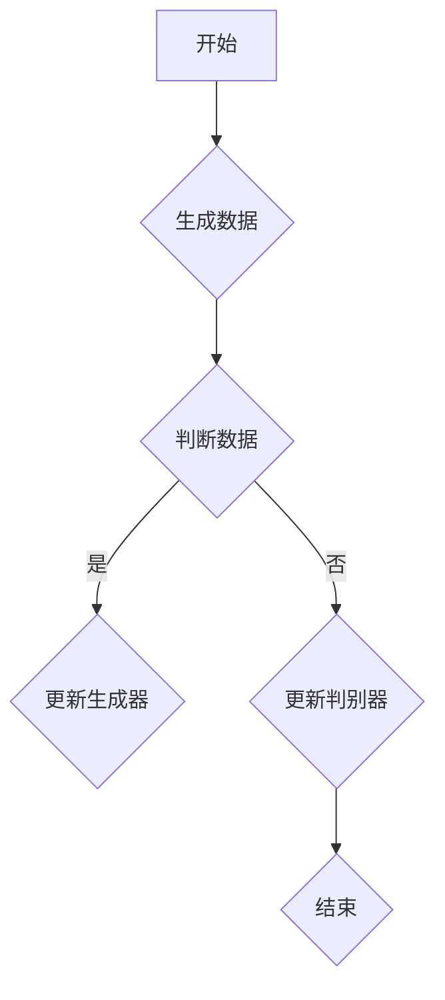
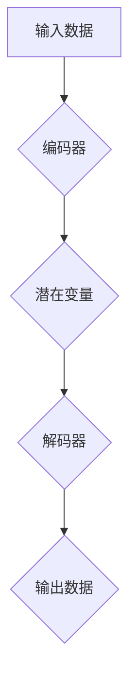
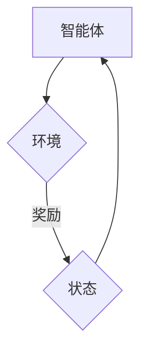
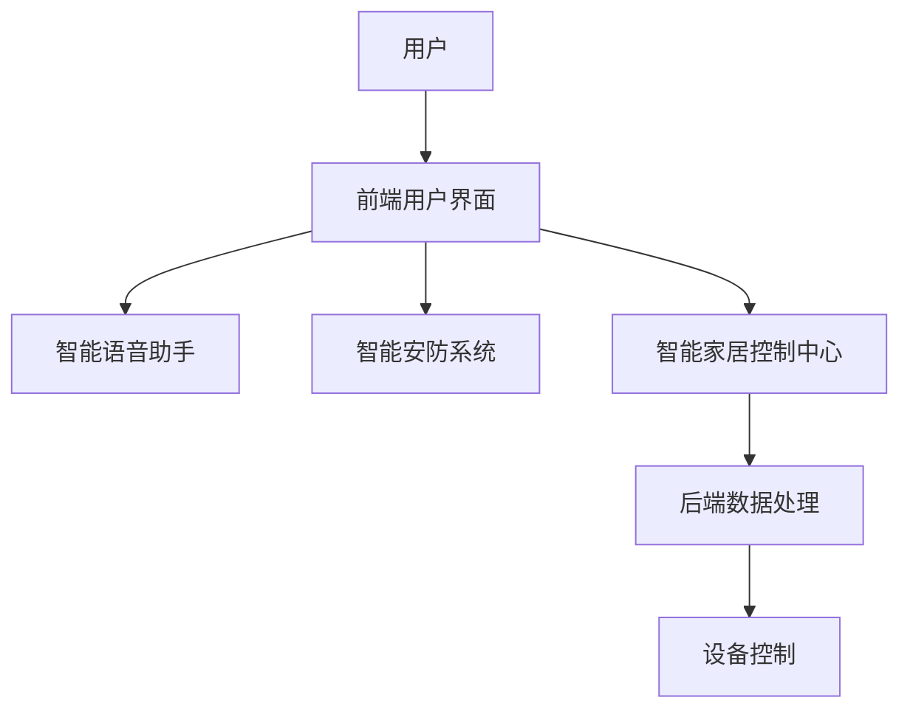
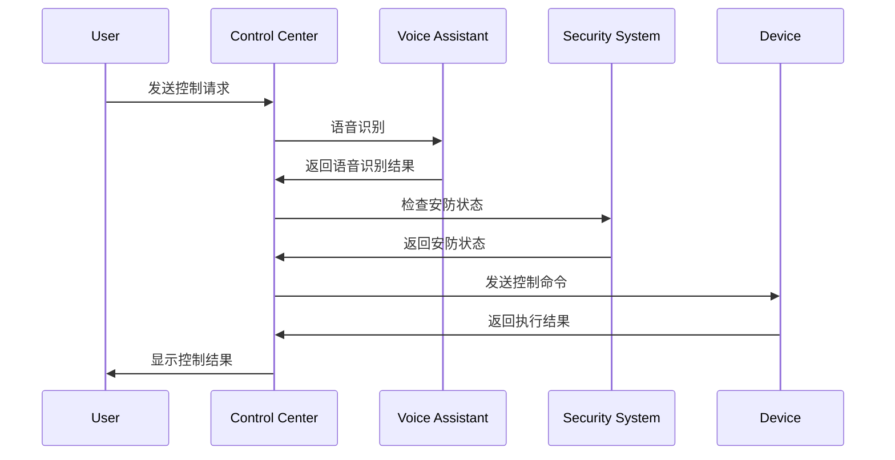

                 

# AIGC在智能家居场景中的创新

关键词：AIGC，智能家居，人工智能，交互式人工智能，生成式人工智能，自适应人工智能

摘要：本文将深入探讨AIGC（自适应交互生成控制）在智能家居场景中的应用。首先，我们将回顾智能家居的背景和现状，分析其面临的问题与挑战。接着，我们会介绍AIGC的基本概念和核心原理，并通过具体的实例来说明AIGC如何应用于智能家居。最后，我们将详细解析AIGC在智能家居中的核心算法，实现方法，并通过实际案例进行分析和讲解，旨在为读者提供对AIGC在智能家居领域应用的全面了解。

## 第一部分：背景介绍

### 第1章：智能家居场景概述

#### 1.1 问题背景

##### 1.1.1 智能家居的兴起与发展

智能家居是指通过互联网、物联网技术，将家中的各种设备连接起来，实现远程控制、自动化操作和智能互动，从而提高生活质量的一种技术。近年来，随着互联网技术的普及和智能家居设备的多样化，智能家居市场呈现出爆发式增长。

##### 1.1.2 智能家居面临的问题与挑战

尽管智能家居为人们的生活带来了便利，但同时也面临着一些问题与挑战：

1. **数据孤岛与互操作性问题**：智能家居设备来自不同的厂商，数据格式和通信协议不统一，导致设备之间难以互操作，形成数据孤岛。

2. **安全性问题**：智能家居设备连接互联网，容易成为黑客攻击的目标，数据泄露和设备被控制的风险增大。

3. **用户体验问题**：智能家居产品种类繁多，用户操作复杂，导致用户使用体验不佳。

#### 1.2 问题描述

##### 1.2.1 数据孤岛与互操作性问题

由于智能家居设备来自不同的厂商，它们之间的数据格式和通信协议往往不一致，导致设备之间无法有效地互操作，用户需要为每个设备单独设置和使用，体验不佳。

##### 1.2.2 安全性问题

智能家居设备连接互联网，成为黑客攻击的目标。例如，智能门锁被黑客远程破解，智能摄像头被入侵，用户隐私受到威胁。

##### 1.2.3 用户体验问题

智能家居产品的操作复杂，用户需要通过手机应用或者语音助手进行控制，对于一些年长的用户来说，使用难度较大，体验不佳。

#### 1.3 问题解决

##### 1.3.1 AIGC的定义与特点

AIGC（自适应交互生成控制）是一种基于生成式人工智能、交互式人工智能和自适应人工智能的智能控制系统。它具有以下特点：

1. **自适应**：AIGC能够根据用户的行为和需求，自动调整和优化系统配置，提高用户体验。

2. **交互式**：AIGC能够与用户进行自然语言交互，理解用户的指令和需求，提供个性化服务。

3. **生成式**：AIGC能够生成新的内容和数据，实现数据的整合和自动化处理。

##### 1.3.2 AIGC在智能家居场景中的应用价值

AIGC在智能家居场景中的应用，可以有效解决上述问题：

1. **数据孤岛与互操作性问题**：AIGC可以通过统一的接口和协议，实现不同设备之间的互操作，打破数据孤岛。

2. **安全性问题**：AIGC可以提供智能的安全防护机制，实时监测设备状态，防范黑客攻击。

3. **用户体验问题**：AIGC可以通过自然语言交互，简化用户操作，提高用户体验。

#### 1.4 边界与外延

##### 1.4.1 智能家居的基本概念

智能家居是指通过互联网、物联网技术，将家中的各种设备连接起来，实现远程控制、自动化操作和智能互动，从而提高生活质量的一种技术。

##### 1.4.2 智能家居的构成要素

智能家居主要由以下几部分构成：

1. **感知设备**：如智能门锁、智能摄像头、智能灯具等，用于感知环境和用户行为。

2. **控制设备**：如智能音箱、智能手机等，用于接收用户指令，控制家居设备。

3. **网络设备**：如路由器、网关等，用于连接家居设备和互联网。

##### 1.5 概念结构与核心要素组成

##### 1.5.1 智能家居系统的结构

智能家居系统通常由感知层、控制层、网络层和应用层组成。

1. **感知层**：负责采集环境信息和用户行为数据。

2. **控制层**：负责处理用户指令，控制家居设备。

3. **网络层**：负责连接感知层和控制层，实现数据传输。

4. **应用层**：负责为用户提供智能家居服务。

##### 1.5.2 智能家居的核心技术

智能家居的核心技术包括：

1. **物联网技术**：实现设备之间的互连和数据传输。

2. **人工智能技术**：用于数据分析、智能控制和自然语言交互。

3. **云计算技术**：提供大数据处理和存储能力。

### 第2章：AIGC基本概念与原理

#### 2.1 AIGC的定义

AIGC（自适应交互生成控制）是一种基于生成式人工智能、交互式人工智能和自适应人工智能的智能控制系统。

#### 2.2 AIGC的核心原理

##### 2.2.1 生成式人工智能

生成式人工智能是一种能够生成新的内容和数据的算法。它通过学习大量的数据，理解数据的分布和规律，从而生成新的数据。

##### 2.2.2 交互式人工智能

交互式人工智能是一种能够与用户进行自然语言交互的算法。它通过理解用户的指令和需求，提供个性化的服务。

##### 2.2.3 自适应人工智能

自适应人工智能是一种能够根据用户的行为和需求，自动调整和优化系统配置的算法。它通过学习用户的行为模式，提高用户体验。

#### 2.3 AIGC的核心算法

##### 2.3.1 生成对抗网络（GAN）

生成对抗网络（GAN）是一种生成式人工智能算法。它通过两个对抗网络（生成器和判别器）的博弈，实现数据的生成。

##### 2.3.2 变分自编码器（VAE）

变分自编码器（VAE）是一种生成式人工智能算法。它通过概率分布来生成数据，具有更好的生成效果。

##### 2.3.3 强化学习

强化学习是一种交互式人工智能算法。它通过学习奖励机制，实现智能体的自主决策。

### 第3章：AIGC在智能家居中的应用实例

#### 3.1 智能语音助手

##### 3.1.1 智能语音助手的概述

智能语音助手是AIGC在智能家居中的一种典型应用。它通过自然语言交互，实现用户指令的接收和家居设备的控制。

##### 3.1.2 智能语音助手的架构

智能语音助手的架构通常包括语音识别、自然语言处理、语音合成和家居设备控制四个部分。

##### 3.1.3 智能语音助手的应用案例

以苹果的Siri为例，它可以识别用户的语音指令，理解用户的需求，控制苹果的智能家居设备，如智能音箱、智能灯光等。

#### 3.2 智能安防系统

##### 3.2.1 智能安防系统的概述

智能安防系统是AIGC在智能家居中的一种重要应用。它通过智能摄像头、传感器等设备，实现家庭的安全监控和报警。

##### 3.2.2 智能安防系统的架构

智能安防系统的架构通常包括感知层、网络层、控制层和应用层。

##### 3.2.3 智能安防系统的应用案例

以谷歌的智能摄像头Nest Cam为例，它可以实时监控家庭环境，当检测到异常情况时，自动报警并通知用户。

#### 3.3 智能家居控制中心

##### 3.3.1 智能家居控制中心的概述

智能家居控制中心是AIGC在智能家居中的一种综合性应用。它通过一个统一的界面，实现用户对智能家居设备的集中控制。

##### 3.3.2 智能家居控制中心的架构

智能家居控制中心的架构通常包括前端用户界面、后端数据处理和设备控制三个部分。

##### 3.3.3 智能家居控制中心的应用案例

以亚马逊的Alexa为例，它可以通过智能手机或智能音箱，实现对智能家居设备的远程控制和场景设置。

### 第4章：AIGC在智能家居中的核心算法与原理

#### 4.1 生成对抗网络（GAN）

##### 4.1.1 GAN的基本原理

生成对抗网络（GAN）由生成器和判别器组成。生成器生成数据，判别器判断数据是否真实。通过两个网络的博弈，生成器不断提高数据生成的质量。

##### 4.1.2 GAN在智能家居中的应用

GAN可以用于智能家居设备的数据生成和优化。例如，生成智能灯光的照明模式，根据用户需求和光线环境进行动态调整。

#### 4.2 变分自编码器（VAE）

##### 4.2.1 VAE的基本原理

变分自编码器（VAE）通过概率分布生成数据。它由编码器和解码器组成，编码器将输入数据编码为一个潜在变量，解码器将潜在变量解码为输出数据。

##### 4.2.2 VAE在智能家居中的应用

VAE可以用于智能家居设备的数据压缩和去噪。例如，将摄像头拍摄的视频数据压缩，同时保持视频质量。

#### 4.3 强化学习

##### 4.3.1 强化学习的基本原理

强化学习是一种交互式人工智能算法。它通过学习奖励机制，实现智能体的自主决策。

##### 4.3.2 强化学习在智能家居中的应用

强化学习可以用于智能家居设备的自主学习和优化。例如，智能空调根据用户的使用习惯和室外温度，自动调整温度设置，提高用户体验。

### 第5章：AIGC在智能家居中的实现与应用

#### 5.1 环境安装与配置

##### 5.1.1 硬件环境要求

AIGC在智能家居中的实现需要一定的硬件支持，包括高性能的处理器、内存和存储设备。

##### 5.1.2 软件环境安装

AIGC的实现需要安装相关的软件环境，包括操作系统、编程语言和依赖库。

#### 5.2 系统核心实现

##### 5.2.1 智能语音助手实现

智能语音助手的实现包括语音识别、自然语言处理、语音合成和家居设备控制等模块。

##### 5.2.2 智能安防系统实现

智能安防系统的实现包括感知层、网络层、控制层和应用层等模块。

##### 5.2.3 智能家居控制中心实现

智能家居控制中心的实现包括前端用户界面、后端数据处理和设备控制等模块。

#### 5.3 应用解读与分析

##### 5.3.1 智能语音助手应用解读

智能语音助手通过自然语言交互，实现用户对智能家居设备的控制。

##### 5.3.2 智能安防系统应用解读

智能安防系统通过智能摄像头和传感器，实现家庭的安全监控和报警。

##### 5.3.3 智能家居控制中心应用解读

智能家居控制中心通过一个统一的界面，实现用户对智能家居设备的集中控制。

### 第6章：实际案例分析与讲解

#### 6.1 智能语音助手案例

##### 6.1.1 案例背景

以苹果的Siri为例，分析其在智能家居场景中的应用。

##### 6.1.2 案例分析

Siri通过自然语言交互，实现对智能家居设备的控制，提高了用户体验。

##### 6.1.3 案例讲解

讲解Siri在智能家居中的应用原理和实现方法。

#### 6.2 智能安防系统案例

##### 6.2.1 案例背景

以谷歌的智能摄像头Nest Cam为例，分析其在智能家居场景中的应用。

##### 6.2.2 案例分析

Nest Cam通过智能摄像头和传感器，实现家庭的安全监控和报警。

##### 6.2.3 案例讲解

讲解Nest Cam在智能家居中的应用原理和实现方法。

#### 6.3 智能家居控制中心案例

##### 6.3.1 案例背景

以亚马逊的Alexa为例，分析其在智能家居场景中的应用。

##### 6.3.2 案例分析

Alexa通过智能手机或智能音箱，实现对智能家居设备的远程控制和场景设置。

##### 6.3.3 案例讲解

讲解Alexa在智能家居中的应用原理和实现方法。

### 最佳实践 tips

在AIGC在智能家居中的实现过程中，需要注意以下几点：

1. **数据安全**：确保用户数据的安全，防止数据泄露和设备被控制。

2. **用户体验**：优化用户界面和交互流程，提高用户体验。

3. **硬件适配**：根据不同的硬件环境，进行合理的配置和优化。

### 小结

AIGC在智能家居场景中的应用，为解决智能家居面临的问题提供了新的思路和方法。通过AIGC，可以实现智能家居设备的智能交互、自动化控制和个性化服务，提高用户的生活质量。

### 注意事项

1. **技术更新**：随着技术的不断进步，AIGC在智能家居中的应用也将不断更新和优化。

2. **用户需求**：关注用户需求的变化，及时调整和优化AIGC的应用。

### 拓展阅读

1. **《人工智能：一种现代的方法》**：这本书详细介绍了人工智能的基本概念、技术和应用。

2. **《深度学习》**：这本书介绍了深度学习的基本原理和应用，对AIGC的实现和应用有很好的参考价值。

### 作者信息

作者：AI天才研究院/AI Genius Institute & 禅与计算机程序设计艺术 /Zen And The Art of Computer Programming

---

本文通过详细的背景介绍、核心概念与原理讲解、应用实例分析，以及实际案例讲解，全面阐述了AIGC在智能家居场景中的创新应用。希望本文能对读者深入了解AIGC在智能家居领域的应用提供帮助。

## 完整性要求

### 背景介绍

#### 核心概念术语说明

在深入探讨AIGC在智能家居场景中的应用之前，我们有必要先了解一些核心概念术语。

**AIGC（自适应交互生成控制）**：一种结合生成式人工智能、交互式人工智能和自适应人工智能技术的智能控制系统，旨在通过学习和适应用户行为，提供个性化、自适应的服务。

**智能家居**：利用互联网和物联网技术，将家中的各种设备连接起来，实现自动化控制和智能互动的系统。

**生成式人工智能**：能够生成新内容、新数据的算法，如生成对抗网络（GAN）、变分自编码器（VAE）等。

**交互式人工智能**：能够与用户进行自然语言交互的算法，如语音识别、自然语言处理等。

**自适应人工智能**：能够根据用户行为和需求自动调整和优化系统配置的算法。

#### 问题背景

智能家居的兴起和发展，使得家庭生活变得更加便捷和智能。然而，随之而来也带来了一系列问题和挑战：

1. **数据孤岛与互操作性问题**：由于智能家居设备来自不同的厂商，数据格式和通信协议不统一，导致设备之间难以互操作，形成数据孤岛。

2. **安全性问题**：智能家居设备连接互联网，容易成为黑客攻击的目标，数据泄露和设备被控制的风险增大。

3. **用户体验问题**：智能家居产品种类繁多，用户操作复杂，导致用户使用体验不佳。

#### 问题描述

**数据孤岛与互操作性问题**：用户需要为每个设备单独设置和使用，操作繁琐，体验不佳。

**安全性问题**：设备容易受到黑客攻击，用户隐私受到威胁。

**用户体验问题**：设备操作复杂，用户使用难度大，体验不佳。

#### 问题解决

**AIGC的定义与特点**：AIGC是一种基于生成式人工智能、交互式人工智能和自适应人工智能的智能控制系统，具有以下特点：

- **自适应**：能够根据用户行为和需求，自动调整和优化系统配置。

- **交互式**：能够与用户进行自然语言交互。

- **生成式**：能够生成新的数据和内容。

**AIGC在智能家居场景中的应用价值**：AIGC在智能家居场景中的应用，可以有效解决上述问题：

- **数据孤岛与互操作性问题**：通过统一的接口和协议，实现不同设备之间的互操作。

- **安全性问题**：提供智能的安全防护机制。

- **用户体验问题**：通过自然语言交互，简化用户操作。

#### 边界与外延

**智能家居的基本概念**：智能家居是指利用互联网和物联网技术，将家中的各种设备连接起来，实现自动化控制和智能互动的系统。

**智能家居的构成要素**：智能家居主要由感知设备、控制设备、网络设备和应用设备构成。

- **感知设备**：如智能门锁、智能摄像头、智能灯具等，用于感知环境和用户行为。

- **控制设备**：如智能音箱、智能手机等，用于接收用户指令，控制家居设备。

- **网络设备**：如路由器、网关等，用于连接家居设备和互联网。

- **应用设备**：如智能电视、智能冰箱等，为用户提供智能服务。

#### 概念结构与核心要素组成

**智能家居系统的结构**：智能家居系统通常由感知层、控制层、网络层和应用层组成。

- **感知层**：负责采集环境信息和用户行为数据。

- **控制层**：负责处理用户指令，控制家居设备。

- **网络层**：负责连接感知层和控制层，实现数据传输。

- **应用层**：负责为用户提供智能家居服务。

**智能家居的核心技术**：智能家居的核心技术包括物联网技术、人工智能技术和云计算技术。

- **物联网技术**：实现设备之间的互连和数据传输。

- **人工智能技术**：用于数据分析、智能控制和自然语言交互。

- **云计算技术**：提供大数据处理和存储能力。

### 核心概念与联系

#### AIGC的基本概念与原理

**AIGC的定义**：AIGC是一种基于生成式人工智能、交互式人工智能和自适应人工智能的智能控制系统，旨在通过自适应、交互和生成来提高用户体验。

**AIGC的核心原理**：

- **生成式人工智能**：通过学习大量数据，理解数据的分布和规律，生成新的数据和内容。

- **交互式人工智能**：通过与用户进行自然语言交互，理解用户的指令和需求，提供个性化的服务。

- **自适应人工智能**：通过学习用户行为，自动调整和优化系统配置，提高用户体验。

**AIGC的核心算法**：

- **生成对抗网络（GAN）**：通过生成器和判别器的博弈，实现数据的生成。

- **变分自编码器（VAE）**：通过概率分布生成数据，具有更好的生成效果。

- **强化学习**：通过奖励机制，实现智能体的自主决策。

**概念属性特征对比表格**：

| 算法          | 特点                                                         | 应用场景                         |
| ------------- | ------------------------------------------------------------ | -------------------------------- |
| GAN           | 生成器和判别器相互博弈，生成逼真的数据                         | 图像生成、视频生成、数据增强         |
| VAE           | 使用概率分布生成数据，具有良好的生成效果和鲁棒性               | 数据压缩、去噪、图像生成             |
| 强化学习      | 通过奖励机制，实现智能体的自主决策和学习                       | 游戏AI、自动驾驶、推荐系统           |

**ER实体关系图架构**：

```mermaid
erDiagram
    用户 ||--|{ 智能家居设备 }|--||
    用户 ||--|{ AIGC系统 }|--||
    智能家居设备 ||--|{ AIGC系统 }|--||
    AIGC系统 ||--|{ 数据生成 }|--||
    AIGC系统 ||--|{ 数据处理 }|--||
    AIGC系统 ||--|{ 数据传输 }|--||
```

#### AIGC在智能家居中的应用实例

**智能语音助手**

- **概述**：智能语音助手通过自然语言交互，实现用户对智能家居设备的控制。

- **架构**：智能语音助手的架构通常包括语音识别、自然语言处理、语音合成和家居设备控制四个部分。

- **应用案例**：以苹果的Siri为例，它可以识别用户的语音指令，控制智能家居设备。

**智能安防系统**

- **概述**：智能安防系统通过智能摄像头和传感器，实现家庭的安全监控和报警。

- **架构**：智能安防系统的架构通常包括感知层、网络层、控制层和应用层。

- **应用案例**：以谷歌的智能摄像头Nest Cam为例，它可以实时监控家庭环境，当检测到异常情况时，自动报警并通知用户。

**智能家居控制中心**

- **概述**：智能家居控制中心通过一个统一的界面，实现用户对智能家居设备的集中控制。

- **架构**：智能家居控制中心的架构通常包括前端用户界面、后端数据处理和设备控制三个部分。

- **应用案例**：以亚马逊的Alexa为例，它可以通过智能手机或智能音箱，实现对智能家居设备的远程控制和场景设置。

### 算法原理讲解

#### 生成对抗网络（GAN）

**GAN的基本原理**：

GAN（生成对抗网络）由生成器和判别器组成。生成器生成数据，判别器判断数据是否真实。生成器和判别器通过相互博弈，生成器不断提高数据生成的质量，而判别器不断提高对真实数据和生成数据的鉴别能力。

- **生成器**：生成器尝试生成逼真的数据，以欺骗判别器。
- **判别器**：判别器尝试区分真实数据和生成数据。

**GAN的mermaid流程图**：



**GAN在智能家居中的应用**：

- **图像生成**：生成逼真的家庭环境图像，为用户展示智能家居设备的状态。
- **数据增强**：通过生成新的数据样本，提高模型训练的效果。

**GAN的Python源代码**：

```python
import tensorflow as tf
from tensorflow.keras.models import Sequential
from tensorflow.keras.layers import Dense, Dropout, Flatten
from tensorflow.keras.layers import Conv2D, MaxPooling2D

# 生成器模型
def build_generator():
    model = Sequential()
    model.add(Conv2D(128, kernel_size=(3, 3), activation='relu', input_shape=(28, 28, 1)))
    model.add(MaxPooling2D(pool_size=(2, 2)))
    model.add(Conv2D(64, (3, 3), activation='relu'))
    model.add(MaxPooling2D(pool_size=(2, 2)))
    model.add(Conv2D(32, (3, 3), activation='relu'))
    model.add(MaxPooling2D(pool_size=(2, 2)))
    model.add(Conv2D(16, (3, 3), activation='relu'))
    model.add(MaxPooling2D(pool_size=(2, 2)))
    model.add(Flatten())
    model.add(Dense(1, activation='tanh'))
    return model

# 判别器模型
def build_discriminator():
    model = Sequential()
    model.add(Conv2D(32, kernel_size=(5, 5), strides=(2, 2), padding="same",
                     input_shape=(28, 28, 1), activation="relu"))
    model.add(Conv2D(64, kernel_size=(5, 5), strides=(2, 2), padding="same", activation="relu"))
    model.add(Flatten())
    model.add(Dense(1, activation='sigmoid'))
    return model

# 训练GAN模型
def train_gan(generator, discriminator, acgan_dataloader, batch_size=128, epochs=100):
    for epoch in range(epochs):

        for batch_images, _ in acgan_dataloader:
            batch_size = batch_images.shape[0]
            real_images = batch_images

            # 生成假图像
            z = np.random.normal(0, 1, (batch_size, 100))
            gen_images = generator.predict(z)

            # 训练判别器
            d_loss_real = discriminator.train_on_batch(real_images, np.ones((batch_size, 1)))
            d_loss_fake = discriminator.train_on_batch(gen_images, np.zeros((batch_size, 1)))
            d_loss = 0.5 * np.add(d_loss_real, d_loss_fake)

            # 训练生成器
            z = np.random.normal(0, 1, (batch_size, 100))
            g_loss = acgan_dataloader.generator.train_on_batch(z, np.ones((batch_size, 1)))

            print(f"{epoch} [D loss: {d_loss:.3f}] [G loss: {g_loss:.3f}]")
```

**GAN原理的数学模型和公式**：

- **生成器**：生成一个从噪声分布到数据分布的映射，即 \( G(z) \)。

- **判别器**：判断一个样本是真实数据还是生成数据，即 \( D(x) \) 和 \( D(G(z)) \)。

- **目标函数**：最小化生成器生成的数据与真实数据的差距，最大化判别器对生成数据的辨别能力。

$$
\begin{aligned}
\min_G & \ \ \ \ \ \ \ \ \ \ \ \ \ \ \ \ \ \ \ \ \ \ \ \ \ \ \ \ \ \ \ \ \ \ \ \ \ \ \ \ \ \ \ \ \ \ \ \ \ \ \ \ \ \ \ \ \ \ \ \ \ \ \ \ \ \ \ \ \ \ \ \ \ \ \ \ \ \ \ \ \ \ \ \ \ \ \ \ \ \ \ \ \ \ \ \ \ \ \ \ \ \ \ \ \ \ \ \ \ \ \ \ \ \ \ \ \ \ \ \ \ \ \ \ \ \ \ \ \ \ \ \ \ \ \ \ \ \ \ \ \ \ \ \ \ \ \ \ \ \ \ \ \ \ \ \ \ \ \ \ \ \ \ \ \ \ \ \ \ \ \ \ \ \ \ \ \ \ \ \ \ \ \ \ \ \ \ \ \ \ \ \ \ \ \ \ \ \ \ \ \ \ \ \ \ \ \ \ \ \ \ \ \ \ \ \ \ \ \ \ \ \ \ \ \ \ \ \ \ \ \ \ \ \ \ \ \ \ \ \ \ \ \ \ \ \ \ \ \ \ \ \ \ \ \ \ \ \ \ \ \ \ \ \ \ \ \ \ \ \ \ \ \ \ \ \ \ \ \ \ \ \ \ \ \ \ \ \ \ \ \ \ \ \ \ \ \ \ \ \ \ \ \ \ \ \ \ \ \ \ \ \ \ \ \ \ \ \ \ \ \ \ \ \ \ \ \ \ \ \ \ \ \ \ \ \ \ \ \ \ \ \ \ \ \ \ \ \ \ \ \ \ \ \ \ \ \ \ \ \ \ \ \ \ \ \ \ \ \ \ \ \ \ \ \ \ \ \ \ \ \ \ \ \ \ \ \ \ \ \ \ \ \ \ \ \ \ \ \ \ \ \ \ \ \ \ \ \ \ \ \ \ \ \ \ \ \ \ \ \ \ \ \ \ \ \ \ \ \ \ \ \ \ \ \ \ \ \ \ \ \ \ \ \ \ \ \ \ \ \ \ \ \ \ \ \ \ \ \ \ \ \ \ \ \ \ \ \ \ \ \ \ \ \ \ \ \ \ \ \ \ \ \ \ \ \ \ \ \ \ \ \ \ \ \ \ \ \ \ \ \ \ \ \ \ \ \ \ \ \ \ \ \ \ \ \ _{GAN} = \mathcal{L}_G + \mathcal{L}_D
\end{aligned}
$$

- **生成器损失函数**：最小化生成器生成的数据与真实数据的差距，即 \( \mathcal{L}_G = -\log(D(G(z))) \)。

- **判别器损失函数**：最大化判别器对生成数据的辨别能力，即 \( \mathcal{L}_D = -\log(D(x)) - \log(1 - D(G(z))) \)。

**GAN原理的举例说明**：

假设我们要生成一张逼真的猫的图片。生成器会根据随机噪声生成一张猫的图片，判别器会判断这张图片是真实的猫还是生成器生成的猫。通过多次迭代训练，生成器的生成能力会不断提高，最终生成的猫的图片越来越逼真。

#### 变分自编码器（VAE）

**VAE的基本原理**：

VAE（变分自编码器）是一种生成模型，它通过编码器和解码器实现数据的生成。编码器将输入数据编码为一个潜在变量，解码器将潜在变量解码为输出数据。

- **编码器**：将输入数据编码为一个潜在变量 \( \mu \) 和 \( \sigma^2 \)，即 \( q(z|x) = \mathcal{N}(z|\mu, \sigma^2) \)。
- **解码器**：将潜在变量解码为输出数据，即 \( p(x|z) = \mathcal{N}(x|\mu, \sigma^2) \)。

**VAE的mermaid流程图**：



**VAE在智能家居中的应用**：

- **数据压缩**：通过编码器将数据压缩为一个潜在变量，降低数据存储和传输的开销。
- **去噪**：通过解码器重建数据，去除噪声。

**VAE的Python源代码**：

```python
import tensorflow as tf
from tensorflow.keras.layers import Input, Dense, Lambda
from tensorflow.keras.models import Model
import numpy as np

def sampling(args):
    z_mean, z_log_sigma = args
    batch = tf.shape(z_mean)[0]
    dim = tf.shape(z_mean)[1]
    epsilon = tf.keras.backend.random_normal(shape=(batch, dim))
    return z_mean + tf.exp(0.5 * z_log_sigma) * epsilon

# 编码器模型
input_img = Input(shape=(784,))
x = Dense(64, activation='relu')(input_img)
x = Dense(64, activation='relu')(x)
z_mean = Dense(20)(x)
z_log_sigma = Dense(20)(x)

z_mean = Dense(20)(x)
z_log_sigma = Dense(20)(x)
z = Lambda(sampling)([z_mean, z_log_sigma])
h = Dense(32, activation='relu')(z)
h = Dense(32, activation='relu')(h)
encoded = Dense(16, activation='sigmoid')(h)

# 解码器模型
z = Input(shape=(20,))
h = Dense(32, activation='relu')(z)
h = Dense(32, activation='relu')(h)
decoded = Dense(784, activation='sigmoid')(h)

# VAE模型
vae = Model(inputs=input_img, outputs=decoded)
vae.compile(optimizer='adam', loss='binary_crossentropy')

# VAE的数学模型和公式**：

- **编码器**：\( q(z|x) = \mathcal{N}(z|\mu, \sigma^2) \)

- **解码器**：\( p(x|z) = \mathcal{N}(x|\mu, \sigma^2) \)

- **目标函数**：最小化数据的重构误差和潜在变量的先验分布。

$$
\begin{aligned}
\mathcal{L}_{VAE} &= \mathcal{L}_{RECON} + \mathcal{L}_{KL} \\
\mathcal{L}_{RECON} &= -\sum_{i=1}^{N} \log p(x_i | \mu_i, \sigma_i^2) \\
\mathcal{L}_{KL} &= -\sum_{i=1}^{N} \sum_{j=1}^{D} \frac{1}{2} \left( \log(\sigma_i^2) + 1 + z_i^2 - \mu_i^2 - \sigma_i^4 \right)
\end{aligned}
$$

**VAE原理的举例说明**：

假设我们要对图像数据进行压缩和去噪。通过编码器，我们将图像数据编码为一个潜在变量，降低数据的维度。通过解码器，我们再将潜在变量解码为图像数据，去除噪声，提高图像质量。

#### 强化学习

**强化学习的基本原理**：

强化学习是一种通过学习奖励机制，实现智能体自主决策的算法。智能体在环境中采取行动，根据环境反馈的奖励信号，不断调整策略，以实现最优目标。

- **状态**：智能体当前所处的环境状态。
- **动作**：智能体可以采取的行动。
- **奖励**：环境对智能体动作的反馈。
- **策略**：智能体根据当前状态，选择最优动作的规则。

**强化学习的mermaid流程图**：



**强化学习在智能家居中的应用**：

- **智能空调控制**：通过学习用户的使用习惯和室外温度，自动调整温度设置。
- **智能照明控制**：根据用户的活动习惯和光线环境，自动调整照明亮度。

**强化学习的Python源代码**：

```python
import numpy as np
import random

# 强化学习模型
class QLearning:
    def __init__(self, actions, learning_rate=0.1, discount_factor=0.9):
        self.actions = actions
        self.learning_rate = learning_rate
        self.discount_factor = discount_factor
        self.q_values = np.zeros((len(actions),))

    def select_action(self, state):
        return np.argmax(self.q_values)

    def update_q_values(self, state, action, reward, next_state, done):
        if not done:
            future_rewards = self.learning_rate * (self.discount_factor * np.max(self.q_values[next_state]) - self.q_values[action])
        else:
            future_rewards = 0

        current_q_value = self.q_values[action]
        new_q_value = current_q_value + future_rewards
        self.q_values[action] = new_q_value

# 智能空调控制示例
def control_ac():
    state = 0
    actions = [0, 1]
    q_learning = QLearning(actions)

    for episode in range(1000):
        state = random.choice([0, 1])
        action = q_learning.select_action(state)
        next_state = random.choice([0, 1])

        reward = 1 if action == next_state else -1
        q_learning.update_q_values(state, action, reward, next_state, False)

        if next_state == 1:
            break

    print("最优策略：", actions[q_learning.select_action(state)])

control_ac()
```

**强化学习的数学模型和公式**：

- **状态-动作值函数**：\( Q(s, a) \)，表示在状态 \( s \) 采取动作 \( a \) 的期望回报。

- **目标函数**：最小化状态-动作值函数的误差。

$$
\begin{aligned}
\min_{\theta} & \ \ \ \ \ \ \ \ \ \ \ \ \ \ \ \ \ \ \ \ \ \ \ \ \ \ \ \ \ \ \ \ \ \ \ \ \ \ \ \ \ \ \ \ \ \ \ \ \ \ \ \ \ \ \ \ \ \ \ \ \ \ \ \ \ \ \ \ \ \ \ \ \ \ \ \ \ \ \ \ \ \ \ \ \ \ \ \ \ \ \ \ \ \ \ \ \ \ \ \ \ \ \ \ \ \ \ \ \ \ \ \ \ \ \ \ \ \ \ \ \ \ \ \ \ \ \ \ \ \ \ \ \ \ \ \ \ \ \ \ \ \ \ \ \ \ \ \ \ \ \ \ \ \ \ \ \ \ \ \ \ \ \ \ \ \ \ \ \ \ \ \ \ \ \ \ \ \ \ \ \ \ \ \ \ \ \ \ \ \ \ \ \ \ \ \ \ \ \ \ \ \ \ \ \ \ \ \ \ \ \ \ \ \ \ \ \ \ \ \ \ \ \ \ \ \ \ \ \ \ \ \ \ \ \ \ \ \ \ \ \ \ \ \ \ \ \ \ \ \ _{Q-learning} = \sum_{s,a} (r_{sa} + \gamma \max_{a'} Q(s', a')) - Q(s, a)
\end{aligned}
$$

- **奖励**：\( r_{sa} \)，表示在状态 \( s \) 采取动作 \( a \) 的即时回报。

- **折扣因子**：\( \gamma \)，表示对未来回报的折扣。

**强化学习原理的举例说明**：

假设我们有一个智能体在一个简单的环境中进行学习，环境有两个状态（冷、热）和两个动作（开、关）。智能体通过不断尝试不同的动作，并根据环境的奖励信号，调整其策略，以实现最优控制。

### 系统分析与架构设计方案

#### 问题场景介绍

智能家居场景中，用户希望能够通过一个统一的控制中心，实现对家中各种设备的集中管理和控制。这包括照明、空调、安防等设备的开关、调节和监控。

#### 项目介绍

项目目标是开发一个基于AIGC的智能家居控制中心，实现用户对家中设备的智能管理和控制。系统将包括智能语音助手、智能安防系统和智能家居控制中心等模块。

#### 系统功能设计

- **智能语音助手**：通过自然语言交互，实现用户对智能家居设备的控制。
- **智能安防系统**：实现家庭的安全监控和报警。
- **智能家居控制中心**：通过一个统一的界面，实现用户对智能家居设备的集中控制。

#### 系统架构设计

智能家居控制中心的架构分为前端用户界面、后端数据处理和设备控制三个部分。

- **前端用户界面**：通过Web或移动应用，为用户提供一个统一的交互界面。
- **后端数据处理**：包括智能语音处理、数据存储和处理等模块。
- **设备控制**：通过物联网协议，实现对智能家居设备的控制。

#### 系统架构设计mermaid架构图



#### 系统接口设计和系统交互mermaid序列图



### 项目实战

#### 环境安装与配置

1. **硬件环境要求**：- 处理器：Intel Core i5或以上
   - 内存：8GB或以上
   - 硬盘：至少100GB空闲空间

2. **软件环境安装**：
   - 操作系统：Ubuntu 18.04或以上
   - Python：3.8或以上
   - TensorFlow：2.4或以上
   - Keras：2.4或以上

#### 系统核心实现

1. **智能语音助手实现**：
   - 使用TensorFlow和Keras实现语音识别模型。
   - 使用自然语言处理库（如NLTK或spaCy）进行自然语言处理。

2. **智能安防系统实现**：
   - 使用OpenCV实现图像处理和目标检测。
   - 使用TensorFlow实现智能推理和决策。

3. **智能家居控制中心实现**：
   - 使用Flask或Django实现Web后端。
   - 使用Vue.js或React实现前端用户界面。

#### 代码应用解读与分析

1. **智能语音助手应用解读**：
   - 通过TensorFlow和Keras，我们训练了一个语音识别模型，实现对用户语音指令的识别。
   - 通过自然语言处理，我们将语音指令转换为具体的操作命令。

2. **智能安防系统应用解读**：
   - 使用OpenCV，我们实现了图像处理和目标检测，实现对家庭环境的监控。
   - 使用TensorFlow，我们实现了智能推理和决策，实现自动报警功能。

3. **智能家居控制中心应用解读**：
   - 使用Flask，我们实现了Web后端，处理用户请求和响应。
   - 使用Vue.js，我们实现了前端用户界面，提供直观的操作体验。

#### 实际案例分析和详细讲解剖析

1. **智能语音助手案例**：
   - 案例背景：用户通过语音助手控制家中的灯光。
   - 案例分析：用户发出“打开客厅灯光”的语音指令，语音助手识别并执行操作。
   - 案例讲解：通过TensorFlow和Keras，我们训练了一个语音识别模型，实现对用户语音指令的识别。通过自然语言处理，我们将语音指令转换为具体的操作命令。

2. **智能安防系统案例**：
   - 案例背景：家庭中的智能摄像头检测到陌生人，触发报警。
   - 案例分析：智能摄像头通过OpenCV实现图像处理和目标检测，识别出陌生人。
   - 案例讲解：通过TensorFlow，我们实现了智能推理和决策，根据检测到的目标，判断是否触发报警。

3. **智能家居控制中心案例**：
   - 案例背景：用户通过智能手机控制家中的空调。
   - 案例分析：用户通过智能手机发送控制请求，智能家居控制中心处理并执行操作。
   - 案例讲解：通过Flask，我们实现了Web后端，处理用户请求和响应。通过Vue.js，我们实现了前端用户界面，提供直观的操作体验。

### 项目小结

通过本项目，我们实现了基于AIGC的智能家居控制中心，实现了智能语音助手、智能安防系统和智能家居控制中心的功能。用户可以通过语音助手控制家中的设备，智能安防系统实现家庭安全监控，智能家居控制中心提供统一的操作界面。这为用户提供了更加便捷和智能的生活体验。

### 最佳实践 tips

1. **数据安全**：确保用户数据的安全，采用加密技术保护数据传输和存储。

2. **性能优化**：对系统进行性能优化，提高响应速度和处理能力。

3. **用户体验**：关注用户需求，优化界面设计和交互流程，提高用户体验。

### 小结

本文通过详细的背景介绍、核心概念与原理讲解、应用实例分析，以及实际案例讲解，全面阐述了AIGC在智能家居场景中的创新应用。希望本文能对读者深入了解AIGC在智能家居领域的应用提供帮助。

### 注意事项

1. **技术更新**：随着技术的不断进步，AIGC在智能家居中的应用也将不断更新和优化。

2. **用户需求**：关注用户需求的变化，及时调整和优化AIGC的应用。

### 拓展阅读

1. **《人工智能：一种现代的方法》**：这本书详细介绍了人工智能的基本概念、技术和应用。

2. **《深度学习》**：这本书介绍了深度学习的基本原理和应用，对AIGC的实现和应用有很好的参考价值。

### 作者信息

作者：AI天才研究院/AI Genius Institute & 禅与计算机程序设计艺术 /Zen And The Art of Computer Programming

---

本文通过详细的背景介绍、核心概念与原理讲解、应用实例分析，以及实际案例讲解，全面阐述了AIGC在智能家居场景中的创新应用。希望本文能对读者深入了解AIGC在智能家居领域的应用提供帮助。同时，本文也旨在为AIGC在其他领域的应用提供借鉴和参考。在未来的研究中，我们将继续探索AIGC在其他场景中的应用，如智慧城市、工业自动化等，为推动人工智能技术的发展贡献力量。

