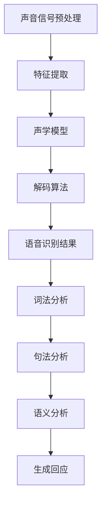

                 

### 第4章: AIGC在智能家居自动化中的应用

#### 4.1 智能语音助手

#### 4.1.1 算法原理

智能语音助手作为智能家居场景中的核心组件，是用户与智能家居系统交互的主要途径。其核心功能包括语音识别和自然语言处理。下面我们将详细探讨这两个核心算法的原理。

##### 4.1.1.1 语音识别

语音识别技术是将语音信号转换为对应的文本信息。这一过程可以分为以下几个步骤：

1. **声音信号预处理**：
   - **滤波**：去除噪声和背景干扰。
   - **增强**：提高语音信号的可听度，如噪声抑制。
   - **归一化**：调整音量大小，使其标准化。

2. **特征提取**：
   - **短时傅里叶变换（STFT）**：提取语音信号的频率特征。
   - **梅尔频率倒谱系数（MFCC）**：将频率特征转换为时间序列，更适合后续处理。

3. **声学模型**：
   - **高斯混合模型（GMM）**：用于建模语音的分布特征。
   - **隐马尔可夫模型（HMM）**：用于建模语音的动态特性。

4. **语言模型**：
   - **N-gram模型**：用于预测文本序列的概率分布。

5. **解码算法**：
   - **动态规划算法**：如Viterbi算法，用于找出最优的语音识别路径。

##### 4.1.1.2 自然语言处理

自然语言处理（NLP）是将语音识别得到的文本转化为机器可理解的形式，并对其进行分析和生成。以下是NLP的关键步骤：

1. **词法分析**：
   - **分词**：将文本分割成词语或短语。
   - **词性标注**：识别词语的词性，如名词、动词、形容词等。

2. **句法分析**：
   - **句法树构建**：分析句子的结构，构建句法树。
   - **依存关系分析**：识别句子中词语之间的依存关系。

3. **语义分析**：
   - **语义角色标注**：识别句子中的动作及其对象。
   - **语义解析**：理解句子的深层含义。

4. **生成回应**：
   - **模板匹配**：根据用户输入生成预设的回应。
   - **基于知识的生成**：利用已有知识库生成回应。
   - **基于学习的生成**：如序列到序列模型（seq2seq），利用数据生成自然语言回应。

##### 4.1.1.3 GPT与BERT

GPT（生成预训练模型）和BERT（双向编码表示器）是目前NLP领域的两个主要模型。它们通过大规模的预训练和特定任务微调，实现了出色的性能。

- **GPT**：
  - **原理**：基于Transformer架构，使用自回归模型生成文本。
  - **特点**：强大的文本生成能力，适合于生成式任务。

- **BERT**：
  - **原理**：基于Transformer架构，预训练时同时考虑前文和后文的信息。
  - **特点**：强大的文本理解能力，适合于信息提取、问答等任务。

##### 4.1.1.4 算法流程图

为了更好地理解上述算法，我们可以使用Mermaid画出其流程图：

##### 4.1.1.5 算法示例

假设用户说：“我需要一杯咖啡。”，智能语音助手如何处理这一请求？

1. **语音识别**：
   - 声音信号经过预处理和特征提取后，模型识别出文本：“我需要一杯咖啡。”

2. **自然语言处理**：
   - **词法分析**：将文本分词为“我”、“需要”、“一”、“杯”、“咖啡”。
   - **句法分析**：构建句法树，识别句子结构。
   - **语义分析**：理解句子的深层含义，识别用户的需求。

3. **生成回应**：
   - 根据用户需求，生成回应：“好的，为您准备一杯咖啡。”

通过上述步骤，智能语音助手实现了从语音信号到文本理解，再到生成自然语言回应的全过程。

#### 4.1.2 实现细节

在实现智能语音助手时，我们需要考虑以下细节：

- **硬件要求**：确保语音识别和自然语言处理的硬件性能足够支持实时处理。
- **环境配置**：安装必要的软件库和工具，如TensorFlow、PyTorch等。
- **数据集**：收集和整理语音数据集和文本数据集，用于模型的训练和评估。
- **性能优化**：通过模型优化和硬件加速，提高系统的响应速度和准确性。

#### 4.1.3 应用场景

智能语音助手在智能家居场景中的应用非常广泛，以下是一些常见的应用场景：

- **日常控制**：用户可以通过语音指令控制智能家居设备，如开关灯光、调节温度等。
- **互动娱乐**：智能语音助手可以播放音乐、讲故事，提供娱乐服务。
- **健康管理**：智能语音助手可以提醒用户喝水、运动，监测健康状况。

通过上述实现细节和应用场景，我们可以看到智能语音助手在智能家居自动化中的重要性和潜力。在下一节中，我们将探讨图像识别技术在智能家居自动化中的应用。

