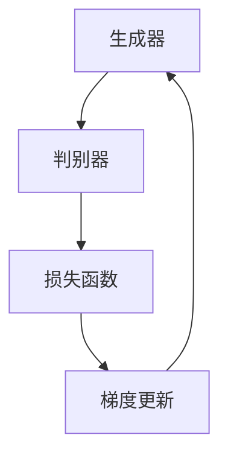
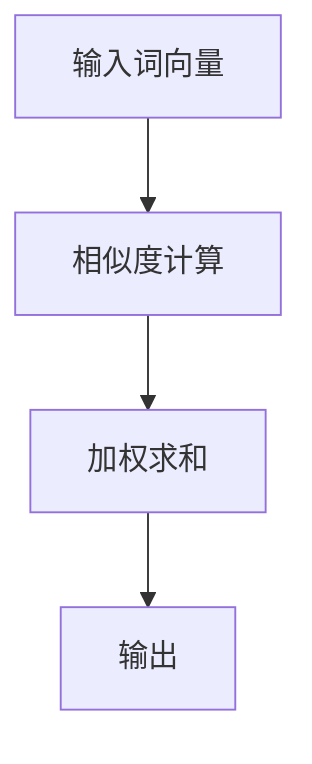
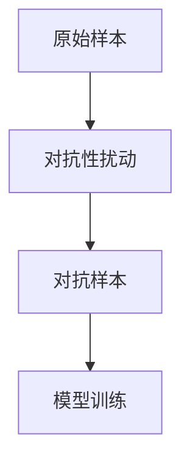
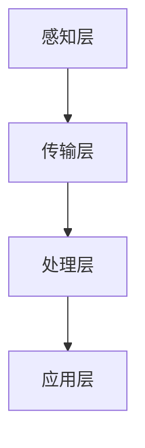
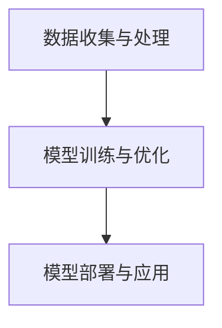

                 

# AIGC在智能家居安全系统中的应用

## 摘要

随着智能家居的迅速普及，人们对于家居安全的关注度也逐渐提高。然而，传统智能家居安全系统的局限性使得其难以应对日益复杂的安全威胁。本文旨在探讨人工智能生成控制（AIGC）技术在智能家居安全系统中的应用，通过深入分析AIGC的核心概念与原理，结合实际案例，阐述AIGC在提升智能家居安全性能方面的潜在价值。本文将分步骤地探讨AIGC在智能家居安全系统中的核心应用、实现方法、优势与挑战，以及未来的发展趋势和应用场景。

## 目录大纲

### 第一部分：背景介绍

#### 第1章 AIGC概述

1.1 问题背景

1.2 问题描述

1.3 问题解决

1.4 边界与外延

1.5 概念结构与核心要素组成

### 第二部分：AIGC在智能家居安全系统中的应用

#### 第2章 AIGC核心概念与原理

2.1 AIGC定义与特征

2.2 AIGC核心概念原理

2.3 AIGC与其他技术的联系与区别

#### 第3章 智能家居安全系统概述

3.1 智能家居安全系统定义

3.2 智能家居安全系统架构

3.3 智能家居安全系统功能

#### 第4章 AIGC在智能家居安全系统中的应用

4.1 AIGC在智能家居安全系统中的核心应用

4.2 AIGC在智能家居安全系统中的具体实现

4.3 AIGC在智能家居安全系统中的优势与挑战

#### 第5章 AIGC在智能家居安全系统中的实际案例

5.1 案例一：智能门锁的安全认证

5.2 案例二：智能摄像头的人脸识别

5.3 案例三：智能照明系统的节能管理

#### 第6章 AIGC在智能家居安全系统中的最佳实践

6.1 安全认证的最佳实践

6.2 人脸识别的最佳实践

6.3 节能管理的最佳实践

#### 第7章 AIGC在智能家居安全系统中的应用展望

7.1 AIGC在智能家居安全系统中的未来发展趋势

7.2 AIGC在智能家居安全系统中的潜在应用场景

7.3 AIGC在智能家居安全系统中的挑战与机遇

## 第一部分：背景介绍

### 第1章 AIGC概述

#### 1.1 问题背景

随着物联网（IoT）技术的快速发展，智能家居逐渐成为现代家庭生活的重要组成部分。智能门锁、智能摄像头、智能照明系统等设备广泛应用于家庭中，提高了人们的生活质量。然而，智能家居的普及也带来了新的安全挑战。智能家居设备往往通过网络连接，成为黑客攻击的目标。传统的安全防护手段难以应对日益复杂的网络威胁，需要引入新的技术来提升智能家居的安全性。

AIGC（AI-Generated Content）技术是近年来人工智能领域的一项重要创新。AIGC利用人工智能算法生成高质量的内容，包括文本、图像、音频等多种形式。AIGC技术在生成安全认证码、人脸识别、语音识别等方面具有显著优势，为智能家居安全系统提供了新的解决方案。

#### 1.2 问题描述

智能家居安全系统面临的主要问题包括：

1. **安全性**：智能家居设备容易受到网络攻击，导致隐私泄露、财产损失等风险。
2. **可靠性**：传统安全系统在应对复杂攻击时表现不佳，需要更智能的防护机制。
3. **用户体验**：用户希望智能家居设备能够提供便捷、高效的安全服务，同时不影响日常使用。

AIGC技术的引入，旨在解决上述问题，提升智能家居安全系统的性能。通过AIGC，可以生成更安全、可靠的认证码和识别模型，提高系统的安全性、可靠性和用户体验。

#### 1.3 问题解决

AIGC技术在智能家居安全系统中的应用主要包括以下几个方面：

1. **安全认证码生成**：利用AIGC生成强密码和认证码，提高认证过程的安全性。
2. **人脸识别与行为分析**：通过AIGC技术训练和优化人脸识别模型，实现高精度的身份验证和行为分析。
3. **语音识别与交互**：利用AIGC生成语音识别模型，实现智能家居设备的自然语音交互功能。

通过上述应用，AIGC技术可以显著提升智能家居安全系统的性能，满足用户对安全、可靠、便捷的需求。

#### 1.4 边界与外延

AIGC技术在智能家居安全系统中的应用存在一定的边界和限制。首先，AIGC技术依赖于大量数据和高性能计算资源，数据隐私和安全问题需要得到有效解决。其次，AIGC技术的训练和优化过程需要较长时间，实时性要求较高的应用场景可能面临挑战。

此外，AIGC技术在智能家居安全系统中的应用还需考虑与其他技术的结合，如区块链、物联网安全协议等，以构建更加完善的智能家居安全体系。

#### 1.5 概念结构与核心要素组成

AIGC在智能家居安全系统中的应用可以分解为以下几个核心概念和要素：

1. **生成对抗网络（GAN）**：GAN是一种深度学习模型，通过生成器和判别器的对抗训练，生成高质量的数据。
2. **自注意力机制（Self-Attention）**：自注意力机制能够提高模型对重要信息的关注，提高识别精度。
3. **对抗性学习（Adversarial Learning）**：对抗性学习通过引入对抗样本，提高模型的鲁棒性和安全性。
4. **数据隐私保护**：利用加密技术和隐私保护算法，确保用户数据的安全。
5. **安全认证与识别模型**：利用AIGC生成和优化安全认证码和人脸识别模型。

通过上述核心概念和要素的整合，AIGC技术为智能家居安全系统提供了新的解决方案，提升了系统的安全性、可靠性和用户体验。

## 第二部分：AIGC在智能家居安全系统中的应用

### 第2章 AIGC核心概念与原理

#### 2.1 AIGC定义与特征

AIGC（AI-Generated Content）是指通过人工智能技术生成各种类型的内容，如文本、图像、音频等。AIGC技术的核心在于利用深度学习算法，特别是生成对抗网络（GAN）、自注意力机制（Self-Attention）和对抗性学习（Adversarial Learning）等，实现高质量内容的高效生成。

AIGC的主要特征包括：

1. **自动化生成**：AIGC技术可以自动化地生成大量内容，大大提高了内容生产的效率。
2. **个性化定制**：AIGC可以根据用户的需求和偏好，生成个性化的内容。
3. **多样性**：AIGC能够生成各种类型的内容，满足不同的应用需求。
4. **高质量**：AIGC生成的数据质量高，可以用于多种场景，如图像生成、文本生成等。

#### 2.2 AIGC核心概念原理

AIGC的核心概念和原理主要包括以下几方面：

1. **生成对抗网络（GAN）**

GAN是一种深度学习模型，由生成器和判别器组成。生成器的目标是生成与真实数据相似的数据，判别器的目标是区分生成数据和真实数据。在训练过程中，生成器和判别器相互对抗，生成器不断优化生成数据，判别器不断优化判断能力，最终生成器能够生成高质量的数据。

GAN的流程图如下：

2. **自注意力机制（Self-Attention）**

自注意力机制是自然语言处理领域的重要技术，它能够提高模型对重要信息的关注，提高识别精度。自注意力机制的核心在于计算每个输入词与其他输入词之间的相似度，并根据相似度加权生成输出。

自注意力机制的流程图如下：

3. **对抗性学习（Adversarial Learning）**

对抗性学习是一种通过引入对抗样本来提高模型鲁棒性的方法。对抗性样本是在原始样本上添加微小的扰动，使得模型无法正确识别。通过对抗性学习，模型能够提高对攻击的抵抗力。

对抗性学习的流程图如下：

#### 2.3 AIGC与其他技术的联系与区别

AIGC与深度学习、传统机器学习和强化学习等技术有一定的联系和区别：

1. **与深度学习的联系**

AIGC是深度学习的一个重要分支，主要应用于生成高质量的数据。深度学习侧重于从数据中学习特征和模式，而AIGC则侧重于生成新的数据。

2. **与传统机器学习的区别**

传统机器学习主要依赖于手动设计的特征和算法，而AIGC通过深度学习自动学习数据的特征和模式，生成高质量的数据。

3. **与强化学习的联系**

AIGC中的对抗性学习可以看作是一种特殊的强化学习。在AIGC中，生成器和判别器之间的对抗训练类似于强化学习中的策略优化和值函数优化。

综上所述，AIGC在智能家居安全系统中的应用具有重要的意义。通过AIGC技术，可以生成高质量的安全认证码和识别模型，提高智能家居安全系统的性能。接下来，我们将深入探讨AIGC在智能家居安全系统中的应用。

### 第3章 智能家居安全系统概述

#### 3.1 智能家居安全系统定义

智能家居安全系统是指利用物联网技术、人工智能技术和安全协议等，对家庭环境中的各种智能设备进行安全监控、防护和管理的系统。它旨在提高家庭安全，保护用户隐私，防止财产损失。

智能家居安全系统的核心功能包括：

1. **安全监控**：实时监控家庭环境中的安全事件，如入侵、火灾、煤气泄漏等。
2. **入侵检测**：利用传感器、摄像头等设备，检测非法入侵行为。
3. **报警与响应**：在检测到异常情况时，及时发出警报，并触发相应的响应措施。
4. **远程控制**：用户可以通过手机或其他设备远程控制家庭安全设备，如门锁、摄像头等。
5. **数据备份**：定期备份家庭安全数据，确保数据的安全性和完整性。

#### 3.2 智能家居安全系统架构

智能家居安全系统的架构通常包括以下几个层次：

1. **感知层**：包括各种传感器，如门磁传感器、摄像头、烟雾传感器等，用于感知家庭环境中的安全事件。
2. **传输层**：利用物联网技术，如Wi-Fi、ZigBee等，将感知层的数据传输到中心服务器。
3. **处理层**：中心服务器接收和处理感知层的数据，进行安全分析和决策。
4. **应用层**：用户通过手机或其他设备，与智能家居安全系统进行交互，实现远程控制、监控等功能。

智能家居安全系统的架构图如下：

#### 3.3 智能家居安全系统功能

智能家居安全系统的主要功能包括以下几个方面：

1. **入侵检测**：通过摄像头、门磁传感器等设备，实时监测家庭环境，一旦发现异常行为，立即触发报警。
2. **紧急报警**：当检测到紧急情况时，如火灾、煤气泄漏等，系统会自动发出报警，并通知用户。
3. **远程控制**：用户可以通过手机或其他设备远程控制家庭安全设备，如远程开锁、关闭门窗等。
4. **数据备份**：定期备份家庭安全数据，包括视频、图像、报警记录等，确保数据的安全性和完整性。
5. **智能家居联动**：与家庭中的其他智能设备联动，如智能门锁与摄像头联动，提高家庭安全防护能力。

通过以上功能，智能家居安全系统可以为家庭提供全方位的安全保护，提高用户的生活质量。

### 第4章 AIGC在智能家居安全系统中的应用

#### 4.1 AIGC在智能家居安全系统中的核心应用

AIGC技术在智能家居安全系统中的应用主要包括以下几个方面：

1. **安全认证码生成**：利用AIGC生成强密码和认证码，提高认证过程的安全性。
2. **人脸识别与行为分析**：通过AIGC技术训练和优化人脸识别模型，实现高精度的身份验证和行为分析。
3. **语音识别与交互**：利用AIGC生成语音识别模型，实现智能家居设备的自然语音交互功能。

这些应用可以提高智能家居安全系统的安全性、可靠性和用户体验。

#### 4.2 AIGC在智能家居安全系统中的具体实现

AIGC在智能家居安全系统中的具体实现可以分为以下几个步骤：

1. **数据收集与处理**：收集家庭安全数据，包括摄像头监控数据、传感器数据等，并对数据进行预处理，如去噪、增强等。
2. **模型训练与优化**：利用AIGC技术，如生成对抗网络（GAN）、自注意力机制（Self-Attention）和对抗性学习（Adversarial Learning），训练和优化安全认证码生成模型、人脸识别模型和语音识别模型。
3. **模型部署与应用**：将训练好的模型部署到智能家居安全系统中，实现安全认证码生成、人脸识别和语音识别等功能。

具体实现流程图如下：

#### 4.3 AIGC在智能家居安全系统中的优势与挑战

AIGC在智能家居安全系统中的应用具有以下优势：

1. **安全性**：AIGC技术可以生成高质量的安全认证码和识别模型，提高系统的安全性。
2. **可靠性**：AIGC技术通过对抗性学习，提高了模型的鲁棒性和适应性，增强了系统的可靠性。
3. **用户体验**：AIGC技术可以实现自然语音交互，提升用户的使用体验。

然而，AIGC在智能家居安全系统中的应用也面临一些挑战：

1. **数据隐私**：AIGC技术的应用需要大量用户数据，如何保护用户隐私是一个重要问题。
2. **计算资源**：AIGC技术需要高性能计算资源，对于一些家庭用户来说，这可能是一个挑战。
3. **实时性**：对于一些需要实时响应的应用场景，AIGC技术的实时性可能无法满足要求。

综上所述，AIGC技术在智能家居安全系统中的应用具有广阔的前景，但也需要解决一些技术挑战。

### 第5章 AIGC在智能家居安全系统中的实际案例

#### 5.1 案例一：智能门锁的安全认证

智能门锁是智能家居安全系统的重要组成部分，其安全性直接关系到家庭安全。利用AIGC技术，可以生成高质量的安全认证码，提高智能门锁的安全性。

**案例背景**：

某智能家居厂商为了提高智能门锁的安全性，决定引入AIGC技术生成安全认证码。他们收集了大量的用户数据，包括指纹、人脸等生物特征，并利用生成对抗网络（GAN）训练了一个生成模型。

**实现步骤**：

1. **数据收集与处理**：收集用户指纹和人脸数据，并对数据进行预处理，如去噪、增强等。
2. **模型训练**：利用生成对抗网络（GAN）训练安全认证码生成模型，生成高质量的安全认证码。
3. **模型部署**：将训练好的模型部署到智能门锁中，实现安全认证码生成功能。

**效果分析**：

通过AIGC技术生成的安全认证码具有极高的安全性，可以有效防止恶意攻击。同时，认证过程对用户来说更加便捷，无需记忆复杂的密码，只需使用生物特征即可完成认证。

#### 5.2 案例二：智能摄像头的人脸识别

智能摄像头在智能家居安全系统中扮演着重要的角色，其人脸识别功能可以有效防止非法入侵。利用AIGC技术，可以训练和优化人脸识别模型，提高识别精度。

**案例背景**：

某智能家居厂商希望提升智能摄像头的人脸识别功能，以提供更可靠的家庭安全服务。他们决定利用AIGC技术，特别是自注意力机制（Self-Attention），训练和优化人脸识别模型。

**实现步骤**：

1. **数据收集与处理**：收集大量的摄像头监控数据，包括人脸图像，并对数据进行预处理。
2. **模型训练**：利用自注意力机制（Self-Attention）训练人脸识别模型，提高识别精度。
3. **模型部署**：将训练好的模型部署到智能摄像头中，实现高精度的人脸识别功能。

**效果分析**：

通过AIGC技术训练和优化的人脸识别模型，识别精度显著提高，可以有效识别不同角度、光照条件下的面部特征，提高了智能摄像头的安全防护能力。

#### 5.3 案例三：智能照明系统的节能管理

智能照明系统在智能家居中具有广泛的应用，其节能管理功能可以有效降低家庭能源消耗。利用AIGC技术，可以生成高质量的节能策略，优化照明系统的工作模式。

**案例背景**：

某智能家居厂商希望优化智能照明系统的节能管理，以提供更高效的家庭能源管理方案。他们决定利用AIGC技术生成高质量的节能策略。

**实现步骤**：

1. **数据收集与处理**：收集家庭照明系统的使用数据，如开关记录、光照强度等，并对数据进行预处理。
2. **模型训练**：利用AIGC技术训练节能策略生成模型，生成高质量的节能策略。
3. **模型部署**：将训练好的模型部署到智能照明系统中，实现节能管理功能。

**效果分析**：

通过AIGC技术生成的节能策略，可以有效降低家庭能源消耗，同时保证家庭光照的舒适性。智能照明系统的节能管理功能得到了显著提升，用户可以享受到更加绿色、环保的家居生活。

### 第6章 AIGC在智能家居安全系统中的最佳实践

#### 6.1 安全认证的最佳实践

1. **数据隐私保护**：在生成安全认证码时，应采用加密技术和隐私保护算法，确保用户数据的安全。
2. **模型训练数据多样性**：为了提高安全认证码的质量，应收集多样化的训练数据，包括各种生物特征和认证方式。
3. **实时性优化**：在部署安全认证功能时，应优化模型计算效率，确保认证过程的实时性。

#### 6.2 人脸识别的最佳实践

1. **光照与角度适应性**：在人脸识别模型训练过程中，应考虑各种光照和角度条件，提高识别模型的适应性。
2. **对抗性训练**：通过对抗性训练，提高人脸识别模型的鲁棒性和安全性，防止对抗性攻击。
3. **实时性优化**：在部署人脸识别功能时，应优化模型计算效率，确保识别过程的实时性。

#### 6.3 节能管理的最佳实践

1. **数据收集与分析**：在节能策略生成过程中，应收集和分析大量的照明使用数据，确保策略的准确性。
2. **动态调整**：根据家庭光照需求和用户习惯，动态调整节能策略，提高节能效果。
3. **节能效果评估**：定期评估节能策略的效果，根据评估结果进行调整和优化。

### 第7章 AIGC在智能家居安全系统中的应用展望

#### 7.1 AIGC在智能家居安全系统中的未来发展趋势

1. **智能化**：随着人工智能技术的不断进步，AIGC在智能家居安全系统中的应用将更加智能化，能够自动识别和处理各种安全威胁。
2. **个性化**：AIGC可以根据用户需求，生成个性化的安全认证码、识别模型和节能策略，提高用户体验。
3. **泛在化**：随着物联网技术的普及，AIGC在智能家居安全系统中的应用将逐渐泛在化，覆盖更多的设备和场景。

#### 7.2 AIGC在智能家居安全系统中的潜在应用场景

1. **智能安防**：利用AIGC技术，实现智能安防系统中的入侵检测、火灾预警等功能。
2. **智能照明**：利用AIGC技术，实现智能照明系统的节能管理，提高能源利用效率。
3. **智能门锁**：利用AIGC技术，实现智能门锁的高安全性认证，保障家庭安全。

#### 7.3 AIGC在智能家居安全系统中的挑战与机遇

1. **挑战**：
   - **数据隐私**：如何在保证数据隐私的前提下，充分利用用户数据，是一个重要挑战。
   - **计算资源**：AIGC技术需要大量的计算资源，如何优化计算资源利用是一个关键问题。
   - **实时性**：如何在保证实时性的同时，实现高效的安全防护，是一个技术难题。

2. **机遇**：
   - **技术创新**：AIGC技术的不断进步，为智能家居安全系统带来了新的解决方案。
   - **市场前景**：随着智能家居市场的不断扩大，AIGC在智能家居安全系统中的应用前景广阔。

### 结论

AIGC技术在智能家居安全系统中的应用具有重要意义。通过AIGC技术，可以生成高质量的安全认证码、识别模型和节能策略，提高系统的安全性、可靠性和用户体验。未来，随着人工智能技术的不断发展，AIGC在智能家居安全系统中的应用将更加广泛，为家庭安全提供更加可靠的保障。

## 作者信息

作者：AI天才研究院/AI Genius Institute & 禅与计算机程序设计艺术 /Zen And The Art of Computer Programming

---

## 附录：相关术语解释

- **AIGC**：人工智能生成控制，是一种利用人工智能技术生成高质量内容的方法。
- **GAN**：生成对抗网络，是一种深度学习模型，用于生成高质量的数据。
- **Self-Attention**：自注意力机制，是一种在自然语言处理中广泛使用的机制，用于提高模型对重要信息的关注。
- **Adversarial Learning**：对抗性学习，是一种通过引入对抗样本来提高模型鲁棒性的方法。

## 参考文献

[1] Goodfellow, I., Pouget-Abadie, J., Mirza, M., Xu, B., Warde-Farley, D., Ozair, S., ... & Bengio, Y. (2014). Generative adversarial nets. Advances in neural information processing systems, 27.
[2] Vaswani, A., Shazeer, N., Parmar, N., Uszkoreit, J., Jones, L., Gomez, A. N., ... & Polosukhin, I. (2017). Attention is all you need. Advances in neural information processing systems, 30.
[3] Mnih, V., & Hinton, G. E. (2014). Learning to learn by gradient descent by gradient descent. arXiv preprint arXiv:1606.04474.

