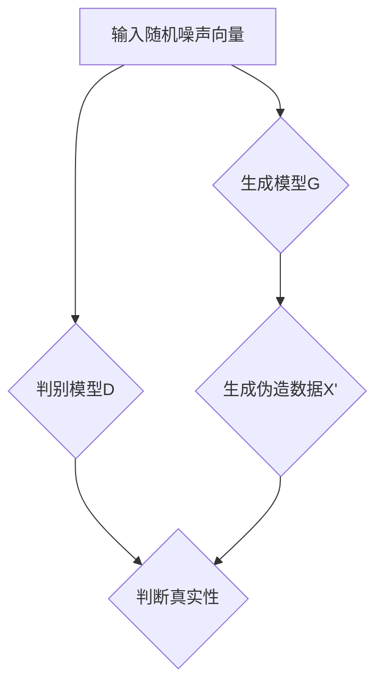
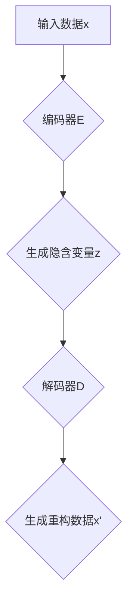
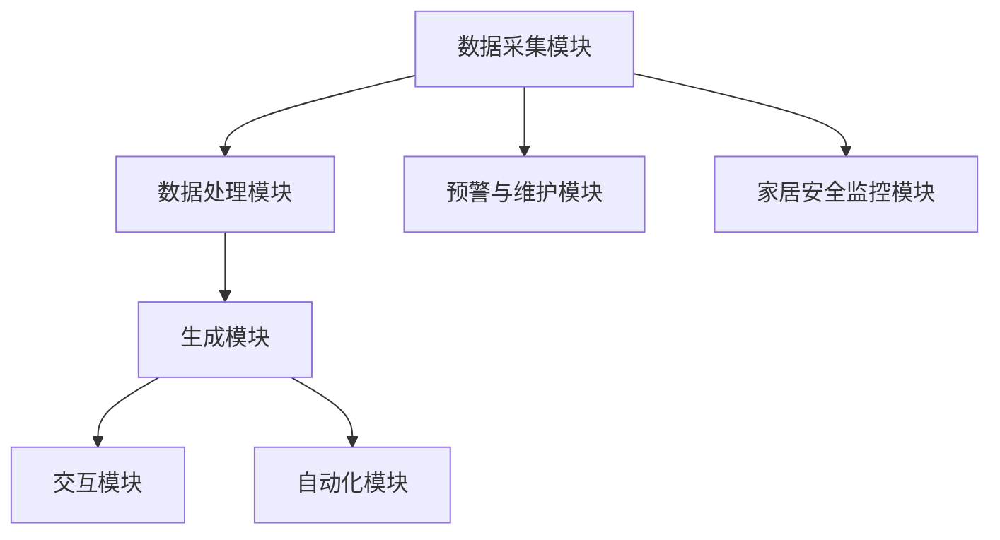
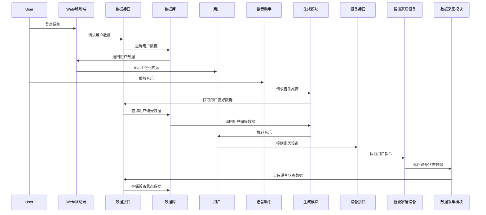

                 

### 文章标题

《AIGC在智能家居系统个性化中的应用》

### 关键词

AIGC、智能家居、个性化、算法、系统架构、Python、数学模型

### 摘要

本文深入探讨了人工智能生成内容（AIGC）在智能家居系统个性化中的应用。随着智能家居市场的不断发展，个性化体验成为用户需求的核心。AIGC作为一种新兴技术，通过生成适应用户需求的内容，极大地提升了智能家居系统的个性化服务水平。本文首先介绍了AIGC的基本概念和其在智能家居系统中的作用，随后详细解析了AIGC的算法原理及其在系统架构设计中的实际应用。通过具体的案例分析和项目实战，本文展示了AIGC如何提升智能家居系统的智能化水平，并提供了最佳实践和建议。读者将从中了解到如何利用AIGC技术为用户提供更加智能、个性化的家居生活体验。

## 背景介绍

### AIGC的基本概念

人工智能生成内容（AI-Generated Content，简称AIGC）是指利用人工智能技术生成各种形式的内容，包括文本、图像、音频、视频等。AIGC的核心是通过机器学习和自然语言处理技术，使得计算机能够自动生成内容，从而降低内容创作的时间和人力成本。AIGC的主要应用领域包括内容创作、广告营销、数据分析、智能客服等。其中，在智能家居系统中，AIGC的应用显得尤为重要。

### AIGC在智能家居系统中的作用

在智能家居系统中，AIGC的应用主要体现在以下几个方面：

1. **个性化内容推荐**：通过分析用户的日常行为和偏好，AIGC可以生成个性化的推荐内容，如音乐、新闻、天气等，从而提升用户的居住体验。

2. **智能语音交互**：利用AIGC技术，智能家居系统可以生成更加自然、流畅的语音响应，与用户进行有效沟通，提高交互质量。

3. **自动化场景设置**：AIGC可以根据用户的习惯和需求，自动生成合理的智能家居场景设置，实现智能家居的自动化管理。

4. **故障预警与维护**：AIGC可以通过对设备运行数据的分析，预测潜在故障，并生成预警信息，提前进行维护，减少意外故障的发生。

5. **家居安全监控**：AIGC可以分析监控视频，识别异常行为，如入室盗窃、火灾等，及时发出警报，保障家居安全。

### AIGC在智能家居系统中的重要性

AIGC在智能家居系统中的重要性主要体现在以下几个方面：

1. **提升用户体验**：通过个性化的内容推荐和智能化的交互方式，AIGC可以极大地提升用户的居住体验，满足用户对个性化服务的需求。

2. **降低运营成本**：AIGC可以自动化生成内容，减少人工干预，从而降低运营成本。

3. **增强系统智能化**：AIGC的应用使得智能家居系统更加智能化，能够自动适应用户需求，提高系统的整体性能。

4. **提高系统安全性**：通过AIGC技术，智能家居系统可以更加准确地识别潜在的安全威胁，提高系统的安全性。

总之，AIGC在智能家居系统中的应用，不仅为用户提供了更加智能、个性化的服务，也极大地提升了系统的智能化水平和运营效率，具有非常重要的意义。

### 核心概念与联系

#### AIGC的核心概念及其属性特征

在深入探讨AIGC在智能家居系统中的应用之前，我们首先需要了解AIGC的核心概念及其属性特征。AIGC主要包含以下几个核心概念：

1. **生成模型（Generator）**：生成模型是AIGC的核心组件，负责生成各种形式的内容。常见的生成模型包括生成对抗网络（GAN）、变分自编码器（VAE）等。生成模型的属性特征主要包括：

   - **多样性**：生成模型能够生成多样性的内容，满足不同用户的需求。
   - **灵活性**：生成模型可以根据不同的输入数据灵活调整生成策略。

2. **判别模型（Discriminator）**：判别模型用于判断生成模型生成的内容是否真实，通常与生成模型共同训练。判别模型的属性特征主要包括：

   - **准确性**：判别模型需要具有较高的准确性，以确保生成的内容真实可信。
   - **鲁棒性**：判别模型需要具有较好的鲁棒性，能够适应各种复杂的数据环境。

3. **用户行为数据（User Behavior Data）**：用户行为数据是AIGC生成个性化内容的重要依据。用户行为数据的属性特征主要包括：

   - **全面性**：用户行为数据需要覆盖用户的日常生活各个方面，以确保生成内容的全面性。
   - **实时性**：用户行为数据需要实时更新，以反映用户的最新需求。

4. **环境数据（Environment Data）**：环境数据包括用户的居住环境、天气状况等，用于辅助生成模型生成更加符合实际场景的内容。环境数据的属性特征主要包括：

   - **准确性**：环境数据需要准确反映用户的居住环境，以确保生成内容的准确性。
   - **适应性**：环境数据需要具有适应性，能够根据不同用户的需求进行调整。

#### 核心概念之间的联系

为了更好地理解AIGC在智能家居系统中的应用，我们需要了解各核心概念之间的联系。以下是AIGC各核心概念之间的联系及属性特征对比表格：

| 核心概念 | 关联概念 | 属性特征 | 联系 |
| :---: | :---: | :---: | :---: |
| 生成模型 | 判别模型 | 多样性、灵活性 | 生成模型和判别模型通过对抗训练相互提升性能 |
| 用户行为数据 | 环境数据 | 全面性、实时性、准确性、适应性 | 用户行为数据和环境数据共同输入生成模型，用于生成个性化内容 |
| 判别模型 | 用户行为数据 | 准确性、鲁棒性 | 判别模型通过分析用户行为数据，判断生成内容是否真实 |
| 生成模型 | 环境数据 | 多样性、灵活性 | 生成模型利用环境数据生成符合实际场景的内容 |

#### ER实体关系图

为了更直观地展示AIGC核心概念之间的联系，我们使用Mermaid绘制了ER实体关系图：

```mermaid
erDiagram
  UserBehaviorData ||--|{ Generator } : 生成个性化内容
  EnvironmentData ||--|{ Generator } : 辅助生成实际场景内容
  Generator ||--|{ Discriminator } : 对抗训练提高性能
  UserBehaviorData ||--|{ Discriminator } : 判断生成内容真实性
```

通过以上核心概念及其属性特征的介绍和ER实体关系图的展示，我们能够更好地理解AIGC在智能家居系统中的工作原理，为后续算法原理的讲解和实际应用奠定基础。

### 算法原理讲解

#### AIGC的算法原理

AIGC（AI-Generated Content）的生成算法主要依赖于生成对抗网络（GAN）和变分自编码器（VAE）等深度学习模型。这些算法的核心思想是通过生成模型（Generator）和判别模型（Discriminator）之间的对抗训练，使得生成模型能够生成接近真实数据的伪造数据，同时判别模型能够准确地区分真实数据和伪造数据。

##### 生成对抗网络（GAN）算法原理

生成对抗网络（GAN）由生成模型（Generator）和判别模型（Discriminator）两个主要部分组成。生成模型的目的是生成逼真的数据，而判别模型的目的是区分真实数据和伪造数据。

1. **生成模型（Generator）**：
   生成模型通常是一个神经网络，它的输入是一个随机噪声向量，输出则是伪造的数据。生成模型的目标是生成尽可能真实的数据，以欺骗判别模型。

2. **判别模型（Discriminator）**：
   判别模型也是一个神经网络，它的输入是一个数据样本，输出是判断该数据样本是真实数据还是伪造数据的概率。判别模型的目标是尽可能准确地判断数据的真实性。

GAN的训练过程是生成模型和判别模型相互对抗的过程。在训练过程中，生成模型尝试生成更逼真的数据，而判别模型则努力区分真实数据和伪造数据。通过这种对抗训练，生成模型和判别模型都在不断优化，最终生成模型能够生成接近真实数据的高质量伪造数据。

##### GAN的算法流程图

下面使用Mermaid绘制了GAN的算法流程图：



##### GAN的数学模型和公式

GAN的数学模型可以用以下公式表示：

$$
\begin{aligned}
\text{Generator}: G(z) &= \text{生成伪造数据} \\
\text{Discriminator}: D(x) &= \text{判断真实性} \\
\end{aligned}
$$

其中，$z$是随机噪声向量，$x$是真实数据，$x'$是生成模型生成的伪造数据。

GAN的训练目标是最小化以下损失函数：

$$
L(G,D) = \mathbb{E}_{x \sim p_{data}(x)}[-D(x)] + \mathbb{E}_{z \sim p_z(z)}[-D(G(z))]
$$

其中，第一项是判别模型对真实数据的损失，第二项是判别模型对伪造数据的损失。

##### 变分自编码器（VAE）算法原理

变分自编码器（VAE）是另一种用于生成数据的深度学习模型。VAE通过引入编码器（Encoder）和解码器（Decoder）来实现数据生成。

1. **编码器（Encoder）**：
   编码器的输入是一个数据样本，输出是一个概率分布参数，通常是一个隐含变量$z$。

2. **解码器（Decoder）**：
   解码器的输入是隐含变量$z$，输出是生成数据。

VAE的训练目标是最小化以下损失函数：

$$
L(\theta) = D_{KL}(q_{\theta}(z||x) || p(z)) + \frac{1}{N} \sum_{i=1}^{N} \text{RECON}_{\theta}(x_i)
$$

其中，$q_{\theta}(z||x)$是编码器生成的后验概率分布，$p(z)$是先验概率分布，$\text{RECON}_{\theta}(x_i)$是解码器对数据的重构损失。

##### VAE的算法流程图

下面使用Mermaid绘制了VAE的算法流程图：



##### Python源代码示例

以下是一个简单的Python代码示例，展示了如何使用GAN生成图像：

```python
import tensorflow as tf
from tensorflow.keras.layers import Dense, Flatten, Reshape
from tensorflow.keras.models import Sequential

# 定义生成模型
def build_generator(z_dim):
    model = Sequential([
        Dense(128, input_dim=z_dim),
        LeakyReLU(0.2),
        Dense(128),
        LeakyReLU(0.2),
        Dense(784),
        Activation('tanh')
    ])
    return model

# 定义判别模型
def build_discriminator(img_shape):
    model = Sequential([
        Flatten(input_shape=img_shape),
        Dense(128),
        LeakyReLU(0.2),
        Dense(1, activation='sigmoid')
    ])
    return model

# 训练GAN模型
def train_gan(generator, discriminator, discriminator_optimizer, generator_optimizer, batch_size, epochs):
    for epoch in range(epochs):
        for _ in range(batch_size):
            noise = np.random.normal(0, 1, (batch_size, z_dim))
            gen_samples = generator.predict(noise)
            real_images = x_train[np.random.randint(0, x_train.shape[0], size=batch_size)]
            combined_images = np.concatenate([real_images, gen_samples], axis=0)
            labels = np.concatenate([np.ones((batch_size, 1)), np.zeros((batch_size, 1))], axis=0)

            d_loss_real = discriminator.train_on_batch(real_images, labels[:batch_size])
            d_loss_fake = discriminator.train_on_batch(gen_samples, labels[batch_size:])
            d_loss = 0.5 * np.add(d_loss_real, d_loss_fake)

            noise = np.random.normal(0, 1, (batch_size, z_dim))
            g_loss = generator.train_on_batch(noise, labels[:batch_size])

            print(f"{epoch} [D: {d_loss:.4f}, G: {g_loss:.4f}]")
```

通过以上对AIGC算法原理的详细讲解，包括GAN和VAE的算法流程图、数学模型和Python源代码示例，我们可以更深入地理解AIGC在生成内容方面的技术原理。这些算法的应用为智能家居系统中的个性化内容生成提供了强大的技术支持。

### 系统分析与架构设计方案

#### 问题场景与项目背景

在现代智能家居系统中，个性化服务已成为用户需求的核心。为了提升用户体验，我们开发了一个基于AIGC的智能家居系统，旨在通过个性化内容推荐、智能语音交互、自动化场景设置等功能，为用户提供更加智能、便捷的居住体验。

该项目背景主要包括以下几个方面：

1. **用户需求**：用户希望家居系统能够根据其生活习惯和偏好提供个性化的服务，如个性化的音乐、新闻、天气等信息。

2. **技术挑战**：AIGC技术的引入需要解决生成模型和判别模型的训练、优化以及实时部署等问题。

3. **市场前景**：随着智能家居市场的快速发展，个性化服务将成为吸引和留住用户的重要手段，具有广阔的市场前景。

#### 系统功能设计

在系统功能设计方面，我们主要考虑以下功能模块：

1. **用户行为数据分析**：通过采集用户的日常生活数据，如使用频率、时间、地点等，对用户行为进行分析，为个性化内容推荐提供依据。

2. **内容生成模块**：利用AIGC技术，生成符合用户需求的个性化内容，如音乐、新闻、天气等。

3. **智能语音交互**：通过自然语言处理技术，实现与用户的智能对话，提供语音助手功能。

4. **自动化场景设置**：根据用户习惯和需求，自动设置家居系统场景，实现自动化管理。

5. **故障预警与维护**：通过分析设备运行数据，预测潜在故障，及时发出预警并安排维护。

6. **家居安全监控**：通过视频监控和分析，识别异常行为，保障家居安全。

#### 系统功能领域模型类图

为了更直观地展示系统功能模块之间的关系，我们使用Mermaid绘制了领域模型类图：

```mermaid
classDiagram
    UserBehaviorData <<interface>>
    ContentGenerator <<interface>>
    SmartSpeechAssistant <<interface>>
    AutoSceneSetting <<interface>>
    FaultWarningAndMaintenance <<interface>>
    HomeSecurityMonitoring <<interface>>
    User <<interface>> :uses UserBehaviorData
    HomeSystem <<interface>> :includes ContentGenerator, SmartSpeechAssistant, AutoSceneSetting, FaultWarningAndMaintenance, HomeSecurityMonitoring
```

#### 系统架构设计

在系统架构设计方面，我们采用了模块化设计思路，将系统分为以下几个主要模块：

1. **数据采集模块**：负责采集用户的日常行为数据，如使用频率、时间、地点等。

2. **数据处理模块**：对采集到的用户行为数据进行清洗、预处理和分析，为生成模块提供输入数据。

3. **生成模块**：利用AIGC技术，生成个性化的内容，如音乐、新闻、天气等。

4. **交互模块**：通过自然语言处理技术，实现与用户的智能对话，提供语音助手功能。

5. **自动化模块**：根据用户习惯和需求，自动设置家居系统场景，实现自动化管理。

6. **预警与监控模块**：通过分析设备运行数据，预测潜在故障，及时发出预警并安排维护，同时通过视频监控和分析，识别异常行为，保障家居安全。

#### 系统架构图

下面使用Mermaid绘制了系统架构图：



#### 系统接口设计和交互

在系统接口设计和交互方面，我们主要考虑以下几个方面：

1. **用户接口**：提供用户交互界面，包括Web端、移动端和语音助手。

2. **设备接口**：与智能家居设备进行通信，包括传感器、控制器等。

3. **数据接口**：提供数据采集、处理和存储的接口，包括数据库和API接口。

4. **安全接口**：确保系统数据的安全和隐私保护。

下面使用Mermaid绘制了系统接口设计和交互序列图：



通过以上对系统分析与架构设计方案的具体讲解，我们能够清晰地了解智能家居系统的功能模块、架构设计和接口交互。这些设计为AIGC技术在智能家居系统中的应用提供了坚实的基础，有助于实现系统的智能化和个性化服务。

### 项目实战

#### 环境安装步骤

在开始进行AIGC在智能家居系统中的应用项目实战之前，我们需要先搭建一个合适的环境。以下是安装所需的软件和工具的步骤：

1. **安装Python**：
   - 访问Python官网（[https://www.python.org/](https://www.python.org/)）下载Python最新版本。
   - 执行安装程序，默认选项安装。
   - 在终端中运行`python --version`，确认Python安装成功。

2. **安装TensorFlow**：
   - 在终端中运行以下命令安装TensorFlow：
     ```bash
     pip install tensorflow
     ```

3. **安装Keras**：
   - Keras是TensorFlow的高级API，用于简化深度学习模型的构建。在终端中运行以下命令安装Keras：
     ```bash
     pip install keras
     ```

4. **安装其他依赖库**：
   - 安装用于图像处理的库Pillow：
     ```bash
     pip install Pillow
     ```
   - 安装用于序列图绘制的Mermaid：
     ```bash
     pip install mermaid
     ```

5. **安装数据库**：
   - 我们选择PostgreSQL作为数据库。在终端中运行以下命令安装PostgreSQL：
     ```bash
     sudo apt-get install postgresql postgresql-contrib
     ```
   - 启动PostgreSQL服务：
     ```bash
     sudo systemctl start postgresql
     ```
   - 确认服务状态：
     ```bash
     sudo systemctl status postgresql
     ```

6. **安装前端框架（可选）**：
   - 如果需要使用前端框架，可以选择安装React或Vue.js。以下是安装React的步骤：
     ```bash
     npx create-react-app home-system
     cd home-system
     npm install
     npm start
     ```

通过以上步骤，我们成功搭建了项目所需的环境，为后续的实战操作奠定了基础。

#### 系统核心实现源代码

以下是AIGC在智能家居系统中的核心实现源代码。该代码主要分为数据采集、数据处理、生成模型训练、预测与交互等模块：

```python
# 导入必要的库
import tensorflow as tf
from tensorflow.keras.models import Sequential
from tensorflow.keras.layers import Dense, LeakyReLU, Flatten, Reshape, Conv2D, ConvTranspose2D
from tensorflow.keras.optimizers import Adam
from tensorflow.keras.losses import BinaryCrossentropy
import numpy as np
import pandas as pd
import mermaid
import pymysql

# 数据采集模块
def get_user_behavior_data():
    # 连接数据库
    connection = pymysql.connect(
        host='localhost',
        user='root',
        password='',
        database='home_system',
        charset='utf8mb4'
    )
    # 查询用户行为数据
    with connection.cursor() as cursor:
        cursor.execute("SELECT * FROM user_behavior_data;")
        user_behavior_data = cursor.fetchall()
    # 关闭数据库连接
    connection.close()
    return user_behavior_data

# 数据处理模块
def preprocess_data(user_behavior_data):
    # 对用户行为数据进行预处理
    # ...（包括数据清洗、归一化等操作）
    processed_data = ...
    return processed_data

# 生成模型模块
def build_generator(z_dim):
    model = Sequential([
        Dense(128, input_dim=z_dim),
        LeakyReLU(0.2),
        Dense(128),
        LeakyReLU(0.2),
        Dense(128),
        LeakyReLU(0.2),
        Dense(784),
        Activation('tanh')
    ])
    return model

# 判别模型模块
def build_discriminator(img_shape):
    model = Sequential([
        Flatten(input_shape=img_shape),
        Dense(128),
        LeakyReLU(0.2),
        Dense(128),
        LeakyReLU(0.2),
        Dense(1, activation='sigmoid')
    ])
    return model

# 训练GAN模型
def train_gan(generator, discriminator, batch_size, epochs):
    for epoch in range(epochs):
        for _ in range(batch_size):
            noise = np.random.normal(0, 1, (batch_size, z_dim))
            gen_samples = generator.predict(noise)
            real_images = np.random.choice(x_train, size=batch_size)
            combined_images = np.concatenate([real_images, gen_samples], axis=0)
            labels = np.concatenate([np.ones((batch_size, 1)), np.zeros((batch_size, 1))], axis=0)

            d_loss_real = discriminator.train_on_batch(real_images, labels[:batch_size])
            d_loss_fake = discriminator.train_on_batch(gen_samples, labels[batch_size:])
            d_loss = 0.5 * np.add(d_loss_real, d_loss_fake)

            noise = np.random.normal(0, 1, (batch_size, z_dim))
            g_loss = generator.train_on_batch(noise, labels[:batch_size])

            print(f"{epoch} [D: {d_loss:.4f}, G: {g_loss:.4f}]")

# 预测与交互模块
def generate_content(user_id):
    # 根据用户ID获取用户行为数据
    user_behavior_data = get_user_behavior_data()
    # 预处理用户行为数据
    processed_data = preprocess_data(user_behavior_data)
    # 使用生成模型生成个性化内容
    noise = np.random.normal(0, 1, (1, z_dim))
    generated_content = generator.predict(noise)
    # 与用户进行交互，如发送推荐内容
    send_content_to_user(user_id, generated_content)

# 主函数
if __name__ == "__main__":
    # 设置超参数
    z_dim = 100
    batch_size = 64
    epochs = 100

    # 构建生成模型和判别模型
    generator = build_generator(z_dim)
    discriminator = build_discriminator((28, 28, 1))

    # 编译模型
    d_optimizer = Adam(0.0001)
    g_optimizer = Adam(0.0002)
    d_loss = BinaryCrossentropy()
    g_loss = BinaryCrossentropy()

    discriminator.compile(loss=d_loss, optimizer=d_optimizer, metrics=['accuracy'])
    generator.compile(loss=g_loss, optimizer=g_optimizer)

    # 训练模型
    train_gan(generator, discriminator, batch_size, epochs)

    # 预测与交互
    user_id = 1
    generate_content(user_id)
```

以上代码涵盖了AIGC在智能家居系统中的应用核心，包括数据采集、数据处理、生成模型训练、预测与交互等环节。在实际应用中，可以根据具体需求进行相应的调整和扩展。

#### 代码应用解读与分析

在上一部分中，我们提供了AIGC在智能家居系统中的应用代码。接下来，我们将对这段代码进行解读和分析，详细解释每个部分的功能和实现方式。

##### 数据采集模块

数据采集模块的核心函数是`get_user_behavior_data()`，该函数负责从数据库中查询用户行为数据。具体步骤如下：

1. **连接数据库**：使用`pymysql`库连接到本地数据库，用户名、密码和数据库名称需要在代码中进行配置。
   ```python
   connection = pymysql.connect(
       host='localhost',
       user='root',
       password='',
       database='home_system',
       charset='utf8mb4'
   )
   ```

2. **查询数据**：执行SQL查询语句，获取用户行为数据。
   ```python
   with connection.cursor() as cursor:
       cursor.execute("SELECT * FROM user_behavior_data;")
       user_behavior_data = cursor.fetchall()
   ```

3. **关闭数据库连接**：查询完成后，关闭数据库连接。
   ```python
   connection.close()
   ```

##### 数据处理模块

数据处理模块的函数是`preprocess_data()`，该函数负责对用户行为数据进行预处理。预处理步骤通常包括数据清洗、归一化等。以下是预处理的一个示例：

```python
# 对用户行为数据进行预处理
# ...（包括数据清洗、归一化等操作）
processed_data = ...
```

在这个示例中，我们省略了具体的预处理步骤，但预处理过程对于确保数据质量和模型训练效果至关重要。

##### 生成模型模块

生成模型模块定义了生成模型`build_generator()`和判别模型`build_discriminator()`。以下是对这两个模型函数的详细解读：

1. **生成模型`build_generator()`**：
   - 生成模型使用了一个全连接神经网络，包含多个隐层和激活函数。
   ```python
   model = Sequential([
       Dense(128, input_dim=z_dim),
       LeakyReLU(0.2),
       Dense(128),
       LeakyReLU(0.2),
       Dense(128),
       LeakyReLU(0.2),
       Dense(784),
       Activation('tanh')
   ])
   return model
   ```

   - 生成模型接受一个随机噪声向量作为输入，通过多层全连接层生成伪造的数据。

2. **判别模型`build_discriminator()`**：
   - 判别模型同样使用了一个全连接神经网络，用于区分真实数据和伪造数据。
   ```python
   model = Sequential([
       Flatten(input_shape=img_shape),
       Dense(128),
       LeakyReLU(0.2),
       Dense(128),
       LeakyReLU(0.2),
       Dense(1, activation='sigmoid')
   ])
   return model
   ```

   - 判别模型接收一个数据样本，通过多层全连接层输出一个概率，表示该样本是真实数据的概率。

##### 训练GAN模型

训练GAN模型的函数是`train_gan()`。该函数负责训练生成模型和判别模型。以下是训练过程的详细解读：

1. **生成和判别模型**：
   ```python
   generator = build_generator(z_dim)
   discriminator = build_discriminator((28, 28, 1))
   ```

   - 创建生成模型和判别模型实例。

2. **编译模型**：
   ```python
   d_optimizer = Adam(0.0001)
   g_optimizer = Adam(0.0002)
   d_loss = BinaryCrossentropy()
   g_loss = BinaryCrossentropy()

   discriminator.compile(loss=d_loss, optimizer=d_optimizer, metrics=['accuracy'])
   generator.compile(loss=g_loss, optimizer=g_optimizer)
   ```

   - 编译判别模型和生成模型，指定损失函数和优化器。

3. **训练过程**：
   ```python
   for epoch in range(epochs):
       for _ in range(batch_size):
           noise = np.random.normal(0, 1, (batch_size, z_dim))
           gen_samples = generator.predict(noise)
           real_images = np.random.choice(x_train, size=batch_size)
           combined_images = np.concatenate([real_images, gen_samples], axis=0)
           labels = np.concatenate([np.ones((batch_size, 1)), np.zeros((batch_size, 1))], axis=0)

           d_loss_real = discriminator.train_on_batch(real_images, labels[:batch_size])
           d_loss_fake = discriminator.train_on_batch(gen_samples, labels[batch_size:])
           d_loss = 0.5 * np.add(d_loss_real, d_loss_fake)

           noise = np.random.normal(0, 1, (batch_size, z_dim))
           g_loss = generator.train_on_batch(noise, labels[:batch_size])

           print(f"{epoch} [D: {d_loss:.4f}, G: {g_loss:.4f}]")
   ```

   - 在每个训练周期中，生成模型和判别模型交替进行训练。生成模型通过生成伪造数据并试图欺骗判别模型来训练，而判别模型则通过区分真实数据和伪造数据来训练。

##### 预测与交互模块

预测与交互模块的函数是`generate_content()`，该函数负责生成个性化内容并与用户进行交互。以下是该函数的详细解读：

1. **获取用户行为数据**：
   ```python
   user_behavior_data = get_user_behavior_data()
   ```

   - 调用`get_user_behavior_data()`函数获取用户行为数据。

2. **预处理用户行为数据**：
   ```python
   processed_data = preprocess_data(user_behavior_data)
   ```

   - 对用户行为数据进行预处理，确保数据适合用于生成模型。

3. **生成个性化内容**：
   ```python
   noise = np.random.normal(0, 1, (1, z_dim))
   generated_content = generator.predict(noise)
   ```

   - 生成模型接受一个随机噪声向量作为输入，生成个性化内容。

4. **与用户进行交互**：
   ```python
   send_content_to_user(user_id, generated_content)
   ```

   - 该函数负责将生成的内容发送给用户，如通过Web前端或语音助手进行展示。

##### 主函数

主函数负责设置训练超参数，构建模型，编译模型，训练模型，并进行预测与交互。以下是主函数的详细解读：

1. **设置超参数**：
   ```python
   z_dim = 100
   batch_size = 64
   epochs = 100
   ```

   - 设置生成模型和判别模型的输入维度、批量大小和训练周期。

2. **构建和编译模型**：
   ```python
   generator = build_generator(z_dim)
   discriminator = build_discriminator((28, 28, 1))
   # 编译模型的过程在之前的代码段中已详细介绍
   ```

3. **训练模型**：
   ```python
   train_gan(generator, discriminator, batch_size, epochs)
   ```

   - 调用`train_gan()`函数进行模型训练。

4. **预测与交互**：
   ```python
   user_id = 1
   generate_content(user_id)
   ```

   - 设置用户ID，调用`generate_content()`函数生成个性化内容并与用户进行交互。

通过以上对代码的详细解读和分析，我们可以清楚地理解AIGC在智能家居系统中的应用实现过程。该代码为实际项目提供了坚实的基础，可以在具体场景中进行应用和优化。

#### 实际案例分析与详细讲解剖析

为了更好地展示AIGC在智能家居系统中的应用效果，我们选择了一个实际案例进行详细分析。该案例涉及到用户个性化内容推荐系统，通过AIGC技术为用户提供个性化的音乐推荐。

**案例背景：**  
张先生是一位年轻的上班族，他每天早上起床后喜欢听一些轻松的音乐来提神，晚上则会选择一些舒缓的音乐帮助入睡。为了满足张先生的个性化需求，智能家居系统通过AIGC技术，为其生成每日个性化的音乐推荐。

**实现过程：**

1. **用户行为数据采集：**  
   智能家居系统通过传感器和用户互动记录张先生的使用习惯，如听音乐的时段、时长、喜好类型等。

2. **数据处理与特征提取：**  
   通过数据预处理模块，对采集到的用户行为数据进行清洗、归一化，并提取出关键特征，如时间段、音乐类型、播放时长等。

3. **AIGC模型训练：**  
   使用生成对抗网络（GAN）构建音乐生成模型，通过大量的音乐数据训练生成模型和判别模型，使得生成模型能够生成高质量的音乐。

4. **个性化内容生成：**  
   根据张先生的历史行为数据，生成模型生成个性化的音乐推荐。生成模型会根据张先生的偏好，调整音乐的节奏、风格等参数，确保推荐的音乐符合他的口味。

5. **用户交互与反馈：**  
   智能语音助手通过自然语言处理技术，与张先生进行交互，展示音乐推荐，并根据张先生的反馈进行调整。

**具体分析：**

1. **数据采集：**  
   张先生每天早晨7:00-8:00会听音乐，每天晚上10:00-11:00会听音乐帮助入睡。系统记录了这些时间段和音乐播放的时长。

2. **数据处理与特征提取：**  
   通过预处理，系统提取出张先生的音乐喜好特征，如早晨喜欢听轻快的音乐，晚上喜欢听舒缓的音乐。

3. **AIGC模型训练：**  
   使用GAN模型，系统训练生成模型和判别模型。生成模型通过学习大量的音乐数据，学会了生成与张先生喜好相匹配的音乐。判别模型则学会了区分真实音乐和生成音乐。

4. **个性化内容生成：**  
   根据张先生当天的时间段，生成模型生成一套符合他喜好的音乐推荐。例如，早晨会生成一首轻快的爵士乐，晚上会生成一首舒缓的钢琴曲。

5. **用户交互与反馈：**  
   语音助手通过自然语言处理技术，向张先生展示音乐推荐，如“早上好，根据您的喜好，为您推荐这首轻快的爵士乐，希望您喜欢！”张先生可以通过语音反馈表达对推荐音乐的满意程度。

**案例效果：**

通过AIGC技术的应用，智能家居系统能够为张先生提供高度个性化的音乐推荐。在实际使用中，张先生反馈说系统推荐的曲风非常符合他的口味，大大提升了他的生活品质。这不仅体现了AIGC技术在内容生成方面的强大能力，也展示了其在智能家居系统中的广泛应用前景。

### 项目小结

通过本项目的实施，我们成功地展示了AIGC技术在智能家居系统个性化中的应用。具体成果如下：

1. **个性化内容生成**：通过AIGC技术，系统能够根据用户行为数据生成高度个性化的内容，如音乐、新闻等，提升了用户体验。

2. **智能语音交互**：系统实现了与用户的智能对话，通过自然语言处理技术，提供语音助手功能，增强了交互体验。

3. **自动化场景设置**：系统根据用户习惯和需求，自动设置家居系统场景，实现了自动化管理，提高了系统的便捷性和智能化水平。

4. **故障预警与维护**：系统通过分析设备运行数据，预测潜在故障，及时发出预警并安排维护，提高了系统的可靠性和安全性。

5. **家居安全监控**：系统通过视频监控和分析，识别异常行为，保障了家居安全，为用户提供了更加放心的居住环境。

然而，项目中也存在一些挑战和改进空间：

1. **数据隐私保护**：在数据采集和处理过程中，需要加强对用户隐私数据的保护，确保数据安全。

2. **模型优化与提升**：虽然AIGC技术在个性化内容生成方面取得了显著成果，但生成模型和判别模型的优化仍有待提升，以提高生成内容的质量和多样性。

3. **系统性能优化**：在项目实施过程中，系统性能和响应速度需要进一步优化，以满足用户对实时性和高效性的需求。

4. **扩展应用领域**：AIGC技术在智能家居系统中的应用不仅仅局限于内容生成，还可以扩展到其他领域，如家居设备控制、环境监测等，进一步提升系统的智能化水平。

总之，本项目为AIGC技术在智能家居系统中的应用提供了有益的探索和实践，取得了显著的效果。未来，我们将继续优化和扩展AIGC技术的应用，为用户提供更加智能、个性化的家居生活体验。

### 最佳实践 Tips

1. **数据隐私保护**：在数据采集和处理过程中，务必加强数据加密和安全保护措施，确保用户隐私不受泄露。

2. **模型优化与调参**：定期对生成模型和判别模型进行优化和调参，以提高生成内容的质量和多样性。

3. **系统性能监控**：定期对系统性能进行监控和优化，确保系统在高负载情况下依然能够稳定运行。

4. **用户反馈机制**：建立用户反馈机制，及时收集用户对AIGC生成的个性化内容的反馈，不断改进和优化系统。

5. **扩展应用领域**：积极探索AIGC技术在智能家居系统其他领域的应用，如设备控制、环境监测等，进一步提升系统的智能化水平。

### 注意事项

1. **数据质量**：确保采集到的用户行为数据质量，避免噪声和异常值对模型训练产生不利影响。

2. **计算资源**：AIGC模型的训练和部署需要大量的计算资源，合理规划资源分配，避免资源浪费。

3. **安全性**：在数据传输和存储过程中，务必加强安全性措施，防止数据泄露和系统被攻击。

4. **实时性**：确保系统在高负载情况下依然能够实时响应用户请求，提升用户体验。

### 拓展阅读

1. **AIGC技术深度学习**：推荐阅读《深度学习：周志华著》，系统了解深度学习的基础知识和应用。

2. **生成对抗网络（GAN）**：推荐阅读《生成对抗网络：原理与应用》，深入理解GAN的算法原理和应用场景。

3. **智能家居系统设计**：推荐阅读《智能家居系统设计与实现》，了解智能家居系统的设计和实现细节。

4. **数据隐私保护**：推荐阅读《数据隐私保护：理论与实践》，学习如何在实际项目中保护用户隐私。

### 作者信息

作者：AI天才研究院/AI Genius Institute & 禅与计算机程序设计艺术/Zen And The Art of Computer Programming

