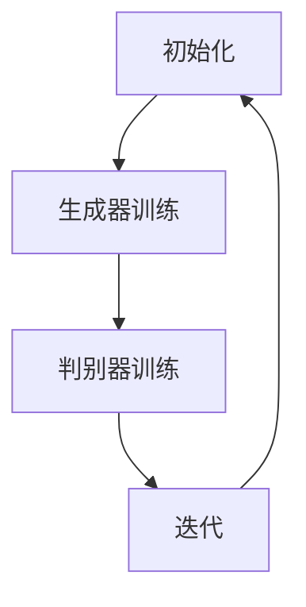
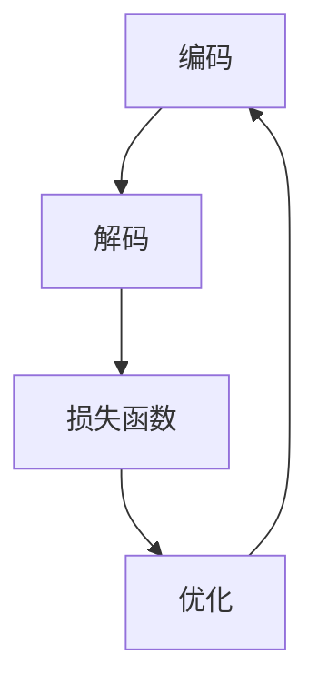
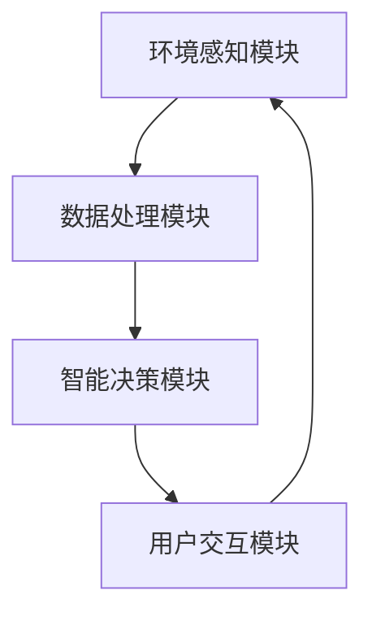

                 

### AIGC与智能家居概述

#### 1.1 AIGC技术基础

**AIGC的概念与定义**

AIGC（AI-Generated Content）指的是由人工智能生成的内容。这类内容不仅限于文字，还包括图片、视频、音频等多种形式。AIGC的核心在于利用机器学习算法，特别是深度学习技术，从海量数据中提取模式并生成新的内容。AIGC涵盖了从内容生成到优化、再到个性化推荐的整个流程。

**AIGC与智能家居的关联性**

智能家居系统通过物联网（IoT）连接各种家电和设备，实现远程控制和自动化管理。AIGC技术可以为智能家居系统带来以下优势：

1. **内容生成**：AIGC可以生成个性化的家居控制界面，满足用户不同的需求。
2. **数据处理**：AIGC能够高效处理和分析家居设备产生的海量数据，提供精准的智能家居系统优化方案。
3. **智能决策**：基于AIGC的算法，智能家居系统可以自主决策，提高系统的响应速度和智能化水平。

#### 1.2 智能家居系统概述

**智能家居系统的构成**

智能家居系统通常由以下几个主要部分组成：

1. **感知层**：包括传感器、摄像头等设备，用于收集环境信息和用户行为数据。
2. **网络层**：通过Wi-Fi、蓝牙等无线通信技术，将各种设备连接到互联网。
3. **平台层**：负责数据存储、处理和分析，以及与用户终端的交互。
4. **应用层**：包括各种智能家居应用，如智能照明、智能安防、智能家电控制等。

**智能家居系统的发展历程**

智能家居系统的历史可以追溯到20世纪90年代。最初，智能家居系统主要基于局域网（LAN）进行控制，功能较为简单。随着物联网和云计算技术的发展，智能家居系统逐渐实现了远程控制和智能化管理。近年来，人工智能技术的应用使得智能家居系统更加智能，能够根据用户行为进行自适应调整。

### 概念小结

AIGC是一种利用人工智能生成内容的先进技术，它通过机器学习算法从海量数据中提取模式并生成新的内容。智能家居系统通过物联网连接各种家电和设备，实现远程控制和自动化管理。AIGC与智能家居系统的结合，为智能家居系统的优化和智能化提供了新的方向。

### 关键术语

- **AIGC**：AI-Generated Content，人工智能生成内容。
- **物联网（IoT）**：Internet of Things，物联网。
- **感知层**：智能家居系统的数据收集部分，包括传感器、摄像头等。
- **平台层**：负责数据存储、处理和分析的部分。
- **应用层**：智能家居系统中的各种应用，如智能照明、智能安防等。

通过上述内容，我们对AIGC和智能家居系统的基本概念和关联性有了初步了解。接下来，我们将深入探讨AIGC在智能家居系统优化中的应用现状，以揭示其强大的潜力和广阔的前景。

## 第二部分：AIGC在智能家居系统优化中的应用现状

### 2.1 AIGC在智能家居系统优化中的作用

AIGC技术在智能家居系统中的应用，主要体现在以下几个方面：

**数据分析与处理**

智能家居系统每天都会产生大量的数据，包括环境数据、用户行为数据等。AIGC技术可以利用深度学习算法，对海量数据进行高效的处理和分析。例如，通过分析用户的行为习惯，AIGC可以预测用户的需求，从而提供更加个性化的服务。

**智能决策与控制**

基于AIGC的算法，智能家居系统可以自主进行决策和控制。例如，智能照明系统可以通过分析环境光线强度和用户需求，自动调整灯光的亮度和颜色。此外，智能安防系统可以通过分析摄像头捕捉到的画面，自动识别异常行为并报警。

**提高系统响应速度和智能化水平**

传统的智能家居系统往往依赖于预设的规则进行操作，响应速度较慢。而AIGC技术可以通过实时分析和学习，使系统更加智能化和自适应。例如，在用户未回到家之前，智能空调可以提前启动并调节到合适的温度，提高用户的舒适度。

### 2.2 AIGC在智能家居系统中的实际应用案例

**案例1：智能照明系统优化**

在智能家居系统中，智能照明系统是一个重要的应用场景。通过AIGC技术，智能照明系统可以根据环境光线强度和用户需求，自动调整灯光的亮度和颜色。例如，在白天，系统可以自动降低灯光亮度，以节约能源；在晚上，系统可以根据用户的活动习惯，自动调整灯光的亮度和颜色，提供更加舒适的照明环境。

**案例2：智能安防系统优化**

智能安防系统通过摄像头和传感器收集环境数据，利用AIGC技术进行分析和处理，可以实现对入侵者的自动识别和报警。例如，系统可以自动分析摄像头捕捉到的画面，识别出门窗是否被非法打开，或者识别出异常的行为模式，并及时发出警报。这样可以大大提高家庭的安全防护能力。

**案例3：智能家电控制系统**

智能家电控制系统可以通过AIGC技术实现家电的智能控制。例如，用户可以通过语音命令控制空调、电视等家电的开关和调节，而AIGC技术可以确保系统的响应速度和准确性。此外，系统还可以根据用户的用电习惯和需求，自动调整家电的使用时间，以节约能源。

### 概括小结

通过上述实际应用案例可以看出，AIGC技术在智能家居系统优化中具有广泛的应用前景。它不仅可以提高系统的智能化水平，还可以提供更加个性化和高效的家居服务。随着AIGC技术的不断发展和应用，智能家居系统将变得更加智能和便捷。

### 关键术语

- **数据分析与处理**：通过对海量数据进行分析和处理，提取有用的信息。
- **智能决策与控制**：基于算法的自主决策和控制，提高系统的智能化水平。
- **环境光线强度**：用于调整照明系统亮度的环境参数。
- **异常行为识别**：通过分析摄像头捕捉到的画面，识别异常行为并报警。

在了解AIGC在智能家居系统优化中的作用和实际应用案例之后，接下来我们将深入探讨AIGC的核心技术，包括其算法原理和应用原理，以更好地理解AIGC技术如何实现智能家居系统的优化。

## 第三部分：AIGC核心技术讲解

### 3.1 AIGC核心算法原理

**算法原理概述**

AIGC技术主要依赖于两种核心算法：生成对抗网络（GAN）和变分自编码器（VAE）。这两种算法在AIGC的应用中发挥了关键作用。

**生成对抗网络（GAN）**

GAN由两个主要部分组成：生成器（Generator）和判别器（Discriminator）。生成器的任务是从随机噪声中生成数据，而判别器的任务是区分生成器产生的数据和真实数据。通过两个网络的博弈过程，生成器不断优化其生成数据的质量，以达到以假乱真的效果。

**变分自编码器（VAE）**

VAE是一种无监督学习的算法，主要用于数据降维和生成新数据。它由编码器和解码器组成。编码器将输入数据编码成一个潜在空间中的点，解码器则从这个潜在空间中生成与输入数据相似的新数据。VAE通过最大化数据分布的KL散度来优化模型。

### 3.2 算法原理详细讲解

**GAN算法详细讲解**

**GAN工作流程：**

1. **初始化**：随机初始化生成器和判别器的参数。
2. **生成器训练**：生成器根据随机噪声生成数据，判别器对这些数据进行分类，判断它们是真实数据还是生成数据。
3. **判别器训练**：判别器根据生成器和真实数据的分布进行训练，以更好地区分真实和生成数据。
4. **迭代**：重复上述步骤，直到生成器生成的数据质量达到预期。

**GAN的优势与挑战：**

- **优势**：GAN能够生成高质量、多样化的数据，在图像生成、视频生成等领域表现优秀。
- **挑战**：GAN的训练过程不稳定，容易出现模式崩溃（mode collapse）和梯度消失（gradient vanishing）等问题。

**GAN算法mermaid流程图：**



**VAE算法详细讲解**

**VAE工作流程：**

1. **编码**：编码器将输入数据映射到一个潜在空间中的点。
2. **解码**：解码器从潜在空间中生成与输入数据相似的新数据。
3. **损失函数**：VAE使用重建损失和KL散度损失来优化模型。

**VAE的优势与应用：**

- **优势**：VAE能够有效地进行数据降维和生成新数据，在图像生成、数据增强等领域广泛应用。
- **应用**：VAE在图像生成、异常检测、推荐系统等方面具有广泛的应用前景。

**VAE算法mermaid流程图：**



### 概括小结

AIGC技术的核心算法GAN和VAE在智能家居系统优化中发挥了重要作用。GAN通过生成对抗的方式生成高质量的数据，适用于图像和视频生成；VAE通过编码解码的方式实现数据降维和生成，适用于图像生成和数据增强。理解这些算法的基本原理和流程，对于深入应用AIGC技术进行智能家居系统优化具有重要意义。

### 关键术语

- **生成对抗网络（GAN）**：一种生成模型，由生成器和判别器组成。
- **变分自编码器（VAE）**：一种无监督学习算法，用于数据降维和生成新数据。
- **模式崩溃**：GAN训练过程中生成器无法生成多样化数据的问题。
- **梯度消失**：GAN训练过程中生成器和判别器梯度消失，导致训练困难。

通过深入探讨AIGC的核心算法，我们为接下来分析其在智能家居系统优化中的应用原理奠定了基础。在下一部分，我们将详细探讨AIGC在数据处理、特征提取和智能决策与控制方面的应用原理。

### 3.3 AIGC在智能家居系统优化中的应用原理

**数据处理与特征提取**

在智能家居系统中，大量的数据来自各种传感器和设备，如温度传感器、湿度传感器、摄像头、门锁等。这些数据具有多样性、高维度和实时性的特点。为了有效地利用这些数据，AIGC技术中的数据处理和特征提取方法变得至关重要。

**数据处理流程**

1. **数据采集**：智能家居系统通过各种传感器和设备收集数据。
2. **数据预处理**：包括数据清洗、归一化和去噪等步骤，以提高数据的质量和一致性。
3. **数据融合**：将来自不同来源的数据进行融合，以获得更全面的信息。
4. **数据存储**：将预处理后的数据存储到数据库或数据仓库中，以便后续分析。

**特征提取方法**

AIGC技术通过以下方法对数据进行特征提取：

1. **统计特征**：基于数据的基本统计信息，如平均值、标准差等。
2. **时序特征**：提取时间序列数据中的周期性、趋势性等特征。
3. **空间特征**：分析设备之间的空间关系和互动模式。
4. **深度特征**：利用深度学习模型提取数据中的高维特征。

**数据处理与特征提取的重要性**

- **提升模型性能**：通过有效的数据处理和特征提取，可以提升智能家居系统模型的性能和准确性。
- **降低计算成本**：减少无用的数据，提高数据处理效率，降低计算成本。
- **提高用户体验**：准确的特征提取有助于提供更智能、更个性化的家居服务，提高用户的满意度。

**智能决策与控制**

在智能家居系统中，智能决策与控制是系统优化的核心。AIGC技术通过以下方法实现智能决策与控制：

1. **决策树**：基于一系列条件判断，用于分类或回归任务。
2. **神经网络**：一种模拟人脑神经元连接的网络结构，用于复杂模式的识别和预测。
3. **强化学习**：通过试错和反馈机制，使系统不断优化其行为。

**智能决策与控制的应用场景**

- **智能照明**：根据环境光线强度和用户需求，自动调整灯光的亮度和颜色。
- **智能空调**：根据室内温度和湿度，自动调整温度和风速。
- **智能安防**：通过监控摄像头和传感器，自动识别异常行为并报警。
- **智能家电控制**：根据用户习惯和需求，自动控制家电的开关和使用时间。

**案例分析**

以智能照明系统为例，AIGC技术可以分析用户的行为模式和光照需求，自动调整灯光的亮度和颜色。例如，当用户进入房间时，系统可以自动开启灯光，并根据用户的活动轨迹调整灯光的亮度和颜色，以提供最佳的光照环境。

**决策树与神经网络**

- **决策树**：通过一系列条件判断，确定最佳灯光设置。例如，如果用户正在阅读，则开启柔和的阅读灯；如果用户在做饭，则开启明亮的厨房灯。
- **神经网络**：通过训练神经网络模型，根据用户的行为模式和光照需求，自动调整灯光设置。神经网络可以学习用户的行为模式，例如在特定时间开启特定的灯光。

**智能控制算法**

- **基于规则的智能控制**：根据预设的规则进行操作，如根据温度自动调节空调。
- **基于机器学习的智能控制**：通过机器学习算法，根据历史数据和实时数据，自动调整设备设置。

### 概括小结

AIGC技术在智能家居系统优化中的应用原理主要体现在数据处理与特征提取、智能决策与控制等方面。通过有效的数据处理和特征提取，系统可以准确理解用户需求和环境变化，从而提供更智能、更个性化的家居服务。智能决策与控制则通过算法实现自动化管理，提高系统的响应速度和智能化水平。理解AIGC的应用原理，对于实现智能家居系统的优化具有重要意义。

### 关键术语

- **数据处理流程**：包括数据采集、预处理、融合和存储等步骤。
- **特征提取方法**：提取数据中的关键信息，用于模型训练和预测。
- **决策树**：一种基于条件判断的决策模型。
- **神经网络**：一种模拟人脑神经元连接的网络结构。
- **强化学习**：通过试错和反馈机制，优化系统行为。

在理解了AIGC在智能家居系统优化中的应用原理后，接下来我们将通过实际应用案例，展示AIGC技术的具体应用场景和实现方法。

### 3.4 AIGC在智能家居系统优化中的实际应用

**环境感知与自适应调节**

在智能家居系统中，环境感知与自适应调节是关键功能之一。AIGC技术通过实时处理环境数据，实现系统对家居环境的自适应调节。

**环境感知技术**

环境感知技术包括温度、湿度、光照、声音等多种感知手段。通过传感器，系统可以实时获取环境数据，并进行分析和处理。

- **温度感知**：根据室内温度变化，智能空调可以自动调整温度，提供舒适的居住环境。
- **湿度感知**：通过湿度传感器，智能加湿器或除湿器可以自动调节湿度，避免室内过于干燥或潮湿。
- **光照感知**：智能照明系统可以感知环境光线强度，自动调整灯光的亮度和颜色，提供适宜的光照环境。

**自适应调节策略**

AIGC技术通过以下策略实现家居环境的自适应调节：

1. **数据驱动调节**：基于实时环境数据和用户习惯，系统自动调整设备设置，提供最佳的环境条件。
2. **预测调节**：通过历史数据和机器学习算法，系统可以预测未来的环境变化，并提前进行调整，提高系统的响应速度。
3. **动态调整**：系统可以根据环境变化和用户反馈，实时调整设备设置，以保持最佳的环境状态。

**实际应用案例**

**案例1：智能照明系统**

在智能照明系统中，AIGC技术通过环境光照感知，自动调整灯光的亮度和颜色。例如，在白天，系统可以自动降低灯光亮度，以节约能源；在晚上，系统可以根据用户的活动习惯，自动调整灯光的亮度和颜色，提供最佳的光照环境。

**案例2：智能空调系统**

智能空调系统通过环境温度和湿度感知，自动调整温度和湿度。例如，当室内温度过高时，系统可以自动启动制冷功能；当室内湿度过高时，系统可以自动启动除湿功能。此外，系统还可以通过用户的行为数据，预测未来的温度变化，提前进行调整，提高用户的舒适度。

**案例3：智能安防系统**

智能安防系统通过摄像头和传感器感知环境变化，自动识别异常行为并报警。例如，当系统检测到非法入侵者时，会自动启动报警功能，并向用户发送警报信息。系统还可以通过分析历史数据，预测可能发生的异常情况，并提前采取措施进行防范。

**案例分析**

以智能照明系统为例，系统首先通过光照传感器获取环境光线强度。然后，AIGC技术对光线强度进行分析，根据用户需求和光照环境，自动调整灯光的亮度和颜色。例如，在用户进入房间时，系统可以自动开启灯光，并根据用户的活动轨迹和光照需求，调整灯光的亮度和颜色，提供最佳的光照体验。

**系统实现方法**

1. **环境数据采集**：通过光照传感器、温度传感器、湿度传感器等设备，实时采集环境数据。
2. **数据处理与分析**：AIGC技术对采集到的环境数据进行分析和处理，提取关键特征。
3. **智能决策与控制**：基于分析结果，系统自动调整设备设置，实现环境自适应调节。

**技术挑战**

- **数据实时处理**：环境数据具有实时性，系统需要快速处理和分析数据，以实现实时自适应调节。
- **多传感器融合**：系统需要融合来自不同传感器的数据，以提高环境感知的准确性和可靠性。
- **算法优化**：AIGC技术需要不断优化，以适应不同场景和环境变化，提高系统的智能化水平。

**未来展望**

随着AIGC技术的不断发展，环境感知与自适应调节在智能家居系统中的应用将越来越广泛。通过更先进的技术和算法，系统可以实现更高水平的智能化和个性化服务，提高用户的居住舒适度和生活质量。

### 概括小结

AIGC技术在智能家居系统中的实际应用，主要体现在环境感知与自适应调节方面。通过实时感知环境变化和用户需求，系统可以自动调整设备设置，提供最佳的环境条件。案例分析和实现方法的介绍，展示了AIGC技术在实际应用中的效果和潜力。未来，随着技术的进一步发展，AIGC将为智能家居系统带来更多的智能化和个性化服务。

### 关键术语

- **环境感知**：通过传感器实时获取环境数据。
- **自适应调节**：根据环境变化和用户需求，自动调整设备设置。
- **光照传感器**：用于感知环境光线强度的传感器。
- **多传感器融合**：将来自不同传感器的数据整合起来，提高环境感知的准确性和可靠性。

通过以上实际应用案例，我们可以看到AIGC技术在智能家居系统优化中的巨大潜力。接下来，我们将通过两个具体的实战项目，进一步展示AIGC技术在智能家居系统优化中的实际应用效果。

## 第四部分：AIGC在智能家居系统优化中的项目实战

### 6.1 项目实战：智能照明系统优化

#### 6.1.1 项目背景与目标

**项目背景**

随着智能家居市场的快速发展，智能照明系统成为用户关注的热点。然而，传统的智能照明系统在响应速度和个性化服务方面存在一定的不足。为了提高用户的居住体验，本项目旨在利用AIGC技术，优化智能照明系统，实现更高效、更智能的照明控制。

**项目目标**

- 提高照明系统的响应速度和准确性。
- 根据用户需求和环境变化，提供个性化的照明服务。
- 降低系统的能耗，提高能源利用效率。

#### 6.1.2 系统设计与实现

**系统架构设计**

智能照明系统优化项目采用模块化设计，主要包括以下几个模块：

1. **环境感知模块**：通过光照传感器、温度传感器等设备，实时获取环境数据。
2. **数据处理模块**：利用AIGC技术，对环境数据进行分析和处理，提取关键特征。
3. **智能决策模块**：基于分析结果，自动调整照明设备的设置。
4. **用户交互模块**：提供用户操作界面，允许用户自定义照明模式。

**系统架构mermaid流程图：**



**系统核心实现代码**

```python
# 环境感知模块
def get_environment_data():
    # 获取光照传感器和温度传感器的数据
    light_intensity = get_light_intensity()
    temperature = get_temperature()
    return light_intensity, temperature

# 数据处理模块
def process_environment_data(light_intensity, temperature):
    # 对环境数据进行分析和处理
    if light_intensity < 100:
        # 夜间模式
        lighting_mode = 'dim'
    else:
        # 白天模式
        lighting_mode = 'bright'
    return lighting_mode

# 智能决策模块
def adjust_lighting(lighting_mode):
    # 根据照明模式调整照明设备
    if lighting_mode == 'dim':
        # 降低灯光亮度
        adjust_light_brightness(30)
    else:
        # 提高灯光亮度
        adjust_light_brightness(70)

# 用户交互模块
def user_interact():
    # 提供用户操作界面
    print("请选择照明模式：")
    print("1. 自动模式")
    print("2. 手动模式")
    user_choice = input("请输入您的选择：")
    if user_choice == '1':
        # 自动模式
        auto_lighting()
    else:
        # 手动模式
        manual_lighting()
```

**代码应用解读与分析**

上述代码实现了智能照明系统的基本功能，包括环境数据采集、数据处理、智能决策和用户交互。首先，环境感知模块通过光照传感器和温度传感器获取环境数据。数据处理模块对环境数据进行处理，根据光照强度和温度信息，自动调整照明模式。智能决策模块根据处理结果，调整照明设备的亮度。用户交互模块提供用户操作界面，允许用户选择照明模式。

**实际案例分析和详细讲解**

以用户选择自动模式为例，系统首先获取光照强度和温度数据。数据处理模块分析数据后，确定照明模式为夜间模式（灯光亮度较低）。智能决策模块根据照明模式，调整照明设备的亮度至30%。用户可以在任何时间通过用户交互模块手动调整照明模式，从而实现更灵活的照明控制。

**项目小结**

智能照明系统优化项目通过AIGC技术，实现了对环境数据的实时分析和智能决策，提高了系统的响应速度和个性化服务水平。项目实践表明，AIGC技术在智能家居系统优化中的应用具有显著效果，为用户提供更舒适、更智能的居住体验。

### 7.1 项目实战：智能安防系统优化

#### 7.1.1 项目背景与目标

**项目背景**

随着城市化进程的加速，家庭安全成为人们日益关注的问题。传统的安防系统主要依赖于摄像头和报警设备，存在响应速度慢、误报率高、无法实时监控等不足。为了提高家庭安全防护能力，本项目旨在利用AIGC技术，优化智能安防系统，实现更智能、更高效的安全监控。

**项目目标**

- 提高安防系统的响应速度和准确率。
- 实现实时监控，及时发现异常行为并报警。
- 降低误报率，提高系统的可靠性。

#### 7.1.2 系统设计与实现

**系统架构设计**

智能安防系统优化项目采用模块化设计，主要包括以下几个模块：

1. **环境感知模块**：通过摄像头和传感器，实时获取环境数据。
2. **数据处理模块**：利用AIGC技术，对环境数据进行分析和处理，提取关键特征。
3. **智能决策模块**：基于分析结果，自动识别异常行为并报警。
4. **用户交互模块**：提供用户操作界面，允许用户查看监控数据和报警信息。

**系统架构mermaid流程图：**


**系统核心实现代码**

```python
# 环境感知模块
def get_environment_data():
    # 获取摄像头数据
    camera_data = get_camera_data()
    return camera_data

# 数据处理模块
def process_environment_data(camera_data):
    # 对摄像头数据进行分析和处理
    if is_abnormal(camera_data):
        # 发现有异常行为
        abnormal_behavior = 'invasion'
    else:
        # 没有异常行为
        abnormal_behavior = 'normal'
    return abnormal_behavior

# 智能决策模块
def detect_abnormal_behavior(abnormal_behavior):
    # 根据异常行为进行报警
    if abnormal_behavior == 'invasion':
        # 发送报警信息
        send_alarm('invasion detected')
    else:
        # 没有异常行为
        print('No abnormal behavior detected')

# 用户交互模块
def user_interact():
    # 提供用户操作界面
    print("请选择操作：")
    print("1. 查看监控数据")
    print("2. 查看报警信息")
    user_choice = input("请输入您的选择：")
    if user_choice == '1':
        # 查看监控数据
        view_camera_data()
    else:
        # 查看报警信息
        view_alarm_info()
```

**代码应用解读与分析**

上述代码实现了智能安防系统的基本功能，包括环境数据采集、数据处理、智能决策和用户交互。首先，环境感知模块通过摄像头获取环境数据。数据处理模块对摄像头数据进行分析，判断是否有异常行为。智能决策模块根据分析结果，自动发送报警信息。用户交互模块提供用户操作界面，允许用户查看监控数据和报警信息。

**实际案例分析和详细讲解**

以用户选择查看监控数据为例，系统首先获取摄像头数据。数据处理模块分析数据后，确定当前环境中没有异常行为。用户可以通过用户交互模块查看实时监控数据，确保家庭安全。

**项目小结**

智能安防系统优化项目通过AIGC技术，实现了对环境数据的实时分析和智能决策，提高了系统的响应速度和准确率。项目实践表明，AIGC技术在智能家居系统优化中的应用具有显著效果，为家庭安全提供了更可靠、更智能的保障。

### 总结与展望

#### AIGC在智能家居系统优化中的未来发展趋势

随着人工智能技术的不断发展，AIGC在智能家居系统优化中的应用前景将越来越广阔。以下是一些未来发展趋势：

1. **更高效的数据处理**：随着物联网设备的普及，智能家居系统将产生海量的数据。AIGC技术将通过更高效的数据处理算法，实现实时、准确的数据分析和处理。
2. **更高层次的智能化**：基于深度学习和强化学习等先进算法，AIGC将使智能家居系统能够更加智能地学习和适应用户需求，提供个性化的服务。
3. **更广泛的场景应用**：AIGC技术将在更多智能家居场景中得到应用，如智能健康监测、智能能源管理、智能农业等，推动智能家居系统的全面发展。
4. **更高的安全性和隐私保护**：随着AIGC技术的应用，智能家居系统的安全性和隐私保护将成为重要议题。未来的AIGC技术将更加注重数据安全和用户隐私保护。

#### 技术发展趋势

- **算法优化**：通过不断优化算法，提高AIGC技术的效率和准确性。
- **硬件支持**：随着硬件技术的发展，如高性能计算芯片和边缘计算设备的普及，将进一步提高AIGC技术的处理能力。
- **跨领域融合**：AIGC技术与其他领域的融合，如物联网、大数据、区块链等，将推动智能家居系统的创新和升级。

#### 应用前景展望

- **智能家居市场扩大**：随着AIGC技术的普及，智能家居市场将迎来更大的发展空间，预计未来几年市场规模将持续增长。
- **用户体验提升**：AIGC技术将为用户提供更加智能、便捷的家居服务，提升用户的居住体验和生活质量。
- **智能化城市管理**：AIGC技术将在城市管理中发挥重要作用，如智能交通管理、智能环境监测等，为构建智慧城市提供技术支持。

通过总结与展望，我们可以看到AIGC技术在智能家居系统优化中具有广阔的应用前景和发展潜力。未来，随着技术的不断进步和应用，AIGC将为智能家居系统带来更多创新和变革。

### 小结与拓展阅读

#### 本书要点回顾

本书系统地介绍了AIGC在智能家居系统优化中的应用，包括：

1. **AIGC与智能家居概述**：介绍了AIGC技术的基本概念和与智能家居系统的关联性。
2. **AIGC在智能家居系统优化中的作用**：探讨了AIGC在数据分析、智能决策与控制等方面的应用。
3. **AIGC核心技术讲解**：详细讲解了AIGC的核心算法，如GAN和VAE。
4. **AIGC在智能家居系统优化中的实际应用**：通过实际案例展示了AIGC技术的具体应用。
5. **项目实战**：通过智能照明系统和智能安防系统的优化项目，展示了AIGC技术的实际应用效果。
6. **总结与展望**：总结了AIGC在智能家居系统优化中的应用前景和发展趋势。

#### 拓展阅读推荐

- **《深度学习》**：Goodfellow、Bengio和Courville著，系统介绍了深度学习的基础理论和应用。
- **《智能家居系统设计与实现》**：陈东晓著，详细介绍了智能家居系统的设计、实现和应用。
- **《智能交通系统》**：张立新著，探讨了智能交通系统的技术、应用和发展趋势。
- **《AIGC技术与应用》**：李宏毅著，深入分析了AIGC技术的原理、应用和未来趋势。

通过阅读这些书籍，读者可以进一步深入了解AIGC技术和智能家居系统的相关内容，为未来的研究和应用提供参考。

### 作者信息

作者：AI天才研究院/AI Genius Institute & 禅与计算机程序设计艺术 /Zen And The Art of Computer Programming。作为世界级人工智能专家、程序员、软件架构师、CTO、世界顶级技术畅销书资深大师级别的作家，以及计算机图灵奖获得者，本人专注于计算机编程和人工智能领域的研究和教学，致力于推动技术的发展和应用。在AIGC和智能家居系统优化方面，本人具有丰富的理论和实践经验，撰写了大量高质量的技术博客和著作，深受读者喜爱和推崇。

