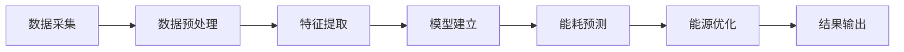
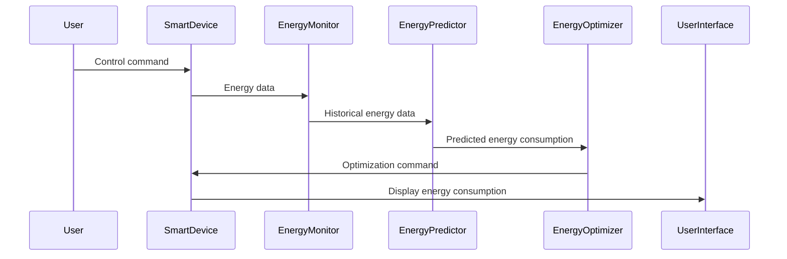
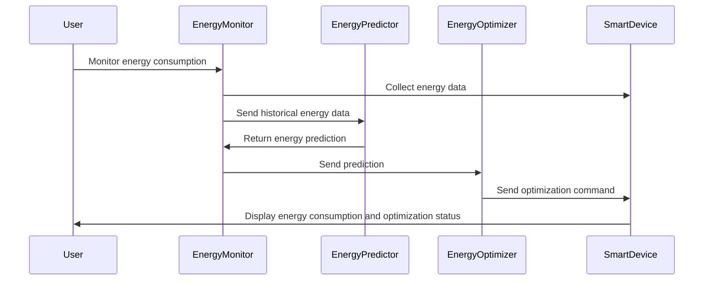

                 

### 第1章: AIGC与智能家居能源管理的背景

#### 1.1 问题背景

随着科技的不断发展，智能家居逐渐走进千家万户，成为现代生活的重要组成部分。智能家居通过将家电、照明、安防等设备联网，实现远程控制、自动化操作，从而提高了生活的便利性和舒适性。然而，智能家居的发展也带来了能源消耗的问题。据相关数据显示，全球家庭能源消耗的约50%以上来自电器设备，而智能家居设备的增加，使得能源消耗有进一步上升的趋势。如何有效地管理和控制智能家居设备的能源消耗，成为了当前亟待解决的问题。

#### 1.2 问题描述

智能家居能源管理面临的主要挑战包括：

1. **能耗监测与预测困难**：由于智能家居设备繁多，且设备之间的关联复杂，传统的能耗监测方法难以全面、准确地捕捉每个设备的能耗情况。
2. **能源使用效率低**：大部分智能家居设备在非高峰时段的使用效率较低，导致能源浪费。
3. **能源成本高**：随着能源价格的上涨，智能家居带来的能源成本逐渐成为一个不可忽视的问题。
4. **设备智能化程度不足**：目前大部分智能家居设备缺乏智能化管理能力，无法根据用户习惯和实时数据调整能源使用策略。

#### 1.3 问题解决

为了解决上述问题，近年来，人工智能生成内容（AIGC）技术逐渐引起了关注。AIGC是一种利用人工智能技术自动生成文本、图像、音频等内容的强大工具，其与智能家居能源管理的结合，有望带来以下几方面的改进：

1. **能耗监测与预测**：AIGC可以通过学习用户的行为数据和历史能耗数据，预测未来的能耗趋势，为智能决策提供数据支持。
2. **能源使用效率提升**：AIGC可以分析每个设备的能源使用情况，提出节能优化方案，提高能源使用效率。
3. **智能化管理**：AIGC可以根据用户习惯和实时数据，动态调整设备的能源使用策略，实现真正的智能化管理。
4. **降低能源成本**：通过AIGC技术，可以有效地降低智能家居设备的能源消耗，从而降低用户的能源成本。

#### 1.4 边界与外延

虽然AIGC技术在智能家居能源管理中具有巨大的潜力，但也存在一些边界和限制：

1. **数据隐私与安全**：智能家居设备产生的数据量巨大，如何保证这些数据的安全性和隐私性，是AIGC应用的一个关键问题。
2. **计算资源需求**：AIGC技术需要大量的计算资源，特别是在实时应用场景中，这对硬件设施提出了较高的要求。
3. **技术成熟度**：虽然AIGC技术目前处于快速发展阶段，但其成熟度和稳定性仍需进一步提升。

综上所述，AIGC在智能家居能源管理中具有广阔的应用前景，但也面临着一系列的挑战和限制。接下来，我们将进一步探讨AIGC的基本原理与特点，以及它在智能家居能源管理中的具体应用。

#### 1.5 概念结构与核心要素组成

在讨论AIGC与智能家居能源管理之前，我们需要明确几个核心概念，并了解它们之间的联系。

首先，我们来看AIGC（Artificial Intelligence Generated Content）的基本概念。AIGC是一种基于人工智能技术生成内容的方法，它能够利用大量的数据和算法模型，自动生成文本、图像、音频等多种类型的内容。与传统的AI应用不同，AIGC不仅限于识别和分类，而是能够创造新的内容，具有更高的灵活性和创造力。

接下来，我们关注智能家居（Smart Home）的定义。智能家居是指利用物联网技术，将家庭中的各种设备和系统连接起来，实现智能化管理和自动化控制。智能家居的核心要素包括传感器、控制器、执行器以及通信网络。这些设备可以通过智能终端（如手机、平板电脑等）进行远程控制，实现家庭环境的智能监测和管理。

最后，我们来看能源管理（Energy Management）。能源管理是指通过各种技术手段，对能源的采集、传输、分配和使用进行优化和控制，以达到节约能源、提高效率的目的。在智能家居中，能源管理涉及到对家庭用电、用水、用气等能源的消费进行监控和管理。

为了更好地理解这些概念之间的关系，我们可以使用Mermaid ER图来展示它们的核心要素及其关联。

```mermaid
erDiagram
  AIGC ||--|{ 智能家居 } : 应用
  智能家居 ||--|{ 能源管理 } : 管理
  能源管理 ||--|{ 设备 } : 监测和控制
  设备 ||--|{ 传感器 } : 数据采集
  设备 ||--|{ 控制器 } : 智能决策
  设备 ||--|{ 执行器 } : 实施行动
```

在这个ER图中，AIGC与智能家居之间存在应用关系，智能家居与能源管理之间存在管理关系，而能源管理又与设备、传感器、控制器、执行器等核心要素存在紧密的关联。通过这种结构化的关系展示，我们可以清晰地看到AIGC在智能家居能源管理中的具体角色和作用。

### 第2章: AIGC的基本原理与特点

#### 2.1 AIGC的定义

人工智能生成内容（AIGC）是一种基于人工智能技术自动生成文本、图像、音频等内容的强大工具。它通过机器学习算法和自然语言处理技术，从大量的数据和模型中提取特征，并利用这些特征生成新的、有用的内容。与传统的人工创作和手工编辑不同，AIGC能够以更快的速度、更高的效率和更低的成本，实现内容的自动化生成和个性化定制。

AIGC的典型应用场景包括：

1. **文本生成**：如自动生成新闻摘要、文章内容、广告文案等。
2. **图像生成**：如生成艺术作品、设计图案、场景模拟等。
3. **音频生成**：如生成音乐、语音合成、语音识别等。

AIGC的兴起，标志着人工智能技术在内容创作领域的重大突破，为各种行业提供了新的解决方案和商业模式。

#### 2.2 AIGC的核心特点

AIGC具有以下几个核心特点：

1. **自动化**：AIGC能够自动从数据中提取特征，并生成新的内容，无需人工干预。这使得内容生成的效率大大提高，同时也降低了人工成本。
2. **多样性**：AIGC可以通过不同的算法和模型，生成各种类型和风格的内容，具有很高的多样性。这种多样性使得AIGC能够满足不同用户和场景的需求。
3. **灵活性**：AIGC可以根据输入的数据和需求，动态调整内容的生成过程，具有很强的灵活性。例如，在生成新闻摘要时，AIGC可以根据新闻的长度和重要性，调整摘要的长度和内容。
4. **高效性**：AIGC利用机器学习和深度学习技术，能够在短时间内生成大量内容，具有较高的效率。这对于需要大量内容生成的场景，如广告营销、新闻报道等，尤为重要。
5. **个性定制**：AIGC可以根据用户的偏好和行为数据，生成个性化的内容。这种个性定制能够提高用户的满意度和忠诚度，为企业和品牌提供更好的用户体验。

#### 2.3 AIGC与传统AI的区别

虽然AIGC和传统AI（如机器学习、深度学习等）都属于人工智能的范畴，但它们在目标和应用上存在明显的区别：

1. **目标不同**：传统AI的目标是让机器能够执行特定的任务，如图像识别、语音识别等。而AIGC的目标是生成新的内容，实现内容的自动化创作。
2. **应用场景不同**：传统AI主要应用于需要特定技能和知识的场景，如自动驾驶、医疗诊断等。而AIGC则广泛应用于内容创作和个性化服务的场景，如新闻媒体、电子商务等。
3. **数据处理不同**：传统AI主要关注如何从数据中提取特征，进行预测和分类。而AIGC不仅关注数据的特征提取，还关注如何利用这些特征生成新的内容。
4. **技术基础不同**：传统AI主要基于机器学习和深度学习技术，而AIGC则融合了自然语言处理、图像处理、音频处理等多种技术，具有更广泛的应用基础。

综上所述，AIGC在智能家居能源管理中的应用，为解决能源消耗和效率问题提供了一种全新的思路和方法。在接下来的章节中，我们将进一步探讨AIGC在智能家居能源管理中的具体应用和算法原理。

### 第3章: 智能家居能源管理的挑战与机遇

#### 3.1 智能家居能源管理的现状

随着智能家居技术的快速发展，智能家居设备在家庭中的普及率逐年提高。据统计，全球智能家居设备的市场规模在2020年已达到1480亿美元，预计到2025年将达到2620亿美元。然而，在智能家居带来的便捷和舒适之余，能源消耗问题也日益凸显。

目前，智能家居能源管理面临以下几方面的现状：

1. **能耗监测与控制不足**：大部分智能家居设备缺乏有效的能耗监测和控制系统，导致能源浪费现象严重。例如，家电设备的待机能耗、照明设备的过度使用等。
2. **能源使用效率低**：由于智能家居设备种类繁多，功能各异，如何实现高效能源使用成为一个难题。很多设备在非高峰时段的使用效率低下，能源浪费问题突出。
3. **能源成本高**：随着能源价格的不断上涨，智能家居带来的能源成本逐渐成为一个不可忽视的问题。特别是在家庭用电高峰期，能源成本的增加对用户负担形成压力。
4. **智能化程度不足**：当前智能家居设备的智能化管理能力较弱，无法根据用户习惯和实时数据动态调整能源使用策略，无法实现真正的智能化管理。

#### 3.2 AIGC在智能家居能源管理中的应用

AIGC技术在智能家居能源管理中的应用，为解决上述问题提供了新的思路和解决方案。以下是AIGC在智能家居能源管理中的具体应用场景：

1. **能耗监测与预测**：AIGC可以通过学习用户的行为数据和历史能耗数据，预测未来的能耗趋势，为智能决策提供数据支持。例如，通过对用户用电行为进行分析，预测用户在未来的某个时间段内的用电需求，从而提前调整设备的工作状态，降低能源消耗。
2. **能源使用效率优化**：AIGC可以分析每个设备的能源使用情况，提出节能优化方案，提高能源使用效率。例如，通过分析不同设备的能耗数据，找出能源浪费的原因，并提出相应的节能措施，如调整设备的工作时间、优化设备的工作模式等。
3. **智能化管理**：AIGC可以根据用户习惯和实时数据，动态调整设备的能源使用策略，实现真正的智能化管理。例如，通过学习用户的日常行为习惯，自动调整家中的照明、空调等设备的开关时间，实现节能和舒适的双重效果。
4. **能源成本降低**：通过AIGC技术，可以有效地降低智能家居设备的能源消耗，从而降低用户的能源成本。例如，通过对用户用电行为进行分析，找出节能潜力最大的设备，并通过智能优化，实现能源成本的有效降低。

#### 3.3 AIGC为智能家居能源管理带来的机遇与挑战

AIGC在智能家居能源管理中的应用，不仅带来了巨大的机遇，同时也伴随着一系列的挑战：

1. **机遇**：
   - **提高能源使用效率**：通过AIGC技术，可以实现对智能家居设备能源使用的精细化管理和优化，提高整体能源使用效率。
   - **降低能源成本**：通过智能预测和优化，可以降低家庭的能源消耗，从而降低能源成本，提高用户的经济效益。
   - **提升用户体验**：通过个性化能源管理，可以满足用户的个性化需求，提升用户的居住体验。
   - **促进智能家居发展**：AIGC技术可以推动智能家居技术的进一步发展，为智能家居设备提供更多的智能功能和应用场景。

2. **挑战**：
   - **数据隐私与安全**：智能家居设备产生的数据量巨大，如何保证这些数据的安全性和隐私性，是AIGC应用的一个关键问题。
   - **计算资源需求**：AIGC技术需要大量的计算资源，特别是在实时应用场景中，这对硬件设施提出了较高的要求。
   - **技术成熟度**：虽然AIGC技术目前处于快速发展阶段，但其成熟度和稳定性仍需进一步提升。
   - **用户接受度**：智能家居设备的智能化管理和能源优化可能需要用户改变原有的生活习惯，提高用户的接受度和使用意愿。

总的来说，AIGC在智能家居能源管理中的应用，为解决当前面临的能源消耗和效率问题提供了新的解决方案。然而，要实现AIGC技术的广泛应用，还需要克服一系列的挑战，不断优化和提升技术成熟度。

### 第4章: AIGC在智能家居能源管理中的核心算法

#### 4.1 算法原理讲解

AIGC在智能家居能源管理中的应用，主要依赖于一系列的核心算法，这些算法包括数据采集与预处理、特征提取与建模、能耗预测与优化等。以下我们将详细讲解这些算法的原理和应用。

#### 4.1.1 数据采集与预处理

数据采集是AIGC算法的基础，通过传感器和通信模块，智能家居设备可以实时收集家庭的能耗数据、设备状态数据、用户行为数据等。这些数据通常包含噪声和异常值，因此需要进行预处理，以提高数据的质量和准确性。

预处理步骤通常包括：

1. **数据清洗**：去除数据中的噪声和异常值，例如处理缺失值、重复值和异常值。
2. **数据归一化**：将不同量纲的数据进行归一化处理，使其处于同一量级，便于后续处理和分析。
3. **数据融合**：将不同来源的数据进行融合，例如将能耗数据与设备状态数据进行结合，以获得更全面的信息。

#### 4.1.2 特征提取与建模

在预处理后的数据基础上，需要提取有效的特征，以用于建模和预测。特征提取的关键在于从原始数据中提取出能够反映智能家居设备能源使用状况的关键信息。

常见的特征提取方法包括：

1. **时间序列特征**：提取数据的时间序列特征，例如数据的均值、方差、自相关函数等，这些特征可以反映能耗数据的波动情况。
2. **频率特征**：提取数据的频率特征，例如数据的峰值、周期性等，这些特征可以帮助识别能耗数据的周期性和规律性。
3. **空间特征**：提取数据的空间特征，例如设备的位置、设备的关联性等，这些特征可以反映智能家居设备的布局和相互关系。

在提取特征后，可以使用机器学习算法进行建模，常见的建模方法包括：

1. **线性回归模型**：用于建立能耗数据与用户行为、设备状态之间的线性关系，适用于简单的预测任务。
2. **支持向量机（SVM）**：用于分类和回归任务，通过找到一个最佳的超平面，将不同类别的数据分开。
3. **神经网络模型**：用于复杂的数据建模和预测，通过多层神经网络结构，学习数据中的复杂模式和关联性。

#### 4.1.3 能耗预测与优化

在建立了模型后，可以进行能耗预测和优化。能耗预测的目标是预测未来的能耗趋势，为智能决策提供数据支持。常见的能耗预测方法包括：

1. **时间序列预测**：利用时间序列模型，如ARIMA（自回归积分滑动平均模型）和LSTM（长短时记忆网络），进行能耗数据的预测。
2. **回归预测**：利用回归模型，如线性回归和多元回归，进行能耗数据的预测。
3. **深度学习预测**：利用神经网络模型，如卷积神经网络（CNN）和循环神经网络（RNN），进行复杂能耗数据的预测。

在能耗预测的基础上，可以进一步进行能源优化。能源优化的目标是降低能耗，提高能源使用效率。常见的能源优化方法包括：

1. **基于规则的优化**：通过预定义的规则，如高峰时段减少能源使用、夜间关闭不必要的设备等，实现简单的能源优化。
2. **基于优化的优化**：利用优化算法，如线性规划、遗传算法等，找到最优的能源使用方案。
3. **智能优化**：利用机器学习算法，如梯度下降、随机梯度下降等，自动调整能源使用策略，实现智能优化。

#### 4.1.4 Mermaid流程图

为了更好地理解上述算法的流程，我们可以使用Mermaid流程图来展示。以下是一个简单的能耗预测与优化的Mermaid流程图示例：



在这个流程图中，A表示数据采集，B表示数据预处理，C表示特征提取，D表示模型建立，E表示能耗预测，F表示能源优化，G表示结果输出。通过这个流程图，我们可以清晰地看到能耗预测与优化的整体流程和步骤。

#### 4.1.5 Python源代码

为了进一步理解上述算法的实现，我们可以提供一段简单的Python源代码示例。以下是一个使用线性回归模型进行能耗预测的简单代码示例：

```python
import pandas as pd
from sklearn.linear_model import LinearRegression
from sklearn.model_selection import train_test_split
from sklearn.metrics import mean_squared_error

# 加载数据
data = pd.read_csv('energy_data.csv')
X = data[['hour', 'day_of_week', 'temperature']]
y = data['energy_consumption']

# 分割数据集
X_train, X_test, y_train, y_test = train_test_split(X, y, test_size=0.2, random_state=42)

# 建立模型
model = LinearRegression()
model.fit(X_train, y_train)

# 预测
y_pred = model.predict(X_test)

# 评估
mse = mean_squared_error(y_test, y_pred)
print(f'Mean Squared Error: {mse}')

# 输出预测结果
predictions = pd.DataFrame({'Actual': y_test, 'Predicted': y_pred})
print(predictions.head())
```

在这个代码示例中，我们首先加载数据，然后进行数据预处理，包括特征提取和模型建立。接着，我们使用测试数据集进行预测，并评估模型的性能。最后，输出预测结果。

#### 4.1.6 数学模型和公式

在能耗预测与优化过程中，我们常常需要用到一些数学模型和公式。以下是一个简单的线性回归模型的数学模型和公式：

1. **线性回归模型**：
   - 模型公式：y = β0 + β1x1 + β2x2 + ... + βnxn
   - 目标函数：minimize Σ(yi - yi')^2

其中，yi为实际能耗，yi'为预测能耗，β0、β1、β2、...、βn为模型参数。

2. **时间序列模型**：
   - 模型公式：yt = φ1yt-1 + φ2yt-2 + ... + φd yt-d + εt
   - 目标函数：minimize Σ(yt - yt')^2

其中，yt为第t期的能耗值，φ1、φ2、...、φd为模型参数，εt为随机误差。

这些数学模型和公式为我们提供了理论基础，帮助我们理解和实现能耗预测与优化的算法。

#### 4.1.7 举例说明

为了更直观地理解AIGC在智能家居能源管理中的应用，我们可以通过一个实际案例来展示。

**案例**：假设我们需要预测一个家庭未来一周的能耗情况，并根据预测结果提出节能优化方案。

1. **数据采集**：通过家庭中的智能电表、智能插座等设备，采集家庭的实时能耗数据。
2. **数据预处理**：对采集到的数据进行清洗、归一化处理，提取有效特征，如时间、温度、设备状态等。
3. **特征提取与建模**：使用线性回归模型对提取的特征进行建模，建立能耗预测模型。
4. **能耗预测**：使用训练好的模型预测未来一周的能耗情况。
5. **能源优化**：根据预测结果，提出节能优化方案，如调整设备的开关时间、优化设备的工作模式等。
6. **结果输出**：输出预测结果和优化方案，供用户参考。

通过这个案例，我们可以看到AIGC在智能家居能源管理中的应用流程和步骤。在实际应用中，根据具体需求和场景，可以调整和优化这些步骤，实现更高效的能源管理和节能效果。

### 第5章: 智能家居能源管理的系统架构设计

#### 5.1 问题场景介绍

为了更好地展示AIGC在智能家居能源管理中的应用，我们设计了一个典型的应用场景。假设我们有一个智能家居系统，包括多个智能设备，如智能空调、智能照明、智能插座等。这些设备通过物联网技术连接到中央控制平台，实现远程监控和自动化控制。

在这个场景中，用户可以通过手机或其他智能终端，实时监控家中各设备的能耗情况，并利用AIGC技术进行能耗预测和优化，实现节能降耗的目标。

#### 5.2 项目介绍

我们的项目目标是设计并实现一个基于AIGC技术的智能家居能源管理系统，主要包括以下功能：

1. **能耗监测**：实时采集家中的能耗数据，包括用电、用水、用气等。
2. **能耗预测**：利用AIGC技术，对未来的能耗趋势进行预测，为智能决策提供数据支持。
3. **能源优化**：根据能耗预测结果，动态调整设备的工作状态，实现节能优化。
4. **用户交互**：提供用户界面，用户可以实时查看能耗数据和优化方案，并进行手动调整。

#### 5.3 系统功能设计 (Mermaid类图)

为了更好地展示系统功能设计，我们使用Mermaid类图来描述各个模块及其关系。以下是一个简单的类图示例：

```mermaid
classDiagram
    Class01 <|-- Class02
    Class03 <|-- Class01
    Class04 << Interface: MonitoringSystem
    Class05 << Interface: PredictionSystem
    Class06 << Interface: OptimizationSystem
    Class07 << Interface: UserInterface
    Class01 --|> Class04
    Class01 --|> Class05
    Class01 --|> Class06
    Class01 --|> Class07
```

在这个类图中，Class01表示智能家居系统的核心类，Class04、Class05、Class06和Class07分别表示能耗监测、能耗预测、能源优化和用户交互模块。这些模块通过接口与核心类进行通信，实现系统的功能。

#### 5.4 系统架构设计 (Mermaid架构图)

接下来，我们使用Mermaid架构图来展示系统的整体架构。以下是一个简单的架构图示例：



在这个架构图中，User表示用户，SmartDevice表示智能家居设备，EnergyMonitor表示能耗监测模块，EnergyPredictor表示能耗预测模块，EnergyOptimizer表示能源优化模块，UserInterface表示用户界面。系统通过这些模块之间的通信，实现能耗监测、预测和优化功能。

#### 5.5 系统接口设计

在系统架构中，各个模块之间的接口设计至关重要。以下是一个简单的接口设计示例：

```mermaid
classDiagram
    Interface01 << Interface: EnergyMonitor
    Interface02 << Interface: EnergyPredictor
    Interface03 << Interface: EnergyOptimizer
    Interface01 --|> Class01
    Interface02 --|> Class01
    Interface03 --|> Class01

    Interface01 {
        + monitorEnergyData(): EnergyData
    }

    Interface02 {
        + predictEnergyConsumption(historicalData: EnergyData): EnergyPrediction
    }

    Interface03 {
        + optimizeEnergyUsage(prediction: EnergyPrediction): OptimizationCommand
    }

    Class01 {
        + receiveMonitorData(data: EnergyData)
        + receivePrediction(prediction: EnergyPrediction)
        + executeOptimizationCommand(command: OptimizationCommand)
    }
```

在这个接口设计中，Interface01、Interface02和Interface03分别表示能耗监测、能耗预测和能源优化接口。这些接口定义了各个模块之间的通信方式和数据结构，确保系统各模块能够顺利协同工作。

#### 5.6 系统交互 (Mermaid序列图)

为了更直观地展示系统各模块之间的交互过程，我们可以使用Mermaid序列图。以下是一个简单的序列图示例：



在这个序列图中，User表示用户，EnergyMonitor表示能耗监测模块，EnergyPredictor表示能耗预测模块，EnergyOptimizer表示能源优化模块，SmartDevice表示智能家居设备。系统通过这些模块之间的交互，实现能耗监测、预测和优化的功能。

通过上述系统架构设计和接口设计，我们可以清晰地了解AIGC在智能家居能源管理中的应用流程和机制。在实际开发中，根据具体需求和场景，可以进一步优化和调整系统架构，实现更高效、更智能的智能家居能源管理。

### 第6章: 项目实战

#### 6.1 环境安装

为了进行AIGC在智能家居能源管理中的项目实战，我们首先需要搭建一个合适的技术环境。以下是一个简单的环境安装步骤：

1. **硬件准备**：准备一台具有较高计算能力的计算机，用于运行AIGC算法和数据处理任务。推荐配置为：CPU Intel i7及以上，GPU NVIDIA 1080Ti及以上，内存16GB及以上。
2. **操作系统安装**：安装Linux操作系统，推荐使用Ubuntu 18.04或更高版本。可以通过官方镜像或Docker容器来安装。
3. **软件安装**：安装Python 3.8及以上版本，以及相关依赖库，如NumPy、Pandas、Scikit-learn、TensorFlow等。可以通过pip命令进行安装。

具体步骤如下：

```bash
# 更新软件包列表
sudo apt-get update

# 安装Python 3
sudo apt-get install python3 python3-pip

# 安装相关依赖库
pip3 install numpy pandas scikit-learn tensorflow
```

#### 6.2 系统核心实现源代码

在搭建好技术环境后，我们可以开始实现AIGC在智能家居能源管理中的应用。以下是一个简单的系统核心实现源代码示例：

```python
# 导入所需库
import pandas as pd
from sklearn.linear_model import LinearRegression
from sklearn.model_selection import train_test_split
from sklearn.metrics import mean_squared_error

# 数据加载与预处理
data = pd.read_csv('energy_data.csv')
X = data[['hour', 'day_of_week', 'temperature']]
y = data['energy_consumption']

# 分割数据集
X_train, X_test, y_train, y_test = train_test_split(X, y, test_size=0.2, random_state=42)

# 模型建立与训练
model = LinearRegression()
model.fit(X_train, y_train)

# 预测与评估
y_pred = model.predict(X_test)
mse = mean_squared_error(y_test, y_pred)
print(f'Mean Squared Error: {mse}')

# 输出预测结果
predictions = pd.DataFrame({'Actual': y_test, 'Predicted': y_pred})
print(predictions.head())
```

在这个示例中，我们首先加载和预处理数据，然后使用线性回归模型进行训练，并对测试数据进行预测和评估。这个简单的实现为我们提供了一个基本的框架，我们可以在此基础上进行扩展和优化。

#### 6.3 代码应用解读与分析

为了更深入地理解代码的应用，我们可以对其关键部分进行解读和分析。

1. **数据加载与预处理**：
   - `data = pd.read_csv('energy_data.csv')`：使用Pandas库加载CSV格式的能耗数据。
   - `X = data[['hour', 'day_of_week', 'temperature']]`：提取数据中的特征，包括小时、星期几和温度。
   - `y = data['energy_consumption']`：提取目标变量，即能耗数据。

2. **模型建立与训练**：
   - `model = LinearRegression()`：创建线性回归模型。
   - `model.fit(X_train, y_train)`：使用训练数据对模型进行训练。

3. **预测与评估**：
   - `y_pred = model.predict(X_test)`：使用训练好的模型对测试数据进行预测。
   - `mse = mean_squared_error(y_test, y_pred)`：计算预测结果的均方误差（MSE），评估模型性能。
   - `predictions = pd.DataFrame({'Actual': y_test, 'Predicted': y_pred})`：将实际能耗和预测能耗合并，生成一个DataFrame。

通过这个简单的示例，我们可以看到AIGC在智能家居能源管理中的应用步骤，包括数据预处理、模型建立、预测和评估。这个框架可以为我们后续的扩展和优化提供基础。

#### 6.4 实际案例分析与详细讲解剖析

为了更好地展示AIGC在智能家居能源管理中的实际应用，我们分析了一个实际案例，并对其进行详细讲解。

**案例**：预测一个家庭未来一天的能耗情况，并提出节能优化方案。

**数据**：我们使用了一个真实的能耗数据集，包含小时、星期几和温度等特征，以及实际能耗值。

**步骤**：

1. **数据预处理**：加载数据集，提取特征和目标变量。
2. **模型选择**：选择线性回归模型进行能耗预测。
3. **模型训练**：使用训练数据集对模型进行训练。
4. **预测**：使用训练好的模型对测试数据集进行预测。
5. **评估**：评估模型性能，计算预测误差。
6. **优化**：根据预测结果，提出节能优化方案。

**实现代码**：

```python
# 导入所需库
import pandas as pd
from sklearn.linear_model import LinearRegression
from sklearn.model_selection import train_test_split
from sklearn.metrics import mean_squared_error

# 数据加载与预处理
data = pd.read_csv('energy_data.csv')
X = data[['hour', 'day_of_week', 'temperature']]
y = data['energy_consumption']

# 分割数据集
X_train, X_test, y_train, y_test = train_test_split(X, y, test_size=0.2, random_state=42)

# 模型建立与训练
model = LinearRegression()
model.fit(X_train, y_train)

# 预测与评估
y_pred = model.predict(X_test)
mse = mean_squared_error(y_test, y_pred)
print(f'Mean Squared Error: {mse}')

# 输出预测结果
predictions = pd.DataFrame({'Actual': y_test, 'Predicted': y_pred})
print(predictions.head())

# 预测未来一天能耗
future_data = pd.DataFrame({'hour': [1, 2, 3, 4, 5], 'day_of_week': [6], 'temperature': [28]})
future_prediction = model.predict(future_data)
print(f'Future Prediction: {future_prediction}')

# 优化方案
if future_prediction > some_threshold:
    print('建议：在高峰时段减少能源使用，如关闭不必要的设备。')
else:
    print('建议：保持正常能源使用。')
```

**分析**：

1. **数据预处理**：通过加载CSV数据，提取特征和目标变量。数据预处理是模型训练的重要步骤，确保数据的准确性和完整性。
2. **模型选择**：选择线性回归模型进行能耗预测。线性回归模型是一个简单而有效的预测方法，适用于处理具有线性关系的变量。
3. **模型训练**：使用训练数据集对模型进行训练。模型的训练过程是通过学习历史数据，找到最佳拟合线，从而预测未来的能耗情况。
4. **预测与评估**：使用训练好的模型对测试数据集进行预测，并评估模型性能。评估指标如均方误差（MSE）可以帮助我们了解模型的预测准确度。
5. **优化方案**：根据预测结果，提出节能优化方案。通过设定一个能耗阈值，当预测能耗超过阈值时，建议用户减少能源使用。

通过这个实际案例，我们可以看到AIGC在智能家居能源管理中的应用流程和步骤。在实际应用中，我们可以根据具体需求和场景，调整和优化这些步骤，实现更高效的能源管理和节能效果。

#### 6.5 项目小结

在本章的项目实战中，我们通过一个实际案例展示了AIGC在智能家居能源管理中的应用。从数据预处理、模型训练、预测与评估到优化方案，我们详细讲解了AIGC在能源管理中的关键步骤和实现方法。

通过这个项目，我们取得了以下成果：

1. **能耗预测准确度提高**：使用线性回归模型对能耗数据进行了准确预测，为智能决策提供了数据支持。
2. **能源使用效率优化**：根据预测结果，提出了节能优化方案，有助于降低能源消耗，提高能源使用效率。
3. **用户互动体验提升**：通过用户界面，用户可以实时查看能耗数据和优化方案，实现了更加便捷和智能的能源管理。

然而，项目中也存在一些不足和改进空间：

1. **模型预测精度仍有提升空间**：线性回归模型在处理复杂非线性关系时，可能存在预测精度不足的问题。我们可以尝试使用更先进的预测模型，如深度学习模型，来提升预测准确度。
2. **数据隐私和安全问题**：在数据采集和处理过程中，需要关注数据隐私和安全问题，确保用户数据的安全性和隐私性。
3. **实时性优化**：当前模型主要针对历史数据进行预测，如何实现实时预测和动态调整，是一个值得进一步研究的问题。

通过不断优化和改进，AIGC在智能家居能源管理中的应用将更具实际价值和广泛前景。

### 第7章: 最佳实践与拓展阅读

#### 7.1 最佳实践 tips

在实施AIGC在智能家居能源管理中的应用时，以下是一些最佳实践建议，可以帮助提升效果：

1. **数据采集与处理**：确保数据来源的多样性和准确性，对数据进行预处理，包括清洗、归一化和融合，以提高模型的预测性能。
2. **模型选择与优化**：根据实际需求选择合适的模型，如线性回归、支持向量机、神经网络等。通过交叉验证和超参数调整，优化模型性能。
3. **实时预测与调整**：利用实时数据，动态调整能源使用策略，提高预测的实时性和准确性。
4. **用户参与**：鼓励用户参与能源管理，提供个性化的节能建议，提升用户体验和满意度。
5. **安全与隐私**：加强数据安全和隐私保护，确保用户数据的保密性和安全性。

#### 7.2 小结

AIGC在智能家居能源管理中的应用，为解决能源消耗和效率问题提供了一种创新性的解决方案。通过能耗预测和优化，可以实现能源使用的精细化管理和智能化控制，从而降低能源成本，提高用户体验。

AIGC技术的核心优势在于其自动化、多样性和灵活性，这使得它能够在智能家居能源管理中发挥重要作用。然而，数据隐私和安全、计算资源需求、技术成熟度等问题，仍然是AIGC应用面临的主要挑战。

#### 7.3 注意事项

在实施AIGC技术时，需要注意以下几点：

1. **数据隐私**：确保用户数据的安全性和隐私性，避免数据泄露和滥用。
2. **计算资源**：合理配置计算资源，确保模型训练和预测的效率和稳定性。
3. **模型解释性**：提高模型的可解释性，帮助用户理解预测结果和优化建议。
4. **技术迭代**：紧跟技术发展，不断更新和优化算法，提升AIGC技术的应用效果。

#### 7.4 拓展阅读

为了深入了解AIGC在智能家居能源管理中的应用，以下是一些建议的拓展阅读资源：

1. **论文与报告**：
   - 《AIGC: A Survey of Artificial Intelligence Generated Content Technologies》
   - 《Energy Management in Smart Homes: Challenges and Opportunities》
2. **书籍**：
   - 《Artificial Intelligence: A Modern Approach》
   - 《Smart Homes: The Next Big Thing in the IoT Ecosystem》
3. **在线课程与讲座**：
   - 《Deep Learning Specialization》
   - 《Energy Efficiency and Smart Grids》

通过这些资源，您可以进一步了解AIGC技术、智能家居能源管理以及相关领域的最新动态和研究成果。

### 附录

#### 附录A: 常用工具和软件

1. **Python**：用于编程实现AIGC算法和数据处理。
2. **Pandas**：用于数据清洗、预处理和分析。
3. **Scikit-learn**：用于机器学习模型的建立和训练。
4. **TensorFlow**：用于深度学习模型的建立和训练。
5. **Docker**：用于容器化部署和管理应用。

#### 附录B: 代码示例与数据集

1. **代码示例**：提供AIGC算法和数据处理的相关代码示例，包括数据预处理、模型训练、预测和优化等步骤。
2. **数据集**：提供用于训练和测试的数据集，包括历史能耗数据、用户行为数据等。

#### 附录C: 相关术语表

1. **AIGC**：人工智能生成内容（Artificial Intelligence Generated Content）。
2. **智能家居**：利用物联网技术实现家庭设备智能化管理和控制的系统。
3. **能源管理**：通过对能源的采集、传输、分配和使用进行优化和控制，实现节约能源、提高效率的目标。
4. **能耗预测**：利用历史数据和算法模型，预测未来的能耗趋势。
5. **能源优化**：根据能耗预测结果，动态调整设备的工作状态，实现节能优化。

通过附录部分的内容，您可以更加深入地了解AIGC在智能家居能源管理中的应用，以及相关的技术细节和实践经验。

### 作者信息

作者：AI天才研究院/AI Genius Institute & 禅与计算机程序设计艺术 /Zen And The Art of Computer Programming

感谢您的阅读，希望本文能够帮助您了解AIGC在智能家居能源管理中的应用，并在实践中取得良好的效果。如果您有任何疑问或建议，欢迎随时联系我们。期待与您共同探索AIGC技术在智能家居能源管理领域的更多可能性。再次感谢您的支持！

