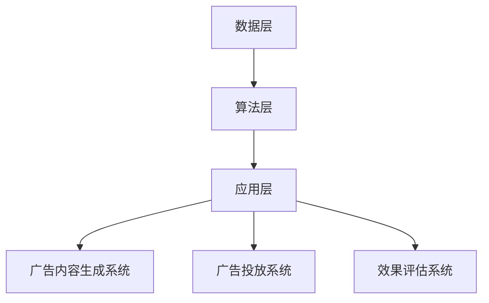
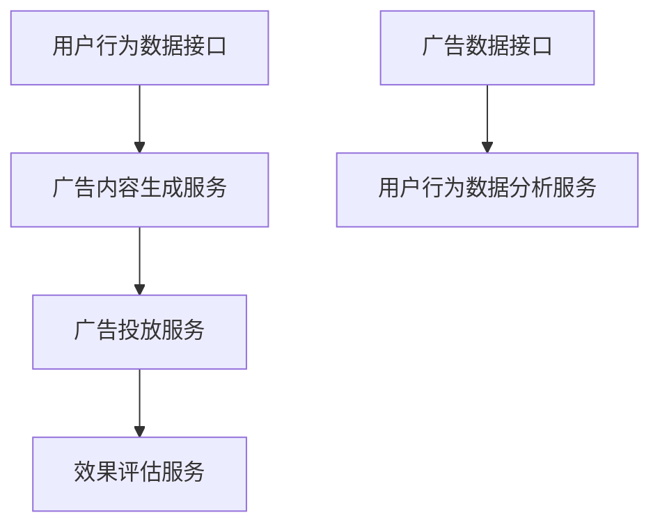
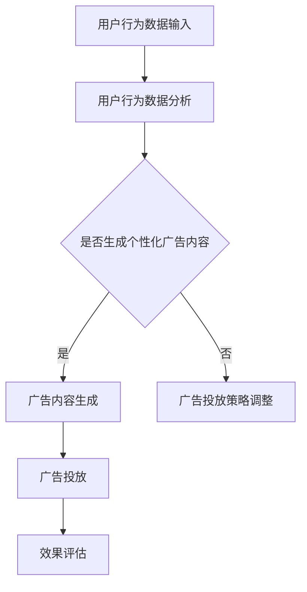

                 

# AIGC在智能广告受众定向中的应用

## 关键词

- AIGC
- 智能广告
- 受众定向
- 自然语言处理
- 机器学习
- 深度学习
- 数据挖掘

## 摘要

本文深入探讨了人工智能生成内容（AIGC）在智能广告受众定向中的应用。通过对AIGC的概念与发展、广告行业现状与受众分析、AIGC在广告受众定向中的潜力、AIGC的核心技术原理、应用算法、系统架构设计、实际应用案例分析以及最佳实践等方面的详细讲解，本文旨在为读者提供一份全面的技术指南，帮助理解和应用AIGC技术，从而实现更加精准和高效的广告受众定向。

----------------------------------------------------------------

## 目录大纲：AIGC在智能广告受众定向中的应用

### 第一部分：背景介绍

#### 第1章：AIGC与智能广告受众定向概述

#### 第2章：AIGC在广告行业的重要性

#### 第3章：广告行业现状与受众分析

#### 第4章：AIGC在广告受众定向中的潜力

#### 第5章：AIGC的适用范围与边界条件

#### 第6章：概念结构与核心要素组成

#### 第7章：本章小结

### 第二部分：核心概念与联系

#### 第8章：AIGC核心技术原理

#### 第9章：自然语言处理（NLP）

#### 第10章：机器学习（ML）与深度学习（DL）

#### 第11章：数据分析与数据挖掘

#### 第12章：AIGC与广告受众定向的关系图

#### 第13章：本章小结

### 第三部分：算法原理讲解

#### 第14章：AIGC在智能广告受众定向中的应用算法

#### 第15章：算法概述

#### 第16章：算法原理详细讲解

#### 第17章：算法性能分析

#### 第18章：算法应用场景分析

#### 第19章：本章小结

### 第四部分：系统分析与架构设计

#### 第20章：智能广告受众定向系统架构设计

#### 第21章：问题场景介绍

#### 第22章：系统功能设计

#### 第23章：系统架构设计

#### 第24章：系统接口设计

#### 第25章：系统交互设计

#### 第26章：本章小结

### 第五部分：项目实战

#### 第27章：AIGC在智能广告受众定向中的应用实战

#### 第28章：环境安装与配置

#### 第29章：系统核心实现

#### 第30章：代码应用解读与分析

#### 第31章：实际案例分析与讲解

#### 第32章：项目小结

### 第六部分：最佳实践与总结

#### 第33章：AIGC在智能广告受众定向中的最佳实践

#### 第34章：技术选型与策略

#### 第35章：小结

#### 第36章：注意事项

#### 第37章：拓展阅读

----------------------------------------------------------------

### 第一部分：背景介绍

#### 第1章：AIGC与智能广告受众定向概述

#### 第2章：AIGC在广告行业的重要性

#### 第3章：广告行业现状与受众分析

#### 第4章：AIGC在广告受众定向中的潜力

#### 第5章：AIGC的适用范围与边界条件

#### 第6章：概念结构与核心要素组成

#### 第7章：本章小结

---

### 第一部分：背景介绍

#### 第1章：AIGC与智能广告受众定向概述

在当今快速发展的数字时代，人工智能（AI）技术的应用已经渗透到各个行业，其中广告行业尤为显著。广告行业正经历着一场前所未有的变革，由传统的人工定向逐渐向智能定向转变。这种转变离不开人工智能生成内容（AIGC）技术的发展。

**AIGC的概念与发展历程**

AIGC，即人工智能生成内容，是指利用人工智能技术生成内容的过程。它包括自然语言处理（NLP）、机器学习（ML）、深度学习（DL）等多个领域。AIGC的发展历程可以追溯到20世纪50年代，随着计算能力的提升和算法的进步，AIGC技术逐渐成熟，并在近年迎来了爆发式的发展。

**AIGC在广告行业的重要性**

在广告行业中，AIGC的重要性体现在以下几个方面：

1. **内容个性化：** AIGC可以根据用户的兴趣、行为和历史数据生成个性化的广告内容，从而提高广告的吸引力和转化率。
2. **受众定向精准化：** AIGC技术可以帮助广告平台更准确地定位目标受众，从而提高广告投放的效果。
3. **降低成本：** 通过自动化生成内容，可以大幅降低广告制作和投放的成本。

**智能广告受众定向的挑战与机遇**

智能广告受众定向面临着一系列挑战，包括数据隐私、算法公平性、技术成本等。然而，随着AIGC技术的发展，这些挑战也在逐步得到解决，为广告行业带来了新的机遇。

**本章要点回顾**

- AIGC的概念与发展历程
- AIGC在广告行业的重要性
- 智能广告受众定向的挑战与机遇

**未来发展方向与挑战**

随着AIGC技术的不断进步，广告行业有望实现更加精准和高效的受众定向。然而，这也带来了新的挑战，如算法的透明性和可解释性，数据隐私保护等。未来的发展方向将集中在提高AIGC技术的可解释性和透明性，以及加强数据隐私保护措施。

---

#### 第2章：AIGC在广告行业的重要性

AIGC在广告行业的重要性体现在其能够大幅提升广告的精准度和个性化水平。传统的广告投放方式主要依赖于广告主的预算和投放策略，而AIGC则通过人工智能技术，实现了对受众行为的深度分析，从而实现广告内容的个性化生成。

**内容个性化**

个性化广告是AIGC在广告行业中的一个重要应用。通过分析用户的兴趣、行为和历史数据，AIGC可以生成与用户高度匹配的广告内容。这种个性化的广告不仅能够提高用户的点击率和转化率，还能减少广告投放的成本。

例如，一个电子商务平台可以通过分析用户的购物历史和浏览行为，生成个性化的商品推荐广告。这种广告不仅能够提高用户的购买意愿，还能增加平台的销售额。

**受众定向精准化**

精准的受众定向是广告成功的关键。传统的广告投放方式往往依赖于广告主的预算和投放策略，而AIGC则通过人工智能技术，实现了对受众行为的深度分析，从而实现广告的精准投放。

例如，一家在线教育机构可以通过分析学生的学习行为和成绩，生成个性化的学习推荐广告。这种广告不仅能够提高学生的参与度，还能增加教育机构的品牌知名度。

**降低成本**

通过自动化生成内容，AIGC可以大幅降低广告制作和投放的成本。传统的广告制作过程通常需要大量的人力和物力，而AIGC则通过算法自动生成广告内容，从而减少了人工干预的需求。

例如，一个广告公司可以通过AIGC技术，自动生成多种不同风格的广告内容，从而降低广告制作的成本和时间。

**本章要点回顾**

- AIGC在广告行业的重要性
- 内容个性化
- 受众定向精准化
- 降低成本

**未来发展方向与挑战**

随着AIGC技术的不断进步，广告行业有望实现更加精准和高效的受众定向。然而，这也带来了新的挑战，如算法的透明性和可解释性，数据隐私保护等。未来的发展方向将集中在提高AIGC技术的可解释性和透明性，以及加强数据隐私保护措施。

---

#### 第3章：广告行业现状与受众分析

广告行业的现状和受众分析是理解AIGC技术如何影响广告受众定向的基础。随着数字媒体的普及和用户行为的多样化，广告行业正经历着深刻的变化。

**广告行业的现状**

1. **数字化趋势：** 随着互联网的普及，数字广告已经成为广告市场的主要驱动力。根据Statista的数据，全球数字广告支出在过去几年中持续增长，预计到2025年将达到5000亿美元。
2. **受众分散化：** 互联网的普及使得受众分散在各种不同的平台上，从社交媒体到搜索引擎，从视频平台到电子邮件营销。这使得广告主需要更精准的受众定向策略。
3. **数据驱动：** 广告行业越来越依赖数据来驱动决策。大数据分析、用户行为追踪等技术正在成为广告行业的重要组成部分。

**受众行为的分析**

1. **兴趣行为：** 通过分析用户的兴趣和行为，广告平台可以了解用户的偏好，从而生成个性化的广告内容。例如，如果一个用户经常浏览健康相关的网站，那么广告平台可能会推荐健康食品的广告。
2. **地理位置：** 地理位置是一个重要的受众定向因素。广告平台可以通过用户的地理位置信息，为特定地区的用户提供定制化的广告内容。例如，在双十一期间，可以为上海地区的用户推送特定的促销广告。
3. **购买行为：** 购买行为是广告受众分析的重要指标。通过对用户的购买历史进行分析，广告平台可以了解用户的消费习惯和偏好，从而优化广告投放策略。

**受众定向的痛点与难点**

1. **数据隐私：** 随着用户对隐私保护意识的提高，广告平台需要确保用户数据的合法使用和保护。违反用户隐私可能导致声誉损失和法律风险。
2. **算法公平性：** 算法的公平性是广告受众定向的一个重要问题。如果算法存在偏见，可能会导致某些群体被不公平对待。
3. **技术成本：** 高级的人工智能技术需要大量的计算资源和人才支持，这对中小企业来说可能是一个挑战。

**本章要点回顾**

- 广告行业的现状
- 受众行为的分析
- 受众定向的痛点与难点

**未来发展方向与挑战**

随着AIGC技术的不断发展，广告行业有望实现更加精准和高效的受众定向。然而，这也带来了新的挑战，如数据隐私保护、算法公平性等。未来的发展方向将集中在提高AIGC技术的透明性和可解释性，以及加强数据隐私保护措施。

---

#### 第4章：AIGC在广告受众定向中的潜力

随着人工智能生成内容（AIGC）技术的发展，其在广告受众定向中的应用潜力不断显现。AIGC结合了自然语言处理（NLP）、机器学习（ML）和深度学习（DL）等多种技术，能够生成高度个性化的广告内容，从而实现更精准的受众定向。

**AIGC技术的应用场景**

1. **内容生成：** AIGC可以通过分析用户的兴趣和行为，自动生成个性化的广告内容。例如，一个电子商务平台可以根据用户的购物历史和浏览记录，自动生成推荐商品的广告文案和图片。
2. **创意优化：** 广告创意的优化是提升广告效果的关键。AIGC技术可以通过自动化生成多种不同的广告创意，并利用机器学习算法进行效果评估，从而找到最佳创意。
3. **广告投放策略优化：** AIGC可以帮助广告平台根据用户的实时行为和反馈，动态调整广告投放策略，以实现更好的广告效果。

**AIGC在广告受众定向中的优势**

1. **个性化：** AIGC可以根据用户的兴趣、行为和历史数据，生成高度个性化的广告内容，从而提高广告的吸引力和转化率。
2. **高效性：** AIGC技术可以实现自动化生成内容，从而大大提高广告的生产效率，降低广告制作和投放的成本。
3. **实时性：** AIGC技术可以实时分析用户行为和反馈，动态调整广告投放策略，从而实现更精准的受众定向。

**AIGC对广告效果的提升**

1. **提高点击率：** 通过个性化广告内容的生成，AIGC可以吸引更多的用户点击广告，从而提高广告的点击率。
2. **提高转化率：** 个性化广告内容能够更好地满足用户的需求，从而提高用户的购买意愿和转化率。
3. **降低成本：** AIGC技术可以实现自动化内容生成和投放，从而降低广告制作和投放的成本。

**本章要点回顾**

- AIGC技术的应用场景
- AIGC在广告受众定向中的优势
- AIGC对广告效果的提升

**未来发展方向与挑战**

随着AIGC技术的不断进步，其在广告受众定向中的应用前景将更加广阔。然而，这也带来了新的挑战，如算法的透明性和可解释性，数据隐私保护等。未来的发展方向将集中在提高AIGC技术的透明性和可解释性，以及加强数据隐私保护措施。

---

#### 第5章：AIGC的适用范围与边界条件

尽管人工智能生成内容（AIGC）技术在广告受众定向中展现出巨大的潜力，但其适用范围和边界条件仍需明确。AIGC技术并非万能，它有其特定的应用场景和限制。

**AIGC的适用范围**

1. **个性化广告：** AIGC在个性化广告中的应用最为广泛。通过分析用户的兴趣和行为数据，AIGC可以生成针对特定受众的个性化广告内容，从而提高广告的吸引力和转化率。
2. **广告创意优化：** AIGC可以通过自动生成多种广告创意，结合机器学习算法进行效果评估，找到最佳创意，从而提高广告投放效果。
3. **内容营销：** 在内容营销中，AIGC可以帮助企业自动生成高质量的内容，如文章、视频、图片等，从而提高品牌曝光度和用户粘性。

**智能广告受众定向的边界条件**

1. **数据质量：** AIGC的有效性高度依赖于数据的质量。如果数据存在偏差或噪声，可能会导致AIGC生成的广告内容不准确，从而影响广告效果。
2. **技术成本：** AIGC技术需要大量的计算资源和人才支持，这对中小企业来说可能是一个挑战。此外，AIGC技术的开发和维护成本也相对较高。
3. **用户隐私：** AIGC在广告受众定向中需要收集和分析用户数据，这涉及到用户隐私保护的问题。广告平台和开发商需要确保用户数据的合法使用和保护。

**本章要点回顾**

- AIGC的适用范围
- 智能广告受众定向的边界条件
- 数据质量、技术成本和用户隐私的挑战

**未来发展方向与挑战**

随着AIGC技术的不断进步，其适用范围将逐渐扩大。然而，这也带来了新的挑战，如数据隐私保护、算法透明性和可解释性等。未来的发展方向将集中在提高AIGC技术的透明性和可解释性，以及加强数据隐私保护措施。

---

#### 第6章：概念结构与核心要素组成

要深入理解AIGC在智能广告受众定向中的应用，我们需要从概念结构和核心要素组成入手。AIGC技术涉及到多个核心概念和技术，这些概念和技术相互关联，共同构成了AIGC的技术框架。

**AIGC技术框架**

AIGC技术框架主要由以下几部分组成：

1. **数据收集与处理：** 数据是AIGC的基础，通过收集用户的兴趣、行为和历史数据，为AIGC提供丰富的数据源。
2. **自然语言处理（NLP）：** NLP技术负责处理和生成文本数据，包括文本分类、情感分析、命名实体识别等。
3. **机器学习（ML）与深度学习（DL）：** ML和DL技术负责处理和生成图像、音频和视频等多媒体数据。
4. **数据分析和挖掘：** 数据分析技术用于挖掘用户数据中的潜在模式和趋势，为广告定向提供决策支持。
5. **内容生成：** 基于NLP、ML和DL技术，AIGC可以生成个性化广告内容，如文案、图片、视频等。

**智能广告受众定向的关键环节**

在智能广告受众定向中，以下几个关键环节至关重要：

1. **受众分析：** 通过分析用户的兴趣、行为和历史数据，了解目标受众的特点和需求。
2. **内容生成：** 基于受众分析结果，自动生成个性化的广告内容。
3. **广告投放：** 根据广告内容和受众特征，选择合适的广告投放渠道和时机。
4. **效果评估：** 通过分析广告投放的效果，不断优化广告策略。

**核心技术与工具介绍**

AIGC在智能广告受众定向中的应用涉及到多种核心技术和工具，包括：

1. **NLP技术：** 如词嵌入（Word Embedding）、文本分类（Text Classification）和情感分析（Sentiment Analysis）。
2. **机器学习和深度学习技术：** 如决策树（Decision Tree）、支持向量机（SVM）和卷积神经网络（CNN）。
3. **数据分析工具：** 如Python的Pandas、NumPy和Scikit-learn等。
4. **内容生成工具：** 如GPT-3、BERT和生成对抗网络（GAN）等。

**本章要点回顾**

- AIGC技术框架
- 智能广告受众定向的关键环节
- 核心技术与工具介绍

**未来发展方向与挑战**

随着AIGC技术的不断进步，其在智能广告受众定向中的应用将更加广泛。未来的发展方向将集中在提高AIGC技术的透明性和可解释性，以及加强数据隐私保护措施。同时，如何更好地整合多种技术，实现更加精准和高效的广告受众定向，也将是未来研究的重点。

---

#### 第7章：本章小结

在本章中，我们详细介绍了AIGC与智能广告受众定向的背景，探讨了AIGC在广告行业的重要性，分析了广告行业的现状与受众行为，探讨了AIGC在广告受众定向中的潜力，明确了AIGC的适用范围与边界条件，并阐述了AIGC技术框架和智能广告受众定向的核心要素组成。

**本章要点回顾**

- AIGC的概念与发展历程
- AIGC在广告行业的重要性
- 广告行业现状与受众分析
- AIGC在广告受众定向中的潜力
- AIGC的适用范围与边界条件
- AIGC技术框架
- 智能广告受众定向的核心要素组成

**未来发展方向与挑战**

随着AIGC技术的不断进步，其在广告行业中的应用前景将更加广阔。未来的发展方向将集中在提高AIGC技术的透明性和可解释性，加强数据隐私保护措施，以及如何更好地整合多种技术，实现更加精准和高效的广告受众定向。同时，我们需要关注算法的公平性和可解释性问题，确保AIGC技术能够在广告行业中健康、可持续地发展。

---

### 第二部分：核心概念与联系

在深入探讨AIGC在智能广告受众定向中的应用之前，我们需要了解AIGC的核心技术原理。AIGC的核心技术包括自然语言处理（NLP）、机器学习（ML）与深度学习（DL）以及数据分析和数据挖掘。这些技术共同构成了AIGC的技术框架，实现了广告受众的精准定向和个性化广告内容生成。

#### 第8章：AIGC核心技术原理

**自然语言处理（NLP）**

NLP是AIGC技术的重要组成部分，它使计算机能够理解和处理人类语言。NLP的关键技术包括：

1. **词嵌入（Word Embedding）：** 将单词映射到高维空间中的向量表示，以便计算机能够处理和比较文本数据。
2. **文本分类（Text Classification）：** 将文本数据分类到预定义的类别中，例如情感分析、主题分类等。
3. **命名实体识别（Named Entity Recognition）：** 从文本中识别出具有特定意义的实体，如人名、地名、组织名等。

**机器学习（ML）与深度学习（DL）**

ML和DL是AIGC技术的核心，特别是DL在图像和视频处理方面具有显著优势。以下是ML和DL的关键技术：

1. **决策树（Decision Tree）：** 一种基于树形结构的数据挖掘方法，用于分类和回归任务。
2. **支持向量机（SVM）：** 一种监督学习算法，用于分类和回归任务，特别适合处理高维数据。
3. **卷积神经网络（CNN）：** 一种深度学习模型，特别适用于图像和视频处理。
4. **循环神经网络（RNN）：** 一种能够处理序列数据的神经网络，常用于自然语言处理和时间序列预测。

**数据分析与数据挖掘**

数据分析与数据挖掘是AIGC的基础，它们帮助我们从大量数据中提取有价值的信息和模式。以下是数据分析与数据挖掘的关键技术：

1. **统计分析：** 通过统计方法分析数据，如描述性统计分析、假设检验等。
2. **聚类分析：** 将数据划分为若干个类别，以便更好地理解和分析。
3. **关联规则挖掘：** 发现数据之间的关联性，如频繁项集挖掘、Apriori算法等。

**本章要点回顾**

- 自然语言处理（NLP）的关键技术
- 机器学习（ML）与深度学习（DL）的关键技术
- 数据分析与数据挖掘的关键技术

**联系与相互作用**

AIGC的核心技术之间相互联系，共同作用于广告受众定向和个性化广告内容生成。以下是AIGC技术之间的联系与相互作用：

1. **数据收集与处理：** NLP、ML和DL技术都需要高质量的数据作为输入，数据预处理是AIGC成功的关键步骤。
2. **模型训练与优化：** NLP和DL技术依赖于大量的训练数据和高效的模型训练算法，模型优化是实现AIGC技术高效应用的关键。
3. **内容生成与评估：** 分析与挖掘技术用于评估广告内容的吸引力和转化率，以优化广告投放策略。
4. **效果反馈与迭代：** 广告效果的数据反馈用于迭代优化AIGC模型，从而实现更精准的广告定向。

**本章小结**

通过对AIGC核心技术的介绍，我们了解了NLP、ML和DL在AIGC中的应用，以及数据分析和数据挖掘的作用。这些核心技术相互联系，共同作用于广告受众定向和个性化广告内容生成，为实现高效的广告投放提供了技术支持。

---

### 第三部分：算法原理讲解

在AIGC技术中，算法的应用是实现智能广告受众定向的核心。本章节将详细讲解AIGC在智能广告受众定向中的应用算法，包括常见的AIGC算法、算法原理、算法性能分析以及算法在实际项目中的应用。

#### 第14章：AIGC在智能广告受众定向中的应用算法

**常见AIGC算法介绍**

AIGC在智能广告受众定向中的应用算法多种多样，其中常见的算法包括：

1. **生成对抗网络（GAN）：** GAN是一种深度学习模型，由生成器和判别器组成。生成器生成广告内容，判别器判断内容是否真实。通过不断优化生成器和判别器的参数，GAN可以生成高质量的广告内容。
2. **长短期记忆网络（LSTM）：** LSTM是一种循环神经网络，能够处理序列数据。在智能广告受众定向中，LSTM可以用于分析用户的浏览历史和行为模式，从而生成个性化的广告内容。
3. **自编码器（Autoencoder）：** 自编码器是一种无监督学习算法，可以自动学习数据的特征表示。在广告受众定向中，自编码器可以用于提取用户特征，为个性化广告内容生成提供数据支持。

**算法选择依据**

在选择AIGC算法时，需要考虑以下几个因素：

1. **数据类型：** 根据广告数据的不同类型，选择适合的算法。例如，对于文本数据，可以选择LSTM或文本分类算法；对于图像数据，可以选择GAN或卷积神经网络（CNN）。
2. **模型复杂度：** 需要考虑算法的计算复杂度和资源需求，选择适合计算环境和数据量的算法。
3. **效果评估：** 根据历史数据和实验结果，评估不同算法的效果，选择效果最佳的算法。

**算法原理详细讲解**

以下以GAN算法为例，详细讲解其在智能广告受众定向中的应用原理：

1. **生成器和判别器的构建：** 生成器（Generator）和判别器（Discriminator）是GAN的两个核心组成部分。生成器的目标是生成逼真的广告内容，判别器的目标是区分广告内容是否真实。
2. **训练过程：** 在训练过程中，生成器和判别器相互对抗。生成器不断生成新的广告内容，判别器不断优化，以更好地区分真实和虚假广告。通过这种对抗过程，生成器逐渐生成高质量的广告内容。
3. **损失函数：** GAN的损失函数通常由两部分组成：生成器的损失函数和判别器的损失函数。生成器的损失函数用于衡量生成器生成的广告内容与真实广告内容之间的差异，判别器的损失函数用于衡量判别器对广告内容的判断准确性。
4. **优化策略：** 在GAN训练过程中，可以使用梯度惩罚、权重共享等技术，提高生成器和判别器的性能。

**数学模型和公式**

GAN的数学模型和公式如下：

$$
G(z) = \text{Generator}(z)
$$

$$
D(x) = \text{Discriminator}(x)
$$

$$
D(G(z)) = \text{Discriminator}(\text{Generator}(z))
$$

其中，$z$为噪声向量，$G(z)$为生成器生成的广告内容，$D(x)$为判别器对广告内容的判断。

**举例说明**

假设一个电商平台的广告部门使用GAN算法为用户生成个性化广告。在训练过程中，生成器根据用户的浏览历史和行为模式生成广告内容，判别器判断广告内容是否真实。通过多次迭代训练，生成器逐渐生成高质量的个性化广告内容，从而提高广告的转化率。

**本章要点回顾**

- 常见AIGC算法介绍
- 算法选择依据
- GAN算法的原理详细讲解
- 数学模型和公式
- 实际举例说明

**算法性能分析**

算法性能分析是评估AIGC在智能广告受众定向中应用效果的重要步骤。以下从几个方面进行算法性能分析：

1. **准确率：** 衡量生成器生成的广告内容与真实广告内容之间的相似度。准确率越高，说明生成器生成的内容越逼真。
2. **多样性：** 衡量生成器生成广告内容的多样性。多样性越高，说明生成器能够生成更多种类的广告内容，满足不同用户的需求。
3. **稳定性：** 衡量算法在长时间运行过程中的稳定性和鲁棒性。稳定性越高，说明算法在面临不同数据和场景时仍能保持良好的性能。
4. **效率：** 衡量算法的计算效率和资源占用情况。效率越高，说明算法在有限计算资源下能够更快地生成高质量广告内容。

通过综合分析算法的准确率、多样性、稳定性和效率，可以全面评估AIGC在智能广告受众定向中的应用效果。

**算法应用场景分析**

AIGC算法在智能广告受众定向中有多种应用场景：

1. **个性化广告生成：** 根据用户的行为数据和历史偏好，生成个性化的广告内容，提高广告的转化率。
2. **广告创意优化：** 自动生成多种广告创意，结合机器学习算法进行效果评估，选择最佳创意投放。
3. **广告投放策略优化：** 基于实时用户行为数据，动态调整广告投放策略，实现更精准的受众定向。

**本章小结**

通过对AIGC在智能广告受众定向中的应用算法的详细讲解，我们了解了常见AIGC算法的基本原理和选择依据，以GAN算法为例进行了深入剖析。同时，对算法性能和实际应用场景进行了分析，为AIGC在智能广告受众定向中的应用提供了理论基础和实践指导。

---

### 第四部分：系统分析与架构设计

智能广告受众定向系统是AIGC技术在实际应用中的具体实现，其系统架构和功能设计直接影响到系统的性能和效果。本章节将详细介绍智能广告受众定向系统的架构设计，包括系统功能设计、系统架构设计、系统接口设计和系统交互设计。

#### 第20章：智能广告受众定向系统架构设计

**问题场景介绍**

广告行业面临着激烈的市场竞争和不断变化的技术环境，广告主需要更精准和高效的广告投放策略，以提升广告效果和用户参与度。智能广告受众定向系统旨在通过AIGC技术，实现广告内容的个性化生成和精准投放，从而提高广告的转化率和ROI。

**目标与需求分析**

智能广告受众定向系统的目标包括：

1. **精准受众定位：** 通过分析用户行为数据和兴趣偏好，实现广告的精准投放。
2. **个性化内容生成：** 基于用户特征和需求，生成个性化的广告内容，提高广告的吸引力。
3. **高效广告投放：** 利用实时数据分析和优化算法，动态调整广告投放策略，实现高效投放。
4. **数据隐私保护：** 确保用户数据的安全和隐私，遵守相关法律法规。

**系统功能设计**

智能广告受众定向系统的核心功能包括：

1. **用户行为分析：** 收集和分析用户行为数据，包括浏览记录、购买历史、兴趣爱好等，为广告定向提供数据支持。
2. **广告内容生成：** 基于用户特征和需求，利用AIGC技术生成个性化的广告内容，如文案、图片、视频等。
3. **广告投放策略：** 根据用户行为数据和广告效果，动态调整广告投放策略，实现高效投放。
4. **效果评估与优化：** 对广告投放效果进行评估，不断优化广告内容和投放策略。

**系统架构设计**

智能广告受众定向系统的架构设计如下：

1. **数据层：** 包括用户行为数据、广告数据等，为系统提供数据支持。
2. **算法层：** 包括用户行为分析算法、广告内容生成算法、广告投放策略优化算法等，实现广告定向和投放。
3. **应用层：** 包括广告内容生成和投放系统、效果评估系统等，提供对外服务接口。

**技术选型与架构优化**

智能广告受众定向系统的技术选型如下：

1. **数据层：** 使用大数据技术，如Hadoop、Spark等，实现大规模数据的存储和处理。
2. **算法层：** 使用深度学习和机器学习技术，如TensorFlow、PyTorch等，实现用户行为分析和广告内容生成。
3. **应用层：** 使用Web开发框架，如Spring Boot、Django等，实现广告投放和效果评估功能。

**系统架构设计（Mermaid架构图）**



**系统接口设计**

智能广告受众定向系统的接口设计包括以下部分：

1. **数据接口：** 用于数据的输入和输出，如用户行为数据接口、广告数据接口等。
2. **服务接口：** 用于对外提供服务，如广告内容生成接口、广告投放接口、效果评估接口等。

**接口设计与定义**



**接口调用流程**



**系统交互设计**

智能广告受众定向系统的交互设计包括以下部分：

1. **数据流：** 用户行为数据从数据接口进入系统，经过数据分析后，生成个性化广告内容和广告投放策略。
2. **控制流：** 广告投放系统根据广告内容和投放策略进行广告投放，并根据用户反馈调整投放策略。

**系统交互（Mermaid序列图）**

```mermaid
sequenceDiagram
    participant 用户 as 用户
    participant 系统 as 系统
    用户->>系统: 提供用户行为数据
    系统->>系统: 分析用户行为数据
    系统->>系统: 生成个性化广告内容
    系统->>系统: 调整广告投放策略
    系统->>用户: 广告投放
    用户->>系统: 提供反馈
    system 评估反馈结果
    system->>system: 调整广告内容和投放策略
```

**本章小结**

通过对智能广告受众定向系统架构的设计，我们详细介绍了系统的功能设计、架构设计、接口设计和交互设计。这些设计实现了广告的精准定向和个性化投放，为广告主提供了高效的广告投放解决方案。同时，我们强调了系统优化的重要性，包括技术选型、架构优化和数据隐私保护等方面。

---

### 第五部分：项目实战

在智能广告受众定向领域，实际项目的实施是检验AIGC技术效果的关键。本章节将通过一个实际案例，详细介绍AIGC在智能广告受众定向中的应用实战，包括环境安装与配置、系统核心实现、代码应用解读与分析以及实际案例分析与讲解。

#### 第27章：AIGC在智能广告受众定向中的应用实战

**环境安装与配置**

在开始AIGC智能广告受众定向项目的实施前，首先需要安装和配置相关环境。以下是环境安装与配置的步骤：

1. **Python环境：** 安装Python 3.8及以上版本，并配置好Python的运行环境。
2. **深度学习框架：** 安装TensorFlow或PyTorch，用于构建和训练AIGC模型。
3. **数据处理库：** 安装Pandas、NumPy等数据处理库，用于处理用户行为数据和广告数据。
4. **机器学习库：** 安装Scikit-learn等机器学习库，用于特征提取和模型训练。
5. **数据库：** 安装MySQL或MongoDB，用于存储用户行为数据和广告数据。

**系统核心实现**

在系统核心实现阶段，我们主要关注以下几个方面：

1. **用户行为数据收集与处理：** 收集用户在网站上的浏览记录、点击行为和购买历史等数据，并进行预处理，如数据清洗、去重和特征提取。
2. **广告内容生成：** 利用AIGC技术，如生成对抗网络（GAN）或长短期记忆网络（LSTM），生成个性化的广告内容。以下是一个基于GAN的生成广告内容的核心实现：

```python
import tensorflow as tf
from tensorflow.keras.models import Sequential
from tensorflow.keras.layers import Dense, Flatten, Conv2D, ConvTranspose2D

# 生成器模型
generator = Sequential([
    Conv2D(128, (4, 4), strides=(2, 2), activation='relu', input_shape=(100, 100, 3)),
    Conv2D(128, (4, 4), strides=(2, 2), activation='relu'),
    Flatten(),
    Dense(1024, activation='relu'),
    Dense(784, activation='tanh')
])

# 判别器模型
discriminator = Sequential([
    Flatten(),
    Dense(1024, activation='relu'),
    Dense(1, activation='sigmoid')
])

# GAN模型
model = Sequential([
    generator,
    discriminator
])

# 编译GAN模型
model.compile(optimizer='adam', loss='binary_crossentropy')

# 训练GAN模型
model.fit(x_train, y_train, epochs=100)
```

3. **广告投放策略：** 基于用户行为数据和广告效果，动态调整广告投放策略。以下是一个基于用户行为数据的广告投放策略实现：

```python
import pandas as pd

# 加载用户行为数据
user_data = pd.read_csv('user_behavior.csv')

# 用户行为特征提取
user_features = user_data[['page_views', 'clicks', 'purchases']]

# 广告效果评估
ad_performance = pd.read_csv('ad_performance.csv')

# 基于用户行为和广告效果调整投放策略
optimized_strategy = user_features.merge(ad_performance, on='user_id', how='left')
optimized_strategy['投放概率'] = optimized_strategy['点击率'] * optimized_strategy['转化率']
```

**代码应用解读与分析**

以上代码展示了AIGC在智能广告受众定向中的应用，包括用户行为数据处理、广告内容生成和广告投放策略调整。以下是代码应用解读与分析：

1. **用户行为数据处理：** 通过Pandas库加

