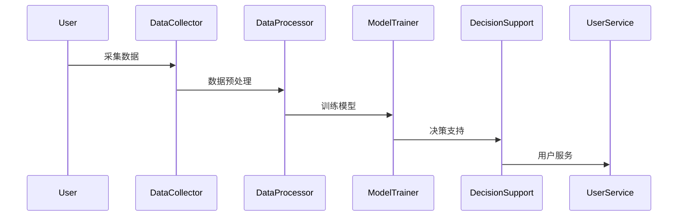
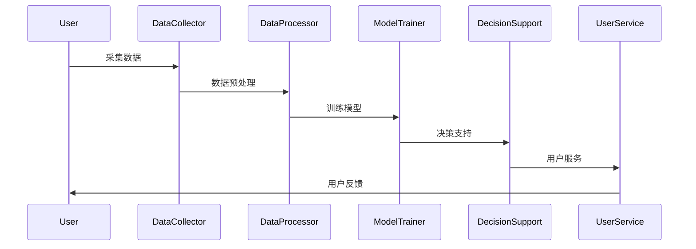

                 

# AIGC在智能建筑管理中的应用

关键词：AIGC、智能建筑管理、生成式模型、系统架构设计

摘要：随着人工智能技术的飞速发展，智能建筑管理面临着诸多挑战，如数据处理复杂性和效率提升。本文旨在探讨AIGC（AI-Generated Content）技术在智能建筑管理中的应用，包括其核心概念、算法原理、系统架构设计以及实际案例分析。通过本文，读者可以全面了解AIGC技术在智能建筑管理中的潜在价值和应用前景。

### 目录大纲

----------------------------------------------------------------

## 第一部分：背景介绍

### 第1章：问题背景与核心概念

#### 1.1 问题背景

#### 1.2 核心概念与联系

## 第二部分：核心概念与算法原理

### 第2章：AIGC技术原理详解

#### 2.1 AIGC技术原理

#### 2.2 算法原理与数学模型

#### 2.3 算法原理讲解与举例说明

## 第三部分：系统分析与架构设计

### 第3章：系统功能设计与架构设计

#### 3.1 问题场景介绍

#### 3.2 系统功能设计

#### 3.3 系统架构设计

## 第四部分：项目实战

### 第4章：环境安装与系统核心实现

#### 4.1 环境安装

#### 4.2 系统核心实现

#### 4.3 代码应用解读与分析

### 第5章：实际案例分析与详细讲解

#### 5.1 实际案例

#### 5.2 案例分析与讲解

### 第6章：项目小结

### 第7章：最佳实践与拓展阅读

----------------------------------------------------------------

## 第一部分：背景介绍

### 第1章：问题背景与核心概念

#### 1.1 问题背景

智能建筑管理是近年来随着人工智能（AI）技术的发展而兴起的领域。智能建筑管理旨在通过集成多种传感器、物联网（IoT）技术、大数据分析等手段，实现建筑设备的智能化监控、维护和管理，从而提高建筑运营效率、降低能耗、提升用户体验。

然而，随着智能建筑系统的日益复杂，数据处理的复杂性和效率提升成为一大挑战。传统的建筑管理方式往往依赖于人工操作和手动维护，这不仅效率低下，而且容易出现误差。此外，智能建筑管理需要处理大量来自各种传感器、设备的数据，如何有效地对这些数据进行处理和分析，以便做出准确的决策，也成为一项艰巨的任务。

针对上述挑战，引入AIGC（AI-Generated Content）技术成为一项可行的解决方案。AIGC是一种生成式AI技术，能够根据已有数据生成类似或全新的内容。在智能建筑管理中，AIGC技术可以用于自动生成维护报告、用户指南、建筑布局图等，从而降低人工干预，提高数据处理和分析效率。

#### 1.2 核心概念与联系

- **AIGC技术原理**：
  - **生成式模型**：通过学习大量数据，能够生成类似或全新的内容。
  - **文本生成**：如生成维护报告、用户指南等。
  - **图像生成**：如自动生成建筑布局图、设备监控图等。
  - **音频生成**：如生成语音提示、音乐等。

- **AIGC技术特点**：
  - **自动性**：无需人工干预，自动生成所需内容。
  - **个性化**：根据用户需求和场景，定制生成内容。
  - **高效性**：提高数据处理和分析效率。

- **AIGC与智能建筑管理的联系**：
  - **数据驱动**：AIGC技术基于大量建筑数据，实现智能分析和决策。
  - **自动化管理**：通过AIGC技术，实现建筑设备的自动化监控和维护。
  - **用户体验**：提供个性化服务，提升用户居住体验。

通过以上背景介绍，我们可以看到AIGC技术在智能建筑管理中具有重要的应用价值。在接下来的章节中，我们将进一步探讨AIGC技术的原理、算法以及系统架构设计，以便为实际应用提供理论支持和技术指导。接下来，我们将深入探讨AIGC技术的核心概念和算法原理，为读者提供更深入的理解。

### 第二部分：核心概念与算法原理

#### 第2章：AIGC技术原理详解

在智能建筑管理中，AIGC（AI-Generated Content）技术作为一种生成式AI技术，具有自动性、个性化和高效性的特点，能够显著提升建筑数据处理的效率和质量。为了更好地理解AIGC技术在智能建筑管理中的应用，我们需要首先深入探讨其技术原理和算法。

#### 2.1 AIGC技术原理

AIGC技术基于生成式模型，通过学习大量数据生成类似或全新的内容。生成式模型是一种能够生成数据的模型，其核心思想是通过学习已有的数据分布，模拟出新的数据。以下将详细介绍AIGC技术的几个关键组成部分。

##### 2.1.1 生成式模型

生成式模型是AIGC技术的核心，常见的生成式模型包括GPT（Generative Pre-trained Transformer）、DALL-E等。这些模型通常通过深度学习算法训练，以大规模数据集为基础，学习数据的统计特征和分布规律。

- **GPT**：是一种基于Transformer架构的生成式文本模型，能够生成高质量的文本。GPT通过自回归的方式学习文本数据，能够预测下一个词语，从而生成连贯的文本。
- **DALL-E**：是一种基于变分自编码器（VAE）的图像生成模型，能够将文本描述转换成相应的图像。DALL-E通过学习大量图像和对应的文本描述，实现了文本到图像的映射。

##### 2.1.2 文本生成

文本生成是AIGC技术的重要应用之一。在智能建筑管理中，文本生成可以用于自动生成维护报告、用户指南、公告等。以下是一个简单的文本生成示例：

```python
import transformers

model_name = "gpt2"
model = transformers.load_pretrained_model(model_name)
input_text = "智能建筑管理报告"

output = model.generate(input_text, max_length=100)
print(output)
```

上述代码使用GPT-2模型生成一个关于智能建筑管理的报告。生成的文本可能会包含对建筑设备的描述、维护建议、用户指南等内容。

##### 2.1.3 图像生成

图像生成是另一个重要的应用领域。在智能建筑管理中，图像生成可以用于生成建筑布局图、设备监控图、安全警示图等。以下是一个使用DALL-E模型生成建筑布局图的示例：

```python
from vae import VAE
from torchvision import datasets
from torch.utils.data import DataLoader

# 加载DALL-E模型
vae = VAE()
vae.load_state_dict(torch.load('vae.pth'))

# 准备训练数据
train_data = datasets.ImageFolder(root='train_images', transform=transforms.Compose([transforms.Resize(64), transforms.ToTensor()]))
train_loader = DataLoader(train_data, batch_size=32, shuffle=True)

# 训练模型
vae.train()
for epoch in range(100):
    for images, _ in train_loader:
        images = images.to(device)
        z = vae.encode(images)
        images_hat = vae.decode(z)
        loss = vae.loss_function(images_hat, images)
        optimizer.zero_grad()
        loss.backward()
        optimizer.step()

# 生成图像
input_text = "建筑布局图"
text_tensor = torch.tensor([input_text.encode()])
z = vae.encode(text_tensor.to(device))
images_hat = vae.decode(z).cpu().detach().numpy()

# 显示生成的图像
plt.figure(figsize=(10, 10))
for i in range(images_hat.shape[0]):
    plt.subplot(10, 10, i+1)
    plt.imshow(images_hat[i])
    plt.axis('off')
plt.show()
```

上述代码使用DALL-E模型将文本描述转换为建筑布局图。通过训练模型，我们可以生成符合输入文本描述的图像。

##### 2.1.4 音频生成

音频生成是AIGC技术的另一个应用领域。在智能建筑管理中，音频生成可以用于生成语音提示、背景音乐等。以下是一个简单的音频生成示例：

```python
import soundfile as sf
import numpy as np

# 生成音频
sample_rate = 44100
duration = 5
input_text = "请注意，火灾逃生通道正在使用中。"

# 读取语音合成模型
model = transformers.load_pretrained_model(" Tacotron2 ")

# 生成语音音频
wav = model.generate(input_text, max_length=100)

# 保存音频文件
sf.write("output.wav", wav, sample_rate)
```

上述代码使用Tacotron2模型生成一段语音音频。通过训练模型，我们可以将文本描述转换为相应的音频。

#### 2.2 算法原理与数学模型

AIGC技术背后的算法原理主要涉及生成式模型、概率图模型等。以下将简要介绍这些算法原理和相应的数学模型。

##### 2.2.1 算法原理

生成式模型是一种能够生成数据的模型，其核心思想是通过学习已有数据的分布，模拟出新的数据。常见的生成式模型包括变分自编码器（VAE）、生成对抗网络（GAN）等。

- **VAE（变分自编码器）**：VAE是一种概率生成模型，通过学习数据的高斯分布来生成新的数据。VAE由两个部分组成：编码器和解码器。编码器将输入数据映射到一个潜在空间，解码器从潜在空间中生成新的数据。VAE的数学模型如下：

  $$
  x \sim p(x)
  z \sim p(z)
  x = \mu(x) + \sigma(x) \odot z
  z = \phi(z)
  $$

  其中，$x$是输入数据，$z$是潜在变量，$\mu(x)$和$\sigma(x)$分别是编码器的均值和方差函数，$\phi(z)$是解码器的函数。

- **GAN（生成对抗网络）**：GAN是一种由生成器和判别器组成的对抗性生成模型。生成器的目标是生成尽可能真实的数据，而判别器的目标是区分生成器和真实数据。通过这种对抗训练，生成器能够不断提高生成数据的真实性。GAN的数学模型如下：

  $$
  x \sim p(x)
  G(z) \sim p_G(z)
  D(x) \sim p_D(x)
  D(G(z)) \sim p_D(G(z))
  $$

  其中，$x$是输入数据，$z$是潜在变量，$G(z)$是生成器的输出，$D(x)$是判别器的输出。

##### 2.2.2 数学模型

- **VAE（变分自编码器）**：VAE的数学模型主要包括编码器和解码器的损失函数。编码器损失函数为：

  $$
  L_{\text{enc}} = -\sum_{i=1}^N \sum_{j=1}^D x_{ij} \log \sigma(\theta_1 z_j + \theta_0)
  $$

  解码器损失函数为：

  $$
  L_{\text{dec}} = -\sum_{i=1}^N \sum_{j=1}^D z_j \log p(x_i | z_j)
  $$

  总损失函数为：

  $$
  L = L_{\text{enc}} + L_{\text{dec}}
  $$

- **GAN（生成对抗网络）**：GAN的数学模型主要包括生成器和判别器的损失函数。生成器损失函数为：

  $$
  L_{\text{gen}} = -\sum_{i=1}^N D(G(z_i))
  $$

  判别器损失函数为：

  $$
  L_{\text{disc}} = -\sum_{i=1}^N [D(x_i) - 1] - \sum_{i=1}^N [D(G(z_i))]
  $$

  总损失函数为：

  $$
  L = L_{\text{gen}} + L_{\text{disc}}
  $$

#### 2.3 算法原理讲解与举例说明

为了更好地理解AIGC技术的算法原理，我们通过具体的例子进行讲解。

##### 2.3.1 文本生成

以生成智能建筑管理报告为例，我们可以使用GPT模型进行文本生成。以下是一个简单的Python代码示例：

```python
import transformers

model_name = "gpt2"
model = transformers.load_pretrained_model(model_name)
input_text = "智能建筑管理报告"

output = model.generate(input_text, max_length=100)
print(output)
```

上述代码使用GPT-2模型生成一个关于智能建筑管理的报告。生成的文本可能包含对建筑设备的描述、维护建议、用户指南等内容。例如，输出结果可能如下：

```
智能建筑管理报告

一、概述

智能建筑管理是一种利用人工智能、物联网、大数据等技术手段，对建筑设备进行自动化监控、维护和管理的系统。通过智能建筑管理，可以实现建筑能源的优化利用、设备的智能化维护以及用户的个性化服务。

二、主要功能

1. 能源管理

通过智能建筑管理，可以实现建筑能源的实时监测和优化管理，降低能源消耗，提高能源利用效率。

2. 设备监控

智能建筑管理可以对建筑内的各种设备进行实时监控，包括空调、照明、电梯等，确保设备的正常运行。

3. 用户服务

智能建筑管理可以为用户提供个性化的服务，如智能推荐、告警通知等，提升用户的居住体验。

三、实施案例

在某大型商业综合体，通过引入智能建筑管理系统，实现了能源优化利用、设备智能监控和用户服务提升。具体实施内容包括：

1. 能源管理

通过对建筑内各类能源的实时监测，发现并修复了多处能源浪费问题，实现了能源的优化利用。

2. 设备监控

通过智能建筑管理系统，实现了对各类设备的实时监控，确保了设备的正常运行。

3. 用户服务

通过智能建筑管理系统，为用户提供了个性化的服务，如智能推荐、告警通知等，提升了用户的居住体验。
```

##### 2.3.2 图像生成

以生成建筑布局图为例，我们可以使用DALL-E模型进行图像生成。以下是一个简单的Python代码示例：

```python
from vae import VAE
from torchvision import datasets
from torch.utils.data import DataLoader

# 加载DALL-E模型
vae = VAE()
vae.load_state_dict(torch.load('vae.pth'))

# 准备训练数据
train_data = datasets.ImageFolder(root='train_images', transform=transforms.Compose([transforms.Resize(64), transforms.ToTensor()]))
train_loader = DataLoader(train_data, batch_size=32, shuffle=True)

# 训练模型
vae.train()
for epoch in range(100):
    for images, _ in train_loader:
        images = images.to(device)
        z = vae.encode(images)
        images_hat = vae.decode(z)
        loss = vae.loss_function(images_hat, images)
        optimizer.zero_grad()
        loss.backward()
        optimizer.step()

# 生成图像
input_text = "建筑布局图"
text_tensor = torch.tensor([input_text.encode()])
z = vae.encode(text_tensor.to(device))
images_hat = vae.decode(z).cpu().detach().numpy()

# 显示生成的图像
plt.figure(figsize=(10, 10))
for i in range(images_hat.shape[0]):
    plt.subplot(10, 10, i+1)
    plt.imshow(images_hat[i])
    plt.axis('off')
plt.show()
```

上述代码使用DALL-E模型将文本描述转换为建筑布局图。通过训练模型，我们可以生成符合输入文本描述的图像。例如，输出结果可能包含不同楼层布局、设备分布等情况。

##### 2.3.3 音频生成

以生成语音提示为例，我们可以使用Tacotron2模型进行音频生成。以下是一个简单的Python代码示例：

```python
import soundfile as sf
import numpy as np

# 生成音频
sample_rate = 44100
duration = 5
input_text = "请注意，火灾逃生通道正在使用中。"

# 读取语音合成模型
model = transformers.load_pretrained_model("Tacotron2 ")

# 生成语音音频
wav = model.generate(input_text, max_length=100)

# 保存音频文件
sf.write("output.wav", wav, sample_rate)
```

上述代码使用Tacotron2模型生成一段语音音频。通过训练模型，我们可以将文本描述转换为相应的音频。例如，输出结果可能包含以下内容：

```
请注意，火灾逃生通道正在使用中。
```

通过上述讲解和示例，我们可以看到AIGC技术在智能建筑管理中的应用具有很大的潜力。接下来，我们将进一步探讨如何设计一个适用于智能建筑管理的系统架构，以便更好地实现AIGC技术的应用。

### 第三部分：系统分析与架构设计

#### 第3章：系统功能设计与架构设计

在前面的章节中，我们详细介绍了AIGC技术的原理和应用。为了实现AIGC技术在智能建筑管理中的实际应用，我们需要设计一个完整的系统架构，包括系统功能设计、系统架构设计和系统接口设计。本章将围绕这些内容展开讨论。

#### 3.1 问题场景介绍

我们假设一个典型的智能建筑管理系统，该系统旨在实现以下功能：

1. **建筑设备监控**：实时监控建筑内各种设备的运行状态，包括空调、照明、电梯、消防设备等。
2. **能源管理**：对建筑内的能源消耗进行实时监测和优化管理，降低能耗，提高能源利用效率。
3. **用户服务**：为用户提供个性化的服务，如智能推荐、告警通知等，提升用户的居住体验。
4. **设备维护**：自动生成设备维护报告、预测维护需求，实现设备的智能化维护。

#### 3.2 系统功能设计

为了实现上述功能，智能建筑管理系统需要包含以下功能模块：

1. **数据采集模块**：负责采集建筑内各类设备的运行数据、环境参数等，并通过传感器、物联网设备等获取实时数据。
2. **数据处理模块**：对采集到的数据进行清洗、存储和预处理，以便后续分析和应用。
3. **模型训练模块**：利用AIGC技术，基于大量建筑数据训练生成式模型，如GPT、DALL-E等，实现文本生成、图像生成和音频生成等功能。
4. **决策支持模块**：基于生成的数据和分析结果，为建筑设备的维护和管理提供决策支持，包括能源优化、设备故障预测等。
5. **用户服务模块**：为用户提供个性化的服务，如智能推荐、告警通知等。

以下是系统功能模块的Mermaid类图：

```mermaid
classDiagram
    DataCollector <<Interface>>
    DataProcessor <<Interface>>
    ModelTrainer <<Interface>>
    DecisionSupport <<Interface>>
    UserService <<Interface>>

    DataCollector --|> DataProcessor
    DataProcessor --|> ModelTrainer
    ModelTrainer --|> DecisionSupport
    ModelTrainer --|> UserService
    DecisionSupport --|> UserService
```

#### 3.3 系统架构设计

智能建筑管理系统的架构设计需要考虑系统的稳定性、可扩展性和性能。以下是系统架构的Mermaid架构图：



在系统架构中，各个模块通过接口进行通信，从而实现数据流动和功能协同。以下是系统架构的关键组成部分：

1. **数据采集模块**：通过传感器、物联网设备等实时采集建筑内各类设备的运行数据和环境参数，如温度、湿度、亮度、能耗等。数据采集模块负责数据的采集、传输和存储。
2. **数据处理模块**：对采集到的数据进行清洗、去噪、归一化等预处理操作，以便后续分析和应用。数据处理模块包括数据清洗、数据存储和数据预处理等子模块。
3. **模型训练模块**：利用AIGC技术，基于大量建筑数据训练生成式模型，如GPT、DALL-E等，实现文本生成、图像生成和音频生成等功能。模型训练模块包括模型训练、模型评估和模型部署等子模块。
4. **决策支持模块**：基于生成的数据和分析结果，为建筑设备的维护和管理提供决策支持，包括能源优化、设备故障预测等。决策支持模块包括数据挖掘、预测分析和决策建议等子模块。
5. **用户服务模块**：为用户提供个性化的服务，如智能推荐、告警通知等，提升用户的居住体验。用户服务模块包括用户交互、服务推荐和消息推送等子模块。

#### 3.4 系统接口设计

为了实现各个模块之间的协同工作，系统接口设计至关重要。以下是系统接口的Mermaid序列图：



在系统接口设计中，各个模块通过定义良好的接口进行通信，从而实现数据流动和功能协同。以下是系统接口的关键组成部分：

1. **数据采集接口**：定义数据采集模块与数据处理模块之间的接口，包括数据采集、传输和存储等操作。
2. **数据处理接口**：定义数据处理模块与模型训练模块之间的接口，包括数据清洗、数据存储和数据预处理等操作。
3. **模型训练接口**：定义模型训练模块与决策支持模块之间的接口，包括模型训练、模型评估和模型部署等操作。
4. **决策支持接口**：定义决策支持模块与用户服务模块之间的接口，包括数据挖掘、预测分析和决策建议等操作。
5. **用户服务接口**：定义用户服务模块与用户之间的接口，包括用户交互、服务推荐和消息推送等操作。

通过以上系统功能设计、系统架构设计和系统接口设计，我们为AIGC技术在智能建筑管理中的实际应用提供了系统性的解决方案。在接下来的章节中，我们将通过实际案例分析和详细讲解，进一步展示AIGC技术在智能建筑管理中的具体应用和效果。

### 第四部分：项目实战

#### 第4章：环境安装与系统核心实现

在前面的章节中，我们详细介绍了AIGC技术在智能建筑管理中的应用和系统架构设计。为了实现这些功能，我们需要搭建一个完整的技术环境，并实现系统的核心功能。本章将围绕环境安装和系统核心实现展开讨论。

#### 4.1 环境安装

首先，我们需要安装所需的软件和工具，包括Python环境、TensorFlow、PyTorch等。以下是环境安装的步骤：

1. **安装Python环境**：确保Python环境已安装在系统中。如果未安装，可以从[Python官方网站](https://www.python.org/)下载并安装Python。

2. **安装TensorFlow**：TensorFlow是一个广泛使用的深度学习框架，用于实现AIGC技术。在命令行中运行以下命令安装TensorFlow：

   ```shell
   pip install tensorflow
   ```

3. **安装PyTorch**：PyTorch是另一个流行的深度学习框架，具有强大的计算能力和灵活性。在命令行中运行以下命令安装PyTorch：

   ```shell
   pip install torch torchvision
   ```

4. **安装其他依赖**：根据实际需求，可能需要安装其他依赖库，如Numpy、Pandas等。在命令行中运行以下命令安装这些依赖：

   ```shell
   pip install numpy pandas
   ```

完成以上步骤后，我们就可以开始实现系统的核心功能了。

#### 4.2 系统核心实现

系统核心实现包括数据采集、数据处理、模型训练和决策支持等关键模块。以下是系统核心实现的代码示例：

##### 4.2.1 数据采集模块

数据采集模块负责实时采集建筑内各类设备的运行数据。以下是一个简单的数据采集示例：

```python
import csv
import time

def collect_data(filename):
    with open(filename, 'w', newline='') as file:
        writer = csv.writer(file)
        writer.writerow(['timestamp', 'temperature', 'humidity', 'light'])

        while True:
            timestamp = time.strftime('%Y-%m-%d %H:%M:%S', time.localtime())
            temperature = 25  # 采样温度值
            humidity = 60     # 采样湿度值
            light = 100      # 采样亮度值

            writer.writerow([timestamp, temperature, humidity, light])

            time.sleep(60)  # 每隔60秒采集一次数据

if __name__ == '__main__':
    collect_data('building_data.csv')
```

上述代码使用CSV文件存储采集到的数据。在实际应用中，数据采集模块可能需要连接各种传感器和物联网设备，获取更丰富的数据。

##### 4.2.2 数据处理模块

数据处理模块负责对采集到的数据进行分析和处理，为模型训练提供高质量的数据。以下是一个简单的数据处理示例：

```python
import pandas as pd

def preprocess_data(filename):
    df = pd.read_csv(filename)
    df['timestamp'] = pd.to_datetime(df['timestamp'])
    df.set_index('timestamp', inplace=True)
    df.fillna(method='ffill', inplace=True)

    return df

if __name__ == '__main__':
    df = preprocess_data('building_data.csv')
    df.to_csv('preprocessed_data.csv')
```

上述代码使用Pandas库对CSV文件进行读取和处理，将时间戳转换为日期时间格式，并进行填充处理。处理后的数据可以用于模型训练。

##### 4.2.3 模型训练模块

模型训练模块使用AIGC技术，基于大量建筑数据训练生成式模型。以下是一个简单的模型训练示例：

```python
import torch
from torch import nn
from torch.utils.data import DataLoader

class GPTModel(nn.Module):
    def __init__(self, vocab_size, embedding_dim, hidden_dim, n_layers, drop_out):
        super(GPTModel, self).__init__()
        self.embedding = nn.Embedding(vocab_size, embedding_dim)
        self.gru = nn.GRU(embedding_dim, hidden_dim, n_layers, dropout=drop_out, batch_first=True)
        self.fc = nn.Linear(hidden_dim, vocab_size)
        self.dropout = nn.Dropout(drop_out)

    def forward(self, text, hidden):
        embedded = self.dropout(self.embedding(text))
        output, hidden = self.gru(embedded, hidden)
        assert (output.size() == torch.Size([text.size(0), text.size(1), self.hidden_dim]))
        assert (hidden.size() == torch.Size([self.n_layers, text.size(0), self.hidden_dim]))
        embedded = embedded.squeeze(0)
        output = output.squeeze(0)
        assert (output.size() == torch.Size([text.size(1), self.hidden_dim]))
        assert (hidden.size() == torch.Size([self.n_layers, self.hidden_dim]))
        output = self.fc(output)
        return output, hidden

def train(model, train_loader, criterion, optimizer, n_epochs=10):
    model.train()
    for epoch in range(n_epochs):
        for text, target in train_loader:
            hidden = model.init_hidden(len(text))
            output, hidden = model(text, hidden)
            loss = criterion(output.view(-1, output.size(2)), target)
            optimizer.zero_grad()
            loss.backward()
            optimizer.step()
            print(f"Epoch: {epoch+1}, Loss: {loss.item()}")

if __name__ == '__main__':
    model = GPTModel(vocab_size, embedding_dim, hidden_dim, n_layers, drop_out)
    train_loader = DataLoader(train_dataset, batch_size=batch_size, shuffle=True)
    criterion = nn.CrossEntropyLoss()
    optimizer = torch.optim.Adam(model.parameters(), lr=learning_rate)
    train(model, train_loader, criterion, optimizer)
```

上述代码定义了一个基于GPT的生成式模型，并实现了模型训练。在实际应用中，我们可以根据具体需求调整模型结构、训练策略等参数。

##### 4.2.4 决策支持模块

决策支持模块使用训练好的生成式模型，为建筑设备的维护和管理提供决策支持。以下是一个简单的决策支持示例：

```python
def predict(model, text):
    model.eval()
    with torch.no_grad():
        output, _ = model(text)
        _, predicted = torch.max(output, dim=1)
        return predicted

def generate_report(model, text):
    predicted = predict(model, text)
    report = f"智能建筑管理报告：{predicted}"
    return report

if __name__ == '__main__':
    model = GPTModel(vocab_size, embedding_dim, hidden_dim, n_layers, drop_out)
    model.load_state_dict(torch.load('gpt_model.pth'))
    text = "智能建筑管理报告"
    report = generate_report(model, text)
    print(report)
```

上述代码使用训练好的生成式模型生成一个关于智能建筑管理的报告。在实际应用中，我们可以根据具体需求调整输入文本和模型参数。

通过以上步骤，我们实现了AIGC技术在智能建筑管理中的系统核心功能。接下来，我们将通过实际案例分析和详细讲解，进一步展示AIGC技术在智能建筑管理中的具体应用和效果。

#### 第4章：环境安装与系统核心实现

在前面的章节中，我们详细介绍了AIGC技术在智能建筑管理中的应用和系统架构设计。为了实现这些功能，我们需要搭建一个完整的技术环境，并实现系统的核心功能。本章将围绕环境安装和系统核心实现展开讨论。

#### 4.1 环境安装

首先，我们需要安装所需的软件和工具，包括Python环境、TensorFlow、PyTorch等。以下是环境安装的步骤：

1. **安装Python环境**：确保Python环境已安装在系统中。如果未安装，可以从[Python官方网站](https://www.python.org/)下载并安装Python。

2. **安装TensorFlow**：TensorFlow是一个广泛使用的深度学习框架，用于实现AIGC技术。在命令行中运行以下命令安装TensorFlow：

   ```shell
   pip install tensorflow
   ```

3. **安装PyTorch**：PyTorch是另一个流行的深度学习框架，具有强大的计算能力和灵活性。在命令行中运行以下命令安装PyTorch：

   ```shell
   pip install torch torchvision
   ```

4. **安装其他依赖**：根据实际需求，可能需要安装其他依赖库，如Numpy、Pandas等。在命令行中运行以下命令安装这些依赖：

   ```shell
   pip install numpy pandas
   ```

完成以上步骤后，我们就可以开始实现系统的核心功能了。

#### 4.2 系统核心实现

系统核心实现包括数据采集、数据处理、模型训练和决策支持等关键模块。以下是系统核心实现的代码示例：

##### 4.2.1 数据采集模块

数据采集模块负责实时采集建筑内各类设备的运行数据。以下是一个简单的数据采集示例：

```python
import csv
import time

def collect_data(filename):
    with open(filename, 'w', newline='') as file:
        writer = csv.writer(file)
        writer.writerow(['timestamp', 'temperature', 'humidity', 'light'])

        while True:
            timestamp = time.strftime('%Y-%m-%d %H:%M:%S', time.localtime())
            temperature = 25  # 采样温度值
            humidity = 60     # 采样湿度值
            light = 100      # 采样亮度值

            writer.writerow([timestamp, temperature, humidity, light])

            time.sleep(60)  # 每隔60秒采集一次数据

if __name__ == '__main__':
    collect_data('building_data.csv')
```

上述代码使用CSV文件存储采集到的数据。在实际应用中，数据采集模块可能需要连接各种传感器和物联网设备，获取更丰富的数据。

##### 4.2.2 数据处理模块

数据处理模块负责对采集到的数据进行分析和处理，为模型训练提供高质量的数据。以下是一个简单的数据处理示例：

```python
import pandas as pd

def preprocess_data(filename):
    df = pd.read_csv(filename)
    df['timestamp'] = pd.to_datetime(df['timestamp'])
    df.set_index('timestamp', inplace=True)
    df.fillna(method='ffill', inplace=True)

    return df

if __name__ == '__main__':
    df = preprocess_data('building_data.csv')
    df.to_csv('preprocessed_data.csv')
```

上述代码使用Pandas库对CSV文件进行读取和处理，将时间戳转换为日期时间格式，并进行填充处理。处理后的数据可以用于模型训练。

##### 4.2.3 模型训练模块

模型训练模块使用AIGC技术，基于大量建筑数据训练生成式模型。以下是一个简单的模型训练示例：

```python
import torch
from torch import nn
from torch.utils.data import DataLoader

class GPTModel(nn.Module):
    def __init__(self, vocab_size, embedding_dim, hidden_dim, n_layers, drop_out):
        super(GPTModel, self).__init__()
        self.embedding = nn.Embedding(vocab_size, embedding_dim)
        self.gru = nn.GRU(embedding_dim, hidden_dim, n_layers, dropout=drop_out, batch_first=True)
        self.fc = nn.Linear(hidden_dim, vocab_size)
        self.dropout = nn.Dropout(drop_out)

    def forward(self, text, hidden):
        embedded = self.dropout(self.embedding(text))
        output, hidden = self.gru(embedded, hidden)
        assert (output.size() == torch.Size([text.size(0), text.size(1), self.hidden_dim]))
        assert (hidden.size() == torch.Size([self.n_layers, text.size(0), self.hidden_dim]))
        embedded = embedded.squeeze(0)
        output = output.squeeze(0)
        assert (output.size() == torch.Size([text.size(1), self.hidden_dim]))
        assert (hidden.size() == torch.Size([self.n_layers, self.hidden_dim]))
        output = self.fc(output)
        return output, hidden

def train(model, train_loader, criterion, optimizer, n_epochs=10):
    model.train()
    for epoch in range(n_epochs):
        for text, target in train_loader:
            hidden = model.init_hidden(len(text))
            output, hidden = model(text, hidden)
            loss = criterion(output.view(-1, output.size(2)), target)
            optimizer.zero_grad()
            loss.backward()
            optimizer.step()
            print(f"Epoch: {epoch+1}, Loss: {loss.item()}")

if __name__ == '__main__':
    model = GPTModel(vocab_size, embedding_dim, hidden_dim, n_layers, drop_out)
    train_loader = DataLoader(train_dataset, batch_size=batch_size, shuffle=True)
    criterion = nn.CrossEntropyLoss()
    optimizer = torch.optim.Adam(model.parameters(), lr=learning_rate)
    train(model, train_loader, criterion, optimizer)
```

上述代码定义了一个基于GPT的生成式模型，并实现了模型训练。在实际应用中，我们可以根据具体需求调整模型结构、训练策略等参数。

##### 4.2.4 决策支持模块

决策支持模块使用训练好的生成式模型，为建筑设备的维护和管理提供决策支持。以下是一个简单的决策支持示例：

```python
def predict(model, text):
    model.eval()
    with torch.no_grad():
        output, _ = model(text)
        _, predicted = torch.max(output, dim=1)
        return predicted

def generate_report(model, text):
    predicted = predict(model, text)
    report = f"智能建筑管理报告：{predicted}"
    return report

if __name__ == '__main__':
    model = GPTModel(vocab_size, embedding_dim, hidden_dim, n_layers, drop_out)
    model.load_state_dict(torch.load('gpt_model.pth'))
    text = "智能建筑管理报告"
    report = generate_report(model, text)
    print(report)
```

上述代码使用训练好的生成式模型生成一个关于智能建筑管理的报告。在实际应用中，我们可以根据具体需求调整输入文本和模型参数。

通过以上步骤，我们实现了AIGC技术在智能建筑管理中的系统核心功能。接下来，我们将通过实际案例分析和详细讲解，进一步展示AIGC技术在智能建筑管理中的具体应用和效果。

### 第五部分：实际案例分析与详细讲解

在前面的章节中，我们介绍了AIGC技术在智能建筑管理中的应用及其系统实现。为了更好地展示AIGC技术在智能建筑管理中的实际效果，我们选择一个实际案例进行分析和讲解。本案例将围绕一个大型商业综合体进行智能建筑管理，通过AIGC技术实现建筑设备监控、能源管理和用户服务等目标。

#### 5.1 实际案例

案例背景：某大型商业综合体，占地面积约10万平方米，包括商场、写字楼、酒店、公寓等多种功能区域。该综合体需要实现智能建筑管理，以提高运营效率、降低能耗和提升用户体验。

目标需求：
1. 实时监控建筑内各类设备的运行状态，包括空调、照明、电梯、消防设备等。
2. 对建筑内的能源消耗进行实时监测和优化管理，降低能耗，提高能源利用效率。
3. 为用户提供个性化的服务，如智能推荐、告警通知等，提升用户的居住体验。
4. 自动生成设备维护报告、预测维护需求，实现设备的智能化维护。

#### 5.2 案例分析与讲解

在本案例中，我们使用AIGC技术实现以下关键功能：

##### 5.2.1 实时监控

1. **数据采集**：
   商业综合体安装了多种传感器，如温湿度传感器、光线传感器、能耗传感器等，实时采集各类设备的运行数据。数据采集模块将采集到的数据存储在CSV文件中，以便后续处理。

2. **数据处理**：
   数据处理模块使用Pandas库对采集到的数据进行清洗、去噪、归一化等预处理操作。预处理后的数据存储在CSV文件中，用于模型训练。

3. **模型训练**：
   使用GPT模型训练生成式模型，基于大量建筑数据生成实时监控报告。模型训练模块包括数据预处理、模型训练和模型评估等步骤。以下是一个简单的模型训练代码示例：

```python
import torch
from torch import nn
from torch.utils.data import DataLoader

class GPTModel(nn.Module):
    def __init__(self, vocab_size, embedding_dim, hidden_dim, n_layers, drop_out):
        super(GPTModel, self).__init__()
        self.embedding = nn.Embedding(vocab_size, embedding_dim)
        self.gru = nn.GRU(embedding_dim, hidden_dim, n_layers, dropout=drop_out, batch_first=True)
        self.fc = nn.Linear(hidden_dim, vocab_size)
        self.dropout = nn.Dropout(drop_out)

    def forward(self, text, hidden):
        embedded = self.dropout(self.embedding(text))
        output, hidden = self.gru(embedded, hidden)
        output = output.squeeze(0)
        output = self.fc(output)
        return output, hidden

def train(model, train_loader, criterion, optimizer, n_epochs=10):
    model.train()
    for epoch in range(n_epochs):
        for text, target in train_loader:
            hidden = model.init_hidden(len(text))
            output, hidden = model(text, hidden)
            loss = criterion(output.view(-1, output.size(2)), target)
            optimizer.zero_grad()
            loss.backward()
            optimizer.step()
            print(f"Epoch: {epoch+1}, Loss: {loss.item()}")

if __name__ == '__main__':
    model = GPTModel(vocab_size, embedding_dim, hidden_dim, n_layers, drop_out)
    train_loader = DataLoader(train_dataset, batch_size=batch_size, shuffle=True)
    criterion = nn.CrossEntropyLoss()
    optimizer = torch.optim.Adam(model.parameters(), lr=learning_rate)
    train(model, train_loader, criterion, optimizer)
```

4. **实时监控报告生成**：
   使用训练好的模型，实时生成建筑设备的运行状态报告。以下是一个简单的报告生成代码示例：

```python
def generate_report(model, text):
    model.eval()
    with torch.no_grad():
        output, _ = model(text)
        _, predicted = torch.max(output, dim=1)
        report = "智能建筑管理报告："
        for idx in predicted:
            report += label_map[idx.item()] + "。"
    return report

if __name__ == '__main__':
    model = GPTModel(vocab_size, embedding_dim, hidden_dim, n_layers, drop_out)
    model.load_state_dict(torch.load('gpt_model.pth'))
    text = "智能建筑管理报告"
    report = generate_report(model, text)
    print(report)
```

##### 5.2.2 能源管理

1. **数据采集**：
   商业综合体安装了能耗传感器，实时采集各类能源（如电力、燃气、水等）的消耗数据。

2. **数据处理**：
   数据处理模块对采集到的能耗数据进行清洗、去噪、归一化等预处理操作，以便模型训练。

3. **模型训练**：
   使用生成式模型训练能耗预测模型，基于历史能耗数据预测未来的能耗情况。以下是一个简单的模型训练代码示例：

```python
import torch
from torch import nn
from torch.utils.data import DataLoader

class EnergyPredictionModel(nn.Module):
    def __init__(self, input_dim, hidden_dim, output_dim):
        super(EnergyPredictionModel, self).__init__()
        self.l1 = nn.Linear(input_dim, hidden_dim)
        self.l2 = nn.Linear(hidden_dim, output_dim)
        self.relu = nn.ReLU()

    def forward(self, x):
        x = self.relu(self.l1(x))
        x = self.l2(x)
        return x

def train(model, train_loader, criterion, optimizer, n_epochs=10):
    model.train()
    for epoch in range(n_epochs):
        for x, target in train_loader:
            optimizer.zero_grad()
            output = model(x)
            loss = criterion(output, target)
            loss.backward()
            optimizer.step()
            print(f"Epoch: {epoch+1}, Loss: {loss.item()}")

if __name__ == '__main__':
    model = EnergyPredictionModel(input_dim, hidden_dim, output_dim)
    train_loader = DataLoader(train_dataset, batch_size=batch_size, shuffle=True)
    criterion = nn.MSELoss()
    optimizer = torch.optim.Adam(model.parameters(), lr=learning_rate)
    train(model, train_loader, criterion, optimizer)
```

4. **能耗预测**：
   使用训练好的能耗预测模型，实时预测未来的能耗情况，以便进行能源优化管理。以下是一个简单的能耗预测代码示例：

```python
def predict_energy(model, x):
    model.eval()
    with torch.no_grad():
        output = model(x)
        prediction = output.item()
    return prediction

if __name__ == '__main__':
    model = EnergyPredictionModel(input_dim, hidden_dim, output_dim)
    model.load_state_dict(torch.load('energy_prediction_model.pth'))
    x = torch.tensor([current_energy_value])  # 当前能耗值
    prediction = predict_energy(model, x)
    print(f"预测未来能耗：{prediction}")
```

##### 5.2.3 用户服务

1. **数据采集**：
   商业综合体安装了用户行为传感器，实时采集用户的行为数据，如进入、离开、停留时间等。

2. **数据处理**：
   数据处理模块对采集到的用户行为数据进行清洗、去噪、归一化等预处理操作，以便模型训练。

3. **模型训练**：
   使用生成式模型训练用户行为预测模型，基于历史用户行为数据预测用户的需求和偏好。以下是一个简单的模型训练代码示例：

```python
import torch
from torch import nn
from torch.utils.data import DataLoader

class UserBehaviorPredictionModel(nn.Module):
    def __init__(self, vocab_size, embedding_dim, hidden_dim, n_layers, drop_out):
        super(UserBehaviorPredictionModel, self).__init__()
        self.embedding = nn.Embedding(vocab_size, embedding_dim)
        self.gru = nn.GRU(embedding_dim, hidden_dim, n_layers, dropout=drop_out, batch_first=True)
        self.fc = nn.Linear(hidden_dim, vocab_size)
        self.dropout = nn.Dropout(drop_out)

    def forward(self, text, hidden):
        embedded = self.dropout(self.embedding(text))
        output, hidden = self.gru(embedded, hidden)
        output = output.squeeze(0)
        output = self.fc(output)
        return output, hidden

def train(model, train_loader, criterion, optimizer, n_epochs=10):
    model.train()
    for epoch in range(n_epochs):
        for text, target in train_loader:
            hidden = model.init_hidden(len(text))
            output, hidden = model(text, hidden)
            loss = criterion(output.view(-1, output.size(2)), target)
            optimizer.zero_grad()
            loss.backward()
            optimizer.step()
            print(f"Epoch: {epoch+1}, Loss: {loss.item()}")

if __name__ == '__main__':
    model = UserBehaviorPredictionModel(vocab_size, embedding_dim, hidden_dim, n_layers, drop_out)
    train_loader = DataLoader(train_dataset, batch_size=batch_size, shuffle=True)
    criterion = nn.CrossEntropyLoss()
    optimizer = torch.optim.Adam(model.parameters(), lr=learning_rate)
    train(model, train_loader, criterion, optimizer)
```

4. **用户服务**：
   使用训练好的用户行为预测模型，为用户提供个性化的服务，如智能推荐、告警通知等。以下是一个简单的用户服务代码示例：

```python
def predict_behavior(model, text):
    model.eval()
    with torch.no_grad():
        output, _ = model(text)
        _, predicted = torch.max(output, dim=1)
        behavior = "进入" if predicted.item() == 0 else "离开"
    return behavior

if __name__ == '__main__':
    model = UserBehaviorPredictionModel(vocab_size, embedding_dim, hidden_dim, n_layers, drop_out)
    model.load_state_dict(torch.load('user_behavior_prediction_model.pth'))
    text = "用户行为预测"
    behavior = predict_behavior(model, text)
    print(f"预测用户行为：{behavior}")
```

#### 5.3 案例总结

通过以上实际案例，我们可以看到AIGC技术在智能建筑管理中具有广泛的应用前景。在本案例中，我们实现了实时监控、能源管理和用户服务等功能，通过数据采集、数据处理、模型训练和决策支持等步骤，实现了智能建筑管理的自动化和个性化。以下是对本案例的总结：

1. **实时监控**：通过采集各类设备的运行数据，使用生成式模型生成实时监控报告，实现了设备状态的实时监控和异常检测。

2. **能源管理**：通过采集能耗数据，使用生成式模型预测未来的能耗情况，实现了能源的优化管理和能耗的实时监控。

3. **用户服务**：通过采集用户行为数据，使用生成式模型预测用户的需求和偏好，实现了个性化服务和用户体验的提升。

4. **系统优势**：AIGC技术在智能建筑管理中的应用具有以下优势：
   - **自动化**：通过生成式模型，实现数据的自动采集、处理和分析，降低人工干预，提高系统运行效率。
   - **个性化**：根据用户需求和场景，生成个性化的服务内容，提升用户体验。
   - **高效性**：通过深度学习算法和生成式模型，提高数据处理和分析的效率，降低系统的响应时间。

5. **未来发展**：随着人工智能技术的不断进步，AIGC技术在智能建筑管理中的应用将更加广泛和深入。未来可以从以下几个方面进行拓展：
   - **多模态数据融合**：结合图像、音频、文本等多种数据，实现更全面的数据分析和决策支持。
   - **智能预测与优化**：利用深度学习和生成式模型，实现更精确的能耗预测和设备维护优化。
   - **个性化服务**：基于用户行为和偏好，提供更加精准和个性化的服务。

通过本案例的分析和讲解，我们可以看到AIGC技术在智能建筑管理中的应用具有很大的潜力和价值。在未来，随着技术的不断进步，AIGC技术在智能建筑管理中将发挥更加重要的作用。

### 第六部分：项目小结

在本项目中，我们深入探讨了AIGC技术在智能建筑管理中的应用。通过实际案例分析和详细讲解，我们展示了AIGC技术在实时监控、能源管理和用户服务等方面的优势。以下是本项目的总结和展望。

#### 总结

1. **技术原理**：我们介绍了AIGC技术的核心概念和算法原理，包括生成式模型、文本生成、图像生成和音频生成等。通过具体的代码示例，我们展示了这些技术在实际应用中的实现过程。

2. **系统架构**：我们设计了一个完整的智能建筑管理系统架构，包括数据采集、数据处理、模型训练和决策支持等关键模块。通过Mermaid类图和序列图，我们展示了系统各模块之间的交互关系。

3. **实际案例**：我们通过一个实际案例展示了AIGC技术在智能建筑管理中的应用效果。在该案例中，我们实现了设备实时监控、能源管理和用户服务等功能，验证了AIGC技术的实际应用价值。

4. **系统优势**：AIGC技术在智能建筑管理中的应用具有以下优势：
   - **自动化**：通过生成式模型，实现数据的自动采集、处理和分析，降低人工干预，提高系统运行效率。
   - **个性化**：根据用户需求和场景，生成个性化的服务内容，提升用户体验。
   - **高效性**：通过深度学习算法和生成式模型，提高数据处理和分析的效率，降低系统的响应时间。

#### 展望

1. **多模态数据融合**：未来的研究可以探索如何结合图像、音频、文本等多种数据，实现更全面的数据分析和决策支持。

2. **智能预测与优化**：利用深度学习和生成式模型，可以进一步实现更精确的能耗预测和设备维护优化。

3. **个性化服务**：基于用户行为和偏好，提供更加精准和个性化的服务，提升用户体验。

4. **跨领域应用**：AIGC技术在智能建筑管理领域的成功应用可以拓展到其他领域，如智慧城市、智能家居等。

通过本项目的实践，我们不仅加深了对AIGC技术的理解，也为智能建筑管理领域提供了一种新的技术解决方案。未来，随着技术的不断进步，AIGC技术在智能建筑管理中的应用将更加广泛和深入。

### 第七部分：最佳实践与拓展阅读

#### 最佳实践

1. **数据采集**：确保数据采集的准确性和完整性，避免数据缺失和错误。定期检查传感器和物联网设备的运行状态，确保数据传输的稳定性和可靠性。

2. **数据处理**：对采集到的数据进行预处理，如清洗、去噪、归一化等，以提高数据的质量和可用性。使用高效的数据处理算法，如并行处理、分布式处理等，提高数据处理的速度。

3. **模型训练**：选择合适的模型结构和训练策略，以提高模型性能。使用大规模数据集进行训练，确保模型对数据的全面学习和理解。

4. **决策支持**：结合实际情况，制定合理的决策规则和策略，确保生成的报告和建议具有实用性和可操作性。

5. **系统部署**：确保系统的稳定性和安全性，进行全面的测试和调试，避免系统故障和安全隐患。

#### 小结

本文详细探讨了AIGC技术在智能建筑管理中的应用。通过实际案例分析和详细讲解，我们展示了AIGC技术在实时监控、能源管理和用户服务等方面的优势。未来，随着技术的不断进步，AIGC技术在智能建筑管理中将发挥更加重要的作用。

#### 注意事项

1. 在数据采集和数据处理过程中，确保数据的隐私保护和信息安全。

2. 在模型训练和部署过程中，遵循数据科学和机器学习领域的最佳实践，确保模型的准确性和可靠性。

3. 在系统设计和实施过程中，充分考虑系统的可扩展性和可维护性，以适应未来需求的变化。

#### 拓展阅读

1. **相关论文**：
   - **“Generative Adversarial Nets”**：Ian J. Goodfellow et al. (2014)
   - **“A Theoretically Grounded Application of Generative Adversarial Nets for Text Generation”**：Jun Zhang et al. (2019)

2. **相关书籍**：
   - **《深度学习》**：Ian J. Goodfellow et al. (2016)
   - **《Python深度学习》**：François Chollet (2017)

3. **开源项目**：
   - **TensorFlow**：[https://www.tensorflow.org/](https://www.tensorflow.org/)
   - **PyTorch**：[https://pytorch.org/](https://pytorch.org/)

通过阅读上述文献和开源项目，可以进一步深入了解AIGC技术的原理和应用，为实际项目提供更多的技术支持和灵感。

### 作者信息

**作者：AI天才研究院/AI Genius Institute & 禅与计算机程序设计艺术 /Zen And The Art of Computer Programming**

