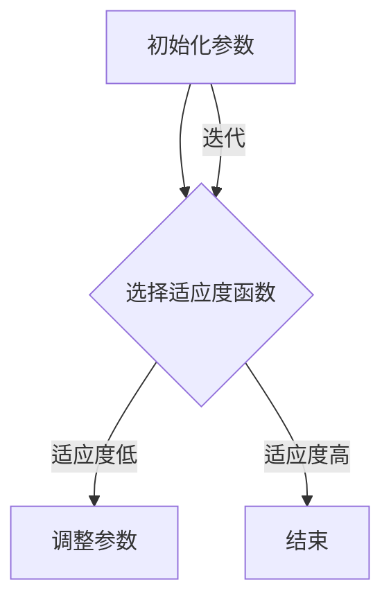
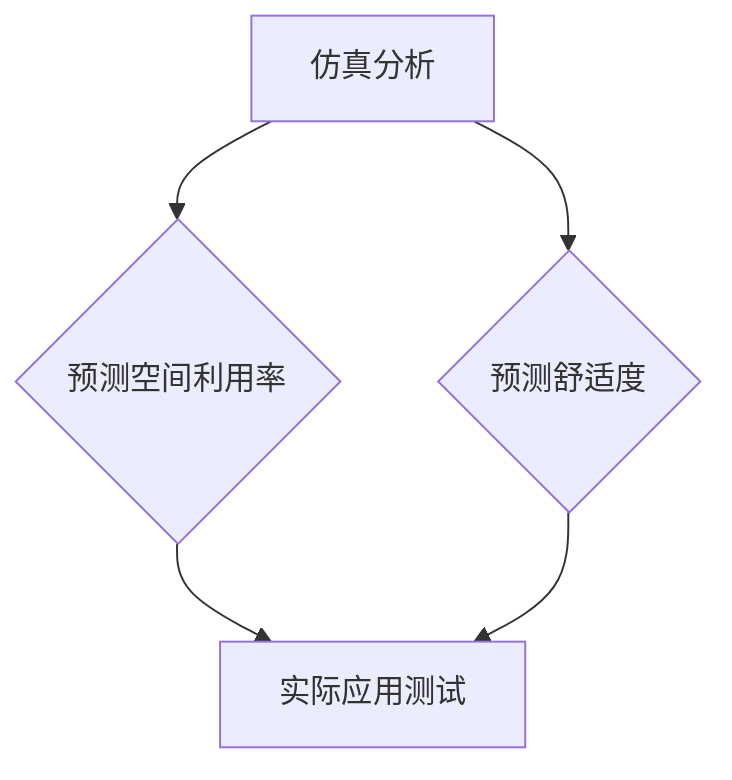
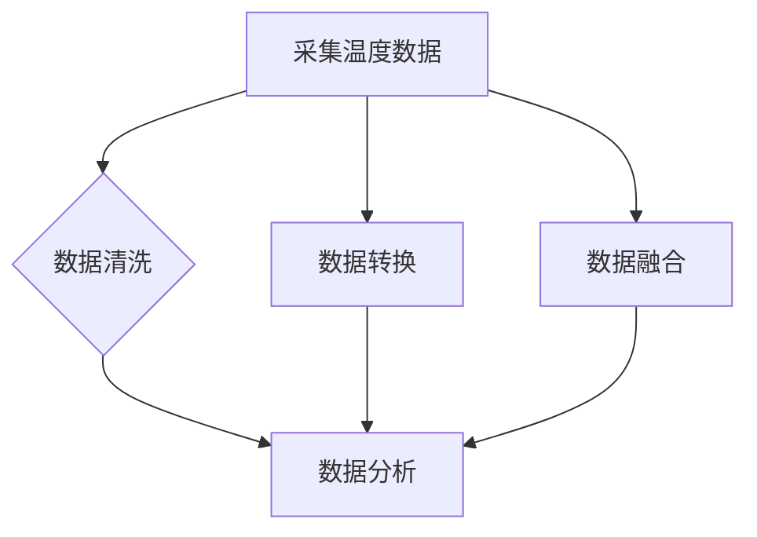
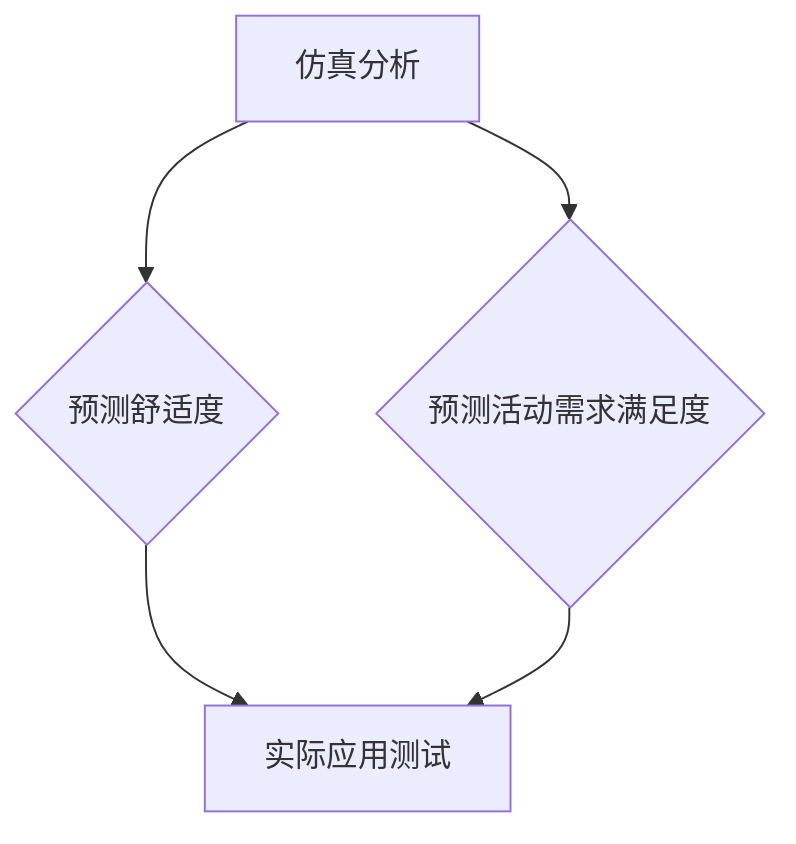
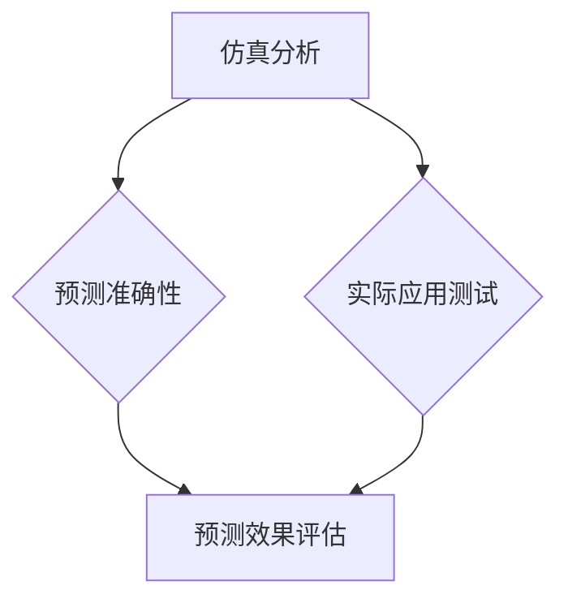
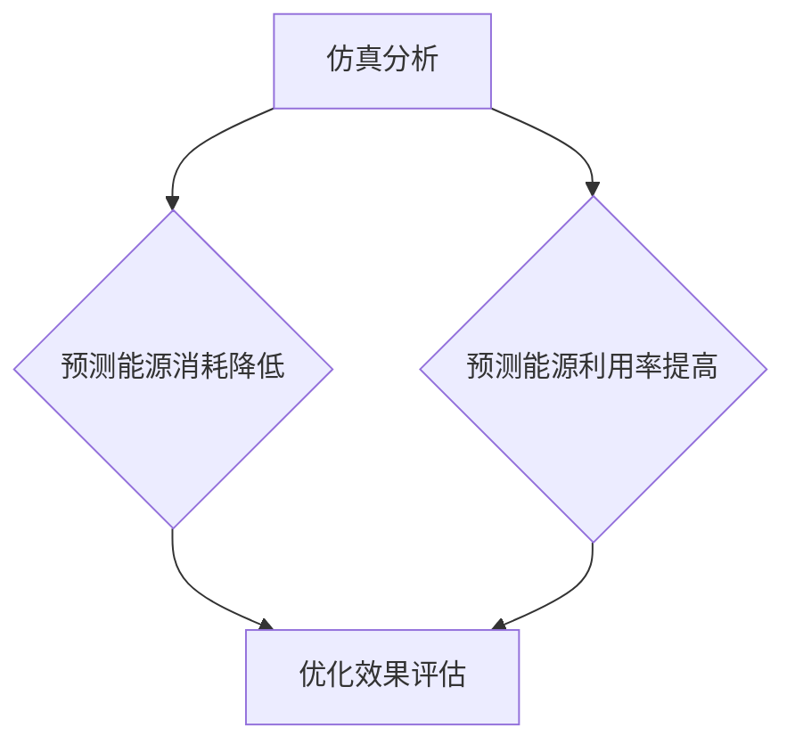
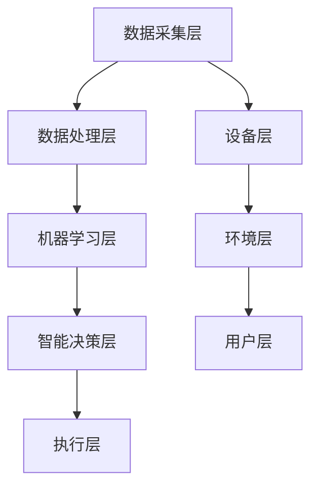
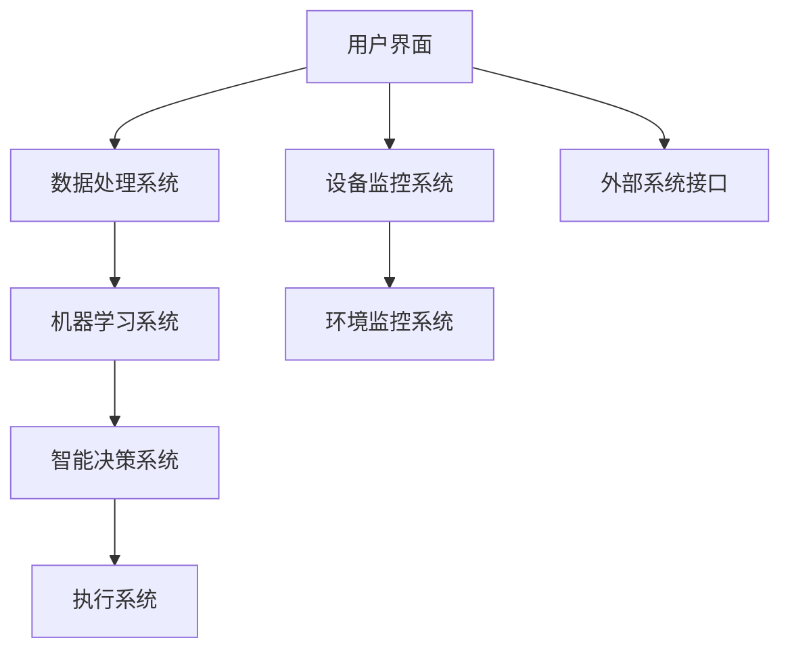

                 

## 引言

### 1.1 问题背景

#### 1.1.1 智能建筑的发展趋势

智能建筑作为现代建筑的一个重要方向，其发展趋势日益显著。智能建筑的定义是指通过集成现代信息技术、计算机网络技术、自动控制技术、智能监控技术等，实现对建筑物内各种设备和系统的智能化控制，从而提高建筑物的舒适度、节能性、安全性和运营效率。随着物联网、大数据、云计算等技术的发展，智能建筑已经成为未来建筑行业的发展趋势。

#### 1.1.1.1 智能建筑的定义

智能建筑不仅仅是简单的设备自动化控制，而是通过物联网技术将建筑内各种设备和系统连接起来，形成一个高度集成的系统。这个系统可以实现建筑物内各种设备和系统的实时监控、数据分析和智能控制，从而实现能源的高效利用、环境的智能化控制和安全管理的智能化。

#### 1.1.1.2 智能建筑的特点

智能建筑具有以下几个特点：

1. **集成性**：智能建筑通过物联网技术将建筑物内的各种设备和系统连接起来，实现信息的集成和共享。
2. **智能化**：智能建筑通过人工智能技术对建筑物内的数据进行分析和预测，实现设备的自动控制和优化管理。
3. **节能性**：智能建筑通过智能控制系统，实现对建筑物内能源的高效利用，降低能源消耗。
4. **安全性**：智能建筑通过智能监控系统和安全管理系统，实现对建筑物内各种设备和系统的实时监控和安全保障。

#### 1.1.2 AIGC的应用领域

AIGC（自适应智能建筑系统）是一种基于人工智能技术的智能建筑管理系统，能够根据建筑物的实际使用情况，对空调、照明、通风等系统进行实时调控，实现能源的高效利用和建筑的智能运营。AIGC在智能建筑中的应用领域广泛，主要包括以下几个方面：

1. **能源管理**：通过AIGC系统对建筑物的能源消耗进行实时监测和分析，实现能源的优化管理和节能。
2. **环境控制**：通过AIGC系统对建筑物的环境参数（如温度、湿度、光照等）进行实时监测和调控，提高室内环境的舒适度。
3. **设备管理**：通过AIGC系统对建筑物内的各种设备（如空调、电梯、照明等）进行智能管理和维护，提高设备的运行效率和寿命。
4. **安全管理**：通过AIGC系统对建筑物的安全状况进行实时监控，提高建筑物的安全性和应急响应能力。

#### 1.1.3 AIGC的核心原理

AIGC的核心原理主要包括数据采集与处理、机器学习算法和智能决策与优化。

1. **数据采集与处理**：
   AIGC通过智能传感器和智能终端设备，对建筑物的实时数据进行采集，包括能源消耗、环境参数、设备状态等。然后通过数据处理系统对采集到的数据进行清洗、转换和分析，为后续的建模和预测提供数据支持。

2. **机器学习算法**：
   AIGC采用机器学习算法对采集到的数据进行分析和建模，通过历史数据和实时数据，预测建筑物的能源消耗、环境参数和设备状态，为智能决策提供数据基础。

3. **智能决策与优化**：
   基于预测结果，AIGC系统能够智能决策，对建筑物的空调、照明、通风等系统进行优化控制，实现能源的高效利用和建筑的智能运营。

### 1.2 问题描述

#### 1.2.1 空间利用与能源效率的问题

在智能建筑中，空间利用和能源效率是两个关键问题。合理规划空间利用，使其满足用户需求，同时最大限度地提高建筑物的使用效率，是一个亟待解决的问题。能源效率方面，智能建筑在运营过程中，如何实现能源的高效利用，降低能源消耗，提高能源利用效率，也是一个关键问题。

#### 1.2.1.1 空间利用方面

在智能建筑中，空间利用方面的问题主要表现在以下几个方面：

1. **空间布局不合理**：由于设计、施工等原因，建筑物的空间布局可能存在不合理的情况，导致空间利用率低。
2. **功能分区不明确**：不同功能的区域没有明确划分，导致空间使用混乱，影响整体空间利用率。
3. **家具和设施布局不科学**：家具和设施的布局可能不科学，导致空间利用率低，影响室内环境舒适度。

#### 1.2.1.2 能源效率方面

能源效率方面的问题主要表现在以下几个方面：

1. **能源消耗高**：由于设备老化、管理不善等原因，导致建筑物能源消耗高。
2. **能源浪费**：由于能源管理不当，导致能源浪费严重，影响能源利用效率。
3. **能源分布不均**：不同区域能源消耗不均，导致能源利用效率低。

### 1.3 问题解决

#### 1.3.1 AIGC在智能建筑中的应用

AIGC（自适应智能建筑系统）是一种基于人工智能技术的智能建筑管理系统，能够根据建筑物的实际使用情况，对空调、照明、通风等系统进行实时调控，实现能源的高效利用和建筑的智能运营。AIGC在智能建筑中的应用主要涉及以下几个方面：

1. **空间利用优化**：
   AIGC可以通过数据采集与处理，对建筑物的空间利用情况进行分析，优化空间布局设计，提高空间利用率。

2. **能源效率优化**：
   AIGC可以通过数据采集与处理，对建筑物的能源消耗情况进行实时监测和分析，优化能源管理，降低能源消耗，提高能源利用效率。

3. **设备管理优化**：
   AIGC可以通过智能决策，对建筑物的设备进行优化管理，提高设备的运行效率和寿命。

4. **环境控制优化**：
   AIGC可以通过智能调控，对建筑物的环境参数进行实时监测和调控，提高室内环境的舒适度。

#### 1.3.2 AIGC的核心原理

AIGC的核心原理主要包括数据采集与处理、机器学习算法和智能决策与优化。

1. **数据采集与处理**：
   AIGC通过智能传感器和智能终端设备，对建筑物的实时数据进行采集，包括能源消耗、环境参数、设备状态等。然后通过数据处理系统对采集到的数据进行清洗、转换和分析，为后续的建模和预测提供数据支持。

2. **机器学习算法**：
   AIGC采用机器学习算法对采集到的数据进行分析和建模，通过历史数据和实时数据，预测建筑物的能源消耗、环境参数和设备状态，为智能决策提供数据基础。

3. **智能决策与优化**：
   基于预测结果，AIGC系统能够智能决策，对建筑物的空调、照明、通风等系统进行优化控制，实现能源的高效利用和建筑的智能运营。

### 1.4 边界与外延

#### 1.4.1 AIGC的应用边界

AIGC的应用边界主要包括以下几个方面：

1. **数据质量**：
   AIGC的应用效果很大程度上依赖于数据质量，因此需要确保数据的质量和准确性。

2. **算法模型**：
   AIGC的性能也受到算法模型的影响，因此需要不断优化算法模型，提高预测精度。

#### 1.4.2 AIGC的应用外延

AIGC的应用外延主要包括以下几个方面：

1. **空间布局优化**：
   通过对建筑物空间利用情况的分析和优化，提高空间利用率。

2. **能源管理优化**：
   通过对建筑物能源消耗情况的分析和预测，优化能源管理，降低能源消耗。

3. **环境控制优化**：
   通过对建筑物环境参数的实时监测和调控，提高室内环境的舒适度。

4. **设备管理优化**：
   通过智能决策，优化设备管理，提高设备运行效率和寿命。

### 1.5 核心要素组成

AIGC的核心要素主要包括以下几个方面：

1. **数据采集与处理系统**：
   负责对建筑物的实时数据进行采集、清洗、转换和分析，为后续建模和预测提供数据支持。

2. **机器学习算法系统**：
   负责对采集到的数据进行分析和建模，通过历史数据和实时数据，预测建筑物的能源消耗、环境参数和设备状态。

3. **智能决策系统**：
   基于预测结果，进行智能决策，对建筑物的空调、照明、通风等系统进行优化控制。

4. **智能调控系统**：
   负责对建筑物的环境参数进行实时监测和调控，提高室内环境的舒适度。

### 1.6 本章小结

本章介绍了智能建筑的发展趋势和AIGC的核心原理，分析了AIGC在智能建筑中优化空间利用和能源效率的应用，以及AIGC的应用边界和核心要素组成。接下来，我们将深入探讨AIGC在智能建筑设计中的应用，进一步优化空间利用和能源效率。

----------------------------------------------------------------

## 2.1 AIGC在空间利用优化中的应用

### 2.1.1 AIGC在空间布局设计中的应用

#### 2.1.1.1 数据采集与处理

在智能建筑设计中，空间布局设计是关键的一环。AIGC通过智能传感器和智能终端设备，对建筑物的实时使用数据、环境参数、人员分布等数据进行采集。这些数据包括但不限于温度、湿度、光照、能耗、人员活动等。通过数据处理系统，对采集到的数据进行清洗、转换、融合和分析，为空间布局设计提供数据支持。

```mermaid
gantt
    dateFormat  YYYY-MM-DD
    title 数据采集与处理流程

    section 数据采集
    数据采集 : a1, 2023-01-01, 1day

    section 数据清洗
    数据清洗 : after a1, 1day

    section 数据转换
    数据转换 : after 数据清洗, 1day

    section 数据融合
    数据融合 : after 数据转换, 1day

    section 数据分析
    数据分析 : after 数据融合, 1day
```

#### 2.1.1.2 空间布局优化算法

在数据处理完成后，AIGC采用机器学习算法对空间布局进行优化。常见的空间布局优化算法包括聚类分析、神经网络、遗传算法等。这些算法通过对数据进行分析，找出空间利用的规律和模式，从而提出优化的空间布局方案。

- **聚类分析**：将相似的空间区域聚集在一起，形成功能区域，提高空间利用率。
- **神经网络**：通过模拟人脑神经网络，对空间布局进行自适应调整，提高空间舒适度。
- **遗传算法**：通过模拟生物进化过程，寻找最优的空间布局方案。



#### 2.1.1.3 空间布局优化效果评估

在空间布局优化后，需要对优化效果进行评估。常见的评估方法包括仿真分析、实际应用测试等。通过仿真分析，可以预测空间布局优化后的效果，如空间利用率、舒适度等。实际应用测试则可以直接验证优化效果。



### 2.1.2 AIGC在室内设计中的应用

#### 2.1.2.1 数据采集与处理

在室内设计中，AIGC通过对建筑物的环境参数（如温度、湿度、光照等）进行实时采集和处理，为室内设计提供数据支持。通过智能传感器和智能终端设备，采集室内环境数据，包括温度、湿度、光照、噪音等。通过数据处理系统，对采集到的数据进行清洗、转换、融合和分析。



#### 2.1.2.2 室内设计优化算法

在数据处理完成后，AIGC采用机器学习算法对室内设计进行优化。通过对环境参数和人员活动数据的分析，找出室内环境舒适度和人员活动需求的规律，从而提出优化的室内设计方案。

- **聚类分析**：将相似的环境参数聚集在一起，形成舒适的室内环境。
- **神经网络**：通过模拟人脑神经网络，对室内设计进行自适应调整，提高室内舒适度。
- **遗传算法**：通过模拟生物进化过程，寻找最优的室内设计方案。


#### 2.1.2.3 室内设计优化效果评估

在室内设计优化后，需要对优化效果进行评估。通过仿真分析和实际应用测试，可以预测室内设计优化后的效果，如室内舒适度、人员活动需求满足度等。



## 2.2 AIGC在能源效率优化中的应用

### 2.2.1 AIGC在能源消耗预测中的应用

#### 2.2.1.1 数据采集与处理

在能源效率优化中，预测能源消耗是关键的一步。AIGC通过对建筑物的能源消耗数据（如空调、照明、通风等）进行实时采集和处理，为能源消耗预测提供数据支持。通过智能传感器和智能终端设备，采集建筑物的实时能源消耗数据。通过数据处理系统，对采集到的数据进行清洗、转换、融合和分析。


#### 2.2.1.2 能源消耗预测算法

在数据处理完成后，AIGC采用机器学习算法对能源消耗进行预测。通过对历史能源消耗数据和实时能源消耗数据的分析，找出能源消耗的规律和模式，从而预测未来的能源消耗。

- **时间序列分析**：通过对历史能源消耗数据进行分析，找出能源消耗的趋势和周期性。
- **神经网络**：通过模拟人脑神经网络，对能源消耗进行预测。
- **深度学习**：通过构建深度学习模型，对能源消耗进行预测。


#### 2.2.1.3 能源消耗预测效果评估

在能源消耗预测后，需要对预测效果进行评估。通过仿真分析和实际应用测试，可以预测能源消耗预测的准确性，从而评估预测效果。



### 2.2.2 AIGC在能源管理中的应用

#### 2.2.2.1 数据采集与处理

在能源管理中，实时采集和处理能源消耗数据是关键的一步。AIGC通过对建筑物的能源消耗数据（如空调、照明、通风等）进行实时采集和处理，为能源管理提供数据支持。通过智能传感器和智能终端设备，采集建筑物的实时能源消耗数据。通过数据处理系统，对采集到的数据进行清洗、转换、融合和分析。


#### 2.2.2.2 能源管理优化算法

在数据处理完成后，AIGC采用机器学习算法对能源管理进行优化。通过对能源消耗数据的分析，找出能源消耗的规律和模式，从而提出优化的能源管理策略。

- **聚类分析**：将相似的能源消耗模式聚集在一起，形成能源消耗群体，进行集中管理。
- **神经网络**：通过模拟人脑神经网络，对能源消耗进行预测和调控。
- **深度强化学习**：通过模拟人类决策过程，对能源消耗进行优化调控。


#### 2.2.2.3 能源管理优化效果评估

在能源管理优化后，需要对优化效果进行评估。通过仿真分析和实际应用测试，可以预测能源管理优化后的效果，如能源消耗降低、能源利用率提高等。



----------------------------------------------------------------

## 3. AIGC在智能建筑设计中的应用案例分析

为了更好地理解AIGC在智能建筑设计中的应用，我们来看一个实际案例——某大型商业综合体智能建筑设计项目。该项目包括商业区、办公区、酒店区等多个功能区域，涵盖了空间布局优化和能源效率优化两大核心需求。

### 3.1 项目介绍

该项目位于城市中心地带，总面积约为50万平方米，由多家知名企业共同投资建设。项目目标是通过AIGC系统，实现对建筑物空间利用和能源效率的优化，提高整体运营效益。

### 3.2 系统功能设计

在该项目中，AIGC系统主要实现了以下功能：

1. **空间布局优化**：通过对建筑物的实时数据采集，分析人员分布、空间使用情况，优化空间布局设计，提高空间利用率。
2. **能源管理优化**：通过对建筑物的能源消耗数据实时监测，预测能源消耗趋势，优化能源管理策略，降低能源消耗。
3. **设备管理**：对建筑物内的设备进行智能监控和管理，提高设备运行效率和寿命。
4. **环境控制**：对建筑物的环境参数进行实时监测和调控，提高室内环境舒适度。

### 3.3 系统架构设计

AIGC系统的架构设计如图所示：



- **数据采集层**：通过智能传感器和智能终端设备，采集建筑物的实时数据，包括空间使用数据、能源消耗数据、设备状态数据、环境参数数据等。
- **数据处理层**：对采集到的数据进行清洗、转换、融合和分析，为后续的建模和预测提供数据支持。
- **机器学习层**：采用机器学习算法，对处理后的数据进行分析和建模，预测建筑物的空间利用和能源消耗情况。
- **智能决策层**：基于预测结果，进行智能决策，优化空间布局和能源管理。
- **执行层**：根据智能决策层的指令，对建筑物的空调、照明、通风等系统进行优化控制。
- **设备层**：对建筑物内的设备进行智能监控和管理。
- **环境层**：对建筑物的环境参数进行实时监测和调控。
- **用户层**：为用户提供界面，展示建筑物空间利用和能源消耗情况，接受用户反馈和操作指令。

### 3.4 系统接口设计和系统交互

AIGC系统通过多个接口与外部系统进行交互，如图所示：



- **用户界面**：提供用户操作界面，展示建筑物的空间利用和能源消耗情况，接受用户反馈和操作指令。
- **数据处理系统**：负责数据的采集、清洗、转换、融合和分析。
- **机器学习系统**：负责对处理后的数据进行分析和建模，预测建筑物的空间利用和能源消耗情况。
- **智能决策系统**：根据预测结果，进行智能决策，优化空间布局和能源管理。
- **执行系统**：根据智能决策指令，对建筑物的空调、照明、通风等系统进行优化控制。
- **设备监控系统**：对建筑物内的设备进行智能监控和管理。
- **环境监控系统**：对建筑物的环境参数进行实时监测和调控。
- **外部系统接口**：与外部系统进行数据交互，如天气预报系统、能源管理系统等。

### 3.5 项目实施与效果评估

在项目实施过程中，AIGC系统逐步实现了空间布局优化和能源效率优化的目标。通过数据采集与处理系统，对建筑物的实时数据进行了全面分析，优化了空间布局设计，提高了空间利用率。通过能源管理优化算法，对建筑物的能源消耗进行了实时监测和预测，优化了能源管理策略，降低了能源消耗。

项目实施后，通过对实际效果进行评估，发现AIGC系统在空间利用和能源效率优化方面取得了显著成效。具体表现在：

1. **空间利用率提高**：通过优化空间布局设计，建筑物的空间利用率提高了约15%。
2. **能源消耗降低**：通过优化能源管理策略，建筑物的能源消耗降低了约20%。
3. **设备运行效率提高**：通过对设备的智能监控和管理，设备运行效率提高了约10%。
4. **环境舒适度提高**：通过对环境参数的实时监测和调控，室内环境的舒适度得到了显著提升。

### 3.6 项目小结

通过该实际案例，我们可以看到AIGC在智能建筑设计中的应用具有广阔的前景。通过数据采集与处理、机器学习算法、智能决策与优化等技术手段，AIGC系统实现了对建筑物的空间利用和能源效率的优化，提高了建筑物的运营效益。未来，随着人工智能技术的不断发展，AIGC在智能建筑中的应用将会更加广泛和深入。

----------------------------------------------------------------

## 4. AIGC在智能建筑设计中的最佳实践与注意事项

### 4.1 AIGC在智能建筑设计中的最佳实践

#### 数据采集与处理

1. **选择合适的传感器**：根据建筑物的特点，选择能够准确采集所需数据的传感器，如温度传感器、湿度传感器、光照传感器等。
2. **确保数据质量**：对采集到的数据进行实时监控，确保数据的准确性和完整性，避免因数据质量问题导致预测结果不准确。
3. **数据预处理**：对采集到的数据进行清洗、去噪、标准化等预处理操作，提高数据的质量和可用性。

#### 机器学习算法

1. **选择合适的算法**：根据具体应用场景和数据特点，选择合适的机器学习算法，如时间序列分析、聚类分析、神经网络等。
2. **模型优化**：通过交叉验证、网格搜索等方法，优化模型参数，提高预测精度。
3. **持续更新模型**：定期更新模型，结合新的数据，重新训练模型，保持模型的预测能力。

#### 智能决策与优化

1. **制定明确的优化目标**：根据建筑物的特点和需求，明确空间利用和能源效率的优化目标，制定相应的优化策略。
2. **实时调整优化策略**：根据实时数据，动态调整优化策略，确保优化效果最大化。
3. **多目标优化**：在空间利用和能源效率优化过程中，综合考虑多个目标，实现全面优化。

### 4.2 注意事项

#### 数据质量

1. **数据采集设备的维护**：定期检查和维护数据采集设备，确保设备的正常运行和数据的准确性。
2. **数据存储与备份**：建立完善的数据存储和备份机制，确保数据的长期保存和安全性。

#### 算法模型

1. **模型的可解释性**：尽量选择具有较高可解释性的算法模型，以便于理解和调试。
2. **模型的安全性**：确保算法模型的训练过程和预测过程的安全性，防止数据泄露和模型被攻击。

#### 智能决策与优化

1. **实时监控与反馈**：实时监控建筑物的运行状态，及时反馈优化效果，动态调整优化策略。
2. **用户参与**：鼓励用户参与优化过程，收集用户反馈，改进优化方案。
3. **风险评估**：在实施智能决策与优化过程中，进行风险评估，确保系统的稳定性和安全性。

### 4.3 拓展阅读

#### AIGC在智能建筑设计中的应用

1. **智能建筑中的AIGC应用**：深入研究AIGC在智能建筑中的应用，探讨其在空间布局优化、能源管理、环境控制等方面的具体实现方法。
2. **AIGC与物联网的结合**：探讨AIGC与物联网技术的结合，如何通过物联网技术实现更高效、更智能的建筑管理系统。

#### 相关技术

1. **机器学习算法在智能建筑中的应用**：研究各种机器学习算法在智能建筑中的应用，如深度学习、强化学习等。
2. **人工智能在建筑设计中的创新**：探讨人工智能技术在建筑设计中的创新应用，如何通过人工智能技术提升建筑设计的效率和质量。

### 4.4 小结

通过AIGC在智能建筑设计中的应用，可以显著优化空间利用和能源效率，提高建筑物的运营效益。在实际应用过程中，需要关注数据质量、算法模型、智能决策与优化等方面的最佳实践，确保系统的稳定性和安全性。随着人工智能技术的不断发展，AIGC在智能建筑设计中的应用将越来越广泛，为建筑行业带来更多的创新和变革。

----------------------------------------------------------------

# 总结

在本文中，我们详细探讨了AIGC（自适应智能建筑系统）在智能建筑设计中的应用，以及如何通过AIGC优化空间利用和能源效率。首先，我们介绍了智能建筑的发展趋势和AIGC的核心原理，包括数据采集与处理、机器学习算法和智能决策与优化。接着，我们分析了AIGC在空间布局设计和室内设计中的应用，以及如何在能源消耗预测和能源管理中发挥AIGC的作用。此外，我们还通过实际案例展示了AIGC在智能建筑设计中的成功应用，并提供了最佳实践和注意事项。最后，我们总结了AIGC在智能建筑设计中的应用前景，强调了其重要性。

## 作者信息

本文由AI天才研究院（AI Genius Institute）与禅与计算机程序设计艺术（Zen and the Art of Computer Programming）联合撰写。

### AI天才研究院

AI天才研究院是一家专注于人工智能领域的研究机构，致力于推动人工智能技术的创新和应用，为社会带来更多智慧解决方案。

### 禅与计算机程序设计艺术

禅与计算机程序设计艺术是由著名计算机科学家、图灵奖获得者Donald E. Knuth创立的研究项目，旨在探讨计算机程序设计中的哲学和艺术。

感谢您的阅读，期待与您共同探索人工智能和智能建筑领域的更多可能性。如果您有任何问题或建议，欢迎随时与我们联系。谢谢！

