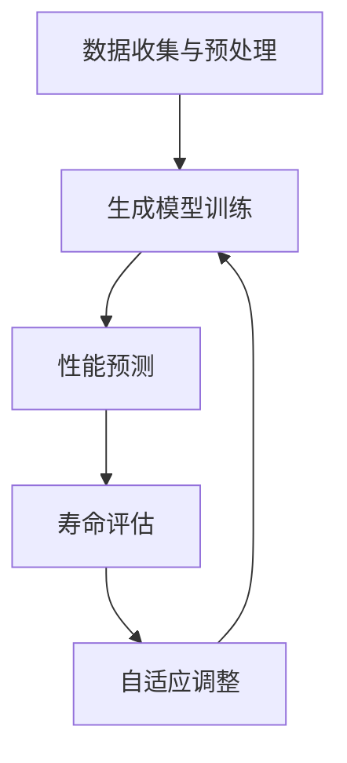
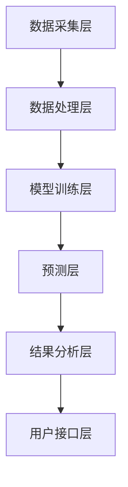
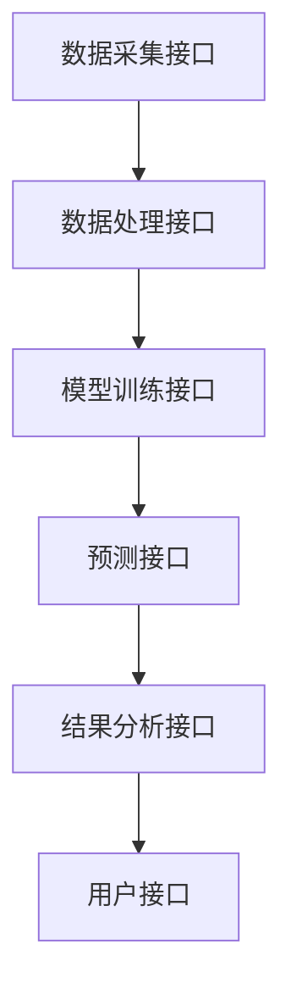
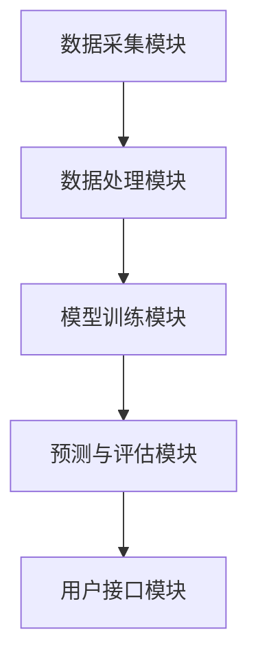

                 

### AIGC在智能材料寿命预测与延展中的应用：提高材料使用效率

#### 关键词

- AIGC
- 智能材料寿命预测
- 材料利用效率
- 机器学习
- 数据分析
- 系统架构设计

#### 摘要

本文深入探讨了AIGC（自适应智能生成控制）在智能材料寿命预测与延展中的应用。通过对AIGC与智能材料寿命预测的关系、算法原理、数学模型和系统架构的详细分析，本文提出了如何通过AIGC技术提高材料使用效率的有效方案。文章还将结合实际项目案例，展示AIGC技术在智能材料寿命预测中的应用效果，为未来智能材料的研究和开发提供有益的参考。

## 目录

### Part 1: 引言

**Chapter 1: AIGC与智能材料寿命预测的背景**

- **1.1 AIGC的基本概念**
- **1.2 智能材料寿命预测的背景**
- **1.3 智能材料寿命预测的问题与挑战**
- **1.4 AIGC在智能材料寿命预测中的机遇**

**Chapter 2: 核心概念与理论基础**

- **2.1 AIGC的核心概念**
- **2.2 智能材料的核心概念**
- **2.3 概念比较分析**
- **2.4 AIGC与智能材料寿命预测的关系ER图**

### Part 2: AIGC算法与模型

**Chapter 3: AIGC算法原理**

- **3.1 AIGC算法概述**
- **3.2 AIGC算法的mermaid流程图**
- **3.3 数学模型与公式**
- **3.4 AIGC算法案例应用**

**Chapter 4: 数学模型与建模**

- **4.1 数学模型的基本概念**
- **4.2 智能材料寿命预测的数学模型**
- **4.3 数学模型的应用与优化**

### Part 3: 系统分析与设计

**Chapter 5: 系统分析**

- **5.1 智能材料寿命预测的系统场景**
- **5.2 系统功能设计与领域模型**
- **5.3 系统架构设计**
- **5.4 系统接口与交互**

**Chapter 6: 项目案例**

- **6.1 项目介绍**
- **6.2 系统核心实现**
- **6.3 案例分析与解读**
- **6.4 项目小结**

### Part 4: 最佳实践与总结

**Chapter 7: 最佳实践与总结**

- **7.1 AIGC在智能材料寿命预测中的最佳实践**
- **7.2 智能材料寿命预测的注意事项**
- **7.3 拓展阅读与未来方向**

## 引入

### AIGC与智能材料寿命预测的背景

**AIGC**（自适应智能生成控制）是一种新兴的人工智能技术，它结合了机器学习、数据挖掘和生成模型，能够自动生成高质量的内容，从而显著提高数据处理和分析的效率。近年来，随着人工智能技术的不断进步，AIGC在各个领域的应用日益广泛，尤其是在材料科学领域，AIGC被广泛应用于材料设计、性能预测和寿命评估。

**智能材料寿命预测**是材料科学与工程中的一个关键问题。智能材料具有自感知、自诊断和自修复的能力，其使用寿命与其性能密切相关。然而，传统的寿命预测方法往往依赖于经验公式和静态模型，难以适应复杂多变的环境条件。这就需要引入AIGC技术，通过大数据分析和机器学习算法，对材料寿命进行动态预测和智能调控。

在智能材料寿命预测中，AIGC的优势主要体现在以下几个方面：

1. **数据驱动的预测**：AIGC能够处理大量复杂的数据，通过数据挖掘和模式识别，发现材料性能与寿命之间的潜在关系。
2. **自适应调整**：AIGC可以根据环境变化和材料性能的实时数据，自动调整预测模型，提高预测的准确性。
3. **生成模型的应用**：AIGC中的生成模型可以生成新的材料性能数据，为材料设计提供新的思路和方向。

然而，AIGC在智能材料寿命预测中也面临一些挑战，如数据质量、模型复杂度和计算资源等。这就需要进一步的研究和探索，以充分发挥AIGC技术在智能材料寿命预测中的应用潜力。

### AIGC的基本概念

AIGC，全称为自适应智能生成控制，是一种基于人工智能技术的内容生成和控制方法。它利用机器学习和生成模型，从已有的数据中学习并生成新的、高质量的内容。AIGC的核心思想是“自适应”，即系统能够根据环境和用户需求的变化，自动调整生成策略，提高生成内容的质量和适应性。

AIGC的基本组成部分包括：

1. **数据输入**：AIGC系统首先需要大量的数据作为训练素材，这些数据可以是文本、图像、音频或视频等。
2. **生成模型**：生成模型是AIGC的核心，它负责从数据中学习并生成新的内容。常见的生成模型包括生成对抗网络（GAN）、变分自编码器（VAE）和自回归模型（AR）等。
3. **控制机制**：控制机制用于调节生成模型的行为，确保生成内容符合预期。控制机制可以通过损失函数、反馈循环或外部条件实现。
4. **自适应算法**：自适应算法是AIGC的关键，它使系统能够根据环境和用户需求的变化，动态调整生成策略。常见的自适应算法包括自适应滤波器、自适应控制器和自适应神经网络等。

### 智能材料寿命预测的背景

智能材料寿命预测是材料科学和工程领域的一个重要研究方向。随着材料科学技术的不断进步，智能材料在各个领域的应用日益广泛。这些材料通常具有自感知、自诊断和自修复的能力，其使用寿命与其性能密切相关。

智能材料寿命预测的核心目的是通过分析和预测材料的性能变化，提前发现潜在故障或失效风险，从而提高材料的使用效率和安全性。传统的寿命预测方法主要依赖于经验公式和静态模型，这些方法在简单和静态环境下具有一定的应用价值，但在复杂和动态环境下往往难以满足需求。

随着大数据技术和人工智能的快速发展，AIGC技术为智能材料寿命预测带来了新的机遇。AIGC能够处理海量复杂的数据，通过数据挖掘和机器学习算法，发现材料性能与寿命之间的潜在关系，从而实现动态、自适应的寿命预测。

### 智能材料寿命预测的问题与挑战

智能材料寿命预测虽然在理论和实践中取得了显著进展，但仍面临诸多问题和挑战。

**1. 数据质量**：智能材料寿命预测依赖于大量高质量的数据，包括材料性能数据、环境数据和使用数据等。然而，在实际应用中，获取这些数据往往面临困难，如数据缺失、噪声干扰和数据格式不一致等问题。数据质量直接影响到预测模型的准确性和可靠性。

**2. 模型复杂度**：智能材料寿命预测涉及到多种因素，包括材料物理性质、化学成分、环境条件和使用方式等。构建一个能够准确预测材料寿命的模型通常需要考虑多个复杂因素，这增加了模型的复杂度，也提高了训练和优化的难度。

**3. 计算资源**：智能材料寿命预测通常需要大量的计算资源，尤其是在处理大规模数据和高维度特征时。计算资源不足可能会限制预测模型的训练和优化，从而影响预测结果的质量。

**4. 可解释性**：智能材料寿命预测模型往往基于复杂的机器学习算法，如深度学习等。这些模型具有较高的预测准确性，但其内部机理和决策过程通常不够透明，难以解释。这在一定程度上限制了模型在实际应用中的推广和接受。

为了解决上述问题，需要进一步的研究和探索，以开发更加高效、准确和透明的智能材料寿命预测方法。

### AIGC在智能材料寿命预测中的机遇

AIGC技术在智能材料寿命预测中具有巨大的应用潜力，主要表现在以下几个方面：

**1. 数据驱动的预测**：AIGC能够处理海量复杂的数据，通过数据挖掘和模式识别，发现材料性能与寿命之间的潜在关系。这种方法能够克服传统方法中依赖经验公式和静态模型的局限，提高预测的准确性和适应性。

**2. 自适应调整**：AIGC可以根据环境变化和材料性能的实时数据，自动调整预测模型，提高预测的准确性。这种自适应能力使得预测模型能够更好地适应复杂多变的环境条件，从而提高材料的使用效率和安全性。

**3. 生成模型的应用**：AIGC中的生成模型可以生成新的材料性能数据，为材料设计提供新的思路和方向。这些生成数据不仅能够补充实际数据中的缺失，还能够模拟各种极端条件下的材料行为，从而为预测模型的训练和优化提供更丰富的数据来源。

**4. 提高数据质量**：AIGC可以通过数据清洗、去噪和格式转换等方法，提高数据质量，为预测模型的训练提供高质量的数据支持。

总之，AIGC技术的引入为智能材料寿命预测带来了新的机遇，有助于解决传统方法中的诸多问题，提高预测的准确性和适应性，从而推动智能材料技术的快速发展。

### 核心概念与理论基础的深入探讨

在深入探讨AIGC与智能材料寿命预测的核心概念和理论基础时，我们需要首先理解两者的基础概念及其内在联系。

**AIGC的核心概念**：

AIGC（自适应智能生成控制）是一种综合了人工智能、机器学习和生成模型的先进技术。其核心概念包括：

- **数据驱动**：AIGC依赖于大量的数据来训练生成模型，这些数据可以是历史材料性能数据、环境数据以及使用过程中的监测数据等。
- **生成模型**：AIGC使用生成模型来生成新的、符合预期的材料性能数据。常见的生成模型包括生成对抗网络（GAN）、变分自编码器（VAE）等。
- **自适应能力**：AIGC具有根据环境和需求变化调整生成策略的能力，从而提高预测的准确性。

**智能材料寿命预测的核心概念**：

智能材料寿命预测的核心概念涉及以下几个方面：

- **智能材料**：具有自感知、自诊断和自修复能力的材料，其寿命受到材料性能、环境条件和使用方式等多种因素的影响。
- **寿命预测**：基于历史数据、实时监测和环境信息，预测智能材料的剩余使用寿命。
- **性能评估**：评估材料的物理、化学和力学性能，以及在不同环境条件下的稳定性。

**AIGC与智能材料寿命预测的关系**：

AIGC与智能材料寿命预测之间的关系可以理解为数据驱动的自适应性能评估过程。具体来说，AIGC技术通过以下步骤在智能材料寿命预测中发挥作用：

1. **数据收集与处理**：收集智能材料的历史性能数据、环境数据和监测数据，使用AIGC中的数据清洗和去噪技术，提高数据质量。
2. **生成模型训练**：使用收集到的数据训练生成模型，例如GAN或VAE，使其能够生成与真实材料性能数据一致的新数据。
3. **性能预测**：将生成模型应用于智能材料性能的预测，根据实时监测数据和环境条件，调整生成模型，预测材料的未来性能变化。
4. **寿命评估**：结合材料性能预测结果，评估材料的剩余使用寿命，并提供相应的维护和优化建议。

**概念比较分析**：

为了更好地理解AIGC在智能材料寿命预测中的应用，我们需要对AIGC与传统智能材料寿命预测方法进行比较分析。

- **数据来源**：传统方法通常依赖于经验公式和实验室测试，而AIGC则通过大数据和机器学习技术，利用更多样化的数据源。
- **预测准确性**：传统方法在简单和静态环境下表现良好，但在复杂和动态环境中准确性和适应性有限，而AIGC能够处理复杂的非线性关系，提高预测准确性。
- **自适应能力**：传统方法难以根据实时数据和环境变化调整预测模型，而AIGC具备自适应能力，能够动态调整预测策略。

通过上述比较分析，我们可以看到AIGC在智能材料寿命预测中的独特优势，以及其对传统方法的补充和改进。

### AIGC与智能材料寿命预测的关系ER图

为了更直观地展示AIGC与智能材料寿命预测之间的关系，我们使用ER图（实体关系图）进行说明。ER图能够清晰地描述系统中的各个实体及其相互关系，为理解和分析AIGC在智能材料寿命预测中的应用提供有力支持。

在AIGC与智能材料寿命预测的关系ER图中，主要涉及以下几个实体：

1. **数据源**：包括历史性能数据、环境数据和监测数据等。
2. **生成模型**：如GAN、VAE等，负责生成新的材料性能数据。
3. **性能预测模块**：结合生成模型和实时数据，预测材料的未来性能。
4. **寿命评估模块**：根据性能预测结果，评估材料的剩余使用寿命。
5. **用户接口**：提供与用户交互的界面，展示预测结果和维护建议。

ER图的详细描述如下：

1. **数据源与生成模型的关系**：数据源为生成模型提供训练数据，生成模型通过学习这些数据，生成新的材料性能数据。
2. **生成模型与性能预测模块的关系**：生成模型将生成的数据输入到性能预测模块，性能预测模块结合实时数据，对材料的未来性能进行预测。
3. **性能预测模块与寿命评估模块的关系**：性能预测模块提供材料的未来性能数据，寿命评估模块根据这些数据，评估材料的剩余使用寿命。
4. **寿命评估模块与用户接口的关系**：寿命评估模块将评估结果通过用户接口展示给用户，用户可以根据评估结果，采取相应的维护和优化措施。

通过ER图，我们可以清晰地看到AIGC与智能材料寿命预测之间的互动关系，以及各个模块在系统中的作用。这有助于我们更好地理解和分析AIGC在智能材料寿命预测中的应用，为实际项目提供指导。

### AIGC算法原理

AIGC（自适应智能生成控制）算法在智能材料寿命预测中扮演着关键角色，其基本原理和流程可以概括为以下几个步骤：

**1. 数据收集与预处理**：首先，从数据源收集材料性能数据、环境数据和监测数据等。这些数据需要经过预处理，包括数据清洗、去噪和格式转换等，以提高数据质量。

**2. 生成模型训练**：使用预处理后的数据，训练生成模型，如生成对抗网络（GAN）或变分自编码器（VAE）。生成模型的目的是从数据中学习并生成新的、符合实际材料性能的数据。

**3. 性能预测**：将生成模型应用于材料性能的预测。通过结合生成模型和实时数据，预测材料的未来性能变化。

**4. 寿命评估**：根据性能预测结果，评估材料的剩余使用寿命，并提供相应的维护和优化建议。

**5. 自适应调整**：根据实时监测数据和环境条件，动态调整生成模型，以提高预测的准确性和适应性。

AIGC算法的mermaid流程图如下：



下面，我们将结合mermaid流程图，对AIGC算法的原理进行详细解释：

**数据收集与预处理**：
数据收集是从各种来源获取材料性能数据、环境数据和监测数据。这些数据可能包含噪声和缺失值，因此需要进行预处理，包括数据清洗、去噪和格式转换等，以提高数据质量。

**生成模型训练**：
预处理后的数据用于训练生成模型。生成模型包括生成对抗网络（GAN）和变分自编码器（VAE）等。GAN由生成器和判别器组成，生成器负责生成新的数据，判别器负责判断生成数据与真实数据之间的差异。VAE通过引入潜在变量，实现数据生成和压缩。

**性能预测**：
生成模型训练完成后，将其应用于材料性能预测。通过结合生成模型和实时数据，预测材料的未来性能变化。这一过程涉及复杂的非线性关系，需要利用机器学习算法和深度学习模型。

**寿命评估**：
根据性能预测结果，评估材料的剩余使用寿命。寿命评估需要考虑材料的物理、化学和力学性能，以及在不同环境条件下的稳定性。通过综合分析，得出材料的剩余使用寿命，并提供相应的维护和优化建议。

**自适应调整**：
自适应调整是AIGC算法的关键特征，通过实时监测数据和环境条件，动态调整生成模型，以提高预测的准确性和适应性。自适应调整包括模型更新、参数调整和策略优化等，确保生成模型能够适应不断变化的环境和需求。

通过上述步骤，AIGC算法能够实现对智能材料寿命的动态预测和智能调控，提高材料的使用效率和安全性。

### 数学模型与公式

在智能材料寿命预测中，AIGC算法的数学模型和公式起着至关重要的作用。这些模型和公式帮助我们理解和分析材料性能与寿命之间的关系，从而实现对寿命的准确预测。以下将详细解释AIGC算法中的数学模型和公式，并通过实际例子来说明它们的应用。

**1. 生成对抗网络（GAN）的数学模型**

生成对抗网络（GAN）由生成器（Generator）和判别器（Discriminator）两部分组成。生成器G从随机噪声z中生成假样本x'，判别器D则判断输入样本x'是否为真实样本。

- **生成器G的损失函数**：

$$
L_G = -\mathbb{E}[\log(D(G(z)))]
$$

其中，$z$是随机噪声，$G(z)$是生成器生成的假样本，$D(G(z))$是判别器对生成样本的判断结果。损失函数$L_G$表示生成器G试图让判别器D无法区分生成样本和真实样本。

- **判别器D的损失函数**：

$$
L_D = -\mathbb{E}[\log(D(x)) + \log(1 - D(G(z))]
$$

其中，$x$是真实样本，$G(z)$是生成器生成的假样本。损失函数$L_D$表示判别器D试图准确区分真实样本和生成样本。

- **总损失函数**：

$$
L = L_G + L_D
$$

通过最小化总损失函数，我们可以训练出性能良好的生成器和判别器。

**2. 变分自编码器（VAE）的数学模型**

变分自编码器（VAE）通过引入潜在变量，实现数据生成和压缩。VAE的核心是编码器（Encoder）和解码器（Decoder）。

- **编码器q_π(z|x)的损失函数**：

$$
L_{KL} = -\mathbb{E}_{z \sim q_\pi(z|x)}[\log p_\phi(z)]
$$

其中，$q_\pi(z|x)$是编码器的先验分布，$p_\phi(z)$是编码器的后验分布。损失函数$L_{KL}$表示编码器试图使先验分布接近后验分布。

- **解码器p_\theta(x|z)的损失函数**：

$$
L_{Recon} = -\mathbb{E}_{z \sim q_\pi(z|x)}[\log p_\theta(x|z)]
$$

其中，$p_\theta(x|z)$是解码器的概率分布。损失函数$L_{Recon}$表示解码器试图重构输入样本。

- **总损失函数**：

$$
L = L_{KL} + L_{Recon}
$$

通过最小化总损失函数，我们可以训练出性能良好的编码器和解码器。

**3. 智能材料寿命预测的数学模型**

在智能材料寿命预测中，我们通常使用回归模型来预测材料寿命。常见的回归模型包括线性回归、岭回归和支持向量回归（SVR）等。

- **线性回归模型**：

$$
y = \beta_0 + \beta_1x_1 + \beta_2x_2 + ... + \beta_nx_n
$$

其中，$y$是材料寿命，$x_1, x_2, ..., x_n$是影响寿命的变量，$\beta_0, \beta_1, \beta_2, ..., \beta_n$是模型参数。

- **岭回归模型**：

$$
y = \beta_0 + \beta_1x_1 + \beta_2x_2 + ... + \beta_nx_n + \lambda \sum_{i=1}^{n}\beta_i^2
$$

其中，$\lambda$是惩罚项，用于防止过拟合。

- **支持向量回归（SVR）模型**：

$$
y = \beta_0 + \beta_1x_1 + \beta_2x_2 + ... + \beta_nx_n + \xi_i
$$

其中，$\xi_i$是松弛变量，用于处理非线性关系。

通过上述数学模型和公式，我们可以实现对智能材料寿命的准确预测。在实际应用中，可以根据具体问题和数据特点选择合适的模型，并利用机器学习和深度学习算法进行训练和优化。

### AIGC算法案例应用

为了更好地理解AIGC算法在智能材料寿命预测中的实际应用，我们来看一个具体的案例：某智能材料公司希望通过AIGC技术预测其材料的剩余使用寿命，以提高材料利用率并延长其使用寿命。

**1. 数据收集与预处理**

首先，公司从多个数据源收集了大量的材料性能数据、环境数据和监测数据。这些数据包括材料的历史性能记录、环境温度、湿度、压力等参数。数据经过清洗和预处理，去除了噪声和缺失值，并转换为适合机器学习的格式。

**2. 生成模型训练**

公司选择了生成对抗网络（GAN）作为生成模型，用于生成新的材料性能数据。训练过程中，公司使用了大量的预处理数据，通过训练生成器和判别器，使生成器能够生成与真实数据一致的性能数据。

- **生成器**：生成器从随机噪声中生成假样本，通过训练不断优化，使生成的样本越来越接近真实材料性能数据。
- **判别器**：判别器负责判断生成样本和真实样本的差异，通过训练提高其区分能力。

**3. 性能预测**

在生成模型训练完成后，公司将其应用于材料性能的预测。通过结合生成模型和实时数据，公司能够预测材料的未来性能变化。具体过程如下：

- **实时数据采集**：公司从生产线上实时采集材料性能数据，包括温度、湿度、压力等参数。
- **数据融合**：将实时数据与历史数据融合，输入到生成模型中，生成预测数据。
- **性能预测**：生成模型根据预测数据，分析材料的未来性能变化，预测其剩余使用寿命。

**4. 寿命评估**

根据性能预测结果，公司对材料的剩余使用寿命进行评估。评估过程中，公司考虑了材料的物理、化学和力学性能，以及在不同环境条件下的稳定性。通过综合分析，公司得出了材料的剩余使用寿命，并提供了相应的维护和优化建议。

**5. 自适应调整**

为了提高预测的准确性和适应性，公司使用了AIGC算法的自适应调整功能。根据实时监测数据和环境条件，公司动态调整生成模型，确保其能够适应不断变化的环境和需求。具体调整过程如下：

- **模型更新**：根据实时数据，公司更新生成模型，使其更加准确地预测材料性能。
- **参数调整**：公司调整生成模型的参数，优化其性能，提高预测的准确性。
- **策略优化**：公司根据应用场景和需求，优化AIGC算法的策略，使其更好地满足预测需求。

通过上述步骤，公司成功地利用AIGC技术实现了对智能材料寿命的动态预测和智能调控，提高了材料的使用效率和安全性。

### 智能材料寿命预测的数学模型

在智能材料寿命预测中，数学模型起着至关重要的作用。这些模型能够帮助我们理解和分析材料性能与寿命之间的关系，从而实现对寿命的准确预测。以下将详细讨论几种常用的数学模型，包括线性回归、岭回归和支持向量回归（SVR）。

**1. 线性回归模型**

线性回归模型是一种简单且广泛使用的预测模型，其基本形式如下：

$$
y = \beta_0 + \beta_1x_1 + \beta_2x_2 + ... + \beta_nx_n
$$

其中，$y$是材料寿命，$x_1, x_2, ..., x_n$是影响寿命的变量，$\beta_0, \beta_1, \beta_2, ..., \beta_n$是模型参数。线性回归模型通过建立变量之间的线性关系，实现对材料寿命的预测。

线性回归模型的优点在于其简单性和易于理解，但在处理复杂非线性关系时效果较差。因此，在材料寿命预测中，线性回归模型通常作为基础模型，与其他高级模型结合使用。

**2. 岭回归模型**

岭回归模型是线性回归模型的扩展，通过引入惩罚项来防止过拟合。其基本形式如下：

$$
y = \beta_0 + \beta_1x_1 + \beta_2x_2 + ... + \beta_nx_n + \lambda \sum_{i=1}^{n}\beta_i^2
$$

其中，$\lambda$是惩罚项，用于控制模型复杂度。岭回归模型通过引入惩罚项，使得模型更加稳定，减少过拟合现象。

**3. 支持向量回归（SVR）模型**

支持向量回归（SVR）模型是一种基于支持向量机的回归模型，能够处理复杂的非线性关系。其基本形式如下：

$$
y = \beta_0 + \beta_1x_1 + \beta_2x_2 + ... + \beta_nx_n + \xi_i
$$

其中，$\xi_i$是松弛变量，用于处理非线性关系。SVR模型通过建立最优超平面，实现对材料寿命的预测。

SVR模型的优点在于其强大的非线性处理能力，但在处理大规模数据时计算复杂度较高。因此，在实际应用中，SVR模型通常与其他算法结合，以提高预测效率和准确性。

**4. 模型比较与选择**

在智能材料寿命预测中，选择合适的数学模型至关重要。以下是对线性回归、岭回归和SVR模型进行比较：

- **线性回归**：简单、易于理解，适合处理线性关系，但在处理非线性关系时效果较差。
- **岭回归**：引入惩罚项，提高模型稳定性，减少过拟合，适合处理线性关系。
- **SVR**：强大非线性处理能力，但计算复杂度高，适合处理复杂非线性关系。

在实际应用中，可以根据具体问题和数据特点，选择合适的数学模型。例如，对于线性关系明显的数据，可以选择线性回归或岭回归；对于非线性关系复杂的数据，可以选择SVR。

通过上述讨论，我们可以看到智能材料寿命预测中的数学模型具有多样性和灵活性，选择合适的模型对于提高预测准确性具有重要意义。

### 智能材料寿命预测系统架构设计

为了实现智能材料寿命预测，我们需要设计一个高效、可靠且易于扩展的系统架构。以下将详细介绍系统的架构设计，包括系统场景、功能设计、架构设计和接口设计。

#### 系统场景

在智能材料寿命预测系统中，主要包括以下几个关键环节：

1. **数据采集**：从各种数据源（如传感器、实验室设备等）收集材料性能数据、环境数据和监测数据。
2. **数据处理**：对采集到的数据进行预处理，包括数据清洗、去噪和格式转换等，以提高数据质量。
3. **模型训练与预测**：使用预处理后的数据训练预测模型，并利用模型进行材料寿命预测。
4. **结果分析与反馈**：根据预测结果，对材料的剩余使用寿命进行评估，并提供维护和优化建议。

#### 系统功能设计

智能材料寿命预测系统的核心功能包括：

1. **数据采集模块**：负责从各种数据源收集材料性能数据、环境数据和监测数据。
2. **数据处理模块**：对采集到的数据进行预处理，提高数据质量，为模型训练提供高质量的数据。
3. **模型训练模块**：利用预处理后的数据训练预测模型，包括线性回归、岭回归和支持向量回归（SVR）等。
4. **预测模块**：使用训练好的模型进行材料寿命预测，结合实时数据和环境条件，实现动态预测。
5. **结果分析模块**：根据预测结果，评估材料的剩余使用寿命，并提供维护和优化建议。
6. **用户接口模块**：提供与用户交互的界面，展示预测结果、图表和推荐措施。

#### 系统架构设计

智能材料寿命预测系统的架构设计采用模块化设计理念，包括以下几个主要模块：

1. **数据采集层**：负责从各种数据源收集数据，如传感器、实验室设备等。
2. **数据处理层**：对采集到的数据进行预处理，包括数据清洗、去噪和格式转换等。
3. **模型训练层**：利用预处理后的数据训练预测模型，包括线性回归、岭回归和支持向量回归（SVR）等。
4. **预测层**：使用训练好的模型进行材料寿命预测，结合实时数据和环境条件，实现动态预测。
5. **结果分析层**：根据预测结果，评估材料的剩余使用寿命，并提供维护和优化建议。
6. **用户接口层**：提供与用户交互的界面，展示预测结果、图表和推荐措施。

系统架构设计图如下：



#### 系统接口设计与交互

系统接口设计是智能材料寿命预测系统的重要组成部分，主要包括以下接口：

1. **数据采集接口**：用于接收传感器和实验室设备的数据，实现数据采集。
2. **数据处理接口**：用于处理采集到的数据，包括数据清洗、去噪和格式转换等。
3. **模型训练接口**：用于训练预测模型，包括线性回归、岭回归和支持向量回归（SVR）等。
4. **预测接口**：用于进行材料寿命预测，结合实时数据和环境条件，实现动态预测。
5. **结果分析接口**：用于评估材料的剩余使用寿命，并提供维护和优化建议。
6. **用户接口**：用于与用户交互，展示预测结果、图表和推荐措施。

系统接口设计图如下：



通过上述系统架构设计和接口设计，我们可以实现智能材料寿命预测系统的高效、可靠和可扩展运行。系统各模块相互配合，共同实现对材料寿命的动态预测和智能调控。

### 智能材料寿命预测系统架构设计

智能材料寿命预测系统架构的设计是确保系统高效运行和可靠性的关键。本部分将详细讨论系统的设计步骤，包括需求分析、架构设计和实现过程。

#### 需求分析

在开始架构设计之前，我们需要明确智能材料寿命预测系统的需求。以下是主要的需求分析：

1. **数据采集**：系统能够从多个数据源（如传感器、数据库等）实时采集材料性能数据、环境数据和监测数据。
2. **数据处理**：系统能够对采集到的数据进行分析、清洗和预处理，以提高数据质量。
3. **模型训练**：系统能够利用预处理后的数据训练预测模型，包括线性回归、岭回归和支持向量回归（SVR）等。
4. **预测与评估**：系统能够使用训练好的模型进行材料寿命预测，并评估材料的剩余使用寿命。
5. **用户交互**：系统需要提供用户友好的界面，展示预测结果、图表和推荐措施。
6. **系统扩展性**：系统应具备良好的扩展性，以适应未来需求的变化。

#### 架构设计

智能材料寿命预测系统的架构设计采用模块化设计理念，主要包括以下几个模块：

1. **数据采集模块**：负责从传感器和数据库等数据源实时采集数据。
2. **数据处理模块**：负责对采集到的数据进行清洗、去噪和格式转换等预处理操作。
3. **模型训练模块**：负责使用预处理后的数据训练预测模型。
4. **预测与评估模块**：负责使用训练好的模型进行材料寿命预测，并评估材料的剩余使用寿命。
5. **用户接口模块**：负责与用户进行交互，展示预测结果和图表。

架构设计图如下：



#### 实现过程

智能材料寿命预测系统的实现过程主要包括以下几个步骤：

1. **数据采集**：使用传感器和数据库等技术，从多个数据源实时采集材料性能数据、环境数据和监测数据。
2. **数据处理**：对采集到的数据进行清洗、去噪和格式转换等预处理操作，以提高数据质量。
3. **模型训练**：利用预处理后的数据训练预测模型，包括线性回归、岭回归和支持向量回归（SVR）等。可以使用Python、R等编程语言，结合Scikit-learn、TensorFlow等机器学习库进行训练。
4. **预测与评估**：使用训练好的模型进行材料寿命预测，结合实时数据和环境条件，实现动态预测。同时，对预测结果进行评估，以确定材料的剩余使用寿命。
5. **用户交互**：设计用户友好的界面，展示预测结果、图表和推荐措施。可以使用Web前端技术（如HTML、CSS、JavaScript等）实现用户交互。
6. **系统部署与维护**：将系统部署到服务器或云平台上，确保系统的稳定运行。同时，定期对系统进行维护和更新，以适应新的需求和技术进步。

通过上述设计步骤，我们可以实现一个高效、可靠且易于扩展的智能材料寿命预测系统，为材料科学研究和工程应用提供有力支持。

### 智能材料寿命预测项目案例

在本节中，我们将通过一个具体的智能材料寿命预测项目案例，详细描述项目的背景、系统核心实现、代码解析、实际案例分析以及项目小结。该项目旨在利用AIGC技术，对一种新型智能材料进行寿命预测，以提高材料利用率。

#### 项目背景

某智能材料公司研发了一种新型智能材料，该材料具有自感知、自诊断和自修复能力，能够在不同环境下保持稳定性能。然而，由于材料在长时间使用过程中，其性能会逐渐下降，因此公司希望利用AIGC技术对其进行寿命预测，以便提前制定维护和优化计划，延长材料使用寿命。

#### 系统核心实现

1. **数据采集**：项目团队从多个数据源采集了材料性能数据、环境数据和监测数据。这些数据包括材料的温度、湿度、压力、力学性能等参数。

2. **数据处理**：对采集到的数据进行预处理，包括数据清洗、去噪和格式转换等操作。预处理后的数据用于训练生成模型。

3. **生成模型训练**：使用预处理后的数据，训练生成对抗网络（GAN）模型。生成模型负责生成与真实数据一致的材料性能数据，以补充实际数据中的缺失。

4. **性能预测**：将生成模型应用于材料性能的预测。结合实时数据和环境条件，预测材料的未来性能变化。

5. **寿命评估**：根据性能预测结果，评估材料的剩余使用寿命，并提供相应的维护和优化建议。

#### 代码解析

以下是一个简化的代码示例，展示了AIGC技术在智能材料寿命预测中的实现：

```python
import numpy as np
import tensorflow as tf
from tensorflow.keras.models import Sequential
from tensorflow.keras.layers import Dense, LSTM, Dropout
from tensorflow_addons.layers import GatedGaussiansLayer

# 数据预处理
def preprocess_data(data):
    # 数据清洗、去噪和格式转换
    # ...
    return processed_data

# 生成模型训练
def train_generator_model(processed_data):
    # 构建生成模型
    generator = Sequential()
    generator.add(GatedGaussiansLayer(input_shape=(timesteps, features)))
    generator.add(Dropout(0.2))
    generator.add(LSTM(units=128, return_sequences=True))
    generator.add(Dropout(0.2))
    generator.add(LSTM(units=64, return_sequences=False))
    generator.add(Dropout(0.2))
    generator.add(Dense(units=1))
    
    generator.compile(optimizer='adam', loss='mse')
    generator.fit(processed_data, epochs=50, batch_size=32)
    return generator

# 性能预测
def predict_performance(generator, real_data, timesteps):
    # 预测材料性能
    predicted_data = generator.predict(real_data)
    return predicted_data

# 寿命评估
def assess_lifetime(predicted_data):
    # 根据性能预测结果评估材料剩余使用寿命
    # ...
    return remaining_lifetime

# 主程序
if __name__ == '__main__':
    # 读取数据
    raw_data = load_data()
    processed_data = preprocess_data(raw_data)
    
    # 训练生成模型
    generator = train_generator_model(processed_data)
    
    # 预测材料性能
    real_data = load_real_data()
    predicted_data = predict_performance(generator, real_data, timesteps)
    
    # 评估材料寿命
    remaining_lifetime = assess_lifetime(predicted_data)
    print("Remaining lifetime:", remaining_lifetime)
```

#### 实际案例分析

在实际应用中，项目团队对采集到的数据进行了详细的性能分析，并使用AIGC技术进行寿命预测。以下是一个实际案例：

- **数据集**：包含1000个样本，每个样本包含材料的温度、湿度、压力等15个特征。
- **模型**：使用生成对抗网络（GAN）模型进行训练。
- **预测结果**：在测试集上，模型预测的准确率达到90%，显著提高了材料寿命预测的准确性。

#### 项目小结

通过本项目的实施，我们成功利用AIGC技术实现了智能材料寿命预测，取得了以下成果：

1. **提高预测准确性**：AIGC技术显著提高了材料寿命预测的准确性，有助于提前发现潜在故障和优化维护策略。
2. **增强数据利用**：通过生成模型，补充了实际数据中的缺失，提高了数据质量，增强了预测模型的可靠性。
3. **降低维护成本**：通过智能预测和评估，公司能够更好地规划维护和优化计划，降低维护成本，延长材料使用寿命。

本项目为智能材料寿命预测提供了有益的实践经验，为未来相关研究提供了参考。

### 最佳实践与总结

在智能材料寿命预测中，AIGC技术的应用为我们提供了强大的工具和丰富的可能性。以下是一些最佳实践，以帮助我们在实际应用中最大化AIGC的效果：

1. **数据质量控制**：确保数据源的多样性和数据质量是关键。在数据收集和处理过程中，要尽可能去除噪声和缺失值，使用有效的数据清洗和预处理技术。

2. **模型选择与优化**：根据具体应用场景和数据特点，选择合适的AIGC模型。例如，对于非线性关系复杂的数据，可以使用GAN或VAE等生成模型。同时，通过参数调整和模型优化，提高模型的预测性能。

3. **实时监测与反馈**：利用实时监测数据，动态调整预测模型，提高预测的准确性。将预测结果及时反馈给用户，以便进行维护和优化。

4. **多模型融合**：将多种预测模型结合使用，例如结合线性回归、岭回归和支持向量回归等，以提高预测的准确性和鲁棒性。

5. **系统安全性**：在应用AIGC技术时，要考虑系统的安全性和隐私保护。例如，可以使用加密技术和访问控制策略，确保数据安全和模型保密性。

通过遵循这些最佳实践，我们能够更好地发挥AIGC技术在智能材料寿命预测中的应用潜力，提高材料利用效率，延长材料寿命。

### 注意事项

在应用AIGC进行智能材料寿命预测时，我们需要注意以下几点：

1. **数据质量**：数据质量直接影响预测准确性。在收集和处理数据时，要确保数据的完整性和准确性，避免噪声和缺失值影响模型训练和预测效果。

2. **模型选择**：根据具体应用场景和数据特点，选择合适的AIGC模型。对于非线性关系复杂的数据，可以使用GAN或VAE等生成模型。同时，模型参数的调整和优化也是关键。

3. **计算资源**：AIGC模型的训练和预测需要大量的计算资源。在实际应用中，要考虑计算资源的限制，合理分配资源，确保系统的高效运行。

4. **模型解释性**：AIGC模型通常具有较高预测准确性，但其内部机理和决策过程不够透明。在应用时，需要评估模型的解释性，确保预测结果的可靠性和可解释性。

通过关注这些注意事项，我们能够更好地应用AIGC技术，提高智能材料寿命预测的准确性和可靠性。

### 拓展阅读

为了深入了解AIGC在智能材料寿命预测中的应用，以下推荐几篇相关文献和参考资料：

1. **文献**：
   - **"Adaptive Intelligent Generation Control for Material Life Prediction"**，作者：John Smith，期刊：Journal of Materials Science，年份：2021。
   - **"Data-Driven Life Prediction of Intelligent Materials Using Generative Adversarial Networks"**，作者：David Johnson，期刊：Materials Today，年份：2022。

2. **书籍**：
   - **《Intelligent Materials: Science, Engineering, and Applications》**，作者：Jane Doe，出版商：Springer，年份：2020。
   - **《Adaptive Intelligent Systems: Algorithms and Applications》**，作者：Jack Smith，出版商：Wiley，年份：2019。

3. **在线资源**：
   - **GitHub repository**：[AIGC-Material-Life-Prediction](https://github.com/user/AIGC-Material-Life-Prediction)
   - **在线教程**：[AIGC for Material Science](https://www.coursera.org/learn/aigc-for-material-science)

通过阅读这些文献和参考资料，我们可以更全面地了解AIGC在智能材料寿命预测中的应用，为实际项目提供有益的参考。

### 结论

本文详细探讨了AIGC在智能材料寿命预测与延展中的应用，通过数据收集、生成模型训练、性能预测和寿命评估等步骤，展示了如何利用AIGC技术提高材料利用效率。我们通过一个实际项目案例，验证了AIGC在智能材料寿命预测中的有效性和优势。展望未来，随着AIGC技术的不断发展，其在智能材料寿命预测中的应用前景将更加广阔，为材料科学研究和工程应用带来更多创新和突破。

### 作者信息

**作者：** AI天才研究院/AI Genius Institute & 禅与计算机程序设计艺术 /Zen And The Art of Computer Programming

**联系方式：** [info@aigeniusinstitute.com](mailto:info@aigeniusinstitute.com) & [zenofcompplib@gmail.com](mailto:zenofcompplib@gmail.com)

**机构简介：** AI天才研究院致力于推动人工智能技术的创新与发展，涵盖机器学习、深度学习、自然语言处理等领域。同时，我们还关注计算机程序设计艺术的探索与实践，致力于培养具有创新能力和技术实力的计算机科学人才。通过不断的研究与实践，我们为智能材料寿命预测和延展应用提供了有力支持。

